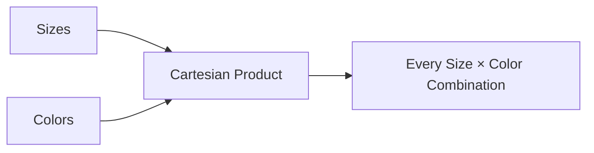

# 07- CROSS JOIN

## Overview

A `CROSS JOIN` produces the Cartesian product of two result sets. Every row from the left relation is paired with every row from the right relation.

If the left side contains `N` rows and the right side contains `M` rows, the result contains:

```text
N × M rows
```

This makes `CROSS JOIN` fundamentally different from ordinary key-based joins. There is no matching predicate restricting which rows can be paired.

```sql
SELECT
    p.id AS product_id,
    c.id AS currency_id
FROM products AS p
CROSS JOIN currencies AS c;
```

If there are:

```text
1,000 products
×
50 currencies
──────────────
50,000 result rows
```

A `CROSS JOIN` is therefore useful when **every combination is intentionally required**, but dangerous when it occurs accidentally.

## Why CROSS JOIN Exists

Many backend and data-processing problems require generating combinations rather than matching related records.

Typical examples include:

- Generating product × region combinations.
- Creating a schedule across dates and time slots.
- Generating test scenarios.
- Building feature/configuration combinations.
- Creating reporting dimensions.
- Producing availability matrices.
- Comparing every entity against every candidate.
- Generating a small reference-data matrix.

The important distinction is:

> A normal JOIN asks "which rows are related?" A CROSS JOIN asks "which combinations should exist?"

## Basic Syntax

The explicit syntax is:

```sql
SELECT
    a.column_a,
    b.column_b
FROM table_a AS a
CROSS JOIN table_b AS b;
```

Unlike an `INNER JOIN`, there is no `ON` condition.

A traditional equivalent is:

```sql
SELECT
    a.column_a,
    b.column_b
FROM table_a AS a,
     table_b AS b;
```

The explicit `CROSS JOIN` syntax is preferred because it communicates intent clearly and reduces the risk of accidental Cartesian products.

## How CROSS JOIN Works

Consider:

```text
sizes

id | name
---+------
1  | S
2  | M
3  | L
```

```text
colors

id | name
---+------
10 | Black
11 | White
```

Query:

```sql
SELECT
    s.name AS size,
    c.name AS color
FROM sizes AS s
CROSS JOIN colors AS c;
```

Result:

```text
size | color
-----+------
S    | Black
S    | White
M    | Black
M    | White
L    | Black
L    | White
```

The database generates every possible pair.



For `3 × 2` rows, the result contains `6` combinations.

## Row Cardinality

The defining property of a Cartesian product is:

```text
result_rows = left_rows × right_rows
```

For example:

| Left rows | Right rows | Result rows |
| ---: | ---: | ---: |
| 3 | 2 | 6 |
| 10 | 5 | 50 |
| 1,000 | 50 | 50,000 |
| 10,000 | 10,000 | 100,000,000 |
| 1,000,000 | 1,000,000 | 1,000,000,000,000 |

This multiplication is the primary production risk.

A query that looks harmless with development data can become extremely expensive at production scale.

## CROSS JOIN vs INNER JOIN

An `INNER JOIN` normally restricts combinations through a join predicate:

```sql
SELECT
    p.id,
    c.id
FROM products AS p
INNER JOIN categories AS c
    ON c.id = p.category_id;
```

Only related rows are returned.

A `CROSS JOIN` has no matching condition:

```sql
SELECT
    p.id,
    c.id
FROM products AS p
CROSS JOIN categories AS c;
```

Every product is paired with every category.

| Property | `INNER JOIN` | `CROSS JOIN` |
| --- | --- | --- |
| Join condition | Usually required | None |
| Matching rows only | Yes | No |
| Cartesian product | No | Yes |
| Result cardinality | Depends on matches | `N × M` |
| Typical purpose | Combine related data | Generate combinations |
| Accidental use risk | Lower | High |

## CROSS JOIN vs JOIN Without an ON Clause

Some SQL syntax allows comma-separated tables:

```sql
SELECT *
FROM products, regions;
```

This is effectively a Cartesian product.

Prefer:

```sql
SELECT *
FROM products
CROSS JOIN regions;
```

The explicit form makes the operation visible during code review.

In production code, implicit Cartesian products make it easier to miss a missing join predicate during maintenance.

## Practical Example: Product × Region

Suppose an e-commerce system needs to initialize pricing records for every product in every supported region.

```sql
SELECT
    p.id AS product_id,
    r.id AS region_id
FROM products AS p
CROSS JOIN regions AS r;
```

The result can feed an `INSERT` operation:

```sql
INSERT INTO product_region_prices (
    product_id,
    region_id
)
SELECT
    p.id,
    r.id
FROM products AS p
CROSS JOIN regions AS r
ON CONFLICT (product_id, region_id) DO NOTHING;
```

This is a legitimate use because the business rule explicitly requires a row for every product-region combination.

The database constraint should enforce the intended uniqueness:

```sql
CREATE UNIQUE INDEX ux_product_region
ON product_region_prices (product_id, region_id);
```

The `CROSS JOIN` generates combinations; the uniqueness constraint protects the resulting data model.

## Practical Example: Date × Time Slot

Scheduling systems often need to generate potential appointment slots.

Suppose:

```text
dates
-----
2026-09-01
2026-09-02
2026-09-03
```

and:

```text
time_slots
----------
09:00
10:00
11:00
```

Then:

```sql
SELECT
    d.service_date,
    t.start_time
FROM service_dates AS d
CROSS JOIN time_slots AS t
ORDER BY
    d.service_date,
    t.start_time;
```

This produces:

```text
2026-09-01  09:00
2026-09-01  10:00
2026-09-01  11:00
2026-09-02  09:00
2026-09-02  10:00
2026-09-02  11:00
2026-09-03  09:00
2026-09-03  10:00
2026-09-03  11:00
```

In a production scheduling system, additional constraints would usually be applied for:

- Holidays.
- Staff availability.
- Existing bookings.
- Resource capacity.
- Time zones.
- Business hours.
- Blackout periods.

## CROSS JOIN with Filtering

A `CROSS JOIN` can be followed by a `WHERE` clause:

```sql
SELECT
    p.id AS product_id,
    r.id AS region_id
FROM products AS p
CROSS JOIN regions AS r
WHERE r.is_active = true;
```

This still conceptually creates combinations between the participating rows, with filtering applied to the final relational expression.

A useful pattern is to reduce each input before the Cartesian product:

```sql
SELECT
    p.id AS product_id,
    r.id AS region_id
FROM (
    SELECT id
    FROM products
    WHERE is_active = true
) AS p
CROSS JOIN (
    SELECT id
    FROM regions
    WHERE is_active = true
) AS r;
```

This communicates that inactive entities are not part of the combination space.

The optimizer may push predicates down automatically, but query design should still express the intended logical scope clearly.

## CROSS JOIN with LATERAL

A senior-level pattern is combining a `CROSS JOIN` with `LATERAL` when each left-side row needs a separately evaluated set of rows.

For example, PostgreSQL can generate a small number of candidate time slots for each resource:

```sql
SELECT
    r.id AS resource_id,
    slots.start_time
FROM resources AS r
CROSS JOIN LATERAL generate_series(
    r.opens_at,
    r.closes_at - interval '30 minutes',
    interval '30 minutes'
) AS slots(start_time)
WHERE r.is_active = true;
```

Here, the right-side expression is evaluated in the context of each resource.

This is different from a simple Cartesian product between two independent tables.

`LATERAL` is useful when the generated right-side relation depends on columns from the left-side row.

## CROSS JOIN with VALUES

For small, static dimensions, PostgreSQL's `VALUES` expression can be combined with `CROSS JOIN`.

```sql
SELECT
    p.id AS product_id,
    v.channel
FROM products AS p
CROSS JOIN (
    VALUES
        ('web'),
        ('mobile'),
        ('partner')
) AS v(channel);
```

This can be useful for controlled batch generation or small reporting matrices.

Do not use a large hard-coded `VALUES` list as a substitute for properly modeled persistent data.

## CROSS JOIN and NULLs

`CROSS JOIN` does not use equality matching, so NULL behavior differs from key-based joins.

If a row contains NULL:

```text
id | value
---+------
1  | NULL
```

it is still paired with every row on the other side.

For example:

```sql
SELECT
    a.value,
    b.value
FROM a
CROSS JOIN b;
```

A NULL value remains NULL in the output; it does not prevent the row from participating in the Cartesian product.

This is an important distinction from joins whose `ON` predicate can fail because of NULL comparison semantics.

## Filtering Before the Cartesian Product

When one or both inputs are large, reduce the input sets before generating combinations.

Prefer:

```sql
SELECT
    p.id,
    r.id
FROM (
    SELECT id
    FROM products
    WHERE status = 'active'
) AS p
CROSS JOIN (
    SELECT id
    FROM regions
    WHERE status = 'active'
) AS r;
```

over generating combinations across all rows and filtering later when the logical requirement permits early reduction.

For example, if there are:

```text
10 million products
×
200 regions
```

the unrestricted combination space is:

```text
2 billion rows
```

If only 10,000 active products and 20 active regions matter:

```text
10,000 × 20 = 200,000 rows
```

The difference is substantial.

Modern optimizers can often perform predicate pushdown, but engineers should still reason about **input cardinality before multiplication**.

## Performance Characteristics

A `CROSS JOIN` can become one of the most expensive operations in a query because its output grows multiplicatively.

Important factors include:

- Number of rows on each side.
- Width of each row.
- Additional filtering.
- Sort operations.
- Aggregation.
- Materialization.
- Network transfer.
- Temporary disk usage.
- Memory available to the database.
- Downstream operations.

For production workloads, inspect the actual execution plan:

```sql
EXPLAIN (ANALYZE, BUFFERS)
SELECT
    p.id,
    r.id
FROM products AS p
CROSS JOIN regions AS r
WHERE p.is_active = true
  AND r.is_active = true;
```

Look for:

- Actual row counts.
- Estimated row counts.
- Join strategy.
- Filter selectivity.
- Memory consumption.
- Temporary file usage.
- Execution time.
- Rows removed by filters.

The most important metric is often the size of the intermediate result, not simply whether an index exists.

## Query Planning

A database optimizer can choose different physical strategies for implementing a Cartesian product and subsequent operations.

For a pure Cartesian product, there is no join predicate to use for matching. The optimizer therefore focuses on efficiently producing or consuming the required combinations.

If the query includes selective predicates, the optimizer may push those filters toward the underlying scans.

This means:

```sql
FROM products
CROSS JOIN regions
WHERE products.is_active
  AND regions.is_active
```

does not necessarily mean the engine literally materializes all products × all regions before applying the filters.

However, engineers should never rely on assumptions about execution order. Use:

```sql
EXPLAIN (ANALYZE, BUFFERS)
```

to verify behavior for performance-critical queries.

## Accidental Cartesian Products

One of the most dangerous uses of `CROSS JOIN` is accidental.

For example:

```sql
SELECT
    o.id,
    u.id
FROM orders AS o, users AS u;
```

If the developer intended:

```sql
SELECT
    o.id,
    u.id
FROM orders AS o
JOIN users AS u
    ON u.id = o.user_id;
```

the first query can produce an enormous result.

If there are:

```text
5 million orders
×
2 million users
```

the Cartesian space is:

```text
10 trillion rows
```

Even if a downstream filter eventually reduces the output, the query may consume excessive CPU, memory, I/O, temporary storage, and execution time.

Use explicit JOIN syntax and code review to reduce this class of failure.

## CROSS JOIN in Backend Applications

A `CROSS JOIN` is often better suited to:

- Batch jobs.
- Data pipelines.
- Reporting queries.
- ETL workloads.
- Data initialization.
- Analytics.

It is usually inappropriate to generate a huge Cartesian product inside a latency-sensitive API request.

For example, avoid an endpoint that executes a query producing millions of combinations merely to return the first few results.

Instead:

```text
API request
    │
    ▼
FastAPI / Django
    │
    ▼
Read precomputed or bounded data
```

For large combination-generation jobs:

```text
Celery / Kubernetes Job
        │
        ▼
PostgreSQL
        │
        ▼
Batch-generated records
        │
        ├── Audit data
        ├── Metrics
        └── Application tables
```

Bound the work and process it incrementally when the combination space is large.

## Pagination Does Not Eliminate the Cost

A common misconception is that:

```sql
SELECT ...
FROM large_a
CROSS JOIN large_b
LIMIT 100;
```

is automatically cheap.

`LIMIT` may allow the database to stop early in some execution plans, but it does not make the underlying Cartesian relationship small.

If the query also includes:

```sql
ORDER BY
```

or aggregation, the database may need to process a substantial portion of the result before it can determine which rows belong in the final output.

Always inspect the execution plan for large datasets.

## CROSS JOIN vs UNION

`CROSS JOIN` and `UNION` operate on fundamentally different dimensions.

`CROSS JOIN` combines columns by generating row combinations:

```sql
SELECT
    p.id,
    r.id
FROM products AS p
CROSS JOIN regions AS r;
```

`UNION` appends rows from compatible result sets:

```sql
SELECT id, name
FROM products

UNION

SELECT id, name
FROM archived_products;
```

| Requirement | Use |
| --- | --- |
| Generate every combination | `CROSS JOIN` |
| Match related rows | `JOIN` |
| Append compatible rows | `UNION` / `UNION ALL` |
| Compare two datasets by key | JOIN / set operators depending on requirement |

Do not use `CROSS JOIN` merely because two tables need to appear in one query.

## CROSS JOIN vs INNER JOIN with a Constant Predicate

These expressions can represent a Cartesian relationship:

```sql
FROM a
CROSS JOIN b
```

and:

```sql
FROM a
INNER JOIN b
    ON TRUE
```

The explicit `CROSS JOIN` is preferable because it states the intended operation directly.

Avoid:

```sql
INNER JOIN b
    ON 1 = 1
```

in application code. It obscures the fact that no relationship is being enforced.

## Data Modeling Considerations

A Cartesian product should represent a real business requirement, not compensate for missing relationships.

For example, if the requirement is:

> Every product can be sold in every supported region.

Then:

```text
products × regions
```

may be appropriate.

But if:

> Each product is available only in specific regions.

then a direct Cartesian product is usually wrong.

A better model might be:

```text
products
   │
   │
   ▼
product_regions
   ▲
   │
   │
regions
```

with:

```sql
SELECT
    p.id,
    r.id
FROM product_regions AS pr
JOIN products AS p
    ON p.id = pr.product_id
JOIN regions AS r
    ON r.id = pr.region_id;
```

The database should model real relationships explicitly when not every combination is valid.

## Security Considerations

The main security risk is not SQL injection specific to `CROSS JOIN`; it is uncontrolled data exposure and resource consumption.

A Cartesian query can accidentally expose:

- Every customer against every tenant.
- Internal records across authorization boundaries.
- Data combinations that should never be visible together.

Tenant isolation must remain explicit.

For example:

```sql
SELECT
    p.id AS product_id,
    r.id AS region_id
FROM products AS p
CROSS JOIN regions AS r
WHERE p.tenant_id = $1
  AND r.tenant_id = $1;
```

The application should use parameterized queries rather than interpolating tenant IDs or other external values into SQL.

For large or user-controlled combination spaces, enforce server-side limits. An API should not allow a client to request arbitrary Cartesian expansion without bounded resource controls.

## Reliability and Cost Considerations

A runaway Cartesian query can affect more than the query itself.

It can cause:

- Database CPU saturation.
- Memory pressure.
- Temporary disk growth.
- Connection pool exhaustion.
- Increased query latency for unrelated requests.
- Replica lag.
- Increased cloud database costs.
- Failed batch jobs.
- Cascading application timeouts.

In a production environment:

- Test combination queries with production-scale cardinalities.
- Set appropriate statement or job timeouts.
- Avoid unbounded user-controlled Cartesian operations.
- Monitor query latency and resource consumption.
- Use asynchronous processing for large workloads.
- Consider precomputing frequently requested combinations.
- Keep database connection pools bounded.

On managed PostgreSQL infrastructure such as Amazon RDS or Aurora PostgreSQL, a poorly bounded Cartesian query can consume shared database resources and affect unrelated application traffic.

## Monitoring

For production systems, monitor queries that generate large combinations.

Useful signals include:

| Metric | Why it matters |
| --- | --- |
| Query execution time | Detects slow Cartesian workloads |
| Rows returned | Detects unexpected expansion |
| Rows processed | Reveals intermediate workload |
| CPU utilization | Shows compute pressure |
| Memory usage | Detects hash/sort pressure |
| Temporary disk usage | Indicates spill-to-disk behavior |
| Database connections | Detects pool saturation |
| Replica lag | Shows downstream database impact |

PostgreSQL tooling such as `pg_stat_statements` can help identify expensive recurring queries.

For batch workloads, also record:

```text
job_id
input_row_count
expected_combination_count
actual_row_count
duration
status
```

This makes unexpected cardinality increases observable.

## Common Mistakes and Pitfalls

### Using CROSS JOIN When a Relationship Exists

Bad:

```sql
SELECT *
FROM orders
CROSS JOIN users;
```

If an order belongs to one user, use:

```sql
SELECT *
FROM orders AS o
JOIN users AS u
    ON u.id = o.user_id;
```

The join condition represents the domain relationship.

### Forgetting the Multiplication Effect

Before executing:

```sql
FROM a
CROSS JOIN b
```

calculate:

```text
estimated result = rows(a) × rows(b)
```

Do this especially for production tables.

### Applying Filters Too Late

Avoid unnecessarily expanding inactive or irrelevant data.

Prefer reducing the input relation when possible:

```sql
FROM (
    SELECT id
    FROM products
    WHERE is_active = true
) AS p
CROSS JOIN regions AS r;
```

The optimizer may perform equivalent predicate pushdown, but explicit logical scope improves readability and reviewability.

### Using DISTINCT to Hide a Modeling Problem

Avoid:

```sql
SELECT DISTINCT ...
FROM a
CROSS JOIN b;
```

as a fix for unexpectedly large output.

`DISTINCT` can hide the underlying issue and introduce additional sort or hash work.

Determine whether the Cartesian relationship itself is valid.

### Generating Huge Results in an API Request

Do not make a synchronous Django or FastAPI endpoint generate millions of combinations unless the workload is intentionally bounded and tested.

Move large operations to:

- Celery.
- Kubernetes Jobs.
- Batch workers.
- Data-processing infrastructure.

### Assuming LIMIT Makes the Query Safe

`LIMIT` limits returned rows, not necessarily all work required by the execution plan.

Sorting, aggregation, filtering, and other operations can still require substantial processing.

### Missing Tenant Boundaries

A Cartesian query across multi-tenant tables can accidentally create combinations between unrelated tenants.

Always include the appropriate tenant boundary in the query.

## Interview Traps

| Question | Correct answer |
| --- | --- |
| What does CROSS JOIN return? | Every combination of rows from both inputs. |
| How many rows does `N × M` produce? | `N * M`, assuming both inputs are finite and no later filtering changes the result. |
| Does CROSS JOIN require an `ON` condition? | No. |
| Can CROSS JOIN produce duplicate-looking rows? | Yes, if the source rows themselves are duplicates or projected columns are not unique. |
| Is `CROSS JOIN` the same as `INNER JOIN ... ON TRUE`? | They represent the same Cartesian relationship, but `CROSS JOIN` communicates intent more clearly. |
| Why can CROSS JOIN be dangerous? | Its cardinality grows multiplicatively. |
| Does an index prevent Cartesian explosion? | No. Indexes do not change the fundamental `N × M` relationship. |
| Is CROSS JOIN always bad? | No. It is appropriate when every combination is intentionally required. |
| Can CROSS JOIN be filtered? | Yes, using `WHERE` or by restricting the input relations. |
| Does CROSS JOIN match NULLs? | There is no matching predicate; rows containing NULL are still paired with every row on the other side. |
| When is CROSS JOIN useful in backend systems? | Batch generation, scheduling, reporting, test matrices, and controlled combination generation. |
| What is the biggest production concern? | Unexpected cardinality and resource consumption. |
| Should CROSS JOIN usually be used in a high-throughput API? | Only when the result space is explicitly bounded and operationally safe. |

## Production Checklist

Before deploying a query containing `CROSS JOIN`, verify:

- [ ] The Cartesian product is intentional.
- [ ] The business requirement genuinely needs every combination.
- [ ] Input cardinalities are known.
- [ ] Expected output cardinality has been calculated.
- [ ] Large or inactive input sets are reduced where appropriate.
- [ ] Multi-tenant boundaries are explicitly enforced.
- [ ] The result grain is clearly defined.
- [ ] Duplicate source rows have been considered.
- [ ] The query has been tested with production-scale data.
- [ ] `EXPLAIN (ANALYZE, BUFFERS)` has been reviewed for performance-sensitive workloads.
- [ ] API requests cannot trigger unbounded Cartesian expansion.
- [ ] Large workloads have appropriate statement or job timeouts.
- [ ] Batch processing is used when synchronous execution is inappropriate.
- [ ] Database CPU, memory, temporary storage, and connection usage are monitored.
- [ ] Frequently requested combinations are considered for precomputation.
- [ ] Data-model relationships are represented with proper join tables when not every combination is valid.

## Key Takeaways

- **CROSS JOIN produces the Cartesian product: `N` rows × `M` rows = `N × M` combinations.**
- **Use it intentionally for controlled combination-generation problems such as product-region matrices, schedules, reports, and test scenarios.**
- **Its primary production risk is cardinality explosion, which can cause severe CPU, memory, I/O, latency, and cost problems.**
- **Reduce input cardinality, enforce tenant boundaries, and validate execution plans before running large Cartesian workloads.**
- **If a real business relationship exists between entities, model and join that relationship instead of using CROSS JOIN to compensate for missing relational structure.**