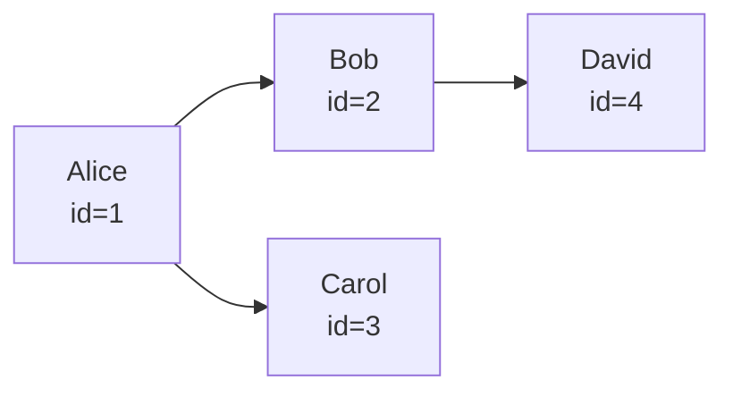

# 08- SELF JOIN

## Overview

A `SELF JOIN` is a join where a table is joined to itself. It is used when rows within the same table have a meaningful relationship with other rows in that table.

The table is referenced multiple times using different aliases so each reference represents a distinct logical role.

A common example is an employee hierarchy:

```text
employees
------------------------------------------------
id | name          | manager_id
---+---------------+-----------
1  | Alice         | NULL
2  | Bob           | 1
3  | Carol         | 1
4  | David         | 2
```

Here, `manager_id` references another row in the same `employees` table.

A self join can retrieve the employee and their manager:

```sql
SELECT
    e.id AS employee_id,
    e.name AS employee_name,
    m.id AS manager_id,
    m.name AS manager_name
FROM employees AS e
LEFT JOIN employees AS m
    ON m.id = e.manager_id;
```

The key idea is:

> A self join is not a separate join type. It is a normal join where the same table participates more than once.

## Why SELF JOIN Exists

Relational data frequently contains relationships between rows of the same entity.

Common examples include:

- Employee → manager.
- Category → parent category.
- User → referrer.
- Organization → parent organization.
- Location → parent location.
- Comment → parent comment.
- Product → replacement product.
- Account → parent account.
- Document → previous version.
- Task → parent task.

Without a self join, retrieving related rows from the same table would require multiple queries or application-side processing.

A self join allows the database to resolve these relationships declaratively.

## Basic Syntax

The general pattern is:

```sql
SELECT
    a.column,
    b.column
FROM table_name AS a
JOIN table_name AS b
    ON b.related_column = a.column;
```

The aliases are essential because SQL needs to distinguish the two logical instances of the table.

For example:

```sql
FROM employees AS e
JOIN employees AS m
```

means:

```text
e = employee role
m = manager role
```

Both references point to the same physical table.

## How SELF JOIN Works

Consider:

```text
employees

id | name  | manager_id
---+-------+-----------
1  | Alice | NULL
2  | Bob   | 1
3  | Carol | 1
4  | David | 2
```

The query:

```sql
SELECT
    e.name AS employee,
    m.name AS manager
FROM employees AS e
LEFT JOIN employees AS m
    ON m.id = e.manager_id;
```

logically evaluates relationships like:

```text
Bob   → Alice
Carol → Alice
David → Bob
Alice → NULL
```

Result:

```text
employee | manager
---------+--------
Alice    | NULL
Bob      | Alice
Carol    | Alice
David    | Bob
```

The same table is acting as both sides of the relationship.



The database does not duplicate the physical table. The optimizer creates a plan containing separate logical references to the same relation.

## INNER SELF JOIN

Use an `INNER JOIN` when only rows with a matching related row should appear.

```sql
SELECT
    e.name AS employee,
    m.name AS manager
FROM employees AS e
INNER JOIN employees AS m
    ON m.id = e.manager_id;
```

Alice is excluded because she has no manager.

Result:

```text
employee | manager
---------+--------
Bob      | Alice
Carol    | Alice
David    | Bob
```

This is useful when the relationship is mandatory for the result being produced.

## LEFT SELF JOIN

A `LEFT JOIN` preserves the primary row even when the related row does not exist.

```sql
SELECT
    e.name AS employee,
    m.name AS manager
FROM employees AS e
LEFT JOIN employees AS m
    ON m.id = e.manager_id;
```

Result:

```text
employee | manager
---------+--------
Alice    | NULL
Bob      | Alice
Carol    | Alice
David    | Bob
```

This is generally preferable for organizational hierarchies when top-level entities are valid records and should not disappear from reports.

## Choosing the Join Type

| Requirement | Recommended join |
| --- | --- |
| Only rows with a related row | `INNER JOIN` |
| Keep every source row | `LEFT JOIN` |
| Find rows without a parent | `LEFT JOIN` + `IS NULL` |
| Generate combinations between rows | `CROSS JOIN` |
| Compare rows within the same table | `SELF JOIN` using the appropriate join type |

A self join describes **which relation is being joined to itself**. `INNER`, `LEFT`, `RIGHT`, and other join semantics determine which rows survive.

## Finding Rows Without a Parent

A common self-join pattern is finding root or orphan records.

For example, to find employees without a manager:

```sql
SELECT
    e.id,
    e.name
FROM employees AS e
LEFT JOIN employees AS m
    ON m.id = e.manager_id
WHERE m.id IS NULL;
```

This returns employees whose `manager_id` does not resolve to an employee, including top-level employees whose `manager_id` is `NULL`.

To specifically distinguish invalid references from legitimate roots, inspect the source column as well:

```sql
SELECT
    e.id,
    e.name,
    e.manager_id
FROM employees AS e
LEFT JOIN employees AS m
    ON m.id = e.manager_id
WHERE e.manager_id IS NOT NULL
  AND m.id IS NULL;
```

This identifies broken foreign-key relationships if the database does not already enforce them.

## Comparing Rows Within the Same Table

Self joins are also useful for finding relationships between rows that are not represented by a direct foreign key.

For example, find employees in the same department who have a higher salary:

```sql
SELECT
    e1.name AS employee,
    e1.salary AS employee_salary,
    e2.name AS higher_paid_colleague,
    e2.salary AS colleague_salary
FROM employees AS e1
JOIN employees AS e2
    ON e2.department_id = e1.department_id
   AND e2.salary > e1.salary;
```

This compares each employee against other employees in the same department.

The result can contain multiple rows per employee because an employee may have several higher-paid colleagues.

## Avoiding Duplicate Pairs

When comparing rows against one another, a self join can produce symmetric pairs.

For example:

```sql
SELECT
    a.name,
    b.name
FROM employees AS a
JOIN employees AS b
    ON a.department_id = b.department_id
   AND a.id <> b.id;
```

For employees Alice and Bob, this can produce both:

```text
Alice | Bob
Bob   | Alice
```

If the relationship should be unordered, impose an ordering:

```sql
SELECT
    a.name AS employee_a,
    b.name AS employee_b
FROM employees AS a
JOIN employees AS b
    ON a.department_id = b.department_id
   AND a.id < b.id;
```

Now each pair appears once.

This pattern is important for:

- Duplicate detection.
- Pairwise comparisons.
- Matching algorithms.
- Conflict detection.
- Similarity analysis.

## Detecting Duplicate Records

A self join can identify potential duplicate records when no direct uniqueness constraint exists.

For example:

```sql
SELECT
    a.id AS record_a,
    b.id AS record_b,
    a.email
FROM users AS a
JOIN users AS b
    ON a.email = b.email
   AND a.id < b.id;
```

The `a.id < b.id` condition prevents returning the same pair twice.

However, if duplicate values are prohibited by the business model, the better long-term solution is a database constraint:

```sql
CREATE UNIQUE INDEX ux_users_email
ON users (email);
```

A self join can detect data-quality problems, but it should not normally replace appropriate database constraints.

## Self JOIN vs GROUP BY

Some duplicate-detection problems can also be solved with aggregation.

Self join:

```sql
SELECT
    a.id,
    b.id
FROM users AS a
JOIN users AS b
    ON a.email = b.email
   AND a.id < b.id;
```

Aggregation:

```sql
SELECT
    email,
    COUNT(*) AS duplicate_count
FROM users
GROUP BY email
HAVING COUNT(*) > 1;
```

The choice depends on the required output.

| Requirement | Better fit |
| --- | --- |
| Return duplicate groups | `GROUP BY` |
| Return pairs of duplicate rows | Self join |
| Return aggregate counts | `GROUP BY` |
| Compare individual rows | Self join |

Do not use a self join when aggregation expresses the requirement more directly.

## Self JOIN with Multiple Levels

A self join can traverse a fixed number of hierarchy levels.

For example:

```sql
SELECT
    e.name AS employee,
    m.name AS manager,
    d.name AS director
FROM employees AS e
LEFT JOIN employees AS m
    ON m.id = e.manager_id
LEFT JOIN employees AS d
    ON d.id = m.manager_id;
```

The logical relationship is:

```text
employee
   │
   ▼
manager
   │
   ▼
director
```

This is appropriate when the hierarchy depth is known and small.

For example, if an application guarantees exactly:

```text
Employee → Manager → Director
```

a few explicit joins are simple and efficient.

For arbitrary-depth hierarchies, repeated self joins are usually the wrong tool.

## Recursive Hierarchies

When the hierarchy can have an arbitrary depth, PostgreSQL and other SQL databases with recursive CTE support provide a better approach.

Example:

```sql
WITH RECURSIVE org_tree AS (
    SELECT
        id,
        name,
        manager_id,
        0 AS depth
    FROM employees
    WHERE id = $1

    UNION ALL

    SELECT
        e.id,
        e.name,
        e.manager_id,
        ot.depth + 1
    FROM employees AS e
    JOIN org_tree AS ot
        ON e.manager_id = ot.id
)
SELECT
    id,
    name,
    manager_id,
    depth
FROM org_tree
ORDER BY depth, id;
```

This can traverse an arbitrary hierarchy starting from a selected employee.

The distinction is important:

```text
Fixed depth
    → self joins

Unknown/arbitrary depth
    → recursive CTE or specialized hierarchy model
```

## Hierarchical Data Modeling

A common schema is the adjacency-list model:

```sql
CREATE TABLE employees (
    id bigint PRIMARY KEY,
    name text NOT NULL,
    manager_id bigint REFERENCES employees(id)
);
```

The self-referencing foreign key provides the relationship:

```text
employees.id
      ▲
      │
employees.manager_id
```

This provides database-level referential integrity.

It prevents an employee from referencing a manager that does not exist, but it does not automatically prevent every possible hierarchy problem.

For example, application or database logic may still need to prevent cycles such as:

```text
Alice → Bob
Bob   → Carol
Carol → Alice
```

A recursive hierarchy query can otherwise loop indefinitely unless the database/query has appropriate safeguards.

## Production Hierarchy Models

For simple parent-child relationships, an adjacency list is often sufficient:

```text
id
parent_id
```

For large or frequently queried hierarchies, other models may be appropriate.

| Model | Strength | Trade-off |
| --- | --- | --- |
| Adjacency list | Simple writes and schema | Recursive reads |
| Materialized path | Efficient subtree queries | Path maintenance |
| Nested sets | Efficient hierarchy reads | Expensive structural updates |
| Closure table | Efficient ancestor/descendant queries | Additional storage and write complexity |

A self join is most directly associated with the adjacency-list model.

Do not redesign the hierarchy model solely to avoid writing a self join. Choose the model based on read/write patterns and consistency requirements.

## Indexing SELF JOINs

The join condition determines which indexes matter.

For:

```sql
SELECT
    e.name,
    m.name
FROM employees AS e
LEFT JOIN employees AS m
    ON m.id = e.manager_id;
```

`employees.id` is normally indexed because it is the primary key.

If the application frequently starts from a manager and retrieves direct reports:

```sql
SELECT
    e.id,
    e.name
FROM employees AS e
WHERE e.manager_id = $1;
```

an index on `manager_id` is useful:

```sql
CREATE INDEX ix_employees_manager_id
ON employees (manager_id);
```

For high-volume systems, consider the access direction rather than assuming that the primary key alone solves every hierarchy query.

## Query Performance

A self join is not inherently expensive. Its cost depends on:

- Number of rows.
- Join selectivity.
- Index availability.
- Row width.
- Join type.
- Filtering.
- Data distribution.
- Number of hierarchy levels.
- Result cardinality.

For performance-sensitive queries, inspect the actual plan:

```sql
EXPLAIN (ANALYZE, BUFFERS)
SELECT
    e.id,
    e.name,
    m.name AS manager_name
FROM employees AS e
LEFT JOIN employees AS m
    ON m.id = e.manager_id
WHERE e.department_id = $1;
```

Look for:

- Estimated versus actual row counts.
- Sequential scans on unexpectedly large tables.
- Nested-loop behavior.
- Join selectivity.
- Buffer reads.
- Filter effectiveness.
- Execution time.

An index is useful only when it aligns with the actual access pattern and data distribution.

## Self JOIN in Backend Applications

Self joins commonly appear in backend APIs.

For example, an organization endpoint might return employees with their direct manager:

```sql
SELECT
    e.id,
    e.name,
    m.id AS manager_id,
    m.name AS manager_name
FROM employees AS e
LEFT JOIN employees AS m
    ON m.id = e.manager_id
WHERE e.organization_id = $1
ORDER BY e.name;
```

A Django application can express a similar relationship using a self-referencing foreign key:

```python
class Employee(models.Model):
    name = models.CharField(max_length=200)
    manager = models.ForeignKey(
        "self",
        null=True,
        blank=True,
        on_delete=models.PROTECT,
        related_name="direct_reports",
    )
```

For a read-heavy API, fetch the required relationship efficiently rather than triggering one database query per employee.

For example, use Django's `select_related()` for the single-valued manager relationship:

```python
employees = (
    Employee.objects
    .filter(organization_id=organization_id)
    .select_related("manager")
    .order_by("name")
)
```

This avoids an N+1 query pattern when serializing each employee's manager.

## N+1 Query Problem

A self-referencing relationship can easily create an N+1 query problem.

Bad pattern:

```python
employees = Employee.objects.filter(organization_id=organization_id)

for employee in employees:
    print(employee.manager.name if employee.manager else None)
```

Depending on ORM behavior and access patterns, manager access can trigger additional queries.

Prefer:

```python
employees = (
    Employee.objects
    .filter(organization_id=organization_id)
    .select_related("manager")
)
```

The principle is broader than Django:

> If the application knows it needs a related row for every result, retrieve the relationship deliberately rather than issuing one query per row.

## SELF JOIN and NULL Semantics

Consider:

```sql
employees.manager_id
```

where top-level employees have:

```text
manager_id = NULL
```

This condition:

```sql
m.id = e.manager_id
```

does not match when `e.manager_id` is `NULL`.

That is why:

```sql
LEFT JOIN
```

is required when top-level employees must remain in the result.

Using:

```sql
INNER JOIN
```

would remove them.

This is a common source of incorrect organizational reports.

## Security and Multi-Tenancy

Self joins must respect tenant boundaries.

Suppose employees are partitioned by organization:

```sql
SELECT
    e.id,
    e.name,
    m.name AS manager_name
FROM employees AS e
LEFT JOIN employees AS m
    ON m.id = e.manager_id
WHERE e.organization_id = $1;
```

If foreign keys guarantee that managers belong to the same organization, this may be sufficient.

If that invariant is not guaranteed by the data model, the join should explicitly enforce the boundary:

```sql
SELECT
    e.id,
    e.name,
    m.name AS manager_name
FROM employees AS e
LEFT JOIN employees AS m
    ON m.id = e.manager_id
   AND m.organization_id = e.organization_id
WHERE e.organization_id = $1;
```

The exact approach depends on the database constraints and tenancy model.

The important production principle is:

> Authorization boundaries should not depend solely on application assumptions when the query can accidentally cross those boundaries.

## Reliability Considerations

Hierarchical data introduces integrity risks that ordinary joins do not always reveal.

Protect against:

- Missing parent records.
- Circular references.
- Unexpected hierarchy depth.
- Deleted parent entities.
- Cross-tenant references.
- Orphaned records.
- Excessive recursive traversal.
- Large subtree queries.

Useful safeguards include:

- Self-referencing foreign keys.
- Appropriate `ON DELETE` behavior.
- Application validation.
- Recursive-query depth limits where appropriate.
- Database constraints.
- Monitoring for invalid hierarchy states.
- Tests covering root, leaf, intermediate, and cyclic scenarios.

For large recursive workloads, avoid putting unrestricted traversal directly on latency-sensitive API paths.

## Common Mistakes and Pitfalls

### Forgetting Table Aliases

Incorrect:

```sql
SELECT
    employees.name,
    employees.name
FROM employees
JOIN employees
    ON employees.id = employees.manager_id;
```

The query becomes ambiguous because both references have the same identifier.

Use:

```sql
SELECT
    e.name AS employee,
    m.name AS manager
FROM employees AS e
JOIN employees AS m
    ON m.id = e.manager_id;
```

### Using INNER JOIN When Root Rows Matter

Incorrect:

```sql
FROM employees AS e
JOIN employees AS m
    ON m.id = e.manager_id
```

This removes employees with no manager.

Use `LEFT JOIN` when root rows must be retained.

### Creating Symmetric Duplicate Pairs

This:

```sql
ON a.department_id = b.department_id
AND a.id <> b.id
```

can return both:

```text
A → B
B → A
```

Use:

```sql
AND a.id < b.id
```

when the relationship is unordered.

### Treating Self JOIN as Recursive Traversal

A self join handles a fixed relationship between two logical table instances.

It does not automatically traverse:

```text
parent
  ↓
child
  ↓
grandchild
  ↓
great-grandchild
```

For arbitrary-depth traversal, use a recursive CTE or an appropriate hierarchy model.

### Ignoring Cycles

A self-referencing foreign key does not necessarily prevent cycles.

For example:

```text
A.manager_id = B
B.manager_id = A
```

can create a cycle unless additional constraints or application logic prevent it.

Recursive queries should be designed with cycle handling where the data model permits cycles.

### Missing an Index on the Parent Reference

The primary key on `id` helps resolve:

```sql
m.id = e.manager_id
```

but queries retrieving children by parent may need:

```sql
CREATE INDEX ix_employees_manager_id
ON employees (manager_id);
```

Index based on actual query patterns.

### Using a Self JOIN for an Aggregation Problem

If the requirement is simply:

> Find departments with more than five employees.

A self join is inappropriate.

Use:

```sql
SELECT
    department_id,
    COUNT(*) AS employee_count
FROM employees
GROUP BY department_id
HAVING COUNT(*) > 5;
```

Choose the relational operation that matches the question.

## Interview Traps

| Question | Correct answer |
| --- | --- |
| What is a SELF JOIN? | Joining a table to itself using different aliases. |
| Is SELF JOIN a separate SQL JOIN type? | No. It is a normal join involving the same table more than once. |
| Why are aliases required? | They distinguish the logical table references and prevent ambiguity. |
| How do you find employees and their managers? | Self join `employees` as employee to `employees` as manager. |
| Why use `LEFT JOIN` for organizational hierarchies? | To retain top-level employees with no manager. |
| How do you find employees without valid managers? | `LEFT JOIN` and filter for a NULL parent, while distinguishing legitimate roots if necessary. |
| How do you avoid symmetric duplicate pairs? | Use an asymmetric condition such as `a.id < b.id`. |
| Can a SELF JOIN traverse arbitrary hierarchy depth? | Not by itself; use a recursive CTE or another hierarchy model. |
| Does a self-referencing foreign key prevent cycles? | Not necessarily. Additional validation or modeling constraints may be required. |
| Is a SELF JOIN always expensive? | No. Cost depends on cardinality, selectivity, indexes, and execution plan. |
| What causes N+1 problems with self-referencing ORM relationships? | Accessing the related row separately for each parent result. |
| How can Django avoid manager N+1 queries? | Use `select_related("manager")` for the foreign-key relationship. |

## Production Checklist

Before deploying a self-join query, verify:

- [ ] Both logical table roles have clear aliases.
- [ ] The join direction matches the intended relationship.
- [ ] `INNER` versus `LEFT` semantics have been deliberately chosen.
- [ ] Root and orphan records are handled correctly.
- [ ] Duplicate or symmetric pairs are controlled where necessary.
- [ ] Self-referencing foreign keys enforce referential integrity where appropriate.
- [ ] Parent-reference indexes exist for frequent child-by-parent queries.
- [ ] Tenant boundaries are enforced.
- [ ] Cycles are prevented or explicitly handled if possible.
- [ ] Recursive traversal is bounded for arbitrary-depth hierarchies.
- [ ] ORM usage does not introduce N+1 queries.
- [ ] Performance-sensitive queries have been tested with realistic data volumes.
- [ ] `EXPLAIN (ANALYZE, BUFFERS)` has been reviewed where appropriate.
- [ ] Deletion behavior is explicitly defined for parent-child relationships.
- [ ] Hierarchy-specific integrity failures are observable and testable.

## Key Takeaways

- **A SELF JOIN joins a table to itself using aliases that represent different logical roles.**
- **Use it for same-table relationships such as employee-manager, parent-child, duplicate detection, and row-to-row comparisons.**
- **Choose `INNER` versus `LEFT` based on whether unmatched source rows must remain in the result.**
- **Use asymmetric conditions such as `a.id < b.id` to avoid duplicate symmetric pairs when comparing rows.**
- **For arbitrary-depth hierarchies, use recursive CTEs or a hierarchy-specific data model rather than chaining an unbounded number of self joins.**