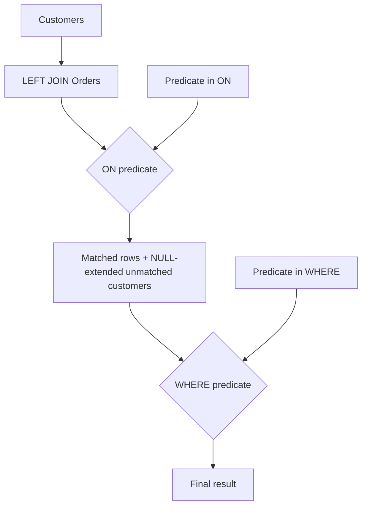

# 11- ON vs WHERE in JOINs

## Overview

`ON` and `WHERE` both contain predicates, but they operate at different stages of SQL query semantics. Understanding the distinction is essential for writing correct `JOIN` queries, particularly when using `LEFT JOIN`, `RIGHT JOIN`, or `FULL OUTER JOIN`.

The core rule is:

> **Use `ON` to define which rows participate in the join. Use `WHERE` to filter the rows produced by the `FROM`/`JOIN` operation.**

For `INNER JOIN`, moving many predicates between `ON` and `WHERE` produces the same logical result. For outer joins, moving a predicate can change the result set by removing rows that the outer join was specifically intended to preserve.

This distinction matters in production systems because an apparently harmless predicate move can change:

- Whether unmatched parent rows are returned.
- Result cardinality.
- Aggregate values.
- Pagination behavior.
- API response correctness.
- Query performance.
- Authorization and tenant-isolation semantics.

## The Core Difference

Consider:

```sql
SELECT
    c.id,
    o.id AS order_id
FROM customers AS c
LEFT JOIN orders AS o
    ON o.customer_id = c.id
WHERE o.status = 'paid';
```

The query has two logical operations:

```text
customers
    │
    │ LEFT JOIN using ON
    ▼
customers + matching orders
    │
    │ WHERE
    ▼
rows satisfying o.status = 'paid'
```

The `ON` condition determines how rows are matched.

The `WHERE` condition determines which rows survive after the join result has been formed.

For an outer join, that difference is observable.

## Logical Query Processing

SQL is written in one order but logically evaluated in a different conceptual order.

A simplified model is:

```text
FROM
  ↓
JOIN / ON
  ↓
Joined relation
  ↓
WHERE
  ↓
GROUP BY
  ↓
HAVING
  ↓
SELECT
  ↓
ORDER BY
  ↓
LIMIT / OFFSET
```

For an outer join, the important distinction is that the join operation can introduce `NULL` values for unmatched rows before the `WHERE` clause is applied.

For example:

```sql
SELECT
    c.id,
    o.id AS order_id
FROM customers AS c
LEFT JOIN orders AS o
    ON o.customer_id = c.id;
```

If customer `42` has no order, the intermediate result conceptually contains:

```text
customer_id | order_id
------------+---------
42          | NULL
```

If the query then applies:

```sql
WHERE o.status = 'paid'
```

the row cannot satisfy the predicate because `o.status` is `NULL`.

The outer-join-preserved row is therefore removed.

## INNER JOIN: ON and WHERE Are Often Equivalent

For an inner join:

```sql
SELECT
    o.id,
    c.email
FROM orders AS o
JOIN customers AS c
    ON c.id = o.customer_id
WHERE c.status = 'active';
```

The predicate can often be written as:

```sql
SELECT
    o.id,
    c.email
FROM orders AS o
JOIN customers AS c
    ON c.id = o.customer_id
   AND c.status = 'active';
```

Both express:

```text
match orders to customers
AND
only consider active customers
```

For inner joins, the optimizer is generally free to push predicates around when doing so preserves semantics.

This does not mean `ON` and `WHERE` are conceptually identical. It means that, for this class of inner-join predicates, they produce equivalent relational results.

## LEFT JOIN: The Critical Difference

The distinction becomes important with `LEFT JOIN`.

Suppose:

```text
customers
+----+---------+
| id | name    |
+----+---------+
| 1  | Alice   |
| 2  | Bob     |
| 3  | Carol   |
+----+---------+

orders
+----+-------------+--------+
| id | customer_id | status |
+----+-------------+--------+
| 101| 1           | paid   |
| 102| 1           | failed |
| 103| 2           | failed |
+----+-------------+--------+
```

### Predicate in ON

```sql
SELECT
    c.id,
    c.name,
    o.id AS order_id
FROM customers AS c
LEFT JOIN orders AS o
    ON o.customer_id = c.id
   AND o.status = 'paid';
```

Result:

```text
id | name  | order_id
---+-------+---------
1  | Alice | 101
2  | Bob   | NULL
3  | Carol | NULL
```

The query means:

> Return every customer and attach a paid order when one exists.

### Predicate in WHERE

```sql
SELECT
    c.id,
    c.name,
    o.id AS order_id
FROM customers AS c
LEFT JOIN orders AS o
    ON o.customer_id = c.id
WHERE o.status = 'paid';
```

Result:

```text
id | name  | order_id
---+-------+---------
1  | Alice | 101
```

The query means:

> Return customers whose joined order is paid.

Customers with no matching paid order disappear.

## Visualizing the Difference



The important point is not that SQL literally executes every query using these exact physical steps. The database optimizer can transform a query when semantics permit it.

The diagram represents the **logical model** used to reason about correctness.

## Predicate Placement

A useful mental model is to classify predicates.

| Predicate | Typical location | Reason |
|---|---|---|
| `o.customer_id = c.id` | `ON` | Defines relationship |
| `o.status = 'paid'` in an outer join | `ON` | Restricts matching child rows while preserving parent |
| `c.country = 'IN'` | `WHERE` | Filters final customer result |
| `o.created_at >= $1` with required orders | `WHERE` | Filters final result |
| Tenant relationship such as `o.tenant_id = c.tenant_id` | `ON` | Defines safe relationship boundary |
| Optional child qualification | `ON` | Preserves parent rows |

This is a guideline, not a rigid syntax rule. The intended result semantics should determine predicate placement.

## `ON` as Relationship Definition

The most important responsibility of `ON` is to define the relationship:

```sql
ON o.customer_id = c.id
```

For a composite relationship:

```sql
ON o.customer_id = c.id
AND o.tenant_id = c.tenant_id
```

For a temporal relationship:

```sql
ON e.currency = r.currency
AND e.created_at >= r.valid_from
AND e.created_at < r.valid_until
```

The condition tells the database which rows should be considered matches.

## `ON` Can Also Restrict the Joined Side

`ON` is not limited to equality between keys.

This is valid:

```sql
LEFT JOIN orders AS o
    ON o.customer_id = c.id
   AND o.status = 'paid'
   AND o.deleted_at IS NULL
```

The relationship is:

```text
customer → orders
```

but only qualifying orders participate in that relationship.

This is particularly useful for optional related data.

For example:

```sql
SELECT
    c.id,
    c.email,
    o.id AS paid_order_id
FROM customers AS c
LEFT JOIN orders AS o
    ON o.customer_id = c.id
   AND o.status = 'paid'
   AND o.deleted_at IS NULL;
```

Every customer remains in the result.

## `WHERE` as Final Result Filtering

`WHERE` is appropriate when the requirement is to filter the resulting relation.

For example:

```sql
SELECT
    c.id,
    c.email,
    o.id AS order_id
FROM customers AS c
LEFT JOIN orders AS o
    ON o.customer_id = c.id
WHERE c.status = 'active';
```

This means:

> Keep only active customers, while still preserving customers that have no orders.

The predicate references the preserved side of the outer join, so it does not eliminate customers merely because they lack orders.

## A Practical Decision Rule

When working with an outer join, ask:

> **Should a row from the preserved side remain even when the related row fails this condition?**

If **yes**, the condition generally belongs in `ON`.

If **no**, the condition may belong in `WHERE`.

Example:

> Return every customer, but only attach successful payments.

Use:

```sql
LEFT JOIN payments AS p
    ON p.customer_id = c.id
   AND p.status = 'succeeded'
```

Example:

> Return only customers who have a successful payment.

Use:

```sql
LEFT JOIN payments AS p
    ON p.customer_id = c.id
WHERE p.status = 'succeeded'
```

Although an `INNER JOIN` would usually express the second requirement more directly:

```sql
JOIN payments AS p
    ON p.customer_id = c.id
   AND p.status = 'succeeded'
```

## `LEFT JOIN` and NULL Preservation

The reason this matters is outer-join null extension.

For:

```sql
FROM customers AS c
LEFT JOIN orders AS o
    ON o.customer_id = c.id
```

a customer without orders receives:

```text
o.id     = NULL
o.status = NULL
```

Now consider:

```sql
WHERE o.status = 'paid'
```

SQL evaluates:

```text
NULL = 'paid'
```

as `UNKNOWN`.

`WHERE` keeps only rows for which the predicate evaluates to `TRUE`.

Therefore:

```text
TRUE    → keep
FALSE   → discard
UNKNOWN → discard
```

This is why a `WHERE` predicate on the nullable side of a `LEFT JOIN` often makes the query behave like an inner join.

## The Accidental INNER JOIN

A common production bug is:

```sql
SELECT
    c.id,
    p.id AS payment_id
FROM customers AS c
LEFT JOIN payments AS p
    ON p.customer_id = c.id
WHERE p.status = 'succeeded';
```

The developer intended:

> All customers, with successful payments where available.

But the query actually behaves like:

> Customers having successful payments.

The safer implementation is:

```sql
SELECT
    c.id,
    p.id AS payment_id
FROM customers AS c
LEFT JOIN payments AS p
    ON p.customer_id = c.id
   AND p.status = 'succeeded';
```

This distinction is especially important in reporting, dashboards, APIs, and reconciliation queries.

## Multiple Conditions

Consider:

```sql
SELECT
    c.id,
    o.id AS order_id
FROM customers AS c
LEFT JOIN orders AS o
    ON o.customer_id = c.id
   AND o.status = 'paid'
   AND o.created_at >= CURRENT_DATE - INTERVAL '30 days'
WHERE c.status = 'active';
```

The semantics are clear:

- `ON` controls which orders qualify as matches.
- `WHERE` controls which customers remain in the final result.

The query returns:

> Active customers, with paid orders from the last 30 days when available.

## Multiple LEFT JOINs

Predicate placement becomes even more important when several optional relationships are involved.

Example:

```sql
SELECT
    c.id,
    o.id AS order_id,
    p.id AS payment_id
FROM customers AS c
LEFT JOIN orders AS o
    ON o.customer_id = c.id
   AND o.status = 'confirmed'
LEFT JOIN payments AS p
    ON p.order_id = o.id
   AND p.status = 'succeeded';
```

The query preserves the customer while independently restricting:

```text
customer
   │
   └── confirmed orders
          │
          └── successful payments
```

Moving either child predicate into `WHERE` can remove rows from the preserved side.

## Chained Outer Joins

Consider:

```sql
FROM customers AS c
LEFT JOIN orders AS o
    ON o.customer_id = c.id
LEFT JOIN payments AS p
    ON p.order_id = o.id
```

There can be several levels of `NULL` propagation:

```text
Customer
   │
   ├── no order
   │      └── order columns = NULL
   │
   └── order exists
          │
          ├── no payment
          │      └── payment columns = NULL
          │
          └── payment exists
```

A predicate in `WHERE` against a nullable downstream table can eliminate rows that were supposed to be preserved.

When debugging complex outer joins, inspect each relationship independently.

## RIGHT JOIN

The same principle applies to `RIGHT JOIN`.

Consider:

```sql
SELECT
    c.id,
    o.id AS order_id
FROM customers AS c
RIGHT JOIN orders AS o
    ON o.customer_id = c.id
   AND c.status = 'active';
```

Here the `orders` side is preserved.

Moving:

```sql
AND c.status = 'active'
```

into:

```sql
WHERE c.status = 'active'
```

can remove orders whose customer is inactive or missing.

In practice, many teams prefer rewriting `RIGHT JOIN` as an equivalent `LEFT JOIN` because it is easier to read:

```sql
SELECT
    c.id,
    o.id AS order_id
FROM orders AS o
LEFT JOIN customers AS c
    ON c.id = o.customer_id
   AND c.status = 'active';
```

The semantic reasoning is identical.

## FULL OUTER JOIN

`FULL OUTER JOIN` preserves unmatched rows from both sides.

Example:

```sql
SELECT
    c.id AS customer_id,
    o.id AS order_id
FROM customers AS c
FULL OUTER JOIN orders AS o
    ON o.customer_id = c.id;
```

An unmatched customer produces:

```text
customer_id | order_id
------------+---------
42          | NULL
```

An unmatched order produces:

```text
customer_id | order_id
------------+---------
NULL        | 9001
```

A predicate in `WHERE` can remove either category:

```sql
WHERE c.status = 'active'
```

because unmatched orders have:

```text
c.status = NULL
```

Likewise:

```sql
WHERE o.status = 'paid'
```

can remove unmatched customers.

With full outer joins, predicate placement requires particularly careful reasoning.

## Filtering Both Sides of a FULL OUTER JOIN

Suppose the requirement is:

> Compare active customers and paid orders, preserving unmatched records from both sides.

One possible query is:

```sql
SELECT
    c.id AS customer_id,
    o.id AS order_id
FROM customers AS c
FULL OUTER JOIN orders AS o
    ON o.customer_id = c.id
   AND c.status = 'active'
   AND o.status = 'paid';
```

The predicates restrict matching while preserving unmatched rows.

Whether this is the desired semantics depends on the business requirement. Sometimes the requirement instead calls for filtering each input relation before joining:

```sql
SELECT
    c.id AS customer_id,
    o.id AS order_id
FROM (
    SELECT id
    FROM customers
    WHERE status = 'active'
) AS c
FULL OUTER JOIN (
    SELECT id, customer_id
    FROM orders
    WHERE status = 'paid'
) AS o
    ON o.customer_id = c.id;
```

The two approaches should not be assumed equivalent for outer joins. Define the intended unmatched-row behavior first.

## INNER JOIN and Predicate Pushdown

For inner joins, databases can often transform:

```sql
SELECT
    o.id,
    c.email
FROM orders AS o
JOIN customers AS c
    ON c.id = o.customer_id
WHERE c.country = 'IN';
```

into an execution strategy that filters customers early.

Conceptually:

```text
Filter customers
       ↓
Join filtered customers with orders
```

rather than:

```text
Join everything
       ↓
Filter customers
```

This is called predicate pushdown.

The optimizer decides the physical execution strategy.

Do not move predicates solely because you expect a particular execution order. Use `EXPLAIN` to validate performance assumptions.

## Performance Considerations

Predicate placement can influence query plans, but correctness comes first.

For example:

```sql
LEFT JOIN orders AS o
    ON o.customer_id = c.id
   AND o.status = 'paid'
```

can reduce the number of rows produced by the join compared with joining every order and filtering later, depending on the optimizer and available indexes.

Useful indexes may include:

```sql
CREATE INDEX ix_orders_customer_status
ON orders (customer_id, status);
```

For PostgreSQL, whether this index is optimal depends on:

- Query selectivity.
- Data distribution.
- Join strategy.
- Existing indexes.
- Table size.
- Query frequency.

Validate with:

```sql
EXPLAIN (ANALYZE, BUFFERS)
SELECT
    c.id,
    o.id
FROM customers AS c
LEFT JOIN orders AS o
    ON o.customer_id = c.id
   AND o.status = 'paid';
```

Do not assume that moving a predicate from `WHERE` to `ON` automatically makes a query faster. For inner joins, the optimizer may produce the same plan.

## Filtering Before Joining

Sometimes explicitly filtering a relation before joining makes the query's intent clearer.

For example:

```sql
SELECT
    c.id,
    o.id
FROM customers AS c
LEFT JOIN (
    SELECT id, customer_id
    FROM orders
    WHERE status = 'paid'
) AS o
    ON o.customer_id = c.id;
```

This expresses:

> Join customers to the subset of orders that are paid.

Modern optimizers can often inline or transform such derived relations, so the SQL structure should primarily communicate semantics and intent.

Use `EXPLAIN` when performance is important.

## Aggregation and ON vs WHERE

Predicate placement can change aggregates.

Consider:

```sql
SELECT
    c.id,
    COUNT(o.id) AS paid_orders
FROM customers AS c
LEFT JOIN orders AS o
    ON o.customer_id = c.id
   AND o.status = 'paid'
GROUP BY c.id;
```

This returns every customer, including those with:

```text
paid_orders = 0
```

Compare:

```sql
SELECT
    c.id,
    COUNT(o.id) AS paid_orders
FROM customers AS c
LEFT JOIN orders AS o
    ON o.customer_id = c.id
WHERE o.status = 'paid'
GROUP BY c.id;
```

Customers without paid orders disappear before aggregation.

This is a common reporting bug.

## Counting Optional Relationships

When counting rows from a `LEFT JOIN`, prefer counting a nullable child identifier:

```sql
COUNT(o.id)
```

rather than:

```sql
COUNT(*)
```

because `COUNT(*)` counts the null-extended row created for a customer with no matching order.

Example:

```sql
SELECT
    c.id,
    COUNT(o.id) AS order_count
FROM customers AS c
LEFT JOIN orders AS o
    ON o.customer_id = c.id
GROUP BY c.id;
```

This correctly produces:

```text
customer with no orders → 0
```

rather than:

```text
customer with no orders → 1
```

## `ON` vs `WHERE` with NULL Checks

A useful pattern for finding unmatched rows is:

```sql
SELECT
    c.id
FROM customers AS c
LEFT JOIN orders AS o
    ON o.customer_id = c.id
WHERE o.id IS NULL;
```

This means:

> Return customers for whom no matching order exists.

Moving:

```sql
o.id IS NULL
```

into `ON` changes the meaning and generally does not implement the same anti-join logic.

The pattern is conceptually:

```text
LEFT JOIN
    ↓
preserve all customers
    ↓
find rows where joined order is NULL
```

For production queries, `NOT EXISTS` is often a clearer alternative:

```sql
SELECT c.id
FROM customers AS c
WHERE NOT EXISTS (
    SELECT 1
    FROM orders AS o
    WHERE o.customer_id = c.id
);
```

The optimizer may produce similar plans, but the two forms communicate different intent.

## Security and Tenant Isolation

Predicate placement can have security implications in multi-tenant systems.

Suppose:

```sql
SELECT
    c.id,
    o.id
FROM customers AS c
LEFT JOIN orders AS o
    ON o.customer_id = c.id
WHERE c.tenant_id = $1;
```

This filters customers to the requested tenant, but the exact safety of the query depends on the database constraints and relationship model.

If tenant context is part of the relationship, it may need to be represented explicitly:

```sql
LEFT JOIN orders AS o
    ON o.customer_id = c.id
   AND o.tenant_id = c.tenant_id
WHERE c.tenant_id = $1;
```

The application should not depend on an accidental join path to enforce tenant isolation.

For sensitive systems, combine:

- Proper foreign keys.
- Tenant-aware constraints.
- Parameterized queries.
- Authorization checks.
- Row-level security where appropriate.

## Django ORM Considerations

Django's ORM hides much of the SQL syntax, but the same semantics apply.

For example:

```python
Customer.objects.filter(
    status="active",
    orders__status="paid",
)
```

may result in an inner join-like query because filtering across a related field requires the related row to satisfy the condition.

For optional related data, query construction may require more deliberate use of:

- `Q`
- `FilteredRelation`
- `Prefetch`
- `Subquery`
- `Exists`
- `OuterRef`

For example, a filtered relation can express an optional relationship:

```python
from django.db.models import FilteredRelation, Q

customers = (
    Customer.objects
    .annotate(
        paid_orders=FilteredRelation(
            "orders",
            condition=Q(orders__status="paid"),
        )
    )
)
```

The underlying SQL semantics should still be understood. ORM abstractions do not eliminate the need to reason about join cardinality and outer-join behavior.

## Common Mistakes

### Moving a LEFT JOIN Predicate into WHERE

Incorrect for preserving unmatched parents:

```sql
LEFT JOIN orders AS o
    ON o.customer_id = c.id
WHERE o.status = 'paid';
```

Prefer:

```sql
LEFT JOIN orders AS o
    ON o.customer_id = c.id
   AND o.status = 'paid';
```

when customers without paid orders must remain.

### Assuming ON and WHERE Are Always Equivalent

They are often interchangeable for inner joins, but not for outer joins.

Treat the join type as part of the reasoning.

### Filtering the Nullable Side of an Outer Join

This:

```sql
LEFT JOIN child
    ON ...
WHERE child.some_column = ...
```

often removes the rows the outer join was intended to preserve.

### Using WHERE to Define Optional Relationships

If a child is optional, place child qualification in `ON` when the parent must remain visible.

### Using DISTINCT to Repair the Result

If moving a predicate unexpectedly creates duplicates or changes cardinality, investigate the join semantics instead of immediately adding:

```sql
DISTINCT
```

`DISTINCT` can hide a modeling or query bug.

### Ignoring Three-Valued Logic

Remember:

```text
NULL = value → UNKNOWN
NULL = NULL  → UNKNOWN
```

`WHERE` retains only `TRUE`.

### Assuming Textual SQL Order Is Physical Execution Order

The database optimizer can reorder and transform operations.

Use `EXPLAIN` for performance analysis.

### Forgetting Aggregation Effects

A predicate in `WHERE` can remove rows before `GROUP BY`, changing counts and totals.

## Production Decision Table

| Requirement | Recommended pattern |
|---|---|
| Match related rows | `ON relationship_condition` |
| Return only rows having a valid relationship | `INNER JOIN` |
| Preserve every parent and optionally attach children | `LEFT JOIN` |
| Preserve parent while restricting which children match | Child predicate in `ON` |
| Filter the final parent result | Parent predicate in `WHERE` |
| Remove parents without qualifying children | `INNER JOIN` or intentional `WHERE` filtering |
| Find parents with no children | `LEFT JOIN ... WHERE child.id IS NULL` or `NOT EXISTS` |
| Aggregate optional children | Filter child rows in `ON`; aggregate nullable child key |
| Preserve both sides | `FULL OUTER JOIN`; carefully define predicate placement |
| Performance-sensitive query | Validate with `EXPLAIN (ANALYZE, BUFFERS)` |

## Production Checklist

Before deploying a query involving `ON` and `WHERE`, verify:

- [ ] The join relationship is expressed in `ON`.
- [ ] The join type matches the intended preservation semantics.
- [ ] Optional child filters are placed in `ON` when parents must remain.
- [ ] Final-result filters are intentionally placed in `WHERE`.
- [ ] `NULL` behavior is understood.
- [ ] Aggregates are correct for unmatched rows.
- [ ] Composite and tenant relationships are complete.
- [ ] The query does not accidentally convert an outer join into an inner join.
- [ ] `DISTINCT` is not being used to hide an incorrect join.
- [ ] Query cardinality has been tested with realistic data.
- [ ] Performance-sensitive queries have been inspected with `EXPLAIN`.
- [ ] ORM-generated SQL has been inspected when behavior is surprising.
- [ ] Authorization and tenant-isolation predicates are enforced intentionally.

## Interview Traps

| Question | Correct reasoning |
| --- | --- |
| Are `ON` and `WHERE` equivalent? | Often for inner joins, but not generally for outer joins. |
| Why can `WHERE child.status = 'active'` turn a `LEFT JOIN` into an inner join? | Unmatched rows have `NULL` child values, and the `WHERE` predicate rejects them. |
| Where should an optional child's filter normally go? | In `ON` when the parent must remain even without a qualifying child. |
| What does `LEFT JOIN ... WHERE child.id IS NULL` find? | Parent rows with no matching child. |
| Does moving a predicate into `ON` always improve performance? | No. Correctness comes first, and the optimizer may already push predicates for inner joins. |
| Why does `COUNT(*)` behave unexpectedly with `LEFT JOIN`? | The null-extended parent row is still counted. Use `COUNT(child.id)` when counting matched children. |
| Can a `FULL OUTER JOIN` safely move predicates between `ON` and `WHERE`? | Not without checking unmatched-row semantics on both sides. |
| Does the textual placement of a predicate guarantee execution order? | No. The optimizer can transform the query when semantics allow it. |

## Key Takeaways

- **Use `ON` to define matching and to restrict optional rows when the preserved side of an outer join must remain.**
- **Use `WHERE` to filter the final result; predicates on the nullable side of an outer join can unintentionally eliminate unmatched rows.**
- **For inner joins, many `ON` and `WHERE` predicates are logically equivalent, but outer joins require explicit semantic reasoning.**
- **Predicate placement affects aggregates, cardinality, NULL behavior, and potentially query performance, so test with realistic data and execution plans.**
- **Treat tenant boundaries, authorization filters, and optional relationships as correctness concerns rather than merely SQL formatting choices.**