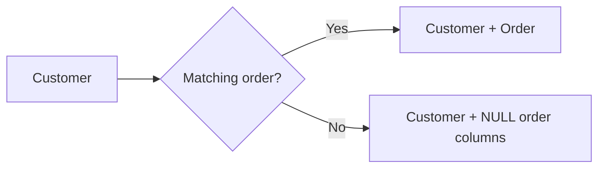
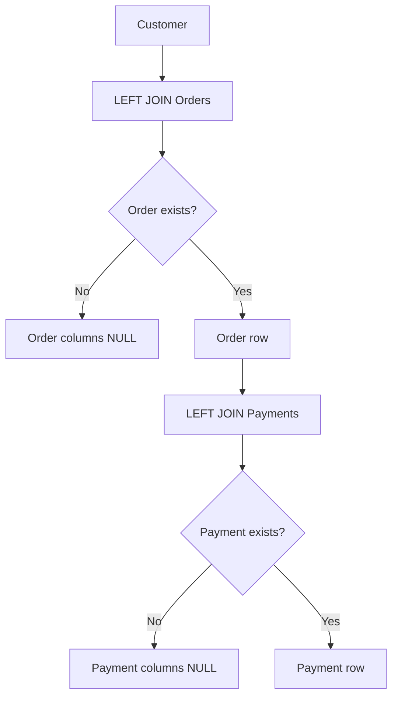

# 12- JOIN and NULL Behavior

## Overview

`NULL` is one of the most important concepts for reasoning about SQL joins because it represents an unknown or missing value rather than an ordinary value.

Join behavior becomes especially subtle when:

- A row has no matching row on the other side.
- An outer join introduces `NULL` values.
- Join predicates compare nullable columns.
- `WHERE` filters columns from the nullable side.
- Aggregations operate over outer-join results.
- `NULL` is used to identify missing relationships.

The key production rule is:

> **Outer joins preserve unmatched rows by introducing `NULL` on the non-preserved side. Any subsequent predicate involving those `NULL` values must be evaluated using SQL's three-valued logic.**

Understanding this prevents accidental inner joins, incorrect counts, missing API records, and broken reconciliation queries.

## NULL Is Not an Ordinary Value

`NULL` does not mean:

- `0`
- `''`
- `FALSE`
- `"unknown"` as a literal string

It represents the absence of a known value.

Comparisons involving `NULL` therefore do not behave like normal equality comparisons.

```sql
NULL = 10
NULL = NULL
NULL <> 10
```

All evaluate to `UNKNOWN`, not `TRUE` or `FALSE`.

The correct way to test for `NULL` is:

```sql
column IS NULL
```

or:

```sql
column IS NOT NULL
```

For example:

```sql
SELECT *
FROM customers
WHERE deleted_at IS NULL;
```

Do not write:

```sql
WHERE deleted_at = NULL;
```

That condition never evaluates to `TRUE`.

## SQL Three-Valued Logic

SQL predicates can produce three logical states:

| Result | Meaning | `WHERE` behavior |
|---|---|---|
| `TRUE` | Predicate matches | Row retained |
| `FALSE` | Predicate does not match | Row removed |
| `UNKNOWN` | Result cannot be determined | Row removed |

Consider:

```sql
SELECT *
FROM orders
WHERE customer_id = NULL;
```

For every row:

```text
customer_id = NULL
        ↓
     UNKNOWN
        ↓
    WHERE rejects
```

This is why `IS NULL` is required.

## How Outer JOINs Introduce NULL

Consider:

```text
customers
+----+---------+
| id | name    |
+----+---------+
| 1  | Alice   |
| 2  | Bob     |
| 3  | Carol   |
+----+---------+

orders
+----+-------------+
| id | customer_id |
+----+-------------+
| 101| 1           |
| 102| 1           |
| 103| 2           |
+----+-------------+
```

A `LEFT JOIN` preserves every customer:

```sql
SELECT
    c.id,
    c.name,
    o.id AS order_id
FROM customers AS c
LEFT JOIN orders AS o
    ON o.customer_id = c.id;
```

Result:

```text
id | name  | order_id
---+-------+---------
1  | Alice | 101
1  | Alice | 102
2  | Bob   | 103
3  | Carol | NULL
```

Carol has no matching order, so the database produces a null-extended row.

Conceptually:



The `NULL` is not stored in the `orders` table. It is part of the result produced by the outer join.

## NULL Behavior by JOIN Type

| JOIN | Preserved rows | Where NULLs can appear |
|---|---|---|
| `INNER JOIN` | Matching rows only | Nullable source columns |
| `LEFT JOIN` | All left rows | Right-side columns for unmatched rows |
| `RIGHT JOIN` | All right rows | Left-side columns for unmatched rows |
| `FULL OUTER JOIN` | All rows from both sides | Columns from whichever side is unmatched |
| `CROSS JOIN` | Cartesian product | No join-generated NULLs |

A nullable column can contain `NULL` regardless of the join type. The important distinction is whether the join itself introduces null-extended rows.

## INNER JOIN and NULL

Consider:

```sql
SELECT
    c.id,
    o.id AS order_id
FROM customers AS c
INNER JOIN orders AS o
    ON o.customer_id = c.id;
```

Customers without orders are excluded.

If `orders.customer_id` is `NULL`, it does not match:

```sql
NULL = c.id
```

because the result is `UNKNOWN`.

Therefore, a normal equality join does not match `NULL` to another `NULL`.

## NULL Does Not Match NULL

This is a common interview and production trap.

Suppose:

```text
left.key  | right.key
----------+----------
NULL      | NULL
```

This predicate:

```sql
left.key = right.key
```

does not match the rows.

The result is:

```text
NULL = NULL → UNKNOWN
```

Therefore:

```sql
SELECT *
FROM left_table AS l
JOIN right_table AS r
    ON l.key = r.key;
```

will not match two `NULL` keys.

If the business requirement treats two `NULL` values as equivalent, use database-supported null-safe equality.

In PostgreSQL:

```sql
SELECT *
FROM left_table AS l
JOIN right_table AS r
    ON l.key IS NOT DISTINCT FROM r.key;
```

This treats:

```text
10     ↔ 10       → match
NULL   ↔ NULL     → match
10     ↔ NULL     → no match
```

The exact null-safe operator differs across SQL databases, so portability should be considered.

## LEFT JOIN and NULL

The most important outer-join pattern is:

```sql
SELECT
    c.id,
    o.id
FROM customers AS c
LEFT JOIN orders AS o
    ON o.customer_id = c.id;
```

Customers without orders receive:

```text
o.id = NULL
```

This enables queries such as:

```sql
SELECT
    c.id,
    c.email
FROM customers AS c
LEFT JOIN orders AS o
    ON o.customer_id = c.id
WHERE o.id IS NULL;
```

This is an anti-join pattern.

It means:

> Return customers that have no matching orders.

## LEFT JOIN Plus WHERE Can Remove NULL Rows

This query preserves customers initially:

```sql
SELECT
    c.id,
    o.id,
    o.status
FROM customers AS c
LEFT JOIN orders AS o
    ON o.customer_id = c.id;
```

But this changes the result:

```sql
SELECT
    c.id,
    o.id,
    o.status
FROM customers AS c
LEFT JOIN orders AS o
    ON o.customer_id = c.id
WHERE o.status = 'paid';
```

For customers without orders:

```text
o.status = NULL
```

Then:

```text
NULL = 'paid' → UNKNOWN
```

The `WHERE` clause removes the row.

The outer join therefore behaves like an inner join with respect to that predicate.

## Preserving NULL Rows While Filtering the Child

If the requirement is:

> Return every customer and attach only paid orders.

Use:

```sql
SELECT
    c.id,
    c.email,
    o.id AS order_id
FROM customers AS c
LEFT JOIN orders AS o
    ON o.customer_id = c.id
   AND o.status = 'paid';
```

Now an unmatched customer still receives:

```text
customer_id | order_id
------------+---------
3           | NULL
```

The child filter belongs in `ON` because it controls which child rows qualify as matches.

## Finding Missing Relationships

A common production requirement is to find records without related records.

Example:

```sql
SELECT
    c.id,
    c.email
FROM customers AS c
LEFT JOIN orders AS o
    ON o.customer_id = c.id
WHERE o.id IS NULL;
```

The logic is:

```text
preserve all customers
        ↓
attach matching orders
        ↓
find rows where order is NULL
        ↓
customers with no orders
```

For many systems, `NOT EXISTS` expresses the intent more directly:

```sql
SELECT
    c.id,
    c.email
FROM customers AS c
WHERE NOT EXISTS (
    SELECT 1
    FROM orders AS o
    WHERE o.customer_id = c.id
);
```

Both patterns can be efficient depending on the database and indexes.

For production queries, compare execution plans rather than assuming one is always faster.

## JOIN Conditions Involving Nullable Columns

Consider:

```sql
SELECT *
FROM employees AS e
JOIN departments AS d
    ON e.department_id = d.id;
```

If:

```text
e.department_id = NULL
```

the employee does not match any department.

This is usually desirable when `department_id` represents an optional relationship.

If every employee must belong to a department, the database schema should normally enforce that requirement:

```sql
department_id INTEGER NOT NULL
```

along with a foreign key:

```sql
FOREIGN KEY (department_id)
REFERENCES departments(id)
```

Use SQL constraints to enforce data invariants rather than relying entirely on application code.

## Nullable Foreign Keys

A nullable foreign key often represents an optional relationship.

For example:

```sql
CREATE TABLE tickets (
    id BIGINT PRIMARY KEY,
    assigned_agent_id BIGINT,
    FOREIGN KEY (assigned_agent_id)
        REFERENCES agents(id)
);
```

An unassigned ticket may contain:

```text
assigned_agent_id = NULL
```

A query using:

```sql
LEFT JOIN agents AS a
    ON a.id = t.assigned_agent_id
```

preserves unassigned tickets.

This is a common backend pattern for:

- Unassigned support tickets.
- Optional account managers.
- Optional payment records.
- Optional shipment records.
- Optional user profiles.
- Soft-deleted relationships.

## NULL and `COUNT`

`NULL` behavior becomes particularly important with aggregation.

Consider:

```sql
SELECT
    c.id,
    COUNT(o.id) AS order_count
FROM customers AS c
LEFT JOIN orders AS o
    ON o.customer_id = c.id
GROUP BY c.id;
```

For a customer with no orders:

```text
o.id = NULL
```

`COUNT(o.id)` does not count that `NULL`.

Therefore:

```text
customer with no orders → 0
```

This is usually what is wanted.

### `COUNT(*)` Is Different

Consider:

```sql
SELECT
    c.id,
    COUNT(*) AS order_count
FROM customers AS c
LEFT JOIN orders AS o
    ON o.customer_id = c.id
GROUP BY c.id;
```

The null-extended row still exists, so:

```text
customer with no orders → 1
```

This is often incorrect when counting related entities.

Use:

```sql
COUNT(o.id)
```

when the goal is to count matched orders.

## NULL and SUM

Aggregate functions generally ignore `NULL` values.

For example:

```sql
SELECT
    c.id,
    SUM(o.total_amount) AS total_spend
FROM customers AS c
LEFT JOIN orders AS o
    ON o.customer_id = c.id
GROUP BY c.id;
```

A customer with no matching orders may receive:

```text
SUM(...) = NULL
```

rather than:

```text
0
```

If the API or business logic requires zero:

```sql
SELECT
    c.id,
    COALESCE(SUM(o.total_amount), 0) AS total_spend
FROM customers AS c
LEFT JOIN orders AS o
    ON o.customer_id = c.id
GROUP BY c.id;
```

`COALESCE` converts the resulting `NULL` to the desired fallback value.

## NULL and AVG

The same issue applies to averages:

```sql
AVG(o.total_amount)
```

ignores `NULL` values.

For a customer with no orders, there is no numeric value to average, so the result can be `NULL`.

Do not blindly convert it to zero:

```sql
COALESCE(AVG(o.total_amount), 0)
```

unless `0` has valid business meaning.

`NULL` can mean:

> No observations exist.

Whereas `0` means:

> An observation exists and its value is zero.

Those are not necessarily equivalent.

## NULL and COALESCE

`COALESCE` returns the first non-`NULL` expression:

```sql
COALESCE(o.status, 'no_order')
```

Example:

```sql
SELECT
    c.id,
    COALESCE(o.status, 'no_order') AS order_status
FROM customers AS c
LEFT JOIN orders AS o
    ON o.customer_id = c.id;
```

This is useful for presentation and API projection.

However, avoid using `COALESCE` merely to hide data-quality problems.

For example, replacing a missing foreign key with a fake identifier can obscure broken relationships.

## NULL and WHERE Predicates

Consider:

```sql
WHERE o.status <> 'cancelled'
```

This does **not** retain rows where:

```text
o.status = NULL
```

because:

```text
NULL <> 'cancelled' → UNKNOWN
```

If the intended requirement is:

> Keep orders that are not cancelled, including rows where status is missing.

You must express that explicitly:

```sql
WHERE o.status <> 'cancelled'
   OR o.status IS NULL;
```

Alternatively, if missing status is invalid data, enforce the invariant at the schema level:

```sql
status VARCHAR(32) NOT NULL
```

The correct query depends on the business meaning of `NULL`.

## NULL and NOT IN

`NOT IN` has a particularly dangerous interaction with `NULL`.

Consider:

```sql
SELECT *
FROM customers
WHERE id NOT IN (
    SELECT customer_id
    FROM orders
);
```

If the subquery contains a `NULL`, the comparison can produce `UNKNOWN` for values that otherwise appear unrelated to the matching set.

For anti-join logic, prefer:

```sql
SELECT c.*
FROM customers AS c
WHERE NOT EXISTS (
    SELECT 1
    FROM orders AS o
    WHERE o.customer_id = c.id
);
```

`NOT EXISTS` avoids the classic `NOT IN`/`NULL` trap and clearly expresses the relationship being tested.

## NULL and `IN`

`IN` also follows three-valued logic.

For example:

```sql
WHERE status IN ('paid', 'pending')
```

does not match:

```text
status = NULL
```

because neither comparison evaluates to `TRUE`.

If `NULL` is a valid state and should be included, express it explicitly:

```sql
WHERE status IN ('paid', 'pending')
   OR status IS NULL;
```

## FULL OUTER JOIN and NULL

`FULL OUTER JOIN` preserves unmatched rows from both sides.

```sql
SELECT
    c.id AS customer_id,
    o.id AS order_id
FROM customers AS c
FULL OUTER JOIN orders AS o
    ON o.customer_id = c.id;
```

An unmatched customer produces:

```text
customer_id | order_id
------------+---------
3           | NULL
```

An unmatched order produces:

```text
customer_id | order_id
------------+---------
NULL        | 999
```

This makes `FULL OUTER JOIN` useful for reconciliation.

For example:

```text
CRM customers
      │
      │ FULL OUTER JOIN
      ▼
Billing customers
      │
      ▼
Identify:
- records only in CRM
- records only in Billing
- records present in both
```

## Reconciliation with NULL

A practical reconciliation query might be:

```sql
SELECT
    c.id AS crm_customer_id,
    b.id AS billing_customer_id,
    CASE
        WHEN c.id IS NULL THEN 'billing_only'
        WHEN b.id IS NULL THEN 'crm_only'
        ELSE 'both'
    END AS record_status
FROM crm_customers AS c
FULL OUTER JOIN billing_customers AS b
    ON b.external_id = c.external_id;
```

The `NULL` values here are meaningful indicators of which side lacks a corresponding record.

This pattern is useful for:

- Data migrations.
- System reconciliation.
- ETL validation.
- Event-driven synchronization.
- Database migrations.
- Auditing.

## NULL-Safe Equality in PostgreSQL

PostgreSQL provides:

```sql
IS DISTINCT FROM
```

and:

```sql
IS NOT DISTINCT FROM
```

These operators treat `NULL` as a comparable state.

Examples:

```sql
SELECT
    10 IS NOT DISTINCT FROM 10;
```

returns:

```text
TRUE
```

```sql
SELECT
    NULL IS NOT DISTINCT FROM NULL;
```

returns:

```text
TRUE
```

```sql
SELECT
    NULL IS NOT DISTINCT FROM 10;
```

returns:

```text
FALSE
```

This is useful for synchronization and change detection where two `NULL` values should be considered equal.

## JOIN and NULL-Safe Matching

Suppose two systems contain nullable business keys:

```sql
SELECT *
FROM source_a AS a
JOIN source_b AS b
    ON a.reference_code IS NOT DISTINCT FROM b.reference_code;
```

This is different from:

```sql
ON a.reference_code = b.reference_code
```

because the latter does not match two `NULL` values.

Use null-safe equality only when the business semantics explicitly define `NULL` as equivalent.

## NULL and Multi-Table JOINs

NULL behavior becomes harder to reason about when joins are chained.

Consider:

```sql
SELECT
    c.id,
    o.id AS order_id,
    p.id AS payment_id
FROM customers AS c
LEFT JOIN orders AS o
    ON o.customer_id = c.id
LEFT JOIN payments AS p
    ON p.order_id = o.id;
```

Possible states include:

```text
Customer
   │
   ├── Order exists
   │      │
   │      └── Payment exists
   │
   ├── Order exists
   │      │
   │      └── Payment missing → p.* = NULL
   │
   └── Order missing
          │
          ├── o.* = NULL
          └── p.* = NULL
```

The second join depends on the first join's result.

If `o.id` is `NULL`, then:

```sql
p.order_id = o.id
```

cannot match because:

```text
p.order_id = NULL → UNKNOWN
```

This is normally the desired behavior.

## NULL Propagation Through JOIN Chains

For a chain of optional relationships:



When debugging a complex query, identify which join first introduces the `NULL`.

This usually makes downstream behavior much easier to understand.

## Production Example: Customer API

Suppose a REST API returns:

```json
{
  "id": 42,
  "email": "customer@example.com",
  "latest_order": null
}
```

The database query might use:

```sql
SELECT
    c.id,
    c.email,
    o.id AS order_id,
    o.created_at
FROM customers AS c
LEFT JOIN orders AS o
    ON o.customer_id = c.id
   AND o.status = 'completed'
WHERE c.id = $1;
```

The `NULL` order fields are expected if no completed order exists.

The application layer can then translate:

```text
order_id = NULL
```

into:

```json
"latest_order": null
```

This is preferable to incorrectly removing the customer from the query result.

## Security Considerations

NULL behavior can affect authorization logic.

For example:

```sql
WHERE organization_id = $1
```

does not match rows where `organization_id` is `NULL`.

That may be correct if every protected record must belong to an organization.

If `NULL` represents a special global resource, the authorization rule must explicitly account for it:

```sql
WHERE organization_id = $1
   OR organization_id IS NULL;
```

Such logic should be treated as a security decision, not merely a SQL convenience.

For multi-tenant applications:

- Define whether tenant identifiers may be `NULL`.
- Enforce tenant ownership with constraints where possible.
- Avoid relying on implicit join behavior for authorization.
- Test missing and malformed relationships.
- Review `NULL` handling in row-level security policies.

## Performance Considerations

NULL-aware query logic does not automatically imply poor performance.

Performance depends on:

- Index definitions.
- Data distribution.
- Join cardinality.
- Selectivity.
- Statistics.
- Query shape.
- Database optimizer behavior.

For example:

```sql
SELECT c.id
FROM customers AS c
WHERE NOT EXISTS (
    SELECT 1
    FROM orders AS o
    WHERE o.customer_id = c.id
);
```

can benefit from an index such as:

```sql
CREATE INDEX ix_orders_customer_id
ON orders (customer_id);
```

For complex outer joins, inspect the actual plan:

```sql
EXPLAIN (ANALYZE, BUFFERS)
SELECT
    c.id,
    COUNT(o.id)
FROM customers AS c
LEFT JOIN orders AS o
    ON o.customer_id = c.id
GROUP BY c.id;
```

Do not add indexes solely because a column participates in a join. Verify workload and execution plans.

## Schema Design and NULL

Many join problems are symptoms of unclear data modeling.

Ask whether `NULL` represents:

- Optional relationship.
- Unknown value.
- Not applicable.
- Not yet assigned.
- Missing migrated data.
- Data-quality failure.

These meanings should not be casually mixed.

For example, if every order must belong to a customer:

```sql
customer_id BIGINT NOT NULL
```

is stronger than:

```sql
customer_id BIGINT
```

with application-level assumptions.

Use:

- `NOT NULL`
- `FOREIGN KEY`
- `UNIQUE`
- `CHECK`
- Appropriate domain constraints

to encode invariants directly into the database.

## Common Mistakes

### Comparing with `= NULL`

Incorrect:

```sql
WHERE deleted_at = NULL;
```

Correct:

```sql
WHERE deleted_at IS NULL;
```

### Assuming NULL Equals NULL

Incorrect assumption:

```sql
NULL = NULL
```

Result:

```text
UNKNOWN
```

Use null-safe equality when the database supports it and the business semantics require it.

### Accidentally Turning LEFT JOIN into INNER JOIN

Problem:

```sql
LEFT JOIN orders AS o
    ON o.customer_id = c.id
WHERE o.status = 'paid';
```

If unmatched customers must remain, move the child predicate into `ON`.

### Using COUNT(*)

For counting matched children:

```sql
COUNT(o.id)
```

is generally more appropriate than:

```sql
COUNT(*)
```

with a `LEFT JOIN`.

### Using NOT IN with Nullable Data

Avoid:

```sql
WHERE id NOT IN (SELECT nullable_column FROM ...);
```

when the subquery may contain `NULL`.

Prefer `NOT EXISTS` for anti-join logic.

### Treating NULL and Zero as Equivalent

These can represent very different business states:

```text
NULL → no known value
0    → known value of zero
```

Do not blindly use `COALESCE` to turn every `NULL` into zero.

### Treating NULL and Empty String as Equivalent

These are distinct states:

```text
NULL → no value
''   → known value containing zero characters
```

Normalize them only when the domain explicitly requires it.

### Adding COALESCE Everywhere

This:

```sql
COALESCE(value, 0)
```

can make API output convenient but can also hide missing data.

Only convert `NULL` when the fallback has correct business semantics.

### Ignoring Nullable Foreign Keys

If a relationship is mandatory, enforce it:

```sql
NOT NULL
```

Do not leave the database permissive and expect every application path to maintain the invariant.

## Debugging JOIN and NULL Problems

When a join produces unexpected missing rows, debug in stages.

### Inspect the Base Tables

```sql
SELECT *
FROM customers
WHERE id = $1;
```

Then:

```sql
SELECT *
FROM orders
WHERE customer_id = $1;
```

### Inspect the Raw JOIN

```sql
SELECT
    c.id AS customer_id,
    o.id AS order_id,
    o.status
FROM customers AS c
LEFT JOIN orders AS o
    ON o.customer_id = c.id
WHERE c.id = $1;
```

### Inspect NULL Explicitly

```sql
SELECT
    c.id,
    o.id,
    o.id IS NULL AS order_missing
FROM customers AS c
LEFT JOIN orders AS o
    ON o.customer_id = c.id;
```

This makes null-extended rows visible.

### Add Predicates One at a Time

Start with:

```sql
LEFT JOIN ...
```

Then add:

```sql
ON ... AND child_condition
```

Then add:

```sql
WHERE parent_condition
```

This isolates the predicate responsible for eliminating rows.

## Production Checklist

Before deploying a query involving nullable join columns, verify:

- [ ] `NULL` has a clear business meaning.
- [ ] Nullable foreign keys are intentional.
- [ ] Mandatory relationships use `NOT NULL` and foreign keys.
- [ ] `IS NULL` / `IS NOT NULL` are used instead of `= NULL`.
- [ ] Outer-join-generated `NULL` values are expected.
- [ ] Predicates on nullable joined columns are intentionally placed.
- [ ] `COUNT(child.id)` is used when counting optional children.
- [ ] `NOT IN` is avoided when nullable subquery values can occur.
- [ ] `NOT EXISTS` is considered for anti-join logic.
- [ ] `COALESCE` is used only when its fallback has correct semantics.
- [ ] Multi-table joins have been tested for NULL propagation.
- [ ] Tenant and authorization logic handles NULL explicitly.
- [ ] Realistic datasets include missing relationships.
- [ ] Performance-sensitive queries have been validated with `EXPLAIN`.

## Interview Traps

| Question | Correct reasoning |
|---|---|
| Does `NULL = NULL` return `TRUE`? | No. It returns `UNKNOWN`. |
| How do you test for NULL? | `IS NULL` or `IS NOT NULL`. |
| Why can a `LEFT JOIN` produce NULL values? | The database null-extends columns from the non-preserved side when no match exists. |
| Why can `WHERE child.column = value` turn a `LEFT JOIN` into an inner join? | Unmatched rows have `NULL` child values, causing the predicate to evaluate to `UNKNOWN`. |
| Why use `COUNT(child.id)` instead of `COUNT(*)` with a `LEFT JOIN`? | `COUNT(child.id)` ignores the null-extended row; `COUNT(*)` counts it. |
| Does a normal equality join match two NULL keys? | No. `NULL = NULL` is `UNKNOWN`. |
| What is a common alternative to `LEFT JOIN ... IS NULL`? | `NOT EXISTS`. |
| Why can `NOT IN` behave unexpectedly with NULL? | A NULL in the comparison set introduces `UNKNOWN` into three-valued logic. |
| How do you perform NULL-safe equality in PostgreSQL? | `IS NOT DISTINCT FROM`. |
| Should every NULL be converted with `COALESCE`? | No. NULL and a fallback value can have different business meanings. |

## Key Takeaways

- **Outer joins can introduce `NULL` values for unmatched rows; those values are part of the result, not necessarily stored in the underlying table.**
- **SQL uses three-valued logic, so comparisons involving `NULL` produce `UNKNOWN`; use `IS NULL` or `IS NOT NULL` for NULL checks.**
- **Predicates on the nullable side of an outer join can eliminate preserved rows when placed in `WHERE`, effectively changing the intended semantics.**
- **`COUNT(column)`, `NOT EXISTS`, `COALESCE`, and NULL-safe equality each have specific semantics; use them according to the business meaning of missing data.**
- **Production-grade SQL treats NULL behavior as a data-modeling and correctness concern, reinforced by constraints, tests, authorization rules, and execution-plan analysis.**