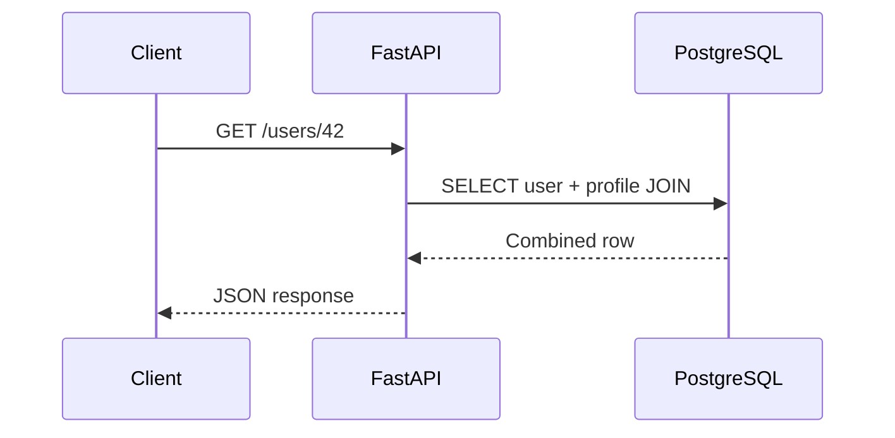

# 13- One-to-One JOINs

## Overview

A one-to-one relationship exists when each row in one table corresponds to at most one row in another table, and vice versa.

A SQL `JOIN` does not itself enforce a one-to-one relationship. The relationship is created by the schema through constraints such as `UNIQUE`, `PRIMARY KEY`, and `FOREIGN KEY`. The join simply retrieves related rows.

Typical backend examples include:

- A user and its profile.
- An employee and its employment details.
- An account and its settings.
- An order and its payment record.
- A device and its current configuration.
- A customer and a separately stored sensitive-data record.

One-to-one modeling is useful when related data has different lifecycle, security, ownership, access, or storage requirements.

## Basic One-to-One Relationship

Consider:

```text
users
+----+---------------------+
| id | email               |
+----+---------------------+
| 1  | alice@example.com   |
| 2  | bob@example.com     |
+----+---------------------+

user_profiles
+----+---------+------------+
| id | user_id | timezone   |
+----+---------+------------+
| 10 | 1       | UTC        |
| 11 | 2       | Asia/Kolkata |
+----+---------+------------+
```

The relationship is:

```text
users.id 1 ─────── 1 user_profiles.user_id
users.id 2 ─────── 1 user_profiles.user_id
```

A typical query is:

```sql
SELECT
    u.id,
    u.email,
    p.timezone
FROM users AS u
INNER JOIN user_profiles AS p
    ON p.user_id = u.id;
```

The join combines columns from both tables into one result.

## Enforcing One-to-One Semantics

The critical distinction is:

> A foreign key alone creates a many-to-one relationship from the child table to the parent. A `UNIQUE` constraint on the foreign key is what limits it to one child row per parent.

For example:

```sql
CREATE TABLE users (
    id BIGINT GENERATED ALWAYS AS IDENTITY PRIMARY KEY,
    email TEXT NOT NULL UNIQUE
);

CREATE TABLE user_profiles (
    id BIGINT GENERATED ALWAYS AS IDENTITY PRIMARY KEY,
    user_id BIGINT NOT NULL UNIQUE,
    timezone TEXT NOT NULL,
    FOREIGN KEY (user_id) REFERENCES users(id)
);
```

The `UNIQUE` constraint on `user_id` prevents:

```text
user_id = 1
user_id = 1
```

from appearing twice in `user_profiles`.

Without `UNIQUE`, the schema permits:

```text
users
1 Alice

user_profiles
10 1 UTC
11 1 Asia/Kolkata
12 1 Europe/London
```

The relationship would then be one-to-many.

## Primary Key as the Foreign Key

A common and strong one-to-one design is to use the parent identifier as the child table's primary key.

```sql
CREATE TABLE users (
    id BIGINT GENERATED ALWAYS AS IDENTITY PRIMARY KEY,
    email TEXT NOT NULL UNIQUE
);

CREATE TABLE user_profiles (
    user_id BIGINT PRIMARY KEY,
    timezone TEXT NOT NULL,
    FOREIGN KEY (user_id) REFERENCES users(id)
);
```

Now `user_profiles.user_id` is simultaneously:

- The primary key.
- A foreign key to `users.id`.
- Unique by definition.
- The identifier of the profile row.

This naturally models:

```text
users.id
    │
    └── user_profiles.user_id
```

This design is often preferable when the child cannot logically exist independently of the parent.

## Independent Child Identifier vs Shared Primary Key

There are two common designs.

| Design | Child key | Relationship enforcement | Typical use |
|---|---|---|---|
| Unique foreign key | Independent `id` + `UNIQUE(user_id)` | FK + UNIQUE | Child has its own identity |
| Shared primary key | `user_id` is PK + FK | PK + FK | Strict dependent entity |

### Independent Identifier

```sql
CREATE TABLE profiles (
    id BIGINT PRIMARY KEY,
    user_id BIGINT NOT NULL UNIQUE,
    timezone TEXT NOT NULL,
    FOREIGN KEY (user_id) REFERENCES users(id)
);
```

Useful when the profile is an independently addressable domain entity.

### Shared Primary Key

```sql
CREATE TABLE profiles (
    user_id BIGINT PRIMARY KEY,
    timezone TEXT NOT NULL,
    FOREIGN KEY (user_id) REFERENCES users(id)
);
```

Useful when the profile is conceptually an extension of the user rather than an independently identified entity.

## INNER JOIN with One-to-One Data

When the related row is mandatory:

```sql
SELECT
    u.id,
    u.email,
    p.timezone
FROM users AS u
INNER JOIN user_profiles AS p
    ON p.user_id = u.id;
```

Only users with profiles are returned.

If:

```text
users
1 Alice
2 Bob
3 Carol

profiles
1 Alice
2 Bob
```

the result is:

```text
1 Alice
2 Bob
```

Carol is excluded because there is no matching profile.

Use `INNER JOIN` when the query requires the related entity to exist.

## LEFT JOIN with Optional One-to-One Data

A one-to-one relationship can also be optional.

For example, users may be created before their profiles.

```sql
SELECT
    u.id,
    u.email,
    p.timezone
FROM users AS u
LEFT JOIN user_profiles AS p
    ON p.user_id = u.id;
```

Result:

```text
id | email              | timezone
---+--------------------+-----------
1  | alice@example.com  | UTC
2  | bob@example.com    | Asia/Kolkata
3  | carol@example.com  | NULL
```

The relationship remains one-to-one, but it is optional:

```text
0..1 profile per user
```

This is different from:

```text
1 profile per user
```

The database schema should reflect that distinction.

## Optional vs Mandatory One-to-One

| Relationship | Typical schema | Query |
|---|---|---|
| Mandatory one-to-one | `NOT NULL` + `UNIQUE`/PK | `INNER JOIN` |
| Optional one-to-one | Nullable FK + `UNIQUE` | `LEFT JOIN` |
| Strict dependent one-to-one | Child PK = parent FK | Usually `INNER` or `LEFT` depending on query |

Do not infer optionality solely from the query. The schema should make the domain invariant explicit.

## JOIN Cardinality Matters

A common production assumption is:

> "This is a one-to-one relationship, so the join returns one row."

That is only true if the database actually enforces one-to-one cardinality.

If the child table contains duplicate foreign keys:

```text
user_id
-------
1
1
```

then:

```sql
SELECT
    u.id,
    p.timezone
FROM users AS u
JOIN user_profiles AS p
    ON p.user_id = u.id;
```

returns multiple rows for the same user.

This can cause:

- Duplicate API objects.
- Incorrect counts.
- Duplicate pagination results.
- Inflated aggregates.
- Incorrect billing calculations.
- Unexpected ORM results.

Enforce cardinality at the database level.

## One-to-One JOIN and Aggregation

If a relationship is genuinely one-to-one, aggregation over the joined child normally does not multiply the parent row.

For example:

```sql
SELECT
    u.id,
    u.email,
    MAX(p.timezone) AS timezone
FROM users AS u
LEFT JOIN user_profiles AS p
    ON p.user_id = u.id
GROUP BY
    u.id,
    u.email;
```

However, using aggregation to hide duplicate child rows is usually a bad fix.

If the relationship should be one-to-one, enforce:

```sql
UNIQUE (user_id)
```

rather than relying on:

```sql
MAX(...)
MIN(...)
```

to collapse invalid data.

## Detecting Violations of One-to-One Assumptions

If a legacy schema is supposed to contain one profile per user but lacks a unique constraint, detect duplicates with:

```sql
SELECT
    user_id,
    COUNT(*) AS row_count
FROM user_profiles
GROUP BY user_id
HAVING COUNT(*) > 1;
```

This identifies users with multiple profile records.

Before adding a unique constraint in production:

1. Identify duplicate records.
2. Determine the correct surviving record.
3. Remove or merge invalid duplicates.
4. Add the constraint.
5. Update application logic so duplicates cannot be recreated.

## One-to-One JOINs in PostgreSQL

PostgreSQL supports the same relational model directly.

A production schema might be:

```sql
CREATE TABLE accounts (
    id BIGINT GENERATED ALWAYS AS IDENTITY PRIMARY KEY,
    email TEXT NOT NULL UNIQUE,
    created_at TIMESTAMPTZ NOT NULL DEFAULT now()
);

CREATE TABLE account_settings (
    account_id BIGINT PRIMARY KEY
        REFERENCES accounts(id)
        ON DELETE CASCADE,
    timezone TEXT NOT NULL DEFAULT 'UTC',
    locale TEXT NOT NULL DEFAULT 'en-US'
);
```

The relationship is:

```text
accounts.id
    │
    └── account_settings.account_id
            PRIMARY KEY
            FOREIGN KEY
```

This provides strong database-level enforcement.

## Referential Actions

One-to-one relationships often require explicit deletion semantics.

For example:

```sql
CREATE TABLE account_settings (
    account_id BIGINT PRIMARY KEY
        REFERENCES accounts(id)
        ON DELETE CASCADE,
    timezone TEXT NOT NULL
);
```

With `ON DELETE CASCADE`:

```text
DELETE account
      ↓
database deletes account_settings
```

This is appropriate when settings have no independent meaning outside the account.

Other choices include:

| Action | Behavior | Typical use |
|---|---|---|
| `CASCADE` | Delete child | Strong ownership |
| `RESTRICT` | Prevent parent deletion | Child must be handled first |
| `NO ACTION` | Enforce FK according to constraint timing | Default-style referential enforcement |
| `SET NULL` | Remove relationship | Optional child reference |

Do not use `CASCADE` automatically. Deletion behavior should match domain ownership and retention requirements.

## One-to-One vs Splitting a Table

A one-to-one relationship can be used to split a large logical entity across tables:

```text
users
├── id
├── email
├── name
└── created_at

user_private_data
├── user_id
├── date_of_birth
├── government_id
└── sensitive_metadata
```

This can provide:

- Different access-control boundaries.
- Separate lifecycle management.
- Smaller frequently accessed rows.
- Reduced exposure of sensitive fields.
- Independent migration paths.

However, splitting tables does not automatically improve performance.

A query requiring both tables still needs a join:

```sql
SELECT
    u.id,
    u.email,
    p.date_of_birth
FROM users AS u
JOIN user_private_data AS p
    ON p.user_id = u.id;
```

Use table decomposition because of domain, security, lifecycle, or operational requirements—not simply because joins are available.

## One-to-One JOINs and Security

A one-to-one table can be useful for isolating sensitive information.

For example:

```text
users
    │
    └── user_private_data
             ├── government_id
             ├── tax_information
             └── identity_metadata
```

Application roles may have access to `users` but not `user_private_data`.

However, a join can still expose sensitive data if authorization is insufficient.

For production systems:

- Restrict access to sensitive tables.
- Select only required columns.
- Avoid `SELECT *`.
- Apply tenant filtering consistently.
- Use database roles or row-level security where appropriate.
- Keep sensitive data out of logs and debug output.
- Audit access to high-value data.

A one-to-one relationship is a modeling mechanism, not an authorization boundary by itself.

## One-to-One JOINs and Django

Django provides explicit one-to-one relationship modeling.

```python
from django.db import models


class UserProfile(models.Model):
    user = models.OneToOneField(
        "auth.User",
        on_delete=models.CASCADE,
        related_name="profile",
    )
    timezone = models.CharField(max_length=64, default="UTC")
```

Django translates the relationship into a database-level uniqueness constraint.

Querying the relationship can use:

```python
profile = user.profile
```

For retrieving many users and their profiles efficiently:

```python
users = User.objects.select_related("profile").all()
```

`select_related()` is appropriate for single-valued relationships such as:

- `ForeignKey`
- `OneToOneField`

because Django can retrieve the related data using a SQL join.

## One-to-One JOINs and FastAPI

FastAPI itself does not implement relational joins. The database or ORM layer does.

For example, SQLAlchemy can load a one-to-one relationship using appropriate relationship configuration and eager-loading strategies.

The architectural flow is typically:



The HTTP framework should not compensate for inefficient database access by issuing separate queries for every related object.

## Avoiding the N+1 Query Problem

Consider:

```python
users = User.objects.all()

for user in users:
    print(user.profile.timezone)
```

If the relationship is not eagerly loaded, this can result in:

```text
1 query → users
N queries → individual profiles
```

Use:

```python
users = User.objects.select_related("profile").all()
```

to fetch the one-to-one relationship efficiently.

The principle is:

> For single-valued relationships, prefer an explicit join or ORM eager-loading strategy when the related data is known to be needed.

Do not blindly eager-load every relationship. Fetch only data required by the request.

## Performance Considerations

One-to-one joins are generally straightforward for relational databases because the join key is usually:

- A primary key.
- A unique key.
- Or an indexed foreign key.

For example:

```sql
CREATE UNIQUE INDEX ux_user_profiles_user_id
ON user_profiles(user_id);
```

If `user_id` is already declared `UNIQUE`, the database normally creates an appropriate unique index automatically.

Inspect execution plans for performance-sensitive queries:

```sql
EXPLAIN (ANALYZE, BUFFERS)
SELECT
    u.id,
    u.email,
    p.timezone
FROM users AS u
LEFT JOIN user_profiles AS p
    ON p.user_id = u.id
WHERE u.id = 42;
```

For a primary-key lookup, the optimizer should normally be able to locate the relevant rows efficiently.

## Selecting Only Required Columns

Avoid:

```sql
SELECT *
FROM users AS u
JOIN user_profiles AS p
    ON p.user_id = u.id;
```

Prefer:

```sql
SELECT
    u.id,
    u.email,
    p.timezone
FROM users AS u
JOIN user_profiles AS p
    ON p.user_id = u.id;
```

Benefits include:

- Lower network transfer.
- Less database-to-application memory usage.
- Smaller result sets.
- Lower serialization cost.
- Reduced accidental exposure of sensitive columns.
- More stable API behavior when schemas evolve.

## Transactional Considerations

Creating a parent and mandatory one-to-one child often belongs in the same transaction.

For example:

```sql
BEGIN;

INSERT INTO users (email)
VALUES ('alice@example.com');

INSERT INTO user_profiles (user_id, timezone)
VALUES (1, 'UTC');

COMMIT;
```

If the second operation fails, the transaction should normally roll back so that the system does not leave an incomplete entity.

In application code, use the framework's transaction support rather than manually coordinating multiple independent commits.

In Django:

```python
from django.db import transaction


with transaction.atomic():
    user = User.objects.create(email="alice@example.com")
    UserProfile.objects.create(user=user, timezone="UTC")
```

The exact transaction boundary should match the domain operation.

## Concurrency and One-to-One Creation

Application-level checks are not sufficient to enforce uniqueness.

This pattern is unsafe:

```text
Request A: Does profile for user 42 exist? → No
Request B: Does profile for user 42 exist? → No
Request A: INSERT profile
Request B: INSERT profile
```

Without a database uniqueness constraint, both requests can succeed.

With:

```sql
UNIQUE (user_id)
```

one transaction will fail with a uniqueness violation.

The database therefore provides the final concurrency-safe enforcement.

Application code should handle the constraint violation appropriately, especially in high-concurrency APIs.

## One-to-One vs One-to-Many

The most important distinction is cardinality.

| Relationship | Example | Database pattern |
|---|---|---|
| One-to-one | User → Profile | FK + `UNIQUE` |
| One-to-many | Customer → Orders | FK without uniqueness |
| Many-to-many | Users ↔ Teams | Junction table |

For example:

```sql
-- One-to-one
user_id BIGINT NOT NULL UNIQUE

-- One-to-many
customer_id BIGINT NOT NULL
```

The presence or absence of uniqueness on the foreign key changes the relationship's cardinality.

## One-to-One vs Embedding Data

Sometimes a separate table is unnecessary.

Instead of:

```text
users
user_profiles
```

you could store:

```text
users
├── id
├── email
├── timezone
└── locale
```

Keep data in the same table when:

- The fields share the same lifecycle.
- Access patterns are almost always identical.
- Security boundaries are the same.
- The entity is not conceptually separate.
- The table remains manageable in size and access patterns.

Consider a separate one-to-one table when:

- Data has a different lifecycle.
- Access is significantly less frequent.
- Security boundaries differ.
- The data is optional.
- A separate team or subsystem owns it.
- Migration or storage characteristics differ.

A join introduces complexity, so the separation should have a concrete engineering reason.

## Common Mistakes

### Assuming a Foreign Key Creates One-to-One Cardinality

This:

```sql
FOREIGN KEY (user_id) REFERENCES users(id)
```

does not prevent multiple profile rows per user.

Use:

```sql
UNIQUE (user_id)
```

or make `user_id` the primary key.

### Enforcing Uniqueness Only in Application Code

Checking:

```python
if not profile_exists(user_id):
    create_profile(user_id)
```

is vulnerable to concurrent requests.

Enforce the invariant in the database.

### Using INNER JOIN for Optional Data

If a profile is optional:

```sql
INNER JOIN user_profiles
```

will remove users without profiles.

Use:

```sql
LEFT JOIN user_profiles
```

when the parent must remain visible.

### Using LEFT JOIN When the Relationship Is Mandatory

A `LEFT JOIN` can hide data-integrity problems by allowing missing children to appear as `NULL`.

If the relationship is mandatory and missing children indicate corruption, consider:

```sql
INNER JOIN
```

and enforce the relationship through schema constraints.

### Using DISTINCT to Hide Duplicate Children

This:

```sql
SELECT DISTINCT ...
```

may hide an incorrectly modeled one-to-many relationship.

First determine why duplicates exist.

If the relationship should be one-to-one, enforce the constraint.

### Using SELECT *

One-to-one joins can expose columns that the API does not need.

Explicitly select required fields.

### Assuming One-to-One Means One Query

An ORM can still generate N+1 queries if the relationship is accessed lazily.

Use appropriate eager-loading mechanisms such as Django's:

```python
select_related()
```

### Ignoring Delete Semantics

Deleting a parent can leave an orphaned child or unexpectedly delete dependent data.

Choose referential actions deliberately.

### Using One-to-One Tables for Arbitrary Splitting

A one-to-one table adds:

- Join complexity.
- Migration complexity.
- ORM relationship handling.
- Additional indexing considerations.
- Potential transaction boundaries.

Split tables for a meaningful domain or operational reason.

## Production Checklist

Before introducing or reviewing a one-to-one relationship:

- [ ] Is the relationship genuinely one-to-one?
- [ ] Is the cardinality enforced by the database?
- [ ] Does the child use `UNIQUE` or a shared primary key?
- [ ] Is the relationship mandatory or optional?
- [ ] Is `NOT NULL` consistent with that requirement?
- [ ] Is the foreign key indexed?
- [ ] Are deletion semantics explicitly defined?
- [ ] Are concurrent creation requests safe?
- [ ] Are duplicate legacy records already present?
- [ ] Are API queries selecting only required columns?
- [ ] Does the ORM use appropriate eager loading?
- [ ] Have sensitive columns been protected?
- [ ] Has the query plan been checked for performance-sensitive paths?
- [ ] Are parent and child creation operations transactionally consistent?
- [ ] Are tenant and authorization boundaries enforced independently of the join?

## Interview Traps

| Question | Correct reasoning |
|---|---|
| Does a foreign key alone create one-to-one cardinality? | No. It permits many child rows referencing the same parent. |
| How do you enforce one-to-one? | Use a `UNIQUE` foreign key or make the foreign key the child's primary key. |
| When should you use `LEFT JOIN`? | When the parent must remain even if the optional child is missing. |
| When should you use `INNER JOIN`? | When only records with a matching related row are required. |
| Why can one-to-one data still produce duplicate rows? | The database may not actually enforce uniqueness on the foreign key. |
| How do you prevent concurrent duplicate child creation? | Enforce uniqueness at the database level and handle constraint violations. |
| What is a shared-primary-key one-to-one relationship? | The child primary key is also a foreign key referencing the parent primary key. |
| Why use `select_related()` in Django? | It can retrieve single-valued relationships through SQL joins and avoid N+1 queries. |
| Should `DISTINCT` be used to fix duplicate one-to-one results? | Usually no. Investigate and enforce the underlying cardinality. |
| Does splitting a table into a one-to-one table automatically improve performance? | No. It can reduce row width or isolate workloads, but it also introduces join overhead. |

## Key Takeaways

- **A one-to-one relationship is enforced by schema constraints, not by the `JOIN` itself; use a unique foreign key or shared primary key.**
- **Choose `INNER JOIN` for required related data and `LEFT JOIN` when the parent must remain even if the optional child is missing.**
- **Database-level uniqueness is essential for correctness under concurrent requests; application-level existence checks alone are insufficient.**
- **One-to-one table decomposition is useful for lifecycle, security, ownership, or access-pattern boundaries, but it introduces join and operational complexity.**
- **Production implementations should combine proper cardinality constraints, transactional consistency, selective queries, ORM eager loading, and deliberate referential actions.**