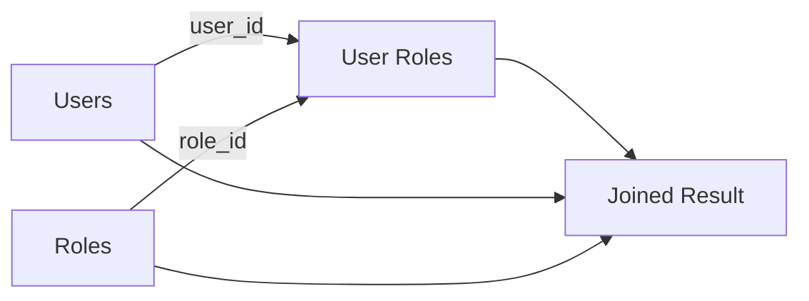

# 15- Many-to-Many JOINs

## Overview

A many-to-many relationship exists when multiple rows in one table can be associated with multiple rows in another table.

Common backend examples include:

- Users ↔ Roles
- Products ↔ Categories
- Students ↔ Courses
- Posts ↔ Tags
- Orders ↔ Products
- Organizations ↔ Permissions

Relational databases normally model this relationship through a **junction table** (also called an association, bridge, or mapping table).

For example:

```text
users
  │
  │  1:N
  ▼
user_roles
  ▲
  │  N:1
  │
roles
```

The junction table contains foreign keys to both entities:

```text
users.id ──────< user_roles.user_id
roles.id ──────< user_roles.role_id
```

A many-to-many query therefore requires two joins:

```sql
SELECT
    u.id,
    u.email,
    r.id AS role_id,
    r.name AS role_name
FROM users AS u
JOIN user_roles AS ur
    ON ur.user_id = u.id
JOIN roles AS r
    ON r.id = ur.role_id;
```

The key engineering concern is **cardinality**. A many-to-many join can expand the result substantially, and additional joins can multiply that expansion further.

## Why a Junction Table Is Required

A relational table should normally represent one relationship occurrence per row.

Suppose a user has three roles:

```text
Alice → admin
Alice → editor
Alice → auditor
```

Storing this as:

```text
users
id | email | roles
```

with a comma-separated or JSON string creates problems for referential integrity, indexing, filtering, and updates.

Instead:

```text
users
+----+-------+
| id | email |
+----+-------+
| 1  | Alice |
+----+-------+

roles
+----+---------+
| id | name    |
+----+---------+
| 10 | admin   |
| 20 | editor  |
| 30 | auditor |
+----+---------+

user_roles
+---------+---------+
| user_id | role_id |
+---------+---------+
| 1       | 10      |
| 1       | 20      |
| 1       | 30      |
+---------+---------+
```

Each row in `user_roles` represents one association.

This provides:

- Foreign-key enforcement.
- Efficient joins.
- Normalized data.
- Independent lifecycle management.
- Referential integrity.
- Flexible querying.

## Schema Design

A production PostgreSQL implementation might look like:

```sql
CREATE TABLE users (
    id BIGINT GENERATED ALWAYS AS IDENTITY PRIMARY KEY,
    email TEXT NOT NULL UNIQUE
);

CREATE TABLE roles (
    id BIGINT GENERATED ALWAYS AS IDENTITY PRIMARY KEY,
    name TEXT NOT NULL UNIQUE
);

CREATE TABLE user_roles (
    user_id BIGINT NOT NULL,
    role_id BIGINT NOT NULL,

    PRIMARY KEY (user_id, role_id),

    CONSTRAINT fk_user_roles_user
        FOREIGN KEY (user_id)
        REFERENCES users(id)
        ON DELETE CASCADE,

    CONSTRAINT fk_user_roles_role
        FOREIGN KEY (role_id)
        REFERENCES roles(id)
        ON DELETE CASCADE
);
```

The composite primary key:

```sql
PRIMARY KEY (user_id, role_id)
```

prevents duplicate associations such as:

```text
user_id | role_id
--------+--------
1       | 10
1       | 10
```

If duplicate relationships have legitimate business meaning, the junction table should instead have its own primary key and an appropriate uniqueness strategy.

## How the JOIN Works

Suppose:

```text
users
1 → Alice
2 → Bob

roles
10 → Admin
20 → Editor

user_roles
1 → 10
1 → 20
2 → 20
```

The query:

```sql
SELECT
    u.email,
    r.name AS role
FROM users AS u
JOIN user_roles AS ur
    ON ur.user_id = u.id
JOIN roles AS r
    ON r.id = ur.role_id;
```

produces:

```text
email | role
------+--------
Alice | Admin
Alice | Editor
Bob   | Editor
```

Alice appears twice because she has two role associations.

The database is returning relationship rows, not one row per user.

## Relationship Data Flow



The junction table is the actual path through which the database resolves the many-to-many relationship.

Conceptually:

```text
User
  ↓
user_roles
  ↓
Role
```

The database optimizer may physically execute the joins in a different order, but the logical result is equivalent to traversing this relationship.

## Querying One Entity's Related Records

To retrieve all roles for a specific user:

```sql
SELECT
    r.id,
    r.name
FROM roles AS r
JOIN user_roles AS ur
    ON ur.role_id = r.id
WHERE ur.user_id = 42
ORDER BY r.name;
```

The important filter is on the junction table:

```sql
ur.user_id = 42
```

For production workloads, the junction table should be indexed to support both directions of traversal.

The composite primary key:

```sql
PRIMARY KEY (user_id, role_id)
```

efficiently supports lookups beginning with `user_id`.

If the reverse lookup is common:

```sql
SELECT
    u.id,
    u.email
FROM users AS u
JOIN user_roles AS ur
    ON ur.user_id = u.id
WHERE ur.role_id = 10;
```

add an index beginning with `role_id`:

```sql
CREATE INDEX idx_user_roles_role_id_user_id
    ON user_roles(role_id, user_id);
```

This is important because a composite index on `(user_id, role_id)` is not generally equivalent to an index beginning with `role_id`.

## INNER JOIN vs LEFT JOIN

An `INNER JOIN` returns only entities with relationships.

```sql
SELECT
    u.id,
    u.email,
    r.name AS role
FROM users AS u
JOIN user_roles AS ur
    ON ur.user_id = u.id
JOIN roles AS r
    ON r.id = ur.role_id;
```

A user without any role is excluded.

Use `LEFT JOIN` when users without roles must remain:

```sql
SELECT
    u.id,
    u.email,
    r.name AS role
FROM users AS u
LEFT JOIN user_roles AS ur
    ON ur.user_id = u.id
LEFT JOIN roles AS r
    ON r.id = ur.role_id;
```

The result may contain:

```text
Alice → Admin
Alice → Editor
Bob   → NULL
```

This is useful for administrative reports such as:

> "Show every user and their assigned roles, including users with no roles."

## Finding Entities With No Relationships

To find users who have no roles:

```sql
SELECT
    u.id,
    u.email
FROM users AS u
LEFT JOIN user_roles AS ur
    ON ur.user_id = u.id
WHERE ur.user_id IS NULL;
```

An alternative is `NOT EXISTS`:

```sql
SELECT
    u.id,
    u.email
FROM users AS u
WHERE NOT EXISTS (
    SELECT 1
    FROM user_roles AS ur
    WHERE ur.user_id = u.id
);
```

`NOT EXISTS` often expresses the business requirement more directly:

> Return users for which no relationship exists.

Both forms should be evaluated against the actual database execution plan for performance-sensitive workloads.

## Many-to-Many Cardinality

Many-to-many relationships can expand result sets quickly.

If:

```text
1 user → 5 roles
```

the join produces up to five rows for that user.

If a second relationship exists:

```text
1 user → 5 roles
1 user → 10 teams
```

joining both relationships can produce:

```text
5 × 10 = 50 rows
```

for that user.

This is not a database error. The relational result represents combinations of matching rows.

However, it can become a correctness problem when aggregation or pagination assumes one row per user.

## Avoiding Row Multiplication

Suppose the requirement is:

> Count roles and teams for every user.

This query can overcount:

```sql
SELECT
    u.id,
    COUNT(ur.role_id) AS role_count,
    COUNT(ut.team_id) AS team_count
FROM users AS u
LEFT JOIN user_roles AS ur
    ON ur.user_id = u.id
LEFT JOIN user_teams AS ut
    ON ut.user_id = u.id
GROUP BY u.id;
```

A user with:

```text
5 roles
10 teams
```

can produce 50 intermediate rows.

A safer approach is to aggregate independently:

```sql
SELECT
    u.id,
    COALESCE(r.role_count, 0) AS role_count,
    COALESCE(t.team_count, 0) AS team_count
FROM users AS u
LEFT JOIN (
    SELECT
        user_id,
        COUNT(*) AS role_count
    FROM user_roles
    GROUP BY user_id
) AS r
    ON r.user_id = u.id
LEFT JOIN (
    SELECT
        user_id,
        COUNT(*) AS team_count
    FROM user_teams
    GROUP BY user_id
) AS t
    ON t.user_id = u.id;
```

Another option is:

```sql
COUNT(DISTINCT ur.role_id)
```

when that matches the required semantics.

For complex reporting, independent pre-aggregation is often easier to reason about and optimize.

## DISTINCT and Many-to-Many Queries

Suppose the requirement is:

> Find users who have at least one admin role.

A direct join may produce duplicate users if multiple matching association rows are possible:

```sql
SELECT DISTINCT
    u.id,
    u.email
FROM users AS u
JOIN user_roles AS ur
    ON ur.user_id = u.id
JOIN roles AS r
    ON r.id = ur.role_id
WHERE r.name = 'admin';
```

This can be valid.

However, if the requirement is purely existence-based, `EXISTS` can express it more directly:

```sql
SELECT
    u.id,
    u.email
FROM users AS u
WHERE EXISTS (
    SELECT 1
    FROM user_roles AS ur
    JOIN roles AS r
        ON r.id = ur.role_id
    WHERE ur.user_id = u.id
      AND r.name = 'admin'
);
```

The choice should follow the required result shape rather than a generic preference for `JOIN` or `DISTINCT`.

## Filtering the Junction Table

The junction table can contain business attributes.

For example:

```text
user_roles
+---------+---------+------------+
| user_id | role_id | granted_by |
+---------+---------+------------+
| 1       | 10      | system     |
| 1       | 20      | admin      |
+---------+---------+------------+
```

It can also contain:

- `created_at`
- `expires_at`
- `is_active`
- `tenant_id`
- `source`
- `metadata`

The junction table is then more than a technical bridge; it becomes a first-class domain entity.

Example:

```sql
SELECT
    u.email,
    r.name
FROM users AS u
JOIN user_roles AS ur
    ON ur.user_id = u.id
   AND ur.is_active = TRUE
JOIN roles AS r
    ON r.id = ur.role_id
WHERE ur.expires_at IS NULL
   OR ur.expires_at > now();
```

Filtering relationship attributes in the `ON` clause can be particularly useful with `LEFT JOIN`, because it preserves the outer entity while restricting which relationships participate.

## Junction Table as a First-Class Entity

Consider an organization membership model:

```text
users
    │
    │
    ▼
organization_memberships
    │
    │
    ▼
organizations
```

The association may contain:

```text
user_id
organization_id
role
joined_at
invited_by
status
```

At this point, calling it merely a "junction table" can obscure the domain model.

It is an entity representing:

> "A user's membership in an organization."

This distinction matters when designing APIs and application services.

Instead of:

```text
POST /users/{id}/organizations
```

the domain may require operations on the membership itself:

```text
POST   /organizations/{id}/members
PATCH  /organizations/{id}/members/{user_id}
DELETE /organizations/{id}/members/{user_id}
```

The database relationship and API resource model do not have to be identical, but the domain semantics should remain explicit.

## Many-to-Many JOINs With Additional Attributes

Suppose an order contains products:

```text
orders
products
order_items
```

`order_items` may contain:

```text
order_id
product_id
quantity
unit_price
discount
```

Querying the order:

```sql
SELECT
    o.id AS order_id,
    p.id AS product_id,
    p.name,
    oi.quantity,
    oi.unit_price
FROM orders AS o
JOIN order_items AS oi
    ON oi.order_id = o.id
JOIN products AS p
    ON p.id = oi.product_id
WHERE o.id = 1001;
```

This is a classic production many-to-many pattern.

The relationship itself carries business information, so `order_items` is a domain entity rather than merely an implementation detail.

## Many-to-Many and Aggregation

To calculate order totals:

```sql
SELECT
    o.id,
    SUM(oi.quantity * oi.unit_price) AS subtotal
FROM orders AS o
JOIN order_items AS oi
    ON oi.order_id = o.id
GROUP BY o.id;
```

For orders that may have no line items:

```sql
SELECT
    o.id,
    COALESCE(
        SUM(oi.quantity * oi.unit_price),
        0
    ) AS subtotal
FROM orders AS o
LEFT JOIN order_items AS oi
    ON oi.order_id = o.id
GROUP BY o.id;
```

Be careful with monetary calculations. For financial systems, use appropriate fixed-precision numeric types and business-specific rounding rules rather than floating-point arithmetic.

## Django Many-to-Many Relationships

Django provides a `ManyToManyField`:

```python
from django.db import models


class Role(models.Model):
    name = models.CharField(max_length=100, unique=True)


class User(models.Model):
    email = models.EmailField(unique=True)
    roles = models.ManyToManyField(Role, related_name="users")
```

Django creates an intermediary table for the relationship.

Application code can then use:

```python
user.roles.all()
```

or:

```python
role.users.all()
```

For querying users with a specific role:

```python
users = User.objects.filter(
    roles__name="admin"
)
```

Django generates the necessary joins.

For loading related roles for multiple users, use:

```python
users = User.objects.prefetch_related("roles")
```

This avoids issuing one query per user's role collection.

## Custom Through Models in Django

When the relationship has additional attributes, use an explicit intermediary model:

```python
class OrganizationMembership(models.Model):
    user = models.ForeignKey(
        User,
        on_delete=models.CASCADE,
    )
    organization = models.ForeignKey(
        "Organization",
        on_delete=models.CASCADE,
    )
    role = models.CharField(max_length=50)
    joined_at = models.DateTimeField(auto_now_add=True)

    class Meta:
        constraints = [
            models.UniqueConstraint(
                fields=["user", "organization"],
                name="unique_user_organization",
            )
        ]
```

This allows the relationship itself to be queried and managed as a domain object.

## FastAPI and SQLAlchemy

In SQLAlchemy, a simple many-to-many relationship can use an association table:

```python
from sqlalchemy import Column, ForeignKey, Table
from sqlalchemy.orm import DeclarativeBase, Mapped, mapped_column, relationship


class Base(DeclarativeBase):
    pass


user_roles = Table(
    "user_roles",
    Base.metadata,
    Column("user_id", ForeignKey("users.id"), primary_key=True),
    Column("role_id", ForeignKey("roles.id"), primary_key=True),
)


class User(Base):
    __tablename__ = "users"

    id: Mapped[int] = mapped_column(primary_key=True)
    roles: Mapped[list["Role"]] = relationship(
        secondary=user_roles,
        back_populates="users",
    )


class Role(Base):
    __tablename__ = "roles"

    id: Mapped[int] = mapped_column(primary_key=True)
    users: Mapped[list[User]] = relationship(
        secondary=user_roles,
        back_populates="roles",
    )
```

When the association contains meaningful attributes, use an explicit association object rather than hiding the table behind a simple many-to-many abstraction.

## N+1 Queries in Many-to-Many Relationships

This pattern can cause N+1 queries:

```python
users = User.objects.all()

for user in users:
    for role in user.roles.all():
        print(role.name)
```

Potentially:

```text
1 query → users
N queries → roles for each user
```

Use:

```python
users = User.objects.prefetch_related("roles")
```

The same principle applies to SQLAlchemy and other ORMs: explicitly configure eager loading when a request requires a related collection.

The goal is not "always eager load." The goal is to avoid an uncontrolled number of database round trips.

## Indexing Many-to-Many Tables

A junction table is often accessed in both directions.

For:

```sql
CREATE TABLE user_roles (
    user_id BIGINT NOT NULL,
    role_id BIGINT NOT NULL,
    PRIMARY KEY (user_id, role_id)
);
```

the primary key creates an index beginning with:

```text
(user_id, role_id)
```

This is effective for:

```sql
WHERE user_id = ?
```

But queries beginning with `role_id` may benefit from:

```sql
CREATE INDEX idx_user_roles_role_id_user_id
    ON user_roles(role_id, user_id);
```

The correct indexes depend on actual access patterns.

Common access patterns include:

```text
user → roles
role → users
organization → members
member → organizations
order → products
product → orders
```

Design indexes around the directions that production workloads actually traverse.

## Composite Primary Key vs Surrogate Key

A junction table can use either a composite key:

```sql
PRIMARY KEY (user_id, role_id)
```

or a surrogate key:

```sql
id BIGINT PRIMARY KEY
```

with:

```sql
UNIQUE (user_id, role_id)
```

### Composite Key

Advantages:

- Naturally represents relationship identity.
- Prevents duplicate associations.
- Avoids an unnecessary surrogate identifier.

Limitations:

- Composite foreign keys become more complex if other tables reference the relationship.
- Some ORM workflows are less convenient with composite primary keys.

### Surrogate Key

Advantages:

- Simple single-column references.
- Convenient when the relationship becomes a first-class entity.
- Easier for some ORM integrations.

Limitations:

- Requires a separate uniqueness constraint if duplicates are forbidden.
- Adds an identifier that may not have domain meaning.

The correct choice depends on whether the relationship itself needs to be independently referenced.

## Pagination

A many-to-many join can make naive pagination incorrect.

Consider:

```sql
SELECT
    u.id,
    u.email,
    r.name
FROM users AS u
JOIN user_roles AS ur
    ON ur.user_id = u.id
JOIN roles AS r
    ON r.id = ur.role_id
ORDER BY u.id
LIMIT 20 OFFSET 20;
```

This paginates relationship rows, not necessarily users.

A user with 50 roles could consume 50 rows and dominate a page.

If the API needs:

> "20 users, including their roles"

paginate users independently:

```sql
SELECT
    u.id,
    u.email
FROM users AS u
ORDER BY u.id
LIMIT 20;
```

Then retrieve the roles for those users:

```sql
SELECT
    ur.user_id,
    r.id,
    r.name
FROM user_roles AS ur
JOIN roles AS r
    ON r.id = ur.role_id
WHERE ur.user_id = ANY(:user_ids)
ORDER BY ur.user_id, r.name;
```

The application can group the second result into the API representation.

This pattern is particularly useful for REST APIs and service-layer code.

## Transactional Integrity

Relationship creation often occurs as part of a larger business operation.

For example:

```text
Create organization
       ↓
Create membership
       ↓
Assign role
```

If these operations must succeed or fail together, execute them within an appropriate transaction.

PostgreSQL:

```sql
BEGIN;

INSERT INTO organizations (name)
VALUES ('Acme')
RETURNING id;

INSERT INTO organization_memberships (
    organization_id,
    user_id,
    role
)
VALUES (
    :organization_id,
    :user_id,
    'owner'
);

COMMIT;
```

The database should enforce invariants with constraints rather than relying exclusively on application logic.

For example:

```sql
UNIQUE (user_id, organization_id)
```

prevents concurrent requests from creating duplicate memberships.

Application-level "check then insert" logic alone is vulnerable to race conditions:

```text
Request A → check → no membership
Request B → check → no membership
Request A → insert
Request B → insert
```

A unique constraint is the authoritative protection.

## Concurrency and Duplicate Associations

Suppose two requests simultaneously execute:

```sql
SELECT 1
FROM user_roles
WHERE user_id = 42
  AND role_id = 10;
```

Both may observe no row.

Without a uniqueness constraint, both requests can insert the same relationship.

Use:

```sql
PRIMARY KEY (user_id, role_id)
```

or:

```sql
UNIQUE (user_id, role_id)
```

Then PostgreSQL can enforce the invariant atomically.

For idempotent APIs, PostgreSQL can use:

```sql
INSERT INTO user_roles (user_id, role_id)
VALUES (:user_id, :role_id)
ON CONFLICT (user_id, role_id) DO NOTHING;
```

This is preferable to relying on application-side duplicate checks.

## Security and Multi-Tenancy

Many-to-many relationships frequently appear in authorization systems.

For example:

```text
users
  ↕
organization_memberships
  ↕
organizations
```

A query must not assume that a relationship alone proves authorization.

A tenant-aware query should constrain the relevant tenant:

```sql
SELECT
    r.name
FROM organization_memberships AS m
JOIN roles AS r
    ON r.id = m.role_id
WHERE m.user_id = :user_id
  AND m.organization_id = :organization_id
  AND m.status = 'active';
```

Security considerations include:

- Always apply tenant boundaries explicitly.
- Parameterize query values.
- Enforce uniqueness and foreign keys at the database level.
- Avoid trusting client-supplied relationship identifiers.
- Ensure role assignment operations verify the caller's authorization.
- Consider database-level row-level security where appropriate.
- Do not expose relationship records from another tenant through an improperly scoped join.

A correctly structured join does not automatically make a query secure.

## Performance Considerations

Many-to-many joins can become expensive because the junction table can contain a very large number of rows.

For example:

```text
10 million users
100,000 roles
500 million user-role relationships
```

The relationship table becomes a major workload component.

Production considerations include:

- Index both common traversal directions.
- Select only required columns.
- Filter early when semantically safe.
- Avoid unnecessary joins.
- Avoid unbounded relationship collections.
- Use aggregation for summary endpoints.
- Inspect execution plans.
- Monitor high-cardinality queries.
- Consider partitioning only when it provides a measurable benefit.
- Consider read replicas for appropriate read-heavy workloads.

For example:

```sql
EXPLAIN (ANALYZE, BUFFERS)
SELECT
    u.id,
    u.email
FROM users AS u
JOIN user_roles AS ur
    ON ur.user_id = u.id
WHERE ur.role_id = 10;
```

Review:

- Actual row counts.
- Join strategy.
- Index usage.
- Buffer reads.
- Execution time.
- Cardinality estimate errors.

Do not optimize based solely on the existence of an index. Validate the actual plan and workload.

## Large Relationship Collections

An endpoint such as:

```text
GET /users/42/roles
```

might be safe when users have tens of roles.

A relationship such as:

```text
GET /products/42/orders
```

could potentially return millions of rows.

Do not assume that a collection relationship should always be returned as one unbounded response.

Use:

- Pagination.
- Limits.
- Filtering.
- Cursor-based pagination for large collections.
- Aggregation for reporting.
- Asynchronous export workflows for very large datasets.

The database query and API contract should enforce reasonable result sizes.

## Common Mistakes

### Storing Relationships as CSV or JSON Without a Strong Reason

Avoid:

```text
roles = "admin,editor,auditor"
```

when the relationship needs relational querying and integrity.

Use a normalized association table unless there is a deliberate architectural reason not to.

### Forgetting Duplicate Protection

This:

```sql
INSERT INTO user_roles (user_id, role_id)
VALUES (42, 10);
```

does not prevent the same relationship from being inserted again.

Use:

```sql
PRIMARY KEY (user_id, role_id)
```

or:

```sql
UNIQUE (user_id, role_id)
```

when duplicates are invalid.

### Assuming One Row Per Parent

Many-to-many joins naturally return multiple rows per entity.

Do not assume:

```text
1 user = 1 result row
```

unless the query explicitly guarantees it.

### Joining Multiple Collections Without Considering Cardinality

Joining:

```text
user → roles
user → teams
user → permissions
```

can produce large multiplicative intermediate results.

Calculate the expected cardinality before adding joins.

### Using DISTINCT to Hide Incorrect Results

`DISTINCT` can remove duplicate result rows, but it does not fix incorrect aggregation or pagination semantics.

Use it intentionally.

### Counting Without Considering Multiplication

This can be wrong:

```sql
COUNT(ur.role_id)
```

when another one-to-many relationship has already multiplied the rows.

Use:

```sql
COUNT(DISTINCT ur.role_id)
```

or pre-aggregate independently.

### Filtering the Wrong Side of a LEFT JOIN

A predicate in `WHERE` can remove rows preserved by an outer join.

When optional relationships must remain visible, consider whether the child predicate belongs in `ON`.

### Missing the Reverse-Direction Index

A primary key on:

```text
(user_id, role_id)
```

does not automatically provide efficient access beginning with `role_id`.

If `role → users` queries are common, index that access path.

### Triggering ORM N+1 Queries

Loading many-to-many relationships one parent at a time can generate hundreds or thousands of queries.

Use appropriate eager-loading mechanisms such as Django's:

```python
prefetch_related()
```

### Paginating the Joined Result

Pagination over relationship rows does not necessarily paginate the parent entities.

Define which entity the API is actually paginating.

### Using Application Checks Instead of Constraints

This pattern is unsafe under concurrency:

```text
check whether relationship exists
        ↓
if not
        ↓
insert relationship
```

Use a database uniqueness constraint as the authoritative invariant.

### Cascading Deletes Without Reviewing Domain Semantics

`ON DELETE CASCADE` can remove many relationship records automatically.

Use it deliberately, especially for authorization, financial, audit, or compliance-related data.

## Production Checklist

- [ ] Is the many-to-many relationship modeled through a normalized association table?
- [ ] Does the database prevent duplicate relationships where duplicates are invalid?
- [ ] Are foreign keys enforced?
- [ ] Is the junction table indexed for both common traversal directions?
- [ ] Is the expected join cardinality understood?
- [ ] Could multiple many-side joins multiply rows?
- [ ] Are aggregates protected against row multiplication?
- [ ] Is `EXISTS` more appropriate than `JOIN` for existence checks?
- [ ] Is `INNER JOIN` or `LEFT JOIN` appropriate?
- [ ] Are child predicates placed correctly for outer joins?
- [ ] Is ORM eager loading configured where required?
- [ ] Is pagination operating on the intended entity?
- [ ] Are relationship collections bounded?
- [ ] Are tenant and authorization constraints explicit?
- [ ] Are relationship mutations protected against concurrent duplicates?
- [ ] Has the query been tested with production-scale cardinality?
- [ ] Has `EXPLAIN (ANALYZE, BUFFERS)` been reviewed for critical queries?
- [ ] Are deletion and retention semantics intentional?
- [ ] Are indexes justified by actual workload rather than added indiscriminately?

## Interview Traps

| Question | Correct reasoning |
|---|---|
| How is many-to-many modeled relationally? | Through an association/junction table containing foreign keys to both entities. |
| Why use a junction table? | It normalizes relationships and provides foreign-key enforcement and efficient querying. |
| How do you prevent duplicate relationships? | Use a composite primary key or unique constraint on the participating foreign keys. |
| Why can a many-to-many join produce multiple rows per entity? | Each relationship is represented as a separate row. |
| Why can multiple many-to-many joins explode row counts? | Matching relationship rows can form combinations across each joined collection. |
| Is `DISTINCT` always the correct fix for duplicates? | No. It can hide incorrect cardinality and does not fix incorrect aggregates or pagination. |
| When is `EXISTS` preferable? | When the requirement is to test whether at least one relationship exists rather than retrieve relationship rows. |
| Why might `(user_id, role_id)` not be enough for all queries? | It efficiently supports access beginning with `user_id`, but reverse `role_id` lookups may require another index. |
| How do you prevent concurrent duplicate associations? | Enforce uniqueness in the database rather than relying only on application-side checks. |
| How do you avoid N+1 queries in Django? | Use `prefetch_related()` for many-to-many collections. |
| When should a junction table become a domain entity? | When the relationship carries meaningful attributes or has an independent lifecycle. |
| Why can pagination be problematic? | The joined result contains relationship rows, so pagination may split or overrepresent parent entities. |

## Key Takeaways

- **Many-to-many relationships are modeled through a junction table containing foreign keys to both entities, with uniqueness enforced when duplicate associations are invalid.**
- **Always reason about cardinality: many-to-many joins return relationship rows and multiple collection joins can multiply intermediate results dramatically.**
- **Index the junction table according to actual traversal patterns, often requiring indexes for both `(entity_a, entity_b)` and the reverse direction.**
- **Use `EXISTS`, pre-aggregation, bounded collections, and parent-level pagination when they better match the required result semantics.**
- **Treat the association table as a first-class domain entity when the relationship carries business attributes such as roles, timestamps, status, price, or permissions.**