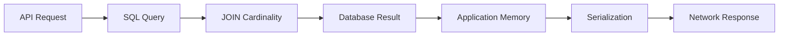

# 16- JOIN Cardinality

## Overview

**JOIN cardinality** describes how many rows from one relation can match rows from another relation during a join.

Understanding cardinality is critical because it determines:

- How many rows a JOIN can produce.
- Whether rows are duplicated in the result.
- How intermediate result sets grow.
- Whether aggregates such as `COUNT()` and `SUM()` are correct.
- Whether pagination represents the intended entity.
- How much memory, CPU, and I/O the database may consume.
- Whether a query remains practical as data volume grows.

For backend engineers, JOIN cardinality is more important than memorizing JOIN syntax. A query can be syntactically correct and still return incorrect results or become prohibitively expensive because its cardinality was misunderstood.

Consider:

```sql
SELECT
    u.id,
    u.email,
    o.id AS order_id
FROM users AS u
JOIN orders AS o
    ON o.user_id = u.id;
```

If a user can have many orders, one user row can become many result rows:

```text
users                 orders
+----+-------+        +----+---------+
| id | email |        | id | user_id |
+----+-------+        +----+---------+
| 1  | Alice |        | 10 | 1       |
| 2  | Bob   |        | 11 | 1       |
+----+-------+        | 12 | 1       |
                       +----+---------+

JOIN result

Alice → order 10
Alice → order 11
Alice → order 12
```

The database has not duplicated data incorrectly. The JOIN has produced one result row for each matching relationship.

## What Cardinality Means

There are two closely related meanings of cardinality in database engineering.

### Relationship Cardinality

Relationship cardinality describes how entities relate to one another:

| Relationship | Typical meaning |
|---|---|
| One-to-one | One row matches at most one row on the other side |
| One-to-many | One row can match many rows |
| Many-to-one | Many rows can match one row |
| Many-to-many | Many rows can match many rows through an association table |

### Result Cardinality

Result cardinality describes how many rows a query produces.

For example:

```sql
SELECT *
FROM users AS u
JOIN orders AS o
    ON o.user_id = u.id;
```

If there are:

```text
1,000 users
50,000 orders
```

the result can contain up to approximately 50,000 matching user-order rows, assuming every order belongs to one user.

The exact count depends on the data and predicates.

## Why JOIN Cardinality Matters

A JOIN changes the shape of data.

A common backend mistake is thinking:

```text
users → orders
```

means:

```text
one user → one result row
```

It actually means:

```text
one user → zero or more result rows
```

That distinction affects API design, aggregation, pagination, reporting, and query performance.

For example, this query:

```sql
SELECT
    u.id,
    u.email,
    o.id
FROM users AS u
LEFT JOIN orders AS o
    ON o.user_id = u.id;
```

returns:

```text
user 1 → order 10
user 1 → order 11
user 2 → NULL
```

If an API expects one object per user, directly serializing this result can produce duplicate users.

## Cardinality Patterns

### One-to-One

If `profiles.user_id` is unique:

```sql
CREATE UNIQUE INDEX idx_profiles_user_id
    ON profiles(user_id);
```

then:

```sql
SELECT
    u.id,
    p.timezone
FROM users AS u
LEFT JOIN profiles AS p
    ON p.user_id = u.id;
```

Each user matches at most one profile.

The relationship is:

```text
users 1 ───── 0..1 profiles
```

The LEFT JOIN therefore does not multiply a user into multiple rows.

### One-to-Many

If:

```text
users.id
orders.user_id
```

and many orders can belong to one user:

```text
users 1 ───── N orders
```

then:

```sql
SELECT
    u.id,
    o.id AS order_id
FROM users AS u
JOIN orders AS o
    ON o.user_id = u.id;
```

can produce multiple rows per user.

### Many-to-One

From the order perspective:

```text
orders N ───── 1 users
```

The same physical relationship is viewed in the opposite direction.

This query:

```sql
SELECT
    o.id,
    u.email
FROM orders AS o
JOIN users AS u
    ON u.id = o.user_id;
```

normally produces at most one user match per order when `users.id` is unique.

This is why joining a foreign key to its referenced primary key is usually non-expanding from the foreign-key side.

### Many-to-Many

Consider:

```text
users
user_roles
roles
```

A user can have many roles and a role can belong to many users.

```sql
SELECT
    u.id,
    r.id AS role_id
FROM users AS u
JOIN user_roles AS ur
    ON ur.user_id = u.id
JOIN roles AS r
    ON r.id = ur.role_id;
```

A single user can produce many result rows.

The relationship is:

```text
users 1 ───── N user_roles N ───── 1 roles
```

The association table determines the result cardinality.

## Cardinality and JOIN Types

JOIN type controls which unmatched rows survive. It does not by itself guarantee one result row per entity.

| JOIN | Matching rows | Unmatched left rows | Cardinality concern |
|---|---|---|---|
| `INNER JOIN` | Matching pairs | Removed | Can multiply rows |
| `LEFT JOIN` | Matching pairs | Preserved | Can multiply rows |
| `RIGHT JOIN` | Matching pairs | Preserved from right | Can multiply rows |
| `FULL OUTER JOIN` | Matching pairs | Preserves both sides | Can multiply rows |
| `CROSS JOIN` | Every combination | N/A | Potentially `N × M` |

The important question is not merely:

> "Which JOIN am I using?"

It is:

> "How many rows can each row on each side match?"

## Cardinality Mathematics

For a single parent row, suppose the matching child counts are:

```text
Parent A → 3 children
Parent B → 5 children
Parent C → 0 children
```

An `INNER JOIN` produces:

```text
3 + 5 = 8 rows
```

because the parent with zero matches disappears.

A `LEFT JOIN` produces:

```text
3 + 5 + 1 = 9 rows
```

because the parent with zero matches remains as one NULL-extended row.

This is an important distinction:

```text
INNER JOIN:
0 matches → 0 result rows

LEFT JOIN:
0 matches → 1 result row
```

For multiple matching relationships, the multiplication becomes more significant.

If a customer has:

```text
5 orders
4 addresses
```

and both relationships are joined directly:

```sql
SELECT
    c.id,
    o.id AS order_id,
    a.id AS address_id
FROM customers AS c
LEFT JOIN orders AS o
    ON o.customer_id = c.id
LEFT JOIN addresses AS a
    ON a.customer_id = c.id;
```

the customer can generate:

```text
5 × 4 = 20 rows
```

The intermediate result contains combinations of orders and addresses.

## Row Multiplication

Row multiplication is one of the most important JOIN problems to recognize.

Consider:

```text
customer 1
├── order 101
├── order 102
└── order 103

customer 1
├── address A
└── address B
```

Joining both relationships produces:

```text
order 101 × address A
order 101 × address B
order 102 × address A
order 102 × address B
order 103 × address A
order 103 × address B
```

Result:

```text
3 × 2 = 6 rows
```

This is mathematically correct according to the query.

It becomes a problem when the developer expected:

```text
1 customer → 3 orders
```

rather than:

```text
1 customer → 6 combinations
```

## Detecting Cardinality Problems

A useful debugging technique is to count rows at each stage.

Start with:

```sql
SELECT COUNT(*)
FROM customers;
```

Then:

```sql
SELECT COUNT(*)
FROM customers AS c
JOIN orders AS o
    ON o.customer_id = c.id;
```

Then add another relationship:

```sql
SELECT COUNT(*)
FROM customers AS c
JOIN orders AS o
    ON o.customer_id = c.id
JOIN addresses AS a
    ON a.customer_id = c.id;
```

If the row count unexpectedly increases by a large factor, inspect the cardinality of each relationship.

You can also identify high-cardinality parents:

```sql
SELECT
    customer_id,
    COUNT(*) AS order_count
FROM orders
GROUP BY customer_id
ORDER BY order_count DESC
LIMIT 20;
```

This is useful for finding customers whose relationships dominate a query.

## Cardinality and Aggregation

Many incorrect aggregates are caused by JOIN multiplication.

Suppose:

```text
customer 1 → 3 orders
customer 1 → 2 addresses
```

This query is problematic:

```sql
SELECT
    c.id,
    COUNT(o.id) AS order_count
FROM customers AS c
LEFT JOIN orders AS o
    ON o.customer_id = c.id
LEFT JOIN addresses AS a
    ON a.customer_id = c.id
GROUP BY c.id;
```

The three orders are combined with two addresses:

```text
3 × 2 = 6 rows
```

Therefore:

```text
COUNT(o.id) = 6
```

instead of:

```text
3
```

Using:

```sql
COUNT(DISTINCT o.id)
```

can correct the count:

```sql
SELECT
    c.id,
    COUNT(DISTINCT o.id) AS order_count
FROM customers AS c
LEFT JOIN orders AS o
    ON o.customer_id = c.id
LEFT JOIN addresses AS a
    ON a.customer_id = c.id
GROUP BY c.id;
```

But `DISTINCT` should not be treated as a universal solution.

For complex queries, independently aggregating each relationship is often clearer:

```sql
SELECT
    c.id,
    COALESCE(o.order_count, 0) AS order_count,
    COALESCE(a.address_count, 0) AS address_count
FROM customers AS c
LEFT JOIN (
    SELECT
        customer_id,
        COUNT(*) AS order_count
    FROM orders
    GROUP BY customer_id
) AS o
    ON o.customer_id = c.id
LEFT JOIN (
    SELECT
        customer_id,
        COUNT(*) AS address_count
    FROM addresses
    GROUP BY customer_id
) AS a
    ON a.customer_id = c.id;
```

Each relationship is aggregated before the relationships are combined.

## SUM and Other Aggregates

Cardinality problems affect more than `COUNT()`.

Suppose a customer has:

```text
orders:
$100
$200
$300

addresses:
2
```

A direct join can make:

```sql
SUM(o.amount)
```

produce:

```text
$1,200
```

instead of:

```text
$600
```

because each order appears twice.

The same issue can affect:

- `SUM()`
- `AVG()`
- `COUNT()`
- `MIN()`
- `MAX()`
- Window functions
- Derived metrics

`MIN()` and `MAX()` may sometimes remain numerically unchanged despite row multiplication, which can make the query appear correct while other metrics are wrong.

## Cardinality and DISTINCT

`DISTINCT` removes duplicate result rows based on the selected columns.

For example:

```sql
SELECT DISTINCT
    c.id
FROM customers AS c
JOIN orders AS o
    ON o.customer_id = c.id;
```

returns one customer ID per matching customer.

However, this:

```sql
SELECT DISTINCT
    c.id,
    o.id
FROM customers AS c
JOIN orders AS o
    ON o.customer_id = c.id;
```

does not remove multiple orders because the `(customer_id, order_id)` pairs are different.

The important question is:

> What constitutes a duplicate for this result?

Do not add `DISTINCT` without understanding the intended grain of the query.

## Query Grain

A useful senior-level technique is to explicitly define the **grain** of every query.

For example:

```text
Query grain = one row per customer
```

or:

```text
Query grain = one row per order
```

or:

```text
Query grain = one row per customer-order relationship
```

Consider:

```sql
SELECT
    c.id,
    o.id AS order_id
FROM customers AS c
JOIN orders AS o
    ON o.customer_id = c.id;
```

The grain is:

```text
one row per order
```

because every order belongs to one customer.

If you then join another one-to-many relationship, the grain may change.

Senior engineers should be able to answer:

> "What does one row in this result represent?"

before adding another JOIN.

## Cardinality and WHERE Predicates

Filtering can reduce cardinality.

For example:

```sql
SELECT
    c.id,
    o.id
FROM customers AS c
JOIN orders AS o
    ON o.customer_id = c.id
WHERE o.status = 'completed';
```

The join first represents matching customer-order rows, and the predicate restricts the qualifying result.

A highly selective predicate can substantially reduce the result set.

However, do not rely on textual query order to reason about physical execution. The optimizer may reorder joins and predicates when semantics permit.

The important engineering question is the final logical result and whether the optimizer has an efficient execution strategy.

## Cardinality and ON Conditions

JOIN conditions determine which rows can match.

Compare:

```sql
SELECT
    c.id,
    o.id
FROM customers AS c
LEFT JOIN orders AS o
    ON o.customer_id = c.id
   AND o.status = 'completed';
```

with:

```sql
SELECT
    c.id,
    o.id
FROM customers AS c
LEFT JOIN orders AS o
    ON o.customer_id = c.id
WHERE o.status = 'completed';
```

The first preserves customers even when they have no completed orders.

The second removes NULL-extended rows and therefore behaves like an inner-filtered result for that condition.

Cardinality reasoning therefore includes not only the relationship but also the predicates that define matching rows.

## Foreign Keys and Cardinality Guarantees

Database constraints provide important cardinality guarantees.

A foreign key:

```sql
FOREIGN KEY (customer_id)
REFERENCES customers(id)
```

guarantees that a non-NULL `orders.customer_id` refers to an existing customer.

But it does **not** guarantee:

```text
one customer → one order
```

because many orders can reference the same customer.

To guarantee one-to-one behavior, the foreign key must also be unique:

```sql
CREATE UNIQUE INDEX idx_profile_user_id
    ON profiles(user_id);
```

Therefore:

```text
FOREIGN KEY
    → referential integrity

UNIQUE + FOREIGN KEY
    → at most one child per parent
```

This distinction is important when reasoning about JOIN cardinality.

## Estimating Cardinality

Database optimizers estimate how many rows will flow through each operator.

PostgreSQL uses statistics collected by `ANALYZE` to estimate:

- Number of rows.
- Value distribution.
- Distinct values.
- Selectivity.
- Correlations between columns in some cases.

Inspect the plan:

```sql
EXPLAIN (ANALYZE, BUFFERS)
SELECT
    c.id,
    o.id
FROM customers AS c
JOIN orders AS o
    ON o.customer_id = c.id
WHERE c.status = 'active';
```

A simplified plan may contain:

```text
Hash Join
  estimated rows: 50000
  actual rows:    52000
```

A severe difference such as:

```text
estimated: 100
actual:    10,000,000
```

indicates a cardinality estimation problem.

This can lead the optimizer to choose a poor join strategy.

## Cardinality Estimation Errors

An optimizer chooses execution strategies based partly on estimated row counts.

For example:

```text
estimated rows = 10
```

may make a nested loop appear inexpensive.

But if:

```text
actual rows = 1,000,000
```

the chosen strategy may become very expensive.

Potential causes include:

- Stale statistics.
- Highly skewed data.
- Correlated columns.
- Complex predicates.
- Data distributions that are difficult to model.
- Insufficient statistics targets for particular workloads.

In PostgreSQL, regular statistics maintenance is therefore part of query performance management.

For a specific table:

```sql
ANALYZE orders;
```

In normal production PostgreSQL environments, autovacuum/analyze configuration should usually handle routine statistics maintenance.

## Join Algorithms and Cardinality

Database engines can use different physical join strategies.

Common PostgreSQL join algorithms include:

| Join strategy | Typical use |
|---|---|
| Nested Loop | Small outer input or efficient indexed inner lookup |
| Hash Join | Equality joins with suitable hashable inputs |
| Merge Join | Sorted inputs, often useful for large ordered relations |

Cardinality influences which strategy is attractive.

For example:

```text
Small outer relation
        ↓
Nested Loop
        ↓
Indexed lookup into large relation
```

can be efficient.

But:

```text
Millions of outer rows
        ↓
Repeated expensive inner scans
```

can be disastrous if estimates are wrong or indexes are unsuitable.

The query author does not normally select the join algorithm directly. The database optimizer chooses it based on statistics, costs, available indexes, and configuration.

## Cardinality and Indexing

Indexes do not eliminate cardinality.

An index can make finding matching rows faster, but if a parent has one million matching children, the database still has to process the required result.

For example:

```sql
CREATE INDEX idx_orders_customer_id
    ON orders(customer_id);
```

can make:

```sql
SELECT *
FROM orders
WHERE customer_id = 42;
```

efficient.

But if customer `42` owns 10 million orders, the result itself is still large.

This leads to an important production principle:

> An index can reduce the cost of finding rows; it cannot make a fundamentally huge result small.

If the API needs only the count:

```sql
SELECT COUNT(*)
FROM orders
WHERE customer_id = 42;
```

do not retrieve every order into the application.

## Cardinality and API Design

Suppose an endpoint returns:

```text
GET /customers/42
```

and the customer has:

```text
2 million orders
```

A query that joins all orders and serializes them into the response is not merely a database problem.

It is an API design problem.

Better designs separate resources:

```text
GET /customers/42
GET /customers/42/orders?limit=50
```

The order collection should be bounded and paginated.

This reduces:

- Database work.
- Network transfer.
- Application memory.
- Serialization cost.
- Response latency.

Cardinality should therefore be considered across the entire request lifecycle:



A cardinality explosion at the database layer propagates into every subsequent layer.

## Cardinality and ORM Queries

ORM abstractions can hide JOIN expansion.

For example, Django:

```python
users = User.objects.filter(
    orders__status="completed"
)
```

may produce duplicate users when multiple matching orders exist.

If the required result is one user per row:

```python
users = User.objects.filter(
    orders__status="completed"
).distinct()
```

may be appropriate.

But if the requirement is only existence, an `Exists` expression can better communicate intent:

```python
from django.db.models import Exists, OuterRef


completed_orders = Order.objects.filter(
    user_id=OuterRef("pk"),
    status="completed",
)

users = User.objects.annotate(
    has_completed_order=Exists(completed_orders)
).filter(
    has_completed_order=True,
)
```

The important principle is to understand the SQL semantics generated by the ORM rather than assuming a high-level relationship operation is automatically one-to-one.

## Cardinality and Pagination

Pagination must be applied at the intended grain.

Suppose:

```text
Customer 1 → 100 orders
Customer 2 → 2 orders
Customer 3 → 1 order
```

This query:

```sql
SELECT
    c.id,
    o.id
FROM customers AS c
JOIN orders AS o
    ON o.customer_id = c.id
ORDER BY c.id, o.id
LIMIT 20;
```

does not return 20 customers.

It returns 20 customer-order rows.

Customer 1 could consume the entire page.

If the API needs 20 customers, paginate customers first and load orders separately.

For large datasets, keyset pagination is often preferable to large `OFFSET` values:

```sql
SELECT
    c.id,
    c.email
FROM customers AS c
WHERE c.id > :last_customer_id
ORDER BY c.id
LIMIT 20;
```

Then fetch related data for that bounded customer set.

## Many-to-Many Cardinality Explosion

Suppose:

```text
1 product → 20 categories
1 product → 50 suppliers
1 product → 10 tags
```

A direct join can create:

```text
20 × 50 × 10 = 10,000 rows
```

for one product.

The query may be logically valid while being operationally unacceptable.

When independent collections are needed, consider:

- Separate queries.
- Pre-aggregation.
- `EXISTS`.
- LATERAL subqueries where appropriate.
- JSON aggregation when the result shape genuinely calls for it.
- Application-side assembly for bounded datasets.

Do not assume that a single SQL query is always superior to multiple carefully designed queries.

## EXISTS as a Cardinality-Control Technique

If the requirement is:

> Find customers who have at least one completed order.

Do not necessarily join all matching orders:

```sql
SELECT DISTINCT
    c.id
FROM customers AS c
JOIN orders AS o
    ON o.customer_id = c.id
WHERE o.status = 'completed';
```

An existence predicate expresses the requirement more directly:

```sql
SELECT
    c.id
FROM customers AS c
WHERE EXISTS (
    SELECT 1
    FROM orders AS o
    WHERE o.customer_id = c.id
      AND o.status = 'completed'
);
```

The database can stop caring about additional matching orders once existence has been established, depending on the chosen execution plan.

This avoids generating a potentially large joined result merely to determine whether a match exists.

## Controlling Cardinality With Pre-Aggregation

Suppose the requirement is:

> Return one row per customer with total completed order value.

Aggregate orders before joining:

```sql
SELECT
    c.id,
    c.email,
    COALESCE(o.total_value, 0) AS total_value
FROM customers AS c
LEFT JOIN (
    SELECT
        customer_id,
        SUM(total_amount) AS total_value
    FROM orders
    WHERE status = 'completed'
    GROUP BY customer_id
) AS o
    ON o.customer_id = c.id;
```

The subquery has a known grain:

```text
one row per customer
```

The outer JOIN therefore preserves that intended grain.

This is one of the most useful techniques for controlling cardinality in reporting queries.

## LATERAL Queries and Per-Parent Limits

Sometimes the requirement is:

> Return each customer with their latest order.

Joining all orders and then attempting to filter afterward may produce unnecessary rows.

PostgreSQL supports `LATERAL`:

```sql
SELECT
    c.id,
    c.email,
    o.id AS order_id,
    o.created_at
FROM customers AS c
LEFT JOIN LATERAL (
    SELECT
        o.id,
        o.created_at
    FROM orders AS o
    WHERE o.customer_id = c.id
    ORDER BY o.created_at DESC, o.id DESC
    LIMIT 1
) AS o
    ON TRUE;
```

The intended output grain is:

```text
one row per customer
```

A suitable index can support this pattern:

```sql
CREATE INDEX idx_orders_customer_created
    ON orders(customer_id, created_at DESC, id DESC);
```

This is a production-oriented example of shaping cardinality rather than retrieving the entire child collection.

## Cardinality and Window Functions

Window functions operate over the rows present in the result set.

If a JOIN multiplies rows first:

```sql
SELECT
    c.id,
    o.id,
    ROW_NUMBER() OVER (
        PARTITION BY c.id
        ORDER BY o.created_at DESC
    ) AS order_rank
FROM customers AS c
JOIN orders AS o
    ON o.customer_id = c.id;
```

the window operates over all matching order rows.

If another one-to-many table is joined before the window function, the partition can contain multiplied rows.

Therefore, when using window functions:

1. Define the intended grain.
2. Establish that grain before applying the window.
3. Avoid unrelated one-to-many joins before the window operation.

## Production Performance Considerations

Large cardinality can cause:

- High CPU usage.
- Large hash tables.
- Increased memory consumption.
- Temporary disk spills.
- Large sorts.
- Increased network transfer.
- Long transaction durations.
- Lock retention for long-running operations.
- Increased database connection occupancy.
- API latency.
- Application memory pressure.

For critical queries, inspect:

```sql
EXPLAIN (ANALYZE, BUFFERS)
SELECT
    ...
```

Look for:

- Estimated versus actual rows.
- Large row-count jumps between plan nodes.
- Hash operations spilling to disk.
- Expensive sorts.
- Sequential scans over unexpectedly large relations.
- Nested loops with unexpectedly large inner executions.
- Large intermediate results.

The final row count alone is not sufficient. An intermediate result can be enormous even when the final query returns only a few rows.

## Monitoring Cardinality Problems

Production monitoring should focus on query behavior, not just application latency.

Useful database metrics include:

- Query execution time.
- Rows returned.
- Rows examined or processed where available.
- Buffer reads.
- Temporary file usage.
- Memory usage.
- CPU consumption.
- Sequential scan frequency.
- Query frequency.
- Lock duration.

For PostgreSQL, tools such as `pg_stat_statements` can help identify frequently executed and expensive queries.

A query that takes:

```text
50 ms × 100,000 executions
```

may be more operationally significant than:

```text
10 seconds × 2 executions
```

depending on workload.

Cardinality analysis should therefore consider both per-query cost and execution frequency.

## Production Best Practices

### Define the Result Grain

Before writing or modifying a complex query, explicitly state:

```text
One row per customer.
```

or:

```text
One row per order item.
```

This makes unintended cardinality changes easier to identify.

### Understand Every Relationship

For every JOIN, ask:

```text
For one row on the left,
how many rows can match on the right?
```

Do not assume uniqueness unless the schema guarantees it.

### Validate Uniqueness in the Database

If a relationship is logically one-to-one, enforce it:

```sql
UNIQUE (user_id)
```

Do not rely only on application conventions.

### Aggregate Before Joining Independent Collections

If two independent one-to-many relationships must be summarized, aggregate them independently before combining them.

### Use EXISTS for Existence

If you need to know whether a relationship exists, avoid generating all matching rows unless those rows are actually required.

### Paginate at the Correct Grain

If the endpoint returns users, paginate users—not user-order rows.

### Inspect Execution Plans

Use:

```sql
EXPLAIN (ANALYZE, BUFFERS)
```

for production-critical queries and test with realistic data volumes.

### Bound Relationship Queries

Avoid unbounded child collections in APIs and background jobs.

### Optimize for Real Cardinality

Test with realistic distributions, not only average values.

A system may appear fast when every customer has five orders but fail when a small percentage have millions.

## Common Mistakes and Pitfalls

| Mistake | Why it happens | Better approach |
|---|---|---|
| Assuming one parent produces one row | Relationship cardinality is ignored | Define query grain explicitly |
| Joining two one-to-many tables directly | Each collection multiplies the other | Pre-aggregate or query independently |
| Using `DISTINCT` everywhere | Duplicates are treated as a generic SQL problem | Determine why rows multiply first |
| Incorrect `COUNT()` after a JOIN | Intermediate rows are multiplied | Use `COUNT(DISTINCT ...)` or pre-aggregation |
| Incorrect `SUM()` after a JOIN | Values appear multiple times | Aggregate at the correct grain |
| Paginating joined rows | JOIN result is mistaken for parent entities | Paginate the intended parent relation |
| Missing a uniqueness constraint | Application assumes one-to-one behavior | Enforce uniqueness in the schema |
| Loading huge child collections | Relationship cardinality is ignored | Use pagination, filtering, or aggregation |
| Using JOIN for existence checks | All matching rows may be generated | Prefer `EXISTS` when appropriate |
| Ignoring estimated vs actual rows | Query plan assumptions are not validated | Use `EXPLAIN (ANALYZE, BUFFERS)` |
| Testing only average data | High-cardinality outliers are missed | Test realistic worst-case distributions |
| Assuming indexes solve cardinality | Faster lookup does not reduce result size | Reduce required rows or change query shape |

## A Practical Cardinality Review Process

When reviewing a complex production query:

1. **Define the required grain.**  
   State exactly what one output row represents.

2. **List every JOIN.**  
   Record the relationship between the two sides.

3. **Identify uniqueness guarantees.**  
   Check primary keys, unique constraints, and foreign keys.

4. **Estimate multiplication.**  
   Determine how many rows each relation can contribute per parent.

5. **Inspect independent one-to-many relationships.**  
   Joining them directly may create multiplicative combinations.

6. **Review aggregates.**  
   Verify that `COUNT`, `SUM`, and other metrics operate at the intended grain.

7. **Review pagination.**  
   Ensure `LIMIT` and `OFFSET` or cursor predicates apply to the intended entity.

8. **Consider `EXISTS`.**  
   Replace row-producing joins when only existence is required.

9. **Pre-aggregate where appropriate.**  
   Establish a controlled grain before joining summaries.

10. **Inspect the execution plan.**  
    Compare estimated and actual row counts and identify expensive intermediate results.

## Interview Traps

| Interview question | Strong answer |
|---|---|
| What is JOIN cardinality? | The number of matching rows produced by a JOIN and the relationship between rows on each side. |
| Why does a one-to-many JOIN produce duplicate parent rows? | Each parent is repeated once for every matching child row. |
| What happens when two one-to-many relationships are joined? | Their matching rows can multiply, potentially producing `N × M` rows per parent. |
| Does `LEFT JOIN` prevent row multiplication? | No. It preserves unmatched parents but still returns one row for every matching child. |
| Why can `COUNT()` be wrong after multiple JOINs? | Intermediate row multiplication can cause the same logical entity to appear multiple times. |
| Is `COUNT(DISTINCT ...)` always the best solution? | No. It may be correct, but pre-aggregation or a different query shape can be clearer and more efficient. |
| How do you guarantee one-to-one JOIN behavior? | Enforce uniqueness on the referencing column in addition to the foreign key. |
| Why is `EXISTS` useful? | It expresses existence without requiring the query to return every matching relationship row. |
| What is query grain? | The business meaning of one row in the result, such as one row per customer or one row per order. |
| Why can pagination be incorrect after a JOIN? | `LIMIT` applies to joined rows, not necessarily the parent entities the API intends to paginate. |
| What does a large estimated-vs-actual row difference indicate? | The optimizer's cardinality estimate is inaccurate, which can lead to a poor execution plan. |
| Can an index eliminate a cardinality problem? | No. It can make access more efficient but cannot eliminate a fundamentally large result set. |
| Why is cardinality important for performance? | It determines the size of intermediate results and influences join strategies, memory, CPU, I/O, and network costs. |

## Key Takeaways

- **Always define the grain of a query—know exactly what one result row represents before adding JOINs.**
- **One-to-many and many-to-many relationships can multiply rows, and multiple independent many-side JOINs can create `N × M` or larger explosions.**
- **Protect aggregates, pagination, and API responses from unintended cardinality changes using pre-aggregation, `EXISTS`, correct query grain, and bounded result sets.**
- **Use database constraints to guarantee cardinality assumptions such as one-to-one relationships; do not rely solely on application-level conventions.**
- **For production queries, validate cardinality with realistic data and `EXPLAIN (ANALYZE, BUFFERS)`, paying particular attention to estimated-versus-actual row counts and intermediate result sizes.**