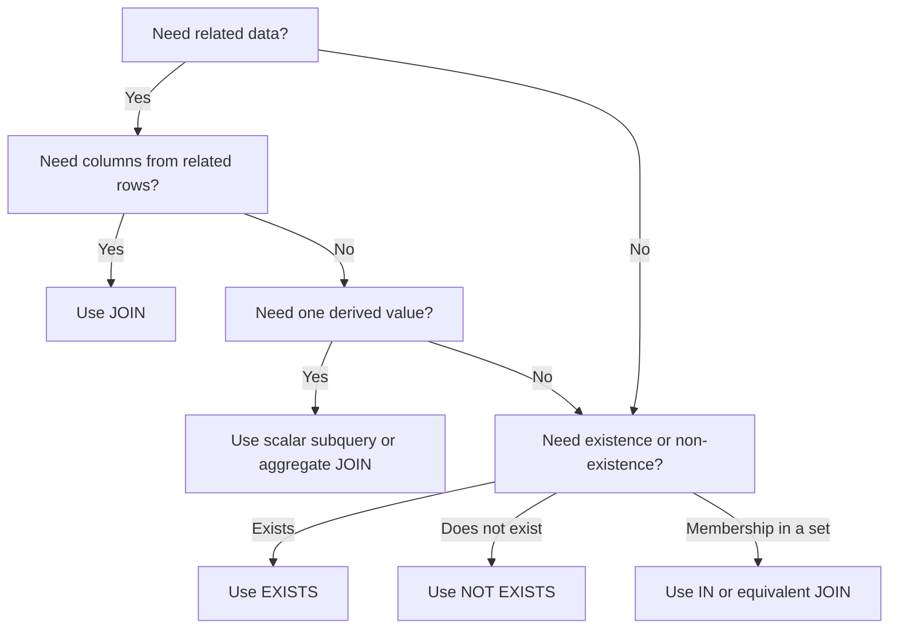

# 20- JOIN vs Subquery

## Overview

`JOIN`s and subqueries are two ways to express relationships between data in SQL. Both can solve many of the same problems, but they communicate different query intent and can lead to different execution strategies.

A `JOIN` combines row sources into a relational result. A subquery creates an intermediate relation or performs a correlated/existence check that can be evaluated independently or in relation to an outer row.

The right choice should be driven primarily by:

- Result shape and required data.
- Whether related columns must be returned.
- Whether the requirement is existence or data retrieval.
- Expected cardinality.
- Query readability and maintainability.
- Actual execution-plan behavior.

Modern relational optimizers can transform many logically equivalent forms into similar physical plans. Therefore, avoid rules such as "JOINs are always faster than subqueries." Measure the actual query.

## JOINs and Subqueries Solve Different Problems

Consider:

```text
customers
    │
    └── orders
```

A JOIN is natural when the query needs columns from both relations:

```sql
SELECT
    c.id,
    c.email,
    o.id AS order_id,
    o.amount
FROM customers AS c
JOIN orders AS o
    ON o.customer_id = c.id;
```

A subquery is often natural when the question is:

> Does a related row exist?

```sql
SELECT
    c.id,
    c.email
FROM customers AS c
WHERE EXISTS (
    SELECT 1
    FROM orders AS o
    WHERE o.customer_id = c.id
);
```

The distinction is important:

```text
JOIN
    "Combine these relations."

EXISTS
    "Does a related row exist?"

Scalar subquery
    "Give me one related value."

IN
    "Does this value belong to this set?"

Derived table
    "Build this relation first, then query it."
```

## Core Comparison

| Aspect | JOIN | Subquery |
|---|---|---|
| Primary purpose | Combine relations | Compute/filter using another query |
| Return columns from related table | Natural | Possible, but often less direct |
| Existence checks | Possible | `EXISTS` is often clearer |
| Aggregation before joining | Possible | Derived/CTE subquery can be useful |
| Readability | Strong for relationship traversal | Strong for isolated conditions |
| Row multiplication | Possible | Often avoidable with `EXISTS` |
| Optimizer freedom | Usually high | Depends on subquery type |
| Correlated execution risk | Not normally applicable | Can matter significantly |
| Best choice | Data from multiple relations | Existence, scalar values, or isolated computation |

## JOIN for Retrieving Related Data

Suppose an API needs:

```text
order ID
customer email
order amount
```

A JOIN directly represents the required data relationship:

```sql
SELECT
    o.id,
    c.email,
    o.amount
FROM orders AS o
JOIN customers AS c
    ON c.id = o.customer_id
WHERE o.status = 'completed';
```

This is generally preferable to repeatedly querying the related table through scalar subqueries.

The query's result grain is:

```text
one row per completed order
```

and the customer information is attached to each order.

## Subquery for Existence

Suppose the requirement is:

> Return customers who have at least one completed order.

A JOIN works:

```sql
SELECT DISTINCT
    c.id,
    c.email
FROM customers AS c
JOIN orders AS o
    ON o.customer_id = c.id
WHERE o.status = 'completed';
```

But `DISTINCT` is required because a customer can have multiple completed orders.

An `EXISTS` query expresses the requirement more directly:

```sql
SELECT
    c.id,
    c.email
FROM customers AS c
WHERE EXISTS (
    SELECT 1
    FROM orders AS o
    WHERE o.customer_id = c.id
      AND o.status = 'completed'
);
```

The second form says:

> Keep this customer if at least one matching order exists.

It does not need to produce one output row per matching order.

## Why EXISTS Can Be Preferable

For existence checks, `EXISTS` has an important semantic property:

> The database only needs to establish that at least one qualifying row exists.

Conceptually:

```text
Customer
   │
   ▼
Search orders
   │
   ├── first qualifying order found ──► TRUE
   │
   └── no qualifying order ───────────► FALSE
```

The optimizer may implement this as a semi-join or another equivalent strategy.

Do not interpret this as a guarantee that `EXISTS` always stops after the first physical row or is always faster. The optimizer and access path determine the actual implementation.

## JOIN Can Accidentally Change Cardinality

Consider:

```sql
SELECT
    c.id,
    c.email
FROM customers AS c
JOIN orders AS o
    ON o.customer_id = c.id
WHERE o.status = 'completed';
```

If customer `42` has five completed orders, customer `42` appears five times.

If the requirement is only:

```text
customers with at least one completed order
```

the JOIN has introduced unnecessary row multiplication.

A common workaround is:

```sql
SELECT DISTINCT
    c.id,
    c.email
FROM customers AS c
JOIN orders AS o
    ON o.customer_id = c.id
WHERE o.status = 'completed';
```

But `EXISTS` is often a better representation of the requirement:

```sql
SELECT
    c.id,
    c.email
FROM customers AS c
WHERE EXISTS (
    SELECT 1
    FROM orders AS o
    WHERE o.customer_id = c.id
      AND o.status = 'completed'
);
```

The important engineering lesson is:

> Do not JOIN merely to test existence.

## `IN` Subqueries

`IN` can express membership in a set.

For example:

```sql
SELECT
    c.id,
    c.email
FROM customers AS c
WHERE c.id IN (
    SELECT o.customer_id
    FROM orders AS o
    WHERE o.status = 'completed'
);
```

This means:

> Select customers whose ID belongs to the set of customers with completed orders.

Depending on the database and query, the optimizer may transform this into a semi-join or another equivalent plan.

For correlated existence logic, `EXISTS` is often clearer:

```sql
SELECT
    c.id,
    c.email
FROM customers AS c
WHERE EXISTS (
    SELECT 1
    FROM orders AS o
    WHERE o.customer_id = c.id
      AND o.status = 'completed'
);
```

## `NOT EXISTS`

`NOT EXISTS` is useful for anti-join logic.

For example:

> Find customers who have never placed a completed order.

```sql
SELECT
    c.id,
    c.email
FROM customers AS c
WHERE NOT EXISTS (
    SELECT 1
    FROM orders AS o
    WHERE o.customer_id = c.id
      AND o.status = 'completed'
);
```

This is often clearer than constructing a LEFT JOIN and checking for `NULL`:

```sql
SELECT
    c.id,
    c.email
FROM customers AS c
LEFT JOIN orders AS o
    ON o.customer_id = c.id
   AND o.status = 'completed'
WHERE o.id IS NULL;
```

Both patterns can be valid. `NOT EXISTS` directly expresses the business predicate.

## NULL Behavior: NOT IN vs NOT EXISTS

A major SQL pitfall is:

```sql
NOT IN
```

when the subquery can produce `NULL`.

Consider:

```sql
SELECT
    c.id
FROM customers AS c
WHERE c.id NOT IN (
    SELECT o.customer_id
    FROM orders AS o
);
```

If the subquery contains `NULL`, SQL's three-valued logic can cause the predicate to become `UNKNOWN` for values that would otherwise appear to qualify.

When expressing an anti-existence condition, prefer:

```sql
WHERE NOT EXISTS (
    SELECT 1
    FROM orders AS o
    WHERE o.customer_id = c.id
);
```

This avoids the same class of `NULL` semantics problem.

If `NOT IN` is used, ensure the subquery cannot produce `NULL`, or explicitly account for the semantics.

## Scalar Subqueries

A scalar subquery returns a single value for each outer row.

For example:

```sql
SELECT
    c.id,
    c.email,
    (
        SELECT MAX(o.created_at)
        FROM orders AS o
        WHERE o.customer_id = c.id
    ) AS last_order_at
FROM customers AS c;
```

This is useful when the query needs one derived value rather than multiple child rows.

The result remains:

```text
one row per customer
```

even though the orders table may contain many rows per customer.

An equivalent aggregation-based JOIN is:

```sql
SELECT
    c.id,
    c.email,
    MAX(o.created_at) AS last_order_at
FROM customers AS c
LEFT JOIN orders AS o
    ON o.customer_id = c.id
GROUP BY
    c.id,
    c.email;
```

The best form depends on the complete query, indexes, optimizer, and required result shape.

## Scalar Subquery Must Be Scalar

A scalar subquery must produce at most one row.

This can fail:

```sql
SELECT
    c.id,
    (
        SELECT o.id
        FROM orders AS o
        WHERE o.customer_id = c.id
    ) AS order_id
FROM customers AS c;
```

If a customer has multiple orders, the scalar subquery returns multiple rows and the query errors.

Use an aggregate:

```sql
SELECT
    c.id,
    (
        SELECT MAX(o.id)
        FROM orders AS o
        WHERE o.customer_id = c.id
    ) AS latest_order_id
FROM customers AS c;
```

or explicitly select a single row using database-supported ordering and limiting:

```sql
SELECT
    c.id,
    (
        SELECT o.id
        FROM orders AS o
        WHERE o.customer_id = c.id
        ORDER BY o.created_at DESC, o.id DESC
        LIMIT 1
    ) AS latest_order_id
FROM customers AS c;
```

The ordering is important when "latest" has business meaning.

## Correlated Subqueries

A correlated subquery references a column from the outer query:

```sql
SELECT
    c.id,
    c.email
FROM customers AS c
WHERE EXISTS (
    SELECT 1
    FROM orders AS o
    WHERE o.customer_id = c.id
);
```

The inner query refers to:

```sql
c.id
```

from the outer query.

Conceptually, this can be understood as:

```text
for each customer:
    evaluate whether a matching order exists
```

However, do not assume the database literally executes the inner query independently once per outer row. A capable optimizer may transform the correlated subquery into a semi-join or another efficient plan.

## The N+1 Problem Is Different

A SQL subquery is not automatically an N+1 query problem.

This is one SQL statement:

```sql
SELECT
    c.id,
    (
        SELECT MAX(o.created_at)
        FROM orders AS o
        WHERE o.customer_id = c.id
    ) AS last_order_at
FROM customers AS c;
```

An N+1 problem usually occurs when application code performs:

```text
1 query for customers
+
N queries for orders
```

For example, ORM code that lazily loads relationships can create N+1 database round trips.

The distinction is:

```text
SQL correlated subquery
    → one SQL statement

Application N+1
    → many SQL statements / network round trips
```

Both can be performance problems, but they require different diagnosis.

## Derived Tables

A subquery in the `FROM` clause creates a derived table.

For example:

```sql
SELECT
    c.id,
    c.email,
    o.total_amount
FROM customers AS c
JOIN (
    SELECT
        customer_id,
        SUM(amount) AS total_amount
    FROM orders
    WHERE status = 'completed'
    GROUP BY customer_id
) AS o
    ON o.customer_id = c.id;
```

The subquery first produces:

```text
customer_id → total_amount
```

Then the outer query joins that result to customers.

This can be useful when you want to:

- Aggregate before joining.
- Reduce one-to-many cardinality.
- Isolate complex relational logic.
- Make the intended intermediate grain explicit.

## Pre-Aggregation to Control Cardinality

Suppose a customer has many orders.

Instead of:

```sql
customers
    JOIN orders
```

producing one row per order, aggregate orders first:

```sql
SELECT
    customer_id,
    COUNT(*) AS order_count,
    SUM(amount) AS total_amount
FROM orders
GROUP BY customer_id;
```

Then join:

```sql
SELECT
    c.id,
    c.email,
    COALESCE(o.order_count, 0) AS order_count,
    COALESCE(o.total_amount, 0) AS total_amount
FROM customers AS c
LEFT JOIN (
    SELECT
        customer_id,
        COUNT(*) AS order_count,
        SUM(amount) AS total_amount
    FROM orders
    GROUP BY customer_id
) AS o
    ON o.customer_id = c.id;
```

This produces one row per customer.

The subquery acts as a cardinality-control boundary.

## CTE vs Subquery vs JOIN

A Common Table Expression can provide another way to structure the same relational operation:

```sql
WITH completed_orders AS (
    SELECT
        customer_id,
        COUNT(*) AS order_count,
        SUM(amount) AS total_amount
    FROM orders
    WHERE status = 'completed'
    GROUP BY customer_id
)
SELECT
    c.id,
    c.email,
    COALESCE(co.order_count, 0) AS order_count,
    COALESCE(co.total_amount, 0) AS total_amount
FROM customers AS c
LEFT JOIN completed_orders AS co
    ON co.customer_id = c.id;
```

CTEs can improve readability for complex queries, but they should not be treated as automatically materialized or automatically faster. Modern PostgreSQL, for example, can inline eligible CTEs, while explicitly materialized CTEs can act as optimization boundaries.

Use the construct that makes the relational intent clear, then validate the plan.

## JOIN vs Subquery for Aggregation

Consider:

> Find customers whose total completed order value exceeds ₹100,000.

A derived-table approach:

```sql
SELECT
    c.id,
    c.email,
    totals.total_amount
FROM customers AS c
JOIN (
    SELECT
        customer_id,
        SUM(amount) AS total_amount
    FROM orders
    WHERE status = 'completed'
    GROUP BY customer_id
) AS totals
    ON totals.customer_id = c.id
WHERE totals.total_amount > 100000;
```

A correlated scalar subquery can also express the condition:

```sql
SELECT
    c.id,
    c.email
FROM customers AS c
WHERE (
    SELECT COALESCE(SUM(o.amount), 0)
    FROM orders AS o
    WHERE o.customer_id = c.id
      AND o.status = 'completed'
) > 100000;
```

Both can be valid.

The derived-table form makes the aggregated relation explicit. The scalar subquery keeps the computation attached to the customer predicate.

Use `EXPLAIN (ANALYZE, BUFFERS)` when performance matters.

## JOIN vs EXISTS

A useful rule is:

| Requirement | Preferred starting point |
|---|---|
| Need columns from both tables | `JOIN` |
| Need to know whether a related row exists | `EXISTS` |
| Need to know whether no related row exists | `NOT EXISTS` |
| Need membership in a set | `IN` |
| Need one related scalar value | Scalar subquery |
| Need aggregated relation before joining | Derived table or CTE |
| Need optional related data | `LEFT JOIN` |
| Need to combine multiple relations at row level | `JOIN` |

This is a starting point, not an absolute performance rule.

## Performance Considerations

The database optimizer may transform logically equivalent SQL.

For example:

```sql
WHERE EXISTS (...)
```

may become a semi-join.

Likewise, some `IN` subqueries can be transformed into equivalent join strategies.

Therefore:

> SQL syntax is the logical specification; the execution plan determines the physical implementation.

Evaluate:

```sql
EXPLAIN (ANALYZE, BUFFERS)
SELECT ...;
```

Important metrics include:

- Actual row counts.
- Estimated row counts.
- Join strategy.
- Index usage.
- Sequential scans.
- Loop counts.
- Sort operations.
- Hash operations.
- Buffer reads.
- Execution time.

## Indexing for JOINs and Subqueries

Consider:

```sql
SELECT
    c.id
FROM customers AS c
WHERE EXISTS (
    SELECT 1
    FROM orders AS o
    WHERE o.customer_id = c.id
      AND o.status = 'completed'
);
```

An index supporting the correlated predicate can be important:

```sql
CREATE INDEX idx_orders_customer_status
    ON orders(customer_id, status);
```

Whether this exact index is optimal depends on the broader workload.

For a JOIN:

```sql
SELECT
    c.id,
    o.id
FROM customers AS c
JOIN orders AS o
    ON o.customer_id = c.id;
```

the foreign-key side commonly benefits from an index on:

```text
orders.customer_id
```

Foreign-key constraints and indexes serve different purposes:

- A foreign key provides referential integrity.
- An index provides an access path.

Do not assume one implies the other.

## Query Planning and Cardinality

The optimizer relies heavily on cardinality estimates.

If it estimates:

```text
100 rows
```

but the actual result is:

```text
10,000,000 rows
```

the optimizer may choose an inefficient strategy.

This matters particularly for:

- JOIN-heavy queries.
- Correlated predicates.
- Skewed distributions.
- Highly selective filters.
- Large fact tables.

When a query becomes unexpectedly slow, inspect estimated versus actual rows before rewriting SQL blindly.

## Avoiding Unnecessary Row Expansion

Suppose you only need to determine whether an order exists.

Avoid:

```sql
SELECT DISTINCT
    c.id
FROM customers AS c
JOIN orders AS o
    ON o.customer_id = c.id;
```

Prefer:

```sql
SELECT
    c.id
FROM customers AS c
WHERE EXISTS (
    SELECT 1
    FROM orders AS o
    WHERE o.customer_id = c.id
);
```

The second query expresses the intended cardinality directly:

```text
one output row per customer
```

This can eliminate unnecessary intermediate rows and the need for deduplication.

## Security Considerations

Neither JOINs nor subqueries provide authorization.

For multi-tenant applications, enforce tenant isolation explicitly:

```sql
SELECT
    o.id
FROM orders AS o
WHERE o.tenant_id = :tenant_id
  AND EXISTS (
      SELECT 1
      FROM customers AS c
      WHERE c.id = o.customer_id
        AND c.tenant_id = :tenant_id
  );
```

The exact predicates depend on the schema and authorization model.

Application-generated values must be parameterized:

```sql
WHERE o.tenant_id = :tenant_id
```

Do not construct SQL with string interpolation.

In Django or SQLAlchemy, use the ORM's parameterization mechanisms rather than manually concatenating user input into SQL.

## ORM Considerations

Django provides several ways to represent JOIN and subquery semantics.

For related objects:

```python
orders = (
    Order.objects
    .select_related("customer")
    .filter(status="completed")
)
```

For existence:

```python
from django.db.models import Exists, OuterRef

completed_orders = Order.objects.filter(
    customer_id=OuterRef("pk"),
    status="completed",
)

customers = Customer.objects.annotate(
    has_completed_order=Exists(completed_orders),
)
```

For collections:

```python
customers = Customer.objects.prefetch_related("orders")
```

The generated SQL and number of database round trips should be inspected for important endpoints.

A senior-level approach is not:

> Always use JOINs.

It is:

> Choose the relational operation that matches the required result shape, then inspect the SQL and execution behavior.

## API and Backend Design

Suppose a REST endpoint returns:

```text
GET /customers?has_orders=true
```

The requirement is existence-based.

A database query based on `EXISTS` is often a good semantic match:

```sql
SELECT
    c.id,
    c.email
FROM customers AS c
WHERE EXISTS (
    SELECT 1
    FROM orders AS o
    WHERE o.customer_id = c.id
);
```

If the endpoint instead returns:

```json
{
  "id": 42,
  "email": "alice@example.com",
  "orders": [
    {
      "id": 101,
      "amount": 2500
    }
  ]
}
```

the application needs actual order data, so a JOIN, prefetch, or separate child query is more appropriate.

For large one-to-many collections, fetching parent records first and then loading children can provide more predictable pagination and avoid huge flattened result sets.

## Production Query Review

Before shipping a JOIN/subquery-heavy query, check:

### Correctness

- What is the intended result grain?
- Can related rows be missing?
- Can related rows multiply the result?
- Are `NULL` values possible?
- Does `NOT IN` interact with nullable values?
- Are duplicate relationships possible?

### Performance

- What is the expected cardinality?
- Are JOIN keys indexed appropriately?
- Are filtering predicates selective?
- Are estimated and actual rows close?
- Does the query create large intermediate relations?
- Is `DISTINCT` hiding a cardinality problem?

### Operational behavior

- Does the query run frequently?
- Is it on a latency-sensitive API path?
- Can it hold database resources for a long time?
- Does it increase connection occupancy?
- Does it perform acceptably as tables grow?

### Maintainability

- Does the SQL communicate the business requirement clearly?
- Would another engineer understand why `EXISTS` or a JOIN was chosen?
- Is complex logic better isolated in a CTE or derived table?
- Does the ORM generate the intended SQL?

## Common Mistakes and Pitfalls

| Mistake | Problem | Better approach |
|---|---|---|
| Assuming JOIN is always faster | Modern optimizers can transform equivalent queries | Compare execution plans |
| Using JOIN only to test existence | Can multiply rows | Prefer `EXISTS` |
| Adding `DISTINCT` to hide JOIN multiplication | Masks cardinality issues | Fix the result grain |
| Using `NOT IN` with nullable subquery values | `NULL` can produce UNKNOWN | Prefer `NOT EXISTS` when appropriate |
| Assuming correlated subquery means N+1 | A correlated subquery is still one SQL statement | Distinguish SQL execution from application round trips |
| Using scalar subquery that returns multiple rows | Causes a runtime error | Aggregate or constrain it to one row |
| Assuming CTEs are always materialized | Optimizer behavior varies | Inspect the execution plan |
| Assuming CTEs are always faster | Readability and performance are separate concerns | Benchmark the actual query |
| Ignoring indexes on correlated predicates | Can cause repeated expensive lookups | Index relevant search columns |
| Joining multiple child collections blindly | Can create multiplicative row counts | Pre-aggregate or query separately |
| Optimizing syntax before defining semantics | Can produce fast but incorrect results | Establish business semantics first |

## Interview Traps

### "Are subqueries slower than JOINs?"

No.

Some subqueries and JOINs can produce the same execution plan. The optimizer may rewrite one form into another.

The correct answer is:

> Compare the execution plan and workload rather than relying on a blanket rule.

### "Should EXISTS always be replaced by JOIN?"

No.

`EXISTS` is often the better semantic representation when only existence matters. A JOIN can introduce duplicate rows when multiple related records exist.

### "Is a correlated subquery always executed once per outer row?"

Not necessarily.

That is a useful conceptual model, but the optimizer can transform correlated subqueries into joins or other strategies.

### "Is DISTINCT a good way to fix duplicate JOIN results?"

Usually not as a first response.

First determine why rows multiply and whether the query should be expressing existence, aggregation, or a different result grain.

### "Is NOT IN equivalent to NOT EXISTS?"

Not in the presence of `NULL`.

`NOT EXISTS` is generally safer for anti-existence logic when nullable values could participate.

### "When should I use a subquery instead of a JOIN?"

Use a subquery when the operation naturally represents:

- Existence.
- Non-existence.
- A scalar derived value.
- A set-membership condition.
- A pre-aggregated or isolated relation.

Use a JOIN when the query fundamentally needs to combine and return data from related relations.

## Practical Decision Flow



The decision should then be validated against:

```text
Correct semantics
      ↓
Result cardinality
      ↓
Execution plan
      ↓
Production workload
```

## Key Takeaways

- **Use JOINs when the query needs to combine and return data from related relations; use subqueries when existence, scalar derivation, set membership, or pre-aggregation better expresses the requirement.**
- **`EXISTS` and `NOT EXISTS` are strong choices for existence logic because they avoid unnecessary one-to-many row expansion.**
- **Do not assume JOINs or subqueries are inherently faster; modern optimizers can transform equivalent SQL, so validate important queries with execution plans.**
- **Treat result grain and `NULL` semantics as first-class concerns, especially with `DISTINCT`, `NOT IN`, correlated subqueries, and one-to-many relationships.**
- **In production systems, choose the clearest relational expression first, then validate indexing, cardinality, generated ORM SQL, and actual database performance.**