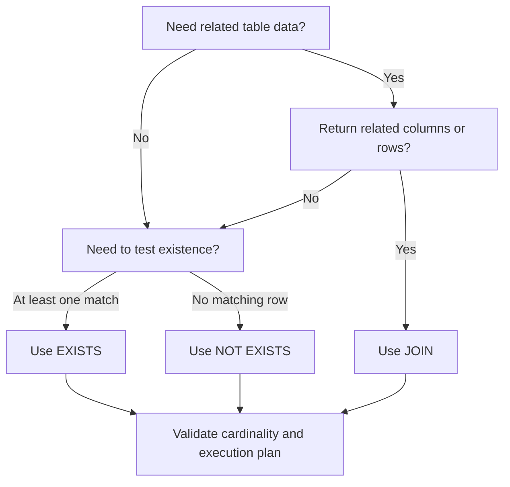

# 21- JOIN vs EXISTS

## Overview

`JOIN` and `EXISTS` can both express relationships between tables, but they represent different relational intent.

Use a `JOIN` when the query needs to combine rows and potentially return columns from both relations. Use `EXISTS` when the requirement is primarily a boolean test: whether at least one related row satisfies a condition.

This distinction matters because a JOIN can change result cardinality, while `EXISTS` is an existence predicate and does not multiply the outer rows.

A useful mental model is:

```text
JOIN
    "Return rows formed from both relations."

EXISTS
    "Keep this outer row if a matching inner row exists."
```

The performance difference is not determined by syntax alone. PostgreSQL and other modern relational databases can transform `EXISTS` into a semi-join or choose other equivalent execution strategies. Always validate important queries with their execution plans.

## Basic Example

Consider these tables:

```text
customers
---------
id
email

orders
------
id
customer_id
status
amount
```

Suppose the requirement is:

> Find customers who have at least one completed order.

A JOIN can express it:

```sql
SELECT DISTINCT
    c.id,
    c.email
FROM customers AS c
JOIN orders AS o
    ON o.customer_id = c.id
WHERE o.status = 'completed';
```

The `DISTINCT` is necessary if a customer can have multiple completed orders.

The same requirement can be expressed more directly with `EXISTS`:

```sql
SELECT
    c.id,
    c.email
FROM customers AS c
WHERE EXISTS (
    SELECT 1
    FROM orders AS o
    WHERE o.customer_id = c.id
      AND o.status = 'completed'
);
```

The second query communicates the business requirement more precisely:

> Return the customer if at least one qualifying order exists.

## Why JOIN and EXISTS Are Different

A JOIN constructs a combined relation.

If one customer has three matching orders:

```text
customers
customer_id = 42

orders
order_id
101
102
103
```

then:

```sql
SELECT
    c.id,
    o.id AS order_id
FROM customers AS c
JOIN orders AS o
    ON o.customer_id = c.id;
```

produces:

```text
customer_id | order_id
------------+---------
42          | 101
42          | 102
42          | 103
```

`EXISTS` does not produce those child rows:

```sql
SELECT
    c.id
FROM customers AS c
WHERE EXISTS (
    SELECT 1
    FROM orders AS o
    WHERE o.customer_id = c.id
);
```

produces:

```text
customer_id
------------
42
```

The difference is result cardinality.

## Result Cardinality

| Requirement | JOIN | EXISTS |
|---|---|---|
| Return related rows | Excellent fit | Not appropriate |
| Return related columns | Excellent fit | Not directly |
| Test whether a relationship exists | Possible | Excellent fit |
| Preserve one outer row | May require deduplication | Natural |
| One-to-many relationship | Can multiply rows | Does not multiply outer rows |
| Need child-level filtering | Good | Good for existence |
| Need only boolean existence | Often unnecessary work | Natural |

Before choosing between them, determine the intended **result grain**.

For example:

```text
One row per customer
```

is different from:

```text
One row per customer-order pair
```

Many JOIN-related bugs are actually cardinality-design bugs.

## When to Use EXISTS

`EXISTS` is usually the clearest choice when the requirement is:

- "Has at least one..."
- "Contains at least one..."
- "There is a matching..."
- "Return records for which a related record exists."
- "Exclude records for which a related record exists."

Example:

```sql
SELECT
    p.id,
    p.name
FROM products AS p
WHERE EXISTS (
    SELECT 1
    FROM order_items AS oi
    WHERE oi.product_id = p.id
);
```

This asks:

> Which products have been ordered at least once?

There is no need to retrieve individual order-item rows.

## When to Use JOIN

Use a JOIN when the related rows are part of the requested result.

For example:

```sql
SELECT
    o.id,
    o.created_at,
    c.email,
    o.amount
FROM orders AS o
JOIN customers AS c
    ON c.id = o.customer_id
WHERE o.status = 'completed';
```

The query needs:

- Order data.
- Customer data.

A JOIN naturally represents that requirement.

Replacing this with `EXISTS` would not make sense because `EXISTS` only answers whether a matching row exists; it does not provide the related customer columns needed in the result.

## INNER JOIN vs EXISTS

These queries can appear similar:

```sql
SELECT
    c.id,
    c.email
FROM customers AS c
INNER JOIN orders AS o
    ON o.customer_id = c.id
WHERE o.status = 'completed';
```

and:

```sql
SELECT
    c.id,
    c.email
FROM customers AS c
WHERE EXISTS (
    SELECT 1
    FROM orders AS o
    WHERE o.customer_id = c.id
      AND o.status = 'completed'
);
```

They are **not generally equivalent as result sets**.

If a customer has multiple completed orders, the JOIN returns multiple customer rows, while `EXISTS` returns the customer once.

To make the JOIN return the same logical customer set, you may need:

```sql
SELECT DISTINCT
    c.id,
    c.email
FROM customers AS c
JOIN orders AS o
    ON o.customer_id = c.id
WHERE o.status = 'completed';
```

That `DISTINCT` can be a signal that the query is using a row-producing operation to solve an existence problem.

## EXISTS as a Semi-Join

At the relational level, `EXISTS` can be understood as a **semi-join**.

A semi-join returns rows from the left relation for which a matching row exists on the right, without returning the right-side rows.

Conceptually:

```text
customers                    orders
    │                           │
    │ customer_id               │
    └───────────────┬───────────┘
                    │
                    ▼
               match exists?
                    │
              ┌─────┴─────┐
             yes           no
              │             │
              ▼             ▼
        keep customer    discard
```

The database optimizer may implement the logical operation using a semi-join strategy.

This is one reason `EXISTS` can be efficient for existence predicates.

## Does EXISTS Stop at the First Match?

Logically, `EXISTS` only requires one qualifying row.

For:

```sql
WHERE EXISTS (
    SELECT 1
    FROM orders AS o
    WHERE o.customer_id = c.id
);
```

once the database has established that a matching row exists, additional matching rows do not change the truth value.

However, avoid the overly simplistic claim:

> "`EXISTS` always scans until the first row and is therefore always faster."

The optimizer determines the physical execution strategy. PostgreSQL may use a semi-join, index-based lookup, hash strategy, or another plan depending on statistics, indexes, costs, and query structure.

## NOT EXISTS

`NOT EXISTS` expresses anti-existence:

> Return the outer row only when no matching inner row exists.

Example:

```sql
SELECT
    c.id,
    c.email
FROM customers AS c
WHERE NOT EXISTS (
    SELECT 1
    FROM orders AS o
    WHERE o.customer_id = c.id
      AND o.status = 'completed'
);
```

This returns customers without completed orders.

`NOT EXISTS` is particularly useful for exclusion logic:

```text
customers
    │
    ├── completed order exists → exclude
    │
    └── no completed order     → keep
```

## NOT EXISTS vs LEFT JOIN

The same requirement can often be written using a LEFT JOIN:

```sql
SELECT
    c.id,
    c.email
FROM customers AS c
LEFT JOIN orders AS o
    ON o.customer_id = c.id
   AND o.status = 'completed'
WHERE o.id IS NULL;
```

Or:

```sql
SELECT
    c.id,
    c.email
FROM customers AS c
WHERE NOT EXISTS (
    SELECT 1
    FROM orders AS o
    WHERE o.customer_id = c.id
      AND o.status = 'completed'
);
```

Both can be valid.

`NOT EXISTS` often makes the intent clearer because the requirement is explicitly about the absence of a matching row.

## EXISTS vs IN

An existence condition can also be written with `IN`:

```sql
SELECT
    c.id,
    c.email
FROM customers AS c
WHERE c.id IN (
    SELECT o.customer_id
    FROM orders AS o
    WHERE o.status = 'completed'
);
```

For many cases, modern optimizers can transform this into an equivalent efficient strategy.

`EXISTS` becomes particularly expressive when the relationship is correlated:

```sql
SELECT
    c.id,
    c.email
FROM customers AS c
WHERE EXISTS (
    SELECT 1
    FROM orders AS o
    WHERE o.customer_id = c.id
      AND o.status = 'completed'
);
```

The query directly states that the inner row must relate to the current outer customer.

## NOT IN and NULL

A major SQL trap is assuming:

```sql
NOT IN
```

and:

```sql
NOT EXISTS
```

are always interchangeable.

They are not when `NULL` values are involved.

For example:

```sql
SELECT
    c.id
FROM customers AS c
WHERE c.id NOT IN (
    SELECT o.customer_id
    FROM orders AS o
);
```

If `orders.customer_id` can contain `NULL`, SQL's three-valued logic can cause unexpected results.

For anti-existence requirements, prefer:

```sql
SELECT
    c.id
FROM customers AS c
WHERE NOT EXISTS (
    SELECT 1
    FROM orders AS o
    WHERE o.customer_id = c.id
);
```

This avoids the same `NULL` semantics problem associated with `NOT IN`.

## Correlated EXISTS

The most common form of `EXISTS` is correlated:

```sql
SELECT
    c.id,
    c.email
FROM customers AS c
WHERE EXISTS (
    SELECT 1
    FROM orders AS o
    WHERE o.customer_id = c.id
      AND o.amount >= 10000
);
```

The inner query references:

```sql
c.id
```

from the outer query.

Conceptually:

```text
For each customer:
    Is there at least one order
    belonging to this customer
    with amount >= 10000?
```

The database is not required to literally execute the inner query as a separate full query for every customer. The optimizer can transform the expression into a more efficient physical plan.

## JOINs Can Produce Accidental Duplicates

Consider:

```sql
SELECT
    c.id,
    c.email
FROM customers AS c
JOIN orders AS o
    ON o.customer_id = c.id
WHERE o.amount > 10000;
```

If a customer has ten qualifying orders, that customer appears ten times.

A common response is:

```sql
SELECT DISTINCT
    c.id,
    c.email
FROM customers AS c
JOIN orders AS o
    ON o.customer_id = c.id
WHERE o.amount > 10000;
```

This may produce the desired result, but it is worth asking why the query generated duplicate rows in the first place.

If the actual requirement is:

> Customers with at least one order above ₹10,000

then:

```sql
SELECT
    c.id,
    c.email
FROM customers AS c
WHERE EXISTS (
    SELECT 1
    FROM orders AS o
    WHERE o.customer_id = c.id
      AND o.amount > 10000
);
```

is usually a better expression of the requirement.

## Filtering Conditions in EXISTS

Put predicates describing the existence requirement inside the subquery:

```sql
SELECT
    c.id
FROM customers AS c
WHERE EXISTS (
    SELECT 1
    FROM orders AS o
    WHERE o.customer_id = c.id
      AND o.status = 'completed'
      AND o.amount >= 10000
);
```

The inner query represents the complete definition of a qualifying related row.

This makes the semantics easier to reason about:

```text
Matching customer
        +
Matching order relationship
        +
Completed status
        +
Amount threshold
        =
EXISTS is TRUE
```

## JOIN Condition vs EXISTS Predicate

Compare:

```sql
SELECT
    c.id
FROM customers AS c
JOIN orders AS o
    ON o.customer_id = c.id
   AND o.status = 'completed';
```

with:

```sql
SELECT
    c.id
FROM customers AS c
WHERE EXISTS (
    SELECT 1
    FROM orders AS o
    WHERE o.customer_id = c.id
      AND o.status = 'completed'
);
```

The first query creates customer-order pairs.

The second tests whether a qualifying order exists.

The difference becomes critical when the relationship is one-to-many.

## Performance and Indexing

Consider:

```sql
SELECT
    c.id,
    c.email
FROM customers AS c
WHERE EXISTS (
    SELECT 1
    FROM orders AS o
    WHERE o.customer_id = c.id
      AND o.status = 'completed'
);
```

An index that supports the inner lookup can be valuable:

```sql
CREATE INDEX idx_orders_customer_status
    ON orders(customer_id, status);
```

The correct index depends on the complete workload and predicate distribution.

For example, if the database frequently searches orders by status and then customer:

```sql
WHERE o.status = 'completed'
  AND o.customer_id = c.id
```

the optimal index may differ.

Index design should be based on:

- Query predicates.
- Selectivity.
- Table size.
- Data distribution.
- Write workload.
- Existing indexes.
- Actual execution plans.

## EXPLAIN for JOIN vs EXISTS

Do not benchmark SQL based only on textual appearance.

In PostgreSQL:

```sql
EXPLAIN (ANALYZE, BUFFERS)
SELECT
    c.id,
    c.email
FROM customers AS c
WHERE EXISTS (
    SELECT 1
    FROM orders AS o
    WHERE o.customer_id = c.id
      AND o.status = 'completed'
);
```

Compare it with:

```sql
EXPLAIN (ANALYZE, BUFFERS)
SELECT DISTINCT
    c.id,
    c.email
FROM customers AS c
JOIN orders AS o
    ON o.customer_id = c.id
WHERE o.status = 'completed';
```

Inspect:

- Execution time.
- Actual versus estimated rows.
- Join strategy.
- Index scans.
- Sequential scans.
- Buffer reads.
- Loop counts.
- Sort or hash operations.
- Intermediate result sizes.

A logically cleaner query is valuable, but production performance must still be measured.

## Large-Scale Backend Example

Consider an order-management API:

```text
GET /customers?has_recent_order=true
```

The endpoint needs customers who have placed at least one order within the last 30 days.

An existence query is natural:

```sql
SELECT
    c.id,
    c.email
FROM customers AS c
WHERE EXISTS (
    SELECT 1
    FROM orders AS o
    WHERE o.customer_id = c.id
      AND o.created_at >= CURRENT_TIMESTAMP - INTERVAL '30 days'
);
```

The query does not need to retrieve every qualifying order.

If the API instead needs:

```json
{
  "customer_id": 42,
  "email": "customer@example.com",
  "order_id": 987,
  "amount": 2500
}
```

then the query needs actual order data:

```sql
SELECT
    c.id AS customer_id,
    c.email,
    o.id AS order_id,
    o.amount
FROM customers AS c
JOIN orders AS o
    ON o.customer_id = c.id
WHERE o.created_at >= CURRENT_TIMESTAMP - INTERVAL '30 days';
```

The API's result shape should drive the relational operation.

## Django ORM

Django supports `EXISTS` explicitly:

```python
from django.db.models import Exists, OuterRef

completed_orders = Order.objects.filter(
    customer_id=OuterRef("pk"),
    status="completed",
)

customers = Customer.objects.annotate(
    has_completed_order=Exists(completed_orders),
)
```

This is preferable to fetching all related orders when the application only needs an existence flag.

For actual related objects, Django's relationship-loading tools are more appropriate:

```python
orders = (
    Order.objects
    .select_related("customer")
    .filter(status="completed")
)
```

The important distinction is:

```text
Need relationship data
    → JOIN / select_related / prefetch strategy

Need relationship existence
    → EXISTS
```

Always inspect generated SQL for performance-sensitive ORM queries.

## Microservice and API Considerations

In a service-oriented backend, a database query should generally answer the narrowest question required by the service.

For example:

```text
Authorization:
"Does this user belong to this organization?"
```

An existence predicate is often sufficient:

```sql
SELECT EXISTS (
    SELECT 1
    FROM organization_members AS m
    WHERE m.organization_id = :organization_id
      AND m.user_id = :user_id
      AND m.status = 'active'
);
```

This avoids retrieving membership data that the authorization decision does not require.

For authorization-sensitive queries, the predicate should also include every relevant tenant or scope boundary.

## Security Considerations

`EXISTS` is not a security mechanism by itself. Security comes from applying the correct authorization predicates.

For a multi-tenant application:

```sql
SELECT EXISTS (
    SELECT 1
    FROM organization_members AS m
    WHERE m.organization_id = :organization_id
      AND m.user_id = :user_id
      AND m.tenant_id = :tenant_id
      AND m.status = 'active'
);
```

Do not assume that knowing a user's ID is sufficient to authorize access to a resource.

Also parameterize external values:

```sql
WHERE m.user_id = :user_id
```

Do not build SQL using string concatenation or interpolation with request parameters.

## Common Production Mistakes

| Mistake | Why it happens | Better approach |
|---|---|---|
| Using JOIN only for existence | JOIN feels familiar | Use `EXISTS` when only existence matters |
| Adding `DISTINCT` to every JOIN | Used to hide duplicate results | Identify the intended result grain |
| Assuming EXISTS is always faster | Simplistic optimization rule | Compare execution plans |
| Assuming correlated EXISTS means N+1 | Confusing SQL with application behavior | Inspect the actual execution plan and query count |
| Using `NOT IN` with nullable values | Overlooking three-valued logic | Prefer `NOT EXISTS` for anti-existence |
| Selecting columns inside EXISTS | Misunderstanding its purpose | `SELECT 1` is conventional and communicates intent |
| Ignoring indexes | Assuming the optimizer solves everything | Index relationship and filtering columns appropriately |
| Returning related data through EXISTS | Confusing existence with retrieval | Use JOIN or another data-loading strategy |
| Joining multiple one-to-many relations | Not considering cardinality multiplication | Pre-aggregate or use separate existence/data queries |
| Optimizing before verifying semantics | Focusing on syntax | Define result grain first |

## Interview Traps

### Is EXISTS always faster than JOIN?

No.

The optimizer can transform both forms into efficient equivalent strategies. Performance depends on data distribution, indexes, statistics, query shape, and the selected execution plan.

### Why use EXISTS instead of JOIN?

When the requirement is only to determine whether a related row exists.

`EXISTS` communicates the intent and avoids producing one outer row per matching child row.

### Can a JOIN and EXISTS return different results?

Yes.

For one-to-many relationships, a JOIN can return multiple rows for one parent while `EXISTS` returns the parent once.

### Does EXISTS return data from the inner table?

No.

It evaluates whether at least one qualifying inner row exists. If inner-table columns are required in the result, use a JOIN or another appropriate relational operation.

### What is a semi-join?

A semi-join returns rows from one relation when a matching row exists in another relation, without returning the matching relation's columns. `EXISTS` is commonly represented this way at the logical or physical planning level.

### Why is NOT EXISTS often preferred over NOT IN?

`NOT IN` has problematic behavior when its input contains `NULL`. `NOT EXISTS` expresses anti-existence directly and avoids that particular `NULL` trap.

## Practical Decision Flow



A production-oriented decision process is:

```text
Define required result
        ↓
Define result grain
        ↓
Determine whether related data is needed
        ↓
Choose JOIN / EXISTS / NOT EXISTS
        ↓
Check NULL and cardinality behavior
        ↓
Inspect indexes
        ↓
Validate with EXPLAIN
```

## Key Takeaways

- **Use `JOIN` when related rows or their columns are part of the result; use `EXISTS` when the requirement is only whether a matching row exists.**
- **`EXISTS` naturally preserves the outer row's cardinality, while one-to-many JOINs can multiply rows and often require unnecessary deduplication.**
- **`NOT EXISTS` is a strong choice for anti-existence logic, especially when nullable values make `NOT IN` semantics risky.**
- **Do not assume `EXISTS` is inherently faster than JOIN; modern optimizers can transform both forms, so validate performance with execution plans and realistic data.**
- **Choose JOIN versus EXISTS from the required result shape and business semantics first, then optimize indexes, cardinality, and execution behavior.**