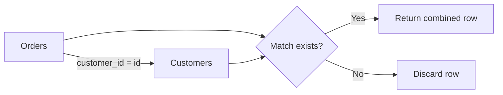
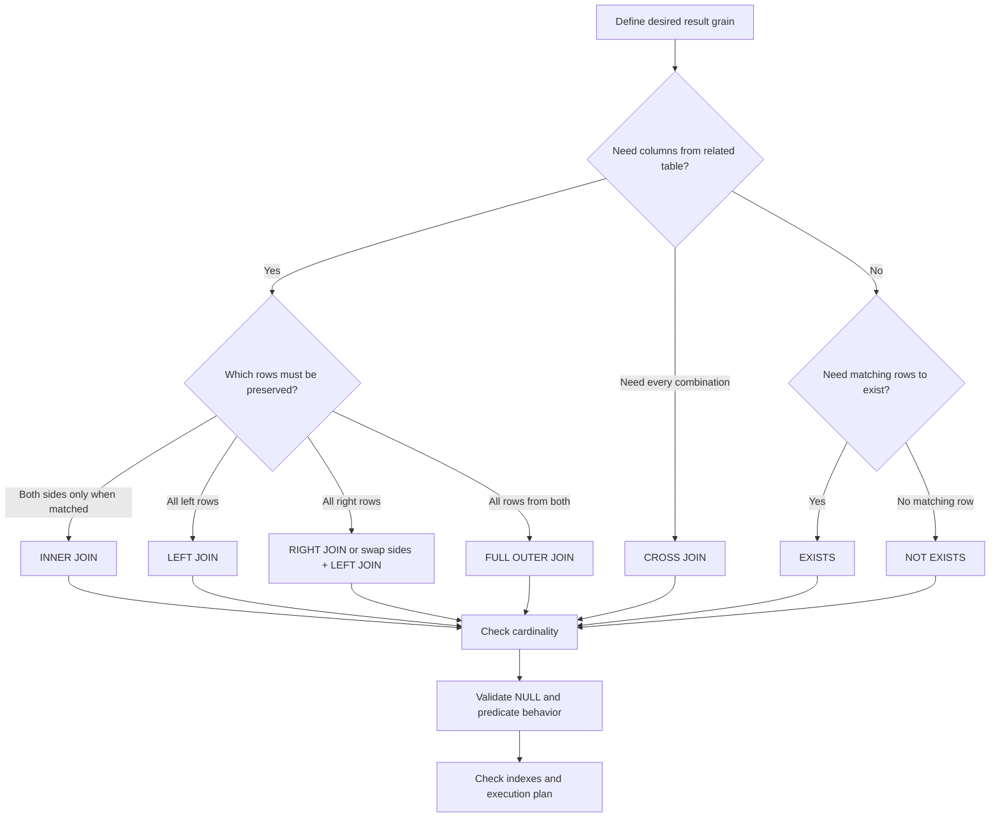

# 22- JOIN Selection Rules

## Overview

Choosing the correct JOIN is primarily a **query-semantics and cardinality decision**, not a syntax preference.

A production SQL query should start with the question:

> What rows must the query return, and at what grain?

From there, choose the relational operation that preserves that intent:

| Requirement | Preferred operation |
|---|---|
| Return only rows with a matching relation | `INNER JOIN` |
| Keep every row from the left relation | `LEFT JOIN` |
| Keep every row from the right relation | `RIGHT JOIN` |
| Keep unmatched rows from both relations | `FULL OUTER JOIN` |
| Generate every possible pair | `CROSS JOIN` |
| Match rows within the same table | `SELF JOIN` |
| Test whether at least one related row exists | `EXISTS` |
| Test whether no related row exists | `NOT EXISTS` |

The most important engineering principle is:

> **Choose the JOIN based on the required result set and business semantics first; optimize the physical execution second.**

A syntactically valid JOIN can still be logically wrong, produce duplicate rows, eliminate required records, or create an unexpectedly large intermediate result.

## Start With Result Grain

Before writing a JOIN, explicitly define the grain of the result.

Examples:

```text
One row per customer
One row per order
One row per customer-order pair
One row per employee-manager pair
One row per product-region combination
```

Suppose:

```text
customers
---------
id
email

orders
------
id
customer_id
amount
```

If the requirement is:

```text
One row per order with customer information
```

use:

```sql
SELECT
    o.id,
    o.amount,
    c.email
FROM orders AS o
JOIN customers AS c
    ON c.id = o.customer_id;
```

If the requirement is:

```text
One row per customer who has at least one order
```

a JOIN may multiply customers:

```sql
SELECT
    c.id,
    c.email
FROM customers AS c
JOIN orders AS o
    ON o.customer_id = c.id;
```

If a customer has five orders, that customer can appear five times.

For an existence requirement, prefer:

```sql
SELECT
    c.id,
    c.email
FROM customers AS c
WHERE EXISTS (
    SELECT 1
    FROM orders AS o
    WHERE o.customer_id = c.id
);
```

Result grain should therefore be established before selecting the JOIN type.

## INNER JOIN

### What It Is

An `INNER JOIN` returns rows where the JOIN condition matches on both sides.

```sql
SELECT
    o.id,
    c.email
FROM orders AS o
INNER JOIN customers AS c
    ON c.id = o.customer_id;
```

Only orders with a matching customer are returned.

### When to Use It

Use `INNER JOIN` when the relationship is required for the result.

Typical examples:

- Orders that belong to an existing customer.
- Payments associated with an order.
- Employees belonging to an existing department.
- API records that require related configuration data.

### Data Flow



### Production Consideration

An `INNER JOIN` can hide data-quality problems.

For example:

```sql
SELECT
    o.id,
    c.email
FROM orders AS o
INNER JOIN customers AS c
    ON c.id = o.customer_id;
```

If an order references a missing customer, that order silently disappears from the result.

That may be correct if the relationship is mandatory. It may be a bug if the query is being used for reconciliation, auditing, or data-quality analysis.

## LEFT JOIN

### What It Is

A `LEFT JOIN` returns every row from the left table and matching rows from the right table. If there is no match, right-side columns are `NULL`.

```sql
SELECT
    c.id,
    c.email,
    o.id AS order_id
FROM customers AS c
LEFT JOIN orders AS o
    ON o.customer_id = c.id;
```

Customers without orders are preserved.

### When to Use It

Use `LEFT JOIN` when the left-side entity is mandatory in the result but the relationship is optional.

Typical requirements:

- All customers, including customers without orders.
- All products, including products without inventory records.
- All accounts, including accounts without recent transactions.
- All employees, including employees without assigned projects.

### Example

```sql
SELECT
    p.id,
    p.name,
    i.quantity
FROM products AS p
LEFT JOIN inventory AS i
    ON i.product_id = p.id;
```

A product without an inventory row still appears:

```text
product_id | name       | quantity
-----------+------------+---------
1          | Keyboard   | 50
2          | Monitor    | 20
3          | Webcam     | NULL
```

`NULL` here means there was no matching inventory row; it does not necessarily mean the inventory quantity itself is unknown.

## RIGHT JOIN

### What It Is

A `RIGHT JOIN` is the mirror image of a `LEFT JOIN`.

```sql
SELECT
    o.id,
    c.email
FROM orders AS o
RIGHT JOIN customers AS c
    ON c.id = o.customer_id;
```

Every customer is preserved.

### Practical Recommendation

Although valid SQL, `RIGHT JOIN` is often avoided in production code because the same query can usually be expressed more naturally as a `LEFT JOIN` by swapping table order:

```sql
SELECT
    o.id,
    c.email
FROM customers AS c
LEFT JOIN orders AS o
    ON o.customer_id = c.id;
```

The second form generally makes the preserved side visually obvious.

| Situation | Recommendation |
|---|---|
| Need all left-side rows | `LEFT JOIN` |
| Need all right-side rows | Prefer swapping tables and using `LEFT JOIN` |
| Existing query naturally reads right-to-left | `RIGHT JOIN` can be valid |
| Team consistency matters | Standardize on `LEFT JOIN` where practical |

The key semantic property is not the keyword but **which side is preserved**.

## FULL OUTER JOIN

### What It Is

A `FULL OUTER JOIN` preserves rows from both sides, matching them where possible.

```sql
SELECT
    c.id AS customer_id,
    o.id AS order_id
FROM customers AS c
FULL OUTER JOIN orders AS o
    ON o.customer_id = c.id;
```

The result can contain:

```text
customer only
order only
customer + order
```

### When to Use It

It is particularly useful for:

- Data reconciliation.
- Comparing datasets.
- Detecting missing records.
- Migration validation.
- Synchronizing systems.
- Auditing relationships.

For example:

```sql
SELECT
    c.id AS customer_id,
    o.id AS order_id
FROM customers AS c
FULL OUTER JOIN external_customer_orders AS o
    ON o.customer_id = c.id
WHERE c.id IS NULL
   OR o.customer_id IS NULL;
```

This can identify records existing on only one side.

### Production Consideration

`FULL OUTER JOIN` can generate substantial intermediate results. It should be used deliberately, especially on large datasets.

For reconciliation jobs, ensure:

- Join keys are indexed where appropriate.
- Filters are applied as early as semantics allow.
- The query is tested against production-scale data.
- Execution plans are reviewed.
- Long-running reconciliation workloads are isolated from latency-sensitive application traffic when necessary.

## CROSS JOIN

### What It Is

A `CROSS JOIN` creates the Cartesian product of two relations.

If:

```text
A = 100 rows
B = 50 rows
```

then:

```text
A CROSS JOIN B
```

can produce:

```text
100 × 50 = 5,000 rows
```

Example:

```sql
SELECT
    r.id AS region_id,
    p.id AS product_id
FROM regions AS r
CROSS JOIN products AS p;
```

### When to Use It

Use it intentionally for combinations such as:

- Product × region planning.
- Calendar × time-slot generation.
- Feature × environment matrices.
- Test-data generation.
- Pricing or availability matrices.

### Production Warning

A CROSS JOIN can cause explosive result growth.

```text
10,000 users
×
1,000 products
=
10,000,000 candidate rows
```

Always estimate cardinality before running a Cartesian product against large relations.

## SELF JOIN

### What It Is

A self join joins a table to itself using aliases.

A classic example is an employee hierarchy:

```sql
SELECT
    e.id,
    e.name,
    m.name AS manager_name
FROM employees AS e
LEFT JOIN employees AS m
    ON m.id = e.manager_id;
```

The same table is represented twice:

```text
employees AS e
employees AS m
```

The aliases are essential because SQL must distinguish the two logical roles.

### When to Use It

Common cases include:

- Employee-manager relationships.
- Organizational hierarchies.
- Parent-child records.
- Comparing rows within one table.
- Detecting related records.

For deeply nested hierarchies, a recursive CTE may be more appropriate than repeatedly chaining self joins.

## One-to-One Relationships

A one-to-one relationship generally produces at most one related row on each side.

Example:

```text
users
-----
id
email

user_profiles
-------------
user_id
timezone
locale
```

Query:

```sql
SELECT
    u.id,
    u.email,
    p.timezone,
    p.locale
FROM users AS u
LEFT JOIN user_profiles AS p
    ON p.user_id = u.id;
```

Use `LEFT JOIN` when the profile is optional.

Use `INNER JOIN` when the profile is guaranteed to exist and users without profiles should not appear.

The database should enforce the one-to-one relationship where appropriate:

```sql
CREATE UNIQUE INDEX ux_user_profiles_user_id
    ON user_profiles(user_id);
```

Without uniqueness enforcement, the data may no longer have one-to-one cardinality, and a JOIN can unexpectedly duplicate users.

## One-to-Many Relationships

One-to-many JOINs naturally multiply rows.

Example:

```text
Customer 42
    ├── Order 101
    ├── Order 102
    └── Order 103
```

Query:

```sql
SELECT
    c.id AS customer_id,
    o.id AS order_id
FROM customers AS c
JOIN orders AS o
    ON o.customer_id = c.id;
```

Result:

```text
customer_id | order_id
------------+---------
42          | 101
42          | 102
42          | 103
```

If the desired result is one row per customer, a JOIN may be the wrong operation.

Use:

```sql
WHERE EXISTS (...)
```

for existence, or aggregate intentionally:

```sql
SELECT
    c.id,
    COUNT(o.id) AS order_count
FROM customers AS c
LEFT JOIN orders AS o
    ON o.customer_id = c.id
GROUP BY c.id;
```

## Many-to-Many Relationships

Many-to-many relationships normally use a junction table.

```text
users
  │
  │ 1:N
  ▼
user_roles
  │
  │ N:1
  ▼
roles
```

Query:

```sql
SELECT
    u.id,
    u.email,
    r.name AS role_name
FROM users AS u
JOIN user_roles AS ur
    ON ur.user_id = u.id
JOIN roles AS r
    ON r.id = ur.role_id;
```

The result grain is now:

```text
One row per user-role relationship
```

If a user has five roles, that user appears five times.

If the application needs only:

```text
Users who have the "admin" role
```

use an existence predicate:

```sql
SELECT
    u.id,
    u.email
FROM users AS u
WHERE EXISTS (
    SELECT 1
    FROM user_roles AS ur
    JOIN roles AS r
        ON r.id = ur.role_id
    WHERE ur.user_id = u.id
      AND r.name = 'admin'
);
```

## JOIN vs EXISTS

The distinction is fundamental.

### Use JOIN

When you need data from the related relation:

```sql
SELECT
    o.id,
    c.email
FROM orders AS o
JOIN customers AS c
    ON c.id = o.customer_id;
```

### Use EXISTS

When you only need to know whether a related record exists:

```sql
SELECT
    c.id,
    c.email
FROM customers AS c
WHERE EXISTS (
    SELECT 1
    FROM orders AS o
    WHERE o.customer_id = c.id
);
```

### Use NOT EXISTS

When you need records without a matching relation:

```sql
SELECT
    c.id,
    c.email
FROM customers AS c
WHERE NOT EXISTS (
    SELECT 1
    FROM orders AS o
    WHERE o.customer_id = c.id
);
```

Avoid choosing JOIN simply because the tables are related. Relationship existence and relationship data retrieval are different requirements.

## ON vs WHERE With Outer JOINs

One of the most important JOIN-selection rules is understanding where filters are applied.

Consider:

```sql
SELECT
    c.id,
    o.id AS order_id
FROM customers AS c
LEFT JOIN orders AS o
    ON o.customer_id = c.id
   AND o.status = 'completed';
```

This preserves all customers while matching only completed orders.

Compare:

```sql
SELECT
    c.id,
    o.id AS order_id
FROM customers AS c
LEFT JOIN orders AS o
    ON o.customer_id = c.id
WHERE o.status = 'completed';
```

The second query removes rows where `o.status` is `NULL`, effectively eliminating customers without matching completed orders.

It therefore behaves much more like an INNER JOIN for this condition.

The practical rule is:

> **For an outer JOIN, predicates that determine which right-side rows qualify for the relationship often belong in `ON`; predicates that determine which final result rows survive belong in `WHERE`.**

## Multiple JOINs

Multiple JOINs should be evaluated as a chain of cardinality transformations.

Example:

```sql
SELECT
    o.id AS order_id,
    c.email,
    p.name AS product_name
FROM orders AS o
JOIN customers AS c
    ON c.id = o.customer_id
JOIN order_items AS oi
    ON oi.order_id = o.id
JOIN products AS p
    ON p.id = oi.product_id;
```

The result grain is:

```text
One row per order item
```

because an order can have multiple items.

Adding another one-to-many relationship can multiply rows again:

```text
orders
  ↓
order_items
  ↓
item_discounts
```

If each item has three discounts, one order item can become three rows.

Do not assume:

```text
More JOINs = more information
```

Instead ask:

```text
What is the grain after every JOIN?
```

## JOIN Ordering and Query Logic

SQL describes logical relationships, while the optimizer determines the physical execution strategy.

For example:

```sql
SELECT
    o.id,
    c.email
FROM orders AS o
JOIN customers AS c
    ON c.id = o.customer_id
WHERE o.status = 'completed';
```

The optimizer may choose to:

- Scan or seek orders.
- Filter completed orders.
- Access customers through an index.
- Build a hash table.
- Change physical join order.
- Use nested-loop, hash-join, or merge-join strategies.

Therefore, changing the textual order of logically equivalent INNER JOINs does not necessarily force execution order.

However, outer JOIN semantics impose constraints because changing which relation is preserved can change the result.

## Cardinality Estimation

JOIN selection becomes a senior-level concern when datasets are large.

Suppose:

```text
customers = 10 million rows
orders    = 500 million rows
```

and the query joins them.

A poor plan may process a very large intermediate relation before applying selective predicates.

A well-indexed and well-filtered query can reduce work substantially.

Useful indexes often include foreign-key and filtering columns:

```sql
CREATE INDEX idx_orders_customer_id
    ON orders(customer_id);
```

If a common query is:

```sql
WHERE customer_id = ?
  AND status = 'completed'
```

a composite index may be more useful:

```sql
CREATE INDEX idx_orders_customer_status
    ON orders(customer_id, status);
```

The correct index depends on the workload, selectivity, column order, and database optimizer.

## JOIN Selection and Aggregation

Sometimes the correct solution is not another JOIN but pre-aggregation.

Suppose the requirement is:

> Return each customer and their total completed-order value.

A direct JOIN works:

```sql
SELECT
    c.id,
    c.email,
    COALESCE(SUM(o.amount), 0) AS total_amount
FROM customers AS c
LEFT JOIN orders AS o
    ON o.customer_id = c.id
   AND o.status = 'completed'
GROUP BY
    c.id,
    c.email;
```

The filter belongs in the `ON` clause because customers without completed orders must remain in the result.

For more complex queries, aggregate first and then JOIN:

```sql
WITH customer_totals AS (
    SELECT
        customer_id,
        SUM(amount) AS total_amount
    FROM orders
    WHERE status = 'completed'
    GROUP BY customer_id
)
SELECT
    c.id,
    c.email,
    COALESCE(ct.total_amount, 0) AS total_amount
FROM customers AS c
LEFT JOIN customer_totals AS ct
    ON ct.customer_id = c.id;
```

This can make the intended grain explicit:

```text
orders
    ↓
one row per customer
    ↓
LEFT JOIN
    ↓
one row per customer
```

## Decision Matrix

| Requirement | Operation | Primary reason |
|---|---|---|
| Both sides must match | `INNER JOIN` | Return matching combinations |
| Preserve left table | `LEFT JOIN` | Keep unmatched left rows |
| Preserve right table | `RIGHT JOIN` | Keep unmatched right rows |
| Preserve both sides | `FULL OUTER JOIN` | Reconciliation/comparison |
| Every combination | `CROSS JOIN` | Cartesian product |
| Same table, different roles | `SELF JOIN` | Hierarchical/row comparison |
| At least one match | `EXISTS` | Existence test |
| No matching row | `NOT EXISTS` | Anti-existence test |
| Need one-to-many aggregate | JOIN + `GROUP BY` | Controlled aggregation |
| Need to prevent row multiplication | `EXISTS` / pre-aggregation | Preserve intended grain |

## Production Decision Process

Use this sequence when designing a JOIN-heavy query:

1. **Define the result grain.**
   - One row per customer?
   - One row per order?
   - One row per relationship?

2. **Identify the preserved entities.**
   - Must unmatched rows remain?
   - Which side is optional?

3. **Determine whether related columns are required.**
   - If yes, consider a JOIN.
   - If no and the requirement is existence, consider `EXISTS`.

4. **Estimate cardinality.**
   - One-to-one?
   - One-to-many?
   - Many-to-many?
   - Cartesian?

5. **Place predicates correctly.**
   - Pay special attention to `ON` versus `WHERE` for outer JOINs.

6. **Check for NULL semantics.**
   - Especially with outer JOINs, `NOT IN`, and nullable foreign keys.

7. **Check indexing.**
   - JOIN keys.
   - Selective filtering columns.
   - Composite indexes where justified.

8. **Inspect the execution plan.**

For PostgreSQL:

```sql
EXPLAIN (ANALYZE, BUFFERS)
SELECT
    c.id,
    c.email
FROM customers AS c
WHERE EXISTS (
    SELECT 1
    FROM orders AS o
    WHERE o.customer_id = c.id
      AND o.status = 'completed'
);
```

Validate using realistic data volume rather than a small local dataset.

## Backend ORM Considerations

The same decisions appear in Django.

If the application needs related objects:

```python
orders = (
    Order.objects
    .select_related("customer")
    .filter(status="completed")
)
```

For existence:

```python
from django.db.models import Exists, OuterRef

completed_orders = Order.objects.filter(
    customer_id=OuterRef("pk"),
    status="completed",
)

customers = Customer.objects.annotate(
    has_completed_order=Exists(completed_orders),
)
```

For collection relationships, `prefetch_related()` may be appropriate when the application needs multiple related rows rather than a SQL JOIN-shaped result.

The ORM does not remove the need to understand SQL cardinality. It only generates the SQL.

## Common Mistakes

| Mistake | Result | Better approach |
|---|---|---|
| Using INNER JOIN when unmatched rows are required | Required rows disappear | Use `LEFT JOIN` |
| Using LEFT JOIN and filtering right columns in WHERE | Outer rows disappear | Move relationship filter into `ON` when appropriate |
| Using JOIN for existence | Duplicate outer rows | Use `EXISTS` |
| Adding DISTINCT to hide duplicates | Extra sort/hash work and hidden logic problem | Fix the result grain |
| Using RIGHT JOIN unnecessarily | Harder query reading | Prefer LEFT JOIN by swapping table order |
| Using CROSS JOIN accidentally | Potentially huge result set | Add explicit relationship predicates or use another JOIN |
| Joining two one-to-many relations directly | Multiplicative row explosion | Aggregate or use separate existence/data paths |
| Assuming foreign keys prevent duplicates | One-to-many relationships still multiply rows | Understand relationship cardinality |
| Ignoring NULL behavior | Unexpected outer-join results | Explicitly reason about NULL |
| Assuming textual JOIN order controls execution | Incorrect performance assumptions | Inspect the execution plan |
| Adding indexes blindly | Increased write/storage overhead | Index based on actual workload |
| Assuming ORM abstractions solve query complexity | N+1 queries or inefficient SQL | Inspect generated SQL and query plans |

## Performance and Reliability

JOIN performance depends on more than the JOIN keyword.

Important factors include:

- Table cardinality.
- Join-key selectivity.
- Index availability.
- Data distribution.
- Statistics freshness.
- Predicate selectivity.
- Join algorithm.
- Memory available for hash/sort operations.
- Intermediate result size.
- Concurrent workload.

For production systems, monitor query behavior through:

- PostgreSQL `pg_stat_statements`.
- Application query metrics.
- Slow-query logs.
- Database CPU and memory metrics.
- Lock and wait metrics.
- Query execution plans.

For latency-sensitive APIs, avoid introducing a large JOIN graph merely to construct one response if the required data can be obtained more efficiently through a deliberate query or pre-aggregated representation.

## Security Considerations

JOIN selection does not replace authorization.

In a multi-tenant system, relationship queries must preserve tenant boundaries:

```sql
SELECT
    o.id,
    o.amount
FROM orders AS o
JOIN customers AS c
    ON c.id = o.customer_id
   AND c.tenant_id = :tenant_id
WHERE o.tenant_id = :tenant_id;
```

The exact predicate depends on the schema and trust model, but authorization boundaries should be explicit.

Always parameterize request-derived values:

```sql
WHERE o.tenant_id = :tenant_id
```

Do not construct SQL using string concatenation.

## Interview Rules of Thumb

### Which JOIN should I use by default?

For an optional relationship where all primary entities must remain visible, start with `LEFT JOIN`.

For a mandatory relationship where unmatched records should be excluded, use `INNER JOIN`.

### Is RIGHT JOIN wrong?

No. It is valid SQL. It is simply often less readable than expressing the same relationship with a `LEFT JOIN` after swapping table order.

### Is FULL OUTER JOIN common in application APIs?

Less common than INNER or LEFT JOIN. It is particularly useful for reconciliation, comparison, and data-quality workflows.

### When should I use EXISTS instead of JOIN?

When the requirement is an existence test rather than retrieval of related rows.

### Why does a JOIN create duplicates?

Because JOINs operate on matching row combinations. If one left row matches multiple right rows, multiple output rows are produced.

### Is DISTINCT the correct solution for duplicate JOIN results?

Not automatically. `DISTINCT` may hide an incorrect result grain and introduce additional sort or hashing work. First determine why duplicates are being produced.

### Does the order of INNER JOINs determine database execution order?

Not necessarily. The optimizer can reorder operations and select a different physical execution strategy.

### What is the most important JOIN question in an interview?

Ask:

> **What should one output row represent?**

That immediately exposes whether the query should use a JOIN, EXISTS, aggregation, or another relational operation.

## JOIN Selection Flow



## Key Takeaways

- **Choose JOINs from result semantics and output grain first; do not choose them merely because tables are related.**
- **Use `INNER JOIN` for required matches, `LEFT JOIN` when the left side must be preserved, and `FULL OUTER JOIN` primarily for reconciliation-style workloads.**
- **Use `EXISTS` and `NOT EXISTS` when the requirement is relationship existence rather than retrieving related rows.**
- **Always reason about cardinality: one-to-many and many-to-many JOINs can multiply rows and may require aggregation, pre-aggregation, or an existence predicate.**
- **Treat `ON` versus `WHERE`, NULL behavior, indexing, and execution plans as production-level JOIN concerns rather than syntax details.**