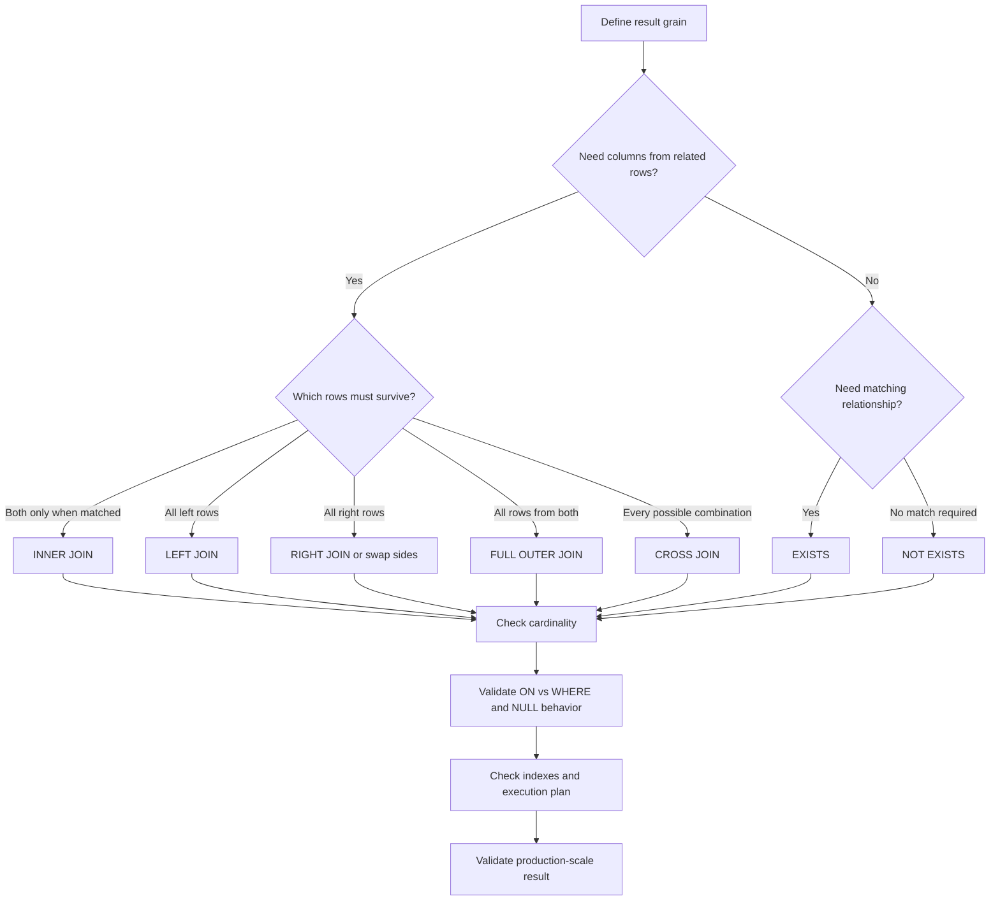

# 23- When to Use Each JOIN Type

## Overview

JOIN selection should be driven by **result-set semantics, required row preservation, and relationship cardinality**.

The practical question is not:

> "Which JOIN is fastest?"

It is:

> "Which rows must survive, which relationships must match, and what should one output row represent?"

Once the semantics are correct, the database optimizer can choose an appropriate physical execution strategy. Performance then depends on indexes, statistics, cardinality estimates, data distribution, available memory, and the chosen join algorithm.

A useful decision model is:

| Requirement | Preferred operation |
|---|---|
| Only matching rows are required | `INNER JOIN` |
| Every row from the left relation must remain | `LEFT JOIN` |
| Every row from the right relation must remain | `RIGHT JOIN` or swap sides and use `LEFT JOIN` |
| Rows from both sides must remain | `FULL OUTER JOIN` |
| Every possible combination is required | `CROSS JOIN` |
| A table must be related to itself | `SELF JOIN` |
| Only relationship existence matters | `EXISTS` |
| Absence of a related row matters | `NOT EXISTS` |

## Define the Result Grain First

Before selecting a JOIN, define what one result row represents.

Examples:

```text
One row per customer
One row per order
One row per order item
One row per customer-role relationship
One row per product-region combination
```

Consider:

```text
customers
---------
id
email

orders
------
id
customer_id
amount
```

If the requirement is:

```text
One row per order
```

then this is appropriate:

```sql
SELECT
    o.id,
    o.amount,
    c.email
FROM orders AS o
INNER JOIN customers AS c
    ON c.id = o.customer_id;
```

But if the requirement is:

```text
One row per customer who has at least one order
```

a JOIN can create duplicate customers:

```sql
SELECT
    c.id,
    c.email
FROM customers AS c
INNER JOIN orders AS o
    ON o.customer_id = c.id;
```

A customer with ten orders can produce ten result rows.

If the requirement is only existence, prefer:

```sql
SELECT
    c.id,
    c.email
FROM customers AS c
WHERE EXISTS (
    SELECT 1
    FROM orders AS o
    WHERE o.customer_id = c.id
);
```

This distinction is one of the most important JOIN-selection rules in production SQL.

## INNER JOIN

### When to Use It

Use `INNER JOIN` when:

- A matching row is required.
- Unmatched rows should be excluded.
- The relationship is mandatory for the query's business meaning.

Example:

```sql
SELECT
    o.id,
    o.amount,
    c.email
FROM orders AS o
INNER JOIN customers AS c
    ON c.id = o.customer_id;
```

This expresses:

> Return orders for which a matching customer exists.

### Typical Production Cases

| Use case | Why `INNER JOIN` fits |
|---|---|
| Order → customer | Customer information is required |
| Payment → order | Payment must belong to an order |
| Employee → department | Department is required |
| Invoice → account | Account must exist |
| API resource → required configuration | Missing configuration makes the result invalid |

### Important Caveat

An `INNER JOIN` can hide data-quality problems.

If an order references a missing customer, the order simply disappears:

```sql
SELECT
    o.id
FROM orders AS o
INNER JOIN customers AS c
    ON c.id = o.customer_id;
```

For reconciliation or data-quality analysis, this may be undesirable. A `LEFT JOIN` can expose such inconsistencies instead.

## LEFT JOIN

### When to Use It

Use `LEFT JOIN` when:

> Every row from the left relation must remain, regardless of whether a matching right-side row exists.

Example:

```sql
SELECT
    c.id,
    c.email,
    o.id AS order_id
FROM customers AS c
LEFT JOIN orders AS o
    ON o.customer_id = c.id;
```

Customers without orders are preserved.

### Typical Production Cases

- All customers, including customers without orders.
- All products, including products without inventory.
- All accounts, including accounts without transactions.
- All users, including users without profiles.
- All employees, including employees without projects.

### Optional Relationships

Consider:

```text
users
-----
id
email

user_profiles
-------------
user_id
timezone
locale
```

If profiles are optional:

```sql
SELECT
    u.id,
    u.email,
    p.timezone,
    p.locale
FROM users AS u
LEFT JOIN user_profiles AS p
    ON p.user_id = u.id;
```

The absence of a profile does not remove the user.

### LEFT JOIN With Filtering

This is a common production trap.

To return all customers while matching only completed orders:

```sql
SELECT
    c.id,
    o.id AS order_id
FROM customers AS c
LEFT JOIN orders AS o
    ON o.customer_id = c.id
   AND o.status = 'completed';
```

Do not casually rewrite it as:

```sql
SELECT
    c.id,
    o.id AS order_id
FROM customers AS c
LEFT JOIN orders AS o
    ON o.customer_id = c.id
WHERE o.status = 'completed';
```

The second query eliminates customers for which `o.status` is `NULL`, changing the effective semantics of the outer JOIN.

The practical rule is:

> Predicates in `ON` can control which related rows participate in the outer relationship; predicates in `WHERE` filter the final result.

## RIGHT JOIN

### When to Use It

`RIGHT JOIN` preserves every row from the right relation.

```sql
SELECT
    o.id,
    c.email
FROM orders AS o
RIGHT JOIN customers AS c
    ON c.id = o.customer_id;
```

Every customer remains in the result.

### Production Recommendation

Prefer `LEFT JOIN` when practical by changing table order:

```sql
SELECT
    o.id,
    c.email
FROM customers AS c
LEFT JOIN orders AS o
    ON o.customer_id = c.id;
```

The semantics are easier to read because the preserved relation appears on the left.

`RIGHT JOIN` is not inherently incorrect or slower. The preference is primarily about consistency and readability.

## FULL OUTER JOIN

### When to Use It

Use `FULL OUTER JOIN` when rows from **both sides must be preserved**, including unmatched rows.

```sql
SELECT
    c.id AS customer_id,
    e.customer_id AS external_customer_id
FROM customers AS c
FULL OUTER JOIN external_customers AS e
    ON e.customer_id = c.id;
```

The result can contain:

```text
matched on both sides
only in customers
only in external_customers
```

### Best Production Use Cases

`FULL OUTER JOIN` is particularly useful for:

- Data reconciliation.
- Migration validation.
- Synchronization checks.
- Comparing internal and external datasets.
- Detecting missing records.
- Audit and data-quality workflows.

For example:

```sql
SELECT
    c.id AS customer_id,
    e.customer_id AS external_customer_id
FROM customers AS c
FULL OUTER JOIN external_customers AS e
    ON e.customer_id = c.id
WHERE c.id IS NULL
   OR e.customer_id IS NULL;
```

This isolates records present on only one side.

### Production Consideration

`FULL OUTER JOIN` is less common in latency-sensitive CRUD queries and can be expensive on large relations.

For large reconciliation workloads:

- Estimate input and output cardinality.
- Ensure join keys are appropriate.
- Review the execution plan.
- Run the workload outside peak traffic when possible.
- Consider incremental reconciliation for very large datasets.

## CROSS JOIN

### When to Use It

Use `CROSS JOIN` only when every combination is intentionally required.

```sql
SELECT
    r.id AS region_id,
    p.id AS product_id
FROM regions AS r
CROSS JOIN products AS p;
```

If there are:

```text
100 regions
×
10,000 products
```

the result can contain:

```text
1,000,000 rows
```

### Legitimate Use Cases

- Product × region planning.
- Product × pricing-tier matrices.
- Calendar × time-slot generation.
- Environment × feature matrices.
- Controlled test-data generation.

### Production Warning

A missing JOIN predicate can accidentally turn an intended relationship into a Cartesian product.

This is especially dangerous in reporting queries because the query may appear correct while silently producing massive intermediate results.

Always estimate:

```text
left cardinality × right cardinality
```

before using a Cartesian product.

## SELF JOIN

### When to Use It

Use a self join when one table contains multiple logical roles that need to be related.

Example:

```text
employees
---------
id
name
manager_id
```

Query:

```sql
SELECT
    e.id,
    e.name,
    m.name AS manager_name
FROM employees AS e
LEFT JOIN employees AS m
    ON m.id = e.manager_id;
```

The same physical table is represented as two logical relations:

```text
employees AS e → employee
employees AS m → manager
```

### Typical Use Cases

- Employee-manager relationships.
- Parent-child records.
- Organizational hierarchies.
- Comparing rows within the same table.
- Finding related records.

For deeply nested hierarchies, consider a recursive CTE rather than manually chaining many self joins.

## JOIN vs EXISTS

Use a JOIN when related columns are needed:

```sql
SELECT
    o.id,
    c.email
FROM orders AS o
JOIN customers AS c
    ON c.id = o.customer_id;
```

Use `EXISTS` when the requirement is simply:

> Does a related row exist?

```sql
SELECT
    c.id,
    c.email
FROM customers AS c
WHERE EXISTS (
    SELECT 1
    FROM orders AS o
    WHERE o.customer_id = c.id
);
```

Use `NOT EXISTS` when the requirement is:

> Does no related row exist?

```sql
SELECT
    c.id,
    c.email
FROM customers AS c
WHERE NOT EXISTS (
    SELECT 1
    FROM orders AS o
    WHERE o.customer_id = c.id
);
```

### Why EXISTS Can Be Safer

Suppose a customer has 500 orders.

A JOIN can produce 500 intermediate matching rows for that customer before later operations such as `DISTINCT` or aggregation.

An existence predicate expresses the actual requirement directly:

```sql
WHERE EXISTS (...)
```

The optimizer can often implement this as a semi-join and stop looking for additional matches once existence has been established.

The exact physical strategy is database-dependent, so performance should still be validated with an execution plan.

## JOIN Selection by Relationship Cardinality

Relationship cardinality should influence the operation.

| Relationship | Potential output behavior | Primary concern |
|---|---|---|
| One-to-one | Usually one output row per left row | Missing/duplicate relationship data |
| One-to-many | One left row can produce many rows | Row multiplication |
| Many-to-many | Both sides can multiply | Potentially large result growth |
| No relationship | Cartesian product | Explosive cardinality |

### One-to-One

```sql
SELECT
    u.id,
    p.timezone
FROM users AS u
LEFT JOIN user_profiles AS p
    ON p.user_id = u.id;
```

If `user_profiles.user_id` is supposed to be unique, enforce it:

```sql
CREATE UNIQUE INDEX ux_user_profiles_user_id
    ON user_profiles(user_id);
```

A database constraint is more reliable than assuming application code will maintain one-to-one semantics.

### One-to-Many

```sql
SELECT
    c.id AS customer_id,
    o.id AS order_id
FROM customers AS c
JOIN orders AS o
    ON o.customer_id = c.id;
```

One customer can produce many rows.

If the result must remain one row per customer, consider:

```sql
SELECT
    c.id,
    COUNT(o.id) AS order_count
FROM customers AS c
LEFT JOIN orders AS o
    ON o.customer_id = c.id
GROUP BY c.id;
```

### Many-to-Many

Many-to-many relationships normally use a junction table:

```sql
SELECT
    u.id,
    r.name
FROM users AS u
JOIN user_roles AS ur
    ON ur.user_id = u.id
JOIN roles AS r
    ON r.id = ur.role_id;
```

The result grain is:

```text
One row per user-role relationship
```

If only users having a particular role are required, an existence predicate may be more appropriate:

```sql
SELECT
    u.id,
    u.email
FROM users AS u
WHERE EXISTS (
    SELECT 1
    FROM user_roles AS ur
    JOIN roles AS r
        ON r.id = ur.role_id
    WHERE ur.user_id = u.id
      AND r.name = 'admin'
);
```

## Aggregation Changes the JOIN Decision

Sometimes the requirement is not to retrieve individual related rows but to calculate a value from them.

For example:

> Return every customer and their completed-order total.

```sql
SELECT
    c.id,
    c.email,
    COALESCE(SUM(o.amount), 0) AS completed_order_total
FROM customers AS c
LEFT JOIN orders AS o
    ON o.customer_id = c.id
   AND o.status = 'completed'
GROUP BY
    c.id,
    c.email;
```

The `LEFT JOIN` is important because customers without completed orders must remain.

For larger or more complex queries, pre-aggregate the many-side first:

```sql
WITH customer_totals AS (
    SELECT
        customer_id,
        SUM(amount) AS completed_order_total
    FROM orders
    WHERE status = 'completed'
    GROUP BY customer_id
)
SELECT
    c.id,
    c.email,
    COALESCE(ct.completed_order_total, 0) AS completed_order_total
FROM customers AS c
LEFT JOIN customer_totals AS ct
    ON ct.customer_id = c.id;
```

The CTE produces:

```text
One row per customer
```

before the final JOIN, making the intended cardinality explicit.

## Avoid DISTINCT as a JOIN Strategy

A common pattern is:

```sql
SELECT DISTINCT
    c.id,
    c.email
FROM customers AS c
JOIN orders AS o
    ON o.customer_id = c.id;
```

This may return the desired result, but it can hide the fact that the query generated multiple rows per customer.

If the requirement is only:

```text
Customers having at least one order
```

prefer:

```sql
SELECT
    c.id,
    c.email
FROM customers AS c
WHERE EXISTS (
    SELECT 1
    FROM orders AS o
    WHERE o.customer_id = c.id
);
```

Use `DISTINCT` when deduplication is genuinely part of the result semantics, not as a default repair mechanism for an incorrectly chosen JOIN.

## ON vs WHERE

For INNER JOINs, many predicates can be moved between `ON` and `WHERE` without changing the logical result, although readability and optimizer behavior can still matter.

For OUTER JOINs, placement can change semantics.

Compare:

```sql
SELECT
    c.id,
    o.id
FROM customers AS c
LEFT JOIN orders AS o
    ON o.customer_id = c.id
   AND o.status = 'completed';
```

with:

```sql
SELECT
    c.id,
    o.id
FROM customers AS c
LEFT JOIN orders AS o
    ON o.customer_id = c.id
WHERE o.status = 'completed';
```

The first means:

```text
Keep all customers.
Only attach completed orders.
```

The second means:

```text
Keep customers only when the joined row has status = completed.
```

This distinction is critical for reporting APIs and dashboards where zero-activity entities must remain visible.

## NULL and Anti-JOIN Decisions

When looking for records without relationships, `NOT EXISTS` is generally a strong default:

```sql
SELECT
    c.id
FROM customers AS c
WHERE NOT EXISTS (
    SELECT 1
    FROM orders AS o
    WHERE o.customer_id = c.id
);
```

A `LEFT JOIN` anti-join is also valid:

```sql
SELECT
    c.id
FROM customers AS c
LEFT JOIN orders AS o
    ON o.customer_id = c.id
WHERE o.id IS NULL;
```

Be careful when choosing `NOT IN`, particularly when the subquery can return `NULL`:

```sql
WHERE c.id NOT IN (
    SELECT o.customer_id
    FROM orders AS o
);
```

SQL's three-valued logic means NULL can make `NOT IN` behave unexpectedly.

For existence semantics, `NOT EXISTS` avoids this particular NULL trap and communicates intent clearly.

## JOIN Selection in Backend APIs

Suppose a REST endpoint returns:

```text
GET /customers
```

and requires:

```text
All active customers
+
number of completed orders
```

A direct query might be:

```sql
SELECT
    c.id,
    c.email,
    COUNT(o.id) AS completed_order_count
FROM customers AS c
LEFT JOIN orders AS o
    ON o.customer_id = c.id
   AND o.status = 'completed'
WHERE c.status = 'active'
GROUP BY
    c.id,
    c.email;
```

The important decisions are:

- `LEFT JOIN` because customers with zero orders must remain.
- Filter order status in `ON` because it defines which related orders participate.
- `WHERE` filters the primary customer population.
- `COUNT(o.id)` produces zero for customers without matching orders.
- `GROUP BY` restores one row per customer.

This pattern maps directly to Django, FastAPI, and other backend API layers because the SQL determines the result shape independently of the framework.

## Performance Considerations

Correct JOIN selection comes before optimization.

Once the semantics are correct, investigate:

### Join Keys

Join columns should generally have appropriate indexes for the workload.

For example:

```sql
CREATE INDEX idx_orders_customer_id
    ON orders(customer_id);
```

### Filtering

If a common access pattern is:

```sql
WHERE customer_id = ?
  AND status = 'completed'
```

a composite index may be useful:

```sql
CREATE INDEX idx_orders_customer_status
    ON orders(customer_id, status);
```

The correct index depends on:

- Query frequency.
- Selectivity.
- Column ordering.
- Table size.
- Write volume.
- Existing indexes.
- Database optimizer behavior.

### Execution Plans

In PostgreSQL:

```sql
EXPLAIN (ANALYZE, BUFFERS)
SELECT
    c.id,
    c.email
FROM customers AS c
WHERE EXISTS (
    SELECT 1
    FROM orders AS o
    WHERE o.customer_id = c.id
      AND o.status = 'completed'
);
```

Look for:

- Unexpected sequential scans.
- Large row-estimation errors.
- Excessive nested-loop iterations.
- Large sorts or hash operations.
- Significant buffer reads.
- Unexpectedly large intermediate relations.

Do not optimize based solely on the textual JOIN order.

## Logical JOIN Choice vs Physical Execution

SQL expresses relational intent. The database optimizer decides how to execute that intent.

For example:

```sql
SELECT
    o.id,
    c.email
FROM orders AS o
JOIN customers AS c
    ON c.id = o.customer_id
WHERE o.status = 'completed';
```

The database may physically use:

- Nested loop join.
- Hash join.
- Merge join.
- Index scans.
- Sequential scans.
- Predicate pushdown.
- Different physical join ordering.

The textual order:

```sql
orders → customers
```

does not necessarily mean the database accesses `orders` first.

This distinction matters when moving from intermediate SQL knowledge to production query optimization.

## Production Decision Matrix

| Question | Decision |
|---|---|
| Must unmatched left rows remain? | `LEFT JOIN` |
| Must unmatched right rows remain? | `RIGHT JOIN` or rewrite as `LEFT JOIN` |
| Must unmatched rows from both sides remain? | `FULL OUTER JOIN` |
| Should unmatched rows disappear? | `INNER JOIN` |
| Do you need every possible combination? | `CROSS JOIN` |
| Are both table references the same entity type? | `SELF JOIN` |
| Do you only need to know whether a match exists? | `EXISTS` |
| Do you need rows with no match? | `NOT EXISTS` |
| Does a one-to-many relation threaten result grain? | Aggregate, pre-aggregate, or use `EXISTS` |
| Is `DISTINCT` being used only to remove unexpected duplicates? | Reconsider the JOIN design |
| Does a LEFT JOIN have a right-side filter? | Carefully decide between `ON` and `WHERE` |
| Is the query slow? | Inspect cardinality, indexes, statistics, and execution plan |

## Common Production Pitfalls

### Choosing INNER JOIN by Habit

```sql
FROM customers AS c
JOIN orders AS o ...
```

This silently removes customers without orders.

**Avoid it:** explicitly determine whether zero-related-row entities must remain.

### Using LEFT JOIN but Filtering the Right Side in WHERE

```sql
LEFT JOIN orders AS o ...
WHERE o.status = 'completed'
```

This can eliminate NULL-extended rows.

**Avoid it:** place relationship-specific filters in `ON` when the left-side rows must remain.

### Using JOIN for Existence

```sql
JOIN orders AS o ...
```

when the query only asks whether an order exists.

**Avoid it:** use `EXISTS` to express existence directly.

### Adding DISTINCT to Hide Row Explosion

```sql
SELECT DISTINCT ...
```

**Avoid it:** first identify the relationship causing multiplication and determine the intended output grain.

### Accidentally Creating a Cartesian Product

```sql
FROM customers AS c
CROSS JOIN orders AS o
```

or an accidental missing join predicate.

**Avoid it:** validate the relationship predicate and estimate maximum result cardinality.

### Assuming Foreign Keys Guarantee One-to-One

A foreign key usually guarantees referential integrity, not uniqueness on the referencing side.

If one-to-one semantics are required, enforce uniqueness:

```sql
CREATE UNIQUE INDEX ux_profiles_user_id
    ON profiles(user_id);
```

### Optimizing Before Establishing Semantics

A very fast query that returns the wrong rows is still incorrect.

**Avoid it:** establish result grain and row-preservation requirements before analyzing execution plans.

## Interview Traps

### "Which JOIN Is Best?"

There is no universally best JOIN.

The correct answer depends on:

- Required rows.
- Optional versus mandatory relationships.
- Result grain.
- Cardinality.
- Whether related data is needed.
- Performance characteristics.

### "Is LEFT JOIN Slower Than INNER JOIN?"

Not inherently.

`INNER JOIN` and `LEFT JOIN` have different semantics. The optimizer may use similar physical strategies, but the database cannot freely eliminate the semantic requirement to preserve unmatched left rows.

Choose based on correctness first.

### "Should I Always Use INNER JOIN?"

No.

Use `INNER JOIN` when unmatched rows should disappear. Use `LEFT JOIN` when the left-side population must be preserved.

### "Should I Use DISTINCT After Every JOIN?"

No.

Duplicates may be the correct representation of a one-to-many or many-to-many relationship.

If duplicates are unexpected, investigate cardinality and query intent instead.

### "When Is EXISTS Better Than JOIN?"

When the query needs a boolean existence condition rather than columns from matching rows.

### "Does JOIN Order Determine Execution Order?"

Not generally for INNER JOINs. The optimizer can reorder relational operations and select a physical plan.

Outer JOINs have stronger semantic constraints because row preservation matters.

## Practical JOIN Selection Workflow

Use this workflow when writing a production query:

1. **Define the output grain.**
   - One row per customer?
   - One row per order?
   - One row per relationship?

2. **Identify the mandatory population.**
   - Which entity must always appear?

3. **Identify optional relationships.**
   - Which related data may not exist?

4. **Decide whether related columns are needed.**
   - If yes, consider a JOIN.
   - If no, consider `EXISTS` or `NOT EXISTS`.

5. **Estimate relationship cardinality.**
   - One-to-one?
   - One-to-many?
   - Many-to-many?
   - Cartesian?

6. **Choose the JOIN based on row preservation.**

7. **Check `ON` and `WHERE` predicate placement.**

8. **Check NULL behavior.**

9. **Check for unintended row multiplication.**

10. **Inspect the execution plan at realistic data volume.**

11. **Verify the result against business-level test cases.**

Useful test cases include:

```text
entity with one related row
entity with multiple related rows
entity with no related rows
orphaned related row
NULL relationship value
duplicate relationship data
large-cardinality entity
```

## JOIN Selection Flow



## Key Takeaways

- **Choose a JOIN from the required result set and row-preservation semantics, not from habit or perceived performance.**
- **Use `INNER JOIN` for required matches, `LEFT JOIN` for preserving the left population, and `FULL OUTER JOIN` for cases where both populations must survive.**
- **Use `EXISTS` or `NOT EXISTS` when the requirement is relationship existence rather than retrieving related rows.**
- **Always reason about cardinality before joining one-to-many or many-to-many relationships; unexpected multiplication is usually a query-design problem, not a `DISTINCT` problem.**
- **Treat `ON` versus `WHERE`, NULL behavior, indexing, execution plans, and result-grain validation as part of production JOIN design.**