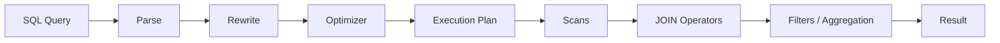
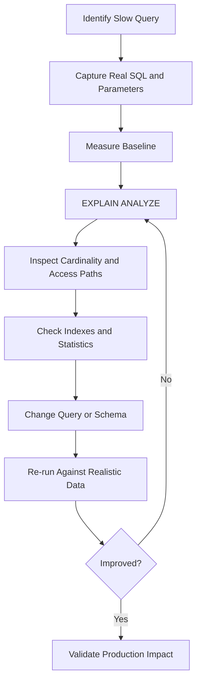

# 25- JOIN Performance Considerations

## Overview

JOIN performance is primarily a function of **cardinality, filtering, access paths, data distribution, and the database execution plan**. The SQL text alone does not determine performance.

A JOIN can be perfectly correct yet become expensive when:

- Large tables are joined before selective predicates reduce the working set.
- A one-to-many relationship creates millions of intermediate rows.
- JOIN keys are not indexed appropriately.
- Data types require expensive casts.
- Expressions prevent efficient index usage.
- Multiple one-to-many relationships multiply each other.
- The query returns far more columns or rows than the application needs.
- Statistics are stale, causing the optimizer to choose a poor plan.

For production systems, optimize JOINs by reasoning about the **rows flowing through the plan**, not simply by counting JOIN clauses.

## How JOIN Performance Works

A database does not normally execute a JOIN by mechanically reading the SQL from top to bottom. The query optimizer transforms the logical query into a physical execution plan.

A simplified flow is:



The optimizer considers:

- Estimated row counts.
- Available indexes.
- Table statistics.
- Predicate selectivity.
- Join conditions.
- Join order.
- Available join algorithms.
- Sort requirements.
- Memory availability.
- Cost estimates.

The database may choose a different physical strategy than the textual order suggests.

## JOIN Algorithms

Most relational databases use several physical JOIN strategies.

| JOIN strategy | Typical use | Strength | Risk |
|---|---|---|---|
| Nested Loop | Small outer input, indexed inner lookup | Excellent for selective lookups | Expensive with large outer inputs |
| Hash Join | Large unsorted inputs with equality condition | Efficient for large equality JOINs | Requires memory/build phase |
| Merge Join | Inputs already sorted or cheaply sortable | Efficient for ordered inputs | Sorting can be expensive |
| Index Nested Loop | Selective indexed lookup | Very efficient for point/range access | Poor when many outer rows match |

The optimizer chooses the strategy based on estimated cost.

Do not assume that a JOIN is slow because it uses a particular algorithm. A nested loop can be ideal for a highly selective query, while a hash join can be ideal for large relations.

## Nested Loop JOIN

A nested loop conceptually does:

```text
for each row in outer relation:
    find matching rows in inner relation
```

For example:

```sql
SELECT
    c.id,
    c.email,
    o.id AS order_id
FROM customers AS c
JOIN orders AS o
    ON o.customer_id = c.id
WHERE c.id = 12345;
```

If `customers.id` is highly selective and `orders.customer_id` is indexed, the database can efficiently:

```text
Find customer 12345
        ↓
Index lookup into orders
        ↓
Return matching orders
```

This can be extremely fast.

However, if the outer relation contains millions of rows and each row causes an expensive inner lookup, the total work can become large.

### When Nested Loop Is Effective

Nested loops are commonly effective when:

- The outer input is small.
- The inner relation has a useful index.
- The predicate is highly selective.
- The number of expected matches is low.

### Production Concern

Do not reject nested loops automatically when reading `EXPLAIN`.

Ask:

> How many times is the inner operation executed, and how much work does each execution perform?

A nested loop with 10 outer rows may be excellent. The same structure repeated 10 million times may be disastrous.

## Hash JOIN

A hash JOIN generally builds a hash table from one input and probes it using rows from the other input.

Conceptually:

```text
Build side
    ↓
Hash join key
    ↓
In-memory hash table
    ↓
Probe side
    ↓
Hash lookup
```

For example:

```sql
SELECT
    o.id,
    c.email
FROM orders AS o
JOIN customers AS c
    ON c.id = o.customer_id;
```

A hash JOIN can be effective when large relations are joined on equality and there is no highly selective indexed lookup that makes a nested loop cheaper.

### Production Considerations

Hash joins consume memory.

If the hash structure does not fit comfortably in the configured memory budget, the database may spill work to temporary storage.

Monitor:

- Temporary file usage.
- Hash batches.
- Memory consumption.
- Execution time.
- I/O.

Increasing database memory blindly is not a substitute for fixing an inefficient query or poor cardinality estimate.

## Merge JOIN

A merge JOIN combines two inputs that are ordered by the JOIN key.

Conceptually:

```text
Sorted input A ─┐
                ├── Merge JOIN
Sorted input B ─┘
```

It can be useful when the inputs are already sorted or when sorting is inexpensive relative to alternative strategies.

If both inputs require large sorts, however, the sorting phase can dominate query execution.

## Cardinality Is the Core Performance Variable

The most important JOIN performance concept is often **cardinality**: how many rows exist at each stage of the execution plan.

Consider:

```text
customers       1,000,000
orders         50,000,000
```

A customer can have many orders.

The JOIN:

```sql
SELECT
    c.id,
    o.id
FROM customers AS c
JOIN orders AS o
    ON o.customer_id = c.id;
```

can produce tens of millions of rows.

If another one-to-many table is added:

```text
customers
    ├── orders
    └── payments
```

the intermediate result can become substantially larger.

For a customer with:

```text
20 orders
15 payments
```

a direct JOIN can produce:

```text
20 × 15 = 300 rows
```

for that customer.

This is often more important than the number of JOIN keywords.

## Filter Early, But Understand the Optimizer

A selective predicate can dramatically reduce the amount of data participating in a JOIN.

For example:

```sql
SELECT
    o.id,
    c.email
FROM orders AS o
JOIN customers AS c
    ON c.id = o.customer_id
WHERE o.status = 'completed'
  AND o.created_at >= CURRENT_DATE - INTERVAL '30 days';
```

The optimizer may push these predicates toward the table scan and avoid processing irrelevant orders.

Conceptually:

```text
50M orders
   ↓
Filter recent completed orders
   ↓
2M orders
   ↓
JOIN customers
```

The important principle is not:

> Always write filters before JOINs.

Instead:

> **Make selective predicates explicit and give the optimizer useful indexes and statistics so it can reduce the working set efficiently.**

For inner joins, relational transformations often allow predicates to be pushed down regardless of their textual position.

## Predicate Pushdown

Predicate pushdown means applying a filter as close as possible to the data source.

For example:

```sql
SELECT
    c.id,
    o.id
FROM customers AS c
JOIN orders AS o
    ON o.customer_id = c.id
WHERE o.status = 'completed';
```

The database may effectively filter `orders` before performing the JOIN.

For outer JOINs, semantics become more restrictive.

These two queries are not necessarily equivalent:

```sql
SELECT
    c.id,
    o.id
FROM customers AS c
LEFT JOIN orders AS o
    ON o.customer_id = c.id
WHERE o.status = 'completed';
```

versus:

```sql
SELECT
    c.id,
    o.id
FROM customers AS c
LEFT JOIN orders AS o
    ON o.customer_id = c.id
   AND o.status = 'completed';
```

The second preserves customers without matching completed orders.

Performance optimization must never change the intended result semantics.

## Indexes for JOIN Performance

Indexes can make JOIN lookups dramatically cheaper, particularly for selective queries.

Consider:

```sql
SELECT
    c.id,
    o.id
FROM customers AS c
JOIN orders AS o
    ON o.customer_id = c.id
WHERE c.id = 12345;
```

Useful indexes commonly include:

```text
customers(id)
orders(customer_id)
```

`customers.id` is normally indexed as a primary key.

The foreign-key column on `orders` may require an explicit index depending on the database schema and workload:

```sql
CREATE INDEX idx_orders_customer_id
    ON orders(customer_id);
```

### Indexing Rules of Thumb

Consider indexes on:

- Frequently used JOIN keys.
- Highly selective filter columns.
- Composite filter + JOIN access paths.
- Columns used for common ordering requirements.

But do not index every column automatically.

Indexes introduce:

- Storage cost.
- Insert overhead.
- Update overhead.
- Delete overhead.
- Maintenance work.
- Cache pressure.

Index decisions should be workload-driven.

## Composite Indexes

Suppose the workload frequently runs:

```sql
SELECT
    id,
    customer_id,
    amount
FROM orders
WHERE customer_id = :customer_id
  AND status = 'completed'
ORDER BY created_at DESC
LIMIT 20;
```

A composite index may be more useful than several independent indexes:

```sql
CREATE INDEX idx_orders_customer_status_created
    ON orders(customer_id, status, created_at DESC);
```

The exact column order should be determined from:

- Query predicates.
- Selectivity.
- Ordering.
- Workload frequency.
- Data distribution.
- Write volume.

Do not treat composite index ordering as a universal formula.

## JOIN Key Data Types Matter

JOIN keys should use compatible data types.

Avoid schemas where related identifiers require implicit conversions:

```text
customers.id       → UUID
orders.customer_id → VARCHAR
```

The database may need to cast values during the JOIN, potentially increasing CPU work or preventing efficient index usage.

Prefer:

```text
customers.id       → UUID
orders.customer_id → UUID
```

Consistency also reduces application complexity and prevents subtle correctness problems.

## Functions and Expressions on JOIN Keys

This pattern can make index usage harder:

```sql
SELECT
    c.id,
    o.id
FROM customers AS c
JOIN orders AS o
    ON LOWER(c.email) = LOWER(o.customer_email);
```

If the application frequently joins this way, consider whether the schema should store a normalized key.

In PostgreSQL, an expression index may help:

```sql
CREATE INDEX idx_customers_lower_email
    ON customers (LOWER(email));
```

But expression indexes should solve a justified workload requirement, not compensate for an avoidable data-model design.

For high-volume systems, joining stable indexed identifiers such as integer, bigint, or UUID foreign keys is generally preferable to joining transformed business attributes.

## Avoid Joining on Business Attributes When Possible

This is often less robust:

```sql
JOIN customers AS c
    ON c.email = o.customer_email
```

Prefer:

```sql
JOIN customers AS c
    ON c.id = o.customer_id
```

Primary-key/foreign-key relationships provide:

- Referential integrity.
- Stable identity.
- Efficient indexing.
- Smaller indexes.
- Clear schema semantics.

Business attributes such as email addresses can change and may require normalization or uniqueness rules.

## Reduce the Rows You Actually Need

Avoid:

```sql
SELECT *
FROM customers AS c
JOIN orders AS o
    ON o.customer_id = c.id;
```

Prefer:

```sql
SELECT
    c.id,
    c.email,
    o.id AS order_id,
    o.amount
FROM customers AS c
JOIN orders AS o
    ON o.customer_id = c.id;
```

Returning unnecessary columns increases:

- Database work.
- Memory usage.
- Network transfer.
- Application deserialization cost.
- API serialization cost.

For backend systems, database optimization includes the entire data path:

```text
Database
   ↓
Network
   ↓
Python/Django/FastAPI
   ↓
Serialization
   ↓
HTTP/gRPC response
```

A query that returns 100 MB instead of 2 MB is expensive even if the database execution plan looks acceptable.

## Use EXISTS for Existence Checks

If the application only needs to know whether a relationship exists, avoid generating all matching child rows.

Instead of:

```sql
SELECT DISTINCT
    c.id,
    c.email
FROM customers AS c
JOIN orders AS o
    ON o.customer_id = c.id;
```

prefer:

```sql
SELECT
    c.id,
    c.email
FROM customers AS c
WHERE EXISTS (
    SELECT 1
    FROM orders AS o
    WHERE o.customer_id = c.id
);
```

This communicates the intended semantics:

```text
Does at least one related row exist?
```

The optimizer can often implement this efficiently as a semi-join.

## Avoid Accidental Cartesian Products

An accidental Cartesian product can destroy query performance.

For example:

```sql
SELECT
    c.id,
    o.id
FROM customers AS c
CROSS JOIN orders AS o;
```

With:

```text
1M customers
×
50M orders
```

the theoretical result contains:

```text
50 trillion rows
```

A missing JOIN predicate can have similarly catastrophic effects.

When a query suddenly consumes excessive CPU, memory, temporary storage, or network bandwidth, inspect the estimated and actual cardinalities first.

## Multiple One-to-Many JOINs

Consider:

```sql
SELECT
    c.id,
    o.id AS order_id,
    p.id AS payment_id
FROM customers AS c
LEFT JOIN orders AS o
    ON o.customer_id = c.id
LEFT JOIN payments AS p
    ON p.customer_id = c.id;
```

For a customer with:

```text
10 orders
×
8 payments
```

the result can contain:

```text
80 rows
```

This creates both correctness and performance problems.

If the application needs aggregates, pre-aggregate each child relation:

```sql
WITH order_stats AS (
    SELECT
        customer_id,
        COUNT(*) AS order_count,
        SUM(amount) AS order_total
    FROM orders
    GROUP BY customer_id
),
payment_stats AS (
    SELECT
        customer_id,
        COUNT(*) AS payment_count
    FROM payments
    GROUP BY customer_id
)
SELECT
    c.id,
    c.email,
    COALESCE(os.order_count, 0) AS order_count,
    COALESCE(os.order_total, 0) AS order_total,
    COALESCE(ps.payment_count, 0) AS payment_count
FROM customers AS c
LEFT JOIN order_stats AS os
    ON os.customer_id = c.id
LEFT JOIN payment_stats AS ps
    ON ps.customer_id = c.id;
```

Now each derived relation has one row per customer.

## Pagination and JOIN Performance

Pagination can become expensive and semantically incorrect when applied to a multiplied JOIN result.

This:

```sql
SELECT
    c.id,
    o.id AS order_id
FROM customers AS c
LEFT JOIN orders AS o
    ON o.customer_id = c.id
ORDER BY c.id
LIMIT 50;
```

returns 50 joined rows, not necessarily 50 customers.

For an API whose resource is the customer, establish the customer page first:

```sql
WITH page AS (
    SELECT
        id,
        email
    FROM customers
    WHERE id > :last_id
    ORDER BY id
    LIMIT 50
)
SELECT
    p.id AS customer_id,
    p.email,
    o.id AS order_id
FROM page AS p
LEFT JOIN orders AS o
    ON o.customer_id = p.id
ORDER BY p.id, o.id;
```

This separates:

```text
pagination grain
```

from:

```text
relationship expansion
```

For large tables, keyset pagination is generally more scalable than large `OFFSET` values.

## OFFSET Can Become Expensive

This pattern:

```sql
SELECT
    id,
    email
FROM customers
ORDER BY id
LIMIT 50 OFFSET 5000000;
```

may require the database to process or skip a large number of rows before returning the requested page.

Keyset pagination is often preferable:

```sql
SELECT
    id,
    email
FROM customers
WHERE id > :last_id
ORDER BY id
LIMIT 50;
```

When JOINs are involved, keyset pagination should be designed around the resource's intended grain.

## Statistics and Cardinality Estimates

Query optimizers depend on statistics to estimate:

```text
How many rows will this predicate return?
How many rows will this JOIN produce?
How selective is this index?
```

If estimates are significantly wrong, the optimizer may choose a poor plan.

For PostgreSQL, statistics are maintained by `ANALYZE` and `VACUUM (ANALYZE)` operations.

A simplified diagnostic workflow is:

```sql
ANALYZE customers;
ANALYZE orders;
```

Then inspect the query again:

```sql
EXPLAIN (ANALYZE, BUFFERS)
SELECT
    ...
```

Large differences between:

```text
estimated rows
```

and:

```text
actual rows
```

are valuable diagnostic signals.

## EXPLAIN and EXPLAIN ANALYZE

`EXPLAIN` shows the planned execution strategy:

```sql
EXPLAIN
SELECT
    o.id,
    c.email
FROM orders AS o
JOIN customers AS c
    ON c.id = o.customer_id
WHERE o.status = 'completed';
```

`EXPLAIN ANALYZE` executes the query and reports actual execution behavior:

```sql
EXPLAIN (ANALYZE, BUFFERS)
SELECT
    o.id,
    c.email
FROM orders AS o
JOIN customers AS c
    ON c.id = o.customer_id
WHERE o.status = 'completed';
```

For production diagnosis, pay particular attention to:

| Plan signal | What it tells you |
|---|---|
| Estimated rows | Optimizer expectation |
| Actual rows | Real cardinality |
| Loops | How often an operation executes |
| Actual time | Time spent in the operation |
| Buffers | Data/cache I/O behavior |
| Sorts | Ordering cost |
| Temporary I/O | Possible memory pressure |
| Sequential scans | May be correct or may indicate missing/selectivity issues |
| Index scans | Useful indexed access path |
| Hash batches | Potential hash-memory pressure |

`EXPLAIN ANALYZE` executes the statement, so be careful with `INSERT`, `UPDATE`, and `DELETE`. Use transaction rollback or appropriate read-only techniques when analyzing modifying statements.

## Sequential Scan Is Not Automatically Bad

A common beginner assumption is:

> Index scan good, sequential scan bad.

That is incorrect.

If a query needs a large percentage of a table, scanning the table sequentially can be cheaper than performing millions of random index lookups.

For example:

```sql
SELECT
    id,
    email
FROM customers;
```

A sequential scan may be exactly what the optimizer should choose.

The correct question is:

> Is the chosen access path appropriate for the amount and distribution of data this query needs?

## Selectivity Matters

Suppose:

```text
orders: 100,000,000 rows
```

and:

```sql
WHERE status = 'completed'
```

matches:

```text
95,000,000 rows
```

An index on `status` may provide little benefit for this query because the predicate is not selective.

If another predicate matches:

```text
100,000 rows
```

the index can become much more valuable.

Index usefulness depends on:

- Data distribution.
- Query predicates.
- Table size.
- Correlation.
- Physical storage.
- Query workload.

## Partial Indexes

When a workload repeatedly targets a small subset of rows, a partial index can be useful in PostgreSQL.

For example:

```sql
CREATE INDEX idx_orders_pending_customer
    ON orders(customer_id)
    WHERE status = 'pending';
```

This can be valuable for queries such as:

```sql
SELECT
    id,
    customer_id
FROM orders
WHERE customer_id = :customer_id
  AND status = 'pending';
```

Partial indexes reduce index size and can improve cache efficiency, but they are database-specific and should be introduced based on actual workload patterns.

## Covering Indexes

Sometimes an index can satisfy more of the query without fetching the full table row.

In PostgreSQL, included columns can be used:

```sql
CREATE INDEX idx_orders_customer_status
    ON orders(customer_id, status)
    INCLUDE (created_at, amount);
```

This can enable index-only scans when visibility and other conditions allow it.

Do not blindly create wide covering indexes. Large indexes increase:

- Storage.
- Write cost.
- Cache pressure.
- Maintenance overhead.

## JOIN Order and the Optimizer

For inner joins, the optimizer is generally free to reorder relations when semantics allow it.

These queries are logically equivalent:

```sql
FROM customers AS c
JOIN orders AS o
    ON o.customer_id = c.id
```

and:

```sql
FROM orders AS o
JOIN customers AS c
    ON c.id = o.customer_id
```

The physical execution order can still differ.

For outer joins, the optimizer has fewer freedoms because row-preservation semantics must be maintained.

This is one reason why replacing an outer JOIN with an inner JOIN merely because it "looks faster" is dangerous.

## JOIN Performance and CTEs

Common table expressions can improve readability:

```sql
WITH recent_orders AS (
    SELECT
        id,
        customer_id
    FROM orders
    WHERE created_at >= CURRENT_DATE - INTERVAL '30 days'
)
SELECT
    c.id,
    ro.id AS order_id
FROM customers AS c
JOIN recent_orders AS ro
    ON ro.customer_id = c.id;
```

Modern PostgreSQL versions can inline many CTEs when appropriate, so a CTE does not automatically imply materialization or poor performance.

If materialization is specifically desired, PostgreSQL supports:

```sql
WITH recent_orders AS MATERIALIZED (
    ...
)
```

and:

```sql
WITH recent_orders AS NOT MATERIALIZED (
    ...
)
```

Use these intentionally and verify the resulting execution plan.

## JOIN Performance in Django

ORM abstractions can hide expensive JOIN behavior.

For a foreign-key or one-to-one relationship:

```python
orders = (
    Order.objects
    .select_related("customer")
    .filter(status="completed")
)
```

`select_related()` generally produces SQL JOINs and is appropriate when the related object can be loaded through a single relational query.

For one-to-many or many-to-many relationships:

```python
customers = (
    Customer.objects
    .prefetch_related("orders")
    .filter(status="active")
)
```

`prefetch_related()` commonly performs separate queries and combines the results in Python.

This can be preferable to generating a huge JOIN result when the application needs separate parent and child collections.

The right choice depends on:

- Cardinality.
- Result shape.
- Number of related rows.
- Serialization requirements.
- Memory usage.
- Query count.
- Database execution cost.

## JOIN Performance in Backend APIs

A production request might look like:

```text
Client
  ↓
Nginx / Load Balancer
  ↓
Django / FastAPI
  ↓
ORM / SQL
  ↓
PostgreSQL
  ↓
Rows
  ↓
Application serialization
  ↓
HTTP response
```

JOIN performance affects more than database latency.

A poorly designed query can increase:

- Database CPU.
- Database memory.
- Connection occupancy.
- Lock duration.
- Network traffic.
- Application CPU.
- Application memory.
- Request latency.
- API timeout frequency.

If a query holds a database connection for 2 seconds instead of 50 ms, the impact can propagate to connection pools and request throughput.

## Connection Pool Pressure

Slow JOINs consume database connections for longer.

Suppose an API has:

```text
100 application workers
```

and each request holds a database connection for several seconds because of expensive queries.

The database may reach its connection limit even when CPU utilization is not yet saturated.

This can create:

```text
slow query
→ connection occupied longer
→ pool exhaustion
→ queued requests
→ increased latency
→ timeouts
→ retry amplification
```

Query optimization therefore contributes directly to service reliability.

## Locking and JOIN Performance

A slow query can also increase the time for which transactional resources remain active.

For write-heavy systems, long-running transactions can contribute to:

- Lock contention.
- Old transaction snapshots.
- Vacuum delays in PostgreSQL.
- Increased table/index bloat.
- Reduced throughput.

Do not evaluate query performance solely from the perspective of one SELECT statement.

Consider its effect on the entire database workload.

## Monitoring JOIN Performance

Production monitoring should capture more than average query latency.

Track:

- Query latency percentiles.
- Query execution frequency.
- Rows returned.
- Database CPU.
- Database I/O.
- Buffer/cache behavior.
- Temporary file usage.
- Connection pool utilization.
- Slow query frequency.
- Lock waits.
- Query plan regressions.

For PostgreSQL, tools such as `pg_stat_statements` are useful for identifying high-cost and frequently executed queries.

A useful prioritization metric is often:

```text
total database time
=
execution time × execution frequency
```

A query taking 500 ms once per day may matter less than a query taking 20 ms thousands of times per minute.

## Production Optimization Workflow

Use a repeatable process instead of making speculative changes.



### Establish a Baseline

Record:

```text
p50 latency
p95 latency
p99 latency
rows returned
execution frequency
database CPU
I/O
```

### Inspect the Actual Plan

Use:

```sql
EXPLAIN (ANALYZE, BUFFERS)
SELECT
    ...
```

Look for:

- Large row-estimation errors.
- Unexpected sequential scans.
- Repeated expensive loops.
- Large sorts.
- Hash spills.
- Huge intermediate cardinalities.

### Fix the Highest-Leverage Problem

Potential changes include:

- Correcting a JOIN condition.
- Reducing result cardinality.
- Adding an appropriate index.
- Changing a JOIN to `EXISTS`.
- Pre-aggregating child relations.
- Removing unnecessary columns.
- Changing pagination strategy.
- Correcting stale statistics.
- Restructuring the data access pattern.

### Re-measure

Never assume an optimization worked.

Compare the new plan and metrics against the baseline.

## Production Anti-Patterns

| Anti-pattern | Why it hurts | Better approach |
|---|---|---|
| `SELECT *` across JOINs | Excessive payload and memory | Explicit projection |
| `DISTINCT` to hide duplicates | Masks cardinality problem | Fix JOIN or use `EXISTS` |
| Missing foreign-key index | Expensive relationship lookups | Index based on workload |
| Multiple independent one-to-many JOINs | Row multiplication | Pre-aggregate or separate queries |
| JOIN on transformed columns | Can limit index use | Normalize keys or use appropriate expression indexes |
| JOIN on business attributes | Larger, mutable keys | Primary/foreign-key relationship |
| Large `OFFSET` pagination | Increasing scan/skip cost | Keyset pagination |
| N+1 ORM queries | Excessive database round trips | `select_related()` / `prefetch_related()` appropriately |
| Blind index creation | Write/storage overhead | Workload-driven indexing |
| Optimizing from SQL text alone | Ignores optimizer behavior | Inspect execution plans |
| Assuming sequential scan is bad | Can lead to unnecessary indexes | Evaluate selectivity and plan cost |
| Ignoring result grain | Incorrect pagination and duplicates | Define expected row shape first |

## Common Mistakes

### Adding an Index Without Checking the Plan

An index existing on a column does not guarantee that the optimizer should use it.

The query may:

- Match too many rows.
- Need most of the table.
- Have a more efficient alternative.
- Have stale statistics.

Always validate with realistic data.

### Optimizing the Wrong Query

Developers often optimize the query that looks complicated rather than the query consuming the most database resources.

Prioritize using:

```text
frequency × latency × resource consumption
```

rather than SQL complexity alone.

### Ignoring Data Growth

A query that performs well with:

```text
10,000 orders
```

may fail at:

```text
100 million orders
```

Performance testing should use production-like cardinality and data distributions.

### Using DISTINCT as a Performance Fix

`DISTINCT` can require sorting or hashing and may itself become expensive.

More importantly, it may conceal an incorrect JOIN.

First determine why duplicates exist.

### Joining Everything in One Query

A single SQL query is not automatically better than multiple queries.

For a complex object graph, separate queries can sometimes be more efficient and easier to reason about, especially when ORM prefetching can combine them efficiently.

The objective is not:

> Minimize query count at all costs.

The objective is:

> Minimize unnecessary database work while preserving correctness and acceptable latency.

## Interview Traps

### "Indexes Always Make JOINs Faster"

False.

Indexes improve specific access patterns. They also add write and storage costs.

### "The First Table in FROM Is Always Scanned First"

False.

The optimizer can reorder many inner JOIN operations.

### "A Sequential Scan Means the Query Is Bad"

False.

Sequential scans can be optimal when a large fraction of a relation is required.

### "Nested Loop JOIN Is Always Slow"

False.

A nested loop with a small outer input and indexed inner lookup can be extremely efficient.

### "More JOINs Always Mean Slower Queries"

Not necessarily.

A well-indexed JOIN between selective relations can be cheap, while a single JOIN can be extremely expensive if it creates massive cardinality.

### "EXPLAIN and EXPLAIN ANALYZE Are Equivalent"

They are not.

`EXPLAIN` provides the planned strategy.

`EXPLAIN ANALYZE` executes the query and provides actual runtime behavior.

## Security and Reliability Considerations

JOIN performance can become a security and reliability concern when queries operate across tenant or authorization boundaries.

For multi-tenant systems, ensure JOINs cannot accidentally combine records across tenants:

```sql
SELECT
    c.id,
    o.id
FROM customers AS c
JOIN orders AS o
    ON o.customer_id = c.id
   AND o.tenant_id = c.tenant_id
WHERE c.tenant_id = :tenant_id;
```

The exact design depends on the application's authorization model, but tenant isolation must be treated as a correctness invariant.

Avoid constructing JOIN predicates through string concatenation. Use parameterized queries or ORM query parameters:

```python
Order.objects.filter(customer_id=customer_id)
```

Performance optimizations must never weaken:

- Tenant isolation.
- Authorization constraints.
- Soft-delete semantics.
- Row-level security policies.
- Data access boundaries.

## High Availability and Scaling Considerations

When database workload grows, JOIN optimization becomes part of system architecture.

Useful strategies include:

- Proper indexing.
- Query/result-shape optimization.
- Read replicas for suitable read workloads.
- Caching stable or expensive derived results.
- Pre-aggregation for analytical workloads.
- Materialized views where justified.
- Partitioning for very large tables.
- Archiving historical data.
- Separating OLTP and analytical workloads.

Read replicas do not automatically solve inefficient JOINs. A query that consumes excessive CPU or I/O will still consume those resources on the replica.

Similarly, caching should not be used to hide an uncontrolled query pattern indefinitely.

## Cost Considerations

Expensive JOINs can increase infrastructure cost through:

- Higher database CPU.
- More provisioned database capacity.
- Increased storage I/O.
- Larger replicas.
- More application instances needed to handle latency.
- Higher network transfer.
- Increased operational complexity.

An optimization that reduces query execution from:

```text
500 ms → 20 ms
```

can sometimes improve both user latency and infrastructure efficiency.

Evaluate optimizations using total workload cost rather than isolated query timing.

## Key Takeaways

- **JOIN performance is driven primarily by cardinality, selectivity, access paths, data distribution, and the physical execution plan—not by the number of JOIN clauses alone.**
- **Use `EXPLAIN (ANALYZE, BUFFERS)` and realistic production-scale data to validate JOIN behavior, especially row estimates, loops, scans, sorts, hashes, and I/O.**
- **Indexes should support real access patterns such as JOIN keys and selective predicates, but every index carries storage, write, cache, and maintenance costs.**
- **Control intermediate row growth by filtering appropriately, using `EXISTS` for existence checks, pre-aggregating independent one-to-many relationships, and avoiding accidental Cartesian products.**
- **Treat JOIN optimization as a system-level concern: slow queries consume connections and database resources, increase API latency, and can become reliability and infrastructure-cost problems as traffic grows.**