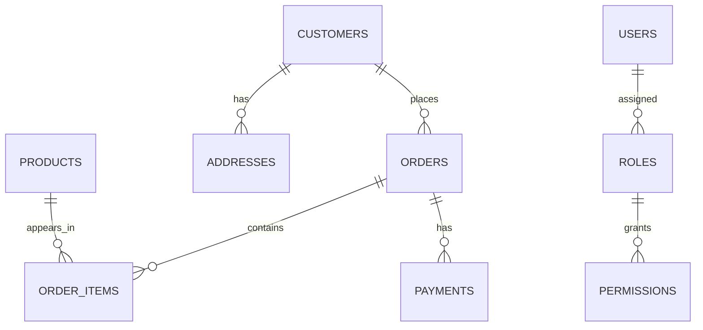

# 26- Practical JOIN Patterns

## Overview

Practical JOIN usage is less about memorizing JOIN syntax and more about choosing the correct **relationship, result grain, and query shape** for a backend requirement.

Most production JOINs fall into a small number of recurring patterns:

- Load a parent with related records.
- Find parents that have matching children.
- Find parents without matching children.
- Retrieve the latest related record.
- Join through an association table.
- Aggregate child records per parent.
- Preserve parents even when related data is missing.
- Combine multiple relationships without multiplying rows incorrectly.
- Join data from derived or pre-aggregated relations.
- Use semi-joins or anti-joins when the application needs existence rather than related rows.

The critical engineering question is:

> **What should one output row represent?**

If one row represents a customer, the query should preserve customer-level cardinality. If one row represents an order, the JOIN should produce order-level results. Many JOIN bugs and performance problems occur because the intended result grain is never made explicit.

## Reference Schema

The examples use a typical backend commerce schema:



Representative tables:

```sql
CREATE TABLE customers (
    id BIGINT PRIMARY KEY,
    email TEXT NOT NULL UNIQUE,
    status TEXT NOT NULL,
    created_at TIMESTAMPTZ NOT NULL
);

CREATE TABLE orders (
    id BIGINT PRIMARY KEY,
    customer_id BIGINT NOT NULL REFERENCES customers(id),
    status TEXT NOT NULL,
    total_amount NUMERIC(12, 2) NOT NULL,
    created_at TIMESTAMPTZ NOT NULL
);

CREATE TABLE order_items (
    id BIGINT PRIMARY KEY,
    order_id BIGINT NOT NULL REFERENCES orders(id),
    product_id BIGINT NOT NULL REFERENCES products(id),
    quantity INTEGER NOT NULL,
    unit_price NUMERIC(12, 2) NOT NULL
);

CREATE TABLE payments (
    id BIGINT PRIMARY KEY,
    order_id BIGINT NOT NULL REFERENCES orders(id),
    status TEXT NOT NULL,
    amount NUMERIC(12, 2) NOT NULL,
    created_at TIMESTAMPTZ NOT NULL
);
```

Foreign-key columns used frequently for JOINs should be indexed according to workload:

```sql
CREATE INDEX idx_orders_customer_id
    ON orders(customer_id);

CREATE INDEX idx_order_items_order_id
    ON order_items(order_id);

CREATE INDEX idx_payments_order_id
    ON payments(order_id);
```

## Pattern: Parent with Matching Children

### Use Case

Return customers who have orders.

```sql
SELECT
    c.id,
    c.email,
    o.id AS order_id,
    o.total_amount
FROM customers AS c
JOIN orders AS o
    ON o.customer_id = c.id;
```

This produces one row per matching customer-order relationship.

If a customer has five orders, that customer appears five times.

### When to Use

Use this shape when the application genuinely needs a **parent-child rowset**.

Typical cases include:

- Exporting orders with customer information.
- Reporting.
- Searching orders by customer attributes.
- Processing order-level records.

### Production Consideration

Do not use this pattern if the API expects one row per customer.

If the requirement is:

> "Return customers who have at least one order."

then `EXISTS` is usually a better expression of intent.

## Pattern: Parent with Optional Children

Use `LEFT JOIN` when every parent must remain in the result even when no child exists.

```sql
SELECT
    c.id,
    c.email,
    o.id AS order_id
FROM customers AS c
LEFT JOIN orders AS o
    ON o.customer_id = c.id;
```

For a customer without orders:

```text
customer_id | email           | order_id
------------+-----------------+---------
42          | user@example.com| NULL
```

This is useful for:

- Customer dashboards.
- Account administration.
- Reporting with zero activity.
- Optional profile relationships.

The semantic requirement is:

> Preserve the left-side row regardless of whether a match exists.

## Pattern: Find Parents That Have at Least One Child

Use `EXISTS` when related rows are used only to determine eligibility.

```sql
SELECT
    c.id,
    c.email
FROM customers AS c
WHERE EXISTS (
    SELECT 1
    FROM orders AS o
    WHERE o.customer_id = c.id
);
```

This expresses:

```text
Return customer
IF at least one matching order exists
```

It avoids creating a parent row for every matching order.

### Why It Matters

A common alternative is:

```sql
SELECT DISTINCT
    c.id,
    c.email
FROM customers AS c
JOIN orders AS o
    ON o.customer_id = c.id;
```

Although both can produce the same logical customer set, `DISTINCT` may require additional sorting or hashing and can hide the fact that the query never needed child rows in the first place.

Use the construct that expresses the actual requirement.

## Pattern: Find Parents Without Children

This is an **anti-join** pattern.

Using `NOT EXISTS`:

```sql
SELECT
    c.id,
    c.email
FROM customers AS c
WHERE NOT EXISTS (
    SELECT 1
    FROM orders AS o
    WHERE o.customer_id = c.id
);
```

This is generally the clearest form for:

> Customers who have never placed an order.

Another common form is:

```sql
SELECT
    c.id,
    c.email
FROM customers AS c
LEFT JOIN orders AS o
    ON o.customer_id = c.id
WHERE o.id IS NULL;
```

Both patterns can be valid, but `NOT EXISTS` communicates the existence semantics directly.

### Important NULL Consideration

Do not casually replace `NOT EXISTS` with `NOT IN`:

```sql
WHERE c.id NOT IN (
    SELECT o.customer_id
    FROM orders AS o
)
```

If the subquery can contain `NULL`, SQL's three-valued logic can produce unexpected results.

For anti-join semantics, `NOT EXISTS` is usually the safer default.

## Pattern: Filter a LEFT JOIN Without Losing Its Semantics

This is a frequent production bug.

Suppose the requirement is:

> Return all customers and their completed orders, if any.

Correct:

```sql
SELECT
    c.id,
    c.email,
    o.id AS order_id
FROM customers AS c
LEFT JOIN orders AS o
    ON o.customer_id = c.id
   AND o.status = 'completed';
```

A tempting alternative is:

```sql
SELECT
    c.id,
    c.email,
    o.id AS order_id
FROM customers AS c
LEFT JOIN orders AS o
    ON o.customer_id = c.id
WHERE o.status = 'completed';
```

The `WHERE` predicate rejects rows where `o.status` is `NULL`, effectively removing customers without matching orders.

The second query behaves much more like an inner join.

### Rule

For an outer JOIN:

- Conditions that define which child rows qualify often belong in `ON`.
- Conditions that should remove the entire result row belong in `WHERE`.

Always reason about the NULL-extended rows introduced by the outer JOIN.

## Pattern: Join Through a Many-to-Many Relationship

Many-to-many relationships normally use an association table.

For example:

```text
users
  ↓
user_roles
  ↓
roles
```

To find users with a specific role:

```sql
SELECT
    u.id,
    u.email,
    r.name AS role_name
FROM users AS u
JOIN user_roles AS ur
    ON ur.user_id = u.id
JOIN roles AS r
    ON r.id = ur.role_id
WHERE r.name = 'admin';
```

The association table is not incidental. It represents the relationship itself.

### Production Considerations

Ensure the association table has appropriate indexes.

For frequent lookups in both directions:

```sql
CREATE INDEX idx_user_roles_user_id
    ON user_roles(user_id);

CREATE INDEX idx_user_roles_role_id
    ON user_roles(role_id);
```

If duplicate relationships are invalid, enforce that invariant with a unique constraint:

```sql
ALTER TABLE user_roles
ADD CONSTRAINT uq_user_roles
UNIQUE (user_id, role_id);
```

This prevents duplicate relationship rows from creating unexpected JOIN multiplication.

## Pattern: Retrieve Parent and Aggregate Child Data

If the requirement is one row per parent, aggregate the child relation.

```sql
SELECT
    c.id,
    c.email,
    COUNT(o.id) AS order_count,
    COALESCE(SUM(o.total_amount), 0) AS order_total
FROM customers AS c
LEFT JOIN orders AS o
    ON o.customer_id = c.id
GROUP BY
    c.id,
    c.email;
```

The `LEFT JOIN` preserves customers with zero orders.

Without `COALESCE`, `SUM()` may return `NULL` when no matching rows exist.

### Result Grain

The result is:

```text
one row per customer
```

rather than:

```text
one row per customer-order relationship
```

This distinction is fundamental.

## Pattern: Filter Before Aggregation

Suppose the requirement is:

> Count completed orders per customer.

```sql
SELECT
    c.id,
    c.email,
    COUNT(o.id) AS completed_order_count
FROM customers AS c
LEFT JOIN orders AS o
    ON o.customer_id = c.id
   AND o.status = 'completed'
GROUP BY
    c.id,
    c.email;
```

The predicate belongs in the JOIN condition because customers without completed orders must remain in the result.

An equivalent derived-table approach can sometimes make the data flow clearer:

```sql
SELECT
    c.id,
    c.email,
    COALESCE(o.completed_order_count, 0) AS completed_order_count
FROM customers AS c
LEFT JOIN (
    SELECT
        customer_id,
        COUNT(*) AS completed_order_count
    FROM orders
    WHERE status = 'completed'
    GROUP BY customer_id
) AS o
    ON o.customer_id = c.id;
```

The second form explicitly reduces `orders` to one row per customer before joining.

## Pattern: Latest Related Record

A common backend requirement is:

> Return each customer and their latest order.

A naive JOIN does not solve this:

```sql
SELECT
    c.id,
    o.id,
    o.created_at
FROM customers AS c
LEFT JOIN orders AS o
    ON o.customer_id = c.id;
```

It returns all orders.

For PostgreSQL, `LATERAL` is a useful pattern:

```sql
SELECT
    c.id,
    c.email,
    latest_order.id AS order_id,
    latest_order.created_at
FROM customers AS c
LEFT JOIN LATERAL (
    SELECT
        o.id,
        o.created_at
    FROM orders AS o
    WHERE o.customer_id = c.id
    ORDER BY o.created_at DESC, o.id DESC
    LIMIT 1
) AS latest_order
    ON TRUE;
```

An index supporting the lookup can be valuable:

```sql
CREATE INDEX idx_orders_customer_created
    ON orders(customer_id, created_at DESC, id DESC);
```

The secondary `id` ordering provides deterministic tie-breaking when timestamps are equal.

## Pattern: Latest Record Using Window Functions

Another robust pattern uses `ROW_NUMBER()`:

```sql
WITH ranked_orders AS (
    SELECT
        o.*,
        ROW_NUMBER() OVER (
            PARTITION BY o.customer_id
            ORDER BY o.created_at DESC, o.id DESC
        ) AS rn
    FROM orders AS o
)
SELECT
    c.id,
    c.email,
    ro.id AS order_id,
    ro.created_at
FROM customers AS c
LEFT JOIN ranked_orders AS ro
    ON ro.customer_id = c.id
   AND ro.rn = 1;
```

This is useful when the query already needs window-function processing or when multiple ranked attributes are required.

Choose between approaches based on:

- Database engine.
- Existing query shape.
- Data volume.
- Index availability.
- Execution plan.

## Pattern: Join Only the Latest Child Per Group

For more complex requirements, first reduce the child table to the desired grain.

For example:

```sql
WITH latest_payment AS (
    SELECT
        p.order_id,
        MAX(p.created_at) AS latest_payment_at
    FROM payments AS p
    GROUP BY p.order_id
)
SELECT
    o.id,
    o.customer_id,
    lp.latest_payment_at
FROM orders AS o
LEFT JOIN latest_payment AS lp
    ON lp.order_id = o.id;
```

This prevents every payment from multiplying the order result.

The design principle is:

> **Reduce a high-cardinality relation before joining it when the final result needs only one row per parent.**

## Pattern: Join Multiple One-to-Many Relationships Safely

Avoid:

```sql
SELECT
    c.id,
    o.id AS order_id,
    p.id AS payment_id
FROM customers AS c
LEFT JOIN orders AS o
    ON o.customer_id = c.id
LEFT JOIN payments AS p
    ON p.customer_id = c.id;
```

If a customer has 10 orders and 8 payments, the intermediate result can contain 80 combinations.

If the requirement is customer-level metrics, aggregate independently:

```sql
WITH order_stats AS (
    SELECT
        customer_id,
        COUNT(*) AS order_count,
        SUM(total_amount) AS order_total
    FROM orders
    GROUP BY customer_id
),
payment_stats AS (
    SELECT
        customer_id,
        COUNT(*) AS payment_count,
        SUM(amount) AS payment_total
    FROM payments
    GROUP BY customer_id
)
SELECT
    c.id,
    c.email,
    COALESCE(os.order_count, 0) AS order_count,
    COALESCE(os.order_total, 0) AS order_total,
    COALESCE(ps.payment_count, 0) AS payment_count,
    COALESCE(ps.payment_total, 0) AS payment_total
FROM customers AS c
LEFT JOIN order_stats AS os
    ON os.customer_id = c.id
LEFT JOIN payment_stats AS ps
    ON ps.customer_id = c.id;
```

Each derived relation has one row per customer, so the final JOIN cannot multiply orders by payments.

## Pattern: Join and Aggregate Without Double Counting

Consider:

```sql
SELECT
    o.id,
    SUM(oi.quantity * oi.unit_price) AS item_total,
    SUM(p.amount) AS payment_total
FROM orders AS o
LEFT JOIN order_items AS oi
    ON oi.order_id = o.id
LEFT JOIN payments AS p
    ON p.order_id = o.id
GROUP BY o.id;
```

This can produce incorrect totals because each order item may combine with each payment.

For example:

```text
3 items × 2 payments = 6 joined rows
```

Both aggregates can be multiplied.

Instead, aggregate each child relation first:

```sql
WITH item_totals AS (
    SELECT
        order_id,
        SUM(quantity * unit_price) AS item_total
    FROM order_items
    GROUP BY order_id
),
payment_totals AS (
    SELECT
        order_id,
        SUM(amount) AS payment_total
    FROM payments
    GROUP BY order_id
)
SELECT
    o.id,
    COALESCE(it.item_total, 0) AS item_total,
    COALESCE(pt.payment_total, 0) AS payment_total
FROM orders AS o
LEFT JOIN item_totals AS it
    ON it.order_id = o.id
LEFT JOIN payment_totals AS pt
    ON pt.order_id = o.id;
```

This is a critical production reporting pattern.

## Pattern: Search by Related Attributes

Suppose an order API allows searching by customer email:

```sql
SELECT
    o.id,
    o.status,
    o.total_amount
FROM orders AS o
JOIN customers AS c
    ON c.id = o.customer_id
WHERE c.email = :email;
```

The relationship is still based on the stable foreign key:

```text
orders.customer_id → customers.id
```

The business attribute is used for filtering, not for the relationship itself.

For case-insensitive email lookup, the database schema and index strategy should match the application's normalization policy.

## Pattern: Join and Preserve a Parent-Level Filter

Suppose an API should return active customers and their orders:

```sql
SELECT
    c.id,
    c.email,
    o.id AS order_id
FROM customers AS c
LEFT JOIN orders AS o
    ON o.customer_id = c.id
WHERE c.status = 'active';
```

The customer predicate belongs in `WHERE` because inactive customers should not appear at all.

This is different from filtering optional child rows.

A useful mental model is:

```text
WHERE → controls whether the output row survives
ON    → controls which rows participate in the relationship
```

This is a simplification, but it is a useful starting point for reasoning about outer JOIN semantics.

## Pattern: Optional Relationship With a Business Condition

Suppose customers may have a preferred address, but only addresses marked active should qualify.

```sql
SELECT
    c.id,
    c.email,
    a.id AS address_id,
    a.city
FROM customers AS c
LEFT JOIN addresses AS a
    ON a.customer_id = c.id
   AND a.is_active = TRUE
   AND a.is_primary = TRUE;
```

This preserves the customer when no qualifying address exists.

This pattern is useful for:

- Optional profiles.
- Current subscriptions.
- Active configuration.
- Primary addresses.
- Current membership records.

## Pattern: Join Against a Derived Relation

Derived tables are useful when the relationship should operate against a transformed dataset.

```sql
SELECT
    c.id,
    c.email,
    recent.order_count
FROM customers AS c
LEFT JOIN (
    SELECT
        customer_id,
        COUNT(*) AS order_count
    FROM orders
    WHERE created_at >= CURRENT_DATE - INTERVAL '30 days'
    GROUP BY customer_id
) AS recent
    ON recent.customer_id = c.id;
```

The derived relation has:

```text
one row per customer
```

This makes the final JOIN predictable.

Derived relations are particularly useful for:

- Pre-aggregation.
- Filtering.
- Deduplication.
- Ranking.
- Latest-record selection.

## Pattern: JOIN Against a CTE

A CTE can make multi-stage data processing easier to read.

```sql
WITH recent_orders AS (
    SELECT
        id,
        customer_id,
        total_amount
    FROM orders
    WHERE created_at >= CURRENT_DATE - INTERVAL '30 days'
)
SELECT
    c.id,
    c.email,
    ro.id AS order_id,
    ro.total_amount
FROM customers AS c
JOIN recent_orders AS ro
    ON ro.customer_id = c.id;
```

Use CTEs to clarify complex query logic, not merely because they look cleaner.

Modern PostgreSQL versions can inline eligible CTEs. Do not assume that every CTE creates a temporary materialized result.

## Pattern: Self JOIN

A self JOIN relates rows within the same table.

For example, an employee-manager relationship:

```sql
SELECT
    employee.id AS employee_id,
    employee.name AS employee_name,
    manager.id AS manager_id,
    manager.name AS manager_name
FROM employees AS employee
LEFT JOIN employees AS manager
    ON manager.id = employee.manager_id;
```

The table requires aliases because it participates in the query twice.

Self JOINs are useful for:

- Hierarchies.
- Parent-child records.
- Organizational structures.
- Graph-like relationships stored relationally.
- Comparing rows within the same table.

## Pattern: Compare Rows Within the Same Table

Suppose products have historical prices and the application needs pairs of prices for comparison.

A self JOIN can compare rows:

```sql
SELECT
    p1.product_id,
    p1.price AS current_price,
    p2.price AS previous_price
FROM product_prices AS p1
JOIN product_prices AS p2
    ON p2.product_id = p1.product_id
   AND p2.effective_at < p1.effective_at;
```

This can produce many combinations, so window functions are often more appropriate when the requirement is specifically "previous row."

Use the simplest relational operation that matches the required relationship.

## Pattern: Conditional Aggregation After a JOIN

A common reporting requirement is to calculate multiple metrics in one pass.

```sql
SELECT
    c.id,
    c.email,
    COUNT(o.id) AS total_orders,
    COUNT(*) FILTER (
        WHERE o.status = 'completed'
    ) AS completed_orders,
    COUNT(*) FILTER (
        WHERE o.status = 'cancelled'
    ) AS cancelled_orders
FROM customers AS c
LEFT JOIN orders AS o
    ON o.customer_id = c.id
GROUP BY
    c.id,
    c.email;
```

PostgreSQL's `FILTER` syntax keeps conditional aggregates readable.

For databases without equivalent syntax, use `CASE` expressions:

```sql
SUM(
    CASE
        WHEN o.status = 'completed' THEN 1
        ELSE 0
    END
)
```

## Pattern: JOIN for Authorization

JOINs can be part of authorization logic.

For example, retrieve resources accessible through a user's organization:

```sql
SELECT
    d.id,
    d.name
FROM documents AS d
JOIN organizations AS org
    ON org.id = d.organization_id
JOIN organization_members AS member
    ON member.organization_id = org.id
WHERE member.user_id = :user_id
  AND d.is_deleted = FALSE;
```

The JOIN is enforcing part of the access path.

For multi-tenant systems, authorization predicates should be treated as correctness requirements, not merely query filters.

Consider database-level protections such as PostgreSQL Row-Level Security when appropriate to the architecture.

## Pattern: JOIN With Tenant Isolation

A multi-tenant schema may explicitly carry tenant identity through related tables.

```sql
SELECT
    o.id,
    o.customer_id
FROM orders AS o
JOIN customers AS c
    ON c.id = o.customer_id
   AND c.tenant_id = o.tenant_id
WHERE o.tenant_id = :tenant_id;
```

The exact predicate depends on the schema and constraints.

If tenant IDs are duplicated across tables, enforce consistency where possible with database constraints rather than relying solely on application code.

## Pattern: Pagination With JOINs

If the API paginates customers but each customer can have many orders, do not assume:

```sql
LIMIT 50
```

means 50 customers.

This query limits joined rows:

```sql
SELECT
    c.id,
    o.id AS order_id
FROM customers AS c
LEFT JOIN orders AS o
    ON o.customer_id = c.id
ORDER BY c.id
LIMIT 50;
```

A parent-first approach can establish the page first:

```sql
WITH customer_page AS (
    SELECT
        id,
        email
    FROM customers
    WHERE id > :last_customer_id
    ORDER BY id
    LIMIT 50
)
SELECT
    cp.id AS customer_id,
    cp.email,
    o.id AS order_id
FROM customer_page AS cp
LEFT JOIN orders AS o
    ON o.customer_id = cp.id
ORDER BY cp.id, o.id;
```

This preserves the API's intended pagination grain.

## Pattern: Avoid N+1 Queries

An ORM can turn relationship traversal into many database requests.

For example, conceptually:

```python
customers = Customer.objects.filter(status="active")

for customer in customers:
    print(customer.orders.all())
```

may result in:

```text
1 query for customers
+
1 query per customer for orders
```

For 1,000 customers:

```text
1 + 1,000 queries
```

In Django, use the appropriate loading strategy:

```python
customers = (
    Customer.objects
    .filter(status="active")
    .prefetch_related("orders")
)
```

For single-valued relationships:

```python
orders = (
    Order.objects
    .select_related("customer")
    .filter(status="completed")
)
```

The important distinction is:

| Relationship | Typical Django strategy |
|---|---|
| ForeignKey / OneToOne | `select_related()` |
| Reverse ForeignKey | `prefetch_related()` |
| Many-to-many | `prefetch_related()` |

The goal is not simply to minimize query count. Compare:

- Total database work.
- Rows transferred.
- Memory usage.
- Latency.
- Query plans.
- Serialization cost.

## Pattern: JOIN for Bulk Data Processing

JOINs are often preferable to application-side relationship resolution for bulk operations.

Avoid pulling IDs into Python merely to perform relationship matching:

```python
customer_ids = list(
    Customer.objects
    .filter(status="active")
    .values_list("id", flat=True)
)

orders = Order.objects.filter(customer_id__in=customer_ids)
```

Depending on the requirement and dataset size, a database-side relationship can be more appropriate:

```sql
SELECT
    o.id,
    o.customer_id,
    o.total_amount
FROM orders AS o
JOIN customers AS c
    ON c.id = o.customer_id
WHERE c.status = 'active';
```

The database has the indexes, optimizer, statistics, and execution machinery specifically designed for relational operations.

## Pattern: Use `DISTINCT` Intentionally

`DISTINCT` is appropriate when duplicate result rows are semantically equivalent and the query genuinely needs unique results.

Example:

```sql
SELECT DISTINCT
    c.id,
    c.email
FROM customers AS c
JOIN orders AS o
    ON o.customer_id = c.id
WHERE o.status = 'completed';
```

However, if the only requirement is:

> Customers with at least one completed order.

prefer:

```sql
SELECT
    c.id,
    c.email
FROM customers AS c
WHERE EXISTS (
    SELECT 1
    FROM orders AS o
    WHERE o.customer_id = c.id
      AND o.status = 'completed'
);
```

`DISTINCT` should not be the default response to unexpected JOIN duplicates.

## Pattern: Join and Deduplicate Before the Final JOIN

Sometimes the source data legitimately contains duplicates, but the final relationship requires uniqueness.

For example:

```sql
SELECT
    c.id,
    c.email,
    s.plan_name
FROM customers AS c
LEFT JOIN (
    SELECT DISTINCT ON (customer_id)
        customer_id,
        plan_name
    FROM subscriptions
    WHERE status = 'active'
    ORDER BY customer_id, created_at DESC
) AS s
    ON s.customer_id = c.id;
```

This PostgreSQL-specific pattern selects one active subscription per customer.

For portable SQL, a window function can be used:

```sql
WITH ranked_subscriptions AS (
    SELECT
        customer_id,
        plan_name,
        ROW_NUMBER() OVER (
            PARTITION BY customer_id
            ORDER BY created_at DESC, id DESC
        ) AS rn
    FROM subscriptions
    WHERE status = 'active'
)
SELECT
    c.id,
    c.email,
    rs.plan_name
FROM customers AS c
LEFT JOIN ranked_subscriptions AS rs
    ON rs.customer_id = c.id
   AND rs.rn = 1;
```

## Pattern Selection Guide

| Requirement | Preferred pattern |
|---|---|
| Return matching parent-child rows | `INNER JOIN` |
| Preserve parents without children | `LEFT JOIN` |
| Check whether a child exists | `EXISTS` |
| Check whether a child does not exist | `NOT EXISTS` |
| Many-to-many relationship | JOIN through association table |
| One row per parent with child metrics | `LEFT JOIN` + aggregation |
| Multiple independent child aggregates | Aggregate each child relation first |
| Latest child row | `LATERAL`, window function, or database-specific technique |
| Hierarchical relationship | Self JOIN |
| Authorization through relationship | JOIN + explicit authorization predicates |
| Remove legitimate duplicate output rows | `DISTINCT` |
| Fix accidental JOIN multiplication | Correct relationship or reduce cardinality before JOIN |
| Parent-level pagination | Page parent IDs first, then expand relationships |

## Choosing Between JOIN, EXISTS, and Separate Queries

A common senior-level decision is whether everything should be performed in one JOIN-heavy query.

The answer depends on the required result shape.

| Requirement | Usually prefer |
|---|---|
| Need columns from related table | `JOIN` |
| Only need to know if related row exists | `EXISTS` |
| Need parent without matching child | `NOT EXISTS` / anti-join |
| Need independent child collections | Separate queries or ORM prefetch |
| Need one aggregated value per parent | Pre-aggregate then JOIN |
| Need huge analytical result | Carefully designed SQL, possibly analytical infrastructure |
| Need unrelated high-cardinality datasets | Avoid forcing one giant JOIN |

A database query is not inherently better because it performs everything in one round trip.

The target is efficient **data access**, not minimum SQL statement count.

## Performance Checklist

Before shipping a JOIN-heavy query, check:

### Cardinality

- What does one output row represent?
- What is the expected row count after each JOIN?
- Can a one-to-many relationship multiply rows?
- Are multiple one-to-many relationships being joined simultaneously?

### Access Paths

- Are JOIN keys indexed where appropriate?
- Are filter predicates supported by useful indexes?
- Are data types compatible?
- Are functions applied to indexed columns?

### Query Plan

Use PostgreSQL as an example:

```sql
EXPLAIN (ANALYZE, BUFFERS)
SELECT
    ...
```

Inspect:

- Estimated vs actual rows.
- Join algorithm.
- Number of loops.
- Sequential scans.
- Index scans.
- Sorts.
- Hash memory.
- Temporary I/O.
- Buffer hits and reads.

### Result Size

Ask:

- Do we need every selected column?
- Do we need every matching child row?
- Can `EXISTS` replace a JOIN?
- Can aggregation reduce the result?
- Can pagination happen before relationship expansion?

### ORM Behavior

For Django:

```python
queryset = (
    Order.objects
    .select_related("customer")
    .prefetch_related("items")
)
```

Verify the generated SQL and query count rather than assuming ORM behavior is efficient.

## Common Mistakes

### Using INNER JOIN When Missing Relationships Must Be Preserved

Incorrect:

```sql
SELECT
    c.id,
    a.city
FROM customers AS c
JOIN addresses AS a
    ON a.customer_id = c.id;
```

If an address is optional, customers without addresses disappear.

Use:

```sql
LEFT JOIN addresses AS a
    ON a.customer_id = c.id;
```

when parent preservation is required.

### Filtering a LEFT JOIN in WHERE

Incorrect for optional children:

```sql
LEFT JOIN orders AS o
    ON o.customer_id = c.id
WHERE o.status = 'completed';
```

The predicate can eliminate NULL-extended rows.

Move child qualification into `ON` when appropriate.

### Using DISTINCT to Hide Bad JOIN Logic

If duplicates are unexpected, determine their source.

`DISTINCT` may hide:

- Missing JOIN predicates.
- Incorrect relationship assumptions.
- Duplicate association rows.
- Multiple one-to-many relationships.
- Incorrect result grain.

### Joining Multiple Child Collections Directly

This can create:

```text
orders × payments
```

or:

```text
items × payments
```

row multiplication.

Aggregate each relationship independently when the final result is parent-level.

### Selecting `*`

Avoid:

```sql
SELECT *
```

in production JOINs unless there is a specific reason.

Explicit projections make result shape clear and reduce unnecessary data transfer.

### Ignoring NULL Semantics

Outer JOINs introduce `NULL` values for missing relationships.

Functions and predicates must account for that.

For example:

```sql
COALESCE(o.total_amount, 0)
```

may be appropriate for an aggregate or optional numeric field, but do not blindly convert every NULL because NULL can represent meaningful absence.

### Assuming ORM Query Count Is the Only Metric

A single giant JOIN can be worse than several carefully designed queries if it creates a huge intermediate result.

Measure:

- Query count.
- Total rows.
- Execution time.
- Database CPU.
- Memory.
- Network transfer.
- Application memory.

### Joining on Unstable Business Fields

Prefer:

```sql
ON o.customer_id = c.id
```

over:

```sql
ON o.customer_email = c.email
```

when a proper foreign-key relationship exists.

## Production Design Principles

### Define the Result Grain First

Before writing SQL, state:

```text
One row per customer
```

or:

```text
One row per order
```

or:

```text
One row per customer-order relationship
```

This single decision prevents many JOIN errors.

### Reduce Cardinality Before Expanding Relationships

If the final result needs one row per parent:

```text
Large child table
      ↓
Filter / aggregate / rank
      ↓
One row per parent
      ↓
JOIN parent
```

This is often more efficient and easier to validate than joining the raw child relation.

### Prefer Semantically Precise SQL

Use:

```sql
EXISTS
```

when you need existence.

Use:

```sql
NOT EXISTS
```

when you need non-existence.

Use:

```sql
LEFT JOIN
```

when parent preservation is required.

Use aggregation when the required output is summarized.

The SQL should communicate the business requirement directly.

### Validate With Production-Like Data

JOIN behavior depends heavily on:

- Table size.
- Data distribution.
- Relationship cardinality.
- Selectivity.
- Indexes.
- Statistics.

A query that works on development data can fail badly when a customer has thousands of related records or a production table contains hundreds of millions of rows.

## Key Takeaways

- **Choose JOIN patterns based on the required result grain: parent rows, child rows, relationships, or aggregates.**
- **Use `EXISTS` and `NOT EXISTS` for existence semantics instead of generating and deduplicating unnecessary JOIN rows.**
- **Reduce high-cardinality child relations before joining when the final result needs one row per parent, especially when multiple one-to-many relationships are involved.**
- **For outer JOINs, understand the difference between predicates in `ON` and `WHERE`; moving a child predicate can change both result semantics and cardinality.**
- **Production JOIN design requires validating cardinality, indexes, ORM-generated SQL, execution plans, and total system cost—not merely whether the query returns the correct rows.**