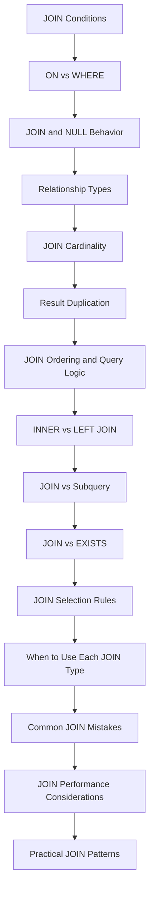

# README

## Overview

JOINs combine rows from related relations and are one of the primary tools for composing relational queries. In production backend systems, the difficult part is rarely the JOIN syntax itself; it is choosing the correct relationship, preserving the intended result cardinality, placing predicates correctly, and preventing unnecessary row multiplication.

This section focuses on practical JOIN usage from basic composition through production query design. The documents progress from JOIN conditions and NULL behavior to relationship cardinality, JOIN selection, performance, and common production patterns.

The central engineering question throughout this section is:

> **What should one output row represent?**

If the answer is "one customer," joining several one-to-many relationships without controlling cardinality can silently produce incorrect results. If the answer is "one customer-order relationship," those same rows may be exactly what the query requires.

## Navigation

- [01- JOIN Fundamentals](./01-%20JOIN%20Fundamentals.md) — What JOINs are and how they combine rows from related tables
- [02- How JOINs Work](./02-%20How%20JOINs%20Work.md) — Logical execution and row matching
- [03- INNER JOIN](./03-%20INNER%20JOIN.md) — Returning only matching rows from both tables
- [04- LEFT JOIN](./04-%20LEFT%20JOIN.md) — Preserving all rows from the left table
- [05- RIGHT JOIN](./05-%20RIGHT%20JOIN.md) — Preserving all rows from the right table
- [06- FULL OUTER JOIN](./06-%20FULL%20OUTER%20JOIN.md) — Preserving all rows from both tables
- [07- CROSS JOIN](./07-%20CROSS%20JOIN.md) — Cartesian product of two tables
- [08- SELF JOIN](./08-%20SELF%20JOIN.md) — Joining a table to itself
- [09- Multiple JOINs](./09-%20Multiple%20JOINs.md) — Composing queries across multiple related tables
- [10- JOIN Conditions](./10-%20JOIN%20Conditions.md) — How ON defines relationships between rows
- [11- ON vs WHERE in JOINs](./11-%20ON%20vs%20WHERE%20in%20JOINs.md) — Predicate placement and outer JOIN semantics
- [12- JOIN and NULL Behavior](./12-%20JOIN%20and%20NULL%20Behavior.md) — Three-valued logic and NULL-extended rows
- [13- One-to-One JOINs](./13-%20One-to-One%20JOINs.md) — Joining uniquely related records
- [14- One-to-Many JOINs](./14-%20One-to-Many%20JOINs.md) — Parent-child relationships and row multiplication
- [15- Many-to-Many JOINs](./15-%20Many-to-Many%20JOINs.md) — Association tables and relationship traversal
- [16- JOIN Cardinality](./16-%20JOIN%20Cardinality.md) — Predicting result size and relationship multiplication
- [17- JOIN Result Duplication](./17-%20JOIN%20Result%20Duplication.md) — Diagnosing and preventing unexpected duplicate rows
- [18- JOIN Ordering and Query Logic](./18-%20JOIN%20Ordering%20and%20Query%20Logic.md) — Logical query composition and dependency between relations
- [19- INNER vs LEFT JOIN](./19-%20INNER%20vs%20LEFT%20JOIN.md) — Choosing between mandatory and optional relationships
- [20- JOIN vs Subquery](./20-%20JOIN%20vs%20Subquery.md) — Choosing equivalent query shapes based on intent
- [21- JOIN vs EXISTS](./21-%20JOIN%20vs%20EXISTS.md) — Relationship retrieval versus existence checks
- [22- JOIN Selection Rules](./22-%20JOIN%20Selection%20Rules.md) — Practical rules for choosing JOIN strategies
- [23- When to Use Each JOIN Type](./23-%20When%20to%20Use%20Each%20JOIN%20Type.md) — Real-world use cases for JOIN variants
- [24- Common JOIN Mistakes](./24-%20Common%20JOIN%20Mistakes.md) — Production pitfalls and incorrect query patterns
- [25- JOIN Performance Considerations](./25-%20JOIN%20Performance%20Considerations.md) — Indexes, cardinality, execution plans, and query cost
- [26- Practical JOIN Patterns](./26-%20Practical%20JOIN%20Patterns.md) — Production-oriented JOIN query patterns

## Recommended Progression

The material is ordered so that each concept builds toward production-level JOIN reasoning.



### Foundation

Start with:

- [10- JOIN Conditions](./10-%20JOIN%20Conditions.md)
- [11- ON vs WHERE in JOINs](./11-%20ON%20vs%20WHERE%20in%20JOINs.md)
- [12- JOIN and NULL Behavior](./12-%20JOIN%20and%20NULL%20Behavior.md)

These establish how SQL determines whether rows match and how predicate placement affects results.

### Relationship and Cardinality

Continue with:

- [13- One-to-One JOINs](./13-%20One-to-One%20JOINs.md)
- [14- One-to-Many JOINs](./14-%20One-to-Many%20JOINs.md)
- [15- Many-to-Many JOINs](./15-%20Many-to-Many%20JOINs.md)
- [16- JOIN Cardinality](./16-%20JOIN%20Cardinality.md)
- [17- JOIN Result Duplication](./17-%20JOIN%20Result%20Duplication.md)

These topics establish the most important mental model for production JOINs: relationships determine how many rows can be produced.

### Query Composition and JOIN Selection

Then study:

- [18- JOIN Ordering and Query Logic](./18-%20JOIN%20Ordering%20and%20Query%20Logic.md)
- [19- INNER vs LEFT JOIN](./19-%20INNER%20vs%20LEFT%20JOIN.md)
- [20- JOIN vs Subquery](./20-%20JOIN%20vs%20Subquery.md)
- [21- JOIN vs EXISTS](./21-%20JOIN%20vs%20EXISTS.md)
- [22- JOIN Selection Rules](./22-%20JOIN%20Selection%20Rules.md)
- [23- When to Use Each JOIN Type](./23-%20When%20to%20Use%20Each%20JOIN%20Type.md)

The goal is to move from knowing JOIN syntax to selecting the query shape that best represents the business requirement.

### Production Engineering

Finish with:

- [24- Common JOIN Mistakes](./24-%20Common%20JOIN%20Mistakes.md)
- [25- JOIN Performance Considerations](./25-%20JOIN%20Performance%20Considerations.md)
- [26- Practical JOIN Patterns](./26-%20Practical%20JOIN%20Patterns.md)

These topics connect relational query composition to real backend concerns such as query performance, API pagination, ORM behavior, aggregation, and large datasets.

## Core Mental Model

A JOIN can be understood as a relationship expansion.

```text
Parent relation
     │
     │ JOIN condition
     ▼
Related relation
     │
     ▼
Expanded rowset
     │
     ├── filter
     ├── aggregate
     ├── rank
     └── project
```

For every JOIN, reason about four properties:

| Question | Why it matters |
|---|---|
| What relationship connects the tables? | Determines whether the JOIN condition is correct |
| What is the relationship cardinality? | Predicts row multiplication |
| What should one output row represent? | Defines the required result grain |
| Should unmatched rows survive? | Determines whether an outer JOIN is required |

A senior engineer should be able to predict the approximate result cardinality before executing the query.

## Common JOIN Types

| JOIN | Preserves unmatched left rows | Preserves unmatched right rows | Typical use |
|---|---:|---:|---|
| `INNER JOIN` | No | No | Require a matching relationship |
| `LEFT JOIN` | Yes | No | Optional child/related data |
| `RIGHT JOIN` | No | Yes | Less common; usually rewritten as `LEFT JOIN` |
| `FULL OUTER JOIN` | Yes | Yes | Compare or reconcile two datasets |
| `CROSS JOIN` | N/A | N/A | Cartesian combinations |
| Self JOIN | Depends on JOIN type | Depends on JOIN type | Hierarchies and row comparisons |

In most backend application queries, `INNER JOIN`, `LEFT JOIN`, and `EXISTS` cover a large portion of practical requirements.

## Result Grain

Always define the intended grain before adding JOINs.

Examples:

```text
One row per customer
```

```text
One row per order
```

```text
One row per customer-order relationship
```

```text
One row per product per category
```

The same tables can produce very different results depending on the selected grain.

For example:

```sql
SELECT
    c.id,
    o.id AS order_id
FROM customers AS c
JOIN orders AS o
    ON o.customer_id = c.id;
```

has a relationship-level grain:

```text
customer × order
```

Whereas:

```sql
SELECT
    c.id,
    COUNT(o.id) AS order_count
FROM customers AS c
LEFT JOIN orders AS o
    ON o.customer_id = c.id
GROUP BY c.id;
```

has a parent-level grain:

```text
customer
```

This distinction is more important than the JOIN keyword itself.

## JOINs and EXISTS

A useful production rule is:

> **Use a JOIN when you need related data; use `EXISTS` when you only need to know whether related data exists.**

For example:

```sql
SELECT
    c.id,
    c.email
FROM customers AS c
WHERE EXISTS (
    SELECT 1
    FROM orders AS o
    WHERE o.customer_id = c.id
);
```

This avoids producing one result row for every matching order when the application only needs customers with orders.

Similarly:

```sql
SELECT
    c.id,
    c.email
FROM customers AS c
WHERE NOT EXISTS (
    SELECT 1
    FROM orders AS o
    WHERE o.customer_id = c.id
);
```

is a clear anti-join for customers without orders.

## JOINs and Aggregation

Joining multiple one-to-many relationships can create multiplicative results.

For example:

```text
Customer
 ├── Orders
 └── Payments
```

If a customer has:

```text
10 orders
8 payments
```

a direct JOIN between both child relations can produce up to:

```text
10 × 8 = 80
```

intermediate combinations.

For parent-level reporting, aggregate independently first:

```text
Orders ──> aggregate per customer ──┐
                                    ├──> Customer
Payments ─> aggregate per customer ─┘
```

This pattern prevents accidental double counting and usually produces a more predictable execution plan.

## JOINs in Backend Applications

JOIN design directly affects application architecture.

### Django

For a single-valued relationship:

```python
orders = (
    Order.objects
    .select_related("customer")
    .filter(status="completed")
)
```

For collections:

```python
customers = (
    Customer.objects
    .filter(status="active")
    .prefetch_related("orders")
)
```

`select_related()` typically uses SQL JOINs for single-valued relationships, while `prefetch_related()` performs separate queries and combines the results in application memory.

The correct strategy depends on:

- Relationship cardinality.
- Number of related rows.
- Query shape.
- Result size.
- Serialization requirements.

### FastAPI

FastAPI itself does not determine JOIN strategy. The database access layer might use SQLAlchemy, SQLModel, asyncpg, psycopg, or another library.

The same relational principles still apply:

```text
HTTP request
    ↓
Application/service layer
    ↓
Repository/query layer
    ↓
SQL
    ↓
PostgreSQL
    ↓
Rows
    ↓
Serialization
    ↓
HTTP response
```

A query returning 100,000 duplicated rows can become an application performance problem even if the database query itself appears acceptable.

## Production Checklist

Before shipping a JOIN-heavy query, verify:

### Correctness

- Is the JOIN condition based on the actual relationship?
- Are aliases unambiguous?
- Is the intended result grain explicit?
- Are optional relationships using an appropriate outer JOIN?
- Are NULL values handled intentionally?
- Can multiple relationships multiply rows?

### Performance

- Are JOIN keys indexed where appropriate?
- Are selective filters applied effectively?
- Is the query transferring unnecessary columns?
- Is an existence check being implemented as a JOIN unnecessarily?
- Can high-cardinality relations be reduced before joining?
- Has the actual execution plan been inspected?

For PostgreSQL:

```sql
EXPLAIN (ANALYZE, BUFFERS)
SELECT
    ...
```

Do not optimize JOINs based solely on syntax. The optimizer may choose different physical strategies such as:

- Nested Loop.
- Hash Join.
- Merge Join.

The appropriate strategy depends on table statistics, indexes, cardinality, available memory, and predicate selectivity.

### Application Behavior

Check:

- ORM-generated SQL.
- N+1 query behavior.
- Serialization cost.
- Pagination semantics.
- Database connection usage.
- Memory consumed by large result sets.

A single SQL statement is not automatically better than two well-designed queries.

## Common Mistakes

| Mistake | Typical consequence | Better approach |
|---|---|---|
| Wrong JOIN condition | Incorrect rows | Join using the actual relationship |
| `INNER JOIN` for optional data | Missing parent rows | Use `LEFT JOIN` |
| Child predicate in `WHERE` after `LEFT JOIN` | Outer JOIN behaves like an inner filter | Put child qualification in `ON` when appropriate |
| `DISTINCT` used to hide duplicates | Extra work and hidden query bug | Fix relationship/cardinality logic |
| Multiple one-to-many JOINs | Row multiplication and double counting | Aggregate children independently |
| JOIN used only for existence | Unnecessary row generation | Use `EXISTS` |
| Missing foreign-key indexes | Expensive joins | Index according to workload |
| `SELECT *` across JOINs | Excessive I/O and network transfer | Select required columns |
| ORM relationship accessed repeatedly | N+1 queries | Use `select_related()` / `prefetch_related()` |
| Pagination applied after child expansion | Incorrect page size | Page the intended parent grain first |

## Security and Reliability

JOIN correctness can become a security concern in multi-tenant systems.

For tenant-scoped data, make the tenant boundary explicit and ensure relationships cannot accidentally cross tenants.

For example:

```sql
SELECT
    o.id
FROM orders AS o
JOIN customers AS c
    ON c.id = o.customer_id
WHERE o.tenant_id = :tenant_id
  AND c.tenant_id = :tenant_id;
```

The exact design depends on the schema and database constraints. Application-level predicates should not be the only protection for sensitive isolation requirements when stronger database-level controls are appropriate.

Use parameterized queries rather than constructing JOIN predicates or filters through string interpolation:

```python
cursor.execute(
    """
    SELECT o.id
    FROM orders AS o
    WHERE o.customer_id = %s
    """,
    [customer_id],
)
```

JOINs themselves are not a SQL injection vulnerability; dynamically constructing SQL around them is.

## Interview-Level Reasoning

When asked to design or debug a JOIN query, work through the problem in this order:

1. Identify the tables involved.
2. Identify the relationship between each pair.
3. Define the desired result grain.
4. Determine whether unmatched rows must survive.
5. Estimate cardinality after every JOIN.
6. Decide whether the requirement is retrieval, existence, aggregation, or comparison.
7. Add predicates in the correct logical location.
8. Check for row multiplication.
9. Validate indexes and the execution plan.
10. Verify the generated result against production-like cardinalities.

A strong answer explains **why** a JOIN is appropriate rather than simply providing valid SQL syntax.


## Key Takeaways

- **Define the result grain before writing JOINs; cardinality determines whether rows are preserved, multiplied, or collapsed.**
- **Choose JOINs, `EXISTS`, and aggregation based on whether the query needs related rows, relationship existence, or summarized data.**
- **Treat `ON` vs `WHERE`, NULL behavior, and outer JOIN semantics as correctness concerns, not merely syntax details.**
- **Prevent accidental row multiplication by understanding relationship cardinality and reducing high-cardinality relations before joining when necessary.**
- **Validate production JOINs using realistic data, indexes, ORM-generated SQL, execution plans, and application-level result size.**