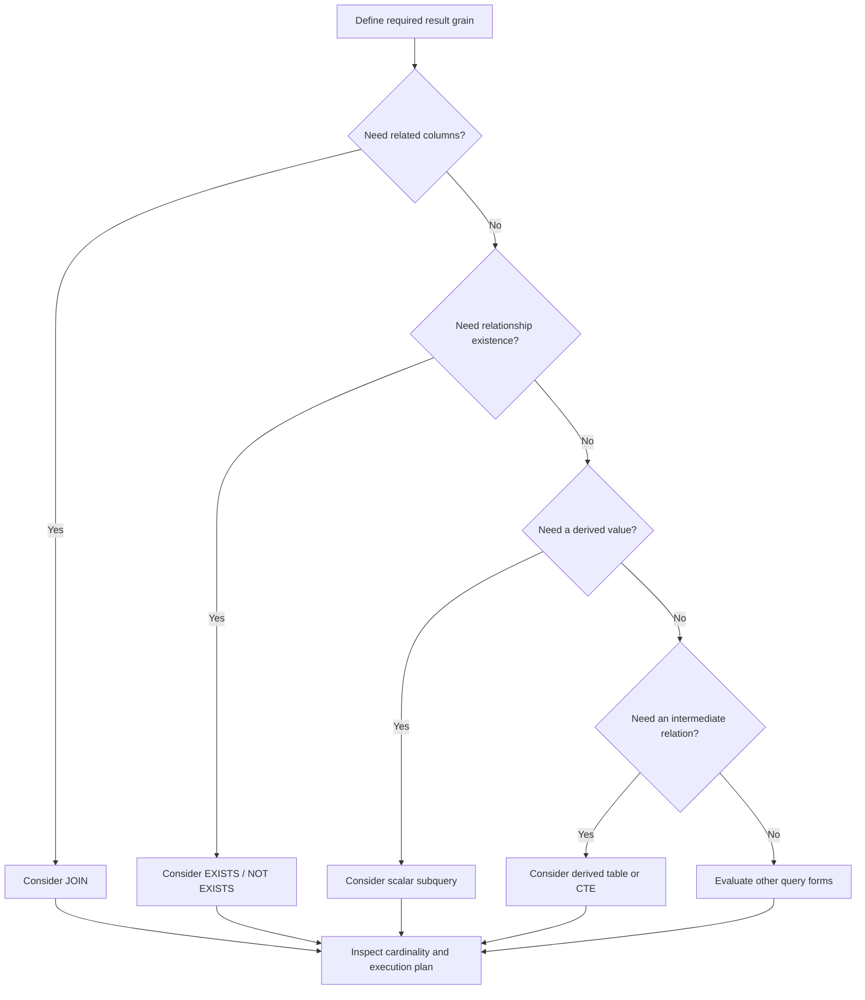

# 01- Subqueries Introduction

## Overview

A **subquery** is a SQL query nested inside another SQL statement. It allows one query to use the result of another query as an input for filtering, projection, comparison, aggregation, or further query composition.

Subqueries are useful when the business logic naturally has multiple query stages:

```text
Outer query
    │
    ├── filters rows
    ├── projects columns
    └── depends on
           │
           ▼
       Subquery
           │
           └── derives a value or rowset
```

For backend engineering, the important skill is not memorizing subquery syntax. It is recognizing when a subquery expresses the requirement more clearly than a JOIN, aggregation, window function, or `EXISTS`, and understanding how the database optimizer executes the resulting query.

Typical use cases include:

- Comparing a row against an aggregate.
- Filtering against a derived set of values.
- Checking whether related rows exist.
- Selecting a scalar value derived from another relation.
- Building an intermediate relation with a derived table.
- Expressing multi-stage business rules.
- Encapsulating complex query logic.

## Why Subqueries Exist

Relational queries often require intermediate results.

Consider a requirement:

> Find products whose price is above the average product price.

The average must be calculated before the product can be compared against it.

```sql
SELECT
    p.id,
    p.name,
    p.price
FROM products AS p
WHERE p.price > (
    SELECT AVG(price)
    FROM products
);
```

The inner query produces a single value:

```text
AVG(products.price)
```

The outer query then uses that value as part of its predicate.

The database may optimize this into an execution strategy that does not literally execute the subquery once for every outer row. SQL describes **what result is required**; the optimizer decides **how to produce it efficiently**.

## Subquery Locations

A subquery can appear in several parts of a SQL statement.

| Location | Typical purpose |
|---|---|
| `WHERE` | Filter rows using another query |
| `HAVING` | Filter groups using another query |
| `SELECT` | Produce a derived scalar value |
| `FROM` | Treat a query result as a relation |
| `JOIN` | Join against a derived relation |
| `INSERT` | Insert rows produced by another query |
| `UPDATE` | Update using values derived from another query |
| `DELETE` | Delete rows based on another query |

The most common backend query patterns are subqueries in `WHERE`, `FROM`, and `SELECT`.

## Basic Structure

A subquery is enclosed in parentheses:

```sql
SELECT ...
FROM ...
WHERE column = (
    SELECT ...
    FROM ...
);
```

The inner query must produce a result compatible with the context in which it is used.

For example, a scalar comparison requires one value:

```sql
SELECT
    id,
    email
FROM users
WHERE created_at > (
    SELECT MAX(created_at)
    FROM users
    WHERE status = 'inactive'
);
```

The subquery:

```sql
SELECT MAX(created_at)
FROM users
WHERE status = 'inactive'
```

returns one scalar value.

## Scalar Subqueries

A **scalar subquery** returns exactly one value.

It can be used anywhere an expression is valid.

```sql
SELECT
    p.id,
    p.name,
    p.price,
    (
        SELECT AVG(price)
        FROM products
    ) AS average_price
FROM products AS p;
```

The result might look like:

| id | name | price | average_price |
|---:|---|---:|---:|
| 1 | Keyboard | 80 | 120 |
| 2 | Monitor | 180 | 120 |
| 3 | Mouse | 100 | 120 |

### Cardinality Requirement

A scalar subquery must not return multiple rows.

This is valid:

```sql
SELECT (
    SELECT COUNT(*)
    FROM orders
);
```

This is invalid if multiple users exist:

```sql
SELECT (
    SELECT id
    FROM users
);
```

A database such as PostgreSQL raises an error when a scalar subquery returns more than one row.

If multiple values are logically expected, use a multi-row construct such as `IN`, `EXISTS`, or a relational JOIN instead.

## Single-Row Subqueries

A subquery can return one row containing one or more columns.

For example:

```sql
SELECT
    id,
    email,
    created_at
FROM users
WHERE (created_at, id) = (
    SELECT MAX(created_at), MAX(id)
    FROM users
);
```

The exact semantics depend on the database and query logic. For production code, make the uniqueness requirement explicit rather than relying on accidental single-row behavior.

A common pattern is to constrain the subquery:

```sql
SELECT
    id,
    email
FROM users
WHERE id = (
    SELECT id
    FROM users
    WHERE email = :email
    LIMIT 1
);
```

However, `LIMIT 1` should not be used merely to hide an integrity problem. If email is expected to be unique, enforce that with a database constraint.

## Multi-Row Subqueries

A multi-row subquery returns a set of values.

Use operators designed for sets.

### `IN`

```sql
SELECT
    id,
    email
FROM users
WHERE id IN (
    SELECT user_id
    FROM orders
    WHERE status = 'completed'
);
```

The inner query returns multiple `user_id` values, and the outer query selects users whose IDs belong to that set.

This expresses:

> Return users associated with at least one completed order.

When the requirement is only existence, `EXISTS` may express the intent more directly.

## `EXISTS`

`EXISTS` tests whether the subquery produces at least one row.

```sql
SELECT
    u.id,
    u.email
FROM users AS u
WHERE EXISTS (
    SELECT 1
    FROM orders AS o
    WHERE o.user_id = u.id
      AND o.status = 'completed'
);
```

The subquery is **correlated** because it references:

```sql
u.id
```

from the outer query.

Conceptually:

```text
users
  │
  ├── user 1 ──> does a matching order exist?
  ├── user 2 ──> does a matching order exist?
  └── user 3 ──> does a matching order exist?
```

The database optimizer may transform this into a semi-join or another efficient strategy.

`EXISTS` is particularly useful when the outer query should return each parent once regardless of how many matching child rows exist.

## `NOT EXISTS`

`NOT EXISTS` expresses absence:

```sql
SELECT
    u.id,
    u.email
FROM users AS u
WHERE NOT EXISTS (
    SELECT 1
    FROM orders AS o
    WHERE o.user_id = u.id
);
```

This finds users with no orders.

For relational queries, `NOT EXISTS` is often preferable to `NOT IN` when nullable values can be present because SQL's three-valued logic can make `NOT IN` produce surprising results.

## Correlated vs Uncorrelated Subqueries

The most important distinction is whether the subquery references columns from the outer query.

### Uncorrelated Subquery

An uncorrelated subquery is independent of the outer query.

```sql
SELECT
    p.id,
    p.name,
    p.price
FROM products AS p
WHERE p.price > (
    SELECT AVG(price)
    FROM products
);
```

The inner query does not reference `p`.

Conceptually:

```text
Subquery
   │
   ▼
Average price
   │
   ▼
Outer query
   │
   ▼
Products above average
```

### Correlated Subquery

A correlated subquery references the current outer row.

```sql
SELECT
    u.id,
    u.email
FROM users AS u
WHERE EXISTS (
    SELECT 1
    FROM orders AS o
    WHERE o.user_id = u.id
);
```

The relationship is expressed through:

```sql
o.user_id = u.id
```

Correlated subqueries are powerful because the inner query can evaluate a condition specific to each outer row.

## Correlated Subquery Execution

A common mental model is:

```text
Outer row
   │
   ▼
Evaluate correlated subquery
   │
   ▼
Return result
   │
   ▼
Next outer row
```

This is useful for understanding semantics, but it should **not** be interpreted as the literal physical execution plan.

Modern optimizers can transform correlated subqueries into:

- Semi-joins.
- Anti-joins.
- Hash-based strategies.
- Nested-loop strategies.
- Other equivalent execution plans.

Always inspect the actual execution plan before concluding that a correlated query is inherently slow.

For PostgreSQL:

```sql
EXPLAIN (ANALYZE, BUFFERS)
SELECT
    u.id,
    u.email
FROM users AS u
WHERE EXISTS (
    SELECT 1
    FROM orders AS o
    WHERE o.user_id = u.id
);
```

## Subqueries in the `FROM` Clause

A subquery in `FROM` produces a derived table.

```sql
SELECT
    customer_id,
    order_count
FROM (
    SELECT
        customer_id,
        COUNT(*) AS order_count
    FROM orders
    GROUP BY customer_id
) AS customer_orders;
```

The inner query creates an intermediate relation:

```text
orders
   │
   ▼
GROUP BY customer_id
   │
   ▼
customer_orders
   │
   ▼
outer query
```

The alias is required in PostgreSQL and is good practice across SQL dialects.

Derived tables are useful when a query naturally consists of stages.

## Derived Table for Aggregation

Consider an API endpoint that needs customers with at least five completed orders.

```sql
SELECT
    c.id,
    c.email,
    o.order_count
FROM customers AS c
JOIN (
    SELECT
        customer_id,
        COUNT(*) AS order_count
    FROM orders
    WHERE status = 'completed'
    GROUP BY customer_id
    HAVING COUNT(*) >= 5
) AS o
    ON o.customer_id = c.id;
```

The subquery first reduces the order dataset to one row per qualifying customer.

This can be clearer than joining all orders to customers and aggregating at the final level.

## Subqueries and CTEs

A common alternative to a derived table is a Common Table Expression:

```sql
WITH customer_orders AS (
    SELECT
        customer_id,
        COUNT(*) AS order_count
    FROM orders
    WHERE status = 'completed'
    GROUP BY customer_id
)
SELECT
    c.id,
    c.email,
    co.order_count
FROM customers AS c
JOIN customer_orders AS co
    ON co.customer_id = c.id
WHERE co.order_count >= 5;
```

A CTE can improve readability when a query has multiple logical stages.

However, do not assume a CTE is always faster or always materialized. CTE optimization behavior depends on the database engine and query characteristics.

The decision should primarily be based on:

- Correctness.
- Readability.
- Reusability within the statement.
- Optimizer behavior.
- Execution plan.

## Subquery vs JOIN

Many subqueries have equivalent JOIN formulations.

For example:

```sql
SELECT
    u.id,
    u.email
FROM users AS u
WHERE u.id IN (
    SELECT o.user_id
    FROM orders AS o
    WHERE o.status = 'completed'
);
```

can often be represented as:

```sql
SELECT DISTINCT
    u.id,
    u.email
FROM users AS u
JOIN orders AS o
    ON o.user_id = u.id
WHERE o.status = 'completed';
```

However, these are not interchangeable from a result-cardinality perspective.

The JOIN creates one row per matching order before `DISTINCT` removes duplicates. `EXISTS` directly expresses the existence requirement:

```sql
SELECT
    u.id,
    u.email
FROM users AS u
WHERE EXISTS (
    SELECT 1
    FROM orders AS o
    WHERE o.user_id = u.id
      AND o.status = 'completed'
);
```

The correct query shape should follow the intended result grain rather than a generic rule such as "JOINs are faster."

## Subqueries vs Window Functions

Some subqueries used for row comparisons can be replaced with window functions.

For example, finding products above the average price:

```sql
SELECT
    p.id,
    p.name,
    p.price
FROM products AS p
WHERE p.price > (
    SELECT AVG(price)
    FROM products
);
```

A window-function formulation can calculate the aggregate alongside each row:

```sql
SELECT
    id,
    name,
    price
FROM (
    SELECT
        id,
        name,
        price,
        AVG(price) OVER () AS average_price
    FROM products
) AS p
WHERE price > average_price;
```

Neither form is universally superior.

Use the formulation that best communicates the intended operation and produces an appropriate execution plan.

## Nested Subqueries

Subqueries can themselves contain subqueries:

```sql
SELECT
    u.id,
    u.email
FROM users AS u
WHERE u.id IN (
    SELECT o.user_id
    FROM orders AS o
    WHERE o.total_amount > (
        SELECT AVG(total_amount)
        FROM orders
    )
);
```

The logic is:

```text
Average order amount
        │
        ▼
Orders above average
        │
        ▼
Users who placed those orders
```

Deeply nested queries can become difficult to reason about. When nesting becomes excessive, consider:

- CTEs.
- JOINs.
- Window functions.
- Separate application-level query stages.
- Materialized reporting structures.

The objective is not to eliminate nesting but to keep query intent and performance understandable.

## NULL Semantics

Subqueries interact with SQL's three-valued logic.

For example:

```sql
SELECT
    id
FROM users
WHERE id NOT IN (
    SELECT user_id
    FROM orders
);
```

If `orders.user_id` contains `NULL`, the semantics of `NOT IN` can produce unexpected results because comparisons involving NULL can evaluate to `UNKNOWN`.

For anti-existence logic, prefer:

```sql
SELECT
    u.id
FROM users AS u
WHERE NOT EXISTS (
    SELECT 1
    FROM orders AS o
    WHERE o.user_id = u.id
);
```

This is generally clearer because the requirement is explicitly about the absence of a matching row.

## Production Performance

Subqueries are not inherently slow.

Performance depends on:

- Cardinality.
- Selectivity.
- Indexes.
- Correlation.
- Statistics.
- Join strategy.
- Aggregation cost.
- Data distribution.
- Database engine.
- Query plan.

For example, a correlated existence query can perform well with an appropriate index:

```sql
CREATE INDEX idx_orders_user_id_status
    ON orders (user_id, status);
```

The exact index should be based on the query workload and database engine rather than created mechanically for every subquery.

Inspect execution plans:

```sql
EXPLAIN (ANALYZE, BUFFERS)
SELECT
    u.id,
    u.email
FROM users AS u
WHERE EXISTS (
    SELECT 1
    FROM orders AS o
    WHERE o.user_id = u.id
      AND o.status = 'completed'
);
```

Look for:

- Unexpected sequential scans.
- Large row estimates versus actual rows.
- Excessive loops.
- Expensive sorts.
- Large intermediate rowsets.
- Excessive buffer reads.
- Poor selectivity.
- Repeated execution of expensive subplans.

## Indexing Considerations

Indexes should support the predicates used by the subquery.

For:

```sql
WHERE o.user_id = u.id
  AND o.status = 'completed'
```

a composite index may be appropriate:

```sql
CREATE INDEX idx_orders_user_status
    ON orders (user_id, status);
```

For PostgreSQL, a partial index can sometimes be more targeted:

```sql
CREATE INDEX idx_completed_orders_user
    ON orders (user_id)
    WHERE status = 'completed';
```

Partial indexes are useful when the predicate is stable and the filtered subset is significantly smaller than the entire table.

Index design should consider:

- Query frequency.
- Cardinality.
- Write overhead.
- Storage.
- Index maintenance.
- Actual execution plans.

## Application and ORM Considerations

Subqueries frequently appear in ORM-generated SQL.

In Django, for example:

```python
from django.db.models import Exists, OuterRef

completed_orders = Order.objects.filter(
    customer_id=OuterRef("pk"),
    status="completed",
)

customers = Customer.objects.annotate(
    has_completed_order=Exists(completed_orders),
).filter(
    has_completed_order=True,
)
```

This expresses existence directly rather than retrieving all matching orders.

Django also supports scalar subqueries:

```python
from django.db.models import OuterRef, Subquery

latest_order = (
    Order.objects
    .filter(customer_id=OuterRef("pk"))
    .order_by("-created_at")
    .values("created_at")[:1]
)

customers = Customer.objects.annotate(
    latest_order_at=Subquery(latest_order),
)
```

Inspect ORM-generated SQL when performance matters. High-level ORM code can hide:

- Correlated subqueries.
- JOINs.
- Additional queries.
- Unnecessary selected columns.
- Expensive annotations.

## API and Pagination Implications

Subqueries can be useful when the API response must preserve a specific result grain.

Suppose an endpoint returns:

```text
GET /customers?has_orders=true
```

The requirement is:

> Return each customer once if at least one order exists.

An `EXISTS` predicate naturally preserves customer-level grain:

```sql
SELECT
    c.id,
    c.email
FROM customers AS c
WHERE EXISTS (
    SELECT 1
    FROM orders AS o
    WHERE o.customer_id = c.id
);
```

This is often safer for pagination than joining all orders and attempting to deduplicate customers afterward.

A JOIN can multiply parent rows before `LIMIT` and `OFFSET` are applied, potentially producing incomplete or misleading pages.

## Security Considerations

Subqueries do not provide a security boundary.

Tenant or authorization predicates still need to be enforced explicitly.

For example:

```sql
SELECT
    o.id
FROM orders AS o
WHERE o.tenant_id = :tenant_id
  AND EXISTS (
      SELECT 1
      FROM customers AS c
      WHERE c.id = o.customer_id
        AND c.tenant_id = :tenant_id
  );
```

Use parameterized queries:

```python
cursor.execute(
    """
    SELECT id
    FROM orders
    WHERE tenant_id = %s
      AND customer_id = %s
    """,
    [tenant_id, customer_id],
)
```

Never construct SQL values through string interpolation.

For systems requiring strong tenant isolation, consider database-level controls such as PostgreSQL Row-Level Security in addition to application predicates.

## Common Mistakes

| Mistake | Problem | Better approach |
|---|---|---|
| Assuming every subquery runs once per outer row | Incorrect performance model | Inspect the execution plan |
| Using `IN` for existence-only logic | Can obscure intent and cardinality | Consider `EXISTS` |
| Using `NOT IN` with nullable values | NULL semantics can produce unexpected results | Prefer `NOT EXISTS` for anti-existence |
| Using `LIMIT 1` to hide duplicate data | Masks missing uniqueness constraints | Enforce uniqueness at the database level |
| Deeply nesting subqueries | Makes logic difficult to maintain | Consider CTEs or clearer relational composition |
| Replacing every JOIN with a subquery | Can make the query less readable or appropriate | Choose based on result grain and intent |
| Assuming JOIN is always faster | Optimizers can transform query forms | Compare actual plans |
| Ignoring indexes on correlated predicates | Can cause repeated expensive scans | Index based on workload |
| Returning unnecessary columns from subqueries | Increases processing and complexity | Select only required columns |
| Paginating after row multiplication | Can produce incorrect API pages | Preserve the intended parent grain |

## Debugging Workflow

When a subquery behaves unexpectedly:

1. Run the inner query independently.
2. Verify its cardinality.
3. Check whether it returns NULL.
4. Determine whether it is correlated.
5. Run the complete query with realistic data.
6. Compare the result against the intended grain.
7. Inspect the execution plan.
8. Check indexes on correlated predicates.
9. Compare equivalent `JOIN`, `EXISTS`, CTE, or window-function formulations when appropriate.
10. Validate performance under production-like cardinality.

A useful debugging technique is to temporarily expose the intermediate result:

```sql
SELECT
    o.user_id,
    COUNT(*) AS completed_order_count
FROM orders AS o
WHERE o.status = 'completed'
GROUP BY o.user_id;
```

Once the intermediate relation is understood, compose it into the final query.

## When to Use Subqueries

| Requirement | Good candidate |
|---|---|
| Compare against a single aggregate value | Scalar subquery |
| Filter against a set of values | `IN` / subquery |
| Test whether a related row exists | `EXISTS` |
| Test that no related row exists | `NOT EXISTS` |
| Build an intermediate relation | Derived table |
| Express multiple logical query stages | CTE |
| Calculate per-row aggregate/ranking information | Often a window function |
| Retrieve related columns from another relation | Often a JOIN |
| Complex reusable reporting transformation | CTE, derived relation, or dedicated reporting query |

These are guidelines, not optimizer rules. Equivalent SQL can produce different execution plans depending on the database engine and data distribution.

## Production Decision Framework

When deciding whether to use a subquery, ask:



The decision should be driven by semantics first and performance second:

1. Define what each output row represents.
2. Express the business rule clearly.
3. Choose the relational construct that matches that rule.
4. Verify cardinality.
5. Inspect the actual execution plan.
6. Benchmark with production-like data when the query is performance-sensitive.

## Key Takeaways

- **Subqueries compose SQL into logical stages and are useful for scalar values, derived relations, set membership, and existence checks.**
- **Distinguish correlated from uncorrelated subqueries; correlation affects semantics and can influence execution cost, but only the actual execution plan establishes performance.**
- **Use `EXISTS` and `NOT EXISTS` when the requirement is relationship existence or absence rather than retrieving related rows.**
- **Choose between subqueries, JOINs, CTEs, and window functions based on result grain, query intent, cardinality, and maintainability rather than simplistic performance rules.**
- **Validate production subqueries with realistic data, appropriate indexes, parameterized inputs, ORM-generated SQL, and `EXPLAIN (ANALYZE, BUFFERS)` where supported.**