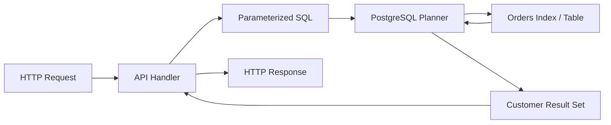

# 05- Multi-Row Subqueries

## Overview

A **multi-row subquery** is a subquery that can return zero, one, or many rows. It is used when the outer query needs to compare against or test membership in a **set of values** rather than a single value.

The most common operators for multi-row subqueries are:

- `IN`
- `NOT IN`
- `ANY` / `SOME`
- `ALL`
- `EXISTS`
- `NOT EXISTS`

The key engineering distinction is **cardinality**. A scalar or single-row subquery expects one result value or row; a multi-row subquery deliberately represents a set.

For example, find customers who have placed at least one order:

```sql
SELECT
    c.id,
    c.email
FROM customers AS c
WHERE c.id IN (
    SELECT o.customer_id
    FROM orders AS o
);
```

The subquery may return thousands of customer IDs. That is valid because `IN` is a set-membership operation.

## Why Multi-Row Subqueries Matter

Relational data naturally contains one-to-many relationships:

```text
Customer
   │
   ├── Order
   ├── Order
   └── Order
```

A query frequently needs to answer questions such as:

- Which customers have orders?
- Which products belong to selected categories?
- Which employees earn more than at least one employee in another group?
- Which accounts have no successful payments?
- Which users belong to any of several groups?

Multi-row subqueries allow these rules to be expressed directly in SQL without first retrieving intermediate results into application code.

This is particularly important in backend systems because moving intermediate sets from PostgreSQL into Python, Django, or another application layer can introduce unnecessary network traffic, memory consumption, and N+1 query patterns.

## Single-Row vs Multi-Row Subqueries

| Characteristic | Single-row | Multi-row |
|---|---|---|
| Result cardinality | At most one row | Zero or more rows |
| Typical operator | `=`, `>`, `<` | `IN`, `ANY`, `ALL`, `EXISTS` |
| Primary purpose | Compare against one value/row | Compare against a set |
| Duplicate rows | Usually invalid in scalar context | Valid |
| Typical use case | Reference employee salary | Customers with qualifying orders |

For example, this expects one value:

```sql
WHERE salary > (
    SELECT salary
    FROM employees
    WHERE id = 42
);
```

This intentionally accepts many values:

```sql
WHERE department_id IN (
    SELECT department_id
    FROM departments
    WHERE active = true
);
```

## `IN` with a Multi-Row Subquery

`IN` checks whether a value belongs to the set produced by the subquery.

```sql
SELECT
    p.id,
    p.name
FROM products AS p
WHERE p.category_id IN (
    SELECT c.id
    FROM categories AS c
    WHERE c.active = true
);
```

Conceptually:

```text
active categories
       │
       ▼
{10, 20, 30, 50}
       │
       ▼
product.category_id IN set
       │
       ▼
matching products
```

The subquery may return:

```text
10
20
30
50
```

and every product whose `category_id` is one of those values qualifies.

### Duplicates Do Not Change `IN` Membership

Suppose the subquery produces:

```text
10
10
20
20
20
30
```

For membership testing, duplicates do not change the logical result.

Therefore:

```sql
WHERE category_id IN (
    SELECT category_id
    FROM product_categories
);
```

does not normally require:

```sql
SELECT DISTINCT category_id
```

merely to make `IN` correct.

Adding unnecessary `DISTINCT` can introduce additional work. Whether it improves or worsens the plan depends on the optimizer and data distribution.

## `NOT IN`

`NOT IN` checks that a value is not present in the subquery result.

```sql
SELECT
    c.id,
    c.email
FROM customers AS c
WHERE c.id NOT IN (
    SELECT o.customer_id
    FROM orders AS o
);
```

The intended meaning is:

> Return customers whose ID does not occur in `orders`.

However, `NOT IN` has an important interaction with `NULL`.

## The `NOT IN` and `NULL` Trap

Suppose the subquery returns:

```text
10
20
NULL
```

Then:

```sql
WHERE customer_id NOT IN (
    SELECT customer_id
    FROM orders
);
```

does not behave like simple set subtraction.

SQL uses three-valued logic:

```text
TRUE
FALSE
UNKNOWN
```

The presence of `NULL` can cause comparisons to evaluate to `UNKNOWN`, preventing rows from qualifying.

This is one of the most important production and interview traps involving multi-row subqueries.

If the subquery column should never be `NULL`, a schema-level `NOT NULL` constraint is preferable.

If nullability is possible and the intended semantics are anti-existence, prefer `NOT EXISTS`:

```sql
SELECT
    c.id,
    c.email
FROM customers AS c
WHERE NOT EXISTS (
    SELECT 1
    FROM orders AS o
    WHERE o.customer_id = c.id
);
```

`NOT EXISTS` directly expresses:

> There is no matching order for this customer.

## `EXISTS`

`EXISTS` tests whether the subquery produces **at least one row**.

```sql
SELECT
    c.id,
    c.email
FROM customers AS c
WHERE EXISTS (
    SELECT 1
    FROM orders AS o
    WHERE o.customer_id = c.id
);
```

The actual selected value is irrelevant.

This is why:

```sql
SELECT 1
```

is conventional.

The database only needs to establish whether a qualifying row exists.

### Why `EXISTS` Is Often a Strong Choice

`EXISTS` naturally represents a relationship:

```text
customer
   │
   └── does at least one qualifying order exist?
```

The database may be able to stop searching after finding the first qualifying row.

This makes `EXISTS` particularly appropriate when:

- You do not need columns from the related rows.
- You only care whether a relationship exists.
- The relationship can contain many matching rows.
- You are implementing an anti-join with `NOT EXISTS`.

## Correlated Multi-Row Subqueries

A correlated subquery references a column from the outer query.

Example:

```sql
SELECT
    c.id,
    c.email
FROM customers AS c
WHERE EXISTS (
    SELECT 1
    FROM orders AS o
    WHERE o.customer_id = c.id
      AND o.status = 'paid'
);
```

The inner query depends on the current customer:

```text
Customer 101
    │
    └── search paid orders for customer 101

Customer 102
    │
    └── search paid orders for customer 102

Customer 103
    │
    └── search paid orders for customer 103
```

The logical model resembles a per-row lookup, but the optimizer may transform the query into a semi-join or another efficient execution strategy.

Do not assume that a correlated subquery necessarily means the database executes a complete inner query independently for every outer row.

## `ANY` / `SOME`

`ANY` compares a value against the set returned by a subquery.

For example:

```sql
SELECT
    e.id,
    e.name,
    e.salary
FROM employees AS e
WHERE e.salary > ANY (
    SELECT salary
    FROM employees
    WHERE department_id = 10
);
```

The condition is true when:

```text
e.salary > at least one salary in department 10
```

If the salaries are:

```text
50000
70000
90000
```

then:

```text
salary > ANY(...)
```

is effectively:

```text
salary > 50000
```

assuming the set is non-empty and contains no relevant `NULL` complications.

### `ANY` vs `IN`

For equality comparisons:

```sql
salary = ANY (
    SELECT salary
    FROM employees
    WHERE department_id = 10
);
```

is logically equivalent to:

```sql
salary IN (
    SELECT salary
    FROM employees
    WHERE department_id = 10
);
```

`ANY` becomes more useful when the comparison operator is something other than equality:

```sql
salary > ANY (...);
salary < ANY (...);
salary >= ANY (...);
```

`SOME` is a synonym for `ANY`.

## `ALL`

`ALL` requires the comparison to be true for every value returned by the subquery.

```sql
SELECT
    e.id,
    e.name,
    e.salary
FROM employees AS e
WHERE e.salary > ALL (
    SELECT salary
    FROM employees
    WHERE department_id = 10
);
```

This means:

> The employee's salary is greater than every salary in department 10.

For a non-empty set:

```text
salary > ALL(50000, 70000, 90000)
```

requires:

```text
salary > 90000
```

Conceptually:

```text
ANY → at least one comparison succeeds
ALL → every comparison succeeds
```

## `ANY` vs `ALL`

| Expression | Meaning |
|---|---|
| `x > ANY (set)` | `x` is greater than at least one value |
| `x > ALL (set)` | `x` is greater than every value |
| `x = ANY (set)` | `x` equals at least one value; equivalent to `IN` |
| `x <> ALL (set)` | `x` differs from every value; related to `NOT IN` but subject to `NULL` semantics |

For readability, use the construct that best expresses the business rule.

## Empty Subquery Results

Multi-row operators have defined behavior when the subquery returns zero rows.

For example:

```sql
WHERE id IN (
    SELECT id
    FROM archived_users
    WHERE archived_at IS NULL
);
```

If the subquery returns no rows, no outer row can be a member of the empty set.

By contrast, an `EXISTS` predicate over an empty result is false:

```sql
WHERE EXISTS (
    SELECT 1
    FROM archived_users
    WHERE ...
);
```

`ALL` has an important logical property: a universal comparison over an empty set is true.

For example:

```sql
x > ALL (empty_set)
```

evaluates as true.

This follows the semantics of universal quantification, but it can surprise engineers if the possibility of an empty set is not considered.

## Multi-Column Multi-Row Comparisons

Some databases, including PostgreSQL, support row-value comparisons against multiple rows.

For example:

```sql
SELECT
    p.id,
    p.name
FROM products AS p
WHERE (p.category_id, p.brand_id) IN (
    SELECT
        category_id,
        brand_id
    FROM featured_product_groups
);
```

The outer tuple must match one of the tuples produced by the subquery.

Conceptually:

```text
(category_id, brand_id)
        │
        ▼
{ (10, 3), (20, 5), (30, 2) }
        │
        ▼
membership test
```

This is useful when a relationship is defined by a composite key.

The tuple semantics and `NULL` behavior should be understood before using this pattern in critical queries.

## `EXISTS` vs `IN`

Both can express existence-related logic.

`IN`:

```sql
SELECT
    c.id,
    c.email
FROM customers AS c
WHERE c.id IN (
    SELECT o.customer_id
    FROM orders AS o
    WHERE o.status = 'paid'
);
```

`EXISTS`:

```sql
SELECT
    c.id,
    c.email
FROM customers AS c
WHERE EXISTS (
    SELECT 1
    FROM orders AS o
    WHERE o.customer_id = c.id
      AND o.status = 'paid'
);
```

They can be logically equivalent when the subquery and nullability semantics align.

The choice should primarily follow intent:

| Requirement | Preferred expression |
|---|---|
| Membership in a set of values | `IN` |
| At least one related row exists | `EXISTS` |
| No related row exists | `NOT EXISTS` |
| Compare against at least one value | `ANY` |
| Compare against every value | `ALL` |

Do not choose solely based on claims that one syntax is universally faster.

## `IN` vs `EXISTS` and Query Planning

Modern optimizers can transform these expressions into similar physical strategies.

For example, PostgreSQL may use:

- Hash semi joins.
- Nested-loop semi joins.
- Index scans.
- Bitmap scans.
- Other join or subquery transformations.

The physical plan matters more than the syntactic form.

Use:

```sql
EXPLAIN (ANALYZE, BUFFERS)
SELECT
    c.id,
    c.email
FROM customers AS c
WHERE EXISTS (
    SELECT 1
    FROM orders AS o
    WHERE o.customer_id = c.id
      AND o.status = 'paid'
);
```

Evaluate:

- Actual row counts.
- Loop counts.
- Scan types.
- Buffer hits and reads.
- Join strategy.
- Execution time.
- Cardinality estimation errors.

## Performance and Indexing

Consider:

```sql
SELECT
    c.id
FROM customers AS c
WHERE EXISTS (
    SELECT 1
    FROM orders AS o
    WHERE o.customer_id = c.id
      AND o.status = 'paid'
);
```

A useful index may be:

```sql
CREATE INDEX idx_orders_customer_status
    ON orders (customer_id, status);
```

The exact index depends on:

- Data distribution.
- Query frequency.
- Existing indexes.
- Write volume.
- Selectivity.
- PostgreSQL execution plans.

For a very large orders table, indexing the columns used by the correlated predicate can significantly reduce the work required to establish existence.

Do not blindly add indexes for every subquery. Indexes increase storage and write amplification.

## Avoid Pulling Intermediate Sets into Python

A common backend anti-pattern is:

```python
customer_ids = get_paid_customer_ids()

customers = Customer.objects.filter(
    id__in=customer_ids,
)
```

This can require:

1. Executing the first query.
2. Transferring all IDs to the application.
3. Storing them in Python memory.
4. Sending them back to PostgreSQL.
5. Executing the second query.

A database-side subquery keeps the operation inside PostgreSQL.

In Django:

```python
from django.db.models import Subquery

paid_customer_ids = Order.objects.filter(
    status="paid",
).values("customer_id")

customers = Customer.objects.filter(
    id__in=Subquery(paid_customer_ids),
)
```

For existence semantics, Django's `Exists` can be clearer:

```python
from django.db.models import Exists, OuterRef

paid_orders = Order.objects.filter(
    customer_id=OuterRef("pk"),
    status="paid",
)

customers = Customer.objects.annotate(
    has_paid_order=Exists(paid_orders),
).filter(
    has_paid_order=True,
)
```

This keeps filtering in the database and avoids transferring the intermediate set through the application.

## Multi-Row Subqueries in Backend Systems

Consider a REST endpoint:

```text
GET /customers?has_paid_order=true
```

The application should ideally send one set-oriented database query rather than loading all qualifying order IDs into application memory.

The data flow becomes:



This approach reduces application/database round trips and keeps relational filtering close to the data.

## Production Considerations

### Cardinality

Understand how many rows the subquery can produce.

A multi-row subquery is appropriate when many rows are expected. If the business rule actually requires one row, use a single-row expression and enforce uniqueness appropriately.

### Data Volume

A subquery returning millions of rows may still be valid SQL, but the execution strategy matters.

Inspect:

```sql
EXPLAIN (ANALYZE, BUFFERS)
```

against representative production-sized datasets.

### Nullability

Pay particular attention to:

- `NOT IN`.
- `ANY`.
- `ALL`.
- Row comparisons.

`NULL` can change logical outcomes.

### Transactions

If the subquery participates in a workflow that depends on concurrently changing data, transaction isolation and locking may matter.

For example, a query that checks whether qualifying rows exist before performing an update can race with another transaction unless the overall operation is designed appropriately.

Do not confuse:

```sql
SELECT ... WHERE EXISTS (...)
```

with a concurrency guarantee.

If the application requires an invariant, enforce it using appropriate constraints, transactions, locking, or database primitives.

### Monitoring

For frequently executed multi-row queries, monitor:

- p95/p99 latency.
- Execution count.
- Rows examined.
- Buffer reads.
- CPU consumption.
- Lock waits.
- Temporary file usage where relevant.
- Query-plan regressions.

A query that is fast with 10,000 orders can behave very differently with 500 million orders.

## Security Considerations

Use parameterized queries when external values influence the query.

Bad:

```python
query = f"""
SELECT id
FROM customers
WHERE region = '{region}'
"""
```

Prefer parameter binding:

```python
query = """
SELECT id
FROM customers
WHERE region = %s
"""

cursor.execute(query, [region])
```

For APIs, also enforce authorization independently of the SQL predicate.

For multi-tenant systems, make tenant isolation explicit:

```sql
SELECT
    c.id
FROM customers AS c
WHERE c.tenant_id = :tenant_id
  AND EXISTS (
      SELECT 1
      FROM orders AS o
      WHERE o.customer_id = c.id
        AND o.tenant_id = :tenant_id
        AND o.status = 'paid'
  );
```

Do not assume that filtering only the outer table automatically makes every related lookup safe.

## Common Mistakes

| Mistake | Problem | Better approach |
|---|---|---|
| Using `NOT IN` against nullable data | `NULL` can produce unexpected `UNKNOWN` results | Prefer `NOT EXISTS` when expressing anti-existence |
| Loading subquery results into Python | Extra network traffic and memory usage | Keep filtering inside SQL |
| Using `IN` when only existence matters | Can obscure the intended relationship | Consider `EXISTS` |
| Assuming `EXISTS` returns the matching rows | `EXISTS` only returns a boolean condition | Use a JOIN/subquery when values are needed |
| Assuming correlated means automatically slow | Optimizers can transform correlated queries | Inspect the execution plan |
| Adding unnecessary `DISTINCT` | Can add sorting or hashing work | Remove it unless semantics require uniqueness |
| Ignoring empty-set behavior | `ALL` and other operators have specific logical semantics | Test empty-result cases |
| Ignoring nullable comparison values | SQL uses three-valued logic | Define null semantics explicitly |
| Creating indexes blindly | Increases storage and write cost | Validate with workload and `EXPLAIN` |
| Assuming `IN` is always slower than `EXISTS` | Syntax does not determine physical execution | Compare actual plans |

## Interview Traps

### Can a multi-row subquery return one row?

Yes. "Multi-row" means the query is allowed to return multiple rows. It can return zero or one row as well.

### What happens when an `IN` subquery returns duplicates?

Membership semantics are unchanged. Duplicate values do not cause duplicate outer rows merely because the subquery contains duplicates.

### Why is `NOT IN` dangerous with `NULL`?

Because SQL uses three-valued logic. A comparison involving `NULL` can become `UNKNOWN`, causing the overall predicate to fail to match rows that an engineer may expect to qualify.

### `IN` or `EXISTS` — which is faster?

Neither is universally faster. The optimizer, indexes, cardinality, data distribution, and workload determine the physical execution strategy.

### When should `EXISTS` be preferred?

When the requirement is existence rather than retrieving or comparing the actual set of values.

### What is the difference between `ANY` and `ALL`?

`ANY` requires the comparison to succeed for at least one value; `ALL` requires it to succeed for every value.

### Is `x = ANY(subquery)` equivalent to `x IN(subquery)`?

For ordinary equality semantics, yes. `IN` is generally the clearer expression for membership.

### Why can application-level `IN` lists become problematic?

Fetching thousands or millions of IDs into application memory creates additional network traffic, memory pressure, query construction complexity, and potentially oversized SQL parameters. A database-side subquery often avoids this data movement.

## Practical Selection Rules

Use this decision table when designing a query:

| Question | SQL construct |
|---|---|
| Does this value belong to a set? | `IN` |
| Does at least one related row exist? | `EXISTS` |
| Does no related row exist? | `NOT EXISTS` |
| Is this value greater/less than at least one value? | `ANY` |
| Must this comparison hold for every value? | `ALL` |
| Is the subquery guaranteed to return one value? | Scalar subquery |
| Is a related row needed in the result? | Consider `JOIN` |

The important distinction is not merely syntax. Choose based on the **cardinality and business semantics** of the relationship.

## Key Takeaways

- **Multi-row subqueries represent sets and are commonly consumed through `IN`, `EXISTS`, `ANY`, and `ALL`.**
- **Prefer `EXISTS` and `NOT EXISTS` when the business rule is about relationship existence rather than membership in a value set.**
- **Treat `NOT IN` with nullable subquery columns as a major SQL correctness hazard; `NOT EXISTS` is often the safer anti-existence expression.**
- **Keep large intermediate sets inside the database instead of transferring them into Python or another application layer.**
- **Query performance depends on the optimizer, indexes, cardinality, and workload; validate important multi-row queries with execution plans.**