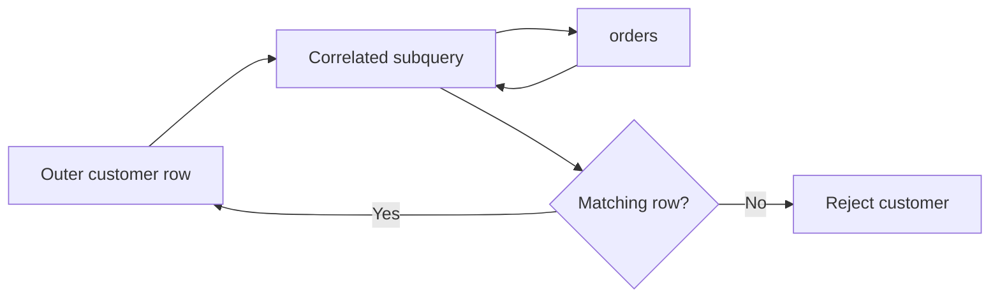

# 08- Subqueries in WHERE

## Overview

A subquery in the `WHERE` clause lets a query use the result of another query as part of its filtering logic. It is useful when the rows that should be returned depend on information that must first be derived from another relation.

Common forms include:

- **Scalar subqueries** that return one value.
- **Single-row subqueries** used with comparison operators.
- **Multi-row subqueries** used with `IN`, `ANY`, or `ALL`.
- **Correlated subqueries** that depend on the current outer row.
- **`EXISTS` / `NOT EXISTS`** predicates that test whether matching rows exist.

Typical production use cases include:

- Filtering entities against aggregate thresholds.
- Selecting customers who have qualifying orders.
- Excluding entities with related records.
- Comparing a row against a derived value.
- Expressing existence rules without creating unnecessary JOIN result rows.

The key question is not simply whether a subquery works, but whether the predicate expresses the intended **cardinality, NULL behavior, and performance characteristics**.

## Basic Syntax

A `WHERE` subquery is enclosed in parentheses:

```sql
SELECT
    id,
    email
FROM customers
WHERE id IN (
    SELECT customer_id
    FROM orders
    WHERE status = 'paid'
);
```

Conceptually:

```text
Outer query
    │
    │ filtering predicate
    ▼
Subquery result
    │
    ├── scalar value
    ├── set of values
    └── existence condition
```

The exact operator determines what kind of result the subquery must produce.

| Predicate | Expected subquery result | Typical use |
|---|---|---|
| `=` | One value | Compare against one derived value |
| `>`, `<`, `>=`, `<=` | One value | Threshold comparison |
| `IN` | Multiple values | Membership |
| `EXISTS` | Any matching row | Existence |
| `NOT EXISTS` | Any matching row | Non-existence |
| `ANY` / `SOME` | Multiple values | Compare against at least one value |
| `ALL` | Multiple values | Compare against every value |

## Scalar Subquery in `WHERE`

A scalar subquery returns a single value.

For example, find products more expensive than the average product price:

```sql
SELECT
    id,
    name,
    price
FROM products
WHERE price > (
    SELECT AVG(price)
    FROM products
);
```

The inner query produces one value:

```text
AVG(price)
```

The outer query compares each product against that value.

### Why Use It

This pattern is useful when the filtering threshold is itself derived from database data.

Examples:

- Orders above average order value.
- Employees above department salary average.
- Products above a category-level threshold.
- Accounts whose balance exceeds a calculated limit.

### Cardinality Requirement

A scalar subquery must produce at most one row.

This is valid:

```sql
SELECT AVG(price)
FROM products;
```

This is not valid as a scalar expression if multiple rows are returned:

```sql
SELECT price
FROM products;
```

For example:

```sql
SELECT
    id
FROM products
WHERE price > (
    SELECT price
    FROM products
);
```

If the inner query returns multiple rows, the database reports a cardinality error.

## Single-Row Comparison

A subquery can be used with comparison operators when the result is guaranteed to be a single row.

```sql
SELECT
    id,
    salary
FROM employees
WHERE salary > (
    SELECT salary
    FROM employees
    WHERE id = 1001
);
```

The application is effectively asking:

> Return employees whose salary exceeds employee `1001`'s salary.

The subquery must identify one employee.

A production-safe schema should enforce that uniqueness rather than relying only on application assumptions.

For example, a primary key guarantees:

```sql
WHERE id = 1001
```

returns at most one row.

## Multi-Row Subquery with `IN`

`IN` is appropriate when the subquery returns a set of values.

```sql
SELECT
    id,
    email
FROM customers
WHERE id IN (
    SELECT customer_id
    FROM orders
    WHERE status = 'paid'
);
```

The inner query produces:

```text
101
104
107
```

The outer query returns customers whose IDs belong to that set.

This is conceptually similar to:

```text
customer.id ∈ qualifying_customer_ids
```

### When to Use

Use `IN` when the business requirement is naturally expressed as **membership in a set**.

Typical examples:

```sql
WHERE customer_id IN (...)
```

```sql
WHERE product_id IN (...)
```

```sql
WHERE region_id IN (...)
```

## `IN` vs `EXISTS`

These queries can express similar business rules:

```sql
SELECT
    c.id,
    c.email
FROM customers AS c
WHERE c.id IN (
    SELECT o.customer_id
    FROM orders AS o
    WHERE o.status = 'paid'
);
```

and:

```sql
SELECT
    c.id,
    c.email
FROM customers AS c
WHERE EXISTS (
    SELECT 1
    FROM orders AS o
    WHERE o.customer_id = c.id
      AND o.status = 'paid'
);
```

The semantics are slightly different.

| Requirement | Natural choice |
|---|---|
| Match against a set of values | `IN` |
| Test whether a related row exists | `EXISTS` |
| Need columns from the related table | Usually JOIN |
| Avoid duplicate outer rows from existence testing | `EXISTS` |
| Correlate directly with the outer row | `EXISTS` is often natural |

Do not select `IN` or `EXISTS` based on simplistic rules such as "`EXISTS` is always faster." Modern optimizers can transform both into similar execution strategies.

Use the predicate that most clearly represents the intended relationship, then verify performance with an execution plan.

## `EXISTS`

`EXISTS` tests whether the subquery returns at least one row.

```sql
SELECT
    c.id,
    c.email
FROM customers AS c
WHERE EXISTS (
    SELECT 1
    FROM orders AS o
    WHERE o.customer_id = c.id
      AND o.status = 'paid'
);
```

The selected expression inside `EXISTS` does not matter:

```sql
SELECT 1
```

is conventional.

The database only needs to determine whether a qualifying row exists.

### Why `EXISTS` Is Powerful

Suppose a customer has 100 qualifying orders.

With an existence requirement, the application only needs:

```text
Does at least one qualifying order exist?
```

It does not need all 100 rows.

Conceptually, an execution strategy may stop looking for additional matches after finding one qualifying row, although the optimizer and execution plan determine the actual implementation.

### Avoiding Duplicate Outer Rows

A JOIN can produce multiple rows:

```sql
SELECT
    c.id,
    c.email
FROM customers AS c
JOIN orders AS o
    ON o.customer_id = c.id
WHERE o.status = 'paid';
```

A customer with five paid orders can appear five times.

If the requirement is only:

> Return customers who have at least one paid order.

then `EXISTS` expresses the requirement more directly:

```sql
SELECT
    c.id,
    c.email
FROM customers AS c
WHERE EXISTS (
    SELECT 1
    FROM orders AS o
    WHERE o.customer_id = c.id
      AND o.status = 'paid'
);
```

No `DISTINCT` is required merely to undo the JOIN's multiplicity.

## `NOT EXISTS`

`NOT EXISTS` is useful for anti-join logic:

```sql
SELECT
    c.id,
    c.email
FROM customers AS c
WHERE NOT EXISTS (
    SELECT 1
    FROM orders AS o
    WHERE o.customer_id = c.id
      AND o.status = 'paid'
);
```

This returns customers for whom no paid order exists.

Typical backend use cases include:

- Users who have never placed an order.
- Accounts without a successful payment.
- Products without inventory.
- Records missing a required relationship.
- Tenants without an active subscription.

### `NOT EXISTS` vs `NOT IN`

These are **not always equivalent** when `NULL` is involved.

Consider:

```sql
WHERE customer_id NOT IN (
    SELECT customer_id
    FROM orders
);
```

If the subquery contains `NULL`, SQL's three-valued logic can cause rows to evaluate to `UNKNOWN` rather than `TRUE`.

`NOT EXISTS` avoids this particular `NULL` trap:

```sql
WHERE NOT EXISTS (
    SELECT 1
    FROM orders AS o
    WHERE o.customer_id = c.id
);
```

For correlated exclusion logic, `NOT EXISTS` is often the safer expression.

## Correlated Subqueries

A correlated subquery references a column from the outer query.

Example:

```sql
SELECT
    c.id,
    c.email
FROM customers AS c
WHERE EXISTS (
    SELECT 1
    FROM orders AS o
    WHERE o.customer_id = c.id
      AND o.status = 'paid'
);
```

The subquery references:

```sql
c.id
```

from the outer query.

This creates a logical dependency:



A common mental model is:

```text
for each customer:
    evaluate whether a qualifying order exists
```

However, this does **not** mean the database must literally execute the subquery once per outer row. Optimizers can transform correlated subqueries into joins, semi-joins, or other efficient strategies.

## Correlated Scalar Subquery

Correlated subqueries can also calculate a value for each outer row.

For example, find customers whose total paid revenue exceeds `10,000`:

```sql
SELECT
    c.id,
    c.email
FROM customers AS c
WHERE (
    SELECT COALESCE(SUM(o.total_amount), 0)
    FROM orders AS o
    WHERE o.customer_id = c.id
      AND o.status = 'paid'
) > 10000;
```

The aggregate guarantees one result row for each customer, even when no orders match.

This is concise, but it is not automatically the best-performing formulation for large datasets.

An aggregated derived table may be clearer:

```sql
SELECT
    c.id,
    c.email
FROM customers AS c
JOIN (
    SELECT
        customer_id,
        SUM(total_amount) AS total_revenue
    FROM orders
    WHERE status = 'paid'
    GROUP BY customer_id
) AS r
    ON r.customer_id = c.id
WHERE r.total_revenue > 10000;
```

Benchmark both forms against the actual workload.

## `ANY` / `SOME`

`ANY` compares a value against at least one value returned by a subquery.

For example:

```sql
SELECT
    id,
    price
FROM products
WHERE price > ANY (
    SELECT price
    FROM products
    WHERE category_id = 10
);
```

The condition is true if the product price is greater than at least one price in category `10`.

`SOME` is a synonym for `ANY` in SQL dialects that support it.

These operators are less common in everyday application SQL than `IN` and `EXISTS`, but they are useful for expressing quantified comparisons.

## `ALL`

`ALL` requires the comparison to hold against every value returned by the subquery.

For example:

```sql
SELECT
    id,
    price
FROM products
WHERE price > ALL (
    SELECT price
    FROM products
    WHERE category_id = 10
);
```

This asks:

> Is this product more expensive than every product in category `10`?

Conceptually, this is related to comparison against the maximum value.

For a non-empty set:

```sql
price > ALL (subquery)
```

is equivalent in spirit to:

```sql
price > MAX(subquery)
```

but the exact `NULL` and empty-set semantics must be considered before rewriting.

## Empty Subquery Results

Subquery behavior depends on the predicate.

For example:

```sql
WHERE id IN (
    SELECT customer_id
    FROM orders
    WHERE status = 'paid'
);
```

If the subquery returns zero rows, no outer row can satisfy the `IN` condition.

For:

```sql
WHERE EXISTS (
    SELECT 1
    FROM orders
    WHERE ...
);
```

an empty result means:

```text
EXISTS = FALSE
```

For:

```sql
WHERE NOT EXISTS (
    SELECT 1
    FROM orders
    WHERE ...
);
```

an empty result means:

```text
NOT EXISTS = TRUE
```

This makes `NOT EXISTS` particularly useful for finding records without relationships.

## `NULL` Semantics

SQL predicates use three-valued logic:

```text
TRUE
FALSE
UNKNOWN
```

This matters heavily with subqueries.

For example:

```sql
WHERE customer_id NOT IN (
    SELECT customer_id
    FROM orders
);
```

If the subquery returns:

```text
101
102
NULL
```

the comparison can become `UNKNOWN` for candidate values that do not match the known IDs.

Because `WHERE` only keeps rows where the predicate evaluates to `TRUE`, those rows may be unexpectedly excluded.

When expressing absence of a related record, prefer:

```sql
WHERE NOT EXISTS (
    SELECT 1
    FROM orders AS o
    WHERE o.customer_id = c.id
);
```

This is one of the most important production-level differences between `NOT IN` and `NOT EXISTS`.

## Subquery Evaluation and Query Plans

A common misconception is:

> The database always executes the subquery first, stores its result, then executes the outer query.

That is a useful logical model, but not necessarily the physical execution strategy.

The optimizer may transform:

```sql
SELECT
    c.id
FROM customers AS c
WHERE EXISTS (
    SELECT 1
    FROM orders AS o
    WHERE o.customer_id = c.id
);
```

into a semi-join-like execution strategy.

Similarly, an `IN` subquery may be transformed into:

- A hash-based membership test.
- A semi-join.
- An indexed lookup.
- Another optimizer-specific strategy.

The execution plan is therefore more important than assumptions based solely on SQL syntax.

For PostgreSQL:

```sql
EXPLAIN (ANALYZE, BUFFERS)
SELECT
    c.id
FROM customers AS c
WHERE EXISTS (
    SELECT 1
    FROM orders AS o
    WHERE o.customer_id = c.id
      AND o.status = 'paid'
);
```

Inspect:

- Actual row counts.
- Estimated row counts.
- Index scans.
- Sequential scans.
- Join or semi-join strategy.
- Buffer reads.
- Execution time.
- Rows removed by filters.

## Indexing Correlated Subqueries

Correlated existence checks frequently benefit from indexes on the correlated lookup columns.

For:

```sql
WHERE EXISTS (
    SELECT 1
    FROM orders AS o
    WHERE o.customer_id = c.id
      AND o.status = 'paid'
);
```

an index beginning with `customer_id` may be useful:

```sql
CREATE INDEX idx_orders_customer_id
ON orders (customer_id);
```

If the workload frequently filters by both columns, a composite index may be more appropriate:

```sql
CREATE INDEX idx_orders_customer_status
ON orders (customer_id, status);
```

Index design must reflect:

- Selectivity.
- Query frequency.
- Data distribution.
- Write overhead.
- Existing indexes.
- The database's optimizer behavior.

Do not add indexes merely because a column appears in a subquery.

## `WHERE` Subquery vs JOIN

Consider:

```sql
SELECT
    c.id,
    c.email
FROM customers AS c
WHERE EXISTS (
    SELECT 1
    FROM orders AS o
    WHERE o.customer_id = c.id
      AND o.status = 'paid'
);
```

A JOIN-based equivalent might be:

```sql
SELECT DISTINCT
    c.id,
    c.email
FROM customers AS c
JOIN orders AS o
    ON o.customer_id = c.id
WHERE o.status = 'paid';
```

Both can produce the same customer set.

But the intent differs:

- `EXISTS` says **a related row must exist**.
- `JOIN` says **combine rows from two relations**.

If you only need to test existence, `EXISTS` generally communicates the requirement better and avoids introducing duplicate outer rows.

If you need columns from `orders`, a JOIN is usually more appropriate.

## Subqueries and Aggregation

Subqueries are useful when an aggregate determines whether an outer row qualifies.

Example:

```sql
SELECT
    p.id,
    p.name,
    p.price
FROM products AS p
WHERE p.price > (
    SELECT AVG(p2.price)
    FROM products AS p2
    WHERE p2.category_id = p.category_id
);
```

This is a correlated scalar subquery.

It means:

> Return products whose price is above the average price of their own category.

The important relationship is:

```text
outer product
    │
    └── category_id
           │
           ▼
      category average
           │
           ▼
      compare price
```

For large datasets, a window-function formulation can sometimes be preferable:

```sql
SELECT
    id,
    name,
    category_id,
    price
FROM (
    SELECT
        id,
        name,
        category_id,
        price,
        AVG(price) OVER (
            PARTITION BY category_id
        ) AS category_avg_price
    FROM products
) AS p
WHERE price > category_avg_price;
```

The right formulation depends on readability, optimizer behavior, and workload.

## Security Considerations

Subqueries do not change the requirement to use parameterized SQL.

Prefer:

```sql
SELECT
    id,
    email
FROM customers
WHERE id IN (
    SELECT customer_id
    FROM orders
    WHERE status = :status
);
```

with parameters supplied separately.

Do not construct SQL using user-controlled string interpolation:

```python
# Unsafe pattern — do not use.
query = f"""
    SELECT id
    FROM customers
    WHERE id IN (
        SELECT customer_id
        FROM orders
        WHERE status = '{status}'
    )
"""
```

Use the parameterization mechanism provided by your database driver or framework.

Subqueries are also important in multi-tenant authorization. Tenant constraints must be applied consistently to the relevant relations:

```sql
SELECT
    c.id,
    c.email
FROM customers AS c
WHERE c.tenant_id = :tenant_id
  AND EXISTS (
      SELECT 1
      FROM orders AS o
      WHERE o.customer_id = c.id
        AND o.tenant_id = :tenant_id
        AND o.status = 'paid'
  );
```

The exact authorization model depends on the schema. The critical requirement is that a subquery must not accidentally widen the data scope beyond the tenant or authorization boundary.

## Production Performance Considerations

For every production subquery, consider:

### Cardinality

Ask:

```text
How many rows can the subquery return?
Can it return zero rows?
Can it return NULL?
Can it return duplicates?
Is the result guaranteed to be unique?
```

### Correlation

Ask:

```text
Does the subquery reference the outer query?
Can the optimizer decorrelate it?
Are the correlated columns indexed?
```

### Selectivity

A predicate that eliminates most rows can significantly reduce downstream work.

For example:

```sql
WHERE EXISTS (
    SELECT 1
    FROM orders AS o
    WHERE o.customer_id = c.id
      AND o.status = 'paid'
);
```

The usefulness of an index depends on the actual distribution of `status` and `customer_id`.

### Data Growth

A query that works on thousands of rows can degrade substantially when:

- Customers grow from thousands to millions.
- Orders grow from millions to billions.
- Tenant sizes become highly uneven.
- Data becomes less selective.
- Statistics become stale.

Always benchmark representative production-scale data.

## Common Mistakes

| Mistake | Why it happens | Better approach |
|---|---|---|
| Using `=` with a multi-row subquery | Result cardinality is misunderstood | Use `IN`, `ANY`, `ALL`, or another appropriate predicate |
| Using `NOT IN` with nullable values | SQL three-valued logic is overlooked | Prefer `NOT EXISTS` for anti-join logic |
| Using JOIN for an existence check | JOIN is familiar | Use `EXISTS` when related columns are not needed |
| Assuming correlated means "executed once per row" | Logical and physical execution are confused | Inspect the execution plan |
| Assuming `EXISTS` is always faster | Simplistic optimization rule | Compare plans and benchmark |
| Ignoring duplicate subquery results | Set semantics are misunderstood | Verify uniqueness or choose an appropriate predicate |
| Forgetting empty-set behavior | Predicate semantics are overlooked | Test zero-row cases |
| Filtering at the wrong level | Query stages are misunderstood | Determine whether the condition applies to outer or inner rows |
| Fetching related data into Python for filtering | Application/database responsibilities are mixed | Push relational filtering into SQL |
| Ignoring tenant predicates | Authorization boundaries are overlooked | Apply scope constraints consistently |

## Interview Traps

### Does a subquery always execute before the outer query?

No. That is a logical model, not a guarantee of physical execution. The optimizer can transform the query.

### Is `EXISTS` always faster than `IN`?

No. Modern optimizers can produce equivalent or similar execution strategies. Choose based on semantics and verify with `EXPLAIN`.

### Why is `NOT IN` dangerous with `NULL`?

Because SQL uses three-valued logic. A `NULL` in the subquery can cause comparisons to evaluate to `UNKNOWN`.

### When should you use `EXISTS` instead of a JOIN?

When the requirement is only to determine whether a related row exists and no columns from the related relation are needed.

### What is a correlated subquery?

A subquery that references columns from the outer query.

### Can a correlated subquery be optimized?

Yes. The optimizer may transform it into a join-like or semi-join execution strategy rather than literally executing it independently for every outer row.

### What is the most important production concern?

Understand the **cardinality, NULL behavior, correlation, indexing, and actual execution plan** rather than reasoning from syntax alone.

## Key Takeaways

- **`WHERE` subqueries let filtering depend on scalar values, sets, aggregates, or related-row existence derived from other queries.**
- **Use `EXISTS` and `NOT EXISTS` for existence and anti-existence logic, especially when JOIN multiplicity or `NULL` behavior makes `IN`/`NOT IN` risky.**
- **Always understand subquery cardinality: `=`, `>`, and similar operators generally require a single value, while `IN`, `ANY`, and `ALL` support multi-row results.**
- **Correlated subqueries are logical dependencies, not guarantees of per-row physical execution; use execution plans to understand their actual performance.**
- **Production-quality subqueries require deliberate handling of indexes, NULLs, empty results, tenant boundaries, cardinality, and data growth.**