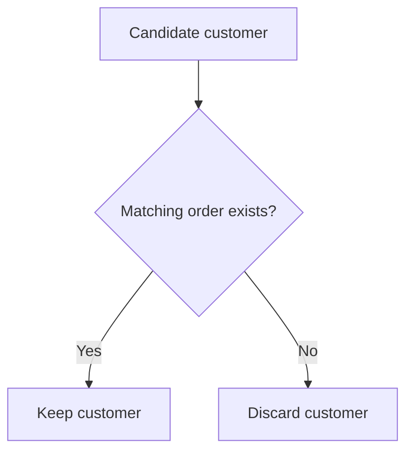
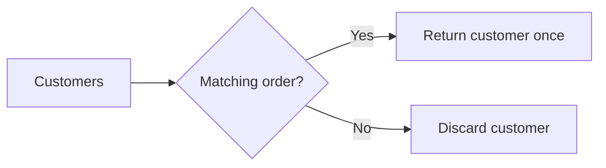

# 12- EXISTS

## Overview

`EXISTS` is a SQL predicate used to test whether a subquery returns at least one row.

The common form is:

```sql
SELECT ...
FROM parent_table AS p
WHERE EXISTS (
    SELECT 1
    FROM child_table AS c
    WHERE c.parent_id = p.id
);
```

`EXISTS` is primarily useful for **existence checks** and **semi-join logic**. Its companion, `NOT EXISTS`, is used for anti-join logic: selecting rows for which no matching related row exists.

Unlike `IN`, `EXISTS` does not care about the values returned by the subquery. It cares only whether a qualifying row exists.

## Why `EXISTS` Exists

Many backend queries ask a boolean business question:

- Does this customer have an order?
- Does this account have an active subscription?
- Does this user have a required permission?
- Has this event already been processed?
- Does this product have inventory?
- Does this organization have at least one administrator?

A common mistake is to retrieve related rows and then use them only to determine whether something exists:

```sql
SELECT c.id
FROM customers AS c
WHERE c.id IN (
    SELECT o.customer_id
    FROM orders AS o
);
```

This can be correct, but the query is expressed as **membership in a set**.

`EXISTS` expresses the actual requirement more directly:

```sql
SELECT c.id
FROM customers AS c
WHERE EXISTS (
    SELECT 1
    FROM orders AS o
    WHERE o.customer_id = c.id
);
```

The database only needs to establish whether a qualifying order exists for each customer.

## Basic Syntax

The general pattern is:

```sql
WHERE EXISTS (
    SELECT 1
    FROM related_table
    WHERE related_table.foreign_key = outer_table.primary_key
)
```

Example:

```sql
SELECT
    c.id,
    c.email
FROM customers AS c
WHERE EXISTS (
    SELECT 1
    FROM orders AS o
    WHERE o.customer_id = c.id
);
```

The subquery is **correlated** because it references:

```sql
c.id
```

from the outer query.

For every candidate customer, the database evaluates whether at least one matching order exists.

## How `EXISTS` Works

Consider:

```sql
SELECT
    c.id,
    c.email
FROM customers AS c
WHERE EXISTS (
    SELECT 1
    FROM orders AS o
    WHERE o.customer_id = c.id
);
```

Conceptually:



The important property is **existence, not result values**.

These are logically equivalent for an `EXISTS` predicate:

```sql
EXISTS (
    SELECT 1
    FROM orders AS o
    WHERE o.customer_id = c.id
)
```

```sql
EXISTS (
    SELECT o.id
    FROM orders AS o
    WHERE o.customer_id = c.id
)
```

```sql
EXISTS (
    SELECT o.customer_id, o.created_at
    FROM orders AS o
    WHERE o.customer_id = c.id
)
```

The selected columns do not determine the result. Only whether at least one row satisfies the subquery matters.

For readability, use:

```sql
SELECT 1
```

inside `EXISTS`.

## Early-Exit Behavior

One important implementation advantage of `EXISTS` is that the database can conceptually stop looking for matches after finding the first qualifying row.

For example:

```sql
WHERE EXISTS (
    SELECT 1
    FROM orders AS o
    WHERE o.customer_id = c.id
)
```

If a customer has 1,000 orders, the existence predicate does not need all 1,000 orders to establish `TRUE`. One matching row is sufficient.

The exact execution strategy is database- and plan-dependent, but the semantic requirement gives the optimizer an opportunity to use efficient existence-oriented plans.

This is different from queries where the actual matching rows or aggregate counts are required.

## Correlated vs Uncorrelated `EXISTS`

### Correlated `EXISTS`

A correlated subquery references a column from the outer query:

```sql
SELECT
    c.id
FROM customers AS c
WHERE EXISTS (
    SELECT 1
    FROM orders AS o
    WHERE o.customer_id = c.id
);
```

The relationship is:

```text
outer customer
      │
      │ c.id
      ▼
orders.customer_id
```

This is the most common form of `EXISTS`.

### Uncorrelated `EXISTS`

An uncorrelated subquery does not reference the outer query:

```sql
SELECT
    id,
    email
FROM customers
WHERE EXISTS (
    SELECT 1
    FROM system_settings
    WHERE maintenance_mode = false
);
```

This evaluates a global condition.

If the subquery returns at least one row, the predicate is true for every outer row.

If it returns no rows, the predicate is false for every outer row.

This form is valid but less common in typical relationship queries.

## `EXISTS` vs `IN`

These two queries often express similar requirements:

```sql
SELECT
    c.id,
    c.email
FROM customers AS c
WHERE c.id IN (
    SELECT o.customer_id
    FROM orders AS o
);
```

```sql
SELECT
    c.id,
    c.email
FROM customers AS c
WHERE EXISTS (
    SELECT 1
    FROM orders AS o
    WHERE o.customer_id = c.id
);
```

The conceptual difference is:

| Predicate | Question |
|---|---|
| `IN` | Is this value contained in the subquery's result set? |
| `EXISTS` | Does at least one qualifying row exist? |

For relationship existence checks, `EXISTS` often communicates intent more clearly.

## `EXISTS` vs `NOT EXISTS`

`EXISTS` selects rows where a related row exists:

```sql
SELECT
    c.id
FROM customers AS c
WHERE EXISTS (
    SELECT 1
    FROM orders AS o
    WHERE o.customer_id = c.id
);
```

`NOT EXISTS` selects rows where no related row exists:

```sql
SELECT
    c.id
FROM customers AS c
WHERE NOT EXISTS (
    SELECT 1
    FROM orders AS o
    WHERE o.customer_id = c.id
);
```

Together they form a common pair:

| Requirement | Predicate |
|---|---|
| At least one matching row exists | `EXISTS` |
| No matching row exists | `NOT EXISTS` |

## Practical Pattern: Customers Who Have Ordered

```sql
SELECT
    c.id,
    c.email
FROM customers AS c
WHERE EXISTS (
    SELECT 1
    FROM orders AS o
    WHERE o.customer_id = c.id
);
```

This avoids returning duplicate customers when a customer has multiple orders.

A join would require deduplication if only customer rows are needed:

```sql
SELECT DISTINCT
    c.id,
    c.email
FROM customers AS c
JOIN orders AS o
    ON o.customer_id = c.id;
```

The `EXISTS` version directly expresses:

> Keep the customer if at least one order exists.

This is a strong reason to prefer `EXISTS` when the related table is being used only as a filter.

## Practical Pattern: Customers With Completed Orders

Existence can include arbitrary predicates:

```sql
SELECT
    c.id,
    c.email
FROM customers AS c
WHERE EXISTS (
    SELECT 1
    FROM orders AS o
    WHERE o.customer_id = c.id
      AND o.status = 'completed'
);
```

The query means:

> Return customers for whom at least one completed order exists.

This is generally clearer than joining all orders and then trying to eliminate duplicate customers.

## Practical Pattern: Accounts With Active Subscriptions

```sql
SELECT
    a.id,
    a.account_name
FROM accounts AS a
WHERE EXISTS (
    SELECT 1
    FROM subscriptions AS s
    WHERE s.account_id = a.id
      AND s.status = 'active'
      AND s.expires_at > CURRENT_TIMESTAMP
);
```

The subquery represents the business condition:

```text
Does an active, non-expired subscription exist?
```

The outer query represents:

```text
Which accounts satisfy that condition?
```

This separation often makes complex filtering easier to reason about.

## Practical Pattern: Permission Checks

Authorization queries frequently benefit from `EXISTS`.

For example, return users who have a particular permission:

```sql
SELECT
    u.id,
    u.email
FROM users AS u
WHERE EXISTS (
    SELECT 1
    FROM user_permissions AS up
    WHERE up.user_id = u.id
      AND up.permission = 'reports.read'
);
```

For more complex role-based authorization:

```sql
SELECT
    u.id,
    u.email
FROM users AS u
WHERE EXISTS (
    SELECT 1
    FROM user_roles AS ur
    JOIN role_permissions AS rp
        ON rp.role_id = ur.role_id
    WHERE ur.user_id = u.id
      AND rp.permission = 'reports.read'
);
```

This is useful when the application needs a boolean eligibility decision rather than permission rows themselves.

## Practical Pattern: Data Synchronization

Suppose an ingestion service should identify records that have already been successfully synchronized:

```sql
SELECT
    e.id,
    e.external_id
FROM events AS e
WHERE EXISTS (
    SELECT 1
    FROM sync_records AS s
    WHERE s.event_id = e.id
      AND s.status = 'success'
);
```

The inverse is commonly used for work queues:

```sql
SELECT
    e.id,
    e.external_id
FROM events AS e
WHERE NOT EXISTS (
    SELECT 1
    FROM sync_records AS s
    WHERE s.event_id = e.id
      AND s.status = 'success'
);
```

In a concurrent worker system, this existence condition should not be mistaken for a locking mechanism. Multiple workers may still observe the same state unless the transaction and locking strategy explicitly prevent that.

## `EXISTS` and `NULL`

`EXISTS` does not have the same `NULL` trap as `NOT IN`.

Consider:

```sql
WHERE EXISTS (
    SELECT 1
    FROM orders AS o
    WHERE o.customer_id = c.id
);
```

The result depends on whether a row satisfies the predicate:

```sql
o.customer_id = c.id
```

If `o.customer_id` is `NULL`, that comparison is not true, so that particular row does not establish existence.

A different matching row can still make `EXISTS` true.

This makes `EXISTS` substantially easier to reason about than `NOT IN` when nullable relationship columns are involved.

## `EXISTS` vs `JOIN`

Suppose the requirement is:

> Return customers who have at least one order.

Use:

```sql
SELECT
    c.id,
    c.email
FROM customers AS c
WHERE EXISTS (
    SELECT 1
    FROM orders AS o
    WHERE o.customer_id = c.id
);
```

A join:

```sql
SELECT
    c.id,
    c.email
FROM customers AS c
JOIN orders AS o
    ON o.customer_id = c.id;
```

returns one result row for every matching order.

If a customer has five orders, the customer may appear five times.

You could use:

```sql
SELECT DISTINCT
    c.id,
    c.email
FROM customers AS c
JOIN orders AS o
    ON o.customer_id = c.id;
```

but now `DISTINCT` is compensating for a join that was not necessarily needed.

### Decision Rule

Use `EXISTS` when:

> You need columns from the outer table and only need to know whether a related row exists.

Use a `JOIN` when:

> You need columns from both relations or need to construct a result from matching rows.

## `EXISTS` and Aggregation

If you only need to know whether at least one row exists, avoid unnecessary aggregation:

```sql
SELECT
    c.id
FROM customers AS c
WHERE EXISTS (
    SELECT 1
    FROM orders AS o
    WHERE o.customer_id = c.id
);
```

This is usually more direct than:

```sql
SELECT
    c.id
FROM customers AS c
WHERE (
    SELECT COUNT(*)
    FROM orders AS o
    WHERE o.customer_id = c.id
) > 0;
```

The count query asks for a numeric result.

The `EXISTS` query asks the actual business question.

If the requirement is:

> Customers with at least 10 orders

then aggregation is appropriate:

```sql
SELECT
    c.id,
    c.email
FROM customers AS c
WHERE (
    SELECT COUNT(*)
    FROM orders AS o
    WHERE o.customer_id = c.id
) >= 10;
```

`EXISTS` and `COUNT(*)` solve different problems.

## Performance Considerations

`EXISTS` is often a good fit for existence checks, but the keyword itself does not guarantee a fast query.

For:

```sql
SELECT
    c.id
FROM customers AS c
WHERE EXISTS (
    SELECT 1
    FROM orders AS o
    WHERE o.customer_id = c.id
);
```

an index such as:

```sql
CREATE INDEX idx_orders_customer_id
ON orders (customer_id);
```

can make related-row lookup efficient.

If additional filtering is common:

```sql
WHERE o.customer_id = c.id
  AND o.status = 'completed'
```

consider an appropriate composite or partial index based on the workload and database engine.

For PostgreSQL, inspect the real plan:

```sql
EXPLAIN (ANALYZE, BUFFERS)
SELECT
    c.id
FROM customers AS c
WHERE EXISTS (
    SELECT 1
    FROM orders AS o
    WHERE o.customer_id = c.id
      AND o.status = 'completed'
);
```

Do not infer performance solely from the SQL syntax.

## Semi-Join Semantics

A useful senior-level way to understand `EXISTS` is as a **semi-join**.

A normal join returns matching combinations:

```text
customer A + order 1
customer A + order 2
customer B + order 3
```

A semi-join returns the outer row once if at least one match exists:

```text
customer A
customer B
```

This distinction explains why `EXISTS` is often preferable to a join when the related table is only being used as a filter.



The database optimizer may implement the query using a physical semi-join, nested-loop strategy, hash-based strategy, or another plan depending on the database engine and available statistics.

## Query Planner Considerations

The logical query:

```sql
WHERE EXISTS (...)
```

does not dictate the physical execution plan.

A database optimizer may transform it into an equivalent strategy such as:

- Nested Loop Semi Join.
- Hash Semi Join.
- Merge-based strategy.
- Index-driven lookup.
- Other engine-specific execution strategies.

For senior-level SQL work, distinguish:

```text
SQL semantics
      ↓
Query rewriting / optimization
      ↓
Physical execution plan
      ↓
Actual runtime behavior
```

Use `EXPLAIN` and `EXPLAIN ANALYZE` rather than assuming how the database executes a query.

## Indexing Strategy

For a correlated `EXISTS` query:

```sql
WHERE EXISTS (
    SELECT 1
    FROM orders AS o
    WHERE o.customer_id = c.id
)
```

the related lookup column should normally be indexed:

```sql
CREATE INDEX idx_orders_customer_id
ON orders (customer_id);
```

For:

```sql
WHERE EXISTS (
    SELECT 1
    FROM orders AS o
    WHERE o.customer_id = c.id
      AND o.status = 'completed'
);
```

a composite index may help:

```sql
CREATE INDEX idx_orders_customer_status
ON orders (customer_id, status);
```

The exact column order should be chosen based on query patterns, selectivity, cardinality, and the database optimizer.

In PostgreSQL, a partial index can sometimes be valuable when one status dominates the query workload:

```sql
CREATE INDEX idx_orders_completed_customer
ON orders (customer_id)
WHERE status = 'completed';
```

This should be justified by actual workload measurements.

## Combining Multiple `EXISTS` Conditions

Complex eligibility rules can use multiple existence checks:

```sql
SELECT
    u.id,
    u.email
FROM users AS u
WHERE EXISTS (
    SELECT 1
    FROM user_roles AS ur
    WHERE ur.user_id = u.id
      AND ur.role = 'admin'
)
AND EXISTS (
    SELECT 1
    FROM verified_emails AS ve
    WHERE ve.user_id = u.id
);
```

This means:

> Return users who are admins and have a verified email.

The structure maps closely to the business requirements.

For more complex logic, however, be careful about creating many correlated existence checks that each touch large tables. Validate the resulting plan and consider whether a single join or precomputed relation is more efficient.

## `EXISTS` with `OR`

Existence predicates can be combined:

```sql
SELECT
    c.id,
    c.email
FROM customers AS c
WHERE EXISTS (
    SELECT 1
    FROM orders AS o
    WHERE o.customer_id = c.id
      AND o.status = 'completed'
)
OR EXISTS (
    SELECT 1
    FROM subscriptions AS s
    WHERE s.customer_id = c.id
      AND s.status = 'active'
);
```

This means:

> Return customers who either have a completed order or an active subscription.

For high-volume workloads, `OR` across independent existence checks can complicate optimization. Measure the actual query rather than assuming the formulation is optimal.

## `EXISTS` in `UPDATE`

`EXISTS` is not limited to `SELECT`.

For example, mark customers as eligible when they have completed an order:

```sql
UPDATE customers AS c
SET eligible_for_rewards = TRUE
WHERE EXISTS (
    SELECT 1
    FROM orders AS o
    WHERE o.customer_id = c.id
      AND o.status = 'completed'
);
```

This is useful for database-side state transitions, but production updates require careful consideration of:

- Transaction scope.
- Locking.
- Number of affected rows.
- Replication impact.
- Write amplification.
- Audit requirements.
- Rollback strategy.

For large tables, avoid treating a massive update as an ordinary request-path operation.

## `EXISTS` in `DELETE`

The same pattern can restrict deletes:

```sql
DELETE FROM sessions AS s
WHERE EXISTS (
    SELECT 1
    FROM users AS u
    WHERE u.id = s.user_id
      AND u.deleted_at IS NOT NULL
);
```

Before executing production deletes, validate the corresponding `SELECT`:

```sql
SELECT s.id
FROM sessions AS s
WHERE EXISTS (
    SELECT 1
    FROM users AS u
    WHERE u.id = s.user_id
      AND u.deleted_at IS NOT NULL
);
```

This is a practical safety technique for destructive SQL.

## `EXISTS` in `CASE`

Existence checks can also produce derived values:

```sql
SELECT
    c.id,
    c.email,
    CASE
        WHEN EXISTS (
            SELECT 1
            FROM orders AS o
            WHERE o.customer_id = c.id
              AND o.status = 'completed'
        )
        THEN 'returning'
        ELSE 'new'
    END AS customer_type
FROM customers AS c;
```

This is useful when existence is part of classification logic.

## Production Considerations

### Keep Existence Checks in the Database

Avoid retrieving related IDs into application memory just to perform a membership check.

Instead of:

```python
order_customer_ids = get_customer_ids_with_orders()

if customer.id in order_customer_ids:
    ...
```

prefer a database query that expresses the relationship directly.

This reduces:

- Network transfer.
- Application memory usage.
- Multiple database round trips.
- Race windows between reads.
- Large application-side collections.

### Index the Correlated Predicate

For:

```sql
WHERE o.customer_id = c.id
```

an index on:

```sql
orders(customer_id)
```

is frequently important.

Without an appropriate access path, a query can become expensive as the related table grows.

### Avoid Accidental Multiplication

If you only need to know whether a related row exists, avoid joining the related table and then using `DISTINCT` merely to remove duplicates.

Prefer:

```sql
WHERE EXISTS (...)
```

when the business requirement is existence.

### Consider Tenant Isolation

In multi-tenant systems, existence checks must respect tenant boundaries.

For example:

```sql
SELECT
    c.id
FROM customers AS c
WHERE c.tenant_id = :tenant_id
  AND EXISTS (
      SELECT 1
      FROM orders AS o
      WHERE o.customer_id = c.id
        AND o.tenant_id = :tenant_id
  );
```

Do not assume that filtering the outer relation automatically makes every related relation tenant-safe.

For security-sensitive systems, tenant boundaries should be enforced consistently through application authorization, schema design, and where appropriate database-level controls such as row-level security.

### Consider Concurrency

This query:

```sql
SELECT
    j.id
FROM jobs AS j
WHERE NOT EXISTS (
    SELECT 1
    FROM job_claims AS jc
    WHERE jc.job_id = j.id
);
```

does not by itself guarantee that two workers cannot select the same job.

If this is part of a queue implementation, combine existence checks with appropriate transactional and locking mechanisms.

For PostgreSQL, queue consumers often use patterns involving:

```sql
FOR UPDATE SKIP LOCKED
```

when row-level work claiming is appropriate.

## ORM Considerations

### Django

Django provides `Exists` and `OuterRef` for explicit existence queries:

```python
from django.db.models import Exists, OuterRef

completed_orders = Order.objects.filter(
    customer_id=OuterRef("pk"),
    status="completed",
)

customers = Customer.objects.annotate(
    has_completed_order=Exists(completed_orders),
).filter(
    has_completed_order=True,
)
```

You can also use the existence expression directly:

```python
customers = Customer.objects.filter(
    Exists(completed_orders),
)
```

For production Django applications:

- Prefer database-side existence checks.
- Avoid materializing large ID lists in Python.
- Inspect generated SQL for complex ORM expressions.
- Ensure correlated lookup columns are indexed.
- Use `QuerySet.explain()` for performance investigation.

### FastAPI

FastAPI does not change SQL semantics. The important architectural rule is to keep existence evaluation in the database.

For example, an API endpoint checking whether a user has permission should preferably issue one parameterized query rather than loading all permissions into Python and scanning them.

This is especially important for high-throughput APIs where unnecessary database round trips and application-side data movement increase latency.

## Common Mistakes

| Mistake | Why it happens | Better approach |
|---|---|---|
| Joining when only existence is needed | Thinking relationally only in terms of joins | Consider `EXISTS` |
| Adding `DISTINCT` to hide duplicate joins | Related table has multiple matches | Use `EXISTS` for existence semantics |
| Selecting many columns inside `EXISTS` | Assuming returned values matter | Use `SELECT 1` |
| Assuming `EXISTS` always means an index scan | Confusing logical semantics with physical execution | Inspect the plan |
| Using `COUNT(*) > 0` for simple existence | Treating existence as aggregation | Prefer `EXISTS` |
| Ignoring indexes | Query works on development data | Index correlated lookup predicates |
| Forgetting tenant predicates | Assuming outer filtering propagates | Scope related relations explicitly |
| Treating `EXISTS` as a lock | Confusing visibility with concurrency control | Use transactions and locking |
| Running massive `UPDATE`/`DELETE` statements casually | Query looks like a normal filter | Validate scope and operational impact |

## Interview Traps

### Does `SELECT 1` make `EXISTS` faster?

Not necessarily.

The value selected by the subquery is irrelevant to the `EXISTS` result.

`SELECT 1` is primarily a readability convention that communicates:

> The subquery is being used only as an existence test.

### Does `EXISTS` return the rows from the subquery?

No.

`EXISTS` produces a Boolean predicate:

```text
TRUE
```

if at least one row exists, otherwise:

```text
FALSE
```

### Does `EXISTS` stop after finding one row?

Semantically, one qualifying row is sufficient. Database optimizers can exploit that property, but the exact physical behavior depends on the execution plan.

### Is `EXISTS` always faster than `IN`?

No.

Modern optimizers can transform different logically equivalent expressions into similar execution plans.

Choose based on semantics first, then verify performance with actual plans and workloads.

### Why is `EXISTS` useful for one-to-many relationships?

Because it avoids multiplying the outer rows.

If one customer has 20 orders, a normal join can produce 20 customer-order combinations. `EXISTS` can return the customer once because the requirement is only that one qualifying order exists.

### Is `EXISTS` affected by `NULL`?

`EXISTS` itself is not subject to the same `NULL` behavior as `NOT IN`.

A row only establishes existence if the subquery's `WHERE` conditions evaluate to true. A nullable comparison may therefore fail for that row, but another matching row can still satisfy `EXISTS`.

## Key Takeaways

- **`EXISTS` answers an existence question: it returns `TRUE` when the subquery produces at least one qualifying row.**
- **Use `EXISTS` when a related table is needed only to filter outer rows; this naturally expresses semi-join semantics and avoids duplicate outer rows.**
- **`SELECT 1` inside `EXISTS` is a readability convention; the selected value does not determine the predicate result.**
- **`EXISTS` does not guarantee a particular execution strategy or performance level; index correlated predicates and validate behavior with real execution plans.**
- **For production systems, treat existence checks separately from concurrency control, tenant isolation, and authorization; `EXISTS` establishes a condition but does not provide locking or security by itself.**