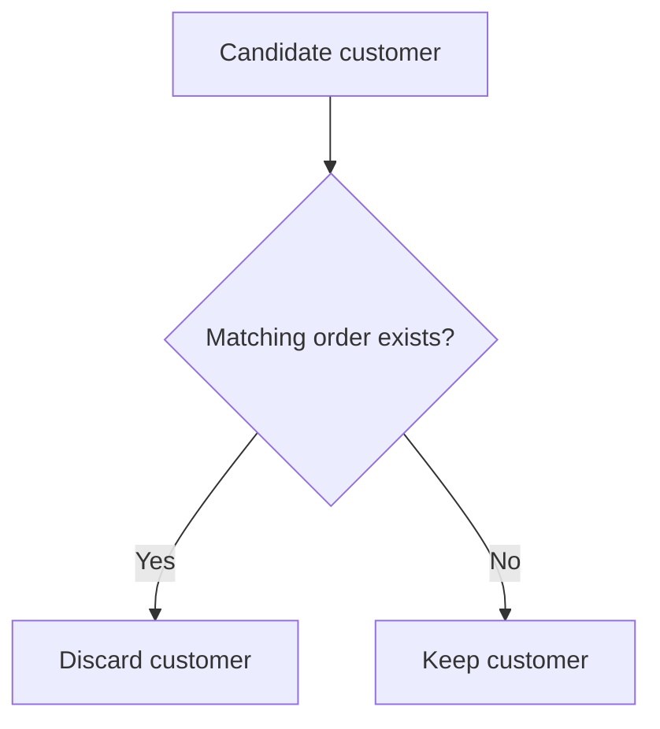
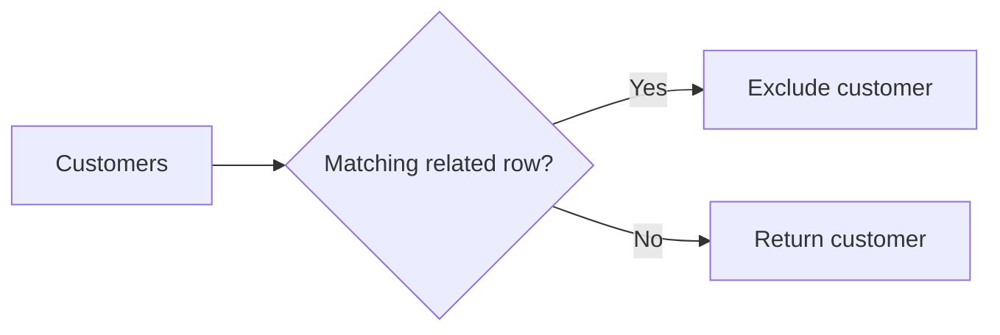

# 13- NOT EXISTS

## Overview

`NOT EXISTS` is a SQL predicate used to determine whether a correlated or uncorrelated subquery returns **no qualifying rows**.

The common pattern is:

```sql
SELECT ...
FROM parent_table AS p
WHERE NOT EXISTS (
    SELECT 1
    FROM child_table AS c
    WHERE c.parent_id = p.id
);
```

It is primarily used for **anti-join logic**:

> Return rows from the outer query for which no matching row exists in the related relation.

Typical backend use cases include:

- Customers with no orders.
- Users without a required permission.
- Products with no inventory.
- Accounts without an active subscription.
- Records that have not yet been synchronized.
- Jobs that have not been claimed.
- Resources that have no dependent records.

`NOT EXISTS` is especially important because it provides well-defined behavior around `NULL`, unlike `NOT IN`, whose semantics can become surprising when the subquery contains `NULL`.

## Why `NOT EXISTS` Exists

Consider the requirement:

> Find customers who have never placed an order.

A join-based approach can be expressed with an outer join:

```sql
SELECT
    c.id,
    c.email
FROM customers AS c
LEFT JOIN orders AS o
    ON o.customer_id = c.id
WHERE o.id IS NULL;
```

The same business requirement can be expressed directly with `NOT EXISTS`:

```sql
SELECT
    c.id,
    c.email
FROM customers AS c
WHERE NOT EXISTS (
    SELECT 1
    FROM orders AS o
    WHERE o.customer_id = c.id
);
```

The second query expresses the business condition directly:

> Keep the customer if no matching order exists.

This is the fundamental use of `NOT EXISTS`.

## Basic Syntax

The general form is:

```sql
WHERE NOT EXISTS (
    SELECT 1
    FROM related_table
    WHERE related_table.foreign_key = outer_table.primary_key
)
```

Example:

```sql
SELECT
    c.id,
    c.email
FROM customers AS c
WHERE NOT EXISTS (
    SELECT 1
    FROM orders AS o
    WHERE o.customer_id = c.id
);
```

The subquery is correlated because it references:

```sql
c.id
```

from the outer query.

For each candidate customer:

- If at least one matching order exists, `EXISTS` is true and `NOT EXISTS` is false.
- If no matching order exists, `EXISTS` is false and `NOT EXISTS` is true.

## How `NOT EXISTS` Works

Conceptually, the database evaluates an anti-join condition:



The subquery does not need to return the matching rows to the outer query.

For example:

```sql
NOT EXISTS (
    SELECT 1
    FROM orders AS o
    WHERE o.customer_id = c.id
)
```

only needs to establish whether the matching set is empty.

This makes `NOT EXISTS` a natural expression for negative relationship queries.

## `EXISTS` vs `NOT EXISTS`

The two predicates represent opposite existence conditions:

| Predicate | Meaning |
|---|---|
| `EXISTS` | At least one qualifying row exists |
| `NOT EXISTS` | No qualifying row exists |

For example:

```sql
-- Customers who have ordered
WHERE EXISTS (
    SELECT 1
    FROM orders AS o
    WHERE o.customer_id = c.id
)
```

```sql
-- Customers who have never ordered
WHERE NOT EXISTS (
    SELECT 1
    FROM orders AS o
    WHERE o.customer_id = c.id
)
```

Together, they cover a large class of relationship filtering requirements.

## `NOT EXISTS` vs `NOT IN`

This distinction is one of the most important SQL interview and production topics.

Suppose:

```sql
SELECT
    c.id
FROM customers AS c
WHERE c.id NOT IN (
    SELECT o.customer_id
    FROM orders AS o
);
```

At first glance, this appears equivalent to:

```sql
SELECT
    c.id
FROM customers AS c
WHERE NOT EXISTS (
    SELECT 1
    FROM orders AS o
    WHERE o.customer_id = c.id
);
```

They can produce the same result when the subquery column is guaranteed to be non-null.

However, `NOT IN` has special `NULL` semantics.

### The `NULL` Problem

Suppose the subquery produces:

```text
10
20
NULL
```

Then:

```sql
WHERE c.id NOT IN (10, 20, NULL)
```

cannot establish that an arbitrary non-matching value is definitely different from `NULL`.

SQL's three-valued logic produces `UNKNOWN`, which is not selected by a `WHERE` clause.

As a result, a nullable value in the `NOT IN` subquery can cause rows that appear unrelated to be excluded.

`NOT EXISTS` avoids this particular trap because it evaluates whether a matching row satisfying the correlated predicate exists.

For negative relationship checks, `NOT EXISTS` is therefore often the safer default.

## `NOT EXISTS` vs `LEFT JOIN ... IS NULL`

These are common alternatives:

```sql
SELECT
    c.id,
    c.email
FROM customers AS c
WHERE NOT EXISTS (
    SELECT 1
    FROM orders AS o
    WHERE o.customer_id = c.id
);
```

and:

```sql
SELECT
    c.id,
    c.email
FROM customers AS c
LEFT JOIN orders AS o
    ON o.customer_id = c.id
WHERE o.id IS NULL;
```

Both can represent anti-join semantics.

### When `NOT EXISTS` Is Clearer

Use `NOT EXISTS` when:

- You only need columns from the outer table.
- The related table is used solely to establish absence.
- The business rule is naturally expressed as "there is no matching row."
- You want to avoid reasoning about generated `NULL` values from an outer join.

### When a Join Is Appropriate

Use a join when:

- You need columns from both relations.
- The query already requires joins for other purposes.
- The optimizer produces a demonstrably better plan for the workload.
- The relationship itself is part of the result construction.

Do not select a join merely because joins are familiar.

## Practical Pattern: Customers With No Orders

```sql
SELECT
    c.id,
    c.email
FROM customers AS c
WHERE NOT EXISTS (
    SELECT 1
    FROM orders AS o
    WHERE o.customer_id = c.id
);
```

This is a canonical anti-join.

It avoids duplicate customer rows because matching orders are not projected into the result.

## Practical Pattern: Users Without a Permission

Suppose users should be identified when they do not have a specific permission:

```sql
SELECT
    u.id,
    u.email
FROM users AS u
WHERE NOT EXISTS (
    SELECT 1
    FROM user_permissions AS up
    WHERE up.user_id = u.id
      AND up.permission = 'reports.read'
);
```

The query means:

> Return users for whom no `reports.read` permission exists.

This is useful for authorization audits, migration checks, and administrative workflows.

It should not automatically be interpreted as the complete authorization mechanism. Effective permissions may come from roles, groups, inherited policies, or database-level controls.

## Practical Pattern: Accounts Without an Active Subscription

```sql
SELECT
    a.id,
    a.account_name
FROM accounts AS a
WHERE NOT EXISTS (
    SELECT 1
    FROM subscriptions AS s
    WHERE s.account_id = a.id
      AND s.status = 'active'
      AND s.expires_at > CURRENT_TIMESTAMP
);
```

The condition is not:

> The account has no subscriptions.

It is more precise:

> The account has no currently active, non-expired subscription.

That distinction matters in production systems where historical subscriptions remain stored.

## Practical Pattern: Unsynchronized Records

Consider an event processing system:

```sql
SELECT
    e.id,
    e.external_id
FROM events AS e
WHERE NOT EXISTS (
    SELECT 1
    FROM sync_records AS s
    WHERE s.event_id = e.id
      AND s.status = 'success'
);
```

This identifies events without a successful synchronization record.

The same pattern is common in:

- Data migration.
- ETL pipelines.
- Background workers.
- Reconciliation jobs.
- Integration systems.
- Kafka consumers.
- External API synchronization.

However, this query identifies candidates. It does not by itself guarantee exclusive ownership of those candidates among concurrent workers.

## Practical Pattern: Products Without Inventory

```sql
SELECT
    p.id,
    p.sku
FROM products AS p
WHERE NOT EXISTS (
    SELECT 1
    FROM inventory AS i
    WHERE i.product_id = p.id
      AND i.available_quantity > 0
);
```

This is different from checking whether an inventory row exists.

The requirement is:

> No inventory row with positive available quantity exists.

This demonstrates why predicates inside the subquery matter.

## Practical Pattern: Users Without Recent Activity

Suppose a system wants users with no login in the previous 90 days:

```sql
SELECT
    u.id,
    u.email
FROM users AS u
WHERE NOT EXISTS (
    SELECT 1
    FROM login_events AS le
    WHERE le.user_id = u.id
      AND le.created_at >= CURRENT_TIMESTAMP - INTERVAL '90 days'
);
```

The query does not require finding the user's most recent login.

It only needs to establish whether a qualifying login exists within the time window.

For very large event tables, indexing and data retention strategy become critical.

## Anti-Join Semantics

A useful senior-level mental model is that `NOT EXISTS` expresses an **anti-semi-join**.

A normal join can produce matching combinations:

```text
customer A → order 1
customer A → order 2
customer B → order 3
```

An anti-join asks:

```text
Which customers have no matching orders?
```

The output might be:

```text
customer C
customer D
```

The matching rows are used only to eliminate outer rows.



Database optimizers may implement this logical operation using physical strategies such as hash anti joins, nested-loop anti joins, merge strategies, or other engine-specific mechanisms.

The SQL expression describes semantics, not a guaranteed physical execution strategy.

## Predicate Placement Matters

Consider:

```sql
WHERE NOT EXISTS (
    SELECT 1
    FROM orders AS o
    WHERE o.customer_id = c.id
      AND o.status = 'cancelled'
);
```

This means:

> Return customers who have no cancelled order.

It does **not** mean:

> Return customers who have no orders.

A customer with:

```text
completed
completed
cancelled
```

will be excluded.

A customer with:

```text
completed
completed
```

will be included.

The predicates inside `NOT EXISTS` define exactly which related rows count as disqualifying matches.

## `NOT EXISTS` With Multiple Conditions

Complex business rules can be represented directly:

```sql
SELECT
    a.id,
    a.account_name
FROM accounts AS a
WHERE NOT EXISTS (
    SELECT 1
    FROM subscriptions AS s
    WHERE s.account_id = a.id
      AND s.status = 'active'
)
AND NOT EXISTS (
    SELECT 1
    FROM account_suspensions AS x
    WHERE x.account_id = a.id
      AND x.active = TRUE
);
```

This means:

> Return accounts that have neither an active subscription nor an active suspension.

Multiple anti-existence predicates can make business rules explicit, but each one should be evaluated as part of the overall query plan.

## `NOT EXISTS` With `OR`

Negative conditions can also be combined:

```sql
SELECT
    c.id,
    c.email
FROM customers AS c
WHERE NOT EXISTS (
    SELECT 1
    FROM orders AS o
    WHERE o.customer_id = c.id
      AND o.status = 'completed'
)
OR NOT EXISTS (
    SELECT 1
    FROM subscriptions AS s
    WHERE s.customer_id = c.id
      AND s.status = 'active'
);
```

This means:

> Return customers who either have no completed order or no active subscription.

Be careful with business requirements here. Negative predicates combined with `OR` can produce logic that is technically correct but very different from the intended rule.

Write the business condition in plain language before implementing complex boolean SQL.

## `NOT EXISTS` With `UPDATE`

`NOT EXISTS` is useful when updating records that lack a related condition.

For example:

```sql
UPDATE customers AS c
SET status = 'inactive'
WHERE c.status = 'active'
  AND NOT EXISTS (
      SELECT 1
      FROM orders AS o
      WHERE o.customer_id = c.id
        AND o.created_at >= CURRENT_TIMESTAMP - INTERVAL '365 days'
  );
```

This means:

> Mark active customers inactive when no order exists in the last year.

Production considerations include:

- Transaction size.
- Number of affected rows.
- Row locking.
- Replication lag.
- Write amplification.
- Audit requirements.
- Rollback strategy.
- Impact on indexes and table bloat.

For large datasets, consider batching or an asynchronous maintenance workflow rather than executing a massive write in a latency-sensitive API request.

## `NOT EXISTS` With `DELETE`

A common cleanup pattern is:

```sql
DELETE FROM sessions AS s
WHERE s.expires_at < CURRENT_TIMESTAMP
  AND NOT EXISTS (
      SELECT 1
      FROM session_locks AS sl
      WHERE sl.session_id = s.id
  );
```

The corresponding validation query should be executed first:

```sql
SELECT
    s.id
FROM sessions AS s
WHERE s.expires_at < CURRENT_TIMESTAMP
  AND NOT EXISTS (
      SELECT 1
      FROM session_locks AS sl
      WHERE sl.session_id = s.id
  );
```

For destructive operations, first converting the condition into a `SELECT` is a useful operational safety practice.

## Performance Considerations

`NOT EXISTS` can be highly efficient for anti-join workloads, but the predicate itself does not guarantee good performance.

Consider:

```sql
SELECT
    c.id
FROM customers AS c
WHERE NOT EXISTS (
    SELECT 1
    FROM orders AS o
    WHERE o.customer_id = c.id
);
```

A useful index is often:

```sql
CREATE INDEX idx_orders_customer_id
ON orders (customer_id);
```

The database can then efficiently determine whether a customer has a matching order.

For additional predicates:

```sql
WHERE o.customer_id = c.id
  AND o.status = 'completed'
```

an index such as:

```sql
CREATE INDEX idx_orders_customer_status
ON orders (customer_id, status);
```

may be appropriate.

The correct index depends on:

- Cardinality.
- Selectivity.
- Query frequency.
- Data distribution.
- Existing indexes.
- Write workload.
- Database engine.
- Actual execution plans.

## PostgreSQL Execution Plans

For production performance investigation, inspect the actual execution plan.

```sql
EXPLAIN (ANALYZE, BUFFERS)
SELECT
    c.id,
    c.email
FROM customers AS c
WHERE NOT EXISTS (
    SELECT 1
    FROM orders AS o
    WHERE o.customer_id = c.id
);
```

PostgreSQL may produce a plan containing an operation such as:

```text
Hash Anti Join
```

or:

```text
Nested Loop Anti Join
```

The optimizer chooses based on statistics, indexes, estimated cardinality, and other factors.

Do not assume:

```text
NOT EXISTS = always fast
```

Instead:

```text
Correct semantics
        ↓
Appropriate indexes
        ↓
Accurate statistics
        ↓
Execution plan
        ↓
Measured production behavior
```

## Indexing Strategy

For:

```sql
WHERE NOT EXISTS (
    SELECT 1
    FROM orders AS o
    WHERE o.customer_id = c.id
);
```

the correlated column should generally have an efficient access path:

```sql
CREATE INDEX idx_orders_customer_id
ON orders (customer_id);
```

For:

```sql
WHERE NOT EXISTS (
    SELECT 1
    FROM orders AS o
    WHERE o.customer_id = c.id
      AND o.status = 'completed'
);
```

consider:

```sql
CREATE INDEX idx_orders_customer_status
ON orders (customer_id, status);
```

In PostgreSQL, a partial index can be effective for a stable, frequently queried subset:

```sql
CREATE INDEX idx_completed_orders_customer
ON orders (customer_id)
WHERE status = 'completed';
```

Do not add indexes mechanically. Every index has storage and write-maintenance costs.

## `NOT EXISTS` and Large Event Tables

Anti-joins against append-heavy event tables can become expensive.

For example:

```sql
SELECT
    u.id
FROM users AS u
WHERE NOT EXISTS (
    SELECT 1
    FROM login_events AS le
    WHERE le.user_id = u.id
      AND le.created_at >= CURRENT_TIMESTAMP - INTERVAL '90 days'
);
```

Potential production strategies include:

- Indexing `(user_id, created_at)`.
- Partitioning very large event tables where appropriate.
- Retaining only necessary historical data.
- Precomputing activity state when justified.
- Maintaining summary tables for high-frequency queries.
- Running expensive reporting workloads asynchronously.

Do not automatically denormalize. First establish that the query is a real workload bottleneck.

## Concurrency Considerations

A negative existence check is not a concurrency guarantee.

Consider:

```sql
SELECT
    j.id
FROM jobs AS j
WHERE NOT EXISTS (
    SELECT 1
    FROM job_claims AS jc
    WHERE jc.job_id = j.id
);
```

Two workers can potentially evaluate the condition concurrently:

```text
Worker A → no claim exists
Worker B → no claim exists
Worker A → claims job
Worker B → claims job
```

If the application requires exclusive ownership, the query needs an appropriate transactional design.

Depending on the workload and database, this may involve:

- Transactions.
- Row-level locks.
- Unique constraints.
- `FOR UPDATE`.
- `SKIP LOCKED`.
- Atomic state transitions.
- Idempotency keys.

For example, PostgreSQL job consumers often use row locking patterns such as:

```sql
SELECT
    id
FROM jobs
WHERE status = 'pending'
ORDER BY id
FOR UPDATE SKIP LOCKED
LIMIT 100;
```

`NOT EXISTS` can be part of a concurrency-aware query, but it should not be confused with a locking primitive.

## Multi-Tenant Systems

Negative existence checks must respect tenant boundaries.

A potentially unsafe pattern is:

```sql
SELECT
    c.id
FROM customers AS c
WHERE c.tenant_id = :tenant_id
  AND NOT EXISTS (
      SELECT 1
      FROM orders AS o
      WHERE o.customer_id = c.id
  );
```

If tenant isolation is not guaranteed by the data model, the related query may need an explicit tenant predicate:

```sql
SELECT
    c.id
FROM customers AS c
WHERE c.tenant_id = :tenant_id
  AND NOT EXISTS (
      SELECT 1
      FROM orders AS o
      WHERE o.customer_id = c.id
        AND o.tenant_id = :tenant_id
  );
```

The correct design depends on the schema and constraints.

For security-sensitive multi-tenant systems, tenant isolation should be enforced consistently through:

- Application authorization.
- Foreign-key relationships.
- Database constraints.
- Row-level security where appropriate.
- Correct query scoping.

## ORM Considerations

### Django

Django supports explicit `NOT EXISTS` queries through `Exists` and `OuterRef`.

```python
from django.db.models import Exists, OuterRef

recent_orders = Order.objects.filter(
    customer_id=OuterRef("pk"),
    created_at__gte=cutoff,
)

customers = Customer.objects.filter(
    ~Exists(recent_orders),
)
```

This generates database-side negative existence logic rather than loading order IDs into Python.

Avoid patterns such as:

```python
order_customer_ids = list(
    Order.objects.values_list("customer_id", flat=True)
)

customers = Customer.objects.exclude(
    id__in=order_customer_ids,
)
```

for large datasets. This can cause unnecessary application memory usage and data transfer.

For complex Django ORM queries:

- Inspect generated SQL.
- Check indexes.
- Use `QuerySet.explain()` when investigating performance.
- Avoid materializing large intermediate result sets.
- Validate tenant scoping explicitly.

### FastAPI

FastAPI itself does not alter SQL semantics.

For an endpoint that needs to identify accounts without active subscriptions, prefer a parameterized database query using `NOT EXISTS` rather than retrieving all subscriptions into Python and evaluating them in application code.

This keeps filtering close to the data and avoids unnecessary network and application-memory overhead.

## Common Mistakes

| Mistake | Why it happens | Better approach |
|---|---|---|
| Replacing `NOT EXISTS` with `NOT IN` blindly | Assuming equivalent set semantics | Prefer `NOT EXISTS` for negative relationship checks |
| Ignoring `NULL` in `NOT IN` | SQL three-valued logic is overlooked | Use `NOT EXISTS` or guarantee non-null semantics |
| Using `LEFT JOIN` and filtering the wrong column | Confusing generated `NULL` rows with stored `NULL`s | Check the joined key or use `NOT EXISTS` |
| Forgetting predicates inside the subquery | Defining the wrong set of disqualifying rows | Place all relevant conditions inside `NOT EXISTS` |
| Assuming `NOT EXISTS` is always faster | Treating SQL keywords as performance guarantees | Inspect the execution plan |
| Missing an index on the correlated key | Query tested only on small data | Index the relationship appropriately |
| Treating `NOT EXISTS` as a lock | Confusing absence detection with concurrency control | Use transactions and locking |
| Ignoring tenant scope | Assuming outer filtering propagates automatically | Apply tenant constraints consistently |
| Running large `DELETE` statements directly | Treating maintenance as a normal request | Validate scope and consider batching |
| Using application-side ID lists | Moving relational work into Python | Keep existence checks in the database |

## Interview Traps

### Why can `NOT IN` behave differently from `NOT EXISTS`?

Because `NOT IN` is affected by `NULL` values in its comparison set.

If the subquery contains `NULL`, comparisons can evaluate to `UNKNOWN`, causing unexpected filtering.

`NOT EXISTS` evaluates whether a correlated matching row exists and does not have this specific `NULL` behavior.

### Is `NOT EXISTS` always faster than `NOT IN`?

No.

Modern optimizers can transform logically related predicates into similar physical plans.

Choose the construct that correctly expresses the required semantics, then verify performance using execution plans and realistic data.

### Is `NOT EXISTS` the same as `LEFT JOIN ... IS NULL`?

They can express equivalent anti-join logic when written correctly, but they are not syntactically or operationally identical.

For example:

```sql
WHERE NOT EXISTS (
    SELECT 1
    FROM orders AS o
    WHERE o.customer_id = c.id
)
```

and:

```sql
LEFT JOIN orders AS o
    ON o.customer_id = c.id
WHERE o.id IS NULL
```

can represent the same requirement.

The optimizer may produce similar physical plans, but correctness depends on predicate placement and schema semantics.

### Does `NOT EXISTS` return rows from the subquery?

No.

It returns a Boolean condition:

```text
TRUE
```

when no qualifying row exists, otherwise:

```text
FALSE
```

### Does `NOT EXISTS` guarantee that only one database lookup occurs?

No.

The logical predicate does not dictate the physical execution strategy.

The optimizer may use nested loops, hashing, indexes, or other mechanisms.

### Can `NOT EXISTS` prevent duplicate results?

When used as a filter on the outer relation, yes, in the sense that the existence check does not multiply outer rows like a one-to-many join can.

For example:

```sql
SELECT c.id
FROM customers AS c
WHERE NOT EXISTS (...);
```

returns each qualifying customer according to the outer query's row set.

## Production Checklist

Before deploying a `NOT EXISTS` query on a high-volume path, verify:

- The negative condition matches the actual business requirement.
- All predicates defining a disqualifying related row are inside the subquery.
- Nullable columns do not introduce unintended semantics.
- Correlated lookup columns have appropriate indexes.
- Multi-tenant queries enforce tenant isolation.
- The execution plan is acceptable at production-scale cardinalities.
- Large event or history tables have an appropriate retention and indexing strategy.
- Destructive `UPDATE` and `DELETE` statements have been validated with a corresponding `SELECT`.
- Concurrency-sensitive workflows use transactions and appropriate locking or uniqueness constraints.
- Application code is not unnecessarily materializing large related ID sets.

## Key Takeaways

- **`NOT EXISTS` expresses anti-join semantics: return outer rows for which no qualifying related row exists.**
- **For negative relationship checks, `NOT EXISTS` is generally safer than `NOT IN` because `NOT IN` can produce unexpected results when its subquery contains `NULL`.**
- **Predicates inside `NOT EXISTS` define exactly which related rows disqualify an outer row, so predicate placement is critical for correctness.**
- **Performance depends on indexes, cardinality, statistics, and the optimizer's execution plan—not simply on choosing `NOT EXISTS`.**
- **`NOT EXISTS` detects absence but does not provide concurrency control; production workflows may still require transactions, locks, unique constraints, or atomic state transitions.**