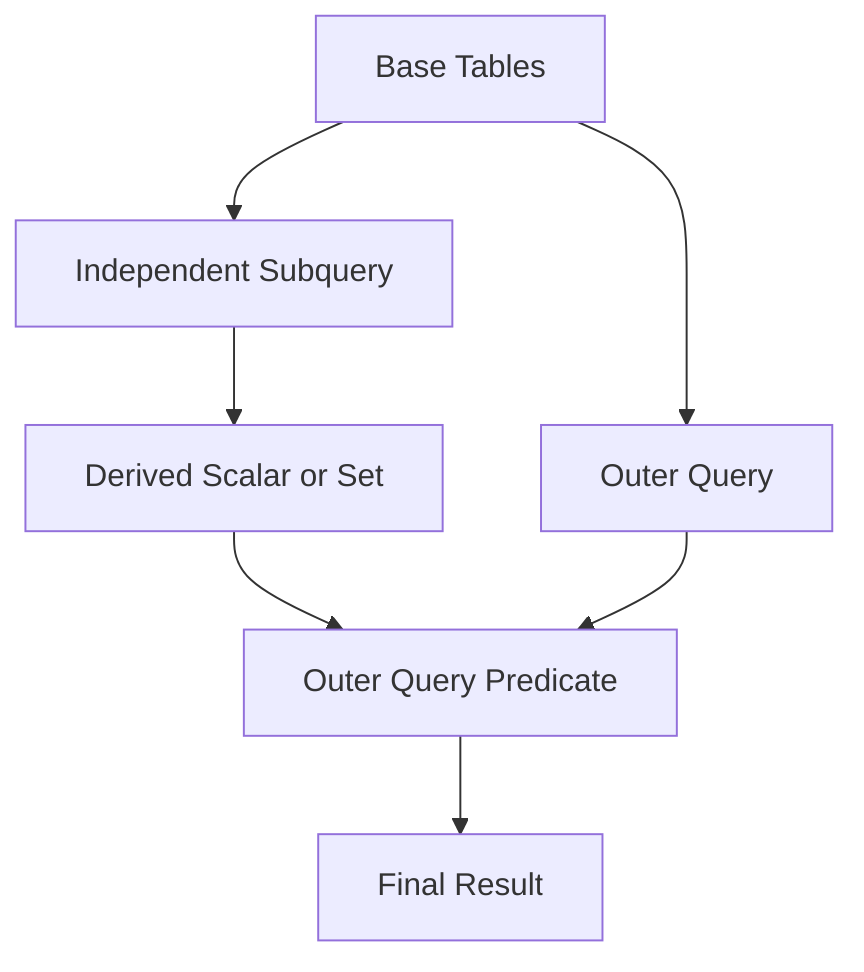

# 16- Non-Correlated Subqueries

## Overview

A non-correlated subquery is a subquery that does **not reference columns from the outer query**. It can be evaluated independently of the outer query because its result does not depend on the current outer row.

For example:

```sql
SELECT
    id,
    email
FROM customers
WHERE id IN (
    SELECT customer_id
    FROM orders
    WHERE status = 'completed'
);
```

The inner query:

```sql
SELECT customer_id
FROM orders
WHERE status = 'completed'
```

does not reference `customers`. It independently produces a set of customer IDs, which the outer query then uses.

Non-correlated subqueries are useful for:

- Filtering against a derived set.
- Comparing values against an aggregate.
- Building intermediate result sets.
- Expressing business rules without explicitly joining every relation.
- Keeping a query logically separated into independent stages.

They are generally easier to reason about than correlated subqueries because the inner query has no dependency on the outer row.

## How Non-Correlated Subqueries Work

Consider:

```sql
SELECT
    p.id,
    p.name,
    p.price
FROM products AS p
WHERE p.price > (
    SELECT AVG(price)
    FROM products
);
```

The subquery calculates one value:

```text
Average product price
        │
        ▼
Compare each product.price
        │
        ▼
Keep products above average
```

Conceptually, the database can evaluate the independent expression and then use its result in the outer query.

However, SQL describes **logical semantics**, not a mandatory physical execution sequence. The optimizer may inline, transform, materialize, or otherwise optimize the subquery.

Therefore, do not assume:

> "The database always executes the subquery first."

The execution plan determines what actually happens.

## Common Forms

| Form | Typical use |
|---|---|
| Scalar subquery | Produce one value |
| `IN` subquery | Match against a set |
| `NOT IN` subquery | Exclude values from a set |
| `EXISTS` | Test relationship existence |
| `NOT EXISTS` | Test relationship absence |
| Subquery in `FROM` | Create a derived table |
| Subquery in `HAVING` | Compare grouped results |
| Subquery in `WHERE` | Filter using independently derived data |

The defining property is not where the subquery appears. It is whether the subquery references the outer query.

## Scalar Non-Correlated Subqueries

A scalar subquery returns a single value.

For example:

```sql
SELECT
    id,
    name,
    price
FROM products
WHERE price > (
    SELECT AVG(price)
    FROM products
);
```

The subquery returns one aggregate value:

```text
AVG(price) → 1250.50
```

The outer query then compares every product against that value.

### Scalar Cardinality Requirement

A scalar subquery must produce at most one row.

This is valid:

```sql
SELECT (
    SELECT MAX(price)
    FROM products
);
```

This is potentially invalid:

```sql
SELECT (
    SELECT price
    FROM products
);
```

If multiple rows are returned where a scalar value is required, PostgreSQL raises an error similar to:

```text
ERROR: more than one row returned by a subquery used as an expression
```

Do not solve this accidentally with `LIMIT 1` unless an arbitrary row is actually the intended business rule.

If the requirement is "the highest price", express that explicitly:

```sql
SELECT (
    SELECT MAX(price)
    FROM products
);
```

## Non-Correlated Subqueries With `IN`

`IN` is commonly used when the subquery returns multiple values.

For example:

```sql
SELECT
    c.id,
    c.email
FROM customers AS c
WHERE c.id IN (
    SELECT o.customer_id
    FROM orders AS o
    WHERE o.status = 'completed'
);
```

The inner query produces a set of customer IDs.

The outer query keeps customers whose IDs belong to that set.

This is useful when the requirement naturally reads:

> Return entities whose key belongs to a separately defined set.

## `IN` vs `EXISTS`

A non-correlated `IN` query:

```sql
SELECT
    c.id,
    c.email
FROM customers AS c
WHERE c.id IN (
    SELECT o.customer_id
    FROM orders AS o
    WHERE o.status = 'completed'
);
```

can often be expressed as:

```sql
SELECT
    c.id,
    c.email
FROM customers AS c
WHERE EXISTS (
    SELECT 1
    FROM orders AS o
    WHERE o.customer_id = c.id
      AND o.status = 'completed'
);
```

The second query is correlated because it references `c.id`.

The semantic distinction is important:

- `IN` describes membership in a set.
- `EXISTS` describes existence of a related row.

Modern optimizers can often transform these forms into similar physical plans, so do not choose solely based on assumptions about performance.

Choose based on semantics first, then verify performance with the execution plan.

## `NOT IN` and `NULL`

`NOT IN` requires special care because of SQL's three-valued logic.

Consider:

```sql
SELECT
    id,
    email
FROM customers
WHERE id NOT IN (
    SELECT customer_id
    FROM orders
);
```

If the subquery returns a `NULL`, the comparison can become `UNKNOWN` rather than `TRUE`, potentially causing rows to be excluded unexpectedly.

For example:

```text
id NOT IN (10, 20, NULL)
```

cannot establish that `id` is different from `NULL`, so the predicate does not behave like ordinary set subtraction.

If the business requirement is:

> Customers for whom no matching order exists

prefer the anti-existence formulation:

```sql
SELECT
    c.id,
    c.email
FROM customers AS c
WHERE NOT EXISTS (
    SELECT 1
    FROM orders AS o
    WHERE o.customer_id = c.id
);
```

Or explicitly eliminate `NULL` when `NOT IN` is genuinely the intended semantics:

```sql
SELECT
    c.id,
    c.email
FROM customers AS c
WHERE c.id NOT IN (
    SELECT o.customer_id
    FROM orders AS o
    WHERE o.customer_id IS NOT NULL
);
```

## Subqueries With Aggregates

Non-correlated subqueries are particularly useful for global aggregates.

### Above Global Average

```sql
SELECT
    id,
    name,
    price
FROM products
WHERE price > (
    SELECT AVG(price)
    FROM products
);
```

The aggregate is independent of the current product.

### Above Global Maximum Discount

```sql
SELECT
    id,
    sku,
    discount_percentage
FROM products
WHERE discount_percentage > (
    SELECT AVG(discount_percentage)
    FROM products
    WHERE active = TRUE
);
```

The inner query defines a business-wide threshold.

The outer query applies that threshold to the target rows.

## Subqueries in `FROM`

A non-correlated subquery can produce a derived table.

For example:

```sql
SELECT
    customer_id,
    order_count
FROM (
    SELECT
        customer_id,
        COUNT(*) AS order_count
    FROM orders
    GROUP BY customer_id
) AS customer_orders
WHERE order_count >= 10;
```

The inner query produces one row per customer.

The outer query then filters the aggregated result.

This is useful when a query naturally consists of multiple relational stages:

```text
orders
   │
   ▼
GROUP BY customer
   │
   ▼
customer_orders
   │
   ▼
Filter order_count >= 10
```

The derived table must have an alias in PostgreSQL:

```sql
FROM (...) AS customer_orders
```

## Derived Tables vs CTEs

The same logic can often be expressed with a CTE:

```sql
WITH customer_orders AS (
    SELECT
        customer_id,
        COUNT(*) AS order_count
    FROM orders
    GROUP BY customer_id
)
SELECT
    customer_id,
    order_count
FROM customer_orders
WHERE order_count >= 10;
```

A CTE can improve readability when the intermediate result has a meaningful conceptual name.

A derived table can be preferable when the intermediate relation is used only once and the query is small.

Do not assume a CTE is always materialized. Modern PostgreSQL can inline eligible CTEs, and explicit materialization can be requested when appropriate.

## Subqueries in `HAVING`

A non-correlated subquery can define a threshold for grouped results.

For example:

> Find departments whose average salary is greater than the company-wide average salary.

```sql
SELECT
    department_id,
    AVG(salary) AS department_avg_salary
FROM employees
GROUP BY department_id
HAVING AVG(salary) > (
    SELECT AVG(salary)
    FROM employees
);
```

The inner query calculates the global average.

The outer query calculates an average for each department and compares each group against the global value.

This is a useful pattern for comparing grouped metrics against a global benchmark.

## Subqueries in `SELECT`

A non-correlated scalar subquery can provide the same derived value to every outer row.

```sql
SELECT
    p.id,
    p.name,
    p.price,
    (
        SELECT AVG(price)
        FROM products
    ) AS average_price
FROM products AS p;
```

Every result row receives the same `average_price`.

This can be useful when an API response needs both an individual value and a global reference value.

However, if the same value can be calculated once in a CTE or another relational expression without reducing clarity, consider that alternative.

## Data Flow

A typical non-correlated query can be understood as two logical components:



The key characteristic is that the subquery does not need values from the outer query.

## Non-Correlated vs Correlated

| Characteristic | Non-Correlated | Correlated |
|---|---|---|
| References outer query | No | Yes |
| Depends on current outer row | No | Yes |
| Can be logically evaluated independently | Yes | No |
| Typical scalar use | Global aggregate | Per-row aggregate |
| Typical `IN` use | Set membership | Less common |
| Typical `EXISTS` use | Possible | Very common |
| Optimization | Often straightforward | May require decorrelation |
| Main concern | Intermediate result size | Per-row relationship work |

Compare:

```sql
-- Non-correlated
SELECT
    p.id
FROM products AS p
WHERE p.price > (
    SELECT AVG(price)
    FROM products
);
```

with:

```sql
-- Correlated
SELECT
    p.id
FROM products AS p
WHERE p.price > (
    SELECT AVG(p2.price)
    FROM products AS p2
    WHERE p2.category_id = p.category_id
);
```

The first compares against one global value.

The second calculates a category-specific value for the current product.

## Performance Considerations

A non-correlated subquery is not automatically faster than an equivalent join or CTE.

Performance depends on:

- Table cardinality.
- Selectivity.
- Indexes.
- Statistics.
- Join strategy.
- Query shape.
- Memory availability.
- Sort and aggregation costs.
- Whether the optimizer can transform the query efficiently.

For example:

```sql
SELECT
    id,
    email
FROM customers
WHERE id IN (
    SELECT customer_id
    FROM orders
    WHERE status = 'completed'
);
```

could involve:

- A hash-based strategy.
- A semi-join.
- An index-based strategy.
- Other optimizer transformations.

The SQL text alone does not tell you which strategy PostgreSQL will use.

## Inspecting PostgreSQL Plans

For a production-sensitive query:

```sql
EXPLAIN (ANALYZE, BUFFERS)
SELECT
    c.id,
    c.email
FROM customers AS c
WHERE c.id IN (
    SELECT o.customer_id
    FROM orders AS o
    WHERE o.status = 'completed'
);
```

Inspect:

- Estimated rows vs actual rows.
- Sequential scans.
- Index scans.
- Hash operations.
- Sort operations.
- Memory usage.
- Buffer hits and reads.
- Rows removed by filters.
- Total execution time.

Use realistic data volumes when benchmarking. A query that performs well against 10,000 rows may behave very differently against 500 million rows.

## Intermediate Result Size

One important concern with non-correlated subqueries is the size of the intermediate result.

For example:

```sql
WHERE customer_id IN (
    SELECT customer_id
    FROM orders
)
```

If `orders` contains hundreds of millions of rows, the optimizer must choose an efficient strategy for processing that relationship.

Indexes and query selectivity can make a substantial difference.

If only a narrow subset is required, filter as early as the business logic allows:

```sql
WHERE customer_id IN (
    SELECT customer_id
    FROM orders
    WHERE status = 'completed'
      AND created_at >= CURRENT_DATE - INTERVAL '30 days'
)
```

The predicate should still be designed around actual workload requirements and supported by appropriate indexes.

## Indexing Considerations

Suppose the query uses:

```sql
SELECT
    id,
    email
FROM customers
WHERE id IN (
    SELECT customer_id
    FROM orders
    WHERE status = 'completed'
);
```

The relevant access patterns include:

```text
orders.status
orders.customer_id
```

An index such as:

```sql
CREATE INDEX idx_orders_status_customer
ON orders (status, customer_id);
```

may be useful depending on data distribution and other workloads.

For PostgreSQL, a partial index can be appropriate when the query repeatedly targets a small subset:

```sql
CREATE INDEX idx_completed_orders_customer
ON orders (customer_id)
WHERE status = 'completed';
```

Index decisions should be based on actual query plans and workload characteristics rather than indexing every referenced column automatically.

## Optimizer Transformations

A non-correlated subquery may be transformed by the optimizer.

For example:

```sql
WHERE id IN (
    SELECT customer_id
    FROM orders
    WHERE status = 'completed'
)
```

can potentially be transformed into a semi-join-like strategy.

Likewise, a scalar aggregate may be computed once rather than repeatedly.

This is why manually rewriting every subquery into a join is not a reliable optimization strategy.

The correct workflow is:

```text
Write semantically correct SQL
          │
          ▼
Measure with realistic data
          │
          ▼
Inspect execution plan
          │
          ▼
Identify actual bottleneck
          │
          ▼
Rewrite or index if justified
          │
          ▼
Measure again
```

## Practical Backend Example

Consider an API endpoint returning active customers who placed at least one completed order during the current month.

A set-membership formulation is:

```sql
SELECT
    c.id,
    c.email
FROM customers AS c
WHERE c.active = TRUE
  AND c.id IN (
      SELECT o.customer_id
      FROM orders AS o
      WHERE o.status = 'completed'
        AND o.created_at >= date_trunc('month', CURRENT_DATE)
  );
```

The application receives only the required customer records.

It does not need to:

1. Fetch all orders.
2. Extract customer IDs in Python.
3. Build a large application-side list.
4. Execute another query.

Keeping the filtering operation in the database reduces application memory usage and network transfer.

For high-throughput APIs, also consider whether the query should use `EXISTS`, depending on the relationship semantics and resulting execution plan.

## ORM Considerations

Non-correlated subqueries can be represented through ORM constructs, but the generated SQL should remain the source of truth for performance.

For example, Django supports subqueries through `Subquery` and `OuterRef`. A genuinely non-correlated subquery does not require `OuterRef`.

Conceptually:

```python
from django.db.models import Subquery

completed_customer_ids = Order.objects.filter(
    status="completed",
).values("customer_id")

customers = Customer.objects.filter(
    id__in=Subquery(completed_customer_ids),
)
```

This keeps the filtering operation in SQL instead of materializing all customer IDs in Python.

Avoid:

```python
customer_ids = list(
    Order.objects.filter(
        status="completed",
    ).values_list("customer_id", flat=True)
)

customers = Customer.objects.filter(id__in=customer_ids)
```

The application-side version can create:

- Additional network transfer.
- Python memory consumption.
- Large parameter lists.
- More application CPU work.
- Potential query-size limitations.

The exact ORM-generated SQL and database execution plan should still be inspected for performance-sensitive paths.

## Advantages

Non-correlated subqueries provide several engineering benefits:

- **Clear logical separation:** The inner query defines an independent result.
- **Good expressiveness:** Complex filtering rules can remain readable.
- **Set-oriented execution:** Data stays inside the database.
- **Reusable reasoning:** Aggregate thresholds can be defined independently.
- **Reduced application work:** The application does not need to fetch intermediate datasets.
- **Natural composition:** Subqueries can be used in `WHERE`, `HAVING`, `SELECT`, and `FROM`.

## Limitations

Non-correlated subqueries are not universally preferable.

Potential limitations include:

- Large intermediate result sets.
- Complex optimizer behavior.
- Difficult-to-read nested SQL.
- Accidental scalar cardinality violations.
- `NULL` surprises with `NOT IN`.
- Poor plans when statistics or indexes are unsuitable.
- Queries that would be clearer as joins, CTEs, or window functions.

A subquery should be selected because it expresses the required relational operation clearly, not because subqueries are inherently better or worse than joins.

## Production Considerations

### Query Correctness

Validate:

- Expected row cardinality.
- `NULL` behavior.
- Empty subquery behavior.
- Duplicate values in the subquery.
- Scalar subquery cardinality.

### Performance

Measure:

- Query latency.
- CPU consumption.
- Disk IO.
- Buffer activity.
- Memory usage.
- Rows processed.

### Scalability

Test against realistic production-scale data.

Pay particular attention to:

- Large subquery result sets.
- High-frequency API endpoints.
- Large aggregates.
- High-cardinality tables.
- Concurrent query load.

### Observability

Monitor slow query logs and database metrics.

For PostgreSQL, tools such as `pg_stat_statements` can help identify frequently executed and expensive SQL statements.

### Reliability

Avoid introducing expensive subqueries into latency-sensitive paths without testing under realistic concurrency.

A query that is fast in isolation can still become a production bottleneck when executed thousands of times per second.

## Common Mistakes

| Mistake | Problem | Better approach |
|---|---|---|
| Assuming every subquery executes first | Confuses logical and physical execution | Inspect the plan |
| Rewriting every subquery as a join | May change cardinality or semantics | Optimize only when evidence supports it |
| Materializing subquery results in Python | Adds memory and network overhead | Keep set operations in SQL |
| Using `NOT IN` without considering `NULL` | Can produce unexpected filtering | Prefer `NOT EXISTS` or filter `NULL`s |
| Returning multiple rows from a scalar subquery | Causes runtime errors | Use an aggregate or enforce single-row semantics |
| Using `LIMIT 1` arbitrarily | Hides incorrect cardinality assumptions | Define deterministic business semantics |
| Ignoring duplicate values in `IN` | Assumes duplicates change membership | Understand set-membership semantics |
| Testing only with small data | Hides scalability problems | Benchmark realistic cardinalities |
| Ignoring indexes | Causes unnecessary scans | Inspect execution plans and access patterns |
| Assuming ORM abstractions optimize everything | Generated SQL may be inefficient | Inspect generated SQL and database plans |

## Interview Traps

### Is a non-correlated subquery always executed before the outer query?

No.

That is a useful logical model, but the optimizer determines the physical execution strategy.

### Does a non-correlated subquery always execute only once?

No.

Do not make guarantees about execution frequency from SQL syntax alone. The optimizer may transform the query, and execution behavior depends on the database and plan.

### Can a non-correlated subquery return multiple rows?

Yes, when used in a context that accepts multiple rows, such as:

```sql
WHERE id IN (
    SELECT customer_id
    FROM orders
)
```

No, when the context requires a scalar value:

```sql
WHERE price > (
    SELECT price
    FROM products
)
```

The latter must produce at most one row.

### Why can `NOT IN` produce surprising results?

Because SQL uses three-valued logic. If the subquery contains `NULL`, comparisons can evaluate to `UNKNOWN`.

For anti-existence requirements, `NOT EXISTS` is usually safer and more expressive.

### Are duplicates in an `IN` subquery a correctness problem?

Usually not.

Membership only requires whether a matching value exists. Duplicate values do not change whether the outer value belongs to the resulting set.

### Are subqueries slower than joins?

Not inherently.

The optimizer may transform equivalent queries into similar physical strategies. Correct semantics and measured execution plans should guide optimization decisions.

### When should a CTE or window function be considered?

Consider them when they make the relational operation clearer or avoid repeated aggregation.

For example, comparing every product against its category average is often naturally expressed with:

```sql
AVG(price) OVER (PARTITION BY category_id)
```

rather than a separate correlated aggregation.

## Key Takeaways

- **A non-correlated subquery is independent of the outer query and can logically produce a scalar, set, or derived relation without outer-row values.**
- **Use scalar subqueries for independent values, `IN` for set membership, and derived tables or CTEs when an intermediate relation improves query composition.**
- **`NOT IN` requires explicit attention to `NULL` semantics; `NOT EXISTS` is generally safer for absence or anti-join requirements.**
- **Do not assume a subquery is physically executed before or exactly once; the optimizer determines the execution strategy, so use `EXPLAIN` for performance decisions.**
- **Keep intermediate relational work inside the database instead of materializing large subquery results in Python or another application layer.**