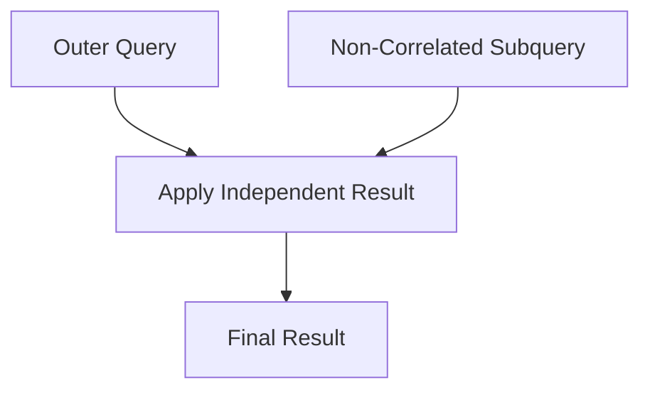
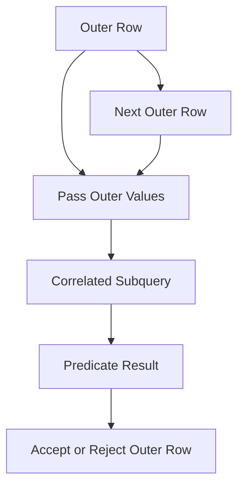
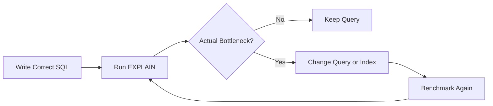

# 17- Correlated vs Non-Correlated Subqueries

## Overview

Subqueries can be classified by whether they depend on values from the outer query.

A **non-correlated subquery** is independent of the outer query. It can be evaluated without knowing which outer row is currently being processed.

A **correlated subquery** references one or more columns from the outer query. Its result therefore depends on the current outer row.

The distinction matters because it affects:

- Query semantics.
- How the database optimizer can transform the query.
- Potential execution strategies.
- Indexing requirements.
- Performance at scale.
- Whether the query naturally expresses a global or per-row relationship.

For example, comparing products against the global average is naturally non-correlated:

```sql
SELECT
    p.id,
    p.name,
    p.price
FROM products AS p
WHERE p.price > (
    SELECT AVG(price)
    FROM products
);
```

Comparing each product against its category average introduces a dependency on the current product:

```sql
SELECT
    p.id,
    p.name,
    p.price
FROM products AS p
WHERE p.price > (
    SELECT AVG(p2.price)
    FROM products AS p2
    WHERE p2.category_id = p.category_id
);
```

The second query is correlated because `p.category_id` comes from the outer query.

## Core Difference

The simplest test is:

> Does the inner query reference a column from the outer query?

| Property | Non-Correlated | Correlated |
|---|---|---|
| References outer query | No | Yes |
| Depends on current outer row | No | Yes |
| Can be evaluated independently | Yes | No |
| Typical use | Global value or independent set | Per-row relationship |
| Common operators | `IN`, scalar comparisons | `EXISTS`, `NOT EXISTS`, scalar comparisons |
| Optimization | Often easier to transform | May require decorrelation |
| Main performance concern | Intermediate result size | Repeated or relationship-dependent work |
| Typical alternative | Join, CTE, aggregate | Join, window function, grouped relation |

The distinction is semantic, not simply a statement about how many times the database physically executes a subquery.

## Non-Correlated Subqueries

A non-correlated subquery does not refer to the outer query.

Consider:

```sql
SELECT
    p.id,
    p.name,
    p.price
FROM products AS p
WHERE p.price > (
    SELECT AVG(price)
    FROM products
);
```

The subquery:

```sql
SELECT AVG(price)
FROM products
```

does not depend on `p`.

Its result represents one global value:

```text
All products
     │
     ▼
AVG(price)
     │
     ▼
Global threshold
     │
     ▼
Compare every product
```

### When to Use

Non-correlated subqueries are appropriate when the inner query represents an independent relation or value, such as:

- Global aggregates.
- Independent filtering sets.
- Business-wide thresholds.
- Reference values.
- Membership tests.

Example:

```sql
SELECT
    id,
    email
FROM customers
WHERE id IN (
    SELECT customer_id
    FROM orders
    WHERE status = 'completed'
);
```

The order query is independent of the current customer row.

## Correlated Subqueries

A correlated subquery references the outer query.

For example:

```sql
SELECT
    p.id,
    p.name,
    p.price
FROM products AS p
WHERE p.price > (
    SELECT AVG(p2.price)
    FROM products AS p2
    WHERE p2.category_id = p.category_id
);
```

The inner query contains:

```sql
p2.category_id = p.category_id
```

`p.category_id` belongs to the outer query.

Therefore, the condition depends on which product is being evaluated.

Conceptually:

```text
Product A ──► calculate average for A's category ──► compare A
Product B ──► calculate average for B's category ──► compare B
Product C ──► calculate average for C's category ──► compare C
```

This is fundamentally different from calculating one global average.

## Why Correlation Exists

Correlation allows a subquery to express a relationship between the current outer row and another relation.

A common example is:

> Return customers who have at least one completed order.

```sql
SELECT
    c.id,
    c.email
FROM customers AS c
WHERE EXISTS (
    SELECT 1
    FROM orders AS o
    WHERE o.customer_id = c.id
      AND o.status = 'completed'
);
```

The inner query asks:

> Does an order exist for this particular customer?

The `c.id` reference creates the correlation.

This is particularly expressive for existence and anti-existence conditions.

## Execution Model

A useful conceptual model is:

### Non-Correlated



The subquery does not require values from individual outer rows.

### Correlated



This illustrates the logical dependency.

However, this should **not** be interpreted as a requirement that the database literally executes the inner query from scratch once per outer row.

A query optimizer may transform a correlated query into a join, semi-join, aggregate, or another equivalent execution strategy.

## Correlation Is About Dependency, Not Guaranteed Execution Count

This is an important senior-level distinction.

A correlated query:

```sql
SELECT
    c.id
FROM customers AS c
WHERE EXISTS (
    SELECT 1
    FROM orders AS o
    WHERE o.customer_id = c.id
);
```

is logically correlated.

It does **not** mean:

```text
for every customer:
    execute SELECT from orders
```

must be the physical execution strategy.

The optimizer may recognize the relationship and produce an efficient semi-join.

Therefore:

> Correlated does not automatically mean slow.

Likewise:

> Non-correlated does not automatically mean fast.

Always inspect the execution plan for performance-sensitive queries.

## A Direct Comparison

Suppose the requirement is:

> Find products priced above their category average.

### Correlated Subquery

```sql
SELECT
    p.id,
    p.name,
    p.price
FROM products AS p
WHERE p.price > (
    SELECT AVG(p2.price)
    FROM products AS p2
    WHERE p2.category_id = p.category_id
);
```

The average depends on the current product's category.

### Non-Correlated Alternative Using a Derived Table

```sql
SELECT
    p.id,
    p.name,
    p.price
FROM products AS p
JOIN (
    SELECT
        category_id,
        AVG(price) AS avg_price
    FROM products
    GROUP BY category_id
) AS category_stats
    ON category_stats.category_id = p.category_id
WHERE p.price > category_stats.avg_price;
```

The derived table independently calculates one aggregate row per category.

The outer query then joins products against those results.

### Window Function Alternative

For this particular requirement, a window function is often clearer:

```sql
SELECT
    id,
    name,
    price
FROM (
    SELECT
        id,
        name,
        price,
        AVG(price) OVER (
            PARTITION BY category_id
        ) AS category_avg_price
    FROM products
) AS product_stats
WHERE price > category_avg_price;
```

This demonstrates an important engineering principle:

> A correlated subquery may be correct without being the clearest or most efficient expression of the relational operation.

## `EXISTS` and Correlation

`EXISTS` is one of the most common places where correlated subqueries are appropriate.

```sql
SELECT
    c.id,
    c.email
FROM customers AS c
WHERE EXISTS (
    SELECT 1
    FROM orders AS o
    WHERE o.customer_id = c.id
      AND o.status = 'completed'
);
```

The database is testing whether a related order exists for each customer.

The inner query does not need to return order data. It only needs to establish existence.

The expression:

```sql
SELECT 1
```

is therefore conventional.

The important part is the correlation predicate:

```sql
o.customer_id = c.id
```

## `NOT EXISTS` and Correlation

Anti-existence is another strong use case.

```sql
SELECT
    c.id,
    c.email
FROM customers AS c
WHERE NOT EXISTS (
    SELECT 1
    FROM orders AS o
    WHERE o.customer_id = c.id
);
```

This means:

> Return customers for whom no matching order exists.

This is often preferable to:

```sql
WHERE c.id NOT IN (
    SELECT customer_id
    FROM orders
)
```

because `NOT IN` has problematic `NULL` semantics.

## Correlated Scalar Subqueries

A correlated subquery can return a scalar value specific to each outer row.

For example:

```sql
SELECT
    c.id,
    c.email,
    (
        SELECT MAX(o.created_at)
        FROM orders AS o
        WHERE o.customer_id = c.id
    ) AS last_order_at
FROM customers AS c;
```

Each customer gets their own latest order timestamp.

The result conceptually looks like:

| Customer | `last_order_at` |
|---|---|
| Customer A | 2026-08-20 |
| Customer B | 2026-08-25 |
| Customer C | `NULL` |

A customer without an order receives `NULL`.

## Correlated Subqueries With `LIMIT`

Correlated subqueries are useful when retrieving one related record per outer row.

For example:

```sql
SELECT
    c.id,
    c.email,
    (
        SELECT o.id
        FROM orders AS o
        WHERE o.customer_id = c.id
        ORDER BY o.created_at DESC, o.id DESC
        LIMIT 1
    ) AS latest_order_id
FROM customers AS c;
```

The deterministic ordering:

```sql
ORDER BY o.created_at DESC, o.id DESC
```

is important.

Using only:

```sql
ORDER BY o.created_at DESC
```

can leave ties nondeterministic when multiple orders have the same timestamp.

## `NULL` Behavior

Correlation can interact with SQL's three-valued logic.

Consider:

```sql
WHERE o.customer_id = c.id
```

If either side is `NULL`, the equality comparison evaluates to `UNKNOWN`, not `TRUE`.

This is usually correct for foreign-key-style relationships because a nullable relationship should not match an ordinary ID.

If the business semantics require treating `NULL` as equal to `NULL`, PostgreSQL provides:

```sql
o.customer_id IS NOT DISTINCT FROM c.id
```

Do not introduce special `NULL` handling without an explicit business requirement.

## Performance Characteristics

The major performance concern with correlated subqueries is the relationship between:

- Outer row count.
- Inner lookup cost.
- Selectivity.
- Available indexes.
- Optimizer transformations.

Consider:

```sql
SELECT
    c.id,
    (
        SELECT MAX(o.created_at)
        FROM orders AS o
        WHERE o.customer_id = c.id
    ) AS last_order_at
FROM customers AS c;
```

If there are millions of customers and the database cannot efficiently access orders by `customer_id`, the query can become expensive.

An appropriate index may help:

```sql
CREATE INDEX idx_orders_customer_created
ON orders (customer_id, created_at DESC);
```

The exact index should be validated against the actual execution plan and workload.

## Correlated Subquery Performance Is Not Always N+1

An application-level N+1 pattern looks like:

```text
Application
   │
   ├── SELECT customer ...
   ├── SELECT orders WHERE customer_id = 1
   ├── SELECT orders WHERE customer_id = 2
   ├── SELECT orders WHERE customer_id = 3
   └── ...
```

This creates multiple database round trips.

A correlated SQL subquery remains one SQL statement:

```sql
SELECT
    c.id,
    (
        SELECT COUNT(*)
        FROM orders AS o
        WHERE o.customer_id = c.id
    ) AS order_count
FROM customers AS c;
```

The database can optimize the complete relational expression internally.

Therefore, a correlated SQL subquery is **not automatically equivalent to an application N+1 query**.

The performance model is different because the database controls the entire statement and can optimize it globally.

## Decorrelation

A database optimizer may transform a correlated subquery into an equivalent join or other relational operation.

For example:

```sql
SELECT
    c.id
FROM customers AS c
WHERE EXISTS (
    SELECT 1
    FROM orders AS o
    WHERE o.customer_id = c.id
);
```

can often be executed using a semi-join strategy rather than repeatedly scanning `orders`.

This process is commonly referred to as **decorrelation**.

The optimizer's ability to decorrelate depends on:

- Database engine.
- Query structure.
- Aggregations.
- Ordering.
- `LIMIT`.
- Volatile functions.
- Predicate structure.
- Other relational constraints.

Do not assume every correlated query can be decorrelated.

## When Correlated Queries Become Expensive

Potentially expensive patterns include:

### Large Outer Relation

```sql
SELECT
    c.id,
    (
        SELECT COUNT(*)
        FROM orders AS o
        WHERE o.customer_id = c.id
    )
FROM customers AS c;
```

If the outer relation contains millions of rows, the database has a large number of customer-specific relationships to process.

### Missing Correlation Index

If the inner query repeatedly needs:

```sql
WHERE o.customer_id = c.id
```

but `orders.customer_id` cannot be accessed efficiently, execution can become expensive.

### Complex Inner Aggregation

For example:

```sql
SELECT
    c.id,
    (
        SELECT AVG(o.amount)
        FROM orders AS o
        WHERE o.customer_id = c.id
          AND o.status = 'completed'
          AND o.created_at >= CURRENT_DATE - INTERVAL '1 year'
    )
FROM customers AS c;
```

The inner aggregation can become expensive depending on cardinality and indexing.

### Correlation Plus Ordering

```sql
SELECT
    c.id,
    (
        SELECT o.id
        FROM orders AS o
        WHERE o.customer_id = c.id
        ORDER BY o.created_at DESC
        LIMIT 1
    )
FROM customers AS c;
```

This pattern can be efficient with a suitable index but should be verified at scale.

## Indexing Correlated Queries

Indexes should support the predicates used by the inner query.

For:

```sql
WHERE o.customer_id = c.id
```

a useful starting point is:

```sql
CREATE INDEX idx_orders_customer_id
ON orders (customer_id);
```

For:

```sql
WHERE o.customer_id = c.id
ORDER BY o.created_at DESC
LIMIT 1
```

a composite index may be more appropriate:

```sql
CREATE INDEX idx_orders_customer_created
ON orders (customer_id, created_at DESC);
```

For a frequently queried status subset in PostgreSQL:

```sql
CREATE INDEX idx_completed_orders_customer_created
ON orders (customer_id, created_at DESC)
WHERE status = 'completed';
```

Partial indexes should be used when the predicate is stable and selective enough to justify them.

## Execution Plan Analysis

Do not optimize correlated queries based solely on their appearance.

Use PostgreSQL:

```sql
EXPLAIN (ANALYZE, BUFFERS)
SELECT
    c.id,
    (
        SELECT MAX(o.created_at)
        FROM orders AS o
        WHERE o.customer_id = c.id
    ) AS last_order_at
FROM customers AS c;
```

Look for:

- Actual vs estimated row counts.
- Sequential scans.
- Index scans.
- Nested-loop behavior.
- Aggregate cost.
- Buffer reads.
- Buffer hits.
- Rows processed.
- Execution time.

A useful production workflow is:



Do not rewrite a correlated query merely because it looks repetitive.

## Correlated vs Non-Correlated Decision Guide

| Requirement | Natural choice |
|---|---|
| Compare against global average | Non-correlated scalar subquery |
| Check whether a related row exists | Correlated `EXISTS` |
| Check whether no related row exists | Correlated `NOT EXISTS` |
| Match against an independently derived set | Non-correlated `IN` |
| Compare each row against group statistics | Correlated subquery, join, or window function |
| Retrieve latest related row | Correlated scalar subquery or lateral relation |
| Reuse an intermediate relation | CTE or derived table |
| Calculate per-group metrics across rows | Window function |
| Large relational transformation | Join/CTE/window function may be clearer |

The goal is not to eliminate one category.

The goal is to choose the expression that best matches the relationship being modeled.

## Practical Backend Example

Suppose a Django API needs to return customers who have not placed an order during the last 90 days.

A correlated anti-existence query is:

```sql
SELECT
    c.id,
    c.email
FROM customers AS c
WHERE NOT EXISTS (
    SELECT 1
    FROM orders AS o
    WHERE o.customer_id = c.id
      AND o.created_at >= CURRENT_DATE - INTERVAL '90 days'
);
```

This expresses the business rule directly:

> Select customers for whom no recent order exists.

This is generally preferable to retrieving orders into Python and filtering customers in application code.

The same principle applies to FastAPI, background workers, Celery tasks, and service-layer database access: let the database perform set-based relational operations instead of transferring large datasets to application memory.

## Django ORM

Django supports correlated subqueries through `OuterRef` and `Subquery`.

For example:

```python
from django.db.models import OuterRef, Subquery

latest_order = (
    Order.objects
    .filter(customer_id=OuterRef("pk"))
    .order_by("-created_at", "-id")
)

customers = Customer.objects.annotate(
    latest_order_id=Subquery(
        latest_order.values("id")[:1]
    )
)
```

The generated SQL contains a correlation between the customer row and the order lookup.

For existence checks, Django's `Exists` expression is often more explicit:

```python
from django.db.models import Exists, OuterRef

recent_orders = Order.objects.filter(
    customer_id=OuterRef("pk"),
    created_at__gte=recent_cutoff,
)

customers = Customer.objects.annotate(
    has_recent_order=Exists(recent_orders),
).filter(
    has_recent_order=False,
)
```

This keeps the operation inside SQL rather than materializing IDs in Python.

For performance-sensitive ORM queries:

- Inspect generated SQL.
- Run `EXPLAIN`.
- Validate indexes.
- Test against production-scale data.
- Avoid assuming ORM syntax maps to a particular physical plan.

## Advantages and Limitations

| Type | Advantages | Limitations |
|---|---|---|
| Non-correlated | Simple dependency model, good for global values and sets | Can still process large intermediate relations |
| Correlated | Expresses per-row relationships naturally | May be expensive when correlation is difficult to optimize |
| Correlated `EXISTS` | Excellent semantic fit for existence checks | Requires suitable relationship predicates and indexing |
| Non-correlated `IN` | Natural for set membership | `NOT IN` has important `NULL` semantics |
| Join alternative | Often excellent for set-based transformations | Can introduce duplicate rows if cardinality is not controlled |
| Window function | Excellent for per-group comparisons | Not suitable for every relational predicate |

## Production Considerations

### Correctness

Before optimizing, establish whether the requirement is:

- Global or per-row.
- Membership or existence.
- Aggregation or filtering.
- Inclusion or exclusion.
- One related row or many related rows.

A query rewrite that changes these semantics can silently return incorrect data.

### Indexing

For correlated queries, index the columns used to connect inner and outer relations.

Typical relationship indexes include:

```sql
CREATE INDEX idx_orders_customer_id
ON orders (customer_id);
```

For top-per-parent access patterns, consider composite indexes that match both the correlation predicate and ordering.

### Cardinality

Understand how many rows exist on each side of the relationship.

A correlated query over 100 customers and a correlated query over 100 million customers are fundamentally different operational workloads.

### Monitoring

For production PostgreSQL systems, monitor:

- Slow query latency.
- Query execution frequency.
- CPU usage.
- IO.
- Buffer activity.
- Lock contention.
- Query plans for critical statements.

`pg_stat_statements` is useful for identifying frequently executed and expensive statements.

### Application Impact

A single SQL statement is not automatically cheap.

A poorly optimized correlated query can consume significant database resources and increase latency for other workloads.

Database load is shared infrastructure, so evaluate expensive queries under concurrency, not only in isolated tests.

## Common Mistakes

| Mistake | Why it happens | Better approach |
|---|---|---|
| Assuming correlated means one database execution per outer row | Confuses logical correlation with physical execution | Inspect the execution plan |
| Assuming non-correlated means fast | Ignores data volume and intermediate results | Measure actual workload |
| Treating SQL correlation as application N+1 | Confuses database execution with network round trips | Distinguish one SQL statement from application-level loops |
| Rewriting every correlated query as a join | Optimizes syntax instead of semantics | Rewrite only when it improves clarity or measured performance |
| Ignoring indexes on correlation columns | Inner lookup becomes expensive | Index relationship predicates appropriately |
| Using `NOT IN` for anti-existence without checking `NULL` | SQL three-valued logic is overlooked | Prefer `NOT EXISTS` |
| Using arbitrary `LIMIT 1` | Hides undefined ordering/cardinality | Add deterministic ordering and explicit semantics |
| Returning duplicate rows after a join rewrite | Join cardinality differs from existence semantics | Use `EXISTS`, `DISTINCT`, grouping, or correct join design |
| Optimizing without `EXPLAIN` | Relies on assumptions about the optimizer | Inspect actual plans and benchmark |

## Interview Traps

### Does a correlated subquery execute once for every outer row?

Not necessarily.

Correlation means the inner expression depends on the outer row. The optimizer may transform it into a more efficient relational operation.

### Is every correlated subquery slower than a join?

No.

A correlated `EXISTS` can be an excellent expression of a semi-join, and the optimizer may produce an efficient plan.

### Is every non-correlated subquery executed only once?

No.

SQL defines semantics rather than prescribing one physical execution algorithm.

### Why is `EXISTS` commonly correlated?

Because its typical purpose is to answer:

> Does a related row exist for this outer row?

For example:

```sql
WHERE EXISTS (
    SELECT 1
    FROM orders AS o
    WHERE o.customer_id = c.id
)
```

The `c.id` reference establishes the relationship.

### When is a correlated subquery a good choice?

Use one when the business rule is naturally per-row and the database can efficiently evaluate the relationship.

Typical examples:

- `EXISTS`.
- `NOT EXISTS`.
- Latest related record.
- Per-row aggregate.
- Relationship-dependent filtering.

### When should you consider a window function?

When the problem involves comparing rows against statistics calculated over a partition, such as:

- Product vs category average.
- Employee vs department average.
- Row rank within a customer.
- Running totals.

Window functions can often express these requirements more directly than correlated aggregation.

## Key Takeaways

- **Correlation is defined by dependency:** a correlated subquery references outer-query values; a non-correlated subquery does not.
- **Correlated does not automatically mean slow, and non-correlated does not automatically mean fast; the optimizer determines the physical execution strategy.**
- **Use correlated `EXISTS` and `NOT EXISTS` when the requirement is naturally about whether a related row exists or does not exist.**
- **For per-group calculations, compare correlated subqueries with joins, CTEs, and window functions based on semantics, readability, and measured execution plans.**
- **Production optimization should be driven by cardinality, indexes, `EXPLAIN (ANALYZE, BUFFERS)`, realistic data, and workload concurrency rather than assumptions about subquery syntax.**