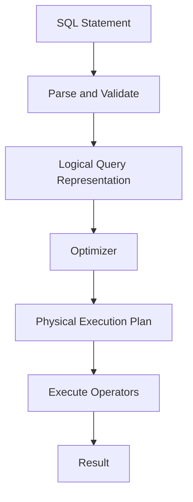
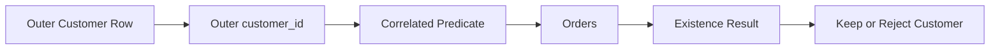
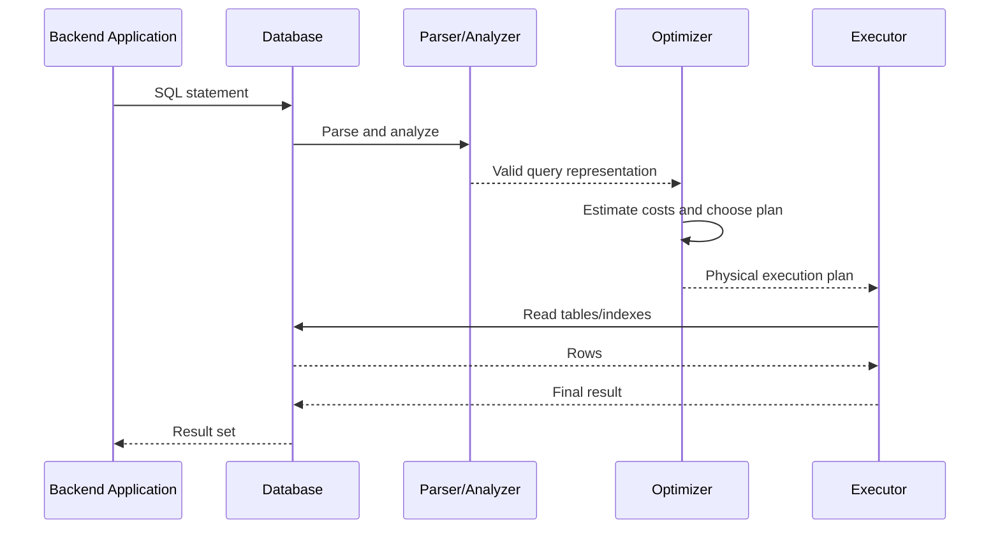

# 18- Subquery Execution Rules

## Overview

A subquery is a query nested inside another SQL statement. Its logical result may be a scalar value, a set of rows, or an existence condition, depending on how it is used.

Understanding **subquery execution rules** requires separating two different ideas:

- **Logical evaluation rules:** what result the SQL statement must produce according to SQL semantics.
- **Physical execution strategy:** how the database optimizer actually produces that result.

The database is not required to execute SQL text from top to bottom, nor is it required to execute a subquery literally every time it appears to be logically evaluated.

For production SQL, this distinction is critical. Query structure determines semantics, while the optimizer chooses an execution plan based on statistics, indexes, cardinality, available algorithms, and database-specific capabilities.

## Logical Query Processing vs Physical Execution

Consider:

```sql
SELECT
    c.id,
    c.email
FROM customers AS c
WHERE c.id IN (
    SELECT o.customer_id
    FROM orders AS o
    WHERE o.status = 'completed'
);
```

Logically, the subquery produces a set of customer IDs, and the outer query tests membership against that set.

Conceptually:



The optimizer may transform the query into a semi-join, hash-based operation, nested loop, or another equivalent strategy.

Therefore:

> The textual position of a subquery does not prescribe its physical execution order.

## The Logical Role of a Subquery

The execution behavior depends heavily on how the subquery is used.

| Subquery form | Expected result | Typical use |
|---|---|---|
| Scalar subquery | One value | Comparison or selected column |
| `IN` | Set of values | Membership |
| `NOT IN` | Set of values | Negative membership |
| `EXISTS` | Boolean | Existence |
| `NOT EXISTS` | Boolean | Non-existence |
| `FROM` subquery | Relation | Derived table |
| Correlated subquery | Depends on outer row | Per-row relationship |

For example:

```sql
SELECT
    p.id,
    p.price
FROM products AS p
WHERE p.price > (
    SELECT AVG(price)
    FROM products
);
```

The scalar subquery must produce one value.

In contrast:

```sql
SELECT
    c.id
FROM customers AS c
WHERE EXISTS (
    SELECT 1
    FROM orders AS o
    WHERE o.customer_id = c.id
);
```

The subquery is used as an existence predicate.

The database therefore does not need to materialize the actual value `1` for each matching order.

## Independent Subqueries

A non-correlated subquery has no dependency on the current outer row.

```sql
SELECT
    p.id,
    p.price
FROM products AS p
WHERE p.price > (
    SELECT AVG(price)
    FROM products
);
```

The subquery can logically be understood as producing a global value:

```text
products
   │
   ▼
AVG(price)
   │
   ▼
global average
   │
   ▼
compare against products
```

The optimizer may compute that aggregate once, inline it, or transform the statement into another equivalent plan.

### Important Rule

Do not assume:

> "The subquery is written inside the outer query, so it must execute repeatedly."

For a non-correlated subquery, there is no semantic dependency on the outer row.

## Correlated Subqueries

A correlated subquery references a value from the outer query.

```sql
SELECT
    c.id,
    c.email
FROM customers AS c
WHERE EXISTS (
    SELECT 1
    FROM orders AS o
    WHERE o.customer_id = c.id
);
```

The inner predicate:

```sql
o.customer_id = c.id
```

references `c.id` from the outer query.

The logical dependency is:



The result of the subquery can therefore differ depending on the current customer.

## The "Once Per Row" Misconception

A common interview statement is:

> "A correlated subquery always runs once for every outer row."

This is a useful **logical mental model**, but it is not a physical execution rule.

For example:

```sql
SELECT
    c.id
FROM customers AS c
WHERE EXISTS (
    SELECT 1
    FROM orders AS o
    WHERE o.customer_id = c.id
);
```

You can reason about it as:

```text
For each customer:
    determine whether a matching order exists
```

But PostgreSQL or another optimizer may transform this into a semi-join.

The physical plan might therefore process both relations using a set-oriented algorithm instead of repeatedly starting the inner query from scratch.

### Engineering Rule

Use the logical model to understand correctness.

Use `EXPLAIN` to understand performance.

## Scalar Subquery Rules

A scalar subquery is expected to return at most one value.

Example:

```sql
SELECT
    c.id,
    (
        SELECT MAX(o.created_at)
        FROM orders AS o
        WHERE o.customer_id = c.id
    ) AS last_order_at
FROM customers AS c;
```

The `MAX()` aggregate guarantees one result row for each outer customer, including `NULL` when no matching orders exist.

### Multiple Rows Are an Error

This query is unsafe if multiple orders can exist:

```sql
SELECT
    c.id,
    (
        SELECT o.id
        FROM orders AS o
        WHERE o.customer_id = c.id
    ) AS order_id
FROM customers AS c;
```

For a customer with multiple orders, the scalar subquery returns multiple rows.

In PostgreSQL this produces an error similar to:

```text
ERROR: more than one row returned by a subquery used as an expression
```

If one row is actually required, define deterministic selection:

```sql
SELECT
    c.id,
    (
        SELECT o.id
        FROM orders AS o
        WHERE o.customer_id = c.id
        ORDER BY o.created_at DESC, o.id DESC
        LIMIT 1
    ) AS latest_order_id
FROM customers AS c;
```

The ordering defines which row is selected.

## Zero-Row Scalar Results

A scalar subquery returning zero rows generally produces `NULL`.

For example:

```sql
SELECT
    c.id,
    (
        SELECT MAX(o.amount)
        FROM orders AS o
        WHERE o.customer_id = c.id
    ) AS max_order_amount
FROM customers AS c;
```

For a customer without orders:

```text
max_order_amount = NULL
```

This matters when the scalar result participates in predicates.

For example:

```sql
WHERE c.credit_limit > (
    SELECT MAX(o.amount)
    FROM orders AS o
    WHERE o.customer_id = c.id
)
```

If the subquery returns `NULL`, the comparison becomes `UNKNOWN`, so the row does not satisfy the `WHERE` predicate.

Do not confuse `NULL` with zero.

If the business requirement is to treat missing values as zero, state that explicitly:

```sql
WHERE c.credit_limit > COALESCE(
    (
        SELECT MAX(o.amount)
        FROM orders AS o
        WHERE o.customer_id = c.id
    ),
    0
)
```

## `EXISTS` Execution Rules

`EXISTS` asks whether the subquery produces at least one row.

```sql
SELECT
    c.id,
    c.email
FROM customers AS c
WHERE EXISTS (
    SELECT 1
    FROM orders AS o
    WHERE o.customer_id = c.id
);
```

The actual selected expression inside `EXISTS` is irrelevant.

These are semantically equivalent for existence testing:

```sql
EXISTS (
    SELECT 1
    FROM orders AS o
    WHERE o.customer_id = c.id
)
```

```sql
EXISTS (
    SELECT o.id
    FROM orders AS o
    WHERE o.customer_id = c.id
)
```

The database only needs to establish whether at least one qualifying row exists.

This makes `EXISTS` a natural representation of a semi-join.

## Early Termination With `EXISTS`

Because only existence matters, an execution strategy can stop searching once a qualifying row has been established.

Conceptually:

```text
Customer
   │
   ▼
Search matching orders
   │
   ├── Match found ──► TRUE ──► stop
   │
   └── No match ─────► FALSE
```

An appropriate index can make this especially efficient.

For:

```sql
WHERE o.customer_id = c.id
```

a basic index is:

```sql
CREATE INDEX idx_orders_customer_id
ON orders (customer_id);
```

The optimizer decides whether and how to use that index.

## `IN` Execution Rules

Consider:

```sql
SELECT
    c.id
FROM customers AS c
WHERE c.id IN (
    SELECT o.customer_id
    FROM orders AS o
    WHERE o.status = 'completed'
);
```

The inner query produces a set of values.

The database may implement membership using different physical strategies, such as:

- Hash-based membership.
- Nested-loop lookups.
- Semi-join transformation.
- Sorting and comparison.
- Index-assisted lookups.

The SQL expression does not prescribe which strategy must be used.

### `IN` and `NULL`

`IN` has three-valued logic implications.

Consider:

```sql
WHERE customer_id IN (
    SELECT customer_id
    FROM orders
)
```

If the subquery contains `NULL`, a non-matching value may produce `UNKNOWN` rather than `FALSE`.

This becomes particularly important with `NOT IN`.

## `NOT IN` Execution Rules

Consider:

```sql
SELECT
    c.id
FROM customers AS c
WHERE c.id NOT IN (
    SELECT o.customer_id
    FROM orders AS o
);
```

If the subquery returns a `NULL`, SQL's three-valued logic can cause unexpected results.

For example, conceptually:

```text
customer_id NOT IN (10, 20, NULL)
```

For a customer ID of `30`, SQL cannot establish that `30` is different from `NULL`, so the predicate can evaluate to `UNKNOWN`.

For anti-existence logic, prefer:

```sql
SELECT
    c.id
FROM customers AS c
WHERE NOT EXISTS (
    SELECT 1
    FROM orders AS o
    WHERE o.customer_id = c.id
);
```

This directly represents the requirement:

> No matching order exists.

## Subqueries in `FROM`

A subquery in `FROM` produces a derived relation.

```sql
SELECT
    category_stats.category_id,
    category_stats.avg_price
FROM (
    SELECT
        category_id,
        AVG(price) AS avg_price
    FROM products
    GROUP BY category_id
) AS category_stats;
```

The derived relation can be logically treated as an intermediate table.

However, whether the database physically materializes it depends on the database engine and query plan.

A common misconception is:

> "A subquery in `FROM` is always materialized into a temporary table."

That is not generally true.

The optimizer may inline, reorder, push predicates, or otherwise transform the operation.

## CTEs and Materialization

Common table expressions provide another way to structure intermediate query logic.

```sql
WITH category_stats AS (
    SELECT
        category_id,
        AVG(price) AS avg_price
    FROM products
    GROUP BY category_id
)
SELECT
    p.id,
    p.name,
    p.price,
    category_stats.avg_price
FROM products AS p
JOIN category_stats
    ON category_stats.category_id = p.category_id
WHERE p.price > category_stats.avg_price;
```

Modern PostgreSQL can inline many CTEs when doing so is beneficial.

PostgreSQL also supports explicit materialization control:

```sql
WITH category_stats AS MATERIALIZED (
    SELECT
        category_id,
        AVG(price) AS avg_price
    FROM products
    GROUP BY category_id
)
SELECT ...
```

and:

```sql
WITH category_stats AS NOT MATERIALIZED (
    SELECT
        category_id,
        AVG(price) AS avg_price
    FROM products
    GROUP BY category_id
)
SELECT ...
```

Materialization is an execution-plan concern, not simply a formatting choice.

## Predicate Pushdown

The optimizer may move filtering operations closer to the data source when the transformation preserves semantics.

For example:

```sql
SELECT *
FROM (
    SELECT
        id,
        category_id,
        price
    FROM products
) AS p
WHERE p.category_id = 10;
```

The optimizer may effectively apply:

```sql
WHERE category_id = 10
```

during the underlying table access rather than first constructing the entire derived relation.

This is one reason not to assume that every nested SQL expression creates a physical intermediate table.

## Subquery Flattening

Some subqueries can be transformed into equivalent joins or other relational operations.

For example:

```sql
SELECT
    c.id
FROM customers AS c
WHERE c.id IN (
    SELECT o.customer_id
    FROM orders AS o
    WHERE o.status = 'completed'
);
```

may be transformed into a semi-join.

Similarly, some derived tables can be merged into the surrounding query.

The optimizer considers:

- Cardinality.
- Statistics.
- Available indexes.
- Join algorithms.
- Predicate selectivity.
- Cost estimates.
- Query structure.

## Correlation and Decorrelating

A correlated query:

```sql
SELECT
    c.id
FROM customers AS c
WHERE EXISTS (
    SELECT 1
    FROM orders AS o
    WHERE o.customer_id = c.id
);
```

may be transformed into a semi-join.

This is known as **decorrelation**.

The purpose is to remove or reduce the dependency between inner and outer evaluation so the database can use more efficient set-oriented operations.

However, not every correlated query can be decorrelated.

Complex constructs involving:

- Aggregates.
- `LIMIT`.
- Ordering.
- Volatile functions.
- Complex predicates.
- Window functions.

may constrain optimizer transformations.

## `LIMIT` and Ordering

Consider:

```sql
SELECT
    c.id,
    (
        SELECT o.id
        FROM orders AS o
        WHERE o.customer_id = c.id
        ORDER BY o.created_at DESC
        LIMIT 1
    ) AS latest_order_id
FROM customers AS c;
```

The `LIMIT` changes the semantics.

The query needs one particular row, not merely any matching row.

Without:

```sql
ORDER BY
```

the selected row is not guaranteed to be the latest.

For deterministic behavior, use:

```sql
ORDER BY o.created_at DESC, o.id DESC
```

The second ordering column provides deterministic tie-breaking.

## Volatile Functions

Optimization is constrained when expressions have observable side effects or volatility.

For example, PostgreSQL distinguishes function volatility categories such as:

- `IMMUTABLE`
- `STABLE`
- `VOLATILE`

A volatile function can produce different results between evaluations, so the optimizer cannot freely treat every invocation as interchangeable.

This is another reason why:

> "The optimizer will always execute this subquery only once."

is an unsafe assumption.

SQL semantics and function volatility can constrain valid transformations.

## Evaluation of Expressions Is Not a General Programming-Language Rule

Do not reason about SQL like ordinary imperative code.

This:

```sql
SELECT
    expensive_expression(),
    another_expression()
FROM customers;
```

does not imply a simple procedural sequence such as:

```text
evaluate first expression
then evaluate second expression
then move to next row
```

SQL describes a declarative result.

The optimizer is free to reorder operations when doing so preserves the required semantics.

This matters when reasoning about:

- Function calls.
- `NULL`.
- Errors.
- Volatile expressions.
- Aggregation.
- Predicate evaluation.
- Subqueries.

Avoid relying on undocumented evaluation order.

## Query Planner Responsibilities

A production database generally performs several stages before executing a statement.



The optimizer may consider:

- Sequential scans.
- Index scans.
- Bitmap scans.
- Nested loops.
- Hash joins.
- Merge joins.
- Hash aggregates.
- Sort operations.
- Semi-joins.
- Anti-joins.
- Materialization.
- Parallel execution.

The exact operators depend on the database engine.

## `EXPLAIN` Is the Source of Truth for Performance

For PostgreSQL:

```sql
EXPLAIN (ANALYZE, BUFFERS)
SELECT
    c.id,
    c.email
FROM customers AS c
WHERE EXISTS (
    SELECT 1
    FROM orders AS o
    WHERE o.customer_id = c.id
      AND o.status = 'completed'
);
```

Use the plan to determine:

- Whether the subquery was transformed.
- Whether indexes are being used.
- Whether a semi-join or anti-join appears.
- Estimated vs actual row counts.
- Scan methods.
- Buffer usage.
- Join strategy.
- Actual execution time.

Do not optimize based on SQL nesting alone.

## Cardinality Drives Cost

A subquery's performance depends heavily on the number of rows involved.

Consider:

```sql
SELECT
    c.id
FROM customers AS c
WHERE EXISTS (
    SELECT 1
    FROM orders AS o
    WHERE o.customer_id = c.id
);
```

The cost depends on factors such as:

- Number of customers.
- Number of orders.
- Orders per customer.
- Selectivity of predicates.
- Distribution of customer IDs.
- Index availability.
- Database statistics.
- Concurrent workload.

A query that performs well with 10,000 customers may behave differently with 100 million customers.

## Indexes and Subquery Execution

For a correlated lookup:

```sql
WHERE o.customer_id = c.id
```

start by evaluating whether the inner relation has an appropriate index:

```sql
CREATE INDEX idx_orders_customer_id
ON orders (customer_id);
```

For:

```sql
WHERE o.customer_id = c.id
ORDER BY o.created_at DESC
LIMIT 1
```

a composite index can align with both the correlation predicate and ordering:

```sql
CREATE INDEX idx_orders_customer_created
ON orders (customer_id, created_at DESC);
```

If the query has a stable selective predicate, a PostgreSQL partial index may be appropriate:

```sql
CREATE INDEX idx_completed_orders_customer_created
ON orders (customer_id, created_at DESC)
WHERE status = 'completed';
```

Do not add indexes blindly. Every index increases:

- Storage.
- Write amplification.
- Vacuum/maintenance work.
- Backup size.
- Index management overhead.

## Common Execution Patterns

| SQL construct | Logical behavior | Possible physical strategy |
|---|---|---|
| Scalar subquery | Produce one value | Aggregate, lookup, nested execution |
| `EXISTS` | Test for at least one row | Semi-join, indexed lookup |
| `NOT EXISTS` | Test for no matching rows | Anti-join, indexed lookup |
| `IN` | Test membership | Hash membership, semi-join, index lookup |
| `NOT IN` | Test negative membership | Anti-membership operation with `NULL` semantics |
| Derived table | Produce relation | Inline transformation or materialization |
| Correlated aggregate | Calculate per outer row | Nested execution, transformed aggregate, join-like strategy |
| CTE | Named intermediate query | Inlining or materialization depending on engine/query |

The physical strategy is database-specific and should be verified with the execution plan.

## Production Guidelines

### Prefer Semantically Direct SQL

If the requirement is existence:

```sql
WHERE EXISTS (...)
```

is usually clearer than constructing a list and testing membership.

If the requirement is non-existence:

```sql
WHERE NOT EXISTS (...)
```

is usually clearer and safer than `NOT IN`, particularly when `NULL` is possible.

### Keep Correlation Predicates Indexable

Prefer straightforward relationship predicates:

```sql
o.customer_id = c.id
```

over expressions that prevent efficient access where possible.

For example, avoid unnecessary transformations such as:

```sql
LOWER(o.customer_id::text) = LOWER(c.id::text)
```

when the columns should simply be compared using their native types.

### Avoid Application-Level Materialization

Do not unnecessarily do this:

```python
customer_ids = list(
    Order.objects
    .filter(status="completed")
    .values_list("customer_id", flat=True)
)

customers = Customer.objects.filter(id__in=customer_ids)
```

For large result sets, this transfers data into application memory and creates unnecessary application/database work.

A database-side operation can often express the same requirement more efficiently:

```sql
SELECT
    c.id,
    c.email
FROM customers AS c
WHERE EXISTS (
    SELECT 1
    FROM orders AS o
    WHERE o.customer_id = c.id
      AND o.status = 'completed'
);
```

The same principle applies to Django, FastAPI, Celery workers, and other backend services.

### Benchmark at Realistic Scale

Test with representative:

- Row counts.
- Data distributions.
- Indexes.
- Concurrency.
- Query frequency.

A query that is fast in local development can become a database bottleneck in production.

### Monitor Expensive Queries

For PostgreSQL, `pg_stat_statements` is useful for identifying:

- High-total-time queries.
- High-mean-latency queries.
- Frequently executed queries.
- Queries with significant IO.

Combine monitoring with execution-plan analysis rather than optimizing based only on application latency.

## Common Mistakes

| Mistake | Problem | Better approach |
|---|---|---|
| Assuming SQL executes top-to-bottom | SQL is declarative | Reason about logical semantics and inspect plans |
| Assuming correlated means physically once per row | Confuses logical dependency with physical execution | Use `EXPLAIN` |
| Assuming every subquery is materialized | Optimizers can inline or transform queries | Inspect the plan |
| Assuming `EXISTS` needs returned data | `EXISTS` only needs row existence | Use `SELECT 1` conventionally |
| Using scalar subqueries that can return multiple rows | Causes runtime errors | Aggregate or deterministically select one row |
| Using `LIMIT 1` without `ORDER BY` | Selected row is undefined | Add deterministic ordering |
| Ignoring `NULL` with `NOT IN` | Three-valued logic changes results | Prefer `NOT EXISTS` for anti-existence |
| Adding indexes without measurement | Increases write and storage costs | Validate with plans and workload data |
| Treating one SQL statement as inherently cheap | A single statement can consume substantial DB resources | Measure execution cost and concurrency |
| Assuming optimizer transformations always occur | Query structure can constrain optimization | Inspect the actual plan |

## Interview Traps

### Does SQL execute the subquery before the outer query?

Not as a universal physical rule.

The subquery has logical semantics, but the optimizer can transform the complete statement into an equivalent physical plan.

### Does a correlated subquery always execute once per outer row?

No.

Correlation establishes a logical dependency. The optimizer may decorrelate the query or use a join-like strategy.

### Is a subquery always materialized?

No.

Depending on the database and query, the optimizer may inline it, transform it, or materialize it.

### Why can `EXISTS` be efficient?

The operation only requires determining whether at least one matching row exists. An execution strategy can stop looking once existence is established, and the optimizer may use a semi-join or suitable index.

### Why can `NOT IN` behave unexpectedly?

Because `NULL` participates in SQL's three-valued logic. A `NULL` in the subquery result can make a `NOT IN` predicate evaluate to `UNKNOWN`.

### What determines whether a subquery is fast?

There is no single property. Important factors include:

- Cardinality.
- Selectivity.
- Indexes.
- Statistics.
- Join strategy.
- Query frequency.
- Data distribution.
- Concurrency.
- Optimizer transformations.
- Database engine.

### How should you optimize a subquery?

A practical workflow is:

1. Establish the required semantics.
2. Measure the query under realistic data.
3. Run `EXPLAIN` or equivalent tooling.
4. Identify the actual expensive operator.
5. Evaluate indexes or query rewrites.
6. Benchmark the revised query.
7. Monitor it under production-like concurrency.

## Key Takeaways

- **SQL defines logical results, not a procedural execution sequence; the optimizer chooses the physical execution strategy.**
- **Correlated subqueries have outer-row dependencies, but they are not guaranteed to execute physically once per outer row.**
- **Subqueries may be transformed, flattened, decorrelated, inlined, or materialized depending on the database engine and query structure.**
- **Scalar subqueries must produce a valid scalar result, while `EXISTS` and `NOT EXISTS` are designed around row existence rather than returned values.**
- **Use execution plans, cardinality, indexes, statistics, and realistic workload measurements to reason about production performance.**