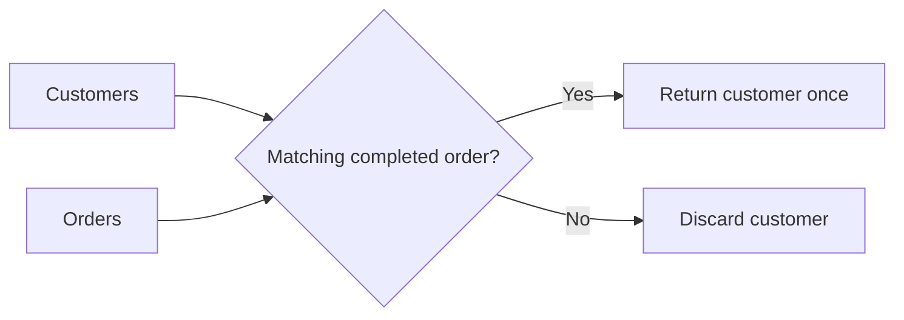
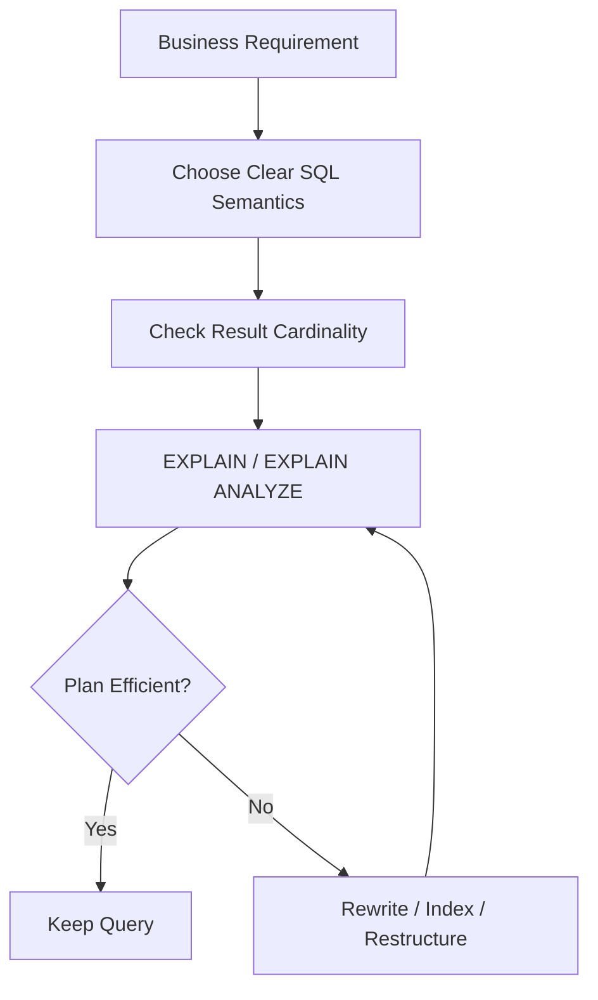

# 19- Subquery vs JOIN

## Overview

Subqueries and `JOIN`s are two ways to express relationships between data in SQL. Both can often solve the same business requirement, but they communicate different intent and may lead the optimizer toward different execution strategies.

Consider a common backend requirement:

> Return customers who have placed at least one completed order.

Using `EXISTS`:

```sql
SELECT
    c.id,
    c.email
FROM customers AS c
WHERE EXISTS (
    SELECT 1
    FROM orders AS o
    WHERE o.customer_id = c.id
      AND o.status = 'completed'
);
```

Using a `JOIN`:

```sql
SELECT DISTINCT
    c.id,
    c.email
FROM customers AS c
JOIN orders AS o
    ON o.customer_id = c.id
WHERE o.status = 'completed';
```

Both can produce the same customer set, but they have different relational semantics:

- `EXISTS` asks whether a related row exists.
- `JOIN` combines rows from two relations.
- `IN` tests membership in a set.
- `NOT EXISTS` expresses non-existence.
- A derived table can transform one relation before joining it.

The production-level question is therefore not simply:

> "Are joins faster than subqueries?"

The better question is:

> "Which query expresses the required semantics most directly, and what physical execution plan does the database choose?"

## Core Difference

A `JOIN` combines rows.

A subquery provides a value, relation, membership set, or predicate to another part of the query.

| Requirement | Natural SQL construct |
|---|---|
| Return columns from related rows | `JOIN` |
| Check whether a related row exists | `EXISTS` |
| Check whether no related row exists | `NOT EXISTS` |
| Compare against one calculated value | Scalar subquery |
| Test membership in a set | `IN` |
| Transform data before joining | Derived table / CTE |
| Aggregate related rows before joining | Derived table / CTE |
| Select one related row | Correlated subquery, lateral join, window function, or other appropriate pattern |

The distinction is primarily about **semantics and cardinality**, not syntax preference.

## `JOIN` Semantics

A normal inner join combines every matching pair of rows.

```sql
SELECT
    c.id,
    c.email,
    o.id AS order_id
FROM customers AS c
JOIN orders AS o
    ON o.customer_id = c.id;
```

If one customer has five orders, that customer can appear five times.

Conceptually:

```text
Customer A
    │
    ├── Order 1
    ├── Order 2
    ├── Order 3
    ├── Order 4
    └── Order 5

JOIN result:
Customer A appears 5 times
```

This is correct because a join represents row combinations.

## `EXISTS` Semantics

`EXISTS` does not combine matching rows into the result.

```sql
SELECT
    c.id,
    c.email
FROM customers AS c
WHERE EXISTS (
    SELECT 1
    FROM orders AS o
    WHERE o.customer_id = c.id
);
```

A customer either satisfies the existence condition or does not.

If a customer has five orders, the customer still appears once.

Conceptually:

```text
Customer A
    │
    ├── Order 1 ──┐
    ├── Order 2 ──┤
    ├── Order 3 ──┤──► EXISTS = TRUE
    ├── Order 4 ──┤
    └── Order 5 ──┘

Result:
Customer A appears once
```

This makes `EXISTS` the more direct expression when the related rows are only being used as a condition.

## Why `DISTINCT` Can Be a Warning Sign

A common rewrite is:

```sql
SELECT DISTINCT
    c.id,
    c.email
FROM customers AS c
JOIN orders AS o
    ON o.customer_id = c.id
WHERE o.status = 'completed';
```

The `DISTINCT` is required because the join can generate multiple rows per customer.

Compare this with:

```sql
SELECT
    c.id,
    c.email
FROM customers AS c
WHERE EXISTS (
    SELECT 1
    FROM orders AS o
    WHERE o.customer_id = c.id
      AND o.status = 'completed'
);
```

The second query directly represents the requirement.

Using `DISTINCT` is not inherently wrong, but it can indicate that the query first creates duplicate rows and then removes them.

That may introduce additional:

- Sorting.
- Hashing.
- Memory consumption.
- CPU work.
- Temporary storage.

The optimizer may eliminate or transform some of this work, so the execution plan remains the source of truth.

## Semi-Join Behavior

`EXISTS` commonly corresponds conceptually to a **semi-join**.

A semi-join returns rows from the left relation for which at least one matching row exists on the right.



This differs from a normal inner join because the matching order rows are not themselves returned.

Many optimizers can transform:

```sql
WHERE EXISTS (...)
```

into an efficient semi-join execution strategy.

## Anti-Join Behavior

Similarly, `NOT EXISTS` commonly corresponds to an anti-join.

```sql
SELECT
    c.id,
    c.email
FROM customers AS c
WHERE NOT EXISTS (
    SELECT 1
    FROM orders AS o
    WHERE o.customer_id = c.id
);
```

The database needs customers for which no matching order exists.

This is different from:

```sql
LEFT JOIN orders AS o
    ON o.customer_id = c.id
WHERE o.id IS NULL;
```

The two can be semantically equivalent when the join and nullability conditions are correct, and optimizers can transform one into an anti-join.

For anti-existence logic, `NOT EXISTS` usually communicates the intent more clearly and avoids the `NULL` trap associated with `NOT IN`.

## `IN` vs `JOIN`

Consider:

```sql
SELECT
    c.id,
    c.email
FROM customers AS c
WHERE c.id IN (
    SELECT o.customer_id
    FROM orders AS o
    WHERE o.status = 'completed'
);
```

A join-based equivalent is:

```sql
SELECT DISTINCT
    c.id,
    c.email
FROM customers AS c
JOIN orders AS o
    ON o.customer_id = c.id
WHERE o.status = 'completed';
```

The important difference is again cardinality.

`IN` expresses:

> Is this customer ID present in the qualifying set?

`JOIN` expresses:

> Combine this customer with every matching qualifying order.

The optimizer may transform the `IN` query into a semi-join, so the physical plans may be very similar.

## Scalar Subquery vs `JOIN`

Suppose each customer needs the date of their latest order.

A correlated scalar subquery can express this directly:

```sql
SELECT
    c.id,
    c.email,
    (
        SELECT MAX(o.created_at)
        FROM orders AS o
        WHERE o.customer_id = c.id
    ) AS last_order_at
FROM customers AS c;
```

An aggregate join can express the same result:

```sql
SELECT
    c.id,
    c.email,
    MAX(o.created_at) AS last_order_at
FROM customers AS c
LEFT JOIN orders AS o
    ON o.customer_id = c.id
GROUP BY
    c.id,
    c.email;
```

The second query explicitly joins and aggregates.

The first query expresses:

> For this customer, calculate the maximum order timestamp.

Neither is universally faster.

The optimizer may produce substantially similar plans after transformations.

## Subquery for Aggregation Before a Join

Sometimes a subquery makes the intended data flow clearer.

Suppose the requirement is:

> Return customers whose total completed order value exceeds 10,000.

A derived table can aggregate orders first:

```sql
SELECT
    c.id,
    c.email,
    order_totals.total_amount
FROM customers AS c
JOIN (
    SELECT
        customer_id,
        SUM(amount) AS total_amount
    FROM orders
    WHERE status = 'completed'
    GROUP BY customer_id
) AS order_totals
    ON order_totals.customer_id = c.id
WHERE order_totals.total_amount > 10000;
```

The intermediate relation has one row per customer:

```text
orders
   │
   ▼
filter completed orders
   │
   ▼
GROUP BY customer_id
   │
   ▼
customer_id + total_amount
   │
   ▼
JOIN customers
```

This can be easier to reason about than joining all orders and aggregating afterward.

## Equivalent Join With `HAVING`

The same requirement can often be expressed as:

```sql
SELECT
    c.id,
    c.email,
    SUM(o.amount) AS total_amount
FROM customers AS c
JOIN orders AS o
    ON o.customer_id = c.id
WHERE o.status = 'completed'
GROUP BY
    c.id,
    c.email
HAVING SUM(o.amount) > 10000;
```

Both approaches can be valid.

The choice depends on:

- Required result shape.
- Readability.
- Additional filters.
- Optimizer behavior.
- Data cardinality.
- Indexes.
- Database engine.
- Maintainability.

## When a `JOIN` Is Usually Better

Use a `JOIN` when you need columns from both relations.

For example:

```sql
SELECT
    o.id,
    o.created_at,
    c.email
FROM orders AS o
JOIN customers AS c
    ON c.id = o.customer_id
WHERE o.status = 'completed';
```

The query needs:

- Order information.
- Customer information.

A join naturally expresses that relationship.

A subquery would often make the query unnecessarily complicated.

## When `EXISTS` Is Usually Better

Use `EXISTS` when the related table only determines whether the outer row qualifies.

```sql
SELECT
    p.id,
    p.name
FROM products AS p
WHERE EXISTS (
    SELECT 1
    FROM inventory AS i
    WHERE i.product_id = p.id
      AND i.quantity > 0
);
```

The inventory columns are not needed in the result.

The query requirement is simply:

> Return products that have available inventory.

`EXISTS` makes that intent explicit.

## When a Subquery Is Usually Better

A subquery is often appropriate when the intermediate result has a distinct logical meaning.

### Scalar Calculation

```sql
SELECT
    p.id,
    p.price,
    p.price - (
        SELECT AVG(price)
        FROM products
    ) AS difference_from_average
FROM products AS p;
```

### Existence

```sql
WHERE EXISTS (...)
```

### Non-Existence

```sql
WHERE NOT EXISTS (...)
```

### Derived Aggregation

```sql
FROM (
    SELECT ...
    GROUP BY ...
) AS aggregated_data
```

The key is not avoiding subqueries. The goal is to use the construct that best represents the relational operation.

## When a `JOIN` Is Usually Better for Reporting

Reporting queries frequently need data from multiple entities:

```sql
SELECT
    c.id,
    c.email,
    COUNT(o.id) AS order_count,
    SUM(o.amount) AS revenue
FROM customers AS c
LEFT JOIN orders AS o
    ON o.customer_id = c.id
GROUP BY
    c.id,
    c.email;
```

A join is natural because the result contains attributes from customers and aggregates derived from orders.

Trying to express every relationship through nested subqueries can make reporting queries harder to optimize and maintain.

## When a Subquery Prevents Duplicate Rows

Suppose the requirement is:

> Find customers who have a completed order.

This:

```sql
SELECT DISTINCT c.id
FROM customers AS c
JOIN orders AS o
    ON o.customer_id = c.id
WHERE o.status = 'completed';
```

creates potentially many intermediate rows.

This:

```sql
SELECT c.id
FROM customers AS c
WHERE EXISTS (
    SELECT 1
    FROM orders AS o
    WHERE o.customer_id = c.id
      AND o.status = 'completed'
);
```

naturally preserves one output row per customer.

This is an important senior-level consideration:

> Query performance is often determined by intermediate row volume, not just final result size.

## Performance Is Not Determined by Syntax Alone

Consider these two queries:

```sql
SELECT c.id
FROM customers AS c
WHERE EXISTS (
    SELECT 1
    FROM orders AS o
    WHERE o.customer_id = c.id
);
```

and:

```sql
SELECT DISTINCT c.id
FROM customers AS c
JOIN orders AS o
    ON o.customer_id = c.id;
```

A database optimizer may transform both into efficient join-like plans.

Therefore, avoid rules such as:

- "Joins are always faster."
- "Subqueries are always slower."
- "Correlated subqueries are always bad."
- "Joins are always better for production."

These statements are too broad.

The correct workflow is:



## Intermediate Result Cardinality

One of the most important differences between joins and existence predicates is intermediate cardinality.

Assume:

```text
1,000,000 customers
10,000,000 orders
```

If the average customer has several orders, a join may produce millions of intermediate rows before aggregation or `DISTINCT`.

An `EXISTS` condition may only need to establish whether a qualifying order exists.

This can significantly reduce work when the physical plan can exploit semi-join or indexed lookup behavior.

However, if the query needs order attributes anyway, a join is unavoidable and appropriate.

## Indexing Considerations

For:

```sql
WHERE EXISTS (
    SELECT 1
    FROM orders AS o
    WHERE o.customer_id = c.id
      AND o.status = 'completed'
)
```

a useful index may be:

```sql
CREATE INDEX idx_orders_customer_status
ON orders (customer_id, status);
```

The ideal index depends on:

- Predicate selectivity.
- Column cardinality.
- Query frequency.
- Data distribution.
- Other workload patterns.
- Database engine.

For PostgreSQL, a partial index may be beneficial when the predicate is stable and selective:

```sql
CREATE INDEX idx_completed_orders_customer
ON orders (customer_id)
WHERE status = 'completed';
```

Always validate the index with the actual execution plan and workload.

## Query Planner Comparison

For PostgreSQL:

```sql
EXPLAIN (ANALYZE, BUFFERS)
SELECT
    c.id
FROM customers AS c
WHERE EXISTS (
    SELECT 1
    FROM orders AS o
    WHERE o.customer_id = c.id
      AND o.status = 'completed'
);
```

Compare it with:

```sql
EXPLAIN (ANALYZE, BUFFERS)
SELECT DISTINCT
    c.id
FROM customers AS c
JOIN orders AS o
    ON o.customer_id = c.id
WHERE o.status = 'completed';
```

Look for:

| Plan characteristic | Why it matters |
|---|---|
| Actual rows | Shows real cardinality |
| Estimated rows | Shows optimizer assumptions |
| Hash Join / Semi Join | Reveals relational strategy |
| Nested Loop | May be excellent for selective indexed lookups |
| Sort | Can be expensive at large cardinality |
| HashAggregate | Often associated with duplicate removal or aggregation |
| Index Scan | Indicates index-assisted access |
| Sequential Scan | May be appropriate for large/full-table access |
| Buffers | Shows memory/cache and IO behavior |
| Execution time | Measures actual query cost |

The plan should determine the optimization decision.

## Correlated Subquery vs Join

Consider:

```sql
SELECT
    c.id,
    (
        SELECT MAX(o.amount)
        FROM orders AS o
        WHERE o.customer_id = c.id
    ) AS max_order_amount
FROM customers AS c;
```

A join-based version is:

```sql
SELECT
    c.id,
    MAX(o.amount) AS max_order_amount
FROM customers AS c
LEFT JOIN orders AS o
    ON o.customer_id = c.id
GROUP BY c.id;
```

The correlated form can be highly readable when the calculation is naturally described as a per-customer lookup.

The join form can be preferable when multiple aggregates or related columns are required.

For example:

```sql
SELECT
    c.id,
    COUNT(o.id) AS order_count,
    SUM(o.amount) AS total_amount,
    MAX(o.amount) AS max_order_amount
FROM customers AS c
LEFT JOIN orders AS o
    ON o.customer_id = c.id
GROUP BY c.id;
```

Using separate correlated subqueries for all three metrics would often be unnecessarily repetitive.

## Multiple Correlated Subqueries

Avoid repeatedly scanning the same relationship:

```sql
SELECT
    c.id,
    (
        SELECT COUNT(*)
        FROM orders AS o
        WHERE o.customer_id = c.id
    ) AS order_count,
    (
        SELECT SUM(o.amount)
        FROM orders AS o
        WHERE o.customer_id = c.id
    ) AS total_amount,
    (
        SELECT MAX(o.created_at)
        FROM orders AS o
        WHERE o.customer_id = c.id
    ) AS last_order_at
FROM customers AS c;
```

A grouped join may provide a cleaner relational representation:

```sql
SELECT
    c.id,
    COUNT(o.id) AS order_count,
    SUM(o.amount) AS total_amount,
    MAX(o.created_at) AS last_order_at
FROM customers AS c
LEFT JOIN orders AS o
    ON o.customer_id = c.id
GROUP BY c.id;
```

The optimizer may transform individual queries, but expressing several related aggregates in one grouped operation can avoid redundant logical work and is generally easier to maintain.

## Join Predicate Placement Matters

Compare:

```sql
SELECT
    c.id,
    o.id
FROM customers AS c
LEFT JOIN orders AS o
    ON o.customer_id = c.id
   AND o.status = 'completed';
```

with:

```sql
SELECT
    c.id,
    o.id
FROM customers AS c
LEFT JOIN orders AS o
    ON o.customer_id = c.id
WHERE o.status = 'completed';
```

These are **not equivalent**.

The first preserves customers without completed orders and produces `NULL` order columns.

The second filters those rows in the `WHERE` clause, effectively turning the outer join into inner-join behavior for that condition.

This is a common production bug.

## `LEFT JOIN ... IS NULL` vs `NOT EXISTS`

These patterns are often equivalent:

```sql
SELECT
    c.id
FROM customers AS c
LEFT JOIN orders AS o
    ON o.customer_id = c.id
WHERE o.id IS NULL;
```

and:

```sql
SELECT
    c.id
FROM customers AS c
WHERE NOT EXISTS (
    SELECT 1
    FROM orders AS o
    WHERE o.customer_id = c.id
);
```

`NOT EXISTS` is generally easier to read when the business requirement is explicitly:

> Customers for whom no matching order exists.

The `LEFT JOIN` form can be useful when the query also needs columns from the joined relation or when the join itself is part of a larger result.

Be careful with nullable columns when using `LEFT JOIN ... IS NULL`. Testing a column that is itself nullable can make the intent ambiguous. A non-nullable key such as a primary key is safer.

## Security Considerations

Neither subqueries nor joins inherently make a query more secure.

The primary SQL security concern remains safe parameterization.

In Django:

```python
Customer.objects.filter(
    orders__status="completed"
)
```

or:

```python
from django.db.models import Exists, OuterRef

completed_orders = Order.objects.filter(
    customer_id=OuterRef("pk"),
    status="completed",
)

customers = Customer.objects.annotate(
    has_completed_order=Exists(completed_orders),
).filter(
    has_completed_order=True,
)
```

The ORM generates parameterized SQL rather than requiring application-level string concatenation.

Avoid:

```python
query = f"""
SELECT *
FROM customers
WHERE id IN ({user_supplied_ids})
"""
```

Build queries using parameterized APIs or ORM mechanisms.

## Backend Engineering Considerations

For Django and similar backend frameworks, the choice between subqueries and joins can affect:

- Query count.
- Database CPU.
- Network payload.
- Application memory.
- Serialization time.
- API latency.
- Lock duration.
- Connection utilization.

For example, replacing an application-side two-step lookup:

```python
customer_ids = list(
    Order.objects
    .filter(status="completed")
    .values_list("customer_id", flat=True)
)

customers = Customer.objects.filter(id__in=customer_ids)
```

with a database-side relationship query can avoid transferring a potentially large ID list through the application.

Django can also express existence semantics directly:

```python
from django.db.models import Exists, OuterRef

completed_orders = Order.objects.filter(
    customer_id=OuterRef("pk"),
    status="completed",
)

customers = Customer.objects.filter(
    Exists(completed_orders)
)
```

This keeps the relationship evaluation inside the database.

## Production Decision Framework

Use the following decision process.

### Ask What the Result Represents

If the result is:

> "Rows from both tables"

prefer a join.

If the result is:

> "Rows from the outer table that have a related match"

consider `EXISTS`.

If the result is:

> "Rows from the outer table that have no related match"

consider `NOT EXISTS`.

If the result is:

> "One calculated value"

consider a scalar subquery.

If the result is:

> "An aggregated relation that will be joined"

consider a derived table or CTE.

### Then Check Cardinality

Ask:

- How many rows can each side produce?
- Can the join multiply rows?
- Is `DISTINCT` required?
- Is aggregation required?
- Can existence semantics avoid generating unnecessary intermediate rows?

### Finally Inspect the Plan

Use:

```sql
EXPLAIN (ANALYZE, BUFFERS)
```

for PostgreSQL and the equivalent tooling for your database.

Do not choose a query form solely from generalized performance advice.

## Common Mistakes

| Mistake | Why it happens | Better approach |
|---|---|---|
| "JOIN is always faster" | Oversimplified performance rule | Compare execution plans |
| Using `JOIN` only to test existence | Ignores row multiplication | Prefer `EXISTS` |
| Adding `DISTINCT` after every join | Attempts to hide duplicates | Understand join cardinality |
| Assuming subqueries are always slow | Confuses syntax with execution strategy | Inspect the physical plan |
| Repeating correlated subqueries | Each metric is written independently | Consider grouped aggregation |
| Using `NOT IN` for anti-joins | Easy to write but dangerous with `NULL` | Prefer `NOT EXISTS` |
| Filtering a `LEFT JOIN` table in `WHERE` | Accidentally changes outer-join semantics | Put appropriate predicates in `ON` |
| Joining when related columns are unnecessary | Produces unnecessary intermediate rows | Use `EXISTS` |
| Using subqueries when many related columns are required | Makes query harder to reason about | Use an appropriate join |
| Optimizing without `EXPLAIN` | Relies on assumptions | Measure actual plans |

## Interview Traps

### Are joins faster than subqueries?

Not universally.

Modern optimizers can transform many subqueries into joins, semi-joins, anti-joins, or other equivalent operations.

The actual execution plan determines performance.

### Why can `EXISTS` be better than `JOIN`?

When only existence matters, `EXISTS` expresses the requirement directly and can avoid generating duplicate outer rows.

### Why does `JOIN` sometimes require `DISTINCT`?

Because one outer row can match multiple inner rows. The join correctly produces multiple combinations, while `DISTINCT` removes duplicates afterward.

### Is `EXISTS` always faster than `JOIN`?

No.

If the query needs columns from the related table, a join is generally the natural operation. Even when only existence is needed, the optimizer may produce equivalent plans.

### Can a correlated subquery outperform a join?

Yes.

A selective correlated lookup with a suitable index can be efficient, especially when only a small amount of related data is needed. The optimizer may also transform the correlated query into a join-like plan.

### Why is `NOT EXISTS` often preferred over `NOT IN`?

`NOT EXISTS` naturally expresses anti-existence and does not have the same problematic `NULL` semantics as `NOT IN`.

### What is the most important difference between `JOIN` and `EXISTS`?

A join combines matching rows; `EXISTS` tests whether a matching row exists.

That difference directly affects result cardinality.

## Key Takeaways

- **Choose between subqueries and joins based on relational semantics and required result cardinality, not blanket performance rules.**
- **Use `EXISTS` and `NOT EXISTS` when related rows only determine whether an outer row qualifies.**
- **Use `JOIN` when related rows or their attributes must participate in the result, aggregation, or further relational operations.**
- **A join can multiply rows, while existence predicates naturally preserve the outer row's cardinality; unnecessary `DISTINCT` can hide this problem.**
- **Use `EXPLAIN` with realistic data and indexes to determine whether a subquery or join is actually efficient in production.**