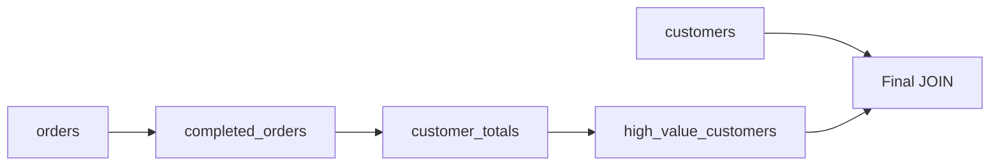

# 20- Subquery vs CTE

## Overview

Subqueries and Common Table Expressions (CTEs) both allow a SQL query to be decomposed into smaller logical operations. The main difference is how the intermediate result is named, scoped, reused, and potentially optimized.

A subquery is embedded directly inside another SQL expression:

```sql
SELECT
    c.id,
    c.email
FROM customers AS c
WHERE c.id IN (
    SELECT o.customer_id
    FROM orders AS o
    WHERE o.status = 'completed'
);
```

A CTE gives the intermediate query a name:

```sql
WITH completed_customers AS (
    SELECT DISTINCT
        customer_id
    FROM orders
    WHERE status = 'completed'
)
SELECT
    c.id,
    c.email
FROM customers AS c
JOIN completed_customers AS cc
    ON cc.customer_id = c.id;
```

Both express the same logical relationship, but CTEs become especially useful when a query contains multiple stages, repeated intermediate logic, recursive processing, or complex transformations.

The important production-level distinction is:

> A CTE is primarily a query-structuring mechanism, not automatically a performance optimization or temporary table.

Modern optimizers can inline or transform CTEs and subqueries depending on the database engine, version, query shape, and optimization barriers.

## Subqueries

A subquery is a query nested inside another SQL statement.

Common forms include:

- Scalar subqueries.
- `IN` subqueries.
- `EXISTS` subqueries.
- Correlated subqueries.
- Derived tables in `FROM`.
- Subqueries used in `HAVING`.

For example:

```sql
SELECT
    p.id,
    p.name
FROM products AS p
WHERE p.price > (
    SELECT AVG(price)
    FROM products
);
```

The inner query calculates one value that the outer query consumes.

### When Subqueries Are a Good Fit

Use a subquery when the intermediate operation is:

- Local to one expression.
- Used only once.
- Naturally represented as a predicate.
- An existence check.
- A scalar calculation.
- Small enough that naming it separately would add unnecessary structure.

For example:

```sql
SELECT
    c.id,
    c.email
FROM customers AS c
WHERE EXISTS (
    SELECT 1
    FROM orders AS o
    WHERE o.customer_id = c.id
      AND o.status = 'completed'
);
```

The subquery is tightly coupled to the predicate, so extracting it into a CTE would not necessarily improve the query.

## Common Table Expressions

A CTE is introduced using the `WITH` clause.

```sql
WITH completed_orders AS (
    SELECT
        id,
        customer_id,
        amount,
        created_at
    FROM orders
    WHERE status = 'completed'
)
SELECT
    customer_id,
    SUM(amount) AS total_amount
FROM completed_orders
GROUP BY customer_id;
```

The CTE gives the intermediate relation a meaningful name:

```text
orders
   │
   ▼
completed_orders
   │
   ▼
aggregation
   │
   ▼
final result
```

This can make complex SQL significantly easier to reason about.

## Why CTEs Exist

CTEs address several practical problems:

- Complex nested queries become difficult to read.
- Intermediate transformations need meaningful names.
- The same logical stage may be referenced multiple times.
- Recursive queries require a recursive structure.
- Large analytical queries benefit from explicit processing stages.
- Developers need a clean way to compose multiple relational operations.

A CTE therefore provides a **named query scope** within a statement.

It does not necessarily imply that the database physically creates and stores the intermediate result.

## Basic Comparison

| Characteristic | Subquery | CTE |
|---|---|---|
| Syntax | Nested query | `WITH ... AS (...)` |
| Naming | Usually anonymous | Explicit name |
| Scope | Expression or query location | Entire statement |
| Readability | Good for local logic | Better for multi-stage queries |
| Reuse | Usually awkward | Can reference the CTE multiple times |
| Recursion | Not the normal mechanism | Supports recursive CTEs |
| Performance | Depends on optimizer | Depends on optimizer |
| Materialization | Engine-dependent | Engine-dependent / configurable in some databases |
| Best use | Local computation or predicate | Complex query composition |

## Query Structure

A deeply nested query can become difficult to maintain:

```sql
SELECT
    customer_id,
    total_amount
FROM (
    SELECT
        customer_id,
        SUM(amount) AS total_amount
    FROM (
        SELECT
            customer_id,
            amount
        FROM orders
        WHERE status = 'completed'
    ) AS completed_orders
    GROUP BY customer_id
) AS customer_totals
WHERE total_amount > 10000;
```

The same logic can be expressed with a CTE:

```sql
WITH completed_orders AS (
    SELECT
        customer_id,
        amount
    FROM orders
    WHERE status = 'completed'
),
customer_totals AS (
    SELECT
        customer_id,
        SUM(amount) AS total_amount
    FROM completed_orders
    GROUP BY customer_id
)
SELECT
    customer_id,
    total_amount
FROM customer_totals
WHERE total_amount > 10000;
```

The second form makes the logical stages explicit.

## Multiple CTEs

CTEs can be chained:

```sql
WITH completed_orders AS (
    SELECT
        customer_id,
        amount
    FROM orders
    WHERE status = 'completed'
),
customer_totals AS (
    SELECT
        customer_id,
        SUM(amount) AS total_amount
    FROM completed_orders
    GROUP BY customer_id
),
high_value_customers AS (
    SELECT
        customer_id,
        total_amount
    FROM customer_totals
    WHERE total_amount >= 10000
)
SELECT
    c.id,
    c.email,
    h.total_amount
FROM customers AS c
JOIN high_value_customers AS h
    ON h.customer_id = c.id;
```

This resembles a data-processing pipeline:



This structure is particularly useful for reporting, analytics, data migrations, and complex business queries.

## CTE vs Derived Table

A derived table is a subquery in the `FROM` clause:

```sql
SELECT
    customer_id,
    total_amount
FROM (
    SELECT
        customer_id,
        SUM(amount) AS total_amount
    FROM orders
    GROUP BY customer_id
) AS totals;
```

The equivalent CTE is:

```sql
WITH totals AS (
    SELECT
        customer_id,
        SUM(amount) AS total_amount
    FROM orders
    GROUP BY customer_id
)
SELECT
    customer_id,
    total_amount
FROM totals;
```

For a single use, these may be logically equivalent.

The CTE is often preferable when the intermediate result is conceptually important or the query contains multiple stages.

## Readability vs Performance

One of the most common misconceptions is:

> "CTEs are faster because they execute once."

That is not a reliable rule.

The optimizer may:

- Inline a CTE.
- Push predicates into it.
- Reorder operations.
- Transform it into joins.
- Materialize it.
- Use a temporary intermediate result when required or beneficial.

The exact behavior depends on the database engine and query.

Therefore:

```text
SQL syntax
    │
    ▼
Logical query representation
    │
    ▼
Optimizer transformations
    │
    ▼
Physical execution plan
    │
    ▼
Actual execution
```

The SQL construct alone does not determine performance.

## PostgreSQL CTE Materialization

PostgreSQL supports explicit control over CTE materialization.

A CTE can be declared as:

```sql
WITH totals AS MATERIALIZED (
    SELECT
        customer_id,
        SUM(amount) AS total_amount
    FROM orders
    GROUP BY customer_id
)
SELECT *
FROM totals
WHERE total_amount > 10000;
```

Or:

```sql
WITH totals AS NOT MATERIALIZED (
    SELECT
        customer_id,
        SUM(amount) AS total_amount
    FROM orders
    GROUP BY customer_id
)
SELECT *
FROM totals
WHERE total_amount > 10000;
```

The exact optimizer behavior depends on the PostgreSQL version and query characteristics.

`MATERIALIZED` can be useful when an intermediate result should act as an optimization boundary or when evaluating the underlying query once and reusing its result is beneficial.

`NOT MATERIALIZED` can allow more optimizer freedom, such as predicate pushdown.

Do not use either directive simply because it sounds faster. Validate the effect with `EXPLAIN (ANALYZE, BUFFERS)`.

## CTEs as Optimization Barriers

Historically, PostgreSQL treated CTEs as optimization fences in versions before PostgreSQL 12.

That meant a CTE could prevent the optimizer from freely pushing predicates or restructuring the query.

Modern PostgreSQL can inline eligible CTEs by default, but explicit materialization can still create an optimization boundary.

This matters when migrating or maintaining older PostgreSQL systems.

Production queries should therefore be evaluated against the actual database version rather than relying on older CTE behavior.

## When Materialization Is Useful

Materialization can be useful when:

- The intermediate result is expensive to compute.
- The result is referenced multiple times.
- Recomputing the CTE would be expensive.
- An optimization boundary is intentionally desired.
- The intermediate dataset is substantially smaller than the underlying source.

For example:

```sql
WITH expensive_customer_metrics AS MATERIALIZED (
    SELECT
        customer_id,
        SUM(amount) AS total_amount
    FROM orders
    GROUP BY customer_id
)
SELECT ...
FROM expensive_customer_metrics AS a
JOIN expensive_customer_metrics AS b
    ON a.customer_id = b.customer_id;
```

However, materialization can also be harmful if it creates a large intermediate result that could otherwise have been filtered earlier.

## Predicate Pushdown

Consider:

```sql
WITH customer_totals AS (
    SELECT
        customer_id,
        SUM(amount) AS total_amount
    FROM orders
    GROUP BY customer_id
)
SELECT
    customer_id,
    total_amount
FROM customer_totals
WHERE customer_id = 42;
```

An optimizer may be able to push the customer filter into the underlying operation when the CTE is eligible for inlining.

If the CTE is forcibly materialized, the database may need to compute the broader intermediate result first.

This is why materialization decisions should be based on execution plans rather than intuition.

## CTE Reuse

One major advantage of CTEs is making repeated logical use explicit.

```sql
WITH active_customers AS (
    SELECT
        id,
        email
    FROM customers
    WHERE status = 'active'
)
SELECT
    a.email
FROM active_customers AS a
WHERE a.id IN (
    SELECT id
    FROM active_customers
    WHERE email LIKE '%@example.com'
);
```

The CTE provides a reusable logical relation within the statement.

However, repeated references do not automatically mean the database materializes the CTE. The optimizer decides how to execute it unless materialization behavior is explicitly controlled.

## Subquery vs CTE for `EXISTS`

A subquery is usually clearer for an existence predicate:

```sql
SELECT
    c.id,
    c.email
FROM customers AS c
WHERE EXISTS (
    SELECT 1
    FROM orders AS o
    WHERE o.customer_id = c.id
      AND o.status = 'completed'
);
```

Turning this into a CTE can add unnecessary structure:

```sql
WITH completed_customers AS (
    SELECT DISTINCT customer_id
    FROM orders
    WHERE status = 'completed'
)
SELECT
    c.id,
    c.email
FROM customers AS c
JOIN completed_customers AS cc
    ON cc.customer_id = c.id;
```

The CTE is valid, but the original `EXISTS` directly represents the requirement.

A useful rule is:

> Do not extract a simple predicate into a CTE merely to avoid writing a subquery.

## CTE for Multi-Stage Aggregation

CTEs become more valuable when a query has multiple meaningful transformations.

For example:

```sql
WITH completed_orders AS (
    SELECT
        customer_id,
        amount
    FROM orders
    WHERE status = 'completed'
),
customer_revenue AS (
    SELECT
        customer_id,
        SUM(amount) AS revenue
    FROM completed_orders
    GROUP BY customer_id
),
customer_segments AS (
    SELECT
        customer_id,
        revenue,
        CASE
            WHEN revenue >= 100000 THEN 'enterprise'
            WHEN revenue >= 10000 THEN 'high_value'
            ELSE 'standard'
        END AS segment
    FROM customer_revenue
)
SELECT
    c.id,
    c.email,
    cs.revenue,
    cs.segment
FROM customers AS c
JOIN customer_segments AS cs
    ON cs.customer_id = c.id;
```

Each CTE represents a meaningful transformation.

This is easier to review, test, and modify than deeply nested SQL.

## Recursive CTEs

Recursive CTEs are a major capability that ordinary subqueries do not provide in the same way.

For example, organizational hierarchies can be traversed using:

```sql
WITH RECURSIVE employee_tree AS (
    SELECT
        id,
        manager_id,
        name,
        0 AS depth
    FROM employees
    WHERE id = 100

    UNION ALL

    SELECT
        e.id,
        e.manager_id,
        e.name,
        et.depth + 1
    FROM employees AS e
    JOIN employee_tree AS et
        ON e.manager_id = et.id
)
SELECT
    id,
    manager_id,
    name,
    depth
FROM employee_tree
ORDER BY depth, id;
```

The recursive CTE repeatedly evaluates the recursive term until no additional rows are produced.

Typical applications include:

- Organizational hierarchies.
- Category trees.
- Folder structures.
- Dependency graphs.
- Graph traversal.
- Parent-child relationships.

For recursive workloads, a CTE is generally the appropriate SQL abstraction.

## Subqueries Can Be More Local

A query such as:

```sql
SELECT
    p.id,
    p.name,
    (
        SELECT MAX(r.rating)
        FROM reviews AS r
        WHERE r.product_id = p.id
    ) AS max_rating
FROM products AS p;
```

keeps the calculation close to the column that consumes it.

A CTE version:

```sql
WITH product_ratings AS (
    SELECT
        product_id,
        MAX(rating) AS max_rating
    FROM reviews
    GROUP BY product_id
)
SELECT
    p.id,
    p.name,
    pr.max_rating
FROM products AS p
LEFT JOIN product_ratings AS pr
    ON pr.product_id = p.id;
```

may be preferable if the aggregated relation is also needed elsewhere in a larger query.

The right choice depends on whether the intermediate relation has independent logical meaning.

## CTE vs Temporary Table

A CTE should not be confused with a temporary table.

| Characteristic | CTE | Temporary table |
|---|---|---|
| Lifetime | One statement | Session/transaction dependent |
| Persistent schema object | No | Temporary object |
| Explicit indexes | No independent indexes | Can create indexes |
| Statistics | Not a normal persistent table | Database-dependent |
| Multiple statements | No | Yes |
| Transaction behavior | Part of statement | Database-dependent |
| Best for | Query composition | Multi-step database workflows |

If an intermediate dataset must be reused across several SQL statements, a temporary table may be more appropriate.

Example:

```sql
CREATE TEMPORARY TABLE customer_totals AS
SELECT
    customer_id,
    SUM(amount) AS total_amount
FROM orders
GROUP BY customer_id;

CREATE INDEX idx_customer_totals_customer
ON customer_totals (customer_id);

SELECT *
FROM customer_totals
WHERE total_amount > 10000;
```

This is a fundamentally different strategy from a CTE.

## Performance Investigation

When deciding between a subquery and CTE, compare actual execution plans.

PostgreSQL:

```sql
EXPLAIN (ANALYZE, BUFFERS)
WITH completed_orders AS (
    SELECT
        customer_id,
        amount
    FROM orders
    WHERE status = 'completed'
)
SELECT
    customer_id,
    SUM(amount)
FROM completed_orders
GROUP BY customer_id;
```

Compare with:

```sql
EXPLAIN (ANALYZE, BUFFERS)
SELECT
    customer_id,
    SUM(amount)
FROM (
    SELECT
        customer_id,
        amount
    FROM orders
    WHERE status = 'completed'
) AS completed_orders
GROUP BY customer_id;
```

Pay attention to:

- Actual execution time.
- Estimated vs actual row counts.
- Sequential scans.
- Index scans.
- Hash operations.
- Sort operations.
- Materialization nodes.
- Temporary disk usage.
- Buffer hits and reads.
- Join strategy.
- Intermediate row counts.

A CTE rewrite should not be considered an optimization until the resulting plan demonstrates an improvement.

## Production Considerations

### Readability

Use CTEs when they make a complex query easier to understand.

Good:

```sql
WITH active_subscriptions AS (...),
monthly_revenue AS (...),
customer_segments AS (...)
SELECT ...
```

Less useful:

```sql
WITH x AS (
    SELECT ...
)
SELECT ...
```

CTE names should describe the relation's business or relational meaning.

### Cardinality

A CTE can make a query cleaner while still producing an enormous intermediate result.

Always consider:

- Number of source rows.
- Number of rows produced by each CTE.
- Selectivity of filters.
- Join multiplication.
- Aggregation cardinality.

Readable SQL can still be operationally expensive.

### Memory and Disk

Materialized intermediate results can consume:

- Database memory.
- Temporary buffers.
- Temporary disk.
- CPU.
- IO bandwidth.

Large analytical queries can therefore affect other workloads on the same database.

### Query Timeout

Production APIs should not allow expensive analytical CTEs or nested subqueries to run indefinitely.

Use appropriate database and application timeouts.

For Django:

```python
from django.db import connection

with connection.cursor() as cursor:
    cursor.execute("SET LOCAL statement_timeout = '5s'")
    cursor.execute(
        """
        WITH customer_totals AS (
            SELECT
                customer_id,
                SUM(amount) AS total_amount
            FROM orders
            GROUP BY customer_id
        )
        SELECT
            customer_id,
            total_amount
        FROM customer_totals
        WHERE total_amount > %s
        """,
        [10000],
    )
```

The exact timeout strategy should be aligned with the API's latency budget and transaction boundaries.

### Monitoring

For production databases, monitor:

- Query latency.
- Query frequency.
- Rows examined.
- Rows returned.
- Buffer reads.
- Temporary file usage.
- CPU utilization.
- Lock waits.
- Query cancellation/timeouts.

Use database-native observability tools such as PostgreSQL's query statistics facilities where available.

## Backend API Example

Suppose an API needs:

> Return active customers whose completed-order revenue exceeds ₹100,000.

A CTE can provide clear relational stages:

```sql
WITH completed_revenue AS (
    SELECT
        customer_id,
        SUM(amount) AS revenue
    FROM orders
    WHERE status = 'completed'
    GROUP BY customer_id
)
SELECT
    c.id,
    c.email,
    cr.revenue
FROM customers AS c
JOIN completed_revenue AS cr
    ON cr.customer_id = c.id
WHERE c.status = 'active'
  AND cr.revenue > 100000;
```

A Django application can execute an equivalent query using ORM constructs, but for complex reporting queries a carefully reviewed SQL query may sometimes be easier to reason about than deeply nested ORM expressions.

Regardless of whether the application uses Django, FastAPI, or another backend framework, the database remains responsible for executing the relational plan.

## Common Mistakes

| Mistake | Why it happens | Better approach |
|---|---|---|
| Assuming CTEs are always faster | Treating syntax as execution strategy | Inspect the execution plan |
| Assuming CTEs always materialize | Confusing logical naming with physical storage | Check database optimizer behavior |
| Creating a CTE for every subquery | Over-structuring simple SQL | Keep local logic local |
| Using huge CTE chains | Optimizing for source-code organization only | Keep meaningful stages, remove unnecessary ones |
| Ignoring intermediate cardinality | Focusing only on final rows | Measure rows at each stage |
| Forcing `MATERIALIZED` without evidence | Assuming materialization reduces work | Compare plans |
| Treating CTEs like temporary tables | Misunderstanding lifetime and indexing | Use temporary tables for multi-statement workflows |
| Repeating expensive subqueries | Copy-pasting calculations | Consider a shared CTE or grouped operation |
| Using CTEs to hide inefficient joins | Improving readability without improving execution | Optimize relational operations |
| Ignoring database version | Assuming historical optimizer behavior | Verify behavior for the deployed version |

## Interview Traps

### Are CTEs faster than subqueries?

Not inherently.

A CTE and a subquery can produce equivalent execution plans. Performance depends on optimizer transformations, materialization behavior, indexes, cardinality, and the database engine.

### Is a CTE a temporary table?

No.

A CTE is a named query expression scoped to a statement. A temporary table is a database object with a different lifetime and capabilities.

### Does a CTE always execute only once?

No.

Do not assume a CTE is physically evaluated once simply because it is written once. Optimizers may inline it or otherwise transform the query. Materialization behavior is database-specific.

### Why use a CTE instead of a deeply nested subquery?

Primarily for:

- Readability.
- Explicit logical stages.
- Reuse within the statement.
- Recursive queries.
- Easier maintenance of complex SQL.

It is not automatically a performance optimization.

### Can a CTE improve performance?

Yes, depending on the query.

Materialization can sometimes avoid repeated expensive computation, while a well-structured CTE can also enable a better relational strategy. Conversely, forced materialization can hurt performance by preventing predicate pushdown.

### When should you prefer a subquery?

Prefer a subquery when the logic is local, used once, and naturally belongs inside a predicate or expression.

For example:

```sql
WHERE EXISTS (...)
```

is usually clearer than introducing a CTE solely for the existence check.

### When should you prefer a CTE?

Prefer a CTE when the query contains meaningful intermediate relations, multiple processing stages, repeated use of the same logical relation, or recursion.

## Practical Decision Framework

Use this decision process when writing production SQL:

| Question | Prefer |
|---|---|
| Is the logic a simple local predicate? | Subquery |
| Is this an existence test? | `EXISTS` / `NOT EXISTS` |
| Is this a single scalar calculation? | Scalar subquery |
| Is the query becoming deeply nested? | CTE |
| Does the intermediate result have a meaningful name? | CTE |
| Is the same intermediate relation used multiple times? | CTE |
| Is recursion required? | Recursive CTE |
| Must data survive across multiple statements? | Temporary table |
| Is performance the concern? | Test both with `EXPLAIN` |
| Is the CTE huge? | Inspect intermediate cardinality and materialization |

## Key Takeaways

- **CTEs and subqueries are primarily query-composition mechanisms; neither is inherently faster than the other.**
- **Use subqueries for local predicates and calculations, while CTEs are valuable for named, multi-stage, reusable, or recursive query logic.**
- **A CTE is not automatically a temporary table or a physically materialized dataset; optimizer behavior depends on the database engine and version.**
- **Materialization can either improve or degrade performance, so use execution plans and realistic workloads rather than assumptions.**
- **For production SQL, optimize intermediate cardinality, indexing, memory, IO, and query latency—not merely the surface syntax.**