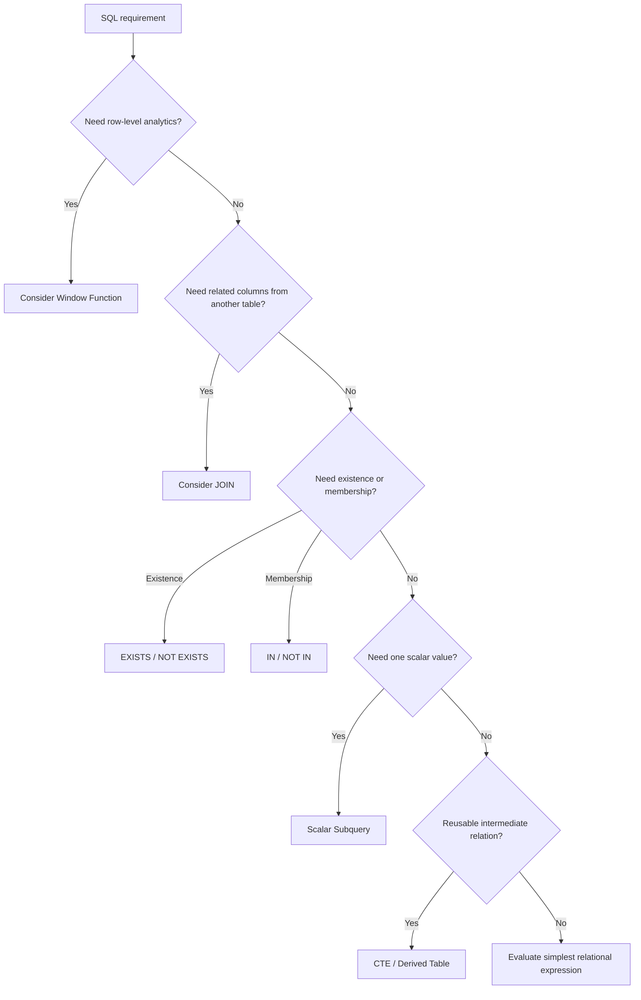

# 22- When to Choose a Subquery

## Overview

A subquery is a query nested inside another SQL statement. It allows one query to produce a value, set of rows, or boolean condition that another query can consume.

The important engineering question is not whether subqueries are "good" or "bad." The useful question is:

> Does a subquery express the relationship between the required data sets more clearly and efficiently than a `JOIN`, window function, aggregation, or CTE?

Subqueries are particularly useful for:

- Scalar comparisons.
- Membership tests.
- Existence checks.
- Filtering against aggregates.
- Isolating an intermediate result.
- Expressing relationships where the inner query has independent semantics.
- Avoiding unnecessary row multiplication from joins.

They become problematic when deeply nested, repeatedly correlated, difficult to reason about, or used where a simpler set-based operation expresses the same requirement.

## The Core Decision

A practical decision model is:



This is a starting point, not a rigid rule. Modern optimizers can transform many logically equivalent query forms into similar physical execution plans.

## When a Subquery Is the Right Choice

### Scalar comparison

Use a scalar subquery when the inner query naturally produces one value.

For example:

> Find products priced above the global average.

```sql
SELECT
    p.id,
    p.name,
    p.price
FROM products AS p
WHERE p.price > (
    SELECT AVG(price)
    FROM products
);
```

The inner query has an independent meaning:

```text
average product price
```

The outer query then uses that value:

```text
product price > average product price
```

This is usually clearer than introducing an unnecessary join.

### Existence

When the requirement is:

> Does at least one related row exist?

use `EXISTS`.

```sql
SELECT
    c.id,
    c.email
FROM customers AS c
WHERE EXISTS (
    SELECT 1
    FROM orders AS o
    WHERE o.customer_id = c.id
      AND o.status = 'completed'
);
```

The query expresses the business requirement directly: return customers for whom a matching order exists.

This avoids producing duplicate customer rows, which can happen with a regular join.

### Non-existence

For requirements such as:

> Find customers who have never placed an order.

use `NOT EXISTS`.

```sql
SELECT
    c.id,
    c.email
FROM customers AS c
WHERE NOT EXISTS (
    SELECT 1
    FROM orders AS o
    WHERE o.customer_id = c.id
);
```

This is generally safer than `NOT IN` when the subquery can contain `NULL`.

### Membership

When the requirement is naturally:

> Is this value contained in another result set?

`IN` can be appropriate.

```sql
SELECT
    c.id,
    c.email
FROM customers AS c
WHERE c.id IN (
    SELECT o.customer_id
    FROM orders AS o
    WHERE o.status = 'completed'
);
```

For large or nullable datasets, compare the semantics and execution plan with `EXISTS` before deciding.

## When a JOIN Is Better

A `JOIN` is generally the natural choice when the query needs columns from related rows.

For example:

```sql
SELECT
    o.id,
    o.amount,
    c.id AS customer_id,
    c.email
FROM orders AS o
JOIN customers AS c
    ON c.id = o.customer_id;
```

The intent is to combine two relations and expose columns from both.

A subquery would be unnecessarily indirect:

```sql
SELECT
    o.id,
    o.amount,
    (
        SELECT c.email
        FROM customers AS c
        WHERE c.id = o.customer_id
    ) AS customer_email
FROM orders AS o;
```

The scalar subquery may be valid, but the join communicates the relational relationship more naturally.

### Prefer JOIN when

- You need columns from both tables.
- The relationship is naturally many-to-one or one-to-one.
- Multiple related columns are required.
- You need to join several relations together.
- The query is fundamentally about combining datasets.

## Avoiding Row Multiplication

One reason to choose a subquery over a join is to preserve the outer table's cardinality.

Suppose each customer can have many orders.

This query:

```sql
SELECT
    c.id,
    c.email
FROM customers AS c
JOIN orders AS o
    ON o.customer_id = c.id;
```

can return the same customer multiple times.

If the requirement is only:

> Return customers who have at least one order.

`EXISTS` better expresses the requirement:

```sql
SELECT
    c.id,
    c.email
FROM customers AS c
WHERE EXISTS (
    SELECT 1
    FROM orders AS o
    WHERE o.customer_id = c.id
);
```

A common workaround is:

```sql
SELECT DISTINCT
    c.id,
    c.email
FROM customers AS c
JOIN orders AS o
    ON o.customer_id = c.id;
```

But `DISTINCT` may be unnecessary work when existence semantics are all that is required.

## When a Window Function Is Better

Use a window function when the requirement involves calculations across related rows while retaining individual rows.

### Rank rows

```sql
SELECT
    e.id,
    e.name,
    e.department_id,
    e.salary,
    ROW_NUMBER() OVER (
        PARTITION BY e.department_id
        ORDER BY e.salary DESC, e.id
    ) AS salary_rank
FROM employees AS e;
```

Trying to implement ranking through nested subqueries usually makes the query harder to understand.

### Compare with a group aggregate

Suppose every product needs to be compared with its category's average price.

A window function is direct:

```sql
SELECT
    p.id,
    p.name,
    p.category_id,
    p.price,
    AVG(p.price) OVER (
        PARTITION BY p.category_id
    ) AS category_average
FROM products AS p;
```

If the application needs both the product and the aggregate, this is generally more natural than repeatedly calculating the aggregate with a correlated subquery.

### Running totals

```sql
SELECT
    o.id,
    o.customer_id,
    o.created_at,
    o.amount,
    SUM(o.amount) OVER (
        PARTITION BY o.customer_id
        ORDER BY o.created_at, o.id
        ROWS BETWEEN UNBOUNDED PRECEDING AND CURRENT ROW
    ) AS running_total
FROM orders AS o;
```

Window functions are designed for this class of problem.

## When a CTE Is Better

A common table expression can improve structure when a query contains a meaningful intermediate relation.

For example:

```sql
WITH ranked_orders AS (
    SELECT
        o.id,
        o.customer_id,
        o.amount,
        o.created_at,
        ROW_NUMBER() OVER (
            PARTITION BY o.customer_id
            ORDER BY o.amount DESC, o.id
        ) AS row_num
    FROM orders AS o
)
SELECT
    id,
    customer_id,
    amount,
    created_at
FROM ranked_orders
WHERE row_num <= 3;
```

A CTE is useful when:

- An intermediate result deserves a name.
- A complex query has multiple logical stages.
- A window function must be filtered at another query level.
- The intermediate relation is referenced multiple times.
- Readability is more important than compressing everything into one expression.

A CTE is not automatically faster than a subquery. Whether it is materialized or inlined depends on the database engine, query structure, and optimizer.

## Subquery vs JOIN vs CTE vs Window Function

| Requirement | Typical first choice | Why |
|---|---|---|
| One scalar value | Scalar subquery | Direct value dependency |
| Check related row exists | `EXISTS` | Expresses boolean existence |
| Check related row does not exist | `NOT EXISTS` | Correct anti-join semantics |
| Membership in a set | `IN` / `EXISTS` | Direct set semantics |
| Retrieve columns from related table | `JOIN` | Natural relation combination |
| Prevent one-to-many row multiplication | `EXISTS` | Preserves outer cardinality |
| Ranking | Window function | Purpose-built analytical operation |
| Top N per group | Window function | Efficient and expressive |
| Running total | Window function | Native cumulative calculation |
| Complex intermediate relation | CTE | Separates logical stages |
| Recursive hierarchy | Recursive CTE | Designed for recursive traversal |
| Simple grouped result | `GROUP BY` | Produces one row per group |
| Row plus group-level aggregate | Window function | Preserves row-level detail |

## Correlated vs Non-Correlated Subqueries

The distinction is important when considering performance and readability.

A non-correlated subquery does not reference the outer query:

```sql
SELECT
    p.id,
    p.price
FROM products AS p
WHERE p.price > (
    SELECT AVG(price)
    FROM products
);
```

A correlated subquery references an outer column:

```sql
SELECT
    p.id,
    p.name,
    p.price
FROM products AS p
WHERE p.price > (
    SELECT AVG(p2.price)
    FROM products AS p2
    WHERE p2.category_id = p.category_id
);
```

The second query depends on the current product's category.

Do not assume that a correlated subquery literally executes once for every outer row. The optimizer may transform it into a join, aggregate, semi-join, or another execution strategy.

The execution plan is authoritative for performance analysis.

## The Cost of Choosing the Wrong Abstraction

A query can be logically correct and still be a poor production query.

Consider:

```sql
SELECT
    c.id,
    (
        SELECT COUNT(*)
        FROM orders AS o
        WHERE o.customer_id = c.id
    ) AS order_count
FROM customers AS c;
```

This may be appropriate for a modest workload and a well-indexed `orders.customer_id`.

But if the application needs extensive customer-level analytics, a grouped relation may be more natural:

```sql
SELECT
    c.id,
    COUNT(o.id) AS order_count
FROM customers AS c
LEFT JOIN orders AS o
    ON o.customer_id = c.id
GROUP BY c.id;
```

For analytical workloads, a pre-aggregated relation, materialized view, or summary table may be more appropriate.

The important question is not:

> "Can I write this as a subquery?"

It is:

> "Which relational representation best matches the required result and workload?"

## Performance Considerations

### Inspect the execution plan

For PostgreSQL:

```sql
EXPLAIN (ANALYZE, BUFFERS)
SELECT
    c.id,
    c.email
FROM customers AS c
WHERE EXISTS (
    SELECT 1
    FROM orders AS o
    WHERE o.customer_id = c.id
      AND o.status = 'completed'
);
```

Look for:

- Sequential scans on unexpectedly large tables.
- Expensive nested loops.
- Large row estimates that differ significantly from actual rows.
- Sort operations.
- Hash operations consuming substantial memory.
- Temporary file usage.
- Excessive buffer reads.
- Poor join or subquery selectivity.

### Index the access path

For the existence query:

```sql
CREATE INDEX idx_orders_customer_status
ON orders (customer_id, status);
```

The exact index should depend on the workload and database engine.

For PostgreSQL, a partial index can sometimes be appropriate:

```sql
CREATE INDEX idx_orders_completed_customer
ON orders (customer_id)
WHERE status = 'completed';
```

This can reduce index size and write overhead when the predicate is selective and stable.

Do not create indexes blindly. Every index adds storage and write-maintenance cost.

## Cardinality Is a Design Concern

Senior SQL design requires thinking about how many rows each operation produces.

For example:

```text
customers
   │
   ├── JOIN orders
   │       └── one customer → many orders
   │
   └── EXISTS orders
           └── one customer → one boolean result
```

A join changes the shape of the relation. `EXISTS` does not.

This distinction affects:

- Duplicate rows.
- Aggregation correctness.
- Network transfer.
- Serialization.
- Memory consumption.
- Pagination behavior.

Many production SQL bugs are fundamentally cardinality mistakes rather than syntax mistakes.

## Aggregation and Subqueries

Subqueries are useful when an aggregate acts as a threshold.

```sql
SELECT
    e.id,
    e.name,
    e.salary
FROM employees AS e
WHERE e.salary > (
    SELECT AVG(salary)
    FROM employees
);
```

If the aggregate is only needed for filtering, this can be clearer than calculating it as an additional output column.

For grouped comparisons:

```sql
SELECT
    e.id,
    e.name,
    e.department_id,
    e.salary
FROM employees AS e
WHERE e.salary > (
    SELECT AVG(e2.salary)
    FROM employees AS e2
    WHERE e2.department_id = e.department_id
);
```

If the same group metric is required for many rows in the result, consider a window function:

```sql
SELECT
    e.id,
    e.name,
    e.department_id,
    e.salary,
    AVG(e.salary) OVER (
        PARTITION BY e.department_id
    ) AS department_average
FROM employees AS e;
```

## `IN` vs `EXISTS`

These can often express similar requirements:

```sql
SELECT
    c.id
FROM customers AS c
WHERE c.id IN (
    SELECT o.customer_id
    FROM orders AS o
    WHERE o.status = 'completed'
);
```

and:

```sql
SELECT
    c.id
FROM customers AS c
WHERE EXISTS (
    SELECT 1
    FROM orders AS o
    WHERE o.customer_id = c.id
      AND o.status = 'completed'
);
```

Do not choose solely because one is traditionally described as faster.

Modern optimizers may transform both into efficient semi-join strategies.

Prefer based on:

- Semantics.
- `NULL` behavior.
- Readability.
- Data distribution.
- Actual execution plan.

## Why `NOT IN` Requires Extra Care

This query can produce surprising results:

```sql
SELECT
    c.id
FROM customers AS c
WHERE c.id NOT IN (
    SELECT o.customer_id
    FROM orders AS o
);
```

If the subquery produces a `NULL`, SQL's three-valued logic can make the predicate evaluate to `UNKNOWN` rather than `TRUE`.

For anti-existence semantics, prefer:

```sql
SELECT
    c.id
FROM customers AS c
WHERE NOT EXISTS (
    SELECT 1
    FROM orders AS o
    WHERE o.customer_id = c.id
);
```

This is one of the most important practical differences between `NOT IN` and `NOT EXISTS`.

## Subqueries and Application Architecture

A well-designed backend should generally push relational work into the database rather than fetching large datasets and processing them in application code.

For example, avoid:

```python
customers = Customer.objects.all()

for customer in customers:
    orders = Order.objects.filter(customer_id=customer.id)
    # Process orders in Python
```

This can produce an N+1 query pattern.

Instead, express the relationship in SQL or through the ORM.

Django can express existence semantics with `Exists`:

```python
from django.db.models import Exists, OuterRef

completed_orders = Order.objects.filter(
    customer_id=OuterRef("pk"),
    status="completed",
)

customers = Customer.objects.annotate(
    has_completed_order=Exists(completed_orders)
).filter(
    has_completed_order=True,
)
```

This allows the database to perform the set-based existence check rather than issuing a query per customer.

The same principle applies to FastAPI services using SQLAlchemy or other database libraries.

## Pagination Considerations

Subqueries can be useful in paginated APIs when they preserve the cardinality of the outer query.

For example:

```sql
SELECT
    c.id,
    c.email
FROM customers AS c
WHERE EXISTS (
    SELECT 1
    FROM orders AS o
    WHERE o.customer_id = c.id
)
ORDER BY c.id
LIMIT 50;
```

Because `EXISTS` does not multiply customer rows, pagination remains straightforward.

A one-to-many join may require additional grouping or deduplication:

```sql
SELECT DISTINCT
    c.id,
    c.email
FROM customers AS c
JOIN orders AS o
    ON o.customer_id = c.id
ORDER BY c.id
LIMIT 50;
```

The difference can become significant at scale.

For high-volume APIs, prefer stable ordering and cursor-based pagination where appropriate.

## Production Considerations

### Readability

A subquery should make the dependency between datasets obvious.

Avoid unnecessarily nested expressions such as:

```sql
SELECT ...
FROM (
    SELECT ...
    FROM (
        SELECT ...
        FROM ...
    ) AS a
) AS b;
```

If each level represents a meaningful transformation, a CTE may be clearer.

### Maintainability

A query is production code.

Prefer:

- Explicit aliases.
- Meaningful table names.
- Stable query structure.
- Clearly defined predicates.
- Deterministic ordering where required.
- Minimal unnecessary nesting.

### Observability

For production SQL, monitor:

- Query latency.
- Query frequency.
- Rows examined.
- Rows returned.
- Buffer/cache behavior.
- Lock waits.
- Temporary disk usage.
- Database CPU and IO.
- Slow-query frequency.

A query that takes 20 ms but runs 100,000 times per minute can matter more than a 500 ms administrative query that runs once per day.

### Reliability

Large subqueries can consume substantial database resources.

Protect critical systems with:

- Statement timeouts.
- Appropriate connection pool limits.
- Query cancellation.
- Sensible API timeouts.
- Pagination.
- Rate limiting where appropriate.
- Load testing with production-like data.

For PostgreSQL, a workload-specific statement timeout can help prevent runaway queries:

```sql
SET LOCAL statement_timeout = '2s';
```

Use this carefully and align it with the application's legitimate latency requirements.

## Common Mistakes

| Mistake | Why it happens | Better approach |
|---|---|---|
| Using a subquery for every relationship | Treating subqueries as a replacement for joins | Use `JOIN` when combining related columns |
| Using joins for existence checks | Thinking joins are always the default | Use `EXISTS` when only existence matters |
| Replacing every subquery with a join | Over-optimizing syntax instead of semantics | Choose based on cardinality and intent |
| Using `NOT IN` with nullable values | Ignoring SQL's three-valued logic | Prefer `NOT EXISTS` for anti-existence |
| Assuming correlated subqueries always execute per row | Confusing logical structure with physical execution | Inspect the execution plan |
| Adding `DISTINCT` to hide duplicates | Fixing symptoms of incorrect cardinality | Understand why rows multiply |
| Using application loops for relational operations | Underestimating database set processing | Push suitable work into SQL |
| Creating indexes for every subquery column | Assuming more indexes always improve performance | Validate with workload and plans |
| Deeply nesting subqueries | Compressing complex logic into one statement | Use CTEs or clearer query composition |
| Ignoring data volume | Testing only against small development datasets | Benchmark with production-like cardinality |

## A Practical Selection Checklist

Before choosing a subquery, ask:

1. **What is the required result shape?**
   - One value?
   - One row per outer entity?
   - Multiple related rows?
   - One row per group?

2. **What is the relationship?**
   - Scalar?
   - Existence?
   - Membership?
   - Join?
   - Aggregation?
   - Ranking?

3. **Will a join multiply rows?**

4. **Would `EXISTS` express the requirement more directly?**

5. **Would a window function avoid repeated group calculations?**

6. **Would a CTE make multiple query stages easier to reason about?**

7. **Can the optimizer execute the chosen form efficiently?**

8. **Have you inspected the execution plan using realistic data?**

9. **Does the query preserve the cardinality required by the API?**

10. **Does the query remain understandable to the next engineer?**

## Senior-Level Heuristic

A useful mental model is to choose the construct based on the operation being expressed:

```text
Need another table's columns?
        │
        └── JOIN

Need to know whether related rows exist?
        │
        └── EXISTS / NOT EXISTS

Need to test membership in a result set?
        │
        └── IN / EXISTS

Need one independently calculated value?
        │
        └── Scalar subquery

Need row-level analytics across related rows?
        │
        └── Window function

Need a named intermediate relation?
        │
        └── CTE

Need grouped output?
        │
        └── GROUP BY
```

These are not mutually exclusive. A production query can legitimately combine them:

```sql
WITH customer_metrics AS (
    SELECT
        c.id,
        c.email,
        COUNT(o.id) AS order_count,
        MAX(o.created_at) AS last_order_at
    FROM customers AS c
    LEFT JOIN orders AS o
        ON o.customer_id = c.id
    GROUP BY
        c.id,
        c.email
)
SELECT
    id,
    email,
    order_count,
    last_order_at
FROM customer_metrics
WHERE order_count > 5;
```

The goal is not to minimize the number of SQL constructs. The goal is to make the relational intent explicit while keeping the execution characteristics appropriate for the workload.

## Key Takeaways

- **Choose a subquery when the inner result has independent scalar, membership, existence, or filtering semantics; do not treat subqueries as a universal replacement for joins.**
- **Use `EXISTS` and `NOT EXISTS` when the requirement is fundamentally about whether related rows exist, especially when preserving outer-row cardinality matters.**
- **Prefer joins when you need columns from related tables and window functions when you need row-level analytics such as ranking, running totals, or group comparisons.**
- **Treat `NOT IN` carefully because `NULL` values can change its semantics; `NOT EXISTS` is usually the safer anti-existence expression.**
- **Make the final decision from semantics, cardinality, maintainability, and actual execution plans—not from blanket rules about which SQL construct is faster.**