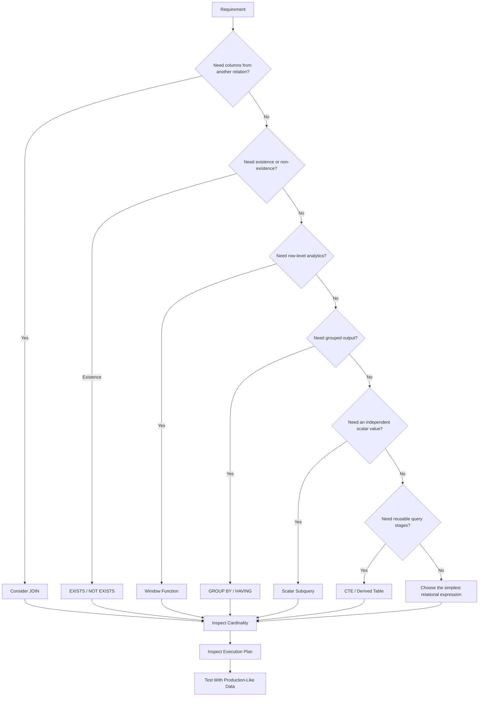

# 23- When Not to Use a Subquery

## Overview

Subqueries are a powerful SQL composition technique, but they are not a universal replacement for `JOIN`, window functions, aggregation, or CTEs. A query can be logically correct while still being harder to optimize, maintain, or reason about when a different relational construct better represents the requirement.

The main reasons to avoid a subquery are:

- The query needs columns from related tables and a `JOIN` expresses that relationship directly.
- A window function can perform the required calculation without nesting.
- A CTE or derived table makes multiple logical stages clearer.
- A correlated subquery creates unnecessary repeated work.
- A subquery changes or obscures row cardinality.
- `IN`/`NOT IN` introduces undesirable `NULL` semantics.
- The database optimizer produces a materially worse execution plan.
- The query becomes deeply nested and difficult to maintain.

The correct decision is based on **semantics, cardinality, execution plans, data volume, and maintainability**, not on a blanket rule that subqueries are slow.

## The Core Principle

Do not ask:

> "Can this query be written using a subquery?"

Ask:

> "What relational operation am I actually expressing?"

A useful mapping is:

| Requirement | Usually prefer |
|---|---|
| Retrieve columns from another relation | `JOIN` |
| Check whether related rows exist | `EXISTS` |
| Check whether related rows do not exist | `NOT EXISTS` |
| Test membership in a result set | `IN` / `EXISTS` |
| Calculate a value independent of each outer row | Scalar subquery |
| Calculate across rows while retaining individual rows | Window function |
| Produce one row per group | `GROUP BY` |
| Build a named intermediate relation | CTE |
| Traverse hierarchical data | Recursive CTE |

Subqueries remain appropriate when their semantics are the clearest representation of the requirement.

## Avoid Subqueries When a JOIN Expresses the Relationship

A subquery is often unnecessary when the query needs attributes from a related table.

For example:

```sql
SELECT
    o.id,
    o.amount,
    (
        SELECT c.email
        FROM customers AS c
        WHERE c.id = o.customer_id
    ) AS customer_email
FROM orders AS o;
```

This is logically valid when the scalar subquery returns at most one row, but the relationship is naturally a join:

```sql
SELECT
    o.id,
    o.amount,
    c.email AS customer_email
FROM orders AS o
JOIN customers AS c
    ON c.id = o.customer_id;
```

The join communicates the relationship directly and gives the optimizer a conventional relational operation to work with.

### Use a JOIN when

- You need multiple columns from the related table.
- The relationship is naturally one-to-one or many-to-one.
- Multiple related relations must be combined.
- The result fundamentally represents combined rows.

Avoid using scalar subqueries merely to avoid writing joins.

## Avoid Subqueries When They Hide Row Multiplication

Cardinality is one of the most important considerations in SQL design.

Suppose one customer can have many orders.

A join produces multiple rows:

```sql
SELECT
    c.id,
    c.email
FROM customers AS c
JOIN orders AS o
    ON o.customer_id = c.id;
```

If a customer has five orders, that customer can appear five times.

If the actual requirement is:

> Return customers who have at least one order.

a subquery using `EXISTS` is appropriate:

```sql
SELECT
    c.id,
    c.email
FROM customers AS c
WHERE EXISTS (
    SELECT 1
    FROM orders AS o
    WHERE o.customer_id = c.id
);
```

However, if the subquery is being used merely to simulate a relationship that actually needs related rows, it can obscure the intended cardinality.

Before choosing a construct, determine whether the result should contain:

- One row per customer.
- One row per order.
- One row per customer-order combination.
- One row per group.

Many SQL bugs originate from choosing the wrong result cardinality.

## Avoid Scalar Subqueries for Related Attributes

A scalar subquery is useful when the inner query naturally represents one independent value.

For example:

```sql
SELECT
    p.id,
    p.price,
    (
        SELECT AVG(price)
        FROM products
    ) AS average_price
FROM products AS p;
```

The inner query calculates a global value.

By contrast, repeatedly using scalar subqueries to retrieve related attributes can make the query unnecessarily complex:

```sql
SELECT
    o.id,
    (
        SELECT c.email
        FROM customers AS c
        WHERE c.id = o.customer_id
    ) AS email,
    (
        SELECT c.country
        FROM customers AS c
        WHERE c.id = o.customer_id
    ) AS country
FROM orders AS o;
```

A single join is clearer:

```sql
SELECT
    o.id,
    c.email,
    c.country
FROM orders AS o
JOIN customers AS c
    ON c.id = o.customer_id;
```

The second query also avoids expressing the same lookup relationship multiple times.

## Avoid Correlated Subqueries When a Set-Based Operation Is Better

A correlated subquery references a value from the outer query:

```sql
SELECT
    p.id,
    p.category_id,
    p.price
FROM products AS p
WHERE p.price > (
    SELECT AVG(p2.price)
    FROM products AS p2
    WHERE p2.category_id = p.category_id
);
```

This expresses:

> Return products whose price is greater than the average price of their category.

The query can be correct and performant with appropriate indexes and optimizer transformations. However, if the category-level aggregate is needed for many rows, a window function can express the operation more directly:

```sql
SELECT
    id,
    category_id,
    price
FROM (
    SELECT
        p.id,
        p.category_id,
        p.price,
        AVG(p.price) OVER (
            PARTITION BY p.category_id
        ) AS category_average
    FROM products AS p
) AS product_metrics
WHERE price > category_average;
```

This makes the row-level and group-level data available together.

### Important distinction

Do not assume:

> "Correlated subquery = executed once for every outer row."

That is a logical description, not necessarily the physical execution strategy.

Modern optimizers can decorrelate subqueries and transform them into joins, aggregates, semi-joins, or other plans.

Always inspect the actual execution plan before declaring a correlated subquery inefficient.

## Avoid Subqueries for Ranking and Row-Level Analytics

Subqueries are often the wrong abstraction for problems involving:

- Ranking.
- Running totals.
- Moving averages.
- Previous/next row comparisons.
- Percentiles.
- Group-relative calculations.

Use window functions.

Instead of attempting to find each customer's latest order through nested logic, for example:

```sql
SELECT
    o.id,
    o.customer_id,
    o.created_at
FROM orders AS o
WHERE o.created_at = (
    SELECT MAX(o2.created_at)
    FROM orders AS o2
    WHERE o2.customer_id = o.customer_id
);
```

a window function can express the top-row requirement explicitly:

```sql
SELECT
    id,
    customer_id,
    created_at
FROM (
    SELECT
        o.id,
        o.customer_id,
        o.created_at,
        ROW_NUMBER() OVER (
            PARTITION BY o.customer_id
            ORDER BY o.created_at DESC, o.id DESC
        ) AS row_num
    FROM orders AS o
) AS ranked_orders
WHERE row_num = 1;
```

The window-function version also provides deterministic tie-breaking through `o.id`.

## Avoid Deeply Nested Subqueries

Nested subqueries become difficult to reason about when each level performs a different transformation:

```sql
SELECT ...
FROM (
    SELECT ...
    FROM (
        SELECT ...
        FROM (
            SELECT ...
            FROM orders
        ) AS a
    ) AS b
) AS c;
```

Deep nesting can make it difficult to understand:

- Which predicates apply at which level.
- Where rows are filtered.
- Where aggregation occurs.
- How aliases relate to each other.
- Which intermediate relation is actually required.

If the query contains meaningful logical stages, use a CTE:

```sql
WITH recent_orders AS (
    SELECT
        o.id,
        o.customer_id,
        o.amount
    FROM orders AS o
    WHERE o.created_at >= CURRENT_DATE - INTERVAL '30 days'
),
customer_totals AS (
    SELECT
        customer_id,
        SUM(amount) AS total_amount
    FROM recent_orders
    GROUP BY customer_id
)
SELECT
    customer_id,
    total_amount
FROM customer_totals
WHERE total_amount >= 10000;
```

A CTE does not automatically improve performance. Its primary advantage here is expressing the logical stages clearly.

## Avoid Subqueries When a CTE Improves Reusability

If the same intermediate relation is logically required in multiple places, repeating subqueries increases maintenance cost.

For example, repeatedly embedding the same filtering logic:

```sql
SELECT ...
FROM orders AS o
WHERE o.customer_id IN (
    SELECT c.id
    FROM customers AS c
    WHERE c.status = 'active'
)
AND o.customer_id IN (
    SELECT c.id
    FROM customers AS c
    WHERE c.status = 'active'
);
```

is unnecessarily repetitive.

A CTE can give the intermediate relation a meaningful name:

```sql
WITH active_customers AS (
    SELECT id
    FROM customers
    WHERE status = 'active'
)
SELECT ...
FROM orders AS o
WHERE o.customer_id IN (
    SELECT id
    FROM active_customers
);
```

Whether a CTE can be reused efficiently depends on the database engine and query plan. Do not assume that naming an intermediate result means it will always be materialized.

## Avoid NOT IN When NULL Semantics Are Unclear

One of the most important cases where a subquery can introduce subtle correctness problems is `NOT IN`.

Consider:

```sql
SELECT
    c.id
FROM customers AS c
WHERE c.id NOT IN (
    SELECT o.customer_id
    FROM orders AS o
);
```

If `orders.customer_id` contains `NULL`, SQL's three-valued logic can cause the predicate to evaluate to `UNKNOWN`.

For anti-existence semantics, prefer:

```sql
SELECT
    c.id
FROM customers AS c
WHERE NOT EXISTS (
    SELECT 1
    FROM orders AS o
    WHERE o.customer_id = c.id
);
```

This is especially important when the schema does not guarantee that the compared column is `NOT NULL`.

If `NOT IN` is used intentionally, its `NULL` behavior must be explicitly understood and tested.

## Avoid IN When Existence Is the Actual Requirement

Consider:

```sql
SELECT
    c.id
FROM customers AS c
WHERE c.id IN (
    SELECT o.customer_id
    FROM orders AS o
    WHERE o.status = 'completed'
);
```

This is valid membership logic.

But if the actual business requirement is:

> Does this customer have at least one completed order?

then `EXISTS` often communicates the intent more precisely:

```sql
SELECT
    c.id
FROM customers AS c
WHERE EXISTS (
    SELECT 1
    FROM orders AS o
    WHERE o.customer_id = c.id
      AND o.status = 'completed'
);
```

The optimizer may transform both forms into similar plans. The semantic distinction remains useful for code readability and `NULL` handling.

## Avoid Subqueries That Replace Simple Aggregation

If the desired result is one row per group, use `GROUP BY` directly.

Unnecessarily nested:

```sql
SELECT *
FROM (
    SELECT
        customer_id,
        SUM(amount) AS total_amount
    FROM orders
    GROUP BY customer_id
) AS totals
WHERE total_amount > 10000;
```

This is valid and can be useful when the aggregate needs to be filtered in an outer query.

But if the database supports the required expression through `HAVING`, this can be simpler:

```sql
SELECT
    customer_id,
    SUM(amount) AS total_amount
FROM orders
GROUP BY customer_id
HAVING SUM(amount) > 10000;
```

Use a subquery when it provides a real logical boundary, not simply because another query layer is possible.

## Avoid Subqueries for Application-Level Loops

A common backend anti-pattern is moving relational work into Python.

For example:

```python
customers = Customer.objects.all()

for customer in customers:
    has_orders = Order.objects.filter(
        customer_id=customer.id,
    ).exists()

    if has_orders:
        process(customer)
```

This can produce one query for the customer list and another query per customer.

That is an N+1 query pattern.

Django can express the same operation as a database-level existence condition:

```python
from django.db.models import Exists, OuterRef

orders = Order.objects.filter(
    customer_id=OuterRef("pk"),
)

customers = (
    Customer.objects
    .annotate(has_orders=Exists(orders))
    .filter(has_orders=True)
)
```

The database can then evaluate the relationship as part of a single set-based query.

The same principle applies when using SQLAlchemy with FastAPI or other backend frameworks.

## Avoid Fetching Large Subquery Results Into the Application

Do not solve a database relationship by transferring potentially large datasets to Python:

```python
customer_ids = list(
    Order.objects
    .filter(status="completed")
    .values_list("customer_id", flat=True)
)

customers = Customer.objects.filter(id__in=customer_ids)
```

For large result sets, this can cause:

- High application memory usage.
- Increased network transfer.
- Large SQL parameter lists.
- More application CPU work.
- Poor latency.
- Connection and timeout pressure.

Prefer expressing the relationship directly in SQL or through the ORM:

```python
from django.db.models import Exists, OuterRef

completed_orders = Order.objects.filter(
    customer_id=OuterRef("pk"),
    status="completed",
)

customers = Customer.objects.filter(
    Exists(completed_orders),
)
```

Keep relational operations close to the database when the database is the system responsible for that relationship.

## Avoid Subqueries When They Obscure API Pagination

Backend APIs often need stable pagination.

Suppose an API returns customers who have orders.

An existence predicate preserves customer cardinality:

```sql
SELECT
    c.id,
    c.email
FROM customers AS c
WHERE EXISTS (
    SELECT 1
    FROM orders AS o
    WHERE o.customer_id = c.id
)
ORDER BY c.id
LIMIT 50;
```

A one-to-many join can multiply customer rows:

```sql
SELECT
    c.id,
    c.email
FROM customers AS c
JOIN orders AS o
    ON o.customer_id = c.id
ORDER BY c.id
LIMIT 50;
```

The second query can consume the page with repeated customers.

Adding `DISTINCT` may fix the result shape:

```sql
SELECT DISTINCT
    c.id,
    c.email
FROM customers AS c
JOIN orders AS o
    ON o.customer_id = c.id
ORDER BY c.id
LIMIT 50;
```

but it can introduce additional sorting, hashing, or memory requirements.

If the requirement is only existence, `EXISTS` is usually the cleaner representation.

## Performance: Do Not Optimize by Syntax Alone

A common mistake is believing one SQL construct is universally faster.

For example:

```sql
SELECT
    c.id
FROM customers AS c
WHERE EXISTS (
    SELECT 1
    FROM orders AS o
    WHERE o.customer_id = c.id
);
```

and:

```sql
SELECT DISTINCT
    c.id
FROM customers AS c
JOIN orders AS o
    ON o.customer_id = c.id;
```

can potentially be transformed into efficient plans by the optimizer.

The correct way to compare them is to examine:

```sql
EXPLAIN (ANALYZE, BUFFERS)
SELECT
    c.id
FROM customers AS c
WHERE EXISTS (
    SELECT 1
    FROM orders AS o
    WHERE o.customer_id = c.id
);
```

Evaluate:

- Actual execution time.
- Rows returned.
- Rows removed by filters.
- Scan methods.
- Join methods.
- Buffer reads and hits.
- Sort and hash operations.
- Memory consumption.
- Estimate-versus-actual row counts.

### Production rule

**Do not rewrite a correct query solely because someone says "subqueries are slow."**

Rewrite it when:

- The execution plan is problematic.
- Cardinality is wrong.
- The query is difficult to maintain.
- A different construct expresses the requirement more clearly.
- Production data exposes a scalability problem.

## Indexing Still Matters

Replacing a subquery with a join does not automatically solve an indexing problem.

For:

```sql
SELECT
    c.id
FROM customers AS c
WHERE EXISTS (
    SELECT 1
    FROM orders AS o
    WHERE o.customer_id = c.id
      AND o.status = 'completed'
);
```

the database needs an efficient access path into `orders`.

Depending on the workload and database engine, an index such as:

```sql
CREATE INDEX idx_orders_customer_status
ON orders (customer_id, status);
```

may be appropriate.

For PostgreSQL, a partial index can sometimes be better when the predicate is highly selective:

```sql
CREATE INDEX idx_orders_completed_customer
ON orders (customer_id)
WHERE status = 'completed';
```

Index selection should be based on actual query patterns, data distribution, write volume, and execution plans.

Every additional index has:

- Storage cost.
- Write amplification.
- Vacuum/maintenance overhead.
- Cache footprint.
- Operational complexity.

## When a Subquery Is Actually Better

Avoiding subqueries should not become another blanket rule.

A subquery is often the best choice when the inner query has a clearly independent meaning.

### Global aggregate

```sql
SELECT
    p.id,
    p.name,
    p.price
FROM products AS p
WHERE p.price > (
    SELECT AVG(price)
    FROM products
);
```

The requirement is naturally:

```text
product price > global average
```

### Existence

```sql
SELECT
    c.id,
    c.email
FROM customers AS c
WHERE EXISTS (
    SELECT 1
    FROM orders AS o
    WHERE o.customer_id = c.id
      AND o.status = 'completed'
);
```

The requirement is naturally:

```text
customer has at least one completed order
```

### Non-existence

```sql
SELECT
    c.id,
    c.email
FROM customers AS c
WHERE NOT EXISTS (
    SELECT 1
    FROM orders AS o
    WHERE o.customer_id = c.id
);
```

The requirement is naturally:

```text
customer has no orders
```

The goal is not to eliminate subqueries. It is to avoid using them where another relational construct communicates the requirement better.

## Subquery Decision Matrix

| Situation | Subquery? | Preferred approach |
|---|---:|---|
| Need a single independent aggregate value | Yes | Scalar subquery |
| Need related table columns | Usually no | `JOIN` |
| Need to test existence | Yes | `EXISTS` |
| Need to test non-existence | Yes | `NOT EXISTS` |
| Need ranking | Usually no | Window function |
| Need running totals | Usually no | Window function |
| Need one row per group | Usually no | `GROUP BY` |
| Need a reusable logical stage | Sometimes | CTE |
| Need recursive traversal | No | Recursive CTE |
| Need repeated application-level lookups | No | Set-based SQL |
| Need large data transfer into application | No | Keep operation in database |
| Need complex multi-stage transformation | Sometimes | CTE or derived table |
| Need related attributes through repeated scalar lookups | Usually no | `JOIN` |

## Production Pitfalls

### Mistaking logical query structure for execution behavior

A correlated subquery may look like repeated execution, but the optimizer can transform it.

Conversely, a query that looks simple can produce an expensive physical plan.

**Avoidance:** inspect the actual execution plan.

### Using DISTINCT to hide a bad join

If duplicates appear after a join, adding `DISTINCT` may hide the underlying cardinality problem.

Ask why the rows multiplied before deciding to deduplicate.

### Replacing every subquery with a JOIN

This can make existence checks unnecessarily complicated and may introduce duplicate rows.

Use `EXISTS` when existence is the requirement.

### Assuming CTEs are always faster

CTEs primarily provide a logical composition mechanism. Their optimization behavior depends on the database engine and query.

Use `EXPLAIN` rather than assuming materialization or inlining.

### Ignoring NULL behavior

`NOT IN` is particularly dangerous when nullable values can enter the subquery.

Prefer `NOT EXISTS` for anti-existence semantics unless `NOT IN` semantics are deliberately required.

### Optimizing without production-scale data

A query can perform perfectly against 10,000 rows and become problematic at 100 million rows.

Test with realistic:

- Table sizes.
- Data distributions.
- Selectivity.
- Concurrent workload.
- Index configuration.

## Backend Engineering Considerations

SQL query shape directly affects backend behavior.

An inefficient query can cause:

```text
HTTP request
    │
    ▼
Application server
    │
    ▼
Database query
    │
    ├── CPU pressure
    ├── IO pressure
    ├── memory pressure
    └── connection held longer
            │
            ▼
      Connection pool exhaustion
            │
            ▼
       Increased API latency
```

A poorly chosen subquery can therefore become an application-level reliability problem rather than merely a database-style issue.

For services running on Kubernetes, ECS, or EC2, scaling application replicas does not necessarily solve database pressure. If every replica executes an expensive query more frequently, application scaling can increase database load.

Production SQL decisions should therefore consider:

- Query latency.
- Query frequency.
- Concurrent connections.
- Database CPU and IO.
- Lock contention.
- Cache efficiency.
- Connection pool utilization.
- API timeout budgets.
- Read-replica capacity.
- Data growth.

## Monitoring and Operational Validation

For PostgreSQL workloads, use tools such as:

```sql
EXPLAIN (ANALYZE, BUFFERS)
SELECT
    c.id
FROM customers AS c
WHERE EXISTS (
    SELECT 1
    FROM orders AS o
    WHERE o.customer_id = c.id;
);
```

In production environments, combine query-plan analysis with database metrics and application observability.

Track:

| Metric | Why it matters |
|---|---|
| Query latency | Detects slow requests |
| Query execution count | Identifies high-frequency SQL |
| Rows returned | Reveals unexpected cardinality |
| Buffer hits/reads | Indicates cache and IO behavior |
| CPU utilization | Detects compute pressure |
| Disk IO | Detects storage bottlenecks |
| Connection usage | Detects pool/database saturation |
| Lock waits | Detects concurrency problems |
| Temporary files | Detects memory/sort pressure |

A query that is individually inexpensive can still be a production problem if executed at very high frequency.

## Practical Review Checklist

Before approving a subquery-heavy query, review:

- **Intent:** Does the subquery represent a real logical dependency?
- **Cardinality:** Does it preserve or change the required row shape?
- **Semantics:** Would `JOIN`, `EXISTS`, `GROUP BY`, or a window function express the requirement more directly?
- **NULL behavior:** Are `IN` or `NOT IN` semantics safe?
- **Correlation:** Is the subquery correlated, and is that correlation necessary?
- **Indexes:** Can the inner predicate use an appropriate access path?
- **Execution plan:** What does the database actually execute?
- **Data volume:** Has the query been tested with realistic cardinality?
- **Frequency:** How often will the application execute it?
- **Maintainability:** Can another engineer understand the query quickly?
- **API behavior:** Does the query support correct pagination and result cardinality?
- **Operational impact:** What happens under concurrent production load?

## Interview Traps

### "Subqueries are always slower than joins."

False.

The optimizer may transform equivalent query forms into the same or similar physical plans.

### "Correlated subqueries always run once per outer row."

False.

That describes the logical dependency, not necessarily the physical execution plan.

### "`JOIN` is always better than `EXISTS`."

False.

`EXISTS` is specifically designed for existence semantics and avoids row multiplication.

### "`NOT IN` and `NOT EXISTS` are always equivalent."

False.

`NULL` values can make `NOT IN` behave unexpectedly because SQL uses three-valued logic.

### "CTEs always improve performance."

False.

CTEs primarily improve query organization. Performance depends on the database engine, query, optimizer behavior, and workload.

### "Adding DISTINCT fixes duplicate rows."

It can hide the symptom without fixing the underlying cardinality problem and may introduce additional computation.

## A Senior-Level Decision Process

When reviewing a subquery, work through the requirement in this order:



This approach avoids both extremes:

- **Overusing subqueries** because they seem convenient.
- **Avoiding subqueries blindly** because they are assumed to be inefficient.

The best SQL is the query that expresses the required relational operation clearly and produces an acceptable execution plan under the real workload.

## Key Takeaways

- **Do not use a subquery merely because it can express the requirement; choose `JOIN`, `EXISTS`, window functions, `GROUP BY`, or CTEs when they better match the relational operation.**
- **Avoid correlated or deeply nested subqueries when they add complexity without providing meaningful semantics, but verify performance with execution plans rather than relying on syntax-based assumptions.**
- **Treat row cardinality as a first-class concern; use `EXISTS` when you need existence without multiplying outer rows and avoid using `DISTINCT` merely to hide incorrect joins.**
- **Be especially careful with `NOT IN` and nullable values; `NOT EXISTS` is generally the safer expression for anti-existence requirements.**
- **Production SQL decisions should consider semantics, indexes, data volume, execution plans, query frequency, API latency, and database resource consumption together.**