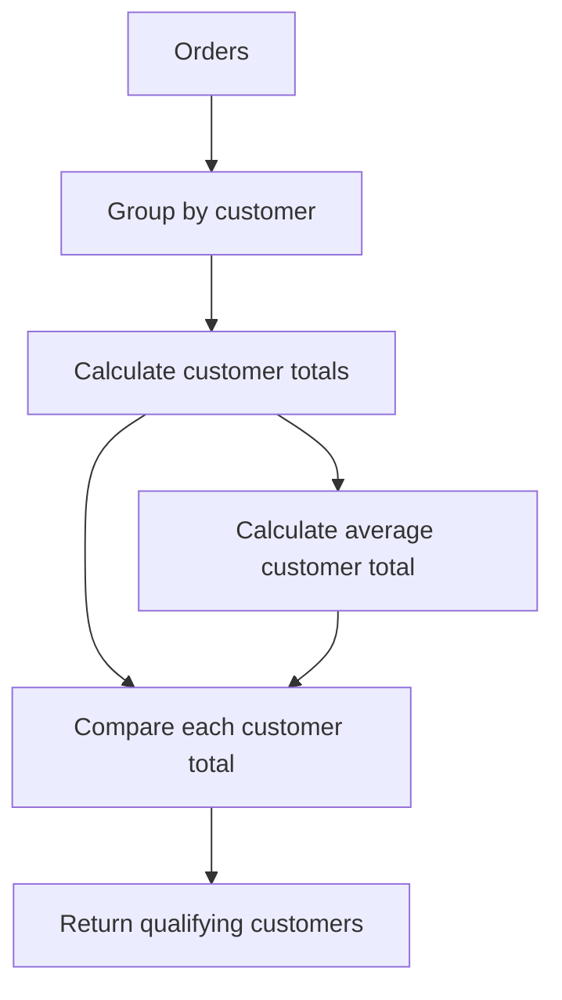
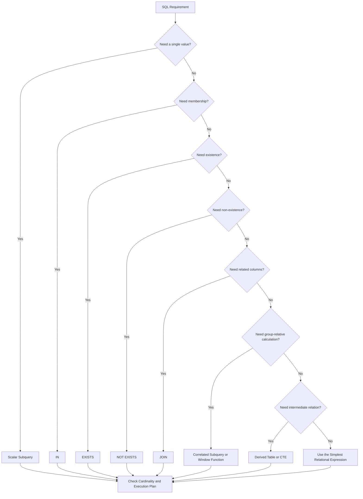

# 24- Common Subquery Patterns

## Overview

Subqueries are queries embedded inside another SQL statement. They allow one relational operation to depend on the result of another without requiring the intermediate result to be exposed as a separate application-level operation.

Common subquery patterns include:

- Scalar subqueries for a single value.
- `IN` for membership tests.
- `NOT IN` for exclusion when `NULL` semantics are controlled.
- `EXISTS` for existence checks.
- `NOT EXISTS` for anti-existence checks.
- Correlated subqueries for row-dependent calculations or predicates.
- Derived tables for treating a query result as a relation in `FROM`.
- Subqueries in `HAVING` for group-level filtering.
- Subqueries in `SELECT` for calculated attributes.

The important engineering decision is not simply whether a subquery can solve a problem. It is whether the subquery expresses the required **cardinality, dependency, and relational semantics** clearly and efficiently.

## Representative Schema

The examples use a typical backend commerce model:

```sql
CREATE TABLE customers (
    id BIGINT PRIMARY KEY,
    email TEXT NOT NULL,
    status TEXT NOT NULL,
    created_at TIMESTAMPTZ NOT NULL
);

CREATE TABLE orders (
    id BIGINT PRIMARY KEY,
    customer_id BIGINT NOT NULL REFERENCES customers(id),
    status TEXT NOT NULL,
    amount NUMERIC(12, 2) NOT NULL,
    created_at TIMESTAMPTZ NOT NULL
);

CREATE INDEX idx_orders_customer_id
    ON orders (customer_id);

CREATE INDEX idx_orders_customer_status
    ON orders (customer_id, status);

CREATE INDEX idx_orders_created_at
    ON orders (created_at);
```

The exact index strategy should be based on actual workload and execution plans.

## Scalar Subqueries

### What it is

A scalar subquery returns a single value and can be used anywhere SQL expects a scalar expression.

```sql
SELECT
    p.id,
    p.name,
    p.price,
    (
        SELECT AVG(p2.price)
        FROM products AS p2
    ) AS average_price
FROM products AS p;
```

The subquery produces one value: the average product price.

### When to use it

Scalar subqueries are useful when:

- A calculation naturally produces one value.
- The value is logically independent of the outer row.
- The query would become less clear if expressed through a join.
- A scalar comparison is required.

Example:

```sql
SELECT
    o.id,
    o.amount
FROM orders AS o
WHERE o.amount > (
    SELECT AVG(amount)
    FROM orders
);
```

### Important limitation

A scalar subquery must return at most one row.

This is invalid if multiple customers can have the same email:

```sql
SELECT
    o.id
FROM orders AS o
WHERE o.customer_id = (
    SELECT c.id
    FROM customers AS c
    WHERE c.email = 'customer@example.com'
);
```

If the subquery returns multiple rows, the database raises a cardinality error.

If multiple values are intentionally possible, use `IN` or `EXISTS` instead.

## IN with Subqueries

### What it is

`IN` tests whether a value belongs to a set produced by a subquery.

```sql
SELECT
    c.id,
    c.email
FROM customers AS c
WHERE c.id IN (
    SELECT o.customer_id
    FROM orders AS o
    WHERE o.status = 'completed'
);
```

The query means:

> Return customers whose ID appears among customers with completed orders.

### Why it exists

`IN` provides direct set-membership semantics.

It is useful when the business rule naturally sounds like:

```text
value belongs to this set
```

### When to use it

Use `IN` when:

- Membership is the actual requirement.
- The subquery naturally produces a set of comparable values.
- `NULL` behavior is understood.
- The query is clearer than an equivalent join.

For example:

```sql
SELECT
    id,
    email
FROM customers
WHERE id IN (
    SELECT customer_id
    FROM orders
    WHERE status = 'refunded'
);
```

### Production considerations

Do not assume that `IN` means the database builds a large in-memory list and compares every outer row against it.

Optimizers can transform membership predicates into semi-joins, hash operations, index lookups, or other strategies.

Inspect the execution plan when performance matters.

## NOT IN with Subqueries

`NOT IN` expresses exclusion:

```sql
SELECT
    c.id,
    c.email
FROM customers AS c
WHERE c.id NOT IN (
    SELECT o.customer_id
    FROM orders AS o
);
```

The intention is:

> Return customers who have no matching order.

However, `NOT IN` has an important interaction with `NULL`.

If the subquery returns:

```text
101
102
NULL
```

then comparisons can evaluate to `UNKNOWN` under SQL's three-valued logic. This can cause rows that appear to satisfy the business condition to be excluded.

For anti-existence requirements, prefer:

```sql
SELECT
    c.id,
    c.email
FROM customers AS c
WHERE NOT EXISTS (
    SELECT 1
    FROM orders AS o
    WHERE o.customer_id = c.id
);
```

### Practical rule

| Requirement | Preferred pattern |
|---|---|
| Membership in a known set | `IN` |
| Existence of a related row | `EXISTS` |
| Non-existence of a related row | `NOT EXISTS` |
| `NOT IN` with guaranteed non-null values | Acceptable when semantics are clear |

## EXISTS

`EXISTS` tests whether the subquery produces at least one row.

```sql
SELECT
    c.id,
    c.email
FROM customers AS c
WHERE EXISTS (
    SELECT 1
    FROM orders AS o
    WHERE o.customer_id = c.id
      AND o.status = 'completed'
);
```

The actual values selected inside `EXISTS` are irrelevant. The database only needs to determine whether at least one matching row exists.

Therefore:

```sql
EXISTS (
    SELECT 1
    FROM orders AS o
    WHERE o.customer_id = c.id
)
```

and:

```sql
EXISTS (
    SELECT o.id
    FROM orders AS o
    WHERE o.customer_id = c.id
)
```

have the same existence semantics.

### Why it exists

`EXISTS` represents a **semi-join** concept:

```text
Keep the outer row if at least one matching inner row exists.
```

Unlike a regular join, it does not multiply the outer row when multiple matches exist.

### Production advantage

If the database can establish that a qualifying row exists, it may not need to inspect additional matching rows.

An index such as:

```sql
CREATE INDEX idx_orders_customer_status
ON orders (customer_id, status);
```

can make existence checks efficient when the access pattern matches the query.

## NOT EXISTS

`NOT EXISTS` expresses anti-existence:

```sql
SELECT
    c.id,
    c.email
FROM customers AS c
WHERE NOT EXISTS (
    SELECT 1
    FROM orders AS o
    WHERE o.customer_id = c.id
);
```

This means:

> Keep the customer only if no matching order exists.

This pattern is particularly useful for:

- Customers with no orders.
- Accounts without required resources.
- Records without corresponding events.
- Detecting missing relationships.
- Data integrity checks.

### Example: accounts missing a profile

```sql
SELECT
    u.id,
    u.email
FROM users AS u
WHERE NOT EXISTS (
    SELECT 1
    FROM profiles AS p
    WHERE p.user_id = u.id
);
```

This avoids the `NULL` pitfalls associated with `NOT IN`.

## Correlated Subqueries

A correlated subquery references columns from the outer query.

```sql
SELECT
    o.id,
    o.customer_id,
    o.amount
FROM orders AS o
WHERE o.amount > (
    SELECT AVG(o2.amount)
    FROM orders AS o2
    WHERE o2.customer_id = o.customer_id
);
```

The inner query depends on the current outer customer's ID.

### Why it exists

Correlation allows an inner query to answer a question relative to each outer row.

Typical requirements include:

- Compare a row against its group's aggregate.
- Find a row relative to its parent.
- Check a condition for each outer entity.
- Find the latest or earliest related record.
- Test row-specific existence.

### Important execution-plan distinction

Do not equate:

```text
correlated subquery
```

with:

```text
physically executed once per outer row
```

Correlation is a property of the query's logical dependency. The optimizer may transform the query into a join, aggregate, semi-join, or another plan.

Always inspect the actual execution plan before optimizing it.

## Latest Related Row

Finding the latest related record is a common backend requirement.

A correlated subquery can express it:

```sql
SELECT
    o.id,
    o.customer_id,
    o.created_at
FROM orders AS o
WHERE o.created_at = (
    SELECT MAX(o2.created_at)
    FROM orders AS o2
    WHERE o2.customer_id = o.customer_id
);
```

However, ties can produce multiple rows.

A deterministic window-function approach is often better when exactly one row is required:

```sql
SELECT
    id,
    customer_id,
    created_at
FROM (
    SELECT
        o.id,
        o.customer_id,
        o.created_at,
        ROW_NUMBER() OVER (
            PARTITION BY o.customer_id
            ORDER BY o.created_at DESC, o.id DESC
        ) AS row_num
    FROM orders AS o
) AS ranked
WHERE row_num = 1;
```

This distinction matters for API endpoints where the backend contract requires exactly one latest record.

## Subqueries in SELECT

A subquery can produce a calculated column.

For example:

```sql
SELECT
    c.id,
    c.email,
    (
        SELECT COUNT(*)
        FROM orders AS o
        WHERE o.customer_id = c.id
    ) AS order_count
FROM customers AS c;
```

This produces:

| id | email | order_count |
|---:|---|---:|
| 1 | alice@example.com | 8 |
| 2 | bob@example.com | 0 |
| 3 | carol@example.com | 14 |

This is useful when the calculated attribute is naturally associated with each outer entity.

For large datasets, compare the plan against a grouped join:

```sql
SELECT
    c.id,
    c.email,
    COUNT(o.id) AS order_count
FROM customers AS c
LEFT JOIN orders AS o
    ON o.customer_id = c.id
GROUP BY
    c.id,
    c.email;
```

The better choice depends on the optimizer, indexes, cardinality, and required result shape.

## Subqueries in FROM

A subquery in `FROM` creates a derived table.

```sql
SELECT
    customer_id,
    total_amount
FROM (
    SELECT
        customer_id,
        SUM(amount) AS total_amount
    FROM orders
    GROUP BY customer_id
) AS totals
WHERE total_amount >= 10000;
```

The inner query creates an intermediate relation:

```text
orders
   │
   ▼
GROUP BY customer_id
   │
   ▼
customer totals
   │
   ▼
filter totals >= 10000
```

This is useful when a calculated relation must become the input to another relational operation.

## Subqueries in HAVING

A subquery can be used to compare group-level aggregates against another result.

For example:

```sql
SELECT
    customer_id,
    SUM(amount) AS total_amount
FROM orders
GROUP BY customer_id
HAVING SUM(amount) > (
    SELECT AVG(customer_total)
    FROM (
        SELECT
            customer_id,
            SUM(amount) AS customer_total
        FROM orders
        GROUP BY customer_id
    ) AS totals
);
```

The query identifies customers whose total order value is greater than the average customer total.

This is a multi-stage aggregation:



For complex analytical queries, a CTE can improve readability:

```sql
WITH customer_totals AS (
    SELECT
        customer_id,
        SUM(amount) AS total_amount
    FROM orders
    GROUP BY customer_id
),
average_total AS (
    SELECT AVG(total_amount) AS avg_total
    FROM customer_totals
)
SELECT
    ct.customer_id,
    ct.total_amount
FROM customer_totals AS ct
CROSS JOIN average_total AS at
WHERE ct.total_amount > at.avg_total;
```

The CTE version is often easier to maintain because each logical stage has a name.

## Derived Tables vs CTEs

Both derived tables and CTEs can represent intermediate query results.

### Derived table

```sql
SELECT
    customer_id,
    total_amount
FROM (
    SELECT
        customer_id,
        SUM(amount) AS total_amount
    FROM orders
    GROUP BY customer_id
) AS totals
WHERE total_amount > 10000;
```

### CTE

```sql
WITH customer_totals AS (
    SELECT
        customer_id,
        SUM(amount) AS total_amount
    FROM orders
    GROUP BY customer_id
)
SELECT
    customer_id,
    total_amount
FROM customer_totals
WHERE total_amount > 10000;
```

The CTE version often communicates intent more clearly when a query has multiple stages.

Do not assume that CTEs are automatically faster. Optimization and materialization behavior depend on the database engine and query.

## Nested Subqueries

Subqueries can be composed:

```sql
SELECT
    customer_id,
    total_amount
FROM (
    SELECT
        customer_id,
        SUM(amount) AS total_amount
    FROM orders
    WHERE customer_id IN (
        SELECT id
        FROM customers
        WHERE status = 'active'
    )
    GROUP BY customer_id
) AS totals
WHERE total_amount > 10000;
```

This query has multiple logical layers:

```text
Customers
    │
    └── active customer IDs
              │
Orders ───────┘
    │
    └── group and calculate totals
              │
              ▼
      filter high-value customers
```

Nested subqueries are valid, but excessive nesting can make a query difficult to maintain.

Consider a CTE when each stage has a meaningful business or technical name.

## Multiple Levels of Correlation

Correlation can occur inside nested query levels.

```sql
SELECT
    c.id,
    c.email
FROM customers AS c
WHERE EXISTS (
    SELECT 1
    FROM orders AS o
    WHERE o.customer_id = c.id
      AND EXISTS (
          SELECT 1
          FROM order_events AS e
          WHERE e.order_id = o.id
            AND e.event_type = 'payment_failed'
      )
);
```

The dependency chain is:

```text
customer
   │
   └── orders
          │
          └── order_events
```

This is useful for multi-level existence requirements, but the query should be reviewed carefully for indexing and execution-plan quality.

Potential indexes include:

```sql
CREATE INDEX idx_orders_customer_id
ON orders (customer_id);

CREATE INDEX idx_order_events_order_type
ON order_events (order_id, event_type);
```

The exact indexes should follow production query patterns.

## Relational Semantics of Common Patterns

A useful way to classify subqueries is by the operation they represent:

| Pattern | Relational meaning | Typical use |
|---|---|---|
| Scalar subquery | Single value | Aggregate comparison |
| `IN` | Semi-join / membership | Set membership |
| `EXISTS` | Semi-join | Related row exists |
| `NOT EXISTS` | Anti-join | Related row does not exist |
| `FROM` subquery | Derived relation | Intermediate transformation |
| Correlated subquery | Row-dependent operation | Per-group or per-row condition |
| `HAVING` subquery | Group-level comparison | Aggregate against another aggregate |
| `SELECT` subquery | Calculated attribute | Related count/value |

Thinking in terms of relational operations makes query design more predictable.

## Choosing Between Common Patterns

| Requirement | Recommended pattern | Main reason |
|---|---|---|
| Customer has at least one order | `EXISTS` | Expresses existence |
| Customer has no orders | `NOT EXISTS` | Safe anti-existence semantics |
| ID belongs to a filtered set | `IN` | Direct membership semantics |
| Exclude IDs from a guaranteed non-null set | `NOT IN` | Simple exclusion |
| Product price above global average | Scalar subquery | Single independent value |
| Product above category average | Correlated subquery or window function | Group-relative comparison |
| Customer order count | Aggregate or scalar subquery | Depends on result shape |
| Latest order per customer | Window function or carefully designed subquery | Deterministic row selection |
| Multi-stage transformation | CTE or derived table | Clear logical stages |
| Group compared against another aggregate | CTE, derived table, or `HAVING` subquery | Explicit aggregation stages |

## Subquery vs JOIN

Consider:

```sql
SELECT DISTINCT
    c.id,
    c.email
FROM customers AS c
JOIN orders AS o
    ON o.customer_id = c.id
WHERE o.status = 'completed';
```

versus:

```sql
SELECT
    c.id,
    c.email
FROM customers AS c
WHERE EXISTS (
    SELECT 1
    FROM orders AS o
    WHERE o.customer_id = c.id
      AND o.status = 'completed'
);
```

The first query combines rows and then needs `DISTINCT` to restore customer-level cardinality.

The second directly asks whether a matching order exists.

If the business requirement is only existence, `EXISTS` is generally the clearer abstraction.

If order columns are required in the result, a `JOIN` is usually more appropriate.

## Subquery vs Window Function

Some correlated subqueries can be replaced by window functions.

For example:

```sql
SELECT
    p.id,
    p.category_id,
    p.price
FROM products AS p
WHERE p.price > (
    SELECT AVG(p2.price)
    FROM products AS p2
    WHERE p2.category_id = p.category_id
);
```

A window-based equivalent:

```sql
SELECT
    id,
    category_id,
    price
FROM (
    SELECT
        p.id,
        p.category_id,
        p.price,
        AVG(p.price) OVER (
            PARTITION BY p.category_id
        ) AS category_average
    FROM products AS p
) AS product_metrics
WHERE price > category_average;
```

Window functions are often preferable when both the individual row and group-level calculation are needed together.

## Production Performance

Subquery performance depends on the physical execution plan.

Important factors include:

- Outer relation size.
- Inner relation size.
- Predicate selectivity.
- Correlation.
- Available indexes.
- Data distribution.
- Join strategy.
- Aggregation strategy.
- Memory available for hashing and sorting.
- Query frequency.
- Concurrent database load.

Use PostgreSQL execution plans when working with PostgreSQL:

```sql
EXPLAIN (ANALYZE, BUFFERS)
SELECT
    c.id,
    c.email
FROM customers AS c
WHERE EXISTS (
    SELECT 1
    FROM orders AS o
    WHERE o.customer_id = c.id
      AND o.status = 'completed'
);
```

Review:

- Actual versus estimated rows.
- Sequential versus index scans.
- Nested loops.
- Hash joins.
- Sorts.
- Hash aggregation.
- Buffer hits and reads.
- Temporary file usage.
- Actual execution time.

### Important rule

Do not optimize SQL based solely on syntax.

These two queries can produce similar physical plans:

```sql
WHERE customer_id IN (
    SELECT id
    FROM ...
)
```

and:

```sql
JOIN ...
```

Likewise, an apparently simple query can become expensive at production scale.

## Indexing Subqueries

Subqueries frequently filter or correlate on columns that should have efficient access paths.

For:

```sql
WHERE EXISTS (
    SELECT 1
    FROM orders AS o
    WHERE o.customer_id = c.id
      AND o.status = 'completed'
)
```

an index such as:

```sql
CREATE INDEX idx_orders_customer_status
ON orders (customer_id, status);
```

may be useful.

For PostgreSQL workloads where completed orders are a small subset, a partial index may be appropriate:

```sql
CREATE INDEX idx_completed_orders_customer
ON orders (customer_id)
WHERE status = 'completed';
```

Index design must account for writes as well as reads. Adding indexes indiscriminately increases:

- Storage requirements.
- Insert/update/delete overhead.
- Vacuum and maintenance work.
- Cache pressure.

## Backend ORM Considerations

Subqueries are especially useful when building ORM queries without falling back to application-level loops.

In Django, `Exists` and `OuterRef` map naturally to correlated existence queries:

```python
from django.db.models import Exists, OuterRef

completed_orders = Order.objects.filter(
    customer_id=OuterRef("pk"),
    status="completed",
)

customers = (
    Customer.objects
    .annotate(has_completed_order=Exists(completed_orders))
    .filter(has_completed_order=True)
)
```

This keeps the relationship inside the database instead of performing an N+1 sequence of application queries.

Avoid code like:

```python
for customer in Customer.objects.all():
    if Order.objects.filter(
        customer_id=customer.id,
        status="completed",
    ).exists():
        process(customer)
```

The latter can execute one existence query per customer.

The database should generally perform set-based relational work rather than forcing the application to implement a database join through Python loops.

## API and Pagination Considerations

Subqueries can help preserve the intended cardinality of API responses.

For example:

```sql
SELECT
    c.id,
    c.email
FROM customers AS c
WHERE EXISTS (
    SELECT 1
    FROM orders AS o
    WHERE o.customer_id = c.id
)
ORDER BY c.id
LIMIT 50;
```

This returns at most one row per customer.

A direct one-to-many join can produce repeated customer rows:

```sql
SELECT
    c.id,
    c.email
FROM customers AS c
JOIN orders AS o
    ON o.customer_id = c.id
ORDER BY c.id
LIMIT 50;
```

For REST or gRPC services, incorrect cardinality can cause:

- Duplicate API objects.
- Incorrect page sizes.
- Unstable offset pagination.
- Incorrect counts.
- Additional application-side deduplication.

Choose the SQL construct based on the API's required result shape.

## Common Mistakes

### Using a scalar subquery that returns multiple rows

Incorrect:

```sql
WHERE customer_id = (
    SELECT id
    FROM customers
    WHERE status = 'active'
);
```

If multiple active customers exist, the scalar comparison fails.

Use `IN` or `EXISTS` when multiple matching rows are valid.

### Using NOT IN with nullable columns

Potentially dangerous:

```sql
WHERE id NOT IN (
    SELECT customer_id
    FROM orders
);
```

Prefer:

```sql
WHERE NOT EXISTS (
    SELECT 1
    FROM orders
    WHERE orders.customer_id = customers.id
);
```

### Using JOIN when only existence matters

A join can multiply rows when multiple related records exist.

Prefer `EXISTS` when the requirement is only:

```text
Does at least one related record exist?
```

### Assuming correlated means slow

Correlation can be expensive, but the optimizer may decorrelate or transform the query.

Check:

```sql
EXPLAIN (ANALYZE, BUFFERS)
```

before rewriting a production query.

### Repeating the same subquery

Repeated logic increases maintenance cost and can make complex SQL difficult to review.

Consider a CTE, derived table, or join when the same intermediate relation is needed multiple times.

### Deep nesting without a logical reason

Nested subqueries should represent meaningful relational stages.

If the query becomes difficult to read, introduce a CTE or simplify the relational expression.

### Fetching subquery results into Python

Avoid:

```python
ids = list(
    Order.objects
    .filter(status="completed")
    .values_list("customer_id", flat=True)
)

customers = Customer.objects.filter(id__in=ids)
```

For large datasets, this moves database work into application memory.

Keep the operation inside SQL where possible.

## Security Considerations

Subqueries do not inherently create a SQL injection vulnerability. Unsafe query construction does.

Avoid:

```python
query = f"""
SELECT *
FROM customers
WHERE id IN (
    SELECT customer_id
    FROM orders
    WHERE status = '{status}'
)
"""
```

Use parameterized queries or ORM APIs:

```python
from django.db import connection

with connection.cursor() as cursor:
    cursor.execute(
        """
        SELECT id, email
        FROM customers
        WHERE id IN (
            SELECT customer_id
            FROM orders
            WHERE status = %s
        )
        """,
        [status],
    )
```

The same principle applies to SQLAlchemy, async database drivers, and other Python database libraries.

SQL structure should remain static while values are passed as parameters.

## Operational Considerations

A subquery that is acceptable in development can become expensive under production load.

Monitor:

- Query latency.
- Execution count.
- Database CPU.
- Database IO.
- Buffer reads.
- Connection pool utilization.
- Lock waits.
- Temporary file generation.
- Rows scanned versus rows returned.

A query executed 100,000 times per minute can be more operationally significant than a slower query executed once per hour.

For high-traffic backend services, consider:

- Appropriate indexes.
- Query plan regression testing.
- Read replicas where appropriate.
- Application-level caching for genuinely reusable data.
- Pagination.
- Query timeouts.
- Connection pool sizing.
- Database capacity planning.

Do not use Redis as a workaround for an inefficient relational query without understanding the consistency and invalidation requirements.

## Production Review Checklist

Before shipping a subquery-heavy query, verify:

- **Semantics:** Does the subquery represent the actual business requirement?
- **Cardinality:** Can it multiply or eliminate rows unexpectedly?
- **NULL behavior:** Are `IN` and `NOT IN` semantics safe?
- **Correlation:** Is correlation required?
- **Indexes:** Can correlated and filtering predicates use appropriate indexes?
- **Execution plan:** Has `EXPLAIN` or equivalent been reviewed?
- **Data volume:** Has the query been tested against realistic production-sized data?
- **Frequency:** How often will the query execute?
- **Pagination:** Does the query preserve API result cardinality?
- **Maintainability:** Can engineers understand the logical stages?
- **ORM behavior:** Does the framework generate the intended SQL?
- **Security:** Are dynamic values parameterized?
- **Monitoring:** Can query latency and resource consumption be observed?

## Interview Traps

| Claim | Correct interpretation |
|---|---|
| "Subqueries are always slower than joins." | False; optimizers can transform equivalent queries into similar plans. |
| "Correlated subqueries always execute once per outer row." | False as a physical execution assumption. |
| "`EXISTS` returns the matching rows." | False; it returns a boolean condition based on whether a row exists. |
| "`SELECT 1` inside `EXISTS` is required." | No; the selected expression is irrelevant to existence semantics. |
| "`NOT IN` and `NOT EXISTS` are always equivalent." | False when `NULL` is possible. |
| "CTEs always materialize results." | Not universally true; behavior depends on the database engine and query. |
| "A JOIN is always better than EXISTS." | False; `EXISTS` is often clearer for existence requirements. |
| "DISTINCT fixes a bad join." | It may hide a cardinality mistake while adding computation. |

## Pattern Selection Guide



The goal is not to minimize the number of subqueries. The goal is to select the SQL construct that most accurately represents the required relational operation while remaining performant and maintainable.

## Key Takeaways

- **Use subqueries according to their semantics: scalar values, membership, existence, anti-existence, correlation, or intermediate relations.**
- **Prefer `EXISTS` and `NOT EXISTS` when the requirement is existence or non-existence, especially when one-to-many relationships could multiply rows or `NULL` values make `NOT IN` unsafe.**
- **Correlated subqueries are powerful for row-dependent logic, but their physical performance must be evaluated from the execution plan rather than assumed from their syntax.**
- **Use derived tables, CTEs, joins, aggregation, and window functions when they express multi-stage or analytical operations more clearly than nested subqueries.**
- **Production subquery design must consider cardinality, indexing, data volume, execution plans, API behavior, query frequency, and database resource consumption together.**