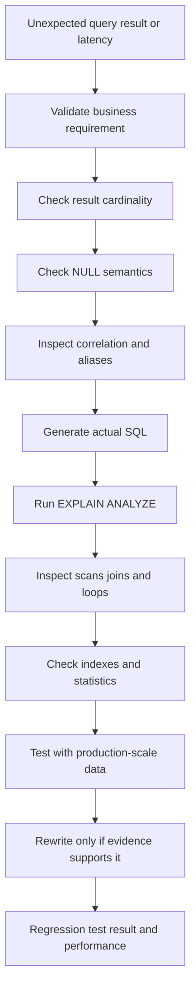

# 25- Common Subquery Mistakes

## Overview

Subqueries are a powerful SQL composition technique, but they introduce several failure modes that are easy to miss during development and can become expensive or incorrect at production scale.

Most subquery mistakes fall into a few categories:

- Incorrect `NULL` semantics, especially with `NOT IN`.
- Incorrect cardinality assumptions.
- Accidental correlation with outer query columns.
- Using a subquery where a join or window function better expresses the operation.
- Executing expensive correlated logic across large datasets.
- Returning duplicate rows because the relational cardinality was misunderstood.
- Moving database work into application code unnecessarily.
- Optimizing based on SQL syntax instead of the actual execution plan.

The key engineering principle is:

> Choose a subquery based on its relational semantics, verify its cardinality, and validate its physical execution plan against realistic data.

## Mistaking Scalar Subqueries for Multi-Row Queries

A scalar subquery must return at most one row.

This query is valid only if the inner query returns exactly one value:

```sql
SELECT
    o.id,
    o.amount
FROM orders AS o
WHERE o.amount > (
    SELECT AVG(amount)
    FROM orders
);
```

The aggregate guarantees one result.

A common mistake is assuming that an arbitrary lookup also returns one row:

```sql
SELECT
    o.id
FROM orders AS o
WHERE o.customer_id = (
    SELECT c.id
    FROM customers AS c
    WHERE c.status = 'active'
);
```

If multiple active customers exist, the database cannot use the result as a scalar value.

Use `IN` when multiple values are valid:

```sql
SELECT
    o.id
FROM orders AS o
WHERE o.customer_id IN (
    SELECT c.id
    FROM customers AS c
    WHERE c.status = 'active'
);
```

Or use `EXISTS` when the requirement is existence rather than membership.

### Production rule

Before using:

```sql
column = (subquery)
```

verify that the subquery's cardinality is guaranteed by:

- Aggregation.
- A unique constraint.
- A primary key.
- A predicate that is otherwise provably unique.

## Using NOT IN with NULL

One of the most important subquery mistakes is:

```sql
SELECT
    c.id,
    c.email
FROM customers AS c
WHERE c.id NOT IN (
    SELECT o.customer_id
    FROM orders AS o
);
```

If `orders.customer_id` can contain `NULL`, SQL's three-valued logic can produce unexpected results.

For example:

```text
NOT IN (10, 20, NULL)
```

does not mean:

```text
value is different from 10, 20, and NULL
```

Because comparison with `NULL` is `UNKNOWN`, the predicate can become `UNKNOWN` rather than `TRUE`.

For anti-existence requirements, prefer:

```sql
SELECT
    c.id,
    c.email
FROM customers AS c
WHERE NOT EXISTS (
    SELECT 1
    FROM orders AS o
    WHERE o.customer_id = c.id
);
```

### Safe use of NOT IN

`NOT IN` can be appropriate when the subquery is guaranteed to contain no `NULL` values:

```sql
SELECT
    c.id,
    c.email
FROM customers AS c
WHERE c.id NOT IN (
    SELECT o.customer_id
    FROM orders AS o
    WHERE o.customer_id IS NOT NULL
);
```

Even then, `NOT EXISTS` is often clearer when the actual requirement is "no related row exists."

## Confusing EXISTS with JOIN

Suppose the requirement is:

> Return customers who have at least one completed order.

A join can express this:

```sql
SELECT DISTINCT
    c.id,
    c.email
FROM customers AS c
JOIN orders AS o
    ON o.customer_id = c.id
WHERE o.status = 'completed';
```

But the join creates one result row per matching order. `DISTINCT` is then needed to restore customer-level cardinality.

`EXISTS` expresses the requirement directly:

```sql
SELECT
    c.id,
    c.email
FROM customers AS c
WHERE EXISTS (
    SELECT 1
    FROM orders AS o
    WHERE o.customer_id = c.id
      AND o.status = 'completed'
);
```

### Why this matters

A join means:

```text
combine matching rows
```

`EXISTS` means:

```text
keep the outer row if at least one match exists
```

When only existence matters, `EXISTS` avoids expressing an unnecessary row multiplication operation.

## Using JOIN When the Relationship Is Only an Existence Test

This pattern is often a code smell:

```sql
SELECT DISTINCT
    u.id,
    u.email
FROM users AS u
JOIN user_roles AS ur
    ON ur.user_id = u.id
WHERE ur.role = 'admin';
```

If no columns from `user_roles` are needed, consider:

```sql
SELECT
    u.id,
    u.email
FROM users AS u
WHERE EXISTS (
    SELECT 1
    FROM user_roles AS ur
    WHERE ur.user_id = u.id
      AND ur.role = 'admin'
);
```

This can also make the intended cardinality obvious to future maintainers.

It does **not** mean `EXISTS` is always faster. The optimizer may produce equivalent physical plans. The semantic distinction is the important starting point.

## Assuming Correlated Subqueries Always Run Once Per Outer Row

Consider:

```sql
SELECT
    o.id,
    o.customer_id,
    o.amount
FROM orders AS o
WHERE o.amount > (
    SELECT AVG(o2.amount)
    FROM orders AS o2
    WHERE o2.customer_id = o.customer_id
);
```

The inner query references:

```sql
o.customer_id
```

from the outer query, making it correlated.

A common assumption is:

```text
outer row 1 -> execute inner query
outer row 2 -> execute inner query
outer row 3 -> execute inner query
...
```

That is a possible execution strategy, but it is not a rule.

Modern optimizers can transform correlated expressions into joins, aggregates, semi-joins, or other execution strategies.

### Correct engineering approach

Do not rewrite a correlated subquery merely because it is correlated.

Inspect the plan:

```sql
EXPLAIN (ANALYZE, BUFFERS)
SELECT
    o.id,
    o.customer_id,
    o.amount
FROM orders AS o
WHERE o.amount > (
    SELECT AVG(o2.amount)
    FROM orders AS o2
    WHERE o2.customer_id = o.customer_id
);
```

Optimize based on measured behavior.

## Ignoring Indexes Required by Correlation

Correlation often introduces predicates such as:

```sql
WHERE o.customer_id = c.id
```

If the related table is large, an appropriate index can be critical.

For:

```sql
SELECT
    c.id
FROM customers AS c
WHERE EXISTS (
    SELECT 1
    FROM orders AS o
    WHERE o.customer_id = c.id
      AND o.status = 'completed'
);
```

an index such as:

```sql
CREATE INDEX idx_orders_customer_status
ON orders (customer_id, status);
```

may provide an efficient access path.

For PostgreSQL, a partial index can sometimes be more efficient when a status is highly selective:

```sql
CREATE INDEX idx_completed_orders_customer
ON orders (customer_id)
WHERE status = 'completed';
```

Index selection must be validated against actual data distribution and workload.

## Assuming an Index Automatically Makes a Subquery Fast

Having an index does not guarantee good performance.

A query can still be expensive because:

- The predicate has low selectivity.
- Most rows qualify.
- The optimizer estimates cardinality incorrectly.
- The outer relation is very large.
- Sorting or aggregation dominates execution.
- The query performs excessive random IO.
- The chosen index does not match the access pattern.
- Statistics are stale.

Use:

```sql
EXPLAIN (ANALYZE, BUFFERS)
```

rather than reasoning only from the existence of an index.

## Returning Duplicate Rows from a Subquery-Based Design

Consider:

```sql
SELECT
    c.id,
    c.email
FROM customers AS c
JOIN orders AS o
    ON o.customer_id = c.id;
```

A customer with five orders appears five times.

If the API requires one customer object per customer, this is a cardinality problem, not merely a formatting issue.

Adding:

```sql
DISTINCT
```

may hide the problem:

```sql
SELECT DISTINCT
    c.id,
    c.email
FROM customers AS c
JOIN orders AS o
    ON o.customer_id = c.id;
```

A better question is whether a join was appropriate in the first place.

If only existence is required:

```sql
SELECT
    c.id,
    c.email
FROM customers AS c
WHERE EXISTS (
    SELECT 1
    FROM orders AS o
    WHERE o.customer_id = c.id
);
```

### Production impact

Incorrect cardinality can affect:

- REST response size.
- gRPC result sets.
- Pagination.
- Counts.
- Sorting.
- Memory usage.
- Application-level deduplication.
- Database CPU.

## Using DISTINCT to Hide a Bad Relational Design

`DISTINCT` is useful when duplicate elimination is genuinely part of the required result.

It should not automatically be used to compensate for an unintended join multiplication.

For example:

```sql
SELECT DISTINCT
    c.id
FROM customers AS c
JOIN orders AS o
    ON o.customer_id = c.id;
```

Ask first:

> Does the query need order rows, or does it only need to know whether an order exists?

If the answer is existence, `EXISTS` may better model the requirement.

## Moving Subquery Work into Python

A common backend anti-pattern is:

```python
customer_ids = list(
    Order.objects
    .filter(status="completed")
    .values_list("customer_id", flat=True)
)

customers = Customer.objects.filter(id__in=customer_ids)
```

This causes the application to retrieve an intermediate dataset before sending another query.

For large datasets, that can increase:

- Application memory usage.
- Network traffic.
- Query latency.
- Garbage collection pressure.
- Database round trips.

Prefer database-side composition where possible.

In Django:

```python
from django.db.models import Exists, OuterRef

completed_orders = Order.objects.filter(
    customer_id=OuterRef("pk"),
    status="completed",
)

customers = (
    Customer.objects
    .annotate(has_completed_order=Exists(completed_orders))
    .filter(has_completed_order=True)
)
```

The database remains responsible for relational processing.

## Creating N+1 Queries Instead of One Set-Based Query

This is another common ORM mistake:

```python
for customer in Customer.objects.all():
    has_orders = Order.objects.filter(
        customer_id=customer.id,
    ).exists()

    if has_orders:
        process(customer)
```

Conceptually:

```text
1 query -> load customers
N queries -> check orders
```

For 50,000 customers, this can become 50,001 database queries.

A database-side existence predicate is preferable:

```python
from django.db.models import Exists, OuterRef

orders = Order.objects.filter(
    customer_id=OuterRef("pk"),
)

customers = (
    Customer.objects
    .annotate(has_orders=Exists(orders))
    .filter(has_orders=True)
)
```

This preserves set-based execution.

## Selecting More Columns Than Necessary in EXISTS

Inside `EXISTS`, the selected expression does not determine the result.

These are semantically equivalent:

```sql
EXISTS (
    SELECT 1
    FROM orders AS o
    WHERE o.customer_id = c.id
)
```

and:

```sql
EXISTS (
    SELECT o.amount
    FROM orders AS o
    WHERE o.customer_id = c.id
)
```

Prefer:

```sql
SELECT 1
```

because it communicates the intent clearly:

> Only existence matters.

Do not expect `SELECT 1` itself to magically make the query faster. The optimizer generally does not need the projected value for an `EXISTS` predicate.

## Forgetting That EXISTS Ignores the Selected Value

This is unnecessary:

```sql
WHERE EXISTS (
    SELECT o.amount
    FROM orders AS o
    WHERE o.customer_id = c.id
);
```

The condition does not mean:

```text
amount exists
```

It means:

```text
at least one matching row exists
```

If the amount itself matters, use a predicate or another query construct:

```sql
WHERE EXISTS (
    SELECT 1
    FROM orders AS o
    WHERE o.customer_id = c.id
      AND o.amount >= 1000
);
```

## Using IN When EXISTS Better Expresses the Requirement

These can often be equivalent:

```sql
SELECT
    c.id
FROM customers AS c
WHERE c.id IN (
    SELECT o.customer_id
    FROM orders AS o
    WHERE o.status = 'completed'
);
```

and:

```sql
SELECT
    c.id
FROM customers AS c
WHERE EXISTS (
    SELECT 1
    FROM orders AS o
    WHERE o.customer_id = c.id
      AND o.status = 'completed'
);
```

If the requirement is:

> Does this customer have a completed order?

`EXISTS` usually communicates the intent more directly.

If the requirement is:

> Is this ID a member of the set produced by this query?

`IN` is a natural expression.

Do not apply a universal rule that one must always replace the other. Query semantics and execution plans matter.

## Assuming NOT EXISTS and NOT IN Are Always Equivalent

These are not universally equivalent:

```sql
WHERE c.id NOT IN (
    SELECT o.customer_id
    FROM orders AS o
);
```

and:

```sql
WHERE NOT EXISTS (
    SELECT 1
    FROM orders AS o
    WHERE o.customer_id = c.id
);
```

`NULL` values can change `NOT IN` behavior.

For relational anti-existence:

```sql
NOT EXISTS
```

is generally the safer default.

## Forgetting NULL Semantics in Other Subqueries

`NULL` is not equal to zero, an empty string, or another `NULL`.

This does not find customers whose `customer_id` is `NULL`:

```sql
WHERE customer_id = NULL
```

Use:

```sql
WHERE customer_id IS NULL
```

Likewise, subquery predicates can produce `UNKNOWN` when `NULL` participates in comparisons.

Before using:

- `IN`
- `NOT IN`
- `=`
- `<>`
- `ANY`
- `ALL`

consider whether nullable values can enter the comparison.

## Using a Subquery When a Window Function Is More Natural

Suppose the requirement is:

> Find products priced above the average price in their category.

A correlated subquery works:

```sql
SELECT
    p.id,
    p.category_id,
    p.price
FROM products AS p
WHERE p.price > (
    SELECT AVG(p2.price)
    FROM products AS p2
    WHERE p2.category_id = p.category_id
);
```

A window function can express the same analytical relationship:

```sql
SELECT
    id,
    category_id,
    price
FROM (
    SELECT
        p.id,
        p.category_id,
        p.price,
        AVG(p.price) OVER (
            PARTITION BY p.category_id
        ) AS category_average
    FROM products AS p
) AS ranked
WHERE price > category_average;
```

Window functions are often preferable when the query needs both:

- Individual row data.
- A calculation across that row's group.

The right choice depends on the complete query and execution plan.

## Using a Subquery When a CTE Improves Structure

Deep nesting can make SQL difficult to review:

```sql
SELECT ...
FROM (
    SELECT ...
    FROM (
        SELECT ...
        FROM ...
    ) AS first_stage
) AS second_stage;
```

A CTE can make logical stages explicit:

```sql
WITH active_customers AS (
    SELECT
        id
    FROM customers
    WHERE status = 'active'
),
customer_totals AS (
    SELECT
        o.customer_id,
        SUM(o.amount) AS total_amount
    FROM orders AS o
    JOIN active_customers AS ac
        ON ac.id = o.customer_id
    GROUP BY o.customer_id
)
SELECT
    customer_id,
    total_amount
FROM customer_totals
WHERE total_amount >= 10000;
```

Use a CTE when named intermediate stages materially improve readability or reuse.

Do not assume a CTE is automatically faster than a subquery.

## Assuming CTEs and Subqueries Have Identical Optimization Behavior

A CTE is primarily a query-structuring mechanism, but database engines can apply different optimization rules depending on the database and query.

For PostgreSQL, CTE behavior has evolved significantly across versions. Some CTEs can be inlined, while others may be materialized based on query semantics and explicit directives.

For example:

```sql
WITH customer_totals AS MATERIALIZED (
    SELECT
        customer_id,
        SUM(amount) AS total_amount
    FROM orders
    GROUP BY customer_id
)
SELECT *
FROM customer_totals
WHERE total_amount >= 10000;
```

and:

```sql
WITH customer_totals AS NOT MATERIALIZED (
    SELECT
        customer_id,
        SUM(amount) AS total_amount
    FROM orders
    GROUP BY customer_id
)
SELECT *
FROM customer_totals
WHERE total_amount >= 10000;
```

have different optimization implications.

The exact behavior is database-engine and version dependent.

## Correlating Against the Wrong Column

A subtle mistake is using an incorrect outer reference:

```sql
SELECT
    c.id
FROM customers AS c
WHERE EXISTS (
    SELECT 1
    FROM orders AS o
    WHERE o.customer_id = c.id
      AND EXISTS (
          SELECT 1
          FROM order_events AS e
          WHERE e.order_id = c.id
      )
);
```

The event relationship should likely reference the order:

```sql
SELECT
    c.id
FROM customers AS c
WHERE EXISTS (
    SELECT 1
    FROM orders AS o
    WHERE o.customer_id = c.id
      AND EXISTS (
          SELECT 1
          FROM order_events AS e
          WHERE e.order_id = o.id
      )
);
```

Nested correlation requires careful aliasing.

### Best practice

Use explicit, descriptive aliases:

```sql
customers AS c
orders AS o
order_events AS e
```

Avoid ambiguous aliases such as:

```sql
a
b
c
d
```

in deeply nested production queries.

## Accidentally Creating Correlation

Correlation can be introduced simply by referencing an outer alias.

This query is non-correlated:

```sql
SELECT
    c.id
FROM customers AS c
WHERE c.id IN (
    SELECT o.customer_id
    FROM orders AS o
    WHERE o.status = 'completed'
);
```

This one is correlated:

```sql
SELECT
    c.id
FROM customers AS c
WHERE EXISTS (
    SELECT 1
    FROM orders AS o
    WHERE o.customer_id = c.id
      AND o.status = 'completed'
);
```

Correlation is not inherently bad, but it changes the logical dependency of the query.

Review aliases carefully when modifying complex SQL.

## Ignoring Cardinality Before Choosing a Pattern

The desired output cardinality should influence the SQL construct.

| Requirement | Natural pattern |
|---|---|
| Exactly one value | Scalar subquery |
| Value belongs to a set | `IN` |
| At least one related row | `EXISTS` |
| No related row | `NOT EXISTS` |
| Return related rows | `JOIN` |
| One row per group | Window function or grouped query |
| Multi-stage relation | CTE or derived table |

Many SQL bugs are fundamentally cardinality bugs.

Before writing the query, state explicitly:

```text
Expected input rows: customers
Expected output: one row per customer
Relationship: zero-to-many orders
Condition: at least one qualifying order
```

That naturally points toward:

```sql
EXISTS
```

rather than an unrestricted join.

## Applying LIMIT Without Understanding Correlation

This query can be misleading:

```sql
SELECT
    c.id,
    c.email
FROM customers AS c
WHERE EXISTS (
    SELECT 1
    FROM orders AS o
    WHERE o.customer_id = c.id
    ORDER BY o.created_at DESC
    LIMIT 1
);
```

For `EXISTS`, once existence is established, ordering does not affect the boolean result.

The `ORDER BY` is therefore unnecessary:

```sql
SELECT
    c.id,
    c.email
FROM customers AS c
WHERE EXISTS (
    SELECT 1
    FROM orders AS o
    WHERE o.customer_id = c.id
);
```

If the actual requirement is to retrieve the latest order, use a query that expresses row selection explicitly.

## Using ORDER BY Inside a Subquery Without a Reason

An `ORDER BY` inside a subquery does not generally guarantee ordering of the outer result.

This is often unnecessary:

```sql
SELECT
    c.id
FROM customers AS c
WHERE c.id IN (
    SELECT o.customer_id
    FROM orders AS o
    ORDER BY o.created_at DESC
);
```

If the outer result needs ordering:

```sql
SELECT
    c.id
FROM customers AS c
WHERE c.id IN (
    SELECT o.customer_id
    FROM orders AS o
)
ORDER BY c.id;
```

Ordering should be applied at the query level where the ordering is actually required.

## Filtering Too Late

Consider:

```sql
SELECT
    c.id,
    c.email
FROM customers AS c
WHERE EXISTS (
    SELECT 1
    FROM orders AS o
    WHERE o.customer_id = c.id
)
AND c.status = 'active';
```

This can be logically correct, but query design should make filtering opportunities clear.

A logically equivalent structure is:

```sql
SELECT
    c.id,
    c.email
FROM customers AS c
WHERE c.status = 'active'
  AND EXISTS (
      SELECT 1
      FROM orders AS o
      WHERE o.customer_id = c.id
  );
```

The optimizer may reorder predicates, so SQL textual order is not itself a performance guarantee.

The important principle is to express all selective predicates clearly and verify the resulting plan.

## Failing to Test Production-Scale Data

A subquery that performs well with:

```text
1,000 customers
10,000 orders
```

may behave differently with:

```text
50,000,000 customers
2,000,000,000 orders
```

Test important queries with realistic:

- Row counts.
- Data distribution.
- Null frequency.
- Cardinality.
- Selectivity.
- Concurrent workload.

A query plan is data-dependent. Small development datasets can hide:

- Sequential scans.
- Bad join choices.
- Memory spills.
- Poor cardinality estimates.
- Excessive nested loops.

## Ignoring Execution Plans

SQL syntax alone cannot tell you the actual cost of a query.

For PostgreSQL:

```sql
EXPLAIN (ANALYZE, BUFFERS)
SELECT
    c.id,
    c.email
FROM customers AS c
WHERE NOT EXISTS (
    SELECT 1
    FROM orders AS o
    WHERE o.customer_id = c.id
);
```

Pay particular attention to:

| Plan signal | What to investigate |
|---|---|
| Sequential scan | Is a full scan expected? |
| High actual rows | Is filtering selective enough? |
| Estimated vs actual rows differ greatly | Are statistics inaccurate? |
| Nested loop with huge loops | Is the access path appropriate? |
| High shared reads | Is the query IO-bound? |
| Sort or hash spill | Is work memory insufficient or the operation too large? |
| Large execution time | Which node consumes most of the time? |

Optimize the expensive operation, not the SQL construct that merely looks suspicious.

## Common ORM Mistakes

### Accidental query evaluation

In Python/Django, converting a queryset to a list can execute the query:

```python
customer_ids = list(
    Customer.objects
    .filter(status="active")
    .values_list("id", flat=True)
)
```

If those IDs are immediately used in another query, consider preserving the database-side query:

```python
active_customer_ids = Customer.objects.filter(
    status="active",
).values("id")

orders = Order.objects.filter(
    customer_id__in=active_customer_ids,
)
```

This allows the database to compose the operation.

### Using Python membership checks

Avoid:

```python
active_ids = set(
    Customer.objects
    .filter(status="active")
    .values_list("id", flat=True)
)

orders = [
    order
    for order in Order.objects.all()
    if order.customer_id in active_ids
]
```

This transfers potentially large datasets into application memory.

Use a database predicate instead.

## Security Mistakes

Subqueries are not a reason to construct SQL with string interpolation.

Unsafe:

```python
status = request.GET["status"]

query = f"""
SELECT id
FROM customers
WHERE id IN (
    SELECT customer_id
    FROM orders
    WHERE status = '{status}'
)
"""
```

Use parameterized queries:

```python
from django.db import connection

with connection.cursor() as cursor:
    cursor.execute(
        """
        SELECT id
        FROM customers
        WHERE id IN (
            SELECT customer_id
            FROM orders
            WHERE status = %s
        )
        """,
        [status],
    )
```

Or use the ORM where practical.

Subqueries do not change the fundamental SQL injection rule:

> SQL structure must remain separate from user-controlled values.

## Production Review Checklist

Before shipping a subquery, verify:

- **Cardinality:** Does the inner query return the number of rows the outer operator expects?
- **NULL behavior:** Can `NULL` alter `IN`, `NOT IN`, or comparison semantics?
- **Correlation:** Is the inner query intentionally correlated?
- **Aliases:** Are outer references unambiguous?
- **Result shape:** Does the query return the intended number of rows?
- **Indexes:** Are correlation and filtering columns appropriately indexed?
- **Execution plan:** Has the query been analyzed with realistic data?
- **ORM SQL:** Does the framework generate the intended SQL?
- **N+1 risk:** Is application code repeatedly executing equivalent subqueries?
- **Pagination:** Can joins or subqueries multiply API results?
- **Security:** Are dynamic values parameterized?
- **Operational load:** How frequently does the query execute?
- **Observability:** Can slow-query behavior be detected in production?

## Debugging Workflow

A practical debugging process is:



This prevents premature rewrites based on assumptions.

## High-Risk Mistakes at a Glance

| Mistake | Typical consequence | Preferred approach |
|---|---|---|
| Scalar subquery returns multiple rows | Cardinality error | Guarantee uniqueness or use `IN`/`EXISTS` |
| `NOT IN` with `NULL` | Missing or unexpected rows | Prefer `NOT EXISTS` |
| Join used only for existence | Duplicate rows | Consider `EXISTS` |
| Correlation assumed to be slow | Unnecessary rewrite | Inspect execution plan |
| Correlated predicate lacks index | High IO or repeated work | Design an appropriate index |
| `DISTINCT` hides join multiplication | Expensive query, hidden design issue | Fix cardinality at the relational level |
| Subquery results loaded into Python | Memory and network overhead | Keep computation in SQL |
| ORM loop performs existence queries | N+1 queries | Use ORM subquery/`Exists` |
| Deep nested subqueries | Poor maintainability | Consider CTEs or simpler relational expressions |
| `ORDER BY` inside `EXISTS` | Unnecessary work | Remove it |
| Dynamic SQL interpolation | SQL injection | Parameterize values |
| No production-scale testing | Performance surprises | Test realistic cardinality and distribution |

## Key Takeaways

- **Validate subquery cardinality and `NULL` semantics before assuming the query is correct; scalar subqueries and `NOT IN` are common sources of production bugs.**
- **Use `EXISTS` and `NOT EXISTS` when the requirement is existence or anti-existence rather than row retrieval or set manipulation.**
- **Do not assume correlated subqueries are inherently slow; inspect execution plans, indexes, cardinality estimates, and actual workload behavior.**
- **Avoid using `DISTINCT`, Python loops, or ORM evaluation to hide relational-design problems such as accidental row multiplication or N+1 queries.**
- **Production subquery quality depends on semantics, indexing, realistic data volume, execution plans, parameterization, and operational query frequency—not SQL syntax alone.**