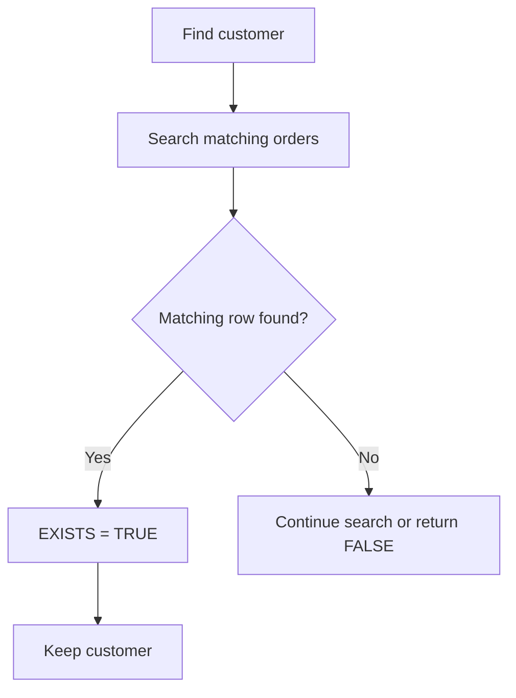

# 26- Subquery Performance

## Overview

Subqueries are not inherently slow. Their performance depends on the relational operation being expressed, the optimizer's chosen execution strategy, data distribution, indexes, cardinality estimates, and workload concurrency.

The same logical query can sometimes be executed as:

- A nested-loop lookup.
- A hash-based operation.
- A semi-join or anti-join.
- An aggregate followed by a join.
- An index-driven lookup.
- A materialized intermediate result.
- A transformed equivalent of the original subquery.

Therefore, senior-level SQL performance work should focus on the **execution plan and measured workload**, not on simplistic rules such as "subqueries are slower than joins."

For backend systems, this matters because inefficient queries directly affect:

- API latency.
- Database CPU and IO.
- Connection pool utilization.
- Application throughput.
- Cloud database cost.
- Lock duration.
- Horizontal scalability.

## What Determines Subquery Performance

A subquery's performance is primarily influenced by five factors:

| Factor | Performance impact |
|---|---|
| Outer relation size | Determines how many rows may drive the operation |
| Inner relation size | Determines how much data must be searched or processed |
| Selectivity | Determines how many rows survive filtering |
| Index availability | Determines whether lookups can avoid large scans |
| Optimizer strategy | Determines the physical execution method |

Consider:

```sql
SELECT
    c.id,
    c.email
FROM customers AS c
WHERE EXISTS (
    SELECT 1
    FROM orders AS o
    WHERE o.customer_id = c.id
      AND o.status = 'completed'
);
```

Logically, this asks whether at least one matching order exists.

Physically, the database may choose an execution strategy equivalent to a semi-join rather than literally executing the inner query independently for every customer.

This distinction is fundamental:

> SQL describes the desired result; the optimizer chooses how to produce it.

## Correlated Subquery Performance

A correlated subquery references a column from the outer query.

```sql
SELECT
    o.id,
    o.customer_id,
    o.amount
FROM orders AS o
WHERE o.amount > (
    SELECT AVG(o2.amount)
    FROM orders AS o2
    WHERE o2.customer_id = o.customer_id
);
```

The inner query depends on the current outer row.

The logical dependency is:


A naive mental model says:

```text
For every outer row:
    execute the inner query
```

That can happen, particularly with an unsuitable plan, but it is not guaranteed.

Database optimizers can transform correlated expressions into more efficient relational operations.

### When correlation becomes expensive

Correlation is more concerning when:

- The outer relation contains millions of rows.
- The inner predicate is poorly indexed.
- The correlated condition has low selectivity.
- The inner operation performs aggregation or sorting.
- The optimizer cannot decorrelate the expression effectively.
- The query is executed frequently under high concurrency.

Always validate with an execution plan.

## Indexing Correlated Subqueries

Consider:

```sql
SELECT
    c.id
FROM customers AS c
WHERE EXISTS (
    SELECT 1
    FROM orders AS o
    WHERE o.customer_id = c.id
      AND o.status = 'completed'
);
```

A useful index may be:

```sql
CREATE INDEX idx_orders_customer_status
ON orders (customer_id, status);
```

The index supports the correlated lookup:

```text
customer.id
    ↓
orders.customer_id
    ↓
status = 'completed'
    ↓
matching row found
```

For PostgreSQL, if only completed orders matter and the condition is stable, a partial index may be more compact:

```sql
CREATE INDEX idx_orders_completed_customer
ON orders (customer_id)
WHERE status = 'completed';
```

This can reduce index size and improve lookup efficiency.

### Indexing principle

Index for the **actual predicate and access pattern**, not merely for the existence of a subquery.

For a correlated condition such as:

```sql
WHERE o.customer_id = c.id
  AND o.status = 'completed'
```

the useful access path is different from one where the query primarily filters by:

```sql
WHERE o.status = 'completed'
```

Always validate the choice using the execution plan and actual workload.

## EXISTS and Early Termination

`EXISTS` has an important semantic property:

> The database only needs to establish that at least one matching row exists.

For:

```sql
SELECT
    c.id
FROM customers AS c
WHERE EXISTS (
    SELECT 1
    FROM orders AS o
    WHERE o.customer_id = c.id
);
```

the database does not need to return every matching order.

Conceptually:



An appropriate index can make the first matching-row lookup inexpensive.

This is one reason `EXISTS` is often a strong expression for existence checks.

However, do not assume every `EXISTS` query automatically short-circuits in a way that produces a dramatic performance benefit. The optimizer's physical plan determines the actual work.

## IN and Subquery Performance

Consider:

```sql
SELECT
    c.id
FROM customers AS c
WHERE c.id IN (
    SELECT o.customer_id
    FROM orders AS o
    WHERE o.status = 'completed'
);
```

Depending on the database and data distribution, the optimizer may transform this into a semi-join or another equivalent operation.

Potential strategies include:

- Hash-based membership.
- Index-driven lookups.
- Semi-joins.
- Materialization.
- Other optimizer-specific transformations.

Therefore:

```sql
IN
```

is not automatically slower than:

```sql
EXISTS
```

The appropriate choice should first be based on semantics and then validated with the execution plan.

## NOT EXISTS and Anti-Join Performance

For anti-existence:

```sql
SELECT
    c.id
FROM customers AS c
WHERE NOT EXISTS (
    SELECT 1
    FROM orders AS o
    WHERE o.customer_id = c.id
);
```

the database can often use an anti-join-like execution strategy.

A suitable index on:

```sql
orders(customer_id)
```

can make the existence check efficient.

For example:

```sql
CREATE INDEX idx_orders_customer_id
ON orders (customer_id);
```

This is particularly important when the query scans many customers but only needs to establish whether a related order exists.

## NOT IN and Performance

This query:

```sql
SELECT
    c.id
FROM customers AS c
WHERE c.id NOT IN (
    SELECT o.customer_id
    FROM orders AS o
);
```

has both correctness and performance considerations.

Correctness is affected by `NULL` values in the subquery.

If `customer_id` is nullable, prefer:

```sql
SELECT
    c.id
FROM customers AS c
WHERE NOT EXISTS (
    SELECT 1
    FROM orders AS o
    WHERE o.customer_id = c.id
);
```

The optimizer may transform the two forms differently depending on the database and constraints.

Correct semantics should be established before optimizing the query.

## Scalar Subquery Performance

A scalar subquery returns a single value.

Example:

```sql
SELECT
    o.id,
    o.amount,
    (
        SELECT AVG(o2.amount)
        FROM orders AS o2
    ) AS average_order_amount
FROM orders AS o;
```

The subquery is independent of the outer row.

Because it does not depend on `o`, the database may evaluate or materialize the result efficiently rather than performing identical work for every output row.

A correlated scalar subquery is different:

```sql
SELECT
    o.id,
    o.amount,
    (
        SELECT AVG(o2.amount)
        FROM orders AS o2
        WHERE o2.customer_id = o.customer_id
    ) AS customer_average
FROM orders AS o;
```

The second form potentially requires substantially more work.

### Performance rule

When a scalar subquery is correlated, ask:

> Can the same result be computed once with a grouped aggregate or window function?

For example:

```sql
SELECT
    o.id,
    o.customer_id,
    o.amount,
    AVG(o.amount) OVER (
        PARTITION BY o.customer_id
    ) AS customer_average
FROM orders AS o;
```

This can express the calculation more directly when the individual order rows and group-level calculation are both required.

## Subquery vs JOIN: Performance Is Not a Syntax Contest

These queries can express similar requirements:

```sql
SELECT
    c.id
FROM customers AS c
WHERE EXISTS (
    SELECT 1
    FROM orders AS o
    WHERE o.customer_id = c.id
      AND o.status = 'completed'
);
```

and:

```sql
SELECT DISTINCT
    c.id
FROM customers AS c
JOIN orders AS o
    ON o.customer_id = c.id
WHERE o.status = 'completed';
```

Do not assume one is universally faster.

The important differences are:

- `EXISTS` expresses existence.
- `JOIN` produces matching combinations.
- `DISTINCT` may require additional duplicate-elimination work.
- The optimizer may transform either query into similar physical operations.

Use the form that correctly expresses the desired cardinality, then compare plans when performance matters.

## Subquery vs CTE: Performance Considerations

A CTE can improve readability:

```sql
WITH customer_totals AS (
    SELECT
        customer_id,
        SUM(amount) AS total_amount
    FROM orders
    GROUP BY customer_id
)
SELECT
    c.id,
    c.email,
    ct.total_amount
FROM customers AS c
JOIN customer_totals AS ct
    ON ct.customer_id = c.id
WHERE ct.total_amount >= 10000;
```

But introducing a CTE does not automatically improve performance.

Database-specific optimizer behavior matters. In PostgreSQL, CTEs can be inlined in many cases, while explicit materialization can force an intermediate result:

```sql
WITH customer_totals AS MATERIALIZED (
    SELECT
        customer_id,
        SUM(amount) AS total_amount
    FROM orders
    GROUP BY customer_id
)
SELECT
    customer_id,
    total_amount
FROM customer_totals
WHERE total_amount >= 10000;
```

Materialization can be useful when reuse justifies computing an intermediate result once, but it can also prevent beneficial optimization or predicate pushdown.

Treat CTE materialization as an execution-plan decision, not a formatting preference.

## Derived Tables and Materialization

A derived table is a subquery in the `FROM` clause:

```sql
SELECT
    customer_id,
    total_amount
FROM (
    SELECT
        customer_id,
        SUM(amount) AS total_amount
    FROM orders
    GROUP BY customer_id
) AS totals
WHERE total_amount >= 10000;
```

The database may optimize the derived table into the surrounding query rather than physically materializing it.

Do not assume:

```sql
FROM (subquery)
```

means:

```text
execute subquery
store all rows
execute outer query
```

The physical behavior depends on the optimizer.

## Predicate Pushdown

Consider:

```sql
SELECT
    *
FROM (
    SELECT
        id,
        customer_id,
        amount
    FROM orders
) AS o
WHERE o.customer_id = 42;
```

A capable optimizer may push:

```sql
customer_id = 42
```

into the underlying scan.

Conceptually:

```text
Logical SQL
    ↓
Parse
    ↓
Rewrite / optimization
    ↓
Predicate pushdown
    ↓
Physical execution plan
```

This is why rewriting SQL solely to make filtering appear "inside" a subquery may have no performance effect.

The execution plan is the authoritative source.

## Cardinality Estimates

Query optimizers make decisions using estimates.

For example, the optimizer might estimate:

```text
customers: 1,000,000 rows
matching customers: 10,000 rows
```

but actual execution might produce:

```text
matching customers: 400,000 rows
```

A large estimate error can cause a poor plan.

Common causes include:

- Stale statistics.
- Highly skewed data.
- Correlated columns.
- Rapidly changing distributions.
- Complex predicates.
- Insufficient statistics.

For PostgreSQL, inspect:

```sql
EXPLAIN (ANALYZE, BUFFERS)
SELECT
    c.id
FROM customers AS c
WHERE EXISTS (
    SELECT 1
    FROM orders AS o
    WHERE o.customer_id = c.id
      AND o.status = 'completed'
);
```

Compare estimated and actual row counts at important plan nodes.

## EXPLAIN ANALYZE for Subqueries

For PostgreSQL, a production-oriented starting point is:

```sql
EXPLAIN (
    ANALYZE,
    BUFFERS,
    VERBOSE
)
SELECT
    c.id,
    c.email
FROM customers AS c
WHERE EXISTS (
    SELECT 1
    FROM orders AS o
    WHERE o.customer_id = c.id
      AND o.status = 'completed'
);
```

Important signals include:

| Signal | What it tells you |
|---|---|
| `actual time` | Where execution time is spent |
| `actual rows` | Rows actually produced |
| `loops` | How many times a plan node executed |
| `rows` estimate | Optimizer's expected cardinality |
| `Buffers` | Memory/cache and disk IO behavior |
| `Index Scan` | Index-driven access |
| `Seq Scan` | Sequential table scan |
| `Nested Loop` | Repeated inner-side lookup |
| `Hash Join` | Hash-based relational operation |
| `Materialize` | Reusable intermediate results |

A nested loop is not inherently bad. It can be ideal when the outer relation is small and the inner relation has a highly selective index.

Likewise, a sequential scan is not inherently bad when scanning most of a table is cheaper than many random index lookups.

## Nested Loop Risk

A correlated subquery can lead to a plan with repeated inner operations.

Conceptually:

```text
Outer rows:        1,000,000
Inner executions:  1,000,000
```

If every inner execution performs expensive work, latency can become unacceptable.

For example:

```sql
SELECT
    c.id
FROM customers AS c
WHERE (
    SELECT COUNT(*)
    FROM orders AS o
    WHERE o.customer_id = c.id
) > 10;
```

The query may require substantial per-customer work.

A grouped query can sometimes compute the relationship more efficiently:

```sql
SELECT
    c.id
FROM customers AS c
JOIN (
    SELECT
        customer_id
    FROM orders
    GROUP BY customer_id
    HAVING COUNT(*) > 10
) AS order_counts
    ON order_counts.customer_id = c.id;
```

Another alternative is:

```sql
SELECT
    c.id
FROM customers AS c
WHERE EXISTS (
    SELECT 1
    FROM orders AS o
    WHERE o.customer_id = c.id
    GROUP BY o.customer_id
    HAVING COUNT(*) > 10
);
```

Which version is faster depends on the optimizer, indexes, table sizes, and data distribution.

## Aggregation Inside Subqueries

Aggregates can dominate query cost.

Consider:

```sql
SELECT
    c.id
FROM customers AS c
WHERE (
    SELECT SUM(o.amount)
    FROM orders AS o
    WHERE o.customer_id = c.id
) > 10000;
```

If executed inefficiently, the database may repeatedly aggregate order rows.

A pre-aggregated relation can make the intended computation clearer:

```sql
SELECT
    c.id
FROM customers AS c
JOIN (
    SELECT
        customer_id,
        SUM(amount) AS total_amount
    FROM orders
    GROUP BY customer_id
) AS totals
    ON totals.customer_id = c.id
WHERE totals.total_amount > 10000;
```

For very large datasets, aggregation strategy, indexes, memory availability, and parallel execution can have significant effects.

## Index-Only Access

For existence checks, the ideal plan may be able to determine a match using only index data.

Suppose:

```sql
CREATE INDEX idx_orders_customer_status
ON orders (customer_id, status);
```

and the query is:

```sql
SELECT
    c.id
FROM customers AS c
WHERE EXISTS (
    SELECT 1
    FROM orders AS o
    WHERE o.customer_id = c.id
      AND o.status = 'completed'
);
```

The required predicate columns are contained in the index.

Depending on database engine, visibility information, and other conditions, this may allow an index-only access path.

Do not design an index solely to force an index-only scan. Indexes have costs:

- Storage.
- Write amplification.
- Vacuum or maintenance overhead.
- Cache pressure.
- Additional planning complexity.

## Composite Index Ordering

For:

```sql
WHERE o.customer_id = c.id
  AND o.status = 'completed'
```

the index:

```sql
CREATE INDEX idx_orders_customer_status
ON orders (customer_id, status);
```

supports the access pattern well in many workloads.

But:

```sql
CREATE INDEX idx_orders_status_customer
ON orders (status, customer_id);
```

may be better for workloads primarily filtering by status.

There is no universally correct column order.

Index design should consider:

- Equality predicates.
- Range predicates.
- Join conditions.
- Sort requirements.
- Selectivity.
- Query frequency.
- Write workload.

## Partial Indexes

When a query repeatedly targets a stable subset, a partial index can reduce index size.

For example:

```sql
CREATE INDEX idx_orders_completed_customer
ON orders (customer_id)
WHERE status = 'completed';
```

This can be useful for:

```sql
WHERE o.customer_id = c.id
  AND o.status = 'completed'
```

Advantages include:

- Smaller index.
- Less write overhead than indexing all rows.
- Potentially better cache efficiency.
- Faster access to the targeted subset.

Limitations include:

- Database-specific syntax.
- Predicate must match the intended query semantics.
- Additional indexes still increase write and maintenance cost.

## Statistics and Data Distribution

Performance can change as production data evolves.

For example, a status distribution might change from:

```text
completed: 10%
pending:    5%
cancelled: 85%
```

to:

```text
completed: 70%
pending:   20%
cancelled: 10%
```

An index or plan that was effective under the first distribution may be less effective under the second.

Monitor long-running queries and periodically review:

- Table statistics.
- Index usage.
- Query latency.
- Rows examined.
- Buffer reads.
- Query frequency.

## Subquery Performance in Django

Django's ORM supports database-side subqueries through expressions such as `Subquery`, `OuterRef`, and `Exists`.

Example:

```python
from django.db.models import Exists, OuterRef

completed_orders = Order.objects.filter(
    customer_id=OuterRef("pk"),
    status="completed",
)

customers = (
    Customer.objects
    .annotate(
        has_completed_order=Exists(completed_orders),
    )
    .filter(
        has_completed_order=True,
    )
)
```

This avoids fetching order IDs into Python.

Inspect generated SQL during performance investigations:

```python
print(customers.query)
```

For more serious analysis, execute the generated SQL through the database's execution-plan tooling rather than relying only on ORM abstractions.

## Avoiding N+1 Query Patterns

This application-level pattern is expensive:

```python
for customer in Customer.objects.iterator():
    if Order.objects.filter(
        customer_id=customer.id,
        status="completed",
    ).exists():
        process(customer)
```

The database can receive one query for the customers plus potentially one query per customer.

Instead, compose the existence condition into the queryset:

```python
from django.db.models import Exists, OuterRef

completed_orders = Order.objects.filter(
    customer_id=OuterRef("pk"),
    status="completed",
)

customers = (
    Customer.objects
    .annotate(has_completed_order=Exists(completed_orders))
    .filter(has_completed_order=True)
)

for customer in customers.iterator():
    process(customer)
```

The ORM still generates SQL that the database can optimize as a set-based operation.

## Subquery Performance in API Systems

Suppose a FastAPI endpoint returns active customers who have completed orders:

```text
Client
  |
  v
Nginx / Load Balancer
  |
  v
FastAPI
  |
  v
Connection Pool
  |
  v
PostgreSQL
```

The SQL query executes inside the database process. Poor query performance therefore consumes database resources independently of the API framework.

A query that takes 20 ms may appear acceptable individually, but at high concurrency:

```text
2,000 requests/sec × 20 ms database work
```

can create substantial concurrent database pressure.

The relevant production metric is not only query latency but also:

- Queries per second.
- Concurrent executions.
- CPU utilization.
- IO utilization.
- Connection pool saturation.
- Lock waits.
- Cache hit rate.
- p95/p99 latency.

## Pagination and Subqueries

Subqueries can interact with pagination in unexpected ways.

For example:

```sql
SELECT
    c.id,
    c.email
FROM customers AS c
WHERE EXISTS (
    SELECT 1
    FROM orders AS o
    WHERE o.customer_id = c.id
)
ORDER BY c.id
LIMIT 50;
```

This is naturally customer-level: one output row per customer.

A join-based alternative may produce many order rows before deduplication:

```sql
SELECT DISTINCT
    c.id,
    c.email
FROM customers AS c
JOIN orders AS o
    ON o.customer_id = c.id
ORDER BY c.id
LIMIT 50;
```

Depending on the plan, the database may need to process many matching rows before it can establish the final 50 unique customers.

For APIs, always verify:

- Result cardinality.
- Pagination correctness.
- Ordering stability.
- Cost of filtering before pagination.
- Whether duplicate elimination occurs before or after expensive operations.

## Caching Is Not a Substitute for Query Optimization

Redis can reduce database load for genuinely cacheable results, but caching should not be used to hide an inefficient query without understanding its cause.

A better progression is:

```text
Correct query
    ↓
Appropriate indexes
    ↓
Execution-plan validation
    ↓
Data-access optimization
    ↓
Application-level caching where justified
```

Caching introduces additional concerns:

- Invalidation.
- Staleness.
- Memory consumption.
- Cache stampedes.
- Key design.
- Failure behavior.

If the query is fundamentally inefficient, fixing the database operation is usually preferable to indefinitely caching its output.

## Read Replicas and Subquery Workloads

Read replicas can distribute read traffic, but they do not make an inefficient query intrinsically efficient.

For a heavily executed subquery:

```text
Application
    |
    +---- Primary DB
    |
    +---- Read Replica
```

moving the query to a replica can protect the primary from read load, but the replica still performs the query.

Large or expensive queries may therefore increase:

- Replica CPU.
- Replica IO.
- Replication lag.
- Query latency.

For PostgreSQL workloads with strict freshness requirements, also consider whether replica lag is acceptable before routing the request to a replica.

## When to Rewrite a Subquery

A subquery should be considered for rewriting when there is evidence of a problem.

Strong signals include:

- High execution time.
- Large number of loops.
- Excessive buffer reads.
- Poor cardinality estimates.
- Repeated expensive inner operations.
- Memory spills.
- Excessive CPU usage.
- Query plan instability.
- High production frequency.

Possible rewrites include:

- `EXISTS` instead of a join used only for existence.
- `NOT EXISTS` instead of nullable `NOT IN`.
- Pre-aggregation.
- Window functions.
- CTEs.
- Derived tables.
- Different join strategies.
- Better indexes.
- Predicate restructuring.

Do not rewrite merely because a query contains a subquery.

## Benchmarking Before and After

When changing a production query, compare:

```text
Correctness
    +
Execution time
    +
Rows processed
    +
Buffer reads
    +
CPU
    +
Concurrency behavior
```

For PostgreSQL:

```sql
EXPLAIN (ANALYZE, BUFFERS)
SELECT
    c.id
FROM customers AS c
WHERE EXISTS (
    SELECT 1
    FROM orders AS o
    WHERE o.customer_id = c.id
      AND o.status = 'completed'
);
```

Then compare the alternative query using the same:

- Database version.
- Dataset.
- Statistics.
- Parameters.
- Configuration.
- Execution environment.

A benchmark performed on a developer laptop with a small dataset is not sufficient evidence for a production optimization.

## Production Performance Checklist

Before shipping an expensive subquery, verify:

- **Correctness:** The query produces the intended relational result.
- **Cardinality:** The outer result contains the expected number of rows.
- **NULL behavior:** `IN` and `NOT IN` semantics are understood.
- **Correlation:** Any outer reference is intentional.
- **Indexes:** Correlation and filtering columns have appropriate access paths.
- **Statistics:** Optimizer estimates are reasonably close to actual cardinality.
- **Execution plan:** `EXPLAIN ANALYZE` has been reviewed where appropriate.
- **Scale:** Testing uses realistic production-sized data.
- **Concurrency:** The query remains acceptable under expected load.
- **ORM behavior:** Framework-generated SQL does not introduce N+1 queries or accidental evaluation.
- **Pagination:** Subquery behavior does not create duplicate or unstable API results.
- **Caching:** Caching is applied only when the result is actually cacheable.
- **Observability:** Slow-query and database resource metrics are available.
- **Regression protection:** Query latency and correctness are covered by appropriate tests or monitoring.

## Common Performance Mistakes

| Mistake | Why it hurts | Better approach |
|---|---|---|
| Assuming every correlated subquery is slow | Ignores optimizer transformations | Inspect the execution plan |
| Assuming every subquery is slower than a join | SQL syntax does not determine physical execution | Compare equivalent plans |
| Missing an index on a correlation key | Can cause repeated scans | Index the actual access path |
| Adding indexes blindly | Increases storage and write overhead | Index based on workload evidence |
| Using `DISTINCT` to hide join multiplication | Can introduce expensive deduplication | Fix result cardinality |
| Loading subquery results into Python | Adds network and memory overhead | Keep set operations in SQL |
| Performing `.exists()` inside a loop | Creates N+1 queries | Use ORM subqueries or set-based SQL |
| Ignoring stale statistics | Can cause poor plan selection | Maintain and inspect statistics |
| Benchmarking only small datasets | Hides scale-dependent costs | Test realistic cardinality |
| Assuming sequential scans are always bad | Full scans can be optimal for large fractions of a table | Evaluate actual cost |
| Assuming nested loops are always bad | They can be ideal for selective indexed lookups | Evaluate loops and row counts |
| Adding `ORDER BY` to `EXISTS` | Ordering does not affect existence | Remove unnecessary ordering |
| Using `LIMIT` as a generic optimization | Can change semantics without solving the real cost | Optimize the access path |
| Caching before fixing SQL | Can hide systemic database inefficiency | Optimize first, cache intentionally |

## Interview Traps

### "Are subqueries slower than joins?"

No universal answer.

The optimizer may transform logically equivalent queries into the same or similar physical plans. Compare:

```sql
EXISTS (...)
```

with:

```sql
JOIN ...
```

based on:

- Semantics.
- Cardinality.
- Execution plan.
- Data distribution.
- Indexes.
- Workload.

### "Are correlated subqueries always slow?"

No.

Correlation introduces a dependency on the outer row, which can make some execution strategies expensive. However, optimizers can decorrelate or transform many queries.

The correct answer is:

> Correlation can increase performance risk, especially with large outer relations and expensive inner operations, but the execution plan determines actual performance.

### "Is EXISTS always faster than IN?"

No.

Modern optimizers can transform both into efficient semi-join-like operations.

Choose based on semantics and verify performance with the plan.

### "Should I replace every subquery with a JOIN?"

No.

A join changes relational cardinality by producing matching row combinations. `EXISTS` expresses existence without requiring those rows in the result.

Replacing a subquery blindly can introduce:

- Duplicate rows.
- Additional aggregation.
- `DISTINCT`.
- More complicated pagination.
- Different `NULL` behavior.

## Key Takeaways

- **Subquery performance is determined by the optimizer's execution plan, data distribution, indexes, cardinality estimates, and workload—not by the presence of a subquery alone.**
- **Correlated subqueries deserve careful inspection on large datasets, but they are not inherently slow; validate actual loops, IO, CPU, and row estimates with execution plans.**
- **Index the predicates and correlation keys that drive the access pattern, and use composite or partial indexes only when they match real production workloads.**
- **Avoid N+1 ORM patterns and unnecessary transfer of intermediate results into Python; keep set-based relational work inside the database.**
- **Optimize with evidence: compare correctness, execution plans, latency, IO, CPU, and concurrency using production-scale data before and after a rewrite.**