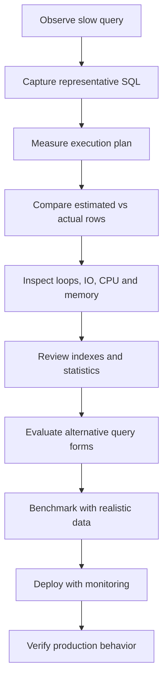

# README

## Overview

Subqueries are queries embedded inside another SQL statement. They allow a query to use the result of another query for filtering, existence checks, scalar calculations, derived relations, and more complex relational composition.

This section focuses on using subqueries deliberately rather than treating them as merely a syntax feature. The key engineering concern is choosing the correct relational expression while understanding **NULL semantics, correlation, cardinality, optimizer behavior, execution plans, and production performance**.

The material progresses from common subquery operators to execution behavior, performance analysis, and practical decision-making.

## Navigation

- [01- Subqueries Introduction](./01-%20Subqueries%20Introduction.md) — What subqueries are and when to use them
- [02- Subquery Execution Model](./02-%20Subquery%20Execution%20Model.md) — How subqueries are evaluated by the database
- [03- Scalar Subqueries](./03-%20Scalar%20Subqueries.md) — Subqueries that return a single value
- [04- Single-Row Subqueries](./04-%20Single-Row%20Subqueries.md) — Subqueries that return one row
- [05- Multi-Row Subqueries](./05-%20Multi-Row%20Subqueries.md) — Subqueries that return multiple rows
- [06- Subqueries in SELECT](./06-%20Subqueries%20in%20SELECT.md) — Inline scalar calculations in the projection
- [07- Subqueries in FROM](./07-%20Subqueries%20in%20FROM.md) — Derived tables and inline relations
- [08- Subqueries in WHERE](./08-%20Subqueries%20in%20WHERE.md) — Filtering rows using subquery results
- [09- Subqueries in HAVING](./09-%20Subqueries%20in%20HAVING.md) — Filtering groups using subquery results
- [10- IN with Subqueries](./10-%20IN%20with%20Subqueries.md) — Membership testing against a subquery result
- [11- NOT IN with Subqueries](./11-%20NOT%20IN%20with%20Subqueries.md) — Negative membership and NULL semantics
- [12- EXISTS](./12-%20EXISTS.md) — Efficient existence predicates and semi-join semantics
- [13- NOT EXISTS](./13-%20NOT%20EXISTS.md) — Anti-existence checks and anti-join semantics
- [14- EXISTS vs IN](./14-%20EXISTS%20vs%20IN.md) — Semantic and performance trade-offs
- [15- Correlated Subqueries](./15-%20Correlated%20Subqueries.md) — Outer-query references and dependent execution
- [16- Non-Correlated Subqueries](./16-%20Non-Correlated%20Subqueries.md) — Independent subquery evaluation
- [17- Correlated vs Non-Correlated Subqueries](./17-%20Correlated%20vs%20Non-Correlated%20Subqueries.md) — Execution and design differences
- [18- Subquery Execution Rules](./18-%20Subquery%20Execution%20Rules.md) — Logical SQL versus physical execution
- [19- Subquery vs JOIN](./19-%20Subquery%20vs%20JOIN.md) — Cardinality, semantics, and execution strategies
- [20- Subquery vs CTE](./20-%20Subquery%20vs%20CTE.md) — Readability, reuse, optimization, and materialization
- [21- Subquery vs Window Function](./21-%20Subquery%20vs%20Window%20Function.md) — Group-level calculations and row-preserving analytics
- [22- When to Choose a Subquery](./22-%20When%20to%20Choose%20a%20Subquery.md) — Practical decision criteria
- [23- When Not to Use a Subquery](./23-%20When%20Not%20to%20Use%20a%20Subquery.md) — Cases where joins, CTEs, or window functions are clearer
- [24- Common Subquery Patterns](./24-%20Common%20Subquery%20Patterns.md) — Reusable production query patterns
- [25- Common Subquery Mistakes](./25-%20Common%20Subquery%20Mistakes.md) — Correctness, maintainability, and performance pitfalls
- [26- Subquery Performance](./26-%20Subquery%20Performance.md) — Execution plans, indexes, cardinality, and optimization

## Core Concepts

### Membership Testing

Use `IN` when the requirement is naturally expressed as membership in a set:

```sql
SELECT
    c.id,
    c.email
FROM customers AS c
WHERE c.id IN (
    SELECT o.customer_id
    FROM orders AS o
    WHERE o.status = 'completed'
);
```

Use `NOT IN` carefully because `NULL` values can change three-valued SQL logic. When the requirement is fundamentally "no related row exists," `NOT EXISTS` is often a clearer and safer expression.

### Existence Testing

Use `EXISTS` when the outer query only needs to know whether a matching row exists:

```sql
SELECT
    c.id,
    c.email
FROM customers AS c
WHERE EXISTS (
    SELECT 1
    FROM orders AS o
    WHERE o.customer_id = c.id
      AND o.status = 'completed'
);
```

The result of the subquery is not being consumed as a collection of values. Only the existence of at least one qualifying row matters.

For negative existence:

```sql
SELECT
    c.id,
    c.email
FROM customers AS c
WHERE NOT EXISTS (
    SELECT 1
    FROM orders AS o
    WHERE o.customer_id = c.id
);
```

This naturally expresses an anti-existence requirement.

### Correlated Subqueries

A correlated subquery references a column from the outer query:

```sql
SELECT
    o.id,
    o.customer_id,
    o.amount
FROM orders AS o
WHERE o.amount > (
    SELECT AVG(o2.amount)
    FROM orders AS o2
    WHERE o2.customer_id = o.customer_id
);
```

Correlation creates a logical dependency between the outer and inner query. It can be useful for row-specific conditions, but it deserves execution-plan analysis when the outer relation is large or the inner operation is expensive.

### Non-Correlated Subqueries

A non-correlated subquery does not reference the outer query:

```sql
SELECT
    id,
    email
FROM customers
WHERE lifetime_value > (
    SELECT AVG(lifetime_value)
    FROM customers
);
```

The subquery is independent of individual outer rows, allowing the optimizer to consider execution strategies that avoid repeatedly performing identical work.

## Choosing Between Query Forms

Subqueries should be selected based primarily on **semantics**, not assumptions about syntax-level performance.

| Requirement | Common SQL expression |
|---|---|
| Check whether a value belongs to a set | `IN` |
| Check whether at least one related row exists | `EXISTS` |
| Check whether no related row exists | `NOT EXISTS` |
| Compare against a single calculated value | Scalar subquery |
| Produce an intermediate relation | Derived table |
| Reuse a named query expression | CTE |
| Calculate across related rows while retaining row detail | Window function |
| Return columns from matching rows | `JOIN` |

Equivalent logical queries may produce very different physical plans, while syntactically different queries may be optimized into similar execution strategies.

The database optimizer, rather than the SQL formatting alone, determines the actual execution behavior.

## Query Planning and Performance

A production engineer should not reason about subquery performance using rules such as:

- "Subqueries are always slow."
- "Joins are always faster."
- "Correlated queries always execute once per row."
- "`EXISTS` is always faster than `IN`."
- "A CTE always materializes."
- "Sequential scans are always bad."

These are unreliable generalizations.

Instead, inspect the execution plan.

For PostgreSQL:

```sql
EXPLAIN (
    ANALYZE,
    BUFFERS
)
SELECT
    c.id
FROM customers AS c
WHERE EXISTS (
    SELECT 1
    FROM orders AS o
    WHERE o.customer_id = c.id
      AND o.status = 'completed'
);
```

Important plan signals include:

- Actual versus estimated row counts.
- Number of loops.
- Index scans versus sequential scans.
- Join strategy.
- Buffer reads.
- Sort and hash operations.
- Temporary disk usage.
- Actual execution time.

A nested loop, for example, is not inherently inefficient. It can be the best strategy when the outer relation is small and the inner relation has a selective index.

## Indexing Subqueries

Indexes should support the predicates that drive the actual access path.

For:

```sql
WHERE o.customer_id = c.id
  AND o.status = 'completed'
```

a composite index may be appropriate:

```sql
CREATE INDEX idx_orders_customer_status
ON orders (customer_id, status);
```

For a workload that repeatedly queries only completed orders, PostgreSQL can also use a partial index:

```sql
CREATE INDEX idx_orders_completed_customer
ON orders (customer_id)
WHERE status = 'completed';
```

Index design should account for:

- Query predicates.
- Join conditions.
- Selectivity.
- Sort requirements.
- Write frequency.
- Index storage.
- Cache pressure.
- Data distribution.

Adding indexes indiscriminately can make write-heavy systems slower and increase storage and maintenance costs.

## Subqueries in Backend Applications

Subqueries are especially useful when application logic would otherwise require multiple database round trips.

Avoid:

```python
customer_ids = list(
    Order.objects
    .filter(status="completed")
    .values_list("customer_id", flat=True)
)

customers = Customer.objects.filter(id__in=customer_ids)
```

This transfers intermediate data through the application.

Prefer database-side composition when the operation can remain relational:

```python
from django.db.models import Exists, OuterRef

completed_orders = Order.objects.filter(
    customer_id=OuterRef("pk"),
    status="completed",
)

customers = (
    Customer.objects
    .annotate(has_completed_order=Exists(completed_orders))
    .filter(has_completed_order=True)
)
```

This allows PostgreSQL to optimize the complete operation as a database query rather than requiring Python to coordinate intermediate results.

The same principle applies to FastAPI, Celery workers, background jobs, and other backend services using SQL databases.

## Common Production Concerns

### N+1 Queries

Do not execute a subquery separately for every application object:

```python
for customer in customers:
    if Order.objects.filter(
        customer_id=customer.id,
        status="completed",
    ).exists():
        process(customer)
```

This can create one query for the customer collection plus one query per customer.

Prefer a set-based query using `Exists`, a join, or another appropriate SQL expression.

### NULL Semantics

Be particularly careful with:

```sql
NOT IN (subquery)
```

If the subquery can produce `NULL`, SQL's three-valued logic can produce results that differ from intuitive "not a member" semantics.

When expressing "there is no related row," prefer:

```sql
NOT EXISTS (
    SELECT 1
    FROM ...
    WHERE ...
)
```

when its semantics match the requirement.

### Duplicate Rows

Replacing `EXISTS` with a `JOIN` can change result cardinality.

For example:

```sql
SELECT c.id
FROM customers AS c
JOIN orders AS o
    ON o.customer_id = c.id;
```

can return the same customer multiple times.

An existence query:

```sql
SELECT c.id
FROM customers AS c
WHERE EXISTS (
    SELECT 1
    FROM orders AS o
    WHERE o.customer_id = c.id
);
```

returns each qualifying customer once.

Adding `DISTINCT` to compensate for an inappropriate join can introduce unnecessary sorting or hashing.

### Large Intermediate Results

A subquery that produces a large intermediate result can consume substantial:

- Memory.
- CPU.
- Temporary storage.
- Buffer cache.
- Network bandwidth if results leave the database.

Review the execution plan rather than assuming the database will always materialize or eliminate the intermediate result.

## Performance Investigation Workflow

When a subquery becomes a production performance problem:



A disciplined workflow is preferable to rewriting the query based on intuition.

Evaluate:

1. Query correctness.
2. Result cardinality.
3. Execution plan.
4. Index access paths.
5. Statistics and cardinality estimates.
6. Database resource consumption.
7. Concurrent workload.
8. Alternative query formulations.
9. Production-scale benchmarks.
10. Post-deployment metrics.

## Common Decision Rules

Use a subquery when it makes the relational intent clearer and the database can execute it efficiently.

Strong use cases include:

- Existence checks with `EXISTS`.
- Anti-existence checks with `NOT EXISTS`.
- Membership conditions with `IN`.
- Scalar comparisons against calculated values.
- Derived relations that simplify complex query composition.
- Correlated conditions that naturally depend on the outer row.

Consider another construct when:

- A `JOIN` naturally represents the required row relationship.
- A window function can express a row-preserving analytical calculation more directly.
- A CTE substantially improves readability or allows meaningful reuse.
- A correlated subquery performs expensive repeated work that can be pre-aggregated.
- The query's execution plan demonstrates a measurable performance problem.

## Engineering Principles

### Prefer Semantics Over Syntax

Choose the SQL construct that most directly describes the business requirement.

For:

> "Return customers who have at least one completed order."

prefer:

```sql
WHERE EXISTS (...)
```

rather than introducing a join merely because joins are perceived as faster.

### Keep Work in the Database

Avoid retrieving large intermediate datasets into Python, especially when PostgreSQL can perform the operation as a set-based query.

### Validate With Execution Plans

Use:

```sql
EXPLAIN (ANALYZE, BUFFERS)
```

for PostgreSQL performance investigations and inspect actual execution behavior.

### Design Indexes Around Access Patterns

Indexes should support real predicates, joins, ordering, and workload characteristics rather than being added simply because a query contains a subquery.

### Optimize for Production Workloads

A query that performs well against 10,000 rows may fail against 100 million rows.

Performance validation should consider:

- Realistic cardinality.
- Data distribution.
- Concurrent requests.
- Database resource limits.
- API latency requirements.
- Read/write workload.
- Replication behavior where applicable.


## Key Takeaways

- **Choose subqueries based on relational semantics; do not assume joins, `EXISTS`, or `IN` are universally faster.**
- **Understand correlation and `NULL` behavior, especially for `NOT IN` and `NOT EXISTS`.**
- **Keep set-based work inside the database and avoid application-level N+1 query patterns.**
- **Use execution plans, indexes, cardinality estimates, and realistic workload benchmarks to validate performance decisions.**
- **Treat subquery composition as an optimization and correctness problem, not merely a SQL syntax choice.**