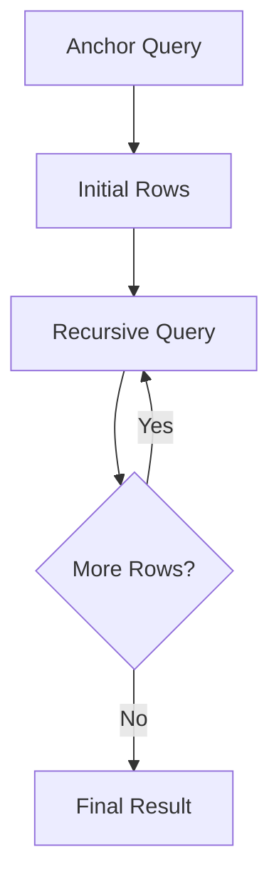

# 02- CTE Syntax and Structure

## Overview

A Common Table Expression (CTE) is a named query expression introduced with `WITH` and scoped to a single SQL statement. Its primary purpose is to give intermediate relational results a meaningful name and make multi-stage SQL easier to compose.

The basic form is:

```sql
WITH cte_name AS (
    SELECT ...
)
SELECT ...
FROM cte_name;
```

CTEs can be used with `SELECT`, `INSERT`, `UPDATE`, `DELETE`, and, depending on the database, other statement forms. They can also be chained, referenced multiple times, and declared recursively.

The syntax is simple, but production use requires understanding **scope, column naming, dependency order, recursion, materialization, and optimizer behavior**.

## Basic CTE Structure

A CTE consists of three conceptual parts:

1. The `WITH` clause.
2. A CTE name and optional column list.
3. A query expression enclosed in parentheses.

```sql
WITH active_customers AS (
    SELECT
        id,
        email
    FROM customers
    WHERE is_active = TRUE
)
SELECT
    id,
    email
FROM active_customers;
```

The database first parses the complete statement, resolves the CTE definitions and references, and then determines an executable query plan.

A CTE should be thought of as a **named relational expression**, not as an automatically created physical table.

## CTE Naming

CTE names should communicate the meaning and row grain of the intermediate result.

```sql
WITH completed_orders AS (
    SELECT
        id,
        customer_id,
        total_amount
    FROM orders
    WHERE status = 'completed'
)
SELECT *
FROM completed_orders;
```

Avoid meaningless names:

```sql
WITH tmp AS (...),
data AS (...),
step1 AS (...)
SELECT ...;
```

Good names reduce the cognitive cost of understanding a complex query and make code review significantly easier.

## Column Naming

The columns exposed by a CTE come from its underlying query.

```sql
WITH customer_totals AS (
    SELECT
        customer_id,
        SUM(total_amount) AS total_spend
    FROM orders
    GROUP BY customer_id
)
SELECT
    customer_id,
    total_spend
FROM customer_totals;
```

A CTE can also explicitly define its output column names:

```sql
WITH customer_totals (customer_id, total_spend) AS (
    SELECT
        customer_id,
        SUM(total_amount)
    FROM orders
    GROUP BY customer_id
)
SELECT
    customer_id,
    total_spend
FROM customer_totals;
```

Explicit column lists are particularly useful for recursive CTEs or when the underlying expressions have unclear or generated names.

For normal non-recursive queries, explicit aliases inside the `SELECT` are usually easier to read.

## Multiple CTEs

Multiple CTEs are separated by commas within the same `WITH` clause.

```sql
WITH recent_orders AS (
    SELECT
        id,
        customer_id,
        total_amount
    FROM orders
    WHERE created_at >= CURRENT_DATE - INTERVAL '30 days'
),
customer_totals AS (
    SELECT
        customer_id,
        COUNT(*) AS order_count,
        SUM(total_amount) AS total_spend
    FROM recent_orders
    GROUP BY customer_id
)
SELECT
    customer_id,
    order_count,
    total_spend
FROM customer_totals
WHERE total_spend >= 1000;
```

A later CTE can reference an earlier CTE.


This allows complex SQL to be organized as a dependency graph rather than a deeply nested expression.

## CTE Dependency Order

For ordinary non-recursive CTEs, references normally follow the declaration order.

```sql
WITH recent_orders AS (
    SELECT *
    FROM orders
),
customer_totals AS (
    SELECT
        customer_id,
        SUM(total_amount) AS total_spend
    FROM recent_orders
    GROUP BY customer_id
)
SELECT *
FROM customer_totals;
```

The dependency is:

```text
orders
  ↓
recent_orders
  ↓
customer_totals
  ↓
final query
```

Do not structure CTEs as an arbitrary list. Arrange them so their dependencies are obvious.

## Referencing Base Tables and CTEs

A CTE can combine data from base tables and previously defined CTEs.

```sql
WITH recent_orders AS (
    SELECT
        id,
        customer_id,
        total_amount
    FROM orders
    WHERE created_at >= CURRENT_DATE - INTERVAL '30 days'
),
customer_totals AS (
    SELECT
        r.customer_id,
        SUM(r.total_amount) AS total_spend
    FROM recent_orders AS r
    GROUP BY r.customer_id
)
SELECT
    c.id,
    c.email,
    ct.total_spend
FROM customers AS c
JOIN customer_totals AS ct
    ON ct.customer_id = c.id;
```

This pattern is common in reporting queries and backend APIs where the database must perform several transformations before returning the final result.

## CTE Scope

A CTE is scoped to the statement that defines it.

```sql
WITH active_users AS (
    SELECT id
    FROM users
    WHERE is_active = TRUE
)
SELECT id
FROM active_users;
```

The CTE is not available to a subsequent statement:

```sql
SELECT id
FROM active_users;
```

The second statement fails because `active_users` is not a persistent database object.

This differs from a view or a temporary table:

| Object | Typical scope |
|---|---|
| CTE | One SQL statement |
| Temporary table | Session/transaction depending on database |
| View | Persistent database object |
| Permanent table | Persistent database object |

## CTEs with SELECT

The most common use is composing a `SELECT`.

```sql
WITH eligible_products AS (
    SELECT
        id,
        name,
        price
    FROM products
    WHERE is_active = TRUE
      AND stock_quantity > 0
)
SELECT
    id,
    name,
    price
FROM eligible_products
WHERE price <= 500
ORDER BY price;
```

The CTE can contain joins, aggregations, window functions, filtering, and other relational operations supported by the database.

## CTEs with INSERT

A CTE can provide rows to an `INSERT`.

```sql
WITH eligible_orders AS (
    SELECT
        id,
        customer_id,
        total_amount
    FROM orders
    WHERE status = 'completed'
      AND created_at >= CURRENT_DATE - INTERVAL '1 day'
)
INSERT INTO daily_order_summary (
    order_id,
    customer_id,
    total_amount
)
SELECT
    id,
    customer_id,
    total_amount
FROM eligible_orders;
```

This keeps the transformation and write operation inside one SQL statement.

In production, consider transaction boundaries, uniqueness constraints, retry behavior, and whether repeated execution could create duplicate data.

## CTEs with UPDATE

A CTE can identify the rows to update.

```sql
WITH stale_orders AS (
    SELECT id
    FROM orders
    WHERE status = 'pending'
      AND created_at < CURRENT_TIMESTAMP - INTERVAL '24 hours'
)
UPDATE orders AS o
SET status = 'expired'
FROM stale_orders AS s
WHERE o.id = s.id;
```

This is useful when the set of rows requiring modification requires non-trivial query logic.

For high-volume updates, still evaluate:

- Lock duration.
- Number of affected rows.
- Index usage.
- Transaction size.
- Replication impact.
- Application concurrency.

A CTE does not eliminate the operational cost of the underlying update.

## CTEs with DELETE

A CTE can identify records that should be deleted.

```sql
WITH duplicate_events AS (
    SELECT
        id,
        ROW_NUMBER() OVER (
            PARTITION BY event_key
            ORDER BY created_at DESC
        ) AS row_number
    FROM events
)
DELETE FROM events AS e
USING duplicate_events AS d
WHERE e.id = d.id
  AND d.row_number > 1;
```

This pattern should be used carefully. Before executing destructive operations, validate the CTE independently:

```sql
WITH duplicate_events AS (
    ...
)
SELECT *
FROM duplicate_events
WHERE row_number > 1;
```

Then run the corresponding `DELETE` inside an appropriate transaction.

## `WITH` Before DML

The general structure is:

```sql
WITH cte_name AS (
    SELECT ...
)
INSERT INTO ...
SELECT ...;
```

or:

```sql
WITH cte_name AS (
    SELECT ...
)
UPDATE ...;
```

or:

```sql
WITH cte_name AS (
    SELECT ...
)
DELETE FROM ...;
```

The CTE is part of the same SQL statement rather than a separate command.

## `WITH RECURSIVE`

Recursive CTEs use `WITH RECURSIVE` in databases that support this syntax.

A recursive CTE typically contains:

- An **anchor query** that produces the initial rows.
- A recursive query that references the CTE itself.
- A termination condition determined by the recursive relationship.

Example:

```sql
WITH RECURSIVE employee_tree AS (
    SELECT
        id,
        manager_id,
        name,
        0 AS depth
    FROM employees
    WHERE id = 100

    UNION ALL

    SELECT
        e.id,
        e.manager_id,
        e.name,
        et.depth + 1
    FROM employees AS e
    JOIN employee_tree AS et
        ON e.manager_id = et.id
)
SELECT
    id,
    manager_id,
    name,
    depth
FROM employee_tree
ORDER BY depth, id;
```

The anchor establishes the starting employee. Each recursive iteration finds employees whose `manager_id` matches an employee already discovered.

## Recursive CTE Structure

Conceptually:



A recursive CTE must have a meaningful termination condition. Without one, the query can continue generating rows until the database detects a recursion limit, resource exhaustion, or another failure condition.

Hierarchical data is a common use case:

- Organization charts.
- Category trees.
- Folder structures.
- Graph-like relationships.
- Dependency chains.

## Recursive CTE and Cycles

Recursive queries require special care when the underlying graph can contain cycles.

For example:

```text
A → B → C → A
```

A naïve recursive traversal can repeatedly revisit the same nodes.

Production recursive queries should consider:

- Cycle detection.
- Maximum traversal depth.
- Duplicate elimination.
- Result-size limits.
- Appropriate indexes on relationship columns.

For graph-shaped data with very large traversal requirements, a relational recursive CTE may not always be the right architecture.

## CTE Materialization

The SQL syntax does not imply that the database physically stores the CTE result.

The optimizer may be able to inline or otherwise transform the CTE depending on the database engine and query.

PostgreSQL supports explicit materialization controls:

```sql
WITH expensive_result AS MATERIALIZED (
    SELECT
        customer_id,
        SUM(total_amount) AS total_spend
    FROM orders
    GROUP BY customer_id
)
SELECT *
FROM expensive_result;
```

It also supports:

```sql
WITH expensive_result AS NOT MATERIALIZED (
    SELECT
        customer_id,
        SUM(total_amount) AS total_spend
    FROM orders
    GROUP BY customer_id
)
SELECT *
FROM expensive_result;
```

These controls should not be added by default. Use execution-plan analysis to determine whether explicit control improves the workload.

## Column Reference and Alias Discipline

Aliases should be used consistently when multiple relations expose similarly named columns.

Prefer:

```sql
WITH customer_totals AS (
    SELECT
        o.customer_id,
        SUM(o.total_amount) AS total_spend
    FROM orders AS o
    GROUP BY o.customer_id
)
SELECT
    c.id,
    c.email,
    ct.total_spend
FROM customers AS c
JOIN customer_totals AS ct
    ON ct.customer_id = c.id;
```

This makes column ownership explicit and prevents ambiguity as the query grows.

Avoid:

```sql
SELECT id
FROM customers
JOIN customer_totals
    ON id = customer_id;
```

Explicit qualification is particularly important in long CTE chains where several relations may contain columns such as `id`, `status`, `created_at`, or `customer_id`.

## CTEs and Window Functions

CTEs and window functions often work well together because the CTE can establish the dataset on which the window calculation operates.

```sql
WITH ranked_products AS (
    SELECT
        category_id,
        id,
        name,
        price,
        ROW_NUMBER() OVER (
            PARTITION BY category_id
            ORDER BY price DESC
        ) AS position
    FROM products
    WHERE is_active = TRUE
)
SELECT
    category_id,
    id,
    name,
    price
FROM ranked_products
WHERE position <= 3;
```

The CTE gives the window-function result a reusable relational boundary.

Do not assume the CTE itself provides the ranking behavior. The window function performs that operation.

## CTEs and Query Parameters

When CTEs are used from backend application code, values supplied by users or external systems must remain parameterized.

```python
from django.db import connection

query = """
WITH customer_totals AS (
    SELECT
        customer_id,
        SUM(total_amount) AS total_spend
    FROM orders
    WHERE created_at >= %s
    GROUP BY customer_id
)
SELECT
    customer_id,
    total_spend
FROM customer_totals
WHERE total_spend >= %s
ORDER BY total_spend DESC
"""

with connection.cursor() as cursor:
    cursor.execute(query, [start_date, minimum_spend])
    rows = cursor.fetchall()
```

Do not construct SQL by concatenating request parameters:

```python
# Unsafe
query = f"""
WITH customer_totals AS (
    SELECT ...
    WHERE created_at >= '{start_date}'
)
SELECT ...
"""
```

The use of a CTE does not provide any protection against SQL injection.

## Common Syntax Mistakes

### Missing Parentheses

Incorrect:

```sql
WITH active_users AS
    SELECT id
    FROM users
    WHERE is_active = TRUE
SELECT *
FROM active_users;
```

Correct:

```sql
WITH active_users AS (
    SELECT id
    FROM users
    WHERE is_active = TRUE
)
SELECT *
FROM active_users;
```

### Missing Comma Between CTEs

Incorrect:

```sql
WITH recent_orders AS (
    SELECT *
    FROM orders
)
customer_totals AS (
    SELECT customer_id, SUM(total_amount)
    FROM recent_orders
    GROUP BY customer_id
)
SELECT *
FROM customer_totals;
```

Correct:

```sql
WITH recent_orders AS (
    SELECT *
    FROM orders
),
customer_totals AS (
    SELECT
        customer_id,
        SUM(total_amount) AS total_spend
    FROM recent_orders
    GROUP BY customer_id
)
SELECT *
FROM customer_totals;
```

### Incorrect Dependency Order

Keep non-recursive dependencies clear:

```sql
WITH recent_orders AS (...),
customer_totals AS (
    SELECT ...
    FROM recent_orders
)
SELECT ...
FROM customer_totals;
```

Do not make the query difficult to reason about by scattering dependent definitions or creating unnecessary cross-dependencies.

### Assuming CTEs Persist

This is incorrect:

```sql
WITH active_users AS (...)
SELECT * FROM active_users;

SELECT * FROM active_users;
```

The second statement cannot access the CTE.

### Overusing CTEs

Not every intermediate expression needs a CTE.

Instead of:

```sql
WITH active_users AS (
    SELECT id
    FROM users
    WHERE is_active = TRUE
)
SELECT id
FROM active_users;
```

prefer the direct query:

```sql
SELECT id
FROM users
WHERE is_active = TRUE;
```

Use a CTE when the named boundary adds meaningful structure or functionality.

## Production Considerations

Before deploying a CTE-heavy query:

- Verify every CTE's row grain.
- Validate joins and cardinality.
- Use explicit column aliases for derived expressions.
- Check `NULL` semantics.
- Check duplicate behavior.
- Parameterize application input.
- Inspect the execution plan for expensive queries.
- Test with production-scale data volumes.
- Consider lock duration for `UPDATE` and `DELETE`.
- Validate recursive traversal depth and cycle behavior.
- Avoid unnecessary CTE layers.
- Measure query latency under realistic concurrency.

For PostgreSQL, a useful diagnostic query is:

```sql
EXPLAIN (
    ANALYZE,
    BUFFERS
)
WITH recent_orders AS (
    SELECT
        customer_id,
        total_amount
    FROM orders
    WHERE created_at >= CURRENT_DATE - INTERVAL '30 days'
)
SELECT
    customer_id,
    SUM(total_amount) AS total_spend
FROM recent_orders
GROUP BY customer_id;
```

Look beyond total execution time. Review:

- Actual versus estimated rows.
- Sequential versus index scans.
- Join strategy.
- Sort operations.
- Hash operations.
- Buffer reads.
- Temporary I/O.
- Memory pressure.

## Practical Design Guidelines

A production-quality CTE generally follows these principles:

| Guideline | Recommendation |
|---|---|
| Naming | Use descriptive relation-oriented names |
| Grain | Know what one row represents |
| Dependencies | Define CTEs in clear dependency order |
| Columns | Expose only columns required downstream |
| Aliases | Explicitly alias calculated values |
| Complexity | Give each CTE a meaningful responsibility |
| Performance | Validate with execution plans |
| Security | Parameterize external values |
| Recursion | Guard against cycles and excessive depth |
| Maintainability | Prefer clarity over clever SQL |

A useful mental model is to treat each CTE as a small relational module. It should have a clear input, transformation, and output contract.

## Key Takeaways

- **A CTE is a statement-scoped named relational expression defined with `WITH`; it is not inherently a temporary or persistent table.**
- **Multiple CTEs form a dependency chain, so descriptive names, explicit aliases, and clear row grain are essential for maintainable SQL.**
- **CTEs can compose `SELECT`, `INSERT`, `UPDATE`, and `DELETE` operations, while `WITH RECURSIVE` supports hierarchical and graph-like traversal.**
- **CTE syntax does not determine physical execution; materialization, inlining, indexes, cardinality, and optimizer decisions must be evaluated through execution plans.**
- **In backend applications, parameterize all external values and treat CTE complexity, recursive depth, locking, and query performance as production concerns.**