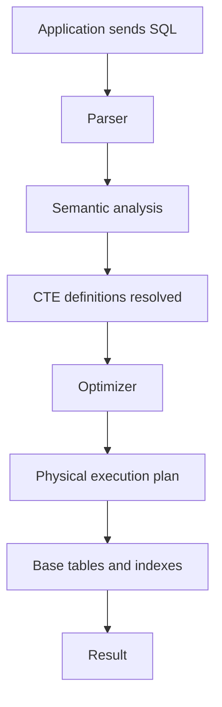
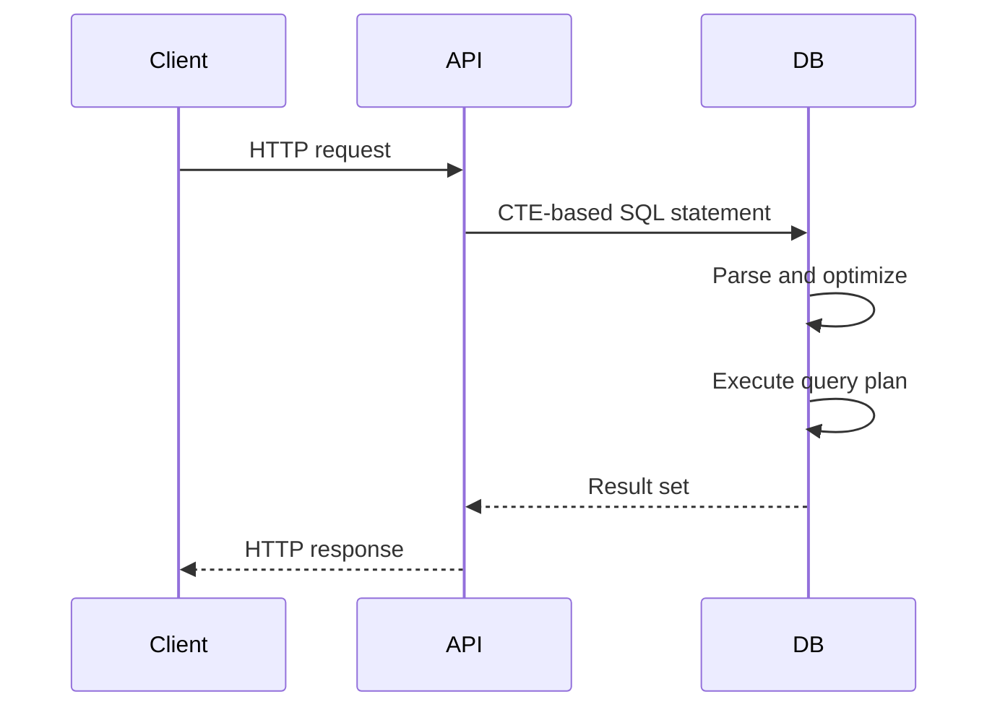

# 03- How CTEs Work

## Overview

A Common Table Expression (CTE) is a named query expression defined with `WITH` and scoped to a single SQL statement. The key engineering value of a CTE is not that it creates a temporary table, but that it gives the query a named intermediate relation that can be composed with other relational operations.

Consider:

```sql
WITH recent_orders AS (
    SELECT
        customer_id,
        total_amount
    FROM orders
    WHERE created_at >= CURRENT_DATE - INTERVAL '30 days'
)
SELECT
    customer_id,
    SUM(total_amount) AS total_spend
FROM recent_orders
GROUP BY customer_id;
```

Conceptually, the query has two stages:

```text
orders
  │
  ▼
recent_orders
  │
  ▼
aggregation
  │
  ▼
final result
```

However, this logical staging should not be confused with physical execution. The database optimizer is free to transform the query according to the database engine's optimization rules. A CTE is primarily a **query-composition mechanism**, not a guaranteed execution boundary.

## Why CTEs Exist

Without CTEs, complex SQL often becomes deeply nested:

```sql
SELECT
    customer_id,
    SUM(total_amount) AS total_spend
FROM (
    SELECT
        customer_id,
        total_amount
    FROM orders
    WHERE created_at >= CURRENT_DATE - INTERVAL '30 days'
) AS recent_orders
GROUP BY customer_id;
```

The equivalent CTE is easier to decompose:

```sql
WITH recent_orders AS (
    SELECT
        customer_id,
        total_amount
    FROM orders
    WHERE created_at >= CURRENT_DATE - INTERVAL '30 days'
)
SELECT
    customer_id,
    SUM(total_amount) AS total_spend
FROM recent_orders
GROUP BY customer_id;
```

CTEs are particularly valuable when a query contains multiple transformations, repeated intermediate results, recursive relationships, or data-modification workflows.

## Logical Model of a CTE

A useful mental model is:

```text
WITH
    named relational expression
        ↓
    downstream query
```

For example:

```sql
WITH active_customers AS (
    SELECT
        id,
        email
    FROM customers
    WHERE is_active = TRUE
)
SELECT
    id,
    email
FROM active_customers;
```

The CTE exposes a relation with:

```text
active_customers
├── id
└── email
```

The outer query operates against that relation as if it were a named query result.

This is a **logical abstraction**. It does not mean the database necessarily executes the inner query first and stores its complete result.

## Logical Query Processing vs Physical Execution

One of the most important senior-level distinctions is between:

- **Logical query composition** — what the SQL expression means.
- **Physical execution** — how the database actually produces the result.

A CTE may look like:

```text
CTE → materialize → outer query
```

but the optimizer may instead transform it into something closer to:

```text
outer query
    ↓
optimized execution plan
    ↓
base tables
```

The exact behavior depends on the database engine, version, query structure, and optimizer decisions.

Therefore:

> Never infer performance characteristics from SQL nesting alone. Inspect the execution plan.

## CTE Lifecycle

A typical non-recursive CTE can be understood through several stages.



The database generally:

1. Parses the SQL statement.
2. Validates syntax and references.
3. Resolves tables, columns, aliases, and CTE dependencies.
4. Builds a relational representation of the query.
5. Optimizes the complete statement.
6. Selects a physical execution strategy.
7. Executes the plan.
8. Returns the final result to the application.

The CTE is therefore part of the overall statement rather than an independent request to the database.

## CTE Scope

A CTE exists only for the statement in which it is defined.

```sql
WITH active_users AS (
    SELECT id
    FROM users
    WHERE is_active = TRUE
)
SELECT id
FROM active_users;
```

This works.

A subsequent statement cannot reference the CTE:

```sql
SELECT id
FROM active_users;
```

That fails because `active_users` is not a persistent database object.

| Object | Lifetime | Typical purpose |
|---|---|---|
| CTE | One SQL statement | Query composition |
| Temporary table | Session/transaction dependent | Intermediate persisted data |
| View | Persistent | Reusable query abstraction |
| Materialized view | Persistent | Precomputed query result |
| Permanent table | Persistent | Stored application data |

Choosing between these mechanisms is an architectural decision, not merely a syntax preference.

## Multiple CTEs

A statement can define multiple CTEs.

```sql
WITH recent_orders AS (
    SELECT
        id,
        customer_id,
        total_amount
    FROM orders
    WHERE created_at >= CURRENT_DATE - INTERVAL '30 days'
),
customer_totals AS (
    SELECT
        customer_id,
        SUM(total_amount) AS total_spend
    FROM recent_orders
    GROUP BY customer_id
)
SELECT
    customer_id,
    total_spend
FROM customer_totals
WHERE total_spend >= 1000;
```

The dependency graph is:


Each CTE should ideally represent a meaningful transformation.

For example:

```text
recent_orders
    ↓
customer_totals
    ↓
qualified_customers
    ↓
final result
```

This structure makes the query easier to review and modify.

## CTEs Are Not Automatically Temporary Tables

A common misconception is:

> "The CTE runs first, stores its rows somewhere, and the outer query reads those rows."

That is not a safe general assumption.

For example:

```sql
WITH expensive_orders AS (
    SELECT *
    FROM orders
    WHERE total_amount > 10000
)
SELECT *
FROM expensive_orders;
```

The database does not necessarily create a physical temporary table called `expensive_orders`.

Depending on the database and plan, the optimizer may inline the CTE or choose another execution strategy.

This distinction matters because developers sometimes introduce CTEs expecting:

- Guaranteed caching.
- Guaranteed materialization.
- Guaranteed performance isolation.
- Guaranteed single execution.

None of these should be assumed from CTE syntax alone.

## CTE Materialization

Some database engines can materialize a CTE, meaning its intermediate result is produced and stored for later consumption during query execution.

PostgreSQL provides explicit controls:

```sql
WITH customer_totals AS MATERIALIZED (
    SELECT
        customer_id,
        SUM(total_amount) AS total_spend
    FROM orders
    GROUP BY customer_id
)
SELECT *
FROM customer_totals;
```

It also supports:

```sql
WITH customer_totals AS NOT MATERIALIZED (
    SELECT
        customer_id,
        SUM(total_amount) AS total_spend
    FROM orders
    GROUP BY customer_id
)
SELECT *
FROM customer_totals;
```

The important point is that materialization is an **execution strategy**, not the defining characteristic of a CTE.

Use explicit materialization only when there is a demonstrated reason. Validate the impact with `EXPLAIN` rather than assuming one strategy is universally faster.

## Optimization and Predicate Pushdown

Consider:

```sql
WITH active_orders AS (
    SELECT
        id,
        customer_id,
        total_amount,
        created_at
    FROM orders
    WHERE status = 'completed'
)
SELECT
    customer_id,
    SUM(total_amount)
FROM active_orders
WHERE created_at >= CURRENT_DATE - INTERVAL '7 days'
GROUP BY customer_id;
```

A database optimizer may be able to combine the predicates into an efficient execution strategy.

Conceptually, the desired operation may resemble:

```sql
SELECT
    customer_id,
    SUM(total_amount)
FROM orders
WHERE status = 'completed'
  AND created_at >= CURRENT_DATE - INTERVAL '7 days'
GROUP BY customer_id;
```

The important engineering lesson is that a CTE does not necessarily prevent the optimizer from reasoning across query boundaries.

Whether such transformations occur depends on the database and query.

## CTE Dependency Graph

Multiple CTEs create a directed dependency graph.

```sql
WITH orders_30d AS (
    SELECT ...
),
customer_totals AS (
    SELECT ...
    FROM orders_30d
),
high_value_customers AS (
    SELECT ...
    FROM customer_totals
    WHERE total_spend >= 10000
)
SELECT ...
FROM high_value_customers;
```

The dependency graph is:

```text
orders
  │
  ▼
orders_30d
  │
  ▼
customer_totals
  │
  ▼
high_value_customers
  │
  ▼
final query
```

Thinking in terms of data dependencies helps identify:

- Unnecessary stages.
- Repeated scans.
- Incorrect join cardinality.
- Dead CTEs.
- Excessive intermediate data.
- Opportunities to simplify the query.

## CTE Row Grain

Every CTE should have a clear row grain.

For example:

```sql
WITH customer_totals AS (
    SELECT
        customer_id,
        SUM(total_amount) AS total_spend
    FROM orders
    GROUP BY customer_id
)
SELECT ...
FROM customer_totals;
```

The row grain is:

> One row per customer.

This matters because later joins depend on that assumption.

A query can accidentally multiply rows:

```sql
WITH customer_totals AS (
    SELECT
        customer_id,
        SUM(total_amount) AS total_spend
    FROM orders
    GROUP BY customer_id
)
SELECT
    ct.customer_id,
    ct.total_spend,
    o.id AS order_id
FROM customer_totals AS ct
JOIN orders AS o
    ON o.customer_id = ct.customer_id;
```

The CTE has one row per customer, but the final result has one row per order.

The aggregation value `total_spend` will therefore appear repeatedly.

This is not necessarily wrong, but the row-grain change must be intentional.

## CTEs and Joins

CTEs frequently act as inputs to joins.

```sql
WITH customer_totals AS (
    SELECT
        customer_id,
        SUM(total_amount) AS total_spend
    FROM orders
    WHERE status = 'completed'
    GROUP BY customer_id
)
SELECT
    c.id,
    c.email,
    ct.total_spend
FROM customers AS c
JOIN customer_totals AS ct
    ON ct.customer_id = c.id;
```

For production queries, verify:

- Join keys are indexed where appropriate.
- The CTE produces the expected cardinality.
- The join does not unexpectedly multiply rows.
- Filters are applied at the correct stage.
- The execution plan matches expectations.

## CTEs and Data Modification

CTEs can participate in data-modification statements.

For example:

```sql
WITH stale_orders AS (
    SELECT id
    FROM orders
    WHERE status = 'pending'
      AND created_at < CURRENT_TIMESTAMP - INTERVAL '24 hours'
)
UPDATE orders AS o
SET status = 'expired'
FROM stale_orders AS s
WHERE o.id = s.id;
```

The CTE identifies the target rows, while the `UPDATE` changes them.

The important point is that this remains one SQL statement.

For production systems, evaluate:

- Transaction isolation.
- Lock acquisition.
- Number of affected rows.
- Concurrent updates.
- Deadlock risk.
- Replication lag.
- Retry behavior.

A CTE does not make a large write operation inexpensive.

## Recursive CTE Execution

Recursive CTEs are structurally different from ordinary CTEs.

```sql
WITH RECURSIVE employee_tree AS (
    SELECT
        id,
        manager_id,
        name,
        0 AS depth
    FROM employees
    WHERE id = 100

    UNION ALL

    SELECT
        e.id,
        e.manager_id,
        e.name,
        et.depth + 1
    FROM employees AS e
    JOIN employee_tree AS et
        ON e.manager_id = et.id
)
SELECT
    id,
    manager_id,
    name,
    depth
FROM employee_tree;
```

A recursive CTE consists conceptually of:

```text
Anchor rows
    ↓
Recursive expansion
    ↓
New rows
    ↓
Recursive expansion
    ↓
...
    ↓
Termination
```

The recursive query repeatedly derives additional rows from rows already produced by the recursive relation.

## Recursive CTE Safety

Recursive queries can become expensive or non-terminating when the underlying relationship contains cycles.

For example:

```text
A → B
B → C
C → A
```

A production recursive query should consider:

- Cycle detection.
- Maximum traversal depth.
- Duplicate handling.
- Appropriate indexes.
- Maximum expected result size.

For large graph traversal workloads, specialized data models or graph-oriented systems may be more appropriate than repeatedly traversing relational data.

## CTEs and Transactions

A CTE does not define a transaction boundary.

For example:

```sql
WITH eligible_orders AS (
    SELECT id
    FROM orders
    WHERE status = 'pending'
)
UPDATE orders
SET status = 'processing'
WHERE id IN (
    SELECT id
    FROM eligible_orders
);
```

The transaction behavior is determined by the database transaction containing the statement.

In Django, for example:

```python
from django.db import transaction

with transaction.atomic():
    # Execute the CTE-based write here.
    ...
```

The important distinction is:

```text
CTE scope      → SQL statement
Transaction    → transaction boundary
```

Do not confuse the two.

## CTEs and Application Requests

In a Django, FastAPI, or other backend service, the normal request flow is:



The CTE is executed inside the database as part of the SQL statement. It does not cause a network request for each CTE.

This is one reason CTEs can be preferable to fetching intermediate data into Python and issuing additional database queries.

Avoid patterns such as:

```text
API
 ↓
Query intermediate rows
 ↓
Python processing
 ↓
Second query
 ↓
Third query
```

when the complete operation can safely and efficiently be expressed as one database statement.

However, do not force complex business logic into SQL simply to avoid application-level processing. The correct boundary depends on data volume, consistency requirements, maintainability, and workload characteristics.

## CTEs and Parameterization

CTEs do not change SQL injection requirements.

Application values must remain parameterized.

```python
from django.db import connection

query = """
WITH recent_orders AS (
    SELECT
        customer_id,
        total_amount
    FROM orders
    WHERE created_at >= %s
)
SELECT
    customer_id,
    SUM(total_amount) AS total_spend
FROM recent_orders
GROUP BY customer_id
"""

with connection.cursor() as cursor:
    cursor.execute(query, [start_date])
    rows = cursor.fetchall()
```

Never interpolate request values directly into SQL:

```python
# Unsafe
query = f"""
WITH recent_orders AS (
    SELECT *
    FROM orders
    WHERE created_at >= '{start_date}'
)
SELECT ...
"""
```

The presence of a CTE provides no additional SQL injection protection.

## Performance Analysis

The correct way to understand how a CTE behaves in production is to inspect the execution plan.

For PostgreSQL:

```sql
EXPLAIN (
    ANALYZE,
    BUFFERS
)
WITH recent_orders AS (
    SELECT
        customer_id,
        total_amount
    FROM orders
    WHERE created_at >= CURRENT_DATE - INTERVAL '30 days'
)
SELECT
    customer_id,
    SUM(total_amount) AS total_spend
FROM recent_orders
GROUP BY customer_id;
```

Pay attention to:

| Plan characteristic | Why it matters |
|---|---|
| Actual rows | Shows real cardinality |
| Estimated rows | Reveals optimizer estimation |
| Scan type | Indicates how base data is accessed |
| Join strategy | Affects CPU and memory usage |
| Sort operations | Can consume significant memory or disk |
| Hash operations | Can become memory-intensive |
| Buffer reads | Indicates I/O pressure |
| Temporary I/O | Can indicate memory pressure |
| Execution time | Measures actual query latency |

Do not optimize the SQL merely because a CTE appears in a query. Optimize based on measured workload behavior.

## CTEs and Indexes

A CTE does not make indexes unnecessary.

For example:

```sql
WITH recent_orders AS (
    SELECT
        customer_id,
        total_amount
    FROM orders
    WHERE created_at >= CURRENT_DATE - INTERVAL '30 days'
)
SELECT
    customer_id,
    SUM(total_amount)
FROM recent_orders
GROUP BY customer_id;
```

The performance of the query still depends heavily on:

- Table size.
- Data distribution.
- Available indexes.
- Predicate selectivity.
- Statistics.
- Aggregation strategy.
- Memory availability.
- Concurrency.

If `orders` contains hundreds of millions of rows, query design and indexing remain critical regardless of whether the filter is written directly or inside a CTE.

## Advantages

CTEs provide several practical advantages.

| Advantage | Engineering value |
|---|---|
| Readability | Breaks complex SQL into named stages |
| Composability | Allows multiple query transformations |
| Reuse | A CTE can be referenced by downstream parts of a statement |
| Recursive queries | Supports hierarchical traversal |
| DML composition | Helps structure complex writes |
| Debuggability | Intermediate relations can often be inspected independently |
| Maintainability | Gives complex relational logic meaningful names |

A well-designed CTE can make a large SQL statement significantly easier to review.

## Limitations

CTEs also have limitations.

| Limitation | Impact |
|---|---|
| Statement scope | Cannot be reused across independent statements |
| Optimizer behavior | CTE syntax does not guarantee a specific execution strategy |
| Complexity | Excessive CTEs can make a query harder to understand |
| Materialization | In some cases, materialization can introduce extra work |
| Recursive cost | Recursive queries can grow rapidly |
| Portability | Materialization controls and recursive behavior vary by database |
| Debugging | Large CTE chains can still hide complex execution behavior |

The goal is not to maximize CTE usage. The goal is to use CTEs where the named relational boundaries improve the query.

## Common Mistakes

### Treating a CTE as a Temporary Table

Incorrect assumption:

```text
CTE → automatically stored → reused cheaply
```

A CTE is not inherently a temporary table or cache.

**Avoid it:** inspect the execution plan and use a temporary table or materialized view when persistent intermediate storage is actually required.

### Assuming Every CTE Executes Once

Referencing a CTE multiple times does not universally mean that its result is computed once and cached.

**Avoid it:** understand the optimizer behavior of the target database and measure the actual plan.

### Ignoring Row Grain

A CTE that produces one row per customer can easily become one row per order after a join.

**Avoid it:** document and verify the grain of every important intermediate relation.

### Adding CTEs for Trivial Queries

This adds abstraction without providing meaningful structure.

Prefer:

```sql
SELECT
    id,
    email
FROM users
WHERE is_active = TRUE;
```

over:

```sql
WITH active_users AS (
    SELECT
        id,
        email
    FROM users
    WHERE is_active = TRUE
)
SELECT
    id,
    email
FROM active_users;
```

### Assuming CTEs Improve Performance

A CTE may improve readability without changing performance, or it may alter the optimizer's available strategies depending on the database.

**Avoid it:** measure with realistic data and `EXPLAIN`.

### Performing Large Writes Without Operational Analysis

A CTE-based `UPDATE` can still lock a large number of rows.

**Avoid it:** analyze affected-row counts, indexes, transaction duration, lock behavior, and replication impact.

### Ignoring Recursive Cycles

Hierarchical data is not always a tree.

**Avoid it:** implement cycle protection and depth limits when recursive traversal operates over data that may contain malformed relationships.

## Production Engineering Guidelines

When designing CTE-heavy SQL:

1. Give every CTE a descriptive name.
2. Know the row grain of each CTE.
3. Select only the columns required downstream.
4. Keep CTE dependencies easy to follow.
5. Avoid unnecessary abstraction.
6. Parameterize application inputs.
7. Validate joins and cardinality.
8. Inspect execution plans for performance-sensitive queries.
9. Test against production-scale data distributions.
10. Treat recursive queries as potentially unbounded workloads.
11. Analyze locks and transaction duration for DML.
12. Use database-specific materialization controls only when measurement justifies them.

For backend services, also consider:

- Query timeout configuration.
- Connection pool capacity.
- API latency budgets.
- Database CPU and memory utilization.
- Read-replica behavior.
- Transaction isolation.
- Retry semantics.
- Observability of slow queries.

A query that takes 50 ms in development can behave very differently against production-scale tables and concurrent traffic.

## Key Takeaways

- **A CTE is a statement-scoped named relational expression; it is a logical query-composition mechanism, not automatically a temporary table or cache.**
- **The database optimizer determines physical execution, so CTE structure alone cannot establish performance, materialization, or single-execution behavior.**
- **Treat each CTE as a relational module with an explicit row grain, meaningful output columns, and clear dependencies.**
- **Recursive CTEs are powerful for hierarchical traversal but require safeguards against cycles, excessive depth, and explosive result growth.**
- **Production CTEs should be evaluated with realistic data, execution plans, transaction behavior, locking, indexing, and application workload characteristics.**