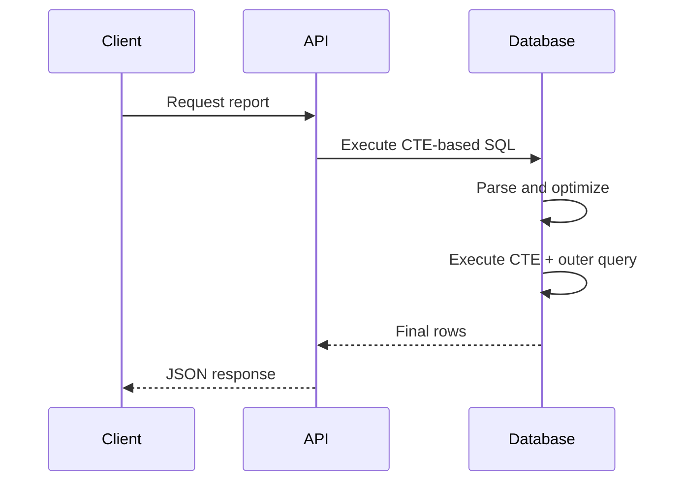

# 04- Single CTE

## Overview

A Common Table Expression (CTE) is a named query expression defined with the `WITH` clause and scoped to a single SQL statement. A **single CTE** is the simplest form: one named intermediate relation is defined and then consumed by the main query.

The basic structure is:

```sql
WITH cte_name AS (
    SELECT ...
)
SELECT ...
FROM cte_name;
```

Single CTEs are useful when an intermediate query has a clear semantic meaning and separating it from the final query improves readability, maintainability, or composition.

A CTE is a **query abstraction**, not automatically a temporary table. Whether the database materializes it or inlines it is an execution-planning decision that depends on the database engine, version, query, and optimizer.

## Basic Structure

A single CTE has three primary components:

```sql
WITH cte_name AS (
    SELECT
        column1,
        column2
    FROM table_name
    WHERE condition
)
SELECT
    column1,
    column2
FROM cte_name;
```

The logical flow is:


For example:

```sql
WITH active_users AS (
    SELECT
        id,
        email,
        created_at
    FROM users
    WHERE is_active = TRUE
)
SELECT
    id,
    email
FROM active_users
ORDER BY created_at DESC;
```

The CTE `active_users` represents the intermediate relation produced by the inner query.

## Why Use a Single CTE

A single CTE is valuable when the intermediate relation represents a meaningful business or technical concept.

For example:

```sql
WITH recent_orders AS (
    SELECT
        id,
        customer_id,
        total_amount
    FROM orders
    WHERE created_at >= CURRENT_DATE - INTERVAL '30 days'
)
SELECT
    customer_id,
    COUNT(*) AS order_count,
    SUM(total_amount) AS total_spend
FROM recent_orders
GROUP BY customer_id;
```

`recent_orders` communicates intent much more clearly than deeply nesting the same query inside the aggregation.

The primary benefits are:

- Naming an intermediate dataset.
- Separating filtering from aggregation.
- Improving readability.
- Making complex SQL easier to reason about.
- Providing a clean foundation for additional query composition.
- Making query transformations easier to review.

A CTE should add meaningful structure. Wrapping a trivial query in a CTE provides little value.

## CTE Syntax

The general syntax is:

```sql
WITH cte_name [(column1, column2, ...)] AS (
    SELECT ...
)
SELECT ...
FROM cte_name;
```

The column list is optional.

### Without an Explicit Column List

```sql
WITH recent_orders AS (
    SELECT
        id,
        customer_id,
        total_amount
    FROM orders
)
SELECT *
FROM recent_orders;
```

The CTE column names are inherited from the inner query.

### With an Explicit Column List

```sql
WITH recent_orders (order_id, customer_id, amount) AS (
    SELECT
        id,
        customer_id,
        total_amount
    FROM orders
)
SELECT
    order_id,
    customer_id,
    amount
FROM recent_orders;
```

Explicit column naming can be useful when the intermediate relation needs a stable semantic interface or when expressions would otherwise produce unclear names.

## CTE Scope

A CTE exists only for the SQL statement in which it is defined.

```sql
WITH active_users AS (
    SELECT id
    FROM users
    WHERE is_active = TRUE
)
SELECT id
FROM active_users;
```

This is valid.

A separate statement cannot use `active_users`:

```sql
SELECT id
FROM active_users;
```

The database does not retain the CTE as a persistent relation after the statement finishes.

| Mechanism | Scope | Persistent object |
|---|---|---|
| CTE | Single SQL statement | No |
| Temporary table | Session/transaction dependent | Temporary |
| View | Database object | Yes |
| Materialized view | Database object | Yes |
| Table | Database object | Yes |

Use a CTE when the intermediate result belongs naturally to one statement. Use a temporary table, view, or materialized view when the result needs a broader lifecycle.

## Single CTE for Filtering

One of the most common uses is isolating a filtered dataset.

```sql
WITH eligible_orders AS (
    SELECT
        id,
        customer_id,
        total_amount
    FROM orders
    WHERE status = 'completed'
      AND total_amount >= 1000
)
SELECT
    id,
    customer_id,
    total_amount
FROM eligible_orders
ORDER BY total_amount DESC;
```

This becomes particularly useful when the outer query performs additional operations:

```sql
WITH eligible_orders AS (
    SELECT
        id,
        customer_id,
        total_amount
    FROM orders
    WHERE status = 'completed'
      AND total_amount >= 1000
)
SELECT
    customer_id,
    COUNT(*) AS order_count,
    SUM(total_amount) AS total_spend,
    MAX(total_amount) AS largest_order
FROM eligible_orders
GROUP BY customer_id
HAVING SUM(total_amount) >= 5000;
```

The CTE establishes the input dataset, while the outer query handles aggregation.

## Single CTE for Aggregation

A CTE can encapsulate an aggregation before joining it to another relation.

```sql
WITH customer_totals AS (
    SELECT
        customer_id,
        SUM(total_amount) AS total_spend
    FROM orders
    WHERE status = 'completed'
    GROUP BY customer_id
)
SELECT
    c.id,
    c.email,
    ct.total_spend
FROM customers AS c
JOIN customer_totals AS ct
    ON ct.customer_id = c.id
ORDER BY ct.total_spend DESC;
```

The important property here is the CTE's **row grain**:

> `customer_totals` contains one row per customer.

That assumption should remain clear when the CTE is consumed.

## Single CTE for Top-N Data

A CTE can isolate ranking or limiting logic.

```sql
WITH top_orders AS (
    SELECT
        id,
        customer_id,
        total_amount
    FROM orders
    WHERE status = 'completed'
    ORDER BY total_amount DESC
    LIMIT 100
)
SELECT
    o.id,
    o.customer_id,
    o.total_amount,
    c.email
FROM top_orders AS o
JOIN customers AS c
    ON c.id = o.customer_id;
```

Be careful with `LIMIT` inside a CTE. It changes the dataset before the outer query operates on it.

For example, these are not equivalent:

```sql
WITH top_orders AS (
    SELECT *
    FROM orders
    ORDER BY total_amount DESC
    LIMIT 100
)
SELECT *
FROM top_orders
WHERE customer_id = 42;
```

and:

```sql
SELECT *
FROM orders
WHERE customer_id = 42
ORDER BY total_amount DESC
LIMIT 100;
```

The first query selects the global top 100 orders and then filters them. The second selects the top 100 orders for customer `42`.

The semantic boundary is important even when the optimizer can transform parts of a query.

## Single CTE for Deduplication

A CTE can make deduplication logic explicit.

```sql
WITH latest_customer_event AS (
    SELECT
        customer_id,
        MAX(created_at) AS latest_event_at
    FROM customer_events
    GROUP BY customer_id
)
SELECT
    c.id,
    c.email,
    e.latest_event_at
FROM customers AS c
LEFT JOIN latest_customer_event AS e
    ON e.customer_id = c.id;
```

The CTE establishes one row per customer, preventing the outer join from directly operating on every event row.

For more complex "latest row" requirements, PostgreSQL can use `ROW_NUMBER()`:

```sql
WITH ranked_events AS (
    SELECT
        id,
        customer_id,
        event_type,
        created_at,
        ROW_NUMBER() OVER (
            PARTITION BY customer_id
            ORDER BY created_at DESC, id DESC
        ) AS row_number
    FROM customer_events
)
SELECT
    id,
    customer_id,
    event_type,
    created_at
FROM ranked_events
WHERE row_number = 1;
```

The CTE separates the ranking operation from the final filtering operation.

## Single CTE for Complex Expressions

CTEs are useful when calculated columns become difficult to reason about.

```sql
WITH order_metrics AS (
    SELECT
        id,
        customer_id,
        total_amount,
        total_amount * 0.18 AS estimated_tax,
        total_amount * 1.18 AS estimated_total
    FROM orders
    WHERE status = 'completed'
)
SELECT
    customer_id,
    SUM(estimated_total) AS gross_value
FROM order_metrics
GROUP BY customer_id;
```

The named CTE makes the calculation stage explicit.

However, avoid creating a CTE solely to rename a simple expression if it does not improve the query's structure.

## CTE and Row Grain

Understanding row grain is critical for production SQL.

Suppose:

```sql
WITH customer_totals AS (
    SELECT
        customer_id,
        SUM(total_amount) AS total_spend
    FROM orders
    GROUP BY customer_id
)
SELECT *
FROM customer_totals;
```

The CTE grain is:

```text
1 row = 1 customer
```

If the result is joined to orders:

```sql
WITH customer_totals AS (
    SELECT
        customer_id,
        SUM(total_amount) AS total_spend
    FROM orders
    GROUP BY customer_id
)
SELECT
    ct.customer_id,
    ct.total_spend,
    o.id AS order_id
FROM customer_totals AS ct
JOIN orders AS o
    ON o.customer_id = ct.customer_id;
```

the output grain becomes:

```text
1 row = 1 order
```

`total_spend` is repeated for every order belonging to the customer.

This is not inherently incorrect, but it becomes a bug if the outer query aggregates `total_spend` again:

```sql
WITH customer_totals AS (
    SELECT
        customer_id,
        SUM(total_amount) AS total_spend
    FROM orders
    GROUP BY customer_id
)
SELECT
    ct.customer_id,
    SUM(ct.total_spend) AS total_spend
FROM customer_totals AS ct
JOIN orders AS o
    ON o.customer_id = ct.customer_id
GROUP BY ct.customer_id;
```

The value can be multiplied by the number of matching orders.

**Production rule:** know the row grain before and after every important join.

## CTE vs Derived Table

A single CTE is often equivalent in semantics to a derived table.

CTE:

```sql
WITH recent_orders AS (
    SELECT
        id,
        customer_id,
        total_amount
    FROM orders
    WHERE created_at >= CURRENT_DATE - INTERVAL '30 days'
)
SELECT
    customer_id,
    SUM(total_amount)
FROM recent_orders
GROUP BY customer_id;
```

Derived table:

```sql
SELECT
    customer_id,
    SUM(total_amount)
FROM (
    SELECT
        id,
        customer_id,
        total_amount
    FROM orders
    WHERE created_at >= CURRENT_DATE - INTERVAL '30 days'
) AS recent_orders
GROUP BY customer_id;
```

The choice is usually about query structure and readability rather than assuming one form is automatically faster.

| Consideration | CTE | Derived table |
|---|---|---|
| Naming | Explicit named relation | Alias |
| Readability | Often better for multi-stage queries | Good for local transformations |
| Reuse in statement | Can be referenced downstream | Usually local to its parent query |
| Recursive query | Supported | Not the normal mechanism |
| Performance | Depends on optimizer | Depends on optimizer |
| Scope | Statement | Parent query expression |

## CTE Execution and Materialization

A common misconception is that:

```sql
WITH expensive_operation AS (
    SELECT ...
)
SELECT ...
FROM expensive_operation;
```

always means:

```text
execute expensive_operation
        ↓
store all rows
        ↓
scan stored rows
```

That is not universally true.

Modern optimizers can often inline CTEs or otherwise transform them into a more efficient execution plan.

PostgreSQL supports explicit materialization controls:

```sql
WITH expensive_operation AS MATERIALIZED (
    SELECT ...
)
SELECT ...
FROM expensive_operation;
```

and:

```sql
WITH expensive_operation AS NOT MATERIALIZED (
    SELECT ...
)
SELECT ...
FROM expensive_operation;
```

These controls are database-specific and should not be treated as portable SQL.

For performance-sensitive queries:

```sql
EXPLAIN (
    ANALYZE,
    BUFFERS
)
WITH recent_orders AS (
    SELECT
        customer_id,
        total_amount
    FROM orders
    WHERE created_at >= CURRENT_DATE - INTERVAL '30 days'
)
SELECT
    customer_id,
    SUM(total_amount)
FROM recent_orders
GROUP BY customer_id;
```

Use the execution plan to determine whether the chosen strategy is appropriate.

## Performance Considerations

A single CTE does not inherently improve or degrade performance.

Performance depends on:

- Base table size.
- Index availability.
- Predicate selectivity.
- Cardinality estimates.
- Join strategy.
- Sort and aggregation costs.
- Memory availability.
- Database version and optimizer.
- Concurrent workload.
- Materialization behavior where applicable.

For example, if the CTE filters a billion-row table:

```sql
WITH recent_orders AS (
    SELECT
        customer_id,
        total_amount
    FROM orders
    WHERE created_at >= CURRENT_DATE - INTERVAL '7 days'
)
SELECT
    customer_id,
    SUM(total_amount)
FROM recent_orders
GROUP BY customer_id;
```

the critical performance question is not simply "Is this a CTE?" but:

> How does the database access `orders`, and how many rows flow through each execution stage?

## Indexing

Indexes belong to the underlying tables, not to the CTE itself.

If the query frequently filters orders by timestamp:

```sql
CREATE INDEX CONCURRENTLY idx_orders_created_at
ON orders (created_at);
```

Whether this index is useful depends on the query's selectivity, table distribution, workload, and optimizer estimates.

For a production PostgreSQL system, inspect the actual execution plan before adding indexes:

```sql
EXPLAIN (
    ANALYZE,
    BUFFERS
)
WITH recent_orders AS (
    SELECT
        customer_id,
        total_amount
    FROM orders
    WHERE created_at >= CURRENT_DATE - INTERVAL '7 days'
)
SELECT
    customer_id,
    SUM(total_amount)
FROM recent_orders
GROUP BY customer_id;
```

Do not add indexes simply because a CTE contains a `WHERE` clause.

## CTEs in Backend Applications

CTEs are commonly used when a backend operation can be expressed as one database statement.

For example, a reporting endpoint might need:

```text
orders
  ↓
filter completed orders
  ↓
aggregate by customer
  ↓
filter high-value customers
  ↓
return API response
```

A single CTE can keep the operation inside the database:

```sql
WITH customer_totals AS (
    SELECT
        customer_id,
        SUM(total_amount) AS total_spend
    FROM orders
    WHERE status = 'completed'
    GROUP BY customer_id
)
SELECT
    c.id,
    c.email,
    ct.total_spend
FROM customers AS c
JOIN customer_totals AS ct
    ON ct.customer_id = c.id
WHERE ct.total_spend >= 10000
ORDER BY ct.total_spend DESC;
```

This can avoid transferring large intermediate datasets to Python.

The request lifecycle is:



The CTE does not create a network round trip. It is part of the SQL statement executed by the database.

## Django Considerations

Django's ORM can express many query compositions without raw SQL, but CTE support varies by Django version and ecosystem tooling.

When raw SQL is appropriate, keep parameters separate from SQL text:

```python
from django.db import connection

query = """
WITH customer_totals AS (
    SELECT
        customer_id,
        SUM(total_amount) AS total_spend
    FROM orders
    WHERE status = %s
    GROUP BY customer_id
)
SELECT
    customer_id,
    total_spend
FROM customer_totals
WHERE total_spend >= %s
"""

with connection.cursor() as cursor:
    cursor.execute(query, ["completed", 10000])
    rows = cursor.fetchall()
```

Do not construct SQL with string interpolation:

```python
# Unsafe
query = f"""
WITH customer_totals AS (
    SELECT ...
    WHERE status = '{status}'
)
SELECT ...
"""
```

Use parameterized queries to prevent SQL injection.

## CTEs in Transactions

A CTE does not create a transaction boundary.

For example:

```sql
WITH eligible_orders AS (
    SELECT id
    FROM orders
    WHERE status = 'pending'
      AND created_at < CURRENT_TIMESTAMP - INTERVAL '24 hours'
)
UPDATE orders AS o
SET status = 'expired'
FROM eligible_orders AS e
WHERE o.id = e.id;
```

This remains one SQL statement.

If executed inside an application transaction, transaction behavior comes from the surrounding transaction:

```python
from django.db import transaction

with transaction.atomic():
    # Execute the CTE-based operation here.
    ...
```

Keep these concepts separate:

| Concept | Scope |
|---|---|
| CTE | SQL statement |
| Transaction | Transaction boundary |
| Connection | Database connection/session |
| Temporary table | Database session/transaction dependent |

## Advantages

Single CTEs provide several engineering benefits:

- **Clear intermediate naming** — gives complex relational logic a meaningful name.
- **Improved readability** — separates transformation stages from the final query.
- **Better maintainability** — changes to an intermediate transformation are easier to isolate.
- **Composability** — the final query can operate against the named relation.
- **Reduced application-side processing** — intermediate data can remain inside the database.
- **Useful abstraction boundary** — makes row grain and transformation intent easier to communicate.

## Limitations

Single CTEs also have limitations:

- They are scoped to one SQL statement.
- They do not automatically materialize or cache their result.
- They do not guarantee better performance.
- Database-specific materialization behavior reduces portability.
- Excessive abstraction can make simple queries unnecessarily complex.
- A CTE can hide important cardinality changes if its output grain is not documented.
- Complex CTEs still require execution-plan analysis.

## Common Mistakes

### Using a CTE for Every Query

This:

```sql
WITH users_data AS (
    SELECT
        id,
        email
    FROM users
)
SELECT
    id,
    email
FROM users_data;
```

provides little value over:

```sql
SELECT
    id,
    email
FROM users;
```

Use a CTE when the intermediate relation provides meaningful structure.

### Assuming the CTE Is a Temporary Table

A CTE does not inherently create a persistent intermediate table.

If the application needs an intermediate dataset across multiple statements, consider a temporary table or another appropriate persistence mechanism.

### Assuming the CTE Executes First

SQL is declarative. The optimizer is responsible for selecting the physical execution strategy.

Do not reason about performance as though the SQL must execute strictly top-to-bottom.

### Ignoring Row Grain

A CTE producing one row per customer can become one row per order after a join.

Always identify:

```text
Input grain
    ↓
CTE grain
    ↓
Join grain
    ↓
Final result grain
```

### Expecting Performance Improvements from Syntax Alone

Replacing a derived table with a CTE does not automatically make the query faster.

Measure the actual execution plan.

### Selecting Unnecessary Columns

Avoid:

```sql
WITH recent_orders AS (
    SELECT *
    FROM orders
    WHERE created_at >= CURRENT_DATE - INTERVAL '30 days'
)
SELECT
    customer_id,
    SUM(total_amount)
FROM recent_orders
GROUP BY customer_id;
```

Prefer:

```sql
WITH recent_orders AS (
    SELECT
        customer_id,
        total_amount
    FROM orders
    WHERE created_at >= CURRENT_DATE - INTERVAL '30 days'
)
SELECT
    customer_id,
    SUM(total_amount)
FROM recent_orders
GROUP BY customer_id;
```

Selecting only required columns makes the intended data flow clearer and can reduce unnecessary work.

### Forgetting Parameterization

CTEs do not provide protection against SQL injection.

Application-controlled values must still be bound as parameters.

## Production Checklist

Before shipping a single-CTE query:

- [ ] Does the CTE represent a meaningful intermediate relation?
- [ ] Is the CTE name descriptive?
- [ ] Is the CTE's row grain clear?
- [ ] Are only required columns selected?
- [ ] Are filters applied at the correct semantic stage?
- [ ] Are joins preserving the intended cardinality?
- [ ] Are application inputs parameterized?
- [ ] Has the query been tested with production-scale data?
- [ ] Has `EXPLAIN ANALYZE` been reviewed for performance-sensitive workloads?
- [ ] Are transaction and locking implications understood for writes?
- [ ] Is database-specific behavior documented where portability matters?

## Key Takeaways

- **A single CTE defines one named, statement-scoped intermediate relation using `WITH ... AS (...)`.**
- **Use CTEs to express meaningful query stages, not merely to wrap simple SQL in another layer of syntax.**
- **A CTE is a logical query abstraction, not automatically a temporary table, cache, or guaranteed execution boundary.**
- **Always understand the CTE's row grain and validate cardinality changes caused by downstream joins and aggregations.**
- **For production workloads, evaluate CTE queries using realistic data, indexes, parameterization, transactions, and actual execution plans.**