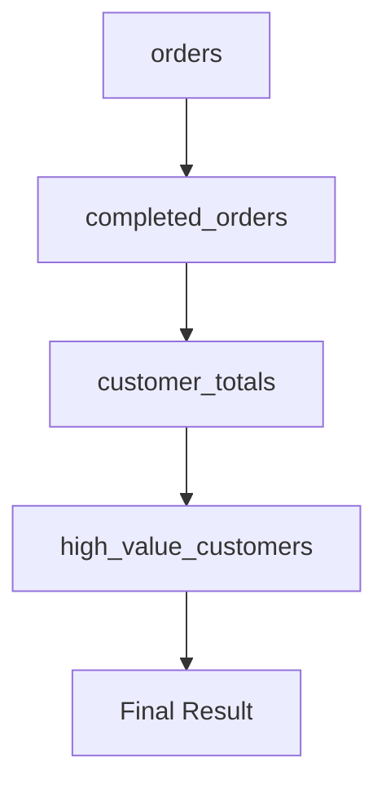
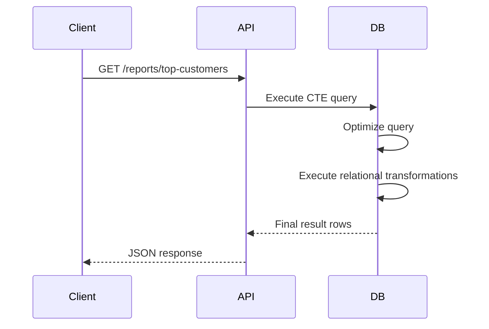

# 05- Multiple CTEs

## Overview

Multiple CTEs allow a single SQL statement to define several named intermediate relations and compose them into a larger query.

The general structure is:

```sql
WITH first_cte AS (
    SELECT ...
),
second_cte AS (
    SELECT ...
    FROM first_cte
),
third_cte AS (
    SELECT ...
    FROM second_cte
)
SELECT ...
FROM third_cte;
```

This is particularly useful when a query contains multiple logical transformation stages such as filtering, aggregation, enrichment, ranking, and final presentation.

The important engineering distinction is that CTEs provide **query composition**, not automatically materialized intermediate tables. The database optimizer determines the physical execution strategy.

## Why Multiple CTEs Matter

A complex production query often has several distinct relational operations:

```text
Raw data
   ↓
Filter
   ↓
Aggregate
   ↓
Enrich
   ↓
Rank
   ↓
Final result
```

Putting all of these operations into one deeply nested query can make the SQL difficult to review and maintain.

Multiple CTEs allow each transformation to receive a meaningful name:

```sql
WITH completed_orders AS (
    ...
),
customer_totals AS (
    ...
),
ranked_customers AS (
    ...
)
SELECT ...
FROM ranked_customers;
```

Each CTE can represent a specific business or technical concept.

This improves:

- Readability.
- Query review.
- Debugging.
- Separation of transformations.
- Explicit data flow.
- Reasoning about row cardinality.
- Maintainability of reporting and analytical queries.

## Basic Syntax

Multiple CTEs are separated by commas after the `WITH` keyword:

```sql
WITH cte_a AS (
    SELECT ...
),
cte_b AS (
    SELECT ...
),
cte_c AS (
    SELECT ...
)
SELECT ...
FROM cte_c;
```

There is only one `WITH` keyword.

Correct:

```sql
WITH customers AS (
    SELECT id
    FROM users
),
orders AS (
    SELECT id, customer_id
    FROM customer_orders
)
SELECT ...
FROM customers
JOIN orders
    ON orders.customer_id = customers.id;
```

Avoid repeating `WITH`:

```sql
-- Invalid structure
WITH customers AS (
    SELECT id
    FROM users
)
WITH orders AS (
    SELECT id, customer_id
    FROM customer_orders
)
SELECT ...;
```

## CTE Dependency Order

A later CTE can reference an earlier CTE in the same `WITH` clause.

```sql
WITH completed_orders AS (
    SELECT
        id,
        customer_id,
        total_amount
    FROM orders
    WHERE status = 'completed'
),
customer_totals AS (
    SELECT
        customer_id,
        SUM(total_amount) AS total_spend
    FROM completed_orders
    GROUP BY customer_id
)
SELECT
    customer_id,
    total_spend
FROM customer_totals;
```

The dependency graph is:


Conceptually:

```text
orders
  ↓
completed_orders
  ↓
customer_totals
  ↓
final query
```

A useful rule is:

> Define CTEs in dependency order.

This makes the query easier to read and avoids invalid forward references.

## Independent CTEs

Not every CTE needs to depend on another CTE.

```sql
WITH active_customers AS (
    SELECT
        id,
        email
    FROM customers
    WHERE is_active = TRUE
),
recent_orders AS (
    SELECT
        customer_id,
        COUNT(*) AS order_count
    FROM orders
    WHERE created_at >= CURRENT_DATE - INTERVAL '30 days'
    GROUP BY customer_id
)
SELECT
    c.id,
    c.email,
    COALESCE(o.order_count, 0) AS order_count
FROM active_customers AS c
LEFT JOIN recent_orders AS o
    ON o.customer_id = c.id;
```

Here:

- `active_customers` depends only on `customers`.
- `recent_orders` depends only on `orders`.
- The final query combines both datasets.

This is useful when separate parts of the query represent independent data preparation stages.

## Dependent CTEs

Dependent CTEs form a transformation pipeline.

```sql
WITH completed_orders AS (
    SELECT
        customer_id,
        total_amount
    FROM orders
    WHERE status = 'completed'
),
customer_totals AS (
    SELECT
        customer_id,
        SUM(total_amount) AS total_spend
    FROM completed_orders
    GROUP BY customer_id
),
high_value_customers AS (
    SELECT
        customer_id,
        total_spend
    FROM customer_totals
    WHERE total_spend >= 10000
)
SELECT
    customer_id,
    total_spend
FROM high_value_customers
ORDER BY total_spend DESC;
```

The data flow is:



Each stage has a clear responsibility:

| CTE | Responsibility | Row grain |
|---|---|---|
| `completed_orders` | Filter orders | One row per completed order |
| `customer_totals` | Aggregate orders | One row per customer |
| `high_value_customers` | Apply business threshold | One row per qualifying customer |
| Final query | Presentation | One row per qualifying customer |

Explicitly understanding row grain is essential when composing multiple CTEs.

## CTEs as a Transformation Pipeline

A production query can often be designed as a series of relational transformations:

```text
Source
  ↓
Selection / Filtering
  ↓
Aggregation
  ↓
Join / Enrichment
  ↓
Ranking / Windowing
  ↓
Business filtering
  ↓
Final projection
```

For example:

```sql
WITH completed_orders AS (
    SELECT
        customer_id,
        total_amount,
        created_at
    FROM orders
    WHERE status = 'completed'
),
customer_totals AS (
    SELECT
        customer_id,
        SUM(total_amount) AS total_spend
    FROM completed_orders
    GROUP BY customer_id
),
ranked_customers AS (
    SELECT
        customer_id,
        total_spend,
        RANK() OVER (
            ORDER BY total_spend DESC
        ) AS spend_rank
    FROM customer_totals
)
SELECT
    customer_id,
    total_spend,
    spend_rank
FROM ranked_customers
WHERE spend_rank <= 100
ORDER BY spend_rank;
```

This structure is easier to reason about than a single deeply nested statement.

## Multiple CTEs with Joins

CTEs can prepare separate datasets before joining them.

```sql
WITH customer_totals AS (
    SELECT
        customer_id,
        SUM(total_amount) AS total_spend
    FROM orders
    WHERE status = 'completed'
    GROUP BY customer_id
),
customer_refunds AS (
    SELECT
        customer_id,
        SUM(amount) AS total_refunded
    FROM refunds
    WHERE status = 'processed'
    GROUP BY customer_id
)
SELECT
    c.id,
    c.email,
    COALESCE(ct.total_spend, 0) AS total_spend,
    COALESCE(cr.total_refunded, 0) AS total_refunded
FROM customers AS c
LEFT JOIN customer_totals AS ct
    ON ct.customer_id = c.id
LEFT JOIN customer_refunds AS cr
    ON cr.customer_id = c.id;
```

Both CTEs have one row per customer, so joining them to `customers` does not multiply customer rows.

This is an important design property:

```text
customer_totals
    1 row / customer
          +
customer_refunds
    1 row / customer
          ↓
safe customer-level join
```

If either CTE contained multiple rows per customer, the join could multiply results.

## Avoiding Join Multiplication

Consider:

```sql
WITH customer_orders AS (
    SELECT
        customer_id,
        id AS order_id
    FROM orders
),
customer_refunds AS (
    SELECT
        customer_id,
        id AS refund_id
    FROM refunds
)
SELECT
    customer_id,
    order_id,
    refund_id
FROM customer_orders
JOIN customer_refunds
    USING (customer_id);
```

If a customer has:

- 5 orders
- 3 refunds

the join can produce:

```text
5 × 3 = 15 rows
```

This may be correct if the desired result is every order/refund combination, but it is usually incorrect for customer-level reporting.

A safer design is to aggregate each dataset to the intended grain first:

```sql
WITH customer_order_totals AS (
    SELECT
        customer_id,
        COUNT(*) AS order_count
    FROM orders
    GROUP BY customer_id
),
customer_refund_totals AS (
    SELECT
        customer_id,
        COUNT(*) AS refund_count
    FROM refunds
    GROUP BY customer_id
)
SELECT
    c.id,
    COALESCE(o.order_count, 0) AS order_count,
    COALESCE(r.refund_count, 0) AS refund_count
FROM customers AS c
LEFT JOIN customer_order_totals AS o
    ON o.customer_id = c.id
LEFT JOIN customer_refund_totals AS r
    ON r.customer_id = c.id;
```

**Senior-level rule:** before joining two CTEs, explicitly identify the grain of each relation.

## Multiple CTEs with Window Functions

CTEs work well with window functions because a window calculation can be isolated before applying a filter.

```sql
WITH customer_totals AS (
    SELECT
        customer_id,
        SUM(total_amount) AS total_spend
    FROM orders
    WHERE status = 'completed'
    GROUP BY customer_id
),
ranked_customers AS (
    SELECT
        customer_id,
        total_spend,
        DENSE_RANK() OVER (
            ORDER BY total_spend DESC
        ) AS spend_rank
    FROM customer_totals
)
SELECT
    customer_id,
    total_spend,
    spend_rank
FROM ranked_customers
WHERE spend_rank <= 10;
```

The separation matters because window-function results generally cannot be filtered directly in the same query level's `WHERE` clause.

The CTE provides another query level in which the calculated ranking can be filtered.

## Multiple CTEs with Different Grains

A complex query can intentionally move between grains.

For example:

```text
Order
  ↓
Customer
  ↓
Customer + Month
  ↓
Customer
```

SQL:

```sql
WITH completed_orders AS (
    SELECT
        customer_id,
        created_at,
        total_amount
    FROM orders
    WHERE status = 'completed'
),
monthly_customer_sales AS (
    SELECT
        customer_id,
        DATE_TRUNC('month', created_at) AS month,
        SUM(total_amount) AS monthly_sales
    FROM completed_orders
    GROUP BY
        customer_id,
        DATE_TRUNC('month', created_at)
),
customer_totals AS (
    SELECT
        customer_id,
        SUM(monthly_sales) AS total_sales
    FROM monthly_customer_sales
    GROUP BY customer_id
)
SELECT
    customer_id,
    total_sales
FROM customer_totals;
```

Each CTE changes the row grain:

| Stage | Grain |
|---|---|
| `completed_orders` | One row per order |
| `monthly_customer_sales` | One row per customer per month |
| `customer_totals` | One row per customer |
| Final result | One row per customer |

Documenting this mentally—or explicitly in code review—is one of the most effective ways to prevent subtle aggregation bugs.

## Multiple CTEs and `WITH RECURSIVE`

Multiple CTEs can also include recursive CTEs in databases that support recursive queries.

For example, a hierarchical organization query can use:

```sql
WITH RECURSIVE employee_tree AS (
    SELECT
        id,
        manager_id,
        name,
        0 AS depth
    FROM employees
    WHERE id = 100

    UNION ALL

    SELECT
        e.id,
        e.manager_id,
        e.name,
        et.depth + 1
    FROM employees AS e
    JOIN employee_tree AS et
        ON e.manager_id = et.id
)
SELECT
    id,
    manager_id,
    name,
    depth
FROM employee_tree
ORDER BY depth, id;
```

When mixing recursive and non-recursive CTEs, database-specific syntax and ordering rules should be verified against the target database.

Do not assume recursive CTE behavior is identical across PostgreSQL, MySQL, SQL Server, and other database systems.

## Multiple CTEs vs Deeply Nested Queries

Consider a nested approach:

```sql
SELECT
    customer_id,
    total_spend
FROM (
    SELECT
        customer_id,
        SUM(total_amount) AS total_spend
    FROM (
        SELECT
            customer_id,
            total_amount
        FROM orders
        WHERE status = 'completed'
    ) AS completed_orders
    GROUP BY customer_id
) AS customer_totals
WHERE total_spend >= 10000;
```

The equivalent CTE structure is:

```sql
WITH completed_orders AS (
    SELECT
        customer_id,
        total_amount
    FROM orders
    WHERE status = 'completed'
),
customer_totals AS (
    SELECT
        customer_id,
        SUM(total_amount) AS total_spend
    FROM completed_orders
    GROUP BY customer_id
)
SELECT
    customer_id,
    total_spend
FROM customer_totals
WHERE total_spend >= 10000;
```

The CTE version makes the transformation stages explicit.

The syntax alone does **not** guarantee better runtime performance. The optimizer may produce similar execution plans.

## Multiple CTEs vs Temporary Tables

Multiple CTEs should not be treated as a replacement for temporary tables in every workload.

| Requirement | Multiple CTEs | Temporary table |
|---|---:|---:|
| One SQL statement | Excellent | Usually unnecessary |
| Multiple statements | No | Yes |
| Explicit intermediate indexes | No | Yes |
| Reuse across statements | No | Yes |
| Complex multi-step ETL | Sometimes | Often better |
| Statement-local composition | Excellent | More operational overhead |
| Persistent intermediate state | No | Temporary |

If an intermediate dataset needs an index or must be reused by several statements, a temporary table may be a better fit.

## Performance and Materialization

Multiple CTEs do not necessarily mean multiple physical intermediate tables.

For example:

```sql
WITH filtered_orders AS (
    SELECT
        customer_id,
        total_amount
    FROM orders
    WHERE status = 'completed'
),
customer_totals AS (
    SELECT
        customer_id,
        SUM(total_amount) AS total_spend
    FROM filtered_orders
    GROUP BY customer_id
)
SELECT *
FROM customer_totals;
```

The optimizer may inline, materialize, reorder, or otherwise transform parts of the query depending on the database.

In PostgreSQL, explicit materialization control is available:

```sql
WITH filtered_orders AS NOT MATERIALIZED (
    SELECT
        customer_id,
        total_amount
    FROM orders
    WHERE status = 'completed'
)
SELECT *
FROM filtered_orders;
```

Or:

```sql
WITH filtered_orders AS MATERIALIZED (
    SELECT
        customer_id,
        total_amount
    FROM orders
    WHERE status = 'completed'
)
SELECT *
FROM filtered_orders;
```

These controls are database-specific.

For production performance work, inspect the actual plan:

```sql
EXPLAIN (
    ANALYZE,
    BUFFERS
)
WITH filtered_orders AS (
    SELECT
        customer_id,
        total_amount
    FROM orders
    WHERE status = 'completed'
),
customer_totals AS (
    SELECT
        customer_id,
        SUM(total_amount) AS total_spend
    FROM filtered_orders
    GROUP BY customer_id
)
SELECT
    customer_id,
    total_spend
FROM customer_totals
WHERE total_spend >= 10000;
```

Focus on:

- Actual row counts.
- Estimated vs actual cardinality.
- Sequential scans vs index scans.
- Join strategies.
- Sort operations.
- Hash operations.
- Memory usage.
- Temporary file usage.
- Execution time.

## Predicate Placement

With multiple CTEs, predicate placement affects both semantics and potentially performance.

For example:

```sql
WITH completed_orders AS (
    SELECT
        customer_id,
        total_amount
    FROM orders
    WHERE status = 'completed'
),
customer_totals AS (
    SELECT
        customer_id,
        SUM(total_amount) AS total_spend
    FROM completed_orders
    GROUP BY customer_id
)
SELECT
    customer_id,
    total_spend
FROM customer_totals
WHERE total_spend >= 10000;
```

The status filter operates at the order level.

The spending threshold operates at the customer level.

Moving predicates between stages without understanding the grain can change the result.

This is especially important when conditions involve aggregates:

```sql
WHERE status = 'completed'
```

is fundamentally different from:

```sql
HAVING SUM(total_amount) >= 10000
```

The first filters rows before aggregation; the second filters groups after aggregation.

## Multiple CTEs in Backend APIs

A REST or gRPC endpoint may need to return a complex report.

Instead of fetching raw orders into Python and performing multiple transformations:

```text
Database
   ↓
raw orders
   ↓
Python
   ↓
filter
   ↓
aggregate
   ↓
rank
   ↓
JSON
```

the database can perform the relational work:

```text
API
 ↓
one SQL statement
 ↓
CTE pipeline
 ├─ filter
 ├─ aggregate
 ├─ enrich
 └─ rank
 ↓
final rows
 ↓
API response
```

This can reduce network transfer and application-side processing.

A typical API lifecycle is:



The application should still enforce:

- Query timeouts.
- Appropriate pagination.
- Parameterized inputs.
- Result-size limits.
- Observability.
- Authorization.

## Parameterization and Security

CTEs do not change SQL injection rules.

Use bound parameters from application code:

```python
from django.db import connection

query = """
WITH completed_orders AS (
    SELECT
        customer_id,
        total_amount
    FROM orders
    WHERE status = %s
      AND created_at >= %s
),
customer_totals AS (
    SELECT
        customer_id,
        SUM(total_amount) AS total_spend
    FROM completed_orders
    GROUP BY customer_id
)
SELECT
    customer_id,
    total_spend
FROM customer_totals
WHERE total_spend >= %s
"""

with connection.cursor() as cursor:
    cursor.execute(
        query,
        ["completed", start_date, minimum_spend],
    )
    rows = cursor.fetchall()
```

Avoid interpolating user-controlled values into SQL.

```python
# Unsafe
query = f"""
WITH completed_orders AS (
    SELECT *
    FROM orders
    WHERE status = '{status}'
)
SELECT ...
"""
```

For dynamic identifiers such as table or column names, use database-driver-specific identifier composition rather than value parameters.

## Maintainability Guidelines

Good multiple-CTE queries generally follow these conventions:

### Use Descriptive Names

Prefer:

```sql
WITH completed_orders AS (...)
```

over:

```sql
WITH c1 AS (...)
```

Names should describe the relation's meaning.

### Keep One Responsibility per CTE

Prefer:

```text
completed_orders
    ↓
customer_totals
    ↓
ranked_customers
```

over a single CTE containing unrelated transformations.

A CTE does not need to perform exactly one SQL operation, but its purpose should be clear.

### Keep Dependency Direction Obvious

Prefer:

```sql
WITH source_data AS (...),
aggregated_data AS (
    SELECT ...
    FROM source_data
),
final_data AS (
    SELECT ...
    FROM aggregated_data
)
SELECT ...
FROM final_data;
```

This creates a readable top-to-bottom pipeline.

### Select Only Required Columns

Avoid carrying unnecessary columns through every stage:

```sql
WITH completed_orders AS (
    SELECT
        customer_id,
        total_amount
    FROM orders
    WHERE status = 'completed'
)
...
```

Instead of:

```sql
WITH completed_orders AS (
    SELECT *
    FROM orders
    WHERE status = 'completed'
)
...
```

Reducing unnecessary data movement can improve readability and, depending on the plan, execution efficiency.

## Common Mistakes

### Reusing the Same `WITH` Keyword

There should normally be one `WITH` clause containing comma-separated CTE definitions:

```sql
WITH first_cte AS (...),
second_cte AS (...)
SELECT ...;
```

Not multiple sequential `WITH` clauses.

### Creating Too Many CTEs

Multiple CTEs improve structure until they become excessive abstraction.

This:

```text
cte_1
  ↓
cte_2
  ↓
cte_3
  ↓
cte_4
  ↓
cte_5
  ↓
cte_6
  ↓
cte_7
```

may be justified for a complex analytical query, but if each CTE performs a trivial transformation, the query can become harder to understand.

Use CTE boundaries where they communicate meaningful transformation stages.

### Ignoring Cardinality

A CTE that contains multiple rows per customer can multiply rows when joined to another multi-row customer relation.

Always identify the expected grain before joining.

### Assuming CTEs Execute Sequentially

The textual order communicates dependencies and intent, but it does not necessarily describe the physical execution order.

The optimizer controls execution.

### Assuming Every CTE Is Materialized

A CTE is not automatically a temporary table.

Materialization behavior depends on the database and query.

### Filtering at the Wrong Query Level

A predicate applied before aggregation can have a completely different meaning from one applied after aggregation.

Understand whether the condition operates on:

- Rows.
- Groups.
- Window-function results.
- Final projected data.

### Using CTEs Without Measuring Performance

Readable SQL can still be slow.

For important production queries, use:

```sql
EXPLAIN (
    ANALYZE,
    BUFFERS
)
...
```

and test with realistic cardinalities.

## Production Considerations

### Query Complexity

Multiple CTEs are especially useful for:

- Reporting queries.
- Analytics.
- Data-quality checks.
- Complex filtering pipelines.
- Ranking workflows.
- Multi-stage aggregation.
- Hierarchical queries.
- Data migration statements.

For simple CRUD queries, a CTE may add unnecessary complexity.

### Scalability

As data grows, inspect how each CTE changes row counts:

```text
10,000,000 orders
        ↓
2,000,000 completed orders
        ↓
500,000 customers
        ↓
50,000 high-value customers
        ↓
100 ranked customers
```

Early selective filtering can reduce downstream work, but do not assume the textual CTE boundaries themselves guarantee that optimization.

### Observability

Monitor production queries using:

- Database query statistics.
- Slow-query logs.
- Application latency metrics.
- Query execution plans.
- Connection pool metrics.
- Database CPU and memory.
- Temporary disk usage where relevant.

For PostgreSQL workloads, tools such as `pg_stat_statements` can help identify expensive normalized query patterns.

### Reliability

Long-running CTE queries can consume:

- Database CPU.
- Memory.
- Connections.
- Temporary storage.
- Locks for write queries.

Protect APIs with appropriate database statement timeouts and application-level deadlines.

For asynchronous reporting, consider moving expensive workloads to background processing such as Celery rather than blocking request workers.

### Transactions and Writes

CTEs can be used with `INSERT`, `UPDATE`, and `DELETE` statements where supported.

For example:

```sql
WITH expired_orders AS (
    SELECT id
    FROM orders
    WHERE status = 'pending'
      AND created_at < CURRENT_TIMESTAMP - INTERVAL '24 hours'
)
UPDATE orders AS o
SET status = 'expired'
FROM expired_orders AS e
WHERE o.id = e.id;
```

A CTE does not itself establish a transaction boundary. Transaction semantics come from the database statement and surrounding transaction context.

For high-contention writes, evaluate locking, isolation level, deadlocks, and retry behavior.

## Interview Traps

### "Does Each CTE Execute Independently?"

Not necessarily.

CTEs are part of one SQL statement, and the optimizer can transform the query. The physical execution strategy depends on the database engine and query.

### "Are Multiple CTEs Always Slower?"

No.

The number of CTEs alone does not determine performance. The execution plan, cardinality, indexes, joins, sorting, aggregation, and optimizer behavior matter.

### "Are CTEs Always Materialized?"

No.

Materialization behavior is database- and query-dependent. Some databases and versions provide explicit controls.

### "Can a CTE Reference Another CTE?"

Yes, provided the dependency is valid under the database's CTE rules. The common pattern is to define dependencies from earlier CTEs to later CTEs.

### "Why Use Multiple CTEs Instead of One Large Query?"

The primary benefit is composability and readability. Multiple CTEs expose intermediate relations and make complex transformations easier to reason about.

## When Multiple CTEs Are a Good Choice

Use multiple CTEs when:

| Situation | Recommendation |
|---|---|
| Several meaningful transformation stages | Strong fit |
| Multiple independent datasets need preparation | Strong fit |
| Aggregation followed by ranking/filtering | Strong fit |
| Complex reporting query | Strong fit |
| Recursive hierarchy | Strong fit |
| Simple single-table lookup | Usually unnecessary |
| Intermediate data reused across statements | Consider a temporary table |
| Intermediate data requires dedicated indexes | Consider a temporary table |
| Query is already simple and readable | Avoid adding abstraction |

The key question is not:

> "Can this query use multiple CTEs?"

It is:

> "Does each CTE make the query's data flow, semantics, or maintainability clearer?"

## Production Checklist

Before shipping a query containing multiple CTEs:

- [ ] Does each CTE represent a meaningful transformation?
- [ ] Are CTE names descriptive?
- [ ] Are CTE dependencies easy to follow?
- [ ] Is the row grain of every important CTE understood?
- [ ] Are joins protected against accidental row multiplication?
- [ ] Are filters applied at the correct semantic stage?
- [ ] Are unnecessary columns excluded?
- [ ] Are application values parameterized?
- [ ] Has the query been tested with production-scale cardinalities?
- [ ] Has the actual execution plan been inspected for performance-sensitive queries?
- [ ] Are database-specific materialization semantics understood?
- [ ] Are statement timeouts and transaction behavior appropriate?
- [ ] Is an asynchronous workflow more appropriate for expensive reporting operations?

## Key Takeaways

- **Multiple CTEs turn complex SQL into explicit, named transformation stages within a single statement.**
- **Define dependent CTEs in a clear dependency order and treat each CTE as a relation with a specific row grain.**
- **Most serious bugs in multi-CTE queries come from incorrect cardinality assumptions, misplaced filters, or join multiplication—not from the CTE syntax itself.**
- **CTEs are logical query constructs; never assume that each CTE is independently materialized or executed sequentially.**
- **For production workloads, validate multi-CTE queries with realistic data, execution plans, parameterization, timeouts, and transaction analysis.**