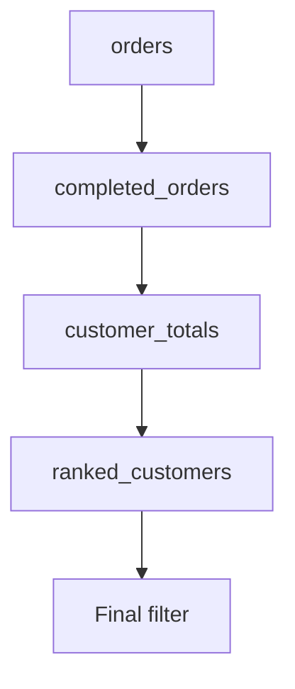
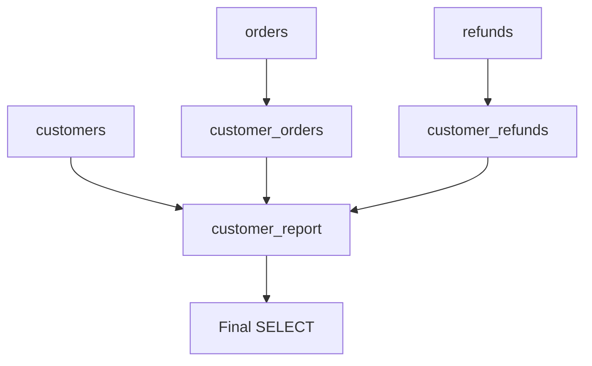
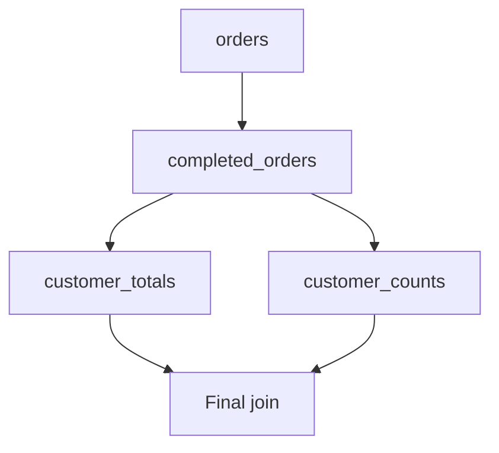

# 06- CTE Dependencies

## Overview

A Common Table Expression (CTE) can reference another CTE defined earlier in the same `WITH` clause. This creates a dependency graph that determines the **logical data flow** of a query.

Understanding CTE dependencies is important when building production SQL because a query may contain several stages:

```text
Base tables
    ↓
Filtered data
    ↓
Aggregated data
    ↓
Enriched data
    ↓
Ranked data
    ↓
Final result
```

For example:

```sql
WITH completed_orders AS (
    SELECT
        customer_id,
        total_amount
    FROM orders
    WHERE status = 'completed'
),
customer_totals AS (
    SELECT
        customer_id,
        SUM(total_amount) AS total_spend
    FROM completed_orders
    GROUP BY customer_id
)
SELECT
    customer_id,
    total_spend
FROM customer_totals;
```

`customer_totals` depends on `completed_orders`, while `completed_orders` depends on `orders`.

The critical distinction is that **CTE dependency order describes logical dependencies, not necessarily physical execution order**. The database optimizer may transform the query when producing its execution plan.

## What Is a CTE Dependency?

A CTE dependency exists when one CTE references another CTE.

```sql
WITH orders_filtered AS (
    SELECT *
    FROM orders
    WHERE status = 'completed'
),
customer_totals AS (
    SELECT
        customer_id,
        SUM(total_amount) AS total_spend
    FROM orders_filtered
    GROUP BY customer_id
)
SELECT *
FROM customer_totals;
```

The dependency is:

```text
orders
  ↓
orders_filtered
  ↓
customer_totals
  ↓
final SELECT
```

Here:

- `orders_filtered` depends on `orders`.
- `customer_totals` depends on `orders_filtered`.
- The final query depends on `customer_totals`.

This creates a directed dependency graph.

## Why CTE Dependencies Matter

Explicit dependencies make complex SQL easier to reason about.

Without CTEs, the same query may contain deeply nested derived tables:

```sql
SELECT ...
FROM (
    SELECT ...
    FROM (
        SELECT ...
        FROM orders
        WHERE status = 'completed'
    ) AS filtered_orders
    GROUP BY ...
) AS totals;
```

With CTEs:

```sql
WITH filtered_orders AS (
    SELECT ...
    FROM orders
    WHERE status = 'completed'
),
totals AS (
    SELECT ...
    FROM filtered_orders
    GROUP BY ...
)
SELECT ...
FROM totals;
```

The CTE version exposes the transformation pipeline directly.

This matters for:

- Code review.
- Debugging.
- Query maintenance.
- Cardinality reasoning.
- Performance analysis.
- Business-rule validation.
- Refactoring complex reporting queries.

## Basic Dependency Structure

A common pattern is a linear dependency chain:

```sql
WITH source_data AS (
    SELECT ...
    FROM orders
),
filtered_data AS (
    SELECT ...
    FROM source_data
    WHERE ...
),
aggregated_data AS (
    SELECT ...
    FROM filtered_data
    GROUP BY ...
)
SELECT ...
FROM aggregated_data;
```

The dependency graph is:


This structure is easy to understand because each stage has one clear upstream dependency.

## Dependency Order

A dependent CTE should be defined according to the SQL dialect's CTE dependency rules, with the standard non-recursive pattern being:

```sql
WITH first_cte AS (
    SELECT ...
),
second_cte AS (
    SELECT ...
    FROM first_cte
)
SELECT ...
FROM second_cte;
```

The important rule is:

> A CTE should not rely on a later sibling CTE unless the target database explicitly supports the required behavior.

Prefer:

```sql
WITH customers AS (
    SELECT id
    FROM users
),
orders AS (
    SELECT customer_id
    FROM customer_orders
    WHERE customer_id IN (
        SELECT id
        FROM customers
    )
)
SELECT *
FROM orders;
```

Avoid assuming that this is portable:

```sql
WITH orders AS (
    SELECT ...
    FROM customers
),
customers AS (
    SELECT ...
)
SELECT ...
FROM orders;
```

If `orders` references `customers`, define the dependency explicitly and verify database-specific rules.

## Linear Dependency Chains

The simplest dependency graph is a chain:

```text
A → B → C → D
```

Example:

```sql
WITH completed_orders AS (
    SELECT
        customer_id,
        total_amount
    FROM orders
    WHERE status = 'completed'
),
customer_totals AS (
    SELECT
        customer_id,
        SUM(total_amount) AS total_spend
    FROM completed_orders
    GROUP BY customer_id
),
ranked_customers AS (
    SELECT
        customer_id,
        total_spend,
        RANK() OVER (
            ORDER BY total_spend DESC
        ) AS spend_rank
    FROM customer_totals
)
SELECT
    customer_id,
    total_spend,
    spend_rank
FROM ranked_customers
WHERE spend_rank <= 10;
```

The data flow is:



Each stage changes the shape or meaning of the data:

| Stage | Operation | Typical grain |
|---|---|---|
| `completed_orders` | Filter | One row per order |
| `customer_totals` | Aggregate | One row per customer |
| `ranked_customers` | Window calculation | One row per customer |
| Final query | Filter/presentation | Top customers |

## Branching Dependencies

A dependency graph does not have to be linear.

Multiple CTEs can independently consume base tables and then converge:

```text
             ┌──→ customer_orders ──┐
customers ───┤                       ├──→ customer_report
             └──→ customer_refunds ─┘
```

Example:

```sql
WITH customer_orders AS (
    SELECT
        customer_id,
        COUNT(*) AS order_count,
        SUM(total_amount) AS order_value
    FROM orders
    WHERE status = 'completed'
    GROUP BY customer_id
),
customer_refunds AS (
    SELECT
        customer_id,
        COUNT(*) AS refund_count,
        SUM(amount) AS refund_value
    FROM refunds
    WHERE status = 'processed'
    GROUP BY customer_id
),
customer_report AS (
    SELECT
        c.id AS customer_id,
        COALESCE(o.order_count, 0) AS order_count,
        COALESCE(o.order_value, 0) AS order_value,
        COALESCE(r.refund_count, 0) AS refund_count,
        COALESCE(r.refund_value, 0) AS refund_value
    FROM customers AS c
    LEFT JOIN customer_orders AS o
        ON o.customer_id = c.id
    LEFT JOIN customer_refunds AS r
        ON r.customer_id = c.id
)
SELECT *
FROM customer_report;
```

The dependency graph is:



This pattern is particularly useful when different datasets require independent aggregation before being combined.

## Converging Dependencies

Several CTEs can feed one later CTE:

```sql
WITH order_totals AS (
    SELECT
        customer_id,
        SUM(total_amount) AS order_total
    FROM orders
    GROUP BY customer_id
),
refund_totals AS (
    SELECT
        customer_id,
        SUM(amount) AS refund_total
    FROM refunds
    GROUP BY customer_id
),
net_customer_value AS (
    SELECT
        COALESCE(o.customer_id, r.customer_id) AS customer_id,
        COALESCE(o.order_total, 0) -
        COALESCE(r.refund_total, 0) AS net_value
    FROM order_totals AS o
    FULL OUTER JOIN refund_totals AS r
        ON r.customer_id = o.customer_id
)
SELECT *
FROM net_customer_value;
```

The final CTE depends on both `order_totals` and `refund_totals`.

This pattern is useful when independent transformations produce compatible datasets that need to be combined.

## Avoiding Circular Dependencies

A circular dependency occurs when CTEs depend on each other in a cycle:

```text
A → B → C → A
```

For example:

```sql
WITH first_cte AS (
    SELECT ...
    FROM second_cte
),
second_cte AS (
    SELECT ...
    FROM first_cte
)
SELECT *
FROM first_cte;
```

This is not a valid ordinary non-recursive dependency structure.

If the business problem genuinely requires recursive traversal, use a recursive CTE where supported:

```sql
WITH RECURSIVE employee_tree AS (
    SELECT
        id,
        manager_id,
        name,
        0 AS depth
    FROM employees
    WHERE id = 100

    UNION ALL

    SELECT
        e.id,
        e.manager_id,
        e.name,
        et.depth + 1
    FROM employees AS e
    JOIN employee_tree AS et
        ON e.manager_id = et.id
)
SELECT
    id,
    manager_id,
    name,
    depth
FROM employee_tree;
```

A recursive CTE has different semantics from ordinary sibling CTE dependencies and should be treated as a separate design pattern.

## Dependency Graph vs Execution Plan

A common misconception is:

> "The first CTE executes completely, then the second CTE executes."

That is not necessarily true.

Consider:

```sql
WITH filtered_orders AS (
    SELECT
        customer_id,
        total_amount
    FROM orders
    WHERE status = 'completed'
),
customer_totals AS (
    SELECT
        customer_id,
        SUM(total_amount) AS total_spend
    FROM filtered_orders
    GROUP BY customer_id
)
SELECT *
FROM customer_totals;
```

The logical relationship is:

```text
orders
  ↓
filtered_orders
  ↓
customer_totals
```

But the optimizer can transform the physical execution.

The execution plan may involve:

- Predicate pushdown.
- Join reordering.
- Index scans.
- Hash aggregation.
- Sort-based aggregation.
- CTE inlining.
- CTE materialization where applicable.

Therefore:

```text
Logical CTE dependency
        ≠
Physical execution sequence
```

For performance analysis, inspect the execution plan rather than inferring execution behavior from CTE order.

## Dependency and Row Grain

Every CTE should have an understood row grain.

Consider:

```sql
WITH customer_orders AS (
    SELECT
        customer_id,
        COUNT(*) AS order_count
    FROM orders
    GROUP BY customer_id
),
customer_refunds AS (
    SELECT
        customer_id,
        COUNT(*) AS refund_count
    FROM refunds
    GROUP BY customer_id
)
SELECT ...
```

Both CTEs have:

```text
1 row / customer
```

That makes them safe candidates for a customer-level join.

Contrast that with:

```sql
WITH customer_orders AS (
    SELECT
        customer_id,
        id AS order_id
    FROM orders
),
customer_refunds AS (
    SELECT
        customer_id,
        id AS refund_id
    FROM refunds
)
SELECT ...
FROM customer_orders AS o
JOIN customer_refunds AS r
    ON r.customer_id = o.customer_id;
```

If one customer has 10 orders and 4 refunds, the join can produce:

```text
10 × 4 = 40 rows
```

The dependency graph may be correct syntactically while the resulting cardinality is wrong for the business requirement.

**Senior-level practice:** document or mentally track the grain at every dependency boundary.

## Dependency and Aggregation

Dependencies often represent changes in aggregation level.

Example:

```sql
WITH order_level AS (
    SELECT
        customer_id,
        created_at,
        total_amount
    FROM orders
),
monthly_customer_level AS (
    SELECT
        customer_id,
        DATE_TRUNC('month', created_at) AS month,
        SUM(total_amount) AS monthly_total
    FROM order_level
    GROUP BY
        customer_id,
        DATE_TRUNC('month', created_at)
),
customer_level AS (
    SELECT
        customer_id,
        SUM(monthly_total) AS lifetime_total
    FROM monthly_customer_level
    GROUP BY customer_id
)
SELECT *
FROM customer_level;
```

The dependency chain changes grain:

```text
Order
  ↓
Customer + Month
  ↓
Customer
```

When reviewing such a query, verify:

- What is one row?
- Which columns identify that row?
- Has an aggregation changed the grain?
- Is the next join compatible with that grain?
- Are measures being counted or summed more than once?

## Dependency and Predicate Placement

CTE dependencies also establish semantic stages for filters.

```sql
WITH completed_orders AS (
    SELECT
        customer_id,
        total_amount
    FROM orders
    WHERE status = 'completed'
),
customer_totals AS (
    SELECT
        customer_id,
        SUM(total_amount) AS total_spend
    FROM completed_orders
    GROUP BY customer_id
)
SELECT
    customer_id,
    total_spend
FROM customer_totals
WHERE total_spend >= 10000;
```

The two filters operate at different levels:

```text
orders
  ↓
status = 'completed'
  ↓
aggregate by customer
  ↓
total_spend >= 10000
```

Moving the second condition into the first CTE would be semantically impossible because `total_spend` does not exist at the order level.

This is one reason CTE dependencies are useful: they make data availability and semantic stages explicit.

## Multiple Consumers of a CTE

A CTE may conceptually serve multiple downstream operations.

For example:

```sql
WITH completed_orders AS (
    SELECT
        customer_id,
        total_amount
    FROM orders
    WHERE status = 'completed'
),
customer_totals AS (
    SELECT
        customer_id,
        SUM(total_amount) AS total_spend
    FROM completed_orders
    GROUP BY customer_id
),
customer_counts AS (
    SELECT
        customer_id,
        COUNT(*) AS order_count
    FROM completed_orders
    GROUP BY customer_id
)
SELECT
    t.customer_id,
    t.total_spend,
    c.order_count
FROM customer_totals AS t
JOIN customer_counts AS c
    ON c.customer_id = t.customer_id;
```

The logical graph is:



This can make a shared logical source explicit.

However, do not automatically assume the database physically computes `completed_orders` once and stores it for both consumers. Materialization and reuse depend on the database engine and query plan.

## Dependency Depth

Deep dependency chains can become difficult to maintain.

Example:

```text
A → B → C → D → E → F → G → H
```

A long chain is not inherently wrong. Complex analytical transformations may naturally require several stages.

The concern is whether the dependency boundaries communicate meaningful transformations.

Good:

```text
completed_orders
    ↓
monthly_customer_sales
    ↓
ranked_customers
    ↓
top_customers
```

Less useful:

```text
step1
    ↓
step2
    ↓
step3
    ↓
step4
```

Prefer names that describe the data represented by each relation.

## Dependency Naming

Names should communicate both **purpose** and, when useful, **grain**.

Good:

```sql
WITH monthly_customer_sales AS (
    ...
),
high_value_customers AS (
    ...
)
```

Weak:

```sql
WITH data1 AS (
    ...
),
data2 AS (
    ...
)
```

For complex reporting queries, names such as these can be useful:

- `eligible_customers`
- `completed_orders`
- `monthly_customer_sales`
- `customer_refund_totals`
- `ranked_products`
- `top_products`
- `active_subscriptions`

Avoid names that describe implementation details instead of meaning:

```text
tmp1
step2
query3
result
data
```

## Dependency and Column Contracts

A useful engineering practice is to treat each CTE as having an implicit interface.

For example:

```text
completed_orders
----------------
customer_id
order_id
total_amount
created_at
```

The downstream CTE expects those columns:

```sql
WITH completed_orders AS (
    SELECT
        customer_id,
        order_id,
        total_amount,
        created_at
    FROM orders
    WHERE status = 'completed'
),
customer_totals AS (
    SELECT
        customer_id,
        SUM(total_amount) AS total_spend
    FROM completed_orders
    GROUP BY customer_id
)
SELECT *
FROM customer_totals;
```

Changing:

```sql
total_amount
```

to:

```sql
amount
```

would break the downstream dependency.

Thinking of CTEs as relations with explicit column contracts makes complex SQL easier to refactor safely.

## Dependency and `SELECT *`

Avoid unnecessarily exposing every upstream column to downstream CTEs.

Prefer:

```sql
WITH completed_orders AS (
    SELECT
        customer_id,
        total_amount
    FROM orders
    WHERE status = 'completed'
)
SELECT ...
FROM completed_orders;
```

instead of:

```sql
WITH completed_orders AS (
    SELECT *
    FROM orders
    WHERE status = 'completed'
)
SELECT ...
FROM completed_orders;
```

Explicit projections provide a more stable dependency contract.

Benefits include:

- Reduced accidental coupling.
- Easier schema evolution.
- Clearer query intent.
- Potentially less data processing.
- Easier code review.

## Dependency and Schema Changes

CTEs are sensitive to changes in upstream schemas when downstream logic relies on specific columns.

Suppose:

```sql
WITH active_customers AS (
    SELECT
        id,
        email
    FROM customers
    WHERE is_active = TRUE
),
customer_summary AS (
    SELECT
        id,
        email
    FROM active_customers
)
SELECT *
FROM customer_summary;
```

If `active_customers` removes `email`, the downstream CTE becomes invalid.

In production, treat large SQL statements as code with dependencies:

```text
Database schema
      ↓
Base CTE
      ↓
Intermediate CTE
      ↓
Reporting CTE
      ↓
API / job / dashboard
```

Schema migrations should account for these consumers.

## Recursive Dependencies

Recursive CTEs are the appropriate mechanism for graph- or hierarchy-shaped data.

Typical use cases include:

- Organization hierarchies.
- Category trees.
- Folder structures.
- Dependency graphs.
- Bill-of-materials structures.
- Graph traversal.

A recursive CTE generally consists of:

1. An anchor query.
2. A recursive query.
3. A termination condition.

Example:

```sql
WITH RECURSIVE category_tree AS (
    SELECT
        id,
        parent_id,
        name,
        0 AS depth
    FROM categories
    WHERE id = 10

    UNION ALL

    SELECT
        c.id,
        c.parent_id,
        c.name,
        ct.depth + 1
    FROM categories AS c
    JOIN category_tree AS ct
        ON c.parent_id = ct.id
)
SELECT
    id,
    parent_id,
    name,
    depth
FROM category_tree
ORDER BY depth, id;
```

Recursive queries require additional production considerations:

- Preventing cycles.
- Limiting recursion depth where appropriate.
- Ensuring useful indexes.
- Measuring execution cost.
- Validating hierarchy size.
- Understanding database-specific recursion semantics.

## Production Performance

CTE dependencies should be evaluated together with the actual execution plan.

Use PostgreSQL, for example:

```sql
EXPLAIN (
    ANALYZE,
    BUFFERS
)
WITH completed_orders AS (
    SELECT
        customer_id,
        total_amount
    FROM orders
    WHERE status = 'completed'
),
customer_totals AS (
    SELECT
        customer_id,
        SUM(total_amount) AS total_spend
    FROM completed_orders
    GROUP BY customer_id
)
SELECT
    customer_id,
    total_spend
FROM customer_totals
WHERE total_spend >= 10000;
```

Investigate:

- Estimated vs actual row counts.
- Scan methods.
- Join algorithms.
- Sort operations.
- Hash operations.
- Aggregation cost.
- Memory usage.
- Temporary disk usage.
- Total execution time.

Do not optimize solely by reducing the number of CTEs.

A query with five well-designed CTEs can outperform a single unreadable query if the resulting relational operations are better suited to the data and optimizer.

## Database-Specific Behavior

CTE dependency behavior and optimization details vary between database engines.

| Database | Important consideration |
|---|---|
| PostgreSQL | CTEs may be inlined or materialized depending on query structure and version; explicit `MATERIALIZED` / `NOT MATERIALIZED` controls are available |
| MySQL | CTE support and optimizer behavior differ from PostgreSQL |
| SQL Server | CTEs are query-scoped and optimizer behavior should be evaluated through the execution plan |
| SQLite | Supports CTEs, including recursive CTEs, with engine-specific limitations |

Production SQL should target the actual database engine used by the application.

Do not assume behavior observed in PostgreSQL applies identically to MySQL or SQL Server.

## Backend Application Considerations

A multi-CTE query may be used behind a Django or FastAPI endpoint:

```text
HTTP request
     ↓
Application validation
     ↓
Parameterized SQL
     ↓
Database optimizer
     ↓
CTE dependency graph
     ↓
Execution plan
     ↓
Result set
     ↓
Application serialization
     ↓
HTTP response
```

For expensive queries:

- Apply request-level deadlines.
- Configure database statement timeouts.
- Avoid unbounded result sets.
- Use pagination where appropriate.
- Monitor query latency.
- Avoid running expensive analytical queries synchronously on latency-sensitive endpoints.
- Consider background processing for reports.

For Django, prefer parameterized query execution when using raw SQL:

```python
from django.db import connection

query = """
WITH completed_orders AS (
    SELECT
        customer_id,
        total_amount
    FROM orders
    WHERE status = %s
),
customer_totals AS (
    SELECT
        customer_id,
        SUM(total_amount) AS total_spend
    FROM completed_orders
    GROUP BY customer_id
)
SELECT
    customer_id,
    total_spend
FROM customer_totals
WHERE total_spend >= %s
"""

with connection.cursor() as cursor:
    cursor.execute(query, ["completed", 10_000])
    rows = cursor.fetchall()
```

Never construct value predicates by interpolating user input into the SQL string.

## Common Mistakes

### Treating CTE Order as Execution Order

Incorrect assumption:

```text
CTE A executes completely
       ↓
CTE B executes completely
       ↓
CTE C executes completely
```

The optimizer may produce a different physical plan.

Use CTE order to communicate logical dependencies, not to predict execution.

### Referencing a Later CTE

Do not design ordinary CTE dependencies around assumptions of forward references.

Prefer:

```sql
WITH base AS (...),
derived AS (
    SELECT ...
    FROM base
)
SELECT ...
FROM derived;
```

Keep dependencies explicit and easy to follow.

### Creating Circular Dependencies

Ordinary CTE chains should not contain cycles.

If the problem requires recursive traversal, use `WITH RECURSIVE` where supported.

### Ignoring Row Grain

A dependency can be syntactically valid while producing incorrect business results because an upstream CTE has a different grain than expected.

Always know whether a CTE represents:

- One row per order.
- One row per customer.
- One row per customer per month.
- One row per product.
- One row per event.

### Assuming Shared CTEs Are Computed Once

Logical reuse does not necessarily imply physical reuse.

Inspect the execution plan when the cost matters.

### Over-Fragmenting Queries

Do not create a CTE for every trivial expression.

Bad:

```text
filtered
→ selected
→ renamed
→ calculated
→ projected
→ final
```

when several stages could be expressed clearly in one query level.

### Using Ambiguous Names

Names such as `data`, `temp`, `result`, and `step1` hide the purpose of the dependency graph.

Prefer domain-oriented names.

### Carrying Unnecessary Columns

Avoid `SELECT *` in intermediate CTEs when only a few columns are required.

This creates unnecessary coupling between upstream schemas and downstream consumers.

## Dependency Design Guidelines

Use the following principles when designing multi-CTE queries:

| Principle | Recommendation |
|---|---|
| Dependency order | Define logical prerequisites before dependent CTEs |
| Naming | Use domain-oriented names |
| Grain | Know the row grain at every stage |
| Columns | Project only required columns |
| Responsibility | Give each CTE a meaningful transformation purpose |
| Branching | Use independent CTEs when datasets require separate preparation |
| Convergence | Verify cardinality before joining branches |
| Recursion | Use recursive CTEs for genuine hierarchical traversal |
| Performance | Validate with the actual execution plan |
| Portability | Check target database semantics |
| Security | Parameterize application-supplied values |
| Maintainability | Avoid unnecessary dependency depth |

## A Practical Dependency Review

When reviewing a complex CTE query, work from the base tables toward the final result.

### Identify the dependency graph

Write the logical structure:

```text
orders
  ↓
completed_orders
  ↓
customer_totals
  ↓
ranked_customers
  ↓
top_customers
```

### Identify the grain

For each stage:

```text
completed_orders  → order
customer_totals   → customer
ranked_customers  → customer
top_customers     → customer
```

### Validate each transformation

Ask:

- Does this CTE preserve or change row count?
- Does it change row grain?
- Does it aggregate?
- Does it duplicate rows?
- Does it filter?
- Does it introduce nullable columns?
- Does it depend on a specific upstream column?

### Inspect the execution plan

For performance-sensitive queries:

```sql
EXPLAIN (
    ANALYZE,
    BUFFERS
)
...
```

Verify the database is doing what the workload requires.

## Interview Traps

### "Does a Later CTE Always Execute After an Earlier CTE?"

No.

The CTE definitions establish logical relationships. The optimizer determines the physical execution strategy.

### "Can One CTE Depend on Another?"

Yes. This is one of the primary reasons to use multiple CTEs.

```sql
WITH a AS (...),
b AS (
    SELECT ...
    FROM a
)
SELECT ...
FROM b;
```

### "Can CTEs Form a Cycle?"

Ordinary non-recursive CTE dependencies should not form a cycle. Recursive traversal should use a recursive CTE where supported.

### "Does a Shared CTE Guarantee One Computation?"

No.

Logical reuse and physical materialization are separate concepts. The database optimizer determines how the query is executed.

### "Why Does CTE Grain Matter?"

Because downstream joins and aggregations operate on the rows produced by the CTE. Incorrect grain assumptions can cause duplicate rows, inflated aggregates, and incorrect business metrics.

## Production Checklist

Before shipping a query with multiple dependent CTEs:

- [ ] Is the dependency graph easy to understand?
- [ ] Are dependent CTEs defined according to the target database's rules?
- [ ] Does every CTE have a meaningful name?
- [ ] Is the row grain known at every stage?
- [ ] Are aggregation boundaries explicit?
- [ ] Are joins between dependency branches cardinality-safe?
- [ ] Are only required columns projected?
- [ ] Are predicates applied at the correct semantic level?
- [ ] Are recursive dependencies genuinely required?
- [ ] Are application values parameterized?
- [ ] Has the query been tested with realistic data volumes?
- [ ] Has the execution plan been inspected for performance-sensitive workloads?
- [ ] Are database-specific CTE optimization semantics understood?
- [ ] Are statement timeouts appropriate for the workload?
- [ ] Is an asynchronous reporting workflow more appropriate for expensive queries?

## Key Takeaways

- **CTE dependencies define a logical data-flow graph, allowing complex SQL to be composed from named transformation stages.**
- **Keep dependencies explicit and understandable, and track the row grain and column contract at every CTE boundary.**
- **Logical dependency order does not guarantee physical execution order; the database optimizer determines the execution plan.**
- **Branching and converging CTE dependencies are powerful, but joins between branches must be reviewed carefully for cardinality multiplication.**
- **For production queries, combine clear dependency design with parameterization, realistic data testing, execution-plan analysis, and database-specific knowledge.**