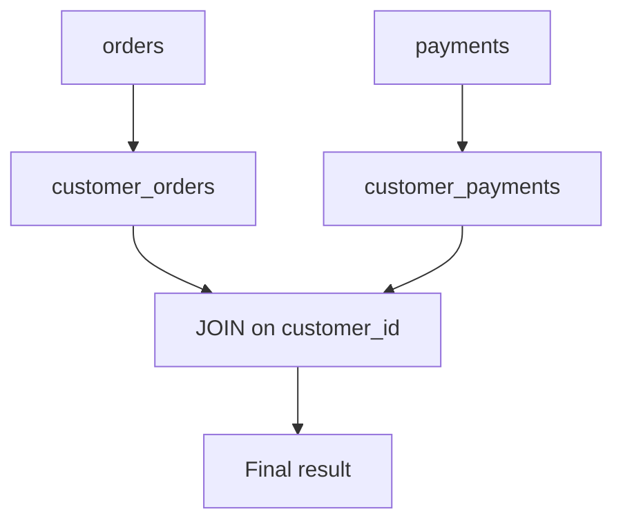
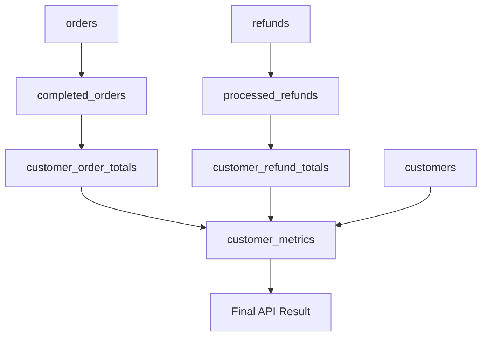

# 07- CTE with JOINs

## Overview

A CTE can be joined with other CTEs, base tables, derived tables, or the same logical dataset at different stages of a query. This makes CTEs useful for separating **data preparation** from **relational combination**.

A common production pattern is:

```text
Base tables
    ↓
CTEs prepare independent datasets
    ↓
JOIN combines datasets
    ↓
Final filtering / projection
```

For example, instead of joining raw orders and refunds directly:

```sql
WITH customer_orders AS (
    SELECT
        customer_id,
        COUNT(*) AS order_count,
        SUM(total_amount) AS order_value
    FROM orders
    WHERE status = 'completed'
    GROUP BY customer_id
),
customer_refunds AS (
    SELECT
        customer_id,
        COUNT(*) AS refund_count,
        SUM(amount) AS refund_value
    FROM refunds
    WHERE status = 'processed'
    GROUP BY customer_id
)
SELECT
    c.id AS customer_id,
    COALESCE(o.order_count, 0) AS order_count,
    COALESCE(o.order_value, 0) AS order_value,
    COALESCE(r.refund_count, 0) AS refund_count,
    COALESCE(r.refund_value, 0) AS refund_value
FROM customers AS c
LEFT JOIN customer_orders AS o
    ON o.customer_id = c.id
LEFT JOIN customer_refunds AS r
    ON r.customer_id = c.id;
```

The CTEs establish the correct aggregation grain before the joins occur.

## Why Join CTEs?

CTEs are particularly useful when a join should operate on **prepared or aggregated datasets** rather than raw tables.

Typical reasons include:

- Filtering a dataset before joining.
- Aggregating one-to-many relationships before joining.
- Separating independent business rules.
- Making complex joins easier to review.
- Preventing accidental row multiplication.
- Reusing a logical dataset within a larger query.
- Making analytical SQL easier to debug.

The key engineering principle is:

> **Control the grain of each dataset before combining it.**

## Basic CTE Join

A CTE behaves like a query-scoped relation that can participate in joins.

```sql
WITH active_customers AS (
    SELECT
        id,
        email
    FROM customers
    WHERE is_active = TRUE
)
SELECT
    c.id,
    c.email,
    o.id AS order_id
FROM active_customers AS c
JOIN orders AS o
    ON o.customer_id = c.id;
```

The CTE is joined exactly like a table:

```text
active_customers
       │
       │ customer_id = id
       ▼
     orders
       │
       ▼
   result set
```

The CTE itself does not change the fundamental semantics of the join.

## CTE Joined to a Base Table

One common pattern is to prepare one side of a relationship and then join it to a base table.

```sql
WITH recent_orders AS (
    SELECT
        id,
        customer_id,
        total_amount
    FROM orders
    WHERE created_at >= CURRENT_DATE - INTERVAL '30 days'
)
SELECT
    c.id AS customer_id,
    c.email,
    o.id AS order_id,
    o.total_amount
FROM customers AS c
JOIN recent_orders AS o
    ON o.customer_id = c.id;
```

This is useful when the CTE represents a meaningful business subset.

Examples:

- Active subscriptions.
- Recent orders.
- Eligible users.
- Successful payments.
- Unprocessed events.

## Joining Multiple CTEs

Multiple CTEs can be prepared independently and joined in the final query.

```sql
WITH customer_orders AS (
    SELECT
        customer_id,
        COUNT(*) AS order_count,
        SUM(total_amount) AS order_total
    FROM orders
    WHERE status = 'completed'
    GROUP BY customer_id
),
customer_payments AS (
    SELECT
        customer_id,
        SUM(amount) AS payment_total
    FROM payments
    WHERE status = 'captured'
    GROUP BY customer_id
)
SELECT
    o.customer_id,
    o.order_count,
    o.order_total,
    COALESCE(p.payment_total, 0) AS payment_total
FROM customer_orders AS o
LEFT JOIN customer_payments AS p
    ON p.customer_id = o.customer_id;
```

Both CTEs have:

```text
1 row per customer
```

Therefore the join is naturally one-to-one at the customer grain.



## Joining CTEs at the Correct Grain

Row grain is the most important consideration when joining CTEs.

Suppose:

```sql
WITH customer_orders AS (
    SELECT
        customer_id,
        COUNT(*) AS order_count
    FROM orders
    GROUP BY customer_id
)
```

Its grain is:

```text
one row per customer
```

A second CTE:

```sql
WITH customer_refunds AS (
    SELECT
        customer_id,
        COUNT(*) AS refund_count
    FROM refunds
    GROUP BY customer_id
)
```

also has:

```text
one row per customer
```

Joining them is safe:

```sql
SELECT
    o.customer_id,
    o.order_count,
    r.refund_count
FROM customer_orders AS o
LEFT JOIN customer_refunds AS r
    ON r.customer_id = o.customer_id;
```

The join does not multiply customer rows because each side contains at most one row per customer.

## The Row Multiplication Problem

Consider the opposite case:

```sql
WITH customer_orders AS (
    SELECT
        customer_id,
        id AS order_id
    FROM orders
),
customer_refunds AS (
    SELECT
        customer_id,
        id AS refund_id
    FROM refunds
)
SELECT
    o.customer_id,
    o.order_id,
    r.refund_id
FROM customer_orders AS o
JOIN customer_refunds AS r
    ON r.customer_id = o.customer_id;
```

If a customer has:

- 5 orders
- 3 refunds

the join can produce:

```text
5 × 3 = 15 rows
```

This is a many-to-many multiplication caused by joining two one-to-many datasets at the customer key.

The query may execute successfully while producing incorrect business results.

### Safe Pattern

Aggregate each dataset first:

```sql
WITH order_totals AS (
    SELECT
        customer_id,
        SUM(total_amount) AS order_total
    FROM orders
    GROUP BY customer_id
),
refund_totals AS (
    SELECT
        customer_id,
        SUM(amount) AS refund_total
    FROM refunds
    GROUP BY customer_id
)
SELECT
    o.customer_id,
    o.order_total,
    COALESCE(r.refund_total, 0) AS refund_total,
    o.order_total - COALESCE(r.refund_total, 0) AS net_value
FROM order_totals AS o
LEFT JOIN refund_totals AS r
    ON r.customer_id = o.customer_id;
```

Now both relations have customer-level grain.

## CTEs as Join Boundaries

A CTE can establish a deliberate boundary between:

1. Filtering.
2. Deduplication.
3. Aggregation.
4. Enrichment.
5. Joining.

Example:

```sql
WITH eligible_orders AS (
    SELECT
        id,
        customer_id,
        total_amount
    FROM orders
    WHERE status = 'completed'
      AND total_amount > 0
),
customer_order_totals AS (
    SELECT
        customer_id,
        SUM(total_amount) AS total_spend
    FROM eligible_orders
    GROUP BY customer_id
)
SELECT
    c.id,
    c.email,
    t.total_spend
FROM customers AS c
JOIN customer_order_totals AS t
    ON t.customer_id = c.id;
```

The CTE boundary communicates:

```text
orders
  ↓
eligible orders
  ↓
customer-level aggregation
  ↓
customer join
```

This is often easier to reason about than joining raw tables and attempting to correct the resulting cardinality later.

## `INNER JOIN` with CTEs

Use an `INNER JOIN` when only rows with a matching relationship should survive.

```sql
WITH active_subscriptions AS (
    SELECT
        customer_id,
        plan_id
    FROM subscriptions
    WHERE status = 'active'
)
SELECT
    c.id,
    c.email,
    s.plan_id
FROM customers AS c
JOIN active_subscriptions AS s
    ON s.customer_id = c.id;
```

Customers without active subscriptions are excluded.

Use this when the relationship is part of the result's eligibility condition.

## `LEFT JOIN` with CTEs

Use a `LEFT JOIN` when the left-side entity must remain in the result even when the CTE has no matching row.

```sql
WITH customer_orders AS (
    SELECT
        customer_id,
        COUNT(*) AS order_count
    FROM orders
    GROUP BY customer_id
)
SELECT
    c.id,
    c.email,
    COALESCE(o.order_count, 0) AS order_count
FROM customers AS c
LEFT JOIN customer_orders AS o
    ON o.customer_id = c.id;
```

This is common for dashboards and API responses where zero activity is meaningful.

Without `COALESCE`:

```text
customer with orders    → 5
customer without orders → NULL
```

With:

```sql
COALESCE(o.order_count, 0)
```

the application receives:

```text
customer with orders    → 5
customer without orders → 0
```

## `RIGHT JOIN` and CTEs

A `RIGHT JOIN` works with CTEs like any other relation, but many teams prefer rewriting it as a `LEFT JOIN` because left-oriented joins are generally easier to read.

Instead of:

```sql
WITH payment_totals AS (
    SELECT
        customer_id,
        SUM(amount) AS total_paid
    FROM payments
    GROUP BY customer_id
)
SELECT ...
FROM customers AS c
RIGHT JOIN payment_totals AS p
    ON p.customer_id = c.id;
```

prefer:

```sql
WITH payment_totals AS (
    SELECT
        customer_id,
        SUM(amount) AS total_paid
    FROM payments
    GROUP BY customer_id
)
SELECT ...
FROM payment_totals AS p
LEFT JOIN customers AS c
    ON c.id = p.customer_id;
```

The important consideration is semantic clarity, not avoiding the join type at all costs.

## `FULL OUTER JOIN` with CTEs

A `FULL OUTER JOIN` is useful when both sides contain independent entities that must be preserved.

```sql
WITH order_totals AS (
    SELECT
        customer_id,
        SUM(total_amount) AS order_total
    FROM orders
    GROUP BY customer_id
),
refund_totals AS (
    SELECT
        customer_id,
        SUM(amount) AS refund_total
    FROM refunds
    GROUP BY customer_id
)
SELECT
    COALESCE(o.customer_id, r.customer_id) AS customer_id,
    COALESCE(o.order_total, 0) AS order_total,
    COALESCE(r.refund_total, 0) AS refund_total
FROM order_totals AS o
FULL OUTER JOIN refund_totals AS r
    ON r.customer_id = o.customer_id;
```

This preserves:

- Customers with orders but no refunds.
- Customers with refunds but no orders.
- Customers with both.

Database support and optimizer behavior vary, so verify compatibility with the target database.

## Joining a CTE to Multiple Tables

A CTE can be joined as part of a larger relational graph.

```sql
WITH customer_totals AS (
    SELECT
        customer_id,
        SUM(total_amount) AS lifetime_value
    FROM orders
    WHERE status = 'completed'
    GROUP BY customer_id
)
SELECT
    c.id,
    c.email,
    a.city,
    t.lifetime_value
FROM customers AS c
JOIN addresses AS a
    ON a.customer_id = c.id
LEFT JOIN customer_totals AS t
    ON t.customer_id = c.id;
```

The CTE provides an aggregated metric while base tables provide entity attributes.

This is common in backend read models and reporting queries.

## Joining CTEs After Deduplication

A CTE can be useful for selecting one canonical row before joining.

For example, if an application stores multiple address records:

```sql
WITH latest_addresses AS (
    SELECT
        customer_id,
        city,
        country,
        ROW_NUMBER() OVER (
            PARTITION BY customer_id
            ORDER BY updated_at DESC, id DESC
        ) AS row_number
    FROM addresses
)
SELECT
    c.id,
    c.email,
    a.city,
    a.country
FROM customers AS c
LEFT JOIN latest_addresses AS a
    ON a.customer_id = c.id
   AND a.row_number = 1;
```

The CTE transforms:

```text
many addresses / customer
```

into:

```text
at most one selected address / customer
```

before the join.

This can prevent accidental duplication in the final result.

## CTE with `JOIN` and Window Functions

CTEs are often used to calculate window-function results before joining them to another relation.

```sql
WITH ranked_products AS (
    SELECT
        category_id,
        id AS product_id,
        name,
        price,
        ROW_NUMBER() OVER (
            PARTITION BY category_id
            ORDER BY price DESC, id
        ) AS rank
    FROM products
    WHERE is_active = TRUE
)
SELECT
    c.name AS category_name,
    p.name AS product_name,
    p.price
FROM categories AS c
JOIN ranked_products AS p
    ON p.category_id = c.id
WHERE p.rank <= 3;
```

The logical pipeline is:

```text
products
   ↓
active products
   ↓
rank within category
   ↓
JOIN categories
   ↓
top products
```

This is a common pattern for "top N per group" queries.

## Joining CTEs with Different Grains

Different grains are not inherently wrong.

For example:

```text
customer-level CTE
        ↓
customer-month CTE
        ↓
customer table
```

The key is to make the relationship explicit.

Example:

```sql
WITH customer_monthly_sales AS (
    SELECT
        customer_id,
        DATE_TRUNC('month', created_at) AS month,
        SUM(total_amount) AS monthly_sales
    FROM orders
    WHERE status = 'completed'
    GROUP BY
        customer_id,
        DATE_TRUNC('month', created_at)
)
SELECT
    c.id,
    c.email,
    s.month,
    s.monthly_sales
FROM customers AS c
JOIN customer_monthly_sales AS s
    ON s.customer_id = c.id;
```

The final result intentionally has multiple rows per customer because its grain is:

```text
one row per customer per month
```

The problem is not having different grains. The problem is **not knowing that they are different**.

## Joining Aggregated CTEs Safely

For financial or operational metrics, aggregate before joining whenever independent one-to-many relationships exist.

Bad:

```sql
SELECT
    c.id,
    SUM(o.total_amount) AS orders,
    SUM(r.amount) AS refunds
FROM customers AS c
LEFT JOIN orders AS o
    ON o.customer_id = c.id
LEFT JOIN refunds AS r
    ON r.customer_id = c.id
GROUP BY c.id;
```

If a customer has 10 orders and 3 refunds, both measures can be repeated across the 10 × 3 joined rows.

Better:

```sql
WITH order_totals AS (
    SELECT
        customer_id,
        SUM(total_amount) AS order_total
    FROM orders
    GROUP BY customer_id
),
refund_totals AS (
    SELECT
        customer_id,
        SUM(amount) AS refund_total
    FROM refunds
    GROUP BY customer_id
)
SELECT
    c.id,
    COALESCE(o.order_total, 0) AS order_total,
    COALESCE(r.refund_total, 0) AS refund_total
FROM customers AS c
LEFT JOIN order_totals AS o
    ON o.customer_id = c.id
LEFT JOIN refund_totals AS r
    ON r.customer_id = c.id;
```

The second design makes each metric independent.

## Join Predicate Placement

Be careful about where predicates are placed with outer joins.

Consider:

```sql
WITH active_orders AS (
    SELECT
        customer_id,
        total_amount
    FROM orders
)
SELECT
    c.id,
    o.total_amount
FROM customers AS c
LEFT JOIN active_orders AS o
    ON o.customer_id = c.id
WHERE o.total_amount > 100;
```

The `WHERE` predicate removes rows where `o.total_amount` is `NULL`, effectively turning the outer join into an inner-style result for that condition.

If the requirement is to preserve customers while only matching qualifying orders, move the predicate into the join condition:

```sql
WITH orders_data AS (
    SELECT
        customer_id,
        total_amount
    FROM orders
)
SELECT
    c.id,
    o.total_amount
FROM customers AS c
LEFT JOIN orders_data AS o
    ON o.customer_id = c.id
   AND o.total_amount > 100;
```

This distinction is critical in production reporting and API queries.

## CTE Dependencies and Joins

A multi-CTE query may create a dependency graph such as:



Each CTE prepares a relation for the next stage.

This is often clearer than performing all filtering, aggregation, and joining against raw tables in one relational expression.

## Performance Considerations

A CTE does not automatically make a query faster.

Performance depends on the relational operations and the database optimizer.

Potential benefits include:

- Reducing rows before a join.
- Reducing columns before a join.
- Aggregating one-to-many relationships before combining them.
- Making selective predicates easier to reason about.
- Creating clear optimization boundaries in some database-specific scenarios.

Potential costs include:

- Materialization in database versions or situations where it is chosen.
- Additional sorting or hashing.
- Large intermediate result sets.
- Repeated work when a logical CTE is referenced multiple times, depending on the optimizer.

For PostgreSQL, inspect the actual plan:

```sql
EXPLAIN (
    ANALYZE,
    BUFFERS
)
WITH customer_orders AS (
    SELECT
        customer_id,
        SUM(total_amount) AS order_total
    FROM orders
    WHERE status = 'completed'
    GROUP BY customer_id
)
SELECT
    c.id,
    COALESCE(o.order_total, 0)
FROM customers AS c
LEFT JOIN customer_orders AS o
    ON o.customer_id = c.id;
```

Focus on:

- Actual row counts.
- Join algorithm.
- Scan type.
- Hash table size.
- Sort operations.
- Buffer reads.
- Temporary disk usage.
- Execution time.

Do not assume that replacing a join with a CTE is an optimization.

## Indexing for CTE Joins

The CTE itself is not an indexable table in the normal sense. Indexes generally matter on the underlying base tables and on predicates used to construct the CTE.

For:

```sql
WITH customer_orders AS (
    SELECT
        customer_id,
        SUM(total_amount) AS order_total
    FROM orders
    WHERE status = 'completed'
    GROUP BY customer_id
)
SELECT ...
FROM customers AS c
LEFT JOIN customer_orders AS o
    ON o.customer_id = c.id;
```

Potentially relevant indexes include:

```text
orders(status, customer_id)
customers(id)
```

The optimal design depends on:

- Table size.
- Predicate selectivity.
- Data distribution.
- Query frequency.
- Existing indexes.
- Database engine.
- Execution plan.

Avoid adding indexes solely because a column appears in a CTE. Validate the workload and plan first.

## Backend API Use Case

A FastAPI endpoint might expose customer metrics:

```text
GET /customers/{customer_id}/metrics
```

The query could aggregate independent datasets before joining:

```sql
WITH order_metrics AS (
    SELECT
        customer_id,
        COUNT(*) AS order_count,
        SUM(total_amount) AS order_total
    FROM orders
    WHERE status = 'completed'
    GROUP BY customer_id
),
payment_metrics AS (
    SELECT
        customer_id,
        SUM(amount) AS payment_total
    FROM payments
    WHERE status = 'captured'
    GROUP BY customer_id
)
SELECT
    c.id,
    COALESCE(o.order_count, 0) AS order_count,
    COALESCE(o.order_total, 0) AS order_total,
    COALESCE(p.payment_total, 0) AS payment_total
FROM customers AS c
LEFT JOIN order_metrics AS o
    ON o.customer_id = c.id
LEFT JOIN payment_metrics AS p
    ON p.customer_id = c.id
WHERE c.id = %s;
```

The application gets a stable customer-level result without independently querying orders and payments.

For high-throughput APIs:

- Ensure the filter on `customer_id` is selective.
- Avoid scanning entire large tables unnecessarily.
- Consider whether the query should aggregate globally or restrict to the requested customer early.
- Use database statement timeouts.
- Measure p95/p99 query latency.
- Consider precomputed read models for expensive repeated analytics.

## Django Considerations

Django's ORM can express many CTE-like operations through filtering, annotations, subqueries, and joins. When raw SQL is justified, keep CTE queries parameterized.

```python
from django.db import connection

query = """
WITH order_metrics AS (
    SELECT
        customer_id,
        COUNT(*) AS order_count,
        SUM(total_amount) AS order_total
    FROM orders
    WHERE status = %s
    GROUP BY customer_id
)
SELECT
    c.id,
    COALESCE(o.order_count, 0) AS order_count,
    COALESCE(o.order_total, 0) AS order_total
FROM customers AS c
LEFT JOIN order_metrics AS o
    ON o.customer_id = c.id
WHERE c.id = %s
"""

with connection.cursor() as cursor:
    cursor.execute(query, ["completed", customer_id])
    row = cursor.fetchone()
```

Do not interpolate `customer_id` or other request values directly into SQL.

## Common Mistakes

### Joining Raw One-to-Many Datasets

Joining orders and refunds directly by customer can multiply rows.

**Avoid it:** aggregate each independent one-to-many dataset to the intended grain before joining.

### Assuming a CTE Prevents Row Duplication

A CTE only changes query organization. It does not automatically guarantee unique rows.

**Avoid it:** explicitly identify the grain of each CTE.

### Aggregating After a Multiplying Join

This can silently inflate metrics.

**Avoid it:** aggregate independently before joining when relationships are independent.

### Filtering an Outer Join in `WHERE`

This can unintentionally eliminate unmatched rows.

**Avoid it:** place right-side predicates in the `ON` clause when preserving unmatched left-side rows is required.

### Using `SELECT *`

This exposes unnecessary columns and creates implicit dependencies.

**Avoid it:** explicitly project columns required by the downstream join and final result.

### Joining on Non-Unique Keys

A join such as:

```sql
ON a.email = b.email
```

can unexpectedly multiply rows if email is not actually unique.

**Avoid it:** join on declared or enforced keys whenever possible.

### Assuming CTEs Are Materialized

CTEs are logical query constructs; physical materialization depends on the database engine and optimizer.

**Avoid it:** inspect execution plans for performance-sensitive queries.

## Production Checklist

Before shipping a query that joins CTEs:

- [ ] Is the grain of every CTE known?
- [ ] Are independent one-to-many datasets aggregated before joining?
- [ ] Are join keys unique where uniqueness is expected?
- [ ] Is the selected join type semantically correct?
- [ ] Are outer-join predicates placed correctly?
- [ ] Are `NULL` values handled intentionally?
- [ ] Are only required columns projected?
- [ ] Could the join multiply rows?
- [ ] Are aggregates protected from multiplication?
- [ ] Are filters applied at the appropriate stage?
- [ ] Are indexes on underlying tables appropriate for the workload?
- [ ] Has the actual execution plan been inspected for expensive queries?
- [ ] Has the query been tested with realistic cardinalities?
- [ ] Are application-supplied values parameterized?
- [ ] Is the query appropriate for synchronous API execution?

## Interview Traps

### Does Using a CTE Make a Join Faster?

Not automatically.

A CTE is primarily a query-composition mechanism. Performance depends on the resulting relational operations and execution plan.

### Why Aggregate Before Joining?

To prevent independent one-to-many relationships from multiplying each other's rows.

```text
10 orders × 3 refunds = 30 joined rows
```

Aggregating each dataset to one row per customer avoids that multiplication.

### Does a CTE Guarantee One Row Per Key?

No.

Only the query logic and constraints determine whether a key is unique.

### Can a CTE Be Joined Like a Table?

Yes.

A CTE produces a query-scoped relation that can participate in `INNER JOIN`, `LEFT JOIN`, `RIGHT JOIN`, `FULL OUTER JOIN`, and other relational operations supported by the database.

### Why Can a `LEFT JOIN` Behave Like an `INNER JOIN`?

A predicate on the right-side CTE in the `WHERE` clause can eliminate `NULL` rows produced by the outer join.

### Should Every Join Be Put Inside a CTE?

No.

Use CTEs when the intermediate relation represents a meaningful transformation or improves correctness and maintainability. Do not add abstraction without a reason.

## Key Takeaways

- **CTEs are useful join boundaries for filtering, aggregating, deduplicating, and preparing datasets before combining them.**
- **Always understand the row grain of each CTE before joining; independent one-to-many datasets should usually be aggregated before they are combined.**
- **A CTE does not prevent row multiplication, guarantee uniqueness, or automatically improve performance.**
- **Outer-join predicate placement matters: conditions in `WHERE` can eliminate unmatched rows and change the effective semantics of a `LEFT JOIN`.**
- **For production SQL, validate cardinality, indexes, `NULL` behavior, parameterization, and the actual execution plan with realistic data.**