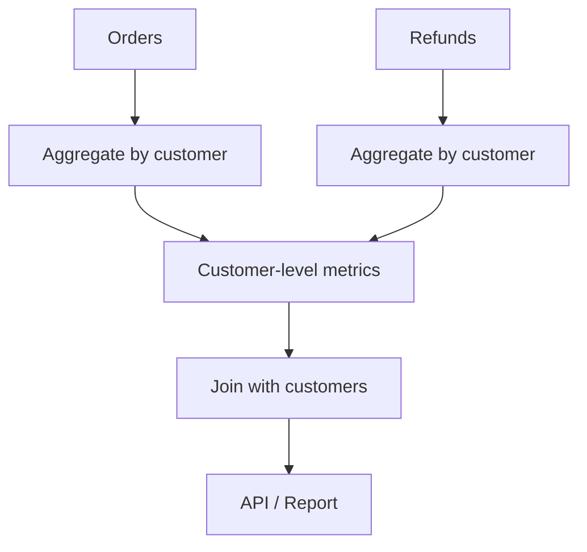
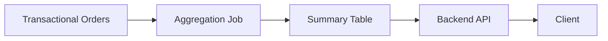

# 08- CTE with Aggregations

## Overview

Aggregations and CTEs work well together because a CTE can establish a clean **aggregation boundary** before the result is consumed by the rest of the query.

This is especially valuable when backend queries combine:

- Large transactional tables.
- One-to-many relationships.
- Multiple independent metrics.
- Time-based reporting.
- Customer, account, or tenant-level summaries.
- Aggregated data that must later be joined to operational entities.

A common production pattern is:

```text
Raw transactional data
        ↓
Filter relevant rows
        ↓
GROUP BY business grain
        ↓
Aggregated CTE
        ↓
JOIN / filter / rank / calculate
        ↓
API or reporting result
```

For example:

```sql
WITH customer_order_metrics AS (
    SELECT
        customer_id,
        COUNT(*) AS order_count,
        SUM(total_amount) AS total_spend,
        AVG(total_amount) AS average_order_value
    FROM orders
    WHERE status = 'completed'
    GROUP BY customer_id
)
SELECT
    c.id,
    c.email,
    COALESCE(m.order_count, 0) AS order_count,
    COALESCE(m.total_spend, 0) AS total_spend,
    COALESCE(m.average_order_value, 0) AS average_order_value
FROM customers AS c
LEFT JOIN customer_order_metrics AS m
    ON m.customer_id = c.id;
```

The CTE transforms an order-level dataset into a customer-level dataset before the join.

## Why Use CTEs with Aggregations?

An aggregation changes the **grain** of a relation.

For example:

```text
orders
1 row = 1 order
```

After:

```sql
GROUP BY customer_id
```

the result becomes:

```text
1 row = 1 customer
```

Making that transformation explicit is important when the result is subsequently joined to other datasets.

CTEs provide a named boundary for that transformation:

```text
orders
  ↓
customer_order_metrics
  ↓
customers JOIN metrics
```

This improves:

- Query readability.
- Cardinality reasoning.
- Metric correctness.
- Maintainability.
- Debugging.
- Separation of business logic.

## Basic Aggregation CTE

The basic structure is:

```sql
WITH aggregated_data AS (
    SELECT
        grouping_column,
        aggregate_function(value_column) AS metric
    FROM source_table
    WHERE conditions
    GROUP BY grouping_column
)
SELECT
    grouping_column,
    metric
FROM aggregated_data;
```

Example:

```sql
WITH product_sales AS (
    SELECT
        product_id,
        SUM(quantity) AS units_sold,
        SUM(quantity * unit_price) AS revenue
    FROM order_items
    WHERE created_at >= CURRENT_DATE - INTERVAL '30 days'
    GROUP BY product_id
)
SELECT
    product_id,
    units_sold,
    revenue
FROM product_sales;
```

The CTE is an intermediate relation containing one row per product.

## Aggregation Grain

Before writing an aggregated CTE, explicitly identify its intended grain.

| Dataset | Grain |
|---|---|
| `orders` | One row per order |
| `customer_order_metrics` | One row per customer |
| `monthly_customer_sales` | One row per customer per month |
| `category_sales` | One row per category |
| `daily_revenue` | One row per day |

The `GROUP BY` clause determines the grain.

For example:

```sql
GROUP BY customer_id
```

means:

```text
one row per customer
```

while:

```sql
GROUP BY customer_id, DATE_TRUNC('month', created_at)
```

means:

```text
one row per customer per month
```

Senior-level SQL work requires reasoning about this grain before reasoning about individual expressions.

## Multiple Aggregates in One CTE

A single CTE can calculate multiple metrics at the same grain.

```sql
WITH customer_metrics AS (
    SELECT
        customer_id,
        COUNT(*) AS order_count,
        SUM(total_amount) AS gross_revenue,
        AVG(total_amount) AS average_order_value,
        MIN(created_at) AS first_order_at,
        MAX(created_at) AS last_order_at
    FROM orders
    WHERE status = 'completed'
    GROUP BY customer_id
)
SELECT *
FROM customer_metrics;
```

This is useful when several metrics are derived from the same filtered dataset.

Advantages include:

- One logical filtering stage.
- One aggregation stage.
- Consistent metric definitions.
- Easier downstream joins.

Avoid splitting every individual metric into its own CTE when they can naturally be calculated from the same grouped dataset.

## Aggregation Before Joining

One of the most important production uses of aggregation CTEs is preventing **row multiplication**.

Suppose:

```text
customer
  ├── orders
  └── refunds
```

Both relationships are one-to-many.

A direct join can create:

```text
orders × refunds
```

for each customer.

Instead, aggregate independently:

```sql
WITH order_totals AS (
    SELECT
        customer_id,
        SUM(total_amount) AS order_total
    FROM orders
    GROUP BY customer_id
),
refund_totals AS (
    SELECT
        customer_id,
        SUM(amount) AS refund_total
    FROM refunds
    GROUP BY customer_id
)
SELECT
    c.id AS customer_id,
    COALESCE(o.order_total, 0) AS order_total,
    COALESCE(r.refund_total, 0) AS refund_total
FROM customers AS c
LEFT JOIN order_totals AS o
    ON o.customer_id = c.id
LEFT JOIN refund_totals AS r
    ON r.customer_id = c.id;
```

The data flow becomes:



Each CTE produces at most one row per customer, making the final joins predictable.

## Conditional Aggregation

CTEs are useful for centralizing conditional metrics.

```sql
WITH customer_metrics AS (
    SELECT
        customer_id,
        COUNT(*) AS total_orders,
        COUNT(*) FILTER (
            WHERE total_amount >= 1000
        ) AS high_value_orders,
        SUM(total_amount) FILTER (
            WHERE payment_status = 'paid'
        ) AS paid_revenue,
        SUM(total_amount) FILTER (
            WHERE payment_status = 'pending'
        ) AS pending_revenue
    FROM orders
    WHERE status <> 'cancelled'
    GROUP BY customer_id
)
SELECT
    customer_id,
    total_orders,
    high_value_orders,
    COALESCE(paid_revenue, 0) AS paid_revenue,
    COALESCE(pending_revenue, 0) AS pending_revenue
FROM customer_metrics;
```

This allows multiple business metrics to be calculated from the same scan where the database optimizer can do so efficiently.

For databases without `FILTER`, equivalent conditional aggregation can often be expressed using `CASE`.

```sql
SUM(
    CASE
        WHEN payment_status = 'paid' THEN total_amount
        ELSE 0
    END
) AS paid_revenue
```

## Aggregating with `CASE`

Conditional aggregation is useful for reporting and operational dashboards.

```sql
WITH customer_order_metrics AS (
    SELECT
        customer_id,
        COUNT(*) AS order_count,
        SUM(
            CASE
                WHEN status = 'completed' THEN total_amount
                ELSE 0
            END
        ) AS completed_revenue,
        COUNT(
            CASE
                WHEN status = 'cancelled' THEN 1
            END
        ) AS cancelled_orders
    FROM orders
    GROUP BY customer_id
)
SELECT
    customer_id,
    order_count,
    completed_revenue,
    cancelled_orders
FROM customer_order_metrics;
```

Be deliberate about `NULL` behavior and the difference between:

```sql
COUNT(*)
```

and:

```sql
COUNT(column)
```

`COUNT(*)` counts rows, while `COUNT(column)` ignores rows where that column is `NULL`.

## Aggregating Different Business States

Production systems often need metrics split by state.

```sql
WITH payment_metrics AS (
    SELECT
        merchant_id,
        COUNT(*) AS payment_attempts,
        COUNT(*) FILTER (
            WHERE status = 'captured'
        ) AS successful_payments,
        COUNT(*) FILTER (
            WHERE status = 'failed'
        ) AS failed_payments,
        SUM(amount) FILTER (
            WHERE status = 'captured'
        ) AS captured_amount
    FROM payments
    GROUP BY merchant_id
)
SELECT
    merchant_id,
    payment_attempts,
    successful_payments,
    failed_payments,
    COALESCE(captured_amount, 0) AS captured_amount
FROM payment_metrics;
```

This pattern is common in:

- Payment dashboards.
- Order monitoring.
- Job processing metrics.
- Subscription reporting.
- Operational admin panels.

## Aggregation by Time

CTEs can isolate time-based aggregation from downstream reporting logic.

```sql
WITH daily_revenue AS (
    SELECT
        DATE_TRUNC('day', created_at) AS revenue_date,
        SUM(total_amount) AS revenue,
        COUNT(*) AS order_count
    FROM orders
    WHERE status = 'completed'
      AND created_at >= CURRENT_DATE - INTERVAL '90 days'
    GROUP BY DATE_TRUNC('day', created_at)
)
SELECT
    revenue_date,
    revenue,
    order_count
FROM daily_revenue
ORDER BY revenue_date;
```

The CTE produces:

```text
one row per day
```

This can then be joined with a calendar table or used by another aggregation stage.

## Multiple Aggregation Levels

A query can aggregate in stages.

For example:

```text
orders
   ↓
daily customer revenue
   ↓
monthly customer revenue
```

```sql
WITH daily_customer_revenue AS (
    SELECT
        customer_id,
        DATE_TRUNC('day', created_at) AS revenue_day,
        SUM(total_amount) AS daily_revenue
    FROM orders
    WHERE status = 'completed'
    GROUP BY
        customer_id,
        DATE_TRUNC('day', created_at)
),
monthly_customer_revenue AS (
    SELECT
        customer_id,
        DATE_TRUNC('month', revenue_day) AS revenue_month,
        SUM(daily_revenue) AS monthly_revenue
    FROM daily_customer_revenue
    GROUP BY
        customer_id,
        DATE_TRUNC('month', revenue_day)
)
SELECT
    customer_id,
    revenue_month,
    monthly_revenue
FROM monthly_customer_revenue;
```

The first CTE has:

```text
customer + day
```

The second has:

```text
customer + month
```

This can be useful when the intermediate daily grain has independent business meaning or needs additional processing.

However, unnecessary multi-stage aggregation can add complexity. If the final result only needs monthly totals, aggregate directly when possible.

## Aggregation Followed by a Join

A common production pattern is:

```sql
WITH customer_spend AS (
    SELECT
        customer_id,
        SUM(total_amount) AS lifetime_spend
    FROM orders
    WHERE status = 'completed'
    GROUP BY customer_id
)
SELECT
    c.id,
    c.email,
    COALESCE(s.lifetime_spend, 0) AS lifetime_spend
FROM customers AS c
LEFT JOIN customer_spend AS s
    ON s.customer_id = c.id;
```

The important sequence is:

```text
orders
  ↓
GROUP BY customer_id
  ↓
customer_spend
  ↓
LEFT JOIN customers
```

This prevents the customer table from being joined against every individual order.

## Aggregation Followed by Filtering

If filtering depends on an aggregate, use `HAVING` inside the CTE.

```sql
WITH high_value_customers AS (
    SELECT
        customer_id,
        SUM(total_amount) AS lifetime_spend
    FROM orders
    WHERE status = 'completed'
    GROUP BY customer_id
    HAVING SUM(total_amount) >= 10000
)
SELECT
    c.id,
    c.email,
    h.lifetime_spend
FROM customers AS c
JOIN high_value_customers AS h
    ON h.customer_id = c.id;
```

The distinction is:

```sql
WHERE
```

filters rows **before aggregation**.

```sql
HAVING
```

filters groups **after aggregation**.

This difference directly affects both correctness and performance.

## Aggregation Followed by Window Functions

A CTE can create an aggregated dataset that is then processed using window functions.

```sql
WITH monthly_sales AS (
    SELECT
        customer_id,
        DATE_TRUNC('month', created_at) AS sales_month,
        SUM(total_amount) AS monthly_revenue
    FROM orders
    WHERE status = 'completed'
    GROUP BY
        customer_id,
        DATE_TRUNC('month', created_at)
)
SELECT
    customer_id,
    sales_month,
    monthly_revenue,
    SUM(monthly_revenue) OVER (
        PARTITION BY customer_id
        ORDER BY sales_month
    ) AS cumulative_revenue
FROM monthly_sales
ORDER BY customer_id, sales_month;
```

The CTE establishes the monthly grain first.

The window function then operates on:

```text
one row per customer per month
```

This separation is often much easier to reason about than attempting to mix raw order rows, grouped aggregates, and window functions in a single query.

## Aggregation Followed by Ranking

CTEs are useful for ranking aggregated business metrics.

```sql
WITH category_sales AS (
    SELECT
        category_id,
        SUM(quantity * unit_price) AS revenue
    FROM order_items
    WHERE created_at >= CURRENT_DATE - INTERVAL '30 days'
    GROUP BY category_id
)
SELECT
    category_id,
    revenue,
    RANK() OVER (
        ORDER BY revenue DESC
    ) AS revenue_rank
FROM category_sales;
```

The logical flow is:

```text
order_items
    ↓
aggregate by category
    ↓
category_sales
    ↓
rank categories
```

## `COUNT(DISTINCT ...)` in Aggregation CTEs

Distinct counts are common in backend analytics.

```sql
WITH product_metrics AS (
    SELECT
        product_id,
        COUNT(*) AS order_line_count,
        COUNT(DISTINCT order_id) AS unique_orders,
        COUNT(DISTINCT customer_id) AS unique_customers
    FROM order_items
    WHERE created_at >= CURRENT_DATE - INTERVAL '30 days'
    GROUP BY product_id
)
SELECT *
FROM product_metrics;
```

Be aware that:

```sql
COUNT(DISTINCT customer_id)
```

can be substantially more expensive than:

```sql
COUNT(*)
```

on large datasets because the database must account for distinct values.

For high-volume analytics, inspect execution plans and consider whether approximate or precomputed metrics are appropriate.

## Handling `NULL` in Aggregated Results

Aggregates can produce `NULL` depending on the expression and input rows.

For example:

```sql
SUM(amount)
```

can return `NULL` when there are no qualifying input rows.

When an API contract expects a numeric zero, normalize explicitly:

```sql
COALESCE(SUM(amount), 0)
```

After a `LEFT JOIN`, the entire aggregated row can also be absent:

```sql
COALESCE(m.total_spend, 0)
```

These are different situations:

```text
SUM(...) = NULL
```

versus:

```text
LEFT JOIN found no aggregated row
```

Both may require normalization at the application boundary, but the distinction matters when designing the query.

## Aggregating Before a `LEFT JOIN`

For customer-facing APIs, a `LEFT JOIN` is frequently combined with an aggregation CTE.

```sql
WITH order_metrics AS (
    SELECT
        customer_id,
        COUNT(*) AS order_count,
        SUM(total_amount) AS total_spend
    FROM orders
    WHERE status = 'completed'
    GROUP BY customer_id
)
SELECT
    c.id,
    c.email,
    COALESCE(m.order_count, 0) AS order_count,
    COALESCE(m.total_spend, 0) AS total_spend
FROM customers AS c
LEFT JOIN order_metrics AS m
    ON m.customer_id = c.id
WHERE c.id = %s;
```

This is preferable to returning one row per order and forcing the application to aggregate the data in Python.

Database aggregation is usually preferable when:

- The data is already stored in the database.
- Only aggregate results are required.
- Network transfer would otherwise be large.
- The aggregation can use indexes and database execution efficiently.

## Aggregation CTEs in Multi-Tenant Systems

In a multi-tenant backend, tenant boundaries should be part of the aggregation logic.

```sql
WITH tenant_sales AS (
    SELECT
        tenant_id,
        customer_id,
        SUM(total_amount) AS total_spend
    FROM orders
    WHERE tenant_id = %s
      AND status = 'completed'
    GROUP BY
        tenant_id,
        customer_id
)
SELECT
    customer_id,
    total_spend
FROM tenant_sales;
```

Do not rely solely on the application to filter tenant data after the aggregation.

Tenant isolation should be enforced consistently through:

- Query predicates.
- Database authorization mechanisms where applicable.
- Row-level security where appropriate.
- Application authorization.
- Parameterized queries.

For PostgreSQL row-level security, tenant-aware database policies can provide an additional isolation layer, but they should complement rather than replace correct application design.

## Performance Considerations

Aggregation can be expensive because the database may need to:

1. Scan qualifying rows.
2. Group them.
3. Build hash structures or sort data.
4. Calculate aggregate functions.
5. Produce the intermediate relation.
6. Join the result with other relations.

A query such as:

```sql
WITH customer_metrics AS (
    SELECT
        customer_id,
        SUM(total_amount) AS total_spend
    FROM orders
    GROUP BY customer_id
)
SELECT ...
```

may process a very large number of order rows even if the final API only needs one customer.

For a single-customer endpoint, push the selective predicate into the CTE when semantically correct:

```sql
WITH customer_metrics AS (
    SELECT
        customer_id,
        SUM(total_amount) AS total_spend
    FROM orders
    WHERE customer_id = %s
      AND status = 'completed'
    GROUP BY customer_id
)
SELECT
    customer_id,
    total_spend
FROM customer_metrics;
```

Reducing input cardinality before aggregation can have a major impact on latency.

## Predicate Pushdown

Filtering before aggregation is generally preferable when the predicate does not depend on the aggregate.

Prefer:

```sql
WITH customer_metrics AS (
    SELECT
        customer_id,
        SUM(total_amount) AS total_spend
    FROM orders
    WHERE status = 'completed'
    GROUP BY customer_id
)
SELECT *
FROM customer_metrics;
```

rather than aggregating all orders and filtering completed orders later.

The database optimizer may rewrite equivalent queries, but writing the intended relational logic clearly makes correctness and plan analysis easier.

## Indexing Considerations

Indexes should support the workload, not simply the existence of a CTE.

For:

```sql
WITH customer_metrics AS (
    SELECT
        customer_id,
        SUM(total_amount)
    FROM orders
    WHERE status = 'completed'
      AND created_at >= CURRENT_DATE - INTERVAL '30 days'
    GROUP BY customer_id
)
```

potentially relevant columns include:

```text
status
created_at
customer_id
```

The ideal index depends on:

- Predicate selectivity.
- Table size.
- Data distribution.
- Query frequency.
- Sort/grouping requirements.
- Database engine.
- Existing indexes.

For PostgreSQL, validate with:

```sql
EXPLAIN (
    ANALYZE,
    BUFFERS
)
WITH customer_metrics AS (
    SELECT
        customer_id,
        SUM(total_amount) AS total_spend
    FROM orders
    WHERE status = 'completed'
      AND created_at >= CURRENT_DATE - INTERVAL '30 days'
    GROUP BY customer_id
)
SELECT *
FROM customer_metrics;
```

Do not add indexes based only on intuition. Measure the actual workload.

## CTE Materialization and Aggregations

A CTE should not be assumed to behave as a permanently materialized temporary table.

Database engines may inline, optimize, or materialize CTEs depending on their rules and execution strategy.

In PostgreSQL, materialization can be influenced explicitly:

```sql
WITH customer_metrics AS MATERIALIZED (
    SELECT
        customer_id,
        SUM(total_amount) AS total_spend
    FROM orders
    GROUP BY customer_id
)
SELECT *
FROM customer_metrics;
```

or:

```sql
WITH customer_metrics AS NOT MATERIALIZED (
    SELECT
        customer_id,
        SUM(total_amount) AS total_spend
    FROM orders
    GROUP BY customer_id
)
SELECT *
FROM customer_metrics;
```

These are PostgreSQL-specific features and should not be treated as portable SQL.

Use explicit materialization only when the execution characteristics justify it. Validate with `EXPLAIN ANALYZE`.

## Aggregation and Large Datasets

For large transactional tables, aggregation can become a significant database workload.

Common strategies include:

| Strategy | When it helps |
|---|---|
| Filter early | Large portion of data is irrelevant |
| Aggregate at required grain | Downstream joins do not need raw rows |
| Appropriate indexes | Selective predicates reduce scans |
| Partitioning | Queries consistently filter on partition keys |
| Precomputed summaries | Same expensive metrics are requested frequently |
| Materialized views | Analytical results can tolerate refresh latency |
| Read replicas | Reporting workload can be separated from writes |
| Dedicated analytics system | Large analytical workloads exceed OLTP suitability |

Do not move every aggregation out of PostgreSQL automatically. First establish whether the workload is actually exceeding the database's intended operating envelope.

## Precomputed Aggregation

When an expensive aggregation is requested frequently, calculating it synchronously for every API request may be wasteful.

A production architecture might use:



For example:

```text
orders
    ↓
Celery / scheduled job
    ↓
customer_daily_metrics
    ↓
FastAPI / Django
    ↓
dashboard
```

This trades:

- Lower request latency.

for:

- Additional storage.
- Refresh complexity.
- Eventual consistency.
- Operational maintenance.

Use this approach when query cost and request frequency justify the additional architecture.

## Aggregation CTE vs Application-Level Aggregation

Avoid fetching raw rows into Python merely to perform an aggregation the database can efficiently perform.

Less efficient:

```python
orders = Order.objects.filter(
    status="completed",
    customer_id=customer_id,
)

total = sum(order.total_amount for order in orders)
```

This can transfer many rows from PostgreSQL to the application.

Prefer database-side aggregation:

```python
from django.db.models import Sum

total = (
    Order.objects
    .filter(
        status="completed",
        customer_id=customer_id,
    )
    .aggregate(total=Sum("total_amount"))
)["total"] or 0
```

For more complex reporting queries, a SQL CTE can provide the same database-side execution while keeping multiple transformations explicit.

## Production Considerations

### API Latency

Aggregation queries on large datasets can dominate API latency.

Monitor:

- Query execution time.
- p50 latency.
- p95 latency.
- p99 latency.
- Rows scanned.
- Rows returned.
- Temporary disk usage.
- Lock waits.

### Database Load

Repeated expensive aggregations can consume:

- CPU.
- Memory.
- I/O.
- Connection pool capacity.

A query that takes 500 ms may be acceptable for an occasional administrative report but problematic when executed hundreds of times per second.

### Read Replicas

Reporting queries can sometimes be routed to read replicas.

However, understand the consistency trade-off:

```text
Primary
  ↓ replication
Replica
  ↓
Reporting query
```

A recently committed transaction may not immediately be visible on the replica.

Do not use a replica for an endpoint that requires read-after-write consistency unless the architecture explicitly handles that requirement.

### Timeouts

Long-running aggregation queries should have appropriate database and application timeouts.

Timeouts prevent one pathological query from consuming resources indefinitely.

They do not replace query optimization.

## Common Mistakes

### Aggregating After a Multiplying Join

Bad:

```sql
SELECT
    c.id,
    SUM(o.total_amount),
    SUM(r.amount)
FROM customers AS c
LEFT JOIN orders AS o
    ON o.customer_id = c.id
LEFT JOIN refunds AS r
    ON r.customer_id = c.id
GROUP BY c.id;
```

Independent one-to-many relationships can multiply each other's rows.

**Fix:** aggregate each relationship independently before joining.

### Using `WHERE` Instead of `HAVING`

Incorrect when filtering on an aggregate:

```sql
WHERE SUM(total_amount) > 10000
```

Use:

```sql
HAVING SUM(total_amount) > 10000
```

### Ignoring `NULL`

An aggregate or `LEFT JOIN` can produce `NULL`.

Use `COALESCE` when the API or business semantics require zero:

```sql
COALESCE(total_spend, 0)
```

### Grouping at the Wrong Grain

This:

```sql
GROUP BY customer_id
```

cannot produce monthly customer metrics.

For monthly metrics:

```sql
GROUP BY
    customer_id,
    DATE_TRUNC('month', created_at)
```

Always identify the intended grain first.

### Aggregating Too Much Data

A global aggregation may scan millions of rows for a request that needs one customer.

Push selective predicates into the aggregation when possible.

### Assuming CTEs Automatically Improve Performance

A CTE improves organization, not necessarily execution time.

Use execution plans to determine whether it improves the actual workload.

### Returning Raw Data for Application Aggregation

Fetching thousands of rows into Django or FastAPI merely to calculate `SUM`, `COUNT`, or `AVG` increases:

- Database-to-application traffic.
- Application memory usage.
- Serialization cost.
- Request latency.

Prefer database-side aggregation when appropriate.

### Using Floating-Point Values for Money

Avoid application or database designs that represent monetary amounts with binary floating-point semantics.

Prefer an appropriate exact numeric representation such as PostgreSQL `numeric`/`decimal`, or integer minor units where that matches the domain.

## Interview Traps

### Does a CTE Aggregate Data?

No.

The CTE is the query structure. Aggregation happens because the CTE contains operations such as:

```sql
GROUP BY
SUM()
COUNT()
AVG()
MIN()
MAX()
```

### Why Aggregate Before Joining?

To establish the intended grain and avoid accidental row multiplication.

### What Determines the Grain of an Aggregated CTE?

Primarily the grouping expressions.

```sql
GROUP BY customer_id
```

produces customer-level groups.

```sql
GROUP BY customer_id, month
```

produces customer-month groups.

### Is `HAVING` Executed Before `GROUP BY`?

Conceptually, no.

`WHERE` filters input rows before grouping, while `HAVING` filters groups after aggregation.

The optimizer may transform execution internally, but the SQL semantics remain distinct.

### Are CTEs Always Materialized?

No.

Materialization behavior depends on the database engine and query plan. PostgreSQL can inline eligible CTEs and also provides `MATERIALIZED` and `NOT MATERIALIZED` controls in supported versions.

### Is Aggregation Always Faster in SQL Than Python?

Not universally, but database-side aggregation is usually preferable when the source data is already in the database and only the aggregate result is required.

The database can execute aggregation close to the data and avoid transferring all raw rows to the application.

## Production Checklist

Before shipping an aggregation CTE:

- [ ] Is the intended grain explicitly understood?
- [ ] Does the `GROUP BY` match that grain?
- [ ] Are independent one-to-many relationships aggregated separately?
- [ ] Are predicates applied before aggregation where appropriate?
- [ ] Is `HAVING` used for aggregate-dependent filtering?
- [ ] Are `NULL` and zero semantics intentional?
- [ ] Could `COUNT(DISTINCT ...)` become expensive at scale?
- [ ] Are only required columns selected?
- [ ] Are monetary values represented using appropriate exact types?
- [ ] Are tenant boundaries enforced before aggregation?
- [ ] Are indexes appropriate for the actual workload?
- [ ] Has `EXPLAIN (ANALYZE, BUFFERS)` been reviewed for PostgreSQL queries?
- [ ] Has the query been tested with production-scale cardinalities?
- [ ] Is synchronous execution appropriate for the API latency budget?
- [ ] Would a summary table or materialized view be more appropriate for repeated expensive metrics?
- [ ] Are replica consistency requirements understood if using read replicas?
- [ ] Are database and application timeouts configured appropriately?

## Key Takeaways

- **Use aggregation CTEs to establish a clear business grain before joining, filtering, ranking, or calculating additional metrics.**
- **Aggregate independent one-to-many relationships separately before joining them to prevent row multiplication and incorrect totals.**
- **Push selective filters into the aggregation when possible, and use `HAVING` when filtering depends on aggregate results.**
- **Treat aggregation performance as a workload problem: inspect cardinality, indexes, execution plans, database load, and API latency rather than assuming a CTE is faster.**
- **For frequently requested expensive metrics, consider precomputed summaries or materialized views when the consistency and operational trade-offs are acceptable.**