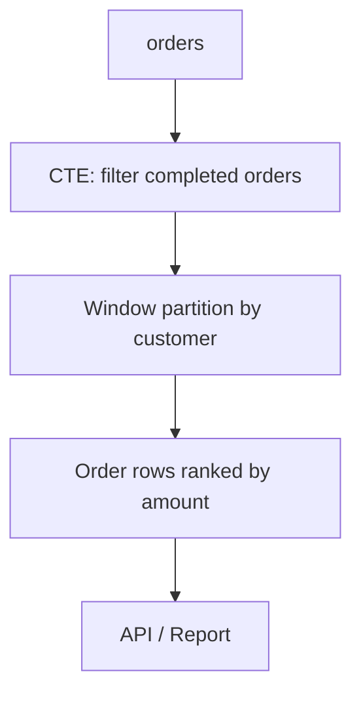

# 09- CTE with Window Functions

## Overview

A Common Table Expression (CTE) can provide a clean relational boundary before or after applying a window function. This is particularly useful when a query needs to:

- Aggregate raw rows before calculating rankings or running totals.
- Rank records within a business-defined partition.
- Compare a row with previous or subsequent rows.
- Calculate percentages or distributions.
- Identify the latest record per entity.
- Build multi-stage analytical queries without deeply nested subqueries.

The key idea is to separate **row reduction and shaping** from **row-wise analytical calculations**:

```text
Raw rows
   ↓
CTE: filter / join / aggregate
   ↓
Window function
   ↓
rank / compare / accumulate / calculate
   ↓
final filtering or presentation
```

A CTE does not make a window function faster by itself. Its primary value is making the relational stages explicit and giving each stage a well-defined grain.

## Why Combine CTEs and Window Functions?

Window functions operate across related rows while preserving individual rows in the result.

For example:

```sql
SELECT
    customer_id,
    order_id,
    total_amount,
    RANK() OVER (
        PARTITION BY customer_id
        ORDER BY total_amount DESC
    ) AS order_rank
FROM orders;
```

The query still returns one row per order.

A CTE becomes valuable when the input to the window function needs to be transformed first:

```sql
WITH customer_orders AS (
    SELECT
        customer_id,
        order_id,
        total_amount
    FROM orders
    WHERE status = 'completed'
)
SELECT
    customer_id,
    order_id,
    total_amount,
    RANK() OVER (
        PARTITION BY customer_id
        ORDER BY total_amount DESC
    ) AS order_rank
FROM customer_orders;
```

This separates:

1. Which rows belong in the analysis.
2. How those rows are partitioned and ordered.

That separation becomes increasingly useful as queries become more complex.

## CTE as the Input to a Window Function

The simplest pattern is:

```sql
WITH filtered_orders AS (
    SELECT
        id,
        customer_id,
        total_amount,
        created_at
    FROM orders
    WHERE status = 'completed'
)
SELECT
    id,
    customer_id,
    total_amount,
    RANK() OVER (
        PARTITION BY customer_id
        ORDER BY total_amount DESC
    ) AS customer_order_rank
FROM filtered_orders;
```

The CTE establishes the input dataset.

The window function then operates over that dataset.

Conceptually:



## `PARTITION BY` and `ORDER BY`

A window definition commonly contains:

```sql
function() OVER (
    PARTITION BY ...
    ORDER BY ...
)
```

`PARTITION BY` defines the independent groups over which the window calculation operates.

`ORDER BY` defines the logical order within each partition.

For example:

```sql
RANK() OVER (
    PARTITION BY customer_id
    ORDER BY total_amount DESC
)
```

means:

```text
For each customer:
    sort their orders by total_amount descending
    calculate the rank
```

Unlike `GROUP BY`, `PARTITION BY` does not collapse rows.

| Operation | Effect |
|---|---|
| `GROUP BY customer_id` | Produces one row per customer |
| `PARTITION BY customer_id` | Keeps individual rows while calculating over customer groups |
| `ORDER BY` in query | Controls final result ordering |
| `ORDER BY` inside `OVER` | Controls window calculation ordering |

Confusing these concepts is a common source of incorrect SQL.

## Ranking Aggregated Results

One of the most useful patterns is to aggregate first and rank second.

Suppose the requirement is:

> Rank customers by their total completed-order revenue.

Use:

```sql
WITH customer_revenue AS (
    SELECT
        customer_id,
        SUM(total_amount) AS total_revenue
    FROM orders
    WHERE status = 'completed'
    GROUP BY customer_id
)
SELECT
    customer_id,
    total_revenue,
    RANK() OVER (
        ORDER BY total_revenue DESC
    ) AS revenue_rank
FROM customer_revenue
ORDER BY revenue_rank;
```

The CTE changes the grain:

```text
orders
1 row = order

customer_revenue
1 row = customer
```

The window function then ranks customer-level rows.

This is much easier to reason about than attempting to rank raw order rows when the business metric is customer-level revenue.

## `ROW_NUMBER()`

`ROW_NUMBER()` assigns a unique sequential number within each partition.

```sql
WITH customer_orders AS (
    SELECT
        id,
        customer_id,
        total_amount,
        created_at
    FROM orders
    WHERE status = 'completed'
)
SELECT
    id,
    customer_id,
    total_amount,
    created_at,
    ROW_NUMBER() OVER (
        PARTITION BY customer_id
        ORDER BY created_at DESC, id DESC
    ) AS row_number
FROM customer_orders;
```

The `id` tie-breaker is important.

If multiple orders have the same `created_at`, ordering only by timestamp may not provide deterministic ordering.

### Selecting the Latest Row

A common production pattern is:

```sql
WITH ranked_orders AS (
    SELECT
        id,
        customer_id,
        total_amount,
        created_at,
        ROW_NUMBER() OVER (
            PARTITION BY customer_id
            ORDER BY created_at DESC, id DESC
        ) AS row_number
    FROM orders
)
SELECT
    id,
    customer_id,
    total_amount,
    created_at
FROM ranked_orders
WHERE row_number = 1;
```

This returns the latest order for each customer.

The pattern generalizes to:

- Latest payment.
- Latest status.
- Latest profile revision.
- Latest device record.
- Most recent event.
- Most recent configuration.

## `RANK()` vs `DENSE_RANK()` vs `ROW_NUMBER()`

These functions behave differently when values tie.

Suppose the values are:

```text
100
100
90
```

| Function | Result |
|---|---|
| `ROW_NUMBER()` | `1, 2, 3` |
| `RANK()` | `1, 1, 3` |
| `DENSE_RANK()` | `1, 1, 2` |

Example:

```sql
WITH product_sales AS (
    SELECT
        product_id,
        SUM(quantity) AS units_sold
    FROM order_items
    GROUP BY product_id
)
SELECT
    product_id,
    units_sold,
    ROW_NUMBER() OVER (
        ORDER BY units_sold DESC
    ) AS row_number,
    RANK() OVER (
        ORDER BY units_sold DESC
    ) AS rank,
    DENSE_RANK() OVER (
        ORDER BY units_sold DESC
    ) AS dense_rank
FROM product_sales;
```

Choose based on business semantics rather than preference.

## Filtering Window Function Results

A window function generally cannot be filtered directly in the same query block's `WHERE` clause because the logical processing order places `WHERE` before window-function evaluation.

This does not work:

```sql
SELECT
    customer_id,
    total_amount,
    ROW_NUMBER() OVER (
        PARTITION BY customer_id
        ORDER BY created_at DESC
    ) AS row_number
FROM orders
WHERE row_number = 1;
```

Instead, use a CTE:

```sql
WITH ranked_orders AS (
    SELECT
        id,
        customer_id,
        total_amount,
        created_at,
        ROW_NUMBER() OVER (
            PARTITION BY customer_id
            ORDER BY created_at DESC, id DESC
        ) AS row_number
    FROM orders
)
SELECT
    id,
    customer_id,
    total_amount,
    created_at
FROM ranked_orders
WHERE row_number = 1;
```

The stages become:

```text
FROM / WHERE
      ↓
window calculation
      ↓
CTE result
      ↓
WHERE row_number = 1
```

This is one of the most important practical reasons to combine CTEs and window functions.

## Top N per Group

The same pattern can select the top N records per group.

```sql
WITH ranked_products AS (
    SELECT
        category_id,
        product_id,
        revenue,
        ROW_NUMBER() OVER (
            PARTITION BY category_id
            ORDER BY revenue DESC, product_id
        ) AS position
    FROM category_product_revenue
)
SELECT
    category_id,
    product_id,
    revenue
FROM ranked_products
WHERE position <= 3
ORDER BY category_id, position;
```

This implements:

```text
top 3 products per category
```

The critical difference from:

```sql
LIMIT 3
```

is that `LIMIT` applies to the final result, whereas the window function ranks rows independently inside each category.

## Running Totals

CTEs can prepare the dataset before calculating cumulative metrics.

```sql
WITH daily_revenue AS (
    SELECT
        DATE_TRUNC('day', created_at) AS revenue_day,
        SUM(total_amount) AS revenue
    FROM orders
    WHERE status = 'completed'
    GROUP BY DATE_TRUNC('day', created_at)
)
SELECT
    revenue_day,
    revenue,
    SUM(revenue) OVER (
        ORDER BY revenue_day
        ROWS BETWEEN UNBOUNDED PRECEDING AND CURRENT ROW
    ) AS cumulative_revenue
FROM daily_revenue
ORDER BY revenue_day;
```

The CTE creates:

```text
one row per day
```

The window function calculates:

```text
running total across days
```

This staged approach is especially useful when the raw table contains many rows per day.

## Running Totals Per Entity

The same pattern can operate independently for each customer.

```sql
WITH daily_customer_revenue AS (
    SELECT
        customer_id,
        DATE_TRUNC('day', created_at) AS revenue_day,
        SUM(total_amount) AS daily_revenue
    FROM orders
    WHERE status = 'completed'
    GROUP BY
        customer_id,
        DATE_TRUNC('day', created_at)
)
SELECT
    customer_id,
    revenue_day,
    daily_revenue,
    SUM(daily_revenue) OVER (
        PARTITION BY customer_id
        ORDER BY revenue_day
        ROWS BETWEEN UNBOUNDED PRECEDING AND CURRENT ROW
    ) AS cumulative_revenue
FROM daily_customer_revenue
ORDER BY customer_id, revenue_day;
```

The CTE defines the customer-day grain.

The window function calculates the cumulative metric within each customer.

## `LAG()` and `LEAD()`

`LAG()` accesses a previous row, while `LEAD()` accesses a subsequent row according to the window ordering.

For example, calculate day-over-day revenue changes:

```sql
WITH daily_revenue AS (
    SELECT
        DATE_TRUNC('day', created_at) AS revenue_day,
        SUM(total_amount) AS revenue
    FROM orders
    WHERE status = 'completed'
    GROUP BY DATE_TRUNC('day', created_at)
)
SELECT
    revenue_day,
    revenue,
    LAG(revenue) OVER (
        ORDER BY revenue_day
    ) AS previous_day_revenue,
    revenue - LAG(revenue) OVER (
        ORDER BY revenue_day
    ) AS revenue_change
FROM daily_revenue
ORDER BY revenue_day;
```

This is useful for:

- Day-over-day metrics.
- State transitions.
- Event histories.
- Price changes.
- Account balances.
- Operational metrics.

## Avoid Repeating Window Expressions

If the same window expression is used repeatedly, an additional CTE can improve clarity.

Instead of:

```sql
SELECT
    revenue_day,
    revenue,
    revenue - LAG(revenue) OVER (
        ORDER BY revenue_day
    ) AS change,
    CASE
        WHEN revenue > LAG(revenue) OVER (
            ORDER BY revenue_day
        )
        THEN 'up'
        ELSE 'down'
    END AS trend
FROM daily_revenue;
```

use:

```sql
WITH revenue_with_previous AS (
    SELECT
        revenue_day,
        revenue,
        LAG(revenue) OVER (
            ORDER BY revenue_day
        ) AS previous_revenue
    FROM daily_revenue
)
SELECT
    revenue_day,
    revenue,
    previous_revenue,
    revenue - previous_revenue AS revenue_change,
    CASE
        WHEN previous_revenue IS NULL THEN 'new'
        WHEN revenue > previous_revenue THEN 'up'
        WHEN revenue < previous_revenue THEN 'down'
        ELSE 'flat'
    END AS trend
FROM revenue_with_previous;
```

This creates a clear analytical pipeline:

```text
daily revenue
     ↓
previous value
     ↓
difference / classification
```

## Percentage of Total

Window functions can calculate percentages without joining a separate total query.

```sql
WITH category_revenue AS (
    SELECT
        category_id,
        SUM(total_amount) AS revenue
    FROM orders
    WHERE status = 'completed'
    GROUP BY category_id
)
SELECT
    category_id,
    revenue,
    ROUND(
        100.0 * revenue / NULLIF(SUM(revenue) OVER (), 0),
        2
    ) AS revenue_percentage
FROM category_revenue
ORDER BY revenue DESC;
```

The CTE establishes category-level revenue.

The window function calculates the total revenue across those category rows.

`NULLIF` protects against division by zero.

## Percentage Within a Partition

The same pattern can calculate each product's percentage of its category revenue.

```sql
WITH product_revenue AS (
    SELECT
        category_id,
        product_id,
        SUM(quantity * unit_price) AS revenue
    FROM order_items
    GROUP BY
        category_id,
        product_id
)
SELECT
    category_id,
    product_id,
    revenue,
    ROUND(
        100.0 * revenue / NULLIF(
            SUM(revenue) OVER (
                PARTITION BY category_id
            ),
            0
        ),
        2
    ) AS category_revenue_percentage
FROM product_revenue;
```

This is a useful pattern for:

- Product contribution.
- Customer spending distribution.
- Regional revenue contribution.
- Service utilization.
- Resource allocation.

## Window Frames

The window `ORDER BY` determines ordering, while the frame controls which rows are included in certain window calculations.

For example:

```sql
SUM(revenue) OVER (
    ORDER BY revenue_day
    ROWS BETWEEN 6 PRECEDING AND CURRENT ROW
)
```

calculates a seven-row moving sum.

A production example:

```sql
WITH daily_revenue AS (
    SELECT
        DATE_TRUNC('day', created_at) AS revenue_day,
        SUM(total_amount) AS revenue
    FROM orders
    WHERE status = 'completed'
    GROUP BY DATE_TRUNC('day', created_at)
)
SELECT
    revenue_day,
    revenue,
    SUM(revenue) OVER (
        ORDER BY revenue_day
        ROWS BETWEEN 6 PRECEDING AND CURRENT ROW
    ) AS seven_day_revenue
FROM daily_revenue
ORDER BY revenue_day;
```

Be careful with the distinction between:

```sql
ROWS
```

and:

```sql
RANGE
```

They can behave differently when ordering values contain duplicates.

For time-series analytics, explicitly choosing the intended frame is often safer than relying on a database's default.

## Multiple Window Functions

A single CTE can feed multiple analytical calculations.

```sql
WITH customer_monthly_revenue AS (
    SELECT
        customer_id,
        DATE_TRUNC('month', created_at) AS revenue_month,
        SUM(total_amount) AS monthly_revenue
    FROM orders
    WHERE status = 'completed'
    GROUP BY
        customer_id,
        DATE_TRUNC('month', created_at)
)
SELECT
    customer_id,
    revenue_month,
    monthly_revenue,
    ROW_NUMBER() OVER (
        PARTITION BY customer_id
        ORDER BY revenue_month
    ) AS month_number,
    SUM(monthly_revenue) OVER (
        PARTITION BY customer_id
        ORDER BY revenue_month
        ROWS BETWEEN UNBOUNDED PRECEDING AND CURRENT ROW
    ) AS cumulative_revenue,
    LAG(monthly_revenue) OVER (
        PARTITION BY customer_id
        ORDER BY revenue_month
    ) AS previous_month_revenue
FROM customer_monthly_revenue;
```

The query now answers several related questions from the same customer-month dataset.

## Multiple CTEs and Window Functions

Complex reporting queries may use several explicit stages.

```sql
WITH customer_monthly_revenue AS (
    SELECT
        customer_id,
        DATE_TRUNC('month', created_at) AS revenue_month,
        SUM(total_amount) AS revenue
    FROM orders
    WHERE status = 'completed'
    GROUP BY
        customer_id,
        DATE_TRUNC('month', created_at)
),
customer_metrics AS (
    SELECT
        customer_id,
        revenue_month,
        revenue,
        SUM(revenue) OVER (
            PARTITION BY customer_id
            ORDER BY revenue_month
            ROWS BETWEEN UNBOUNDED PRECEDING AND CURRENT ROW
        ) AS lifetime_revenue
    FROM customer_monthly_revenue
)
SELECT
    customer_id,
    revenue_month,
    revenue,
    lifetime_revenue
FROM customer_metrics
ORDER BY customer_id, revenue_month;
```

Each stage has a specific responsibility:

```text
orders
  ↓
customer_monthly_revenue
  ↓
customer-month aggregation
  ↓
customer_metrics
  ↓
window calculations
  ↓
final result
```

This is often easier to maintain than a single deeply nested SQL expression.

## CTEs and Window Functions in Backend APIs

Suppose a Django or FastAPI endpoint needs:

> Return the top three products in every category for the last 30 days.

A database-side query can perform the entire operation:

```sql
WITH product_sales AS (
    SELECT
        p.category_id,
        oi.product_id,
        SUM(oi.quantity * oi.unit_price) AS revenue
    FROM order_items AS oi
    JOIN products AS p
        ON p.id = oi.product_id
    WHERE oi.created_at >= CURRENT_TIMESTAMP - INTERVAL '30 days'
    GROUP BY
        p.category_id,
        oi.product_id
),
ranked_products AS (
    SELECT
        category_id,
        product_id,
        revenue,
        ROW_NUMBER() OVER (
            PARTITION BY category_id
            ORDER BY revenue DESC, product_id
        ) AS position
    FROM product_sales
)
SELECT
    category_id,
    product_id,
    revenue
FROM ranked_products
WHERE position <= 3
ORDER BY category_id, position;
```

The application receives only the required rows instead of:

1. Fetching all order items.
2. Aggregating in Python.
3. Sorting in Python.
4. Selecting top products.
5. Serializing a large intermediate dataset.

This reduces application memory and network transfer while keeping the business computation close to the data.

## Performance Considerations

Window functions often require sorting or otherwise organizing rows according to the window's partition and ordering requirements.

For example:

```sql
ROW_NUMBER() OVER (
    PARTITION BY customer_id
    ORDER BY created_at DESC
)
```

may require the database to process rows grouped by `customer_id` and ordered by `created_at`.

Performance depends on:

- Number of input rows.
- Number and size of partitions.
- Window ordering.
- Filtering before the window operation.
- Aggregation performed before the window.
- Available indexes.
- Memory available to the query.
- Database execution strategy.

A useful optimization principle is:

> Reduce the dataset before expensive window operations whenever semantics allow it.

Prefer:

```sql
WITH recent_orders AS (
    SELECT
        id,
        customer_id,
        created_at,
        total_amount
    FROM orders
    WHERE created_at >= CURRENT_TIMESTAMP - INTERVAL '30 days'
)
SELECT
    *,
    ROW_NUMBER() OVER (
        PARTITION BY customer_id
        ORDER BY created_at DESC, id DESC
    ) AS position
FROM recent_orders;
```

over ranking the entire historical `orders` table and filtering the date afterward.

## Execution Plans

For PostgreSQL, inspect the actual plan for expensive production queries:

```sql
EXPLAIN (
    ANALYZE,
    BUFFERS
)
WITH ranked_orders AS (
    SELECT
        id,
        customer_id,
        total_amount,
        created_at,
        ROW_NUMBER() OVER (
            PARTITION BY customer_id
            ORDER BY created_at DESC, id DESC
        ) AS position
    FROM orders
    WHERE status = 'completed'
)
SELECT
    id,
    customer_id,
    total_amount
FROM ranked_orders
WHERE position = 1;
```

Look for:

- Large sequential scans.
- Expensive sorts.
- High row counts.
- Disk-based temporary operations.
- Unexpected joins.
- Poor selectivity.
- Significant buffer reads.
- Large differences between estimated and actual rows.

Do not optimize a CTE or window function in isolation. Optimize the complete execution plan.

## Indexing Considerations

An index can help filtering and, depending on the database and query shape, reduce work associated with ordering.

For:

```sql
WHERE customer_id = ?
ORDER BY created_at DESC
```

an index such as:

```sql
CREATE INDEX idx_orders_customer_created_at
ON orders (customer_id, created_at DESC);
```

may be useful.

For production systems, index design should consider:

- Query predicates.
- Window partition columns.
- Ordering columns.
- Selectivity.
- Write overhead.
- Storage.
- Existing indexes.

Do not assume that creating an index matching every column in a window definition guarantees a particular execution plan.

## Deterministic Ordering

Window functions such as `ROW_NUMBER()` depend on ordering.

Avoid:

```sql
ROW_NUMBER() OVER (
    PARTITION BY customer_id
    ORDER BY created_at DESC
)
```

when `created_at` is not unique and deterministic selection matters.

Prefer:

```sql
ROW_NUMBER() OVER (
    PARTITION BY customer_id
    ORDER BY created_at DESC, id DESC
)
```

The additional unique or effectively unique tie-breaker makes the result deterministic.

This matters for:

- Latest-row queries.
- Pagination.
- Leaderboards.
- Data exports.
- Reconciliation jobs.
- Tests.

## Pagination and Window Functions

Window functions can be useful for analytical pagination, but they should not automatically replace keyset pagination for large APIs.

For example:

```sql
WITH ranked_orders AS (
    SELECT
        id,
        customer_id,
        created_at,
        ROW_NUMBER() OVER (
            ORDER BY created_at DESC, id DESC
        ) AS position
    FROM orders
)
SELECT
    id,
    customer_id,
    created_at
FROM ranked_orders
WHERE position BETWEEN 10001 AND 10050;
```

This may require processing a large number of rows before returning the requested page.

For large operational APIs, keyset pagination is often preferable:

```sql
SELECT
    id,
    customer_id,
    created_at
FROM orders
WHERE (created_at, id) < (%s, %s)
ORDER BY created_at DESC, id DESC
LIMIT 50;
```

Window functions are better suited to analytical ranking than generic high-volume API pagination.

## CTE Materialization and Performance

Do not assume that every CTE creates a physical intermediate table.

Modern database optimizers can inline or otherwise transform CTEs depending on the engine and query.

PostgreSQL also provides explicit controls in supported versions:

```sql
WITH ranked_orders AS MATERIALIZED (
    SELECT ...
)
SELECT ...
FROM ranked_orders;
```

and:

```sql
WITH ranked_orders AS NOT MATERIALIZED (
    SELECT ...
)
SELECT ...
FROM ranked_orders;
```

Use these deliberately and validate with execution plans.

The existence of a CTE should not be treated as evidence that the query performs an intermediate disk write.

## Common Mistakes

### Filtering After the Window Unnecessarily

Bad:

```sql
SELECT
    *,
    ROW_NUMBER() OVER (
        PARTITION BY customer_id
        ORDER BY created_at DESC
    ) AS position
FROM orders
```

followed by filtering historical rows elsewhere when only recent orders are relevant.

Prefer filtering before the window calculation when semantically valid.

### Using `ROW_NUMBER()` When Ties Matter

`ROW_NUMBER()` forces unique positions.

If equal values should share a rank, use `RANK()` or `DENSE_RANK()`.

### Forgetting a Tie-Breaker

This:

```sql
ORDER BY created_at DESC
```

may not deterministically select one row when timestamps tie.

Use:

```sql
ORDER BY created_at DESC, id DESC
```

when deterministic behavior is required.

### Confusing `GROUP BY` and `PARTITION BY`

`GROUP BY` reduces rows.

`PARTITION BY` does not.

For example:

```sql
GROUP BY customer_id
```

produces customer-level rows.

Whereas:

```sql
RANK() OVER (PARTITION BY customer_id ...)
```

keeps the individual rows and calculates a value within each customer partition.

### Ranking Before Aggregating

If the business requirement is:

> Rank customers by total revenue.

Do not rank individual orders first.

Aggregate to customer grain, then rank:

```text
orders
  ↓
GROUP BY customer
  ↓
customer revenue
  ↓
RANK()
```

### Applying `LIMIT` Instead of Top-N Per Group

This:

```sql
ORDER BY revenue DESC
LIMIT 3
```

returns three rows globally.

For three rows per category, use:

```sql
ROW_NUMBER() OVER (
    PARTITION BY category_id
    ORDER BY revenue DESC
)
```

and filter the resulting position.

### Ignoring `NULL`

`LAG()` and `LEAD()` return `NULL` when there is no previous or subsequent row.

Handle the first or last row explicitly when the API contract requires a value.

### Overusing CTEs

CTEs should represent meaningful relational stages.

Avoid creating a CTE for every expression:

```text
CTE 1 → rename column
CTE 2 → calculate one expression
CTE 3 → calculate another expression
CTE 4 → window function
```

Excessive decomposition can make query flow harder to understand.

### Assuming a CTE Improves Performance

A CTE improves structure when used well, but performance depends on the optimizer and execution plan.

Always measure production-relevant queries.

## Security Considerations

Window functions and CTEs do not inherently introduce SQL injection vulnerabilities. The primary security risk remains unsafe construction of dynamic SQL.

Use parameterized queries:

```python
cursor.execute(
    """
    WITH ranked_orders AS (
        SELECT
            id,
            customer_id,
            created_at,
            ROW_NUMBER() OVER (
                PARTITION BY customer_id
                ORDER BY created_at DESC, id DESC
            ) AS position
        FROM orders
        WHERE customer_id = %s
    )
    SELECT
        id,
        customer_id,
        created_at
    FROM ranked_orders
    WHERE position = 1
    """,
    [customer_id],
)
```

Also ensure that authorization predicates are applied at the appropriate relational stage.

For multi-tenant applications:

```sql
WHERE tenant_id = %s
```

should constrain the dataset before analytical calculations when appropriate.

Otherwise, unauthorized rows can influence metrics even if they are removed from the final result.

## Operational Considerations

For production analytical queries, monitor:

- Execution duration.
- Rows scanned.
- Rows returned.
- Sort operations.
- Temporary file usage.
- Database CPU.
- Database memory pressure.
- Query frequency.
- Connection pool utilization.
- API latency.

A query may be correct but operationally unsuitable if it performs an expensive window calculation on millions of rows for every API request.

For frequently accessed metrics, consider:

- Precomputed summary tables.
- Materialized views.
- Scheduled aggregation jobs.
- Read replicas.
- Dedicated analytical systems.

The right choice depends on freshness requirements and workload characteristics.

## Interview Traps

### Does a Window Function Reduce Rows?

No.

Window functions calculate values across related rows while preserving the input rows.

### Why Use a CTE Before a Window Function?

To establish a clean input relation, often by filtering, joining, or aggregating first.

### Why Can't You Usually Use a Window Alias in `WHERE`?

Because the window calculation logically occurs after `WHERE` filtering in the query-processing model.

A CTE or another query layer creates a relation in which the window result can be filtered.

### How Do You Get the Latest Row per Customer?

A common portable pattern is:

```sql
WITH ranked AS (
    SELECT
        *,
        ROW_NUMBER() OVER (
            PARTITION BY customer_id
            ORDER BY created_at DESC, id DESC
        ) AS position
    FROM orders
)
SELECT *
FROM ranked
WHERE position = 1;
```

### What Is the Difference Between `RANK()` and `DENSE_RANK()`?

`RANK()` leaves gaps after ties.

`DENSE_RANK()` does not.

```text
Values:       100  100  90
RANK:           1    1   3
DENSE_RANK:     1    1   2
```

### Is a CTE Always Materialized?

No.

Materialization depends on the database engine and optimizer. PostgreSQL can inline eligible CTEs and supports explicit materialization controls.

## Practical Decision Guide

| Requirement | Recommended pattern |
|---|---|
| Latest row per entity | `ROW_NUMBER()` + CTE |
| Top N per group | `ROW_NUMBER()` + CTE |
| Ranking with ties | `RANK()` or `DENSE_RANK()` |
| Running total | `SUM() OVER (...)` |
| Previous value | `LAG()` |
| Next value | `LEAD()` |
| Aggregate then rank | Aggregation CTE + window function |
| Percentage of total | Aggregate CTE + window `SUM()` |
| Moving metric | Window frame |
| Complex analytical pipeline | Multiple CTEs + window functions |
| Large API pagination | Prefer keyset pagination over window-based row offsets |

## Production Checklist

Before shipping a query that combines CTEs and window functions:

- [ ] Is the input grain explicitly understood?
- [ ] Is filtering performed before the window operation when appropriate?
- [ ] Is the correct window function selected?
- [ ] Are `PARTITION BY` and `ORDER BY` aligned with the business requirement?
- [ ] Is ordering deterministic where row selection matters?
- [ ] Are ties handled intentionally?
- [ ] Is the window frame explicitly defined when default semantics are insufficient?
- [ ] Are `NULL` results from `LAG()` or `LEAD()` handled correctly?
- [ ] Has the query been tested with production-scale data?
- [ ] Has `EXPLAIN (ANALYZE, BUFFERS)` been reviewed for PostgreSQL?
- [ ] Are sort and temporary-storage costs acceptable?
- [ ] Are indexes supporting the actual filtering and ordering workload?
- [ ] Are tenant and authorization predicates applied before sensitive metrics are calculated?
- [ ] Is the query suitable for synchronous API execution?
- [ ] Would a precomputed summary or materialized view be more appropriate?

## Key Takeaways

- **Use CTEs to establish a clean relational stage before applying window functions, especially when filtering or aggregation must happen first.**
- **Choose `ROW_NUMBER()`, `RANK()`, or `DENSE_RANK()` according to the required tie semantics, and add deterministic tie-breakers when selecting specific rows.**
- **Use CTEs to filter window results, implement top-N-per-group queries, latest-row selection, running totals, and multi-stage analytical calculations.**
- **Reduce the input dataset before expensive window operations when possible, and validate performance with real execution plans and production-scale cardinalities.**
- **Treat CTEs as query-organization tools rather than automatic performance optimizations; materialization and execution behavior depend on the database engine and optimizer.**