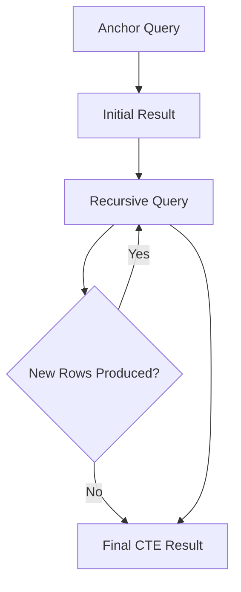
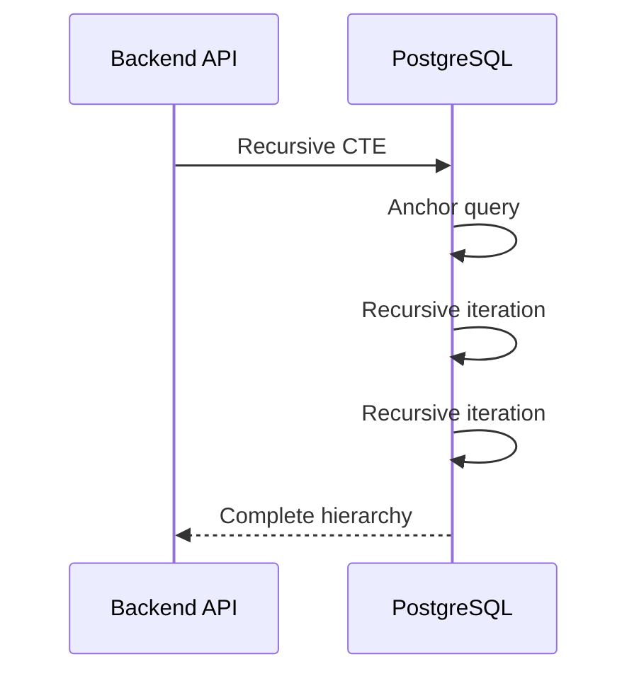

# 11- Recursive CTEs

## Overview

A recursive Common Table Expression (CTE) is a CTE that repeatedly evaluates a query against the rows produced by previous iterations. It is designed for data with a recursive relationship, such as trees, organizational hierarchies, dependency graphs, category structures, and graph-like traversal problems.

A recursive CTE typically contains two parts:

- **Anchor query** — produces the initial rows.
- **Recursive query** — references the CTE and produces the next level of rows.

The database repeatedly evaluates the recursive term until it produces no additional rows or another termination condition stops the recursion.

Recursive CTEs are particularly valuable when hierarchical traversal needs to remain inside the database rather than being implemented as repeated application-level queries.

> Recursive CTE syntax and behavior vary across database engines. The examples in this document use PostgreSQL syntax unless stated otherwise.

## Why Recursive CTEs Exist

Relational tables naturally represent relationships between rows, but hierarchical relationships are often recursive.

For example:

```text
Company
└── Engineering
    ├── Backend
    │   ├── Payments
    │   └── Orders
    └── Platform
        ├── Infrastructure
        └── Observability
```

A traditional self-join can retrieve a fixed number of levels:

```sql
SELECT ...
FROM employees e
JOIN employees manager
    ON e.manager_id = manager.id;
```

But this becomes awkward when the hierarchy depth is unknown.

A recursive CTE allows the query to express:

```text
start at root
    ↓
find children
    ↓
find grandchildren
    ↓
find deeper descendants
    ↓
stop when no more rows exist
```

This makes recursive CTEs appropriate for variable-depth relationships.

## Recursive CTE Structure

The general PostgreSQL form is:

```sql
WITH RECURSIVE cte_name AS (
    -- Anchor member
    SELECT ...

    UNION ALL

    -- Recursive member
    SELECT ...
    FROM some_table
    JOIN cte_name
        ON ...
)
SELECT *
FROM cte_name;
```

The two components have different responsibilities.

| Component | Purpose |
|---|---|
| Anchor query | Establishes the starting rows |
| Recursive query | Finds the next level |
| `UNION ALL` | Combines results from iterations |
| Recursive reference | References the CTE from the recursive query |
| Final query | Consumes the complete result |

The recursive reference is what makes the CTE recursive:

```sql
FROM employees AS e
JOIN employee_tree AS t
    ON e.manager_id = t.employee_id
```

Here, `employee_tree` references itself through the recursive term.

## How Recursive Evaluation Works

Consider this hierarchy:

```text
1: Engineering
├── 2: Backend
│   ├── 4: Payments
│   └── 5: Orders
└── 3: Platform
    └── 6: Infrastructure
```

The database conceptually evaluates it in iterations:

```text
Iteration 0
Engineering
    ↓
Iteration 1
Backend
Platform
    ↓
Iteration 2
Payments
Orders
Infrastructure
    ↓
Iteration 3
No additional children
    ↓
Stop
```

A simplified execution model is:



The exact physical execution strategy is database-engine-specific, but the logical model is important for understanding termination and performance.

## Basic Hierarchy Example

Consider an employee table:

```sql
CREATE TABLE employees (
    id BIGINT PRIMARY KEY,
    name TEXT NOT NULL,
    manager_id BIGINT REFERENCES employees(id)
);
```

A recursive CTE can retrieve an employee's entire management hierarchy.

```sql
WITH RECURSIVE management_chain AS (
    SELECT
        id,
        name,
        manager_id,
        0 AS depth
    FROM employees
    WHERE id = 42

    UNION ALL

    SELECT
        e.id,
        e.name,
        e.manager_id,
        mc.depth + 1
    FROM employees AS e
    JOIN management_chain AS mc
        ON e.id = mc.manager_id
)
SELECT
    id,
    name,
    manager_id,
    depth
FROM management_chain
ORDER BY depth;
```

The anchor starts at employee `42`.

The recursive term then finds that employee's manager, followed by the manager's manager, until no manager remains.

## Traversing Downward

Recursive CTEs can also traverse descendants.

```sql
WITH RECURSIVE employee_tree AS (
    SELECT
        id,
        name,
        manager_id,
        0 AS depth
    FROM employees
    WHERE id = 10

    UNION ALL

    SELECT
        e.id,
        e.name,
        e.manager_id,
        et.depth + 1
    FROM employees AS e
    JOIN employee_tree AS et
        ON e.manager_id = et.id
)
SELECT
    id,
    name,
    depth
FROM employee_tree
ORDER BY depth, id;
```

The relationship is reversed compared with the management-chain query:

```text
Parent
  ↓
children
  ↓
grandchildren
  ↓
deeper descendants
```

The recursive join determines the traversal direction.

## Anchor Member

The anchor query establishes where recursion begins.

```sql
SELECT
    id,
    name,
    manager_id,
    0 AS depth
FROM employees
WHERE id = 10
```

The anchor can return:

- One row.
- Multiple rows.
- A filtered set.
- Rows from joins.
- A predefined set of roots.

For example, traverse multiple root categories:

```sql
WITH RECURSIVE category_tree AS (
    SELECT
        id,
        name,
        parent_id,
        0 AS depth
    FROM categories
    WHERE parent_id IS NULL

    UNION ALL

    SELECT
        c.id,
        c.name,
        c.parent_id,
        ct.depth + 1
    FROM categories AS c
    JOIN category_tree AS ct
        ON c.parent_id = ct.id
)
SELECT *
FROM category_tree;
```

The recursion begins with every root category.

## Recursive Member

The recursive member defines how the traversal progresses.

```sql
SELECT
    c.id,
    c.name,
    c.parent_id,
    ct.depth + 1
FROM categories AS c
JOIN category_tree AS ct
    ON c.parent_id = ct.id
```

The recursive member should have the same column structure as the anchor query.

For example:

```text
Anchor:
id, name, parent_id, depth

Recursive:
id, name, parent_id, depth
```

The data types must also be compatible.

## `UNION ALL` vs `UNION`

Recursive queries commonly use:

```sql
UNION ALL
```

because recursive evaluation is generally designed around accumulating rows from each iteration.

`UNION` introduces duplicate elimination.

```sql
WITH RECURSIVE ...
SELECT ...
UNION
SELECT ...
```

Duplicate elimination can be useful for some graph traversal problems, but it changes both semantics and performance characteristics.

For tree structures where each node has one parent and cycles are impossible, `UNION ALL` is normally the straightforward choice.

For graphs, duplicate handling requires more careful design. `UNION` alone should not be treated as a universal cycle-detection mechanism.

## Tracking Depth

A depth column is one of the most useful additions to a recursive CTE.

```sql
WITH RECURSIVE category_tree AS (
    SELECT
        id,
        name,
        parent_id,
        0 AS depth
    FROM categories
    WHERE id = 100

    UNION ALL

    SELECT
        c.id,
        c.name,
        c.parent_id,
        ct.depth + 1
    FROM categories AS c
    JOIN category_tree AS ct
        ON c.parent_id = ct.id
)
SELECT *
FROM category_tree
ORDER BY depth, id;
```

Depth can be used for:

- Limiting traversal.
- Displaying hierarchy levels.
- Debugging.
- Authorization rules.
- Aggregation.
- Building nested application responses.

## Limiting Recursion Depth

A maximum depth is often a useful safety boundary.

```sql
WITH RECURSIVE category_tree AS (
    SELECT
        id,
        name,
        parent_id,
        0 AS depth
    FROM categories
    WHERE id = 100

    UNION ALL

    SELECT
        c.id,
        c.name,
        c.parent_id,
        ct.depth + 1
    FROM categories AS c
    JOIN category_tree AS ct
        ON c.parent_id = ct.id
    WHERE ct.depth < 10
)
SELECT *
FROM category_tree;
```

This protects the query from traversing unexpectedly deep structures.

A depth limit is not a substitute for cycle handling. A cyclic graph can still repeatedly generate rows until the depth limit is reached.

## Building a Materialized Path

A recursive CTE can construct the path from the root to each node.

```sql
WITH RECURSIVE category_tree AS (
    SELECT
        id,
        name,
        parent_id,
        ARRAY[id] AS path,
        0 AS depth
    FROM categories
    WHERE id = 100

    UNION ALL

    SELECT
        c.id,
        c.name,
        c.parent_id,
        ct.path || c.id,
        ct.depth + 1
    FROM categories AS c
    JOIN category_tree AS ct
        ON c.parent_id = ct.id
)
SELECT
    id,
    name,
    path,
    depth
FROM category_tree
ORDER BY path;
```

For a hierarchy:

```text
100
└── 110
    └── 125
```

the paths can become:

```text
{100}
{100,110}
{100,110,125}
```

This is useful for:

- Hierarchical sorting.
- Breadcrumb generation.
- Tree reconstruction.
- Ancestor relationships.
- Deterministic traversal ordering.

## Building a Human-Readable Path

The same concept can be implemented using text:

```sql
WITH RECURSIVE category_tree AS (
    SELECT
        id,
        name,
        parent_id,
        name::text AS path
    FROM categories
    WHERE id = 100

    UNION ALL

    SELECT
        c.id,
        c.name,
        c.parent_id,
        ct.path || ' > ' || c.name
    FROM categories AS c
    JOIN category_tree AS ct
        ON c.parent_id = ct.id
)
SELECT
    id,
    name,
    path
FROM category_tree;
```

This can produce:

```text
Electronics
Electronics > Computers
Electronics > Computers > Laptops
```

For large hierarchies, avoid building unnecessarily large strings when the path is not required by the consumer.

## Cycle Detection

Recursive queries become significantly more difficult when the data represents a graph rather than a strict tree.

Consider:

```text
A → B
B → C
C → A
```

A naive recursive query can repeatedly traverse:

```text
A
B
C
A
B
C
...
```

Cycle detection is therefore critical when data integrity does not guarantee an acyclic structure.

One PostgreSQL approach is to track visited IDs.

```sql
WITH RECURSIVE graph_walk AS (
    SELECT
        id,
        parent_id,
        ARRAY[id] AS visited
    FROM graph_nodes
    WHERE id = 1

    UNION ALL

    SELECT
        n.id,
        n.parent_id,
        gw.visited || n.id
    FROM graph_nodes AS n
    JOIN graph_walk AS gw
        ON n.id = gw.parent_id
    WHERE NOT n.id = ANY(gw.visited)
)
SELECT *
FROM graph_walk;
```

The condition:

```sql
WHERE NOT n.id = ANY(gw.visited)
```

prevents a node already present in the current path from being traversed again.

For complex graphs, cycle detection may require tracking an entire traversal state rather than only node IDs.

## SQL Standard `SEARCH` and `CYCLE`

Modern PostgreSQL versions support SQL-standard recursive-query features such as `SEARCH` and `CYCLE`.

A cycle-aware traversal can be expressed using:

```sql
WITH RECURSIVE employee_tree(id, name, manager_id) AS (
    SELECT
        id,
        name,
        manager_id
    FROM employees
    WHERE id = 10

    UNION ALL

    SELECT
        e.id,
        e.name,
        e.manager_id
    FROM employees AS e
    JOIN employee_tree AS et
        ON e.manager_id = et.id
)
CYCLE id SET is_cycle USING path
SELECT
    id,
    name,
    manager_id,
    is_cycle,
    path
FROM employee_tree;
```

This is cleaner than manually maintaining a visited array when the database version supports it.

Always verify the exact syntax and behavior for the database version being deployed.

## Recursive CTEs for Organizational Hierarchies

A common backend use case is retrieving all employees under a manager.

```sql
WITH RECURSIVE organization AS (
    SELECT
        id,
        name,
        manager_id,
        0 AS depth
    FROM employees
    WHERE id = $1

    UNION ALL

    SELECT
        e.id,
        e.name,
        e.manager_id,
        o.depth + 1
    FROM employees AS e
    JOIN organization AS o
        ON e.manager_id = o.id
)
SELECT
    id,
    name,
    manager_id,
    depth
FROM organization
ORDER BY depth, id;
```

A REST API could use this to implement:

```text
GET /managers/{manager_id}/employees
```

The application receives one result set rather than issuing one query per hierarchy level.

## Recursive CTEs for Categories

E-commerce systems frequently model categories as:

```text
Electronics
├── Computers
│   ├── Laptops
│   └── Desktops
└── Phones
    ├── Smartphones
    └── Accessories
```

A recursive CTE can retrieve every descendant category:

```sql
WITH RECURSIVE descendants AS (
    SELECT
        id,
        name,
        parent_id,
        0 AS depth
    FROM categories
    WHERE id = $1

    UNION ALL

    SELECT
        c.id,
        c.name,
        c.parent_id,
        d.depth + 1
    FROM categories AS c
    JOIN descendants AS d
        ON c.parent_id = d.id
)
SELECT
    id,
    name,
    parent_id,
    depth
FROM descendants
ORDER BY depth, id;
```

The API can then use the resulting IDs to retrieve products:

```sql
SELECT
    p.id,
    p.name,
    p.category_id
FROM products AS p
WHERE p.category_id IN (
    SELECT id
    FROM descendants
);
```

Alternatively, the category traversal and product join can be composed into one query.

## Recursive CTEs for Bill of Materials

Manufacturing systems often represent component relationships recursively:

```text
Product A
├── Component B
│   ├── Component D
│   └── Component E
└── Component C
```

A recursive CTE can calculate all required components:

```sql
WITH RECURSIVE components AS (
    SELECT
        component_id,
        quantity,
        1 AS depth
    FROM product_components
    WHERE product_id = $1

    UNION ALL

    SELECT
        pc.component_id,
        c.quantity * pc.quantity,
        c.depth + 1
    FROM product_components AS pc
    JOIN components AS c
        ON pc.product_id = c.component_id
)
SELECT
    component_id,
    SUM(quantity) AS total_quantity
FROM components
GROUP BY component_id;
```

This is a powerful example because the recursive term propagates calculated state.

The quantity required at each level depends on the quantity of the parent component.

## Recursive CTEs for Dependency Graphs

Build systems, package managers, infrastructure systems, and workflow engines can contain dependency relationships.

For example:

```text
Service A
├── Library B
│   └── Library D
└── Library C
    └── Library D
```

A recursive CTE can discover transitive dependencies:

```sql
WITH RECURSIVE dependencies AS (
    SELECT
        dependency_id,
        1 AS depth
    FROM service_dependencies
    WHERE service_id = $1

    UNION ALL

    SELECT
        sd.dependency_id,
        d.depth + 1
    FROM service_dependencies AS sd
    JOIN dependencies AS d
        ON sd.service_id = d.dependency_id
)
SELECT DISTINCT
    dependency_id
FROM dependencies;
```

Because graphs can have multiple paths to the same node, duplicate handling and cycle detection become much more important than they are in simple trees.

## Recursive CTEs vs Application-Level Recursion

Without a recursive CTE, application code might repeatedly query:

```text
Application
    ↓
SELECT children
    ↓
SELECT grandchildren
    ↓
SELECT great-grandchildren
    ↓
...
```

This can result in an N+1-style traversal problem.

A recursive CTE moves traversal into the database:



Advantages include:

- Fewer network round trips.
- Centralized relational traversal.
- Better control over transactional consistency.
- Less application memory usage.
- Easier composition with other SQL operations.

Limitations include:

- More database CPU.
- Potentially expensive execution plans.
- More difficult SQL debugging.
- Database-specific syntax.
- Risk of runaway recursion.
- Potentially large result sets.

## Recursive CTEs and ORM Usage

Django and many other ORMs do not expose every recursive SQL capability through their standard query APIs.

For example, a simple hierarchy lookup may be straightforward:

```python
employees = Employee.objects.filter(manager_id=manager_id)
```

But arbitrarily deep traversal generally requires recursive SQL or a hierarchy-specific data model.

For Django applications, options include:

- Raw SQL.
- Database-specific query extensions.
- A hierarchy-oriented package.
- A different schema model such as materialized paths or closure tables.

If using raw SQL:

```python
from django.db import connection

with connection.cursor() as cursor:
    cursor.execute(
        """
        WITH RECURSIVE organization AS (
            SELECT id, name, manager_id, 0 AS depth
            FROM employees
            WHERE id = %s

            UNION ALL

            SELECT e.id, e.name, e.manager_id, o.depth + 1
            FROM employees AS e
            JOIN organization AS o
                ON e.manager_id = o.id
        )
        SELECT id, name, manager_id, depth
        FROM organization
        ORDER BY depth, id
        """,
        [manager_id],
    )
    rows = cursor.fetchall()
```

Keep database-specific recursive SQL isolated and integration-tested.

## Performance Considerations

Recursive queries can become expensive because the amount of work can grow rapidly with:

- Tree depth.
- Number of children per node.
- Number of paths in a graph.
- Duplicate paths.
- Cycle handling.
- Result-set size.

For a tree with branching factor `b` and depth `d`, the number of traversed nodes can grow approximately with:

```text
1 + b + b² + ... + bᵈ
```

Even moderate depth can therefore produce a large result.

### Index the Traversal Key

For downward traversal:

```sql
JOIN employee_tree AS t
    ON e.manager_id = t.id
```

an index on:

```sql
CREATE INDEX idx_employees_manager_id
ON employees (manager_id);
```

is often important.

For upward traversal:

```sql
JOIN employee_tree AS t
    ON e.id = t.manager_id
```

the primary key on `id` generally supports the lookup.

Always verify with the actual execution plan.

### Restrict the Starting Set

A recursive query beginning from every root can produce a large amount of work:

```sql
WHERE parent_id IS NULL
```

If the API needs only one subtree, start from the requested node.

### Limit Depth

When business requirements allow it:

```sql
WHERE tree.depth < 20
```

can prevent unexpectedly deep traversal.

### Avoid Unnecessary Columns

Recursive CTE state is carried across iterations.

Avoid carrying large columns such as:

- Large JSON documents.
- Binary payloads.
- Long text fields.
- Unneeded metadata.

Carry identifiers and traversal state first, then join additional data after traversal when appropriate.

## Execution Plan Analysis

Use:

```sql
EXPLAIN
```

to inspect the plan.

For controlled testing:

```sql
EXPLAIN (ANALYZE, BUFFERS)
WITH RECURSIVE ...
SELECT ...;
```

Inspect:

- Rows produced per iteration.
- Join strategy.
- Index usage.
- Buffer reads.
- Total execution time.
- Unexpected row multiplication.

Recursive plans should be evaluated using realistic hierarchy sizes rather than small development fixtures.

## Recursive CTEs and Materialization

CTE materialization behavior depends on the database and query shape.

In PostgreSQL, ordinary non-recursive CTEs may be inlined or materialized depending on the optimizer and query. Recursive CTEs have different execution semantics because their result is generated iteratively.

Do not make assumptions such as:

```text
CTE = always materialized
```

or:

```text
CTE = always optimized away
```

unless the database documentation and execution plan establish that behavior.

## Data Integrity

Recursive CTEs are significantly easier to operate when the schema enforces the expected hierarchy rules.

For example:

```sql
CREATE TABLE categories (
    id BIGINT PRIMARY KEY,
    name TEXT NOT NULL,
    parent_id BIGINT REFERENCES categories(id)
);
```

This prevents references to nonexistent parents.

However, a foreign key does **not** prevent cycles.

This structure remains technically valid:

```text
A → B
B → C
C → A
```

If cycles are invalid for the domain, enforce that invariant through application logic, database constraints where feasible, controlled mutation procedures, or validation jobs.

## Security Considerations

Recursive queries can expose more data than expected if authorization is applied only after traversal.

For multi-tenant systems, include tenant boundaries in the traversal:

```sql
WITH RECURSIVE organization AS (
    SELECT
        id,
        name,
        manager_id,
        tenant_id,
        0 AS depth
    FROM employees
    WHERE id = $1
      AND tenant_id = $2

    UNION ALL

    SELECT
        e.id,
        e.name,
        e.manager_id,
        e.tenant_id,
        o.depth + 1
    FROM employees AS e
    JOIN organization AS o
        ON e.manager_id = o.id
       AND e.tenant_id = o.tenant_id
)
SELECT
    id,
    name,
    manager_id,
    depth
FROM organization;
```

The recursive relationship itself should not allow traversal across tenant boundaries.

Also:

- Parameterize input values.
- Avoid dynamically interpolated SQL.
- Limit traversal depth where appropriate.
- Apply authorization before returning the final result.
- Avoid exposing unrestricted graph traversal endpoints.

## Operational Considerations

Recursive CTEs are database-intensive operations and should be treated as production queries, not merely application helper logic.

Monitor:

- Query latency.
- Database CPU.
- Rows returned.
- Lock duration where writes are involved.
- Buffer/cache behavior.
- Connection pool utilization.
- Query frequency.
- Replication impact if the query is part of a write workflow.

For APIs, enforce practical limits.

For example:

```text
GET /categories/{id}/descendants
```

should not necessarily allow arbitrary traversal across an unbounded graph.

For large hierarchies, consider whether the query should execute synchronously or be moved to a background workflow.

## Alternative Hierarchy Models

Recursive CTEs are powerful, but they are not always the best long-term data model.

| Model | Read subtree | Move subtree | Write complexity | Best suited for |
|---|---|---|---|---|
| Adjacency list | Recursive query | Simple | Low | General hierarchies |
| Materialized path | Fast path queries | Can be expensive | Medium | Read-heavy trees |
| Closure table | Very fast ancestor/descendant queries | More maintenance | High | Complex hierarchy queries |
| Nested sets | Fast subtree reads | Expensive structural changes | High | Mostly-static trees |
| Graph database | Strong graph traversal | Specialized | Specialized | Complex graph relationships |

The adjacency-list model:

```text
id
parent_id
```

is usually the simplest starting point.

Recursive CTEs make it significantly more capable than a naive application-level traversal.

## Common Mistakes

### Forgetting `WITH RECURSIVE`

A self-referencing CTE requires recursive syntax in databases such as PostgreSQL:

```sql
WITH RECURSIVE tree AS (...)
```

### Omitting a Termination Condition

A recursive query needs a natural stopping condition:

```sql
JOIN tree ...
```

should eventually produce no new rows.

For graphs, explicit cycle handling is often required.

### Assuming a Foreign Key Prevents Cycles

A foreign key guarantees referential integrity, not acyclicity.

```text
A → B → C → A
```

can still satisfy foreign-key constraints.

### Using `UNION` as a Complete Cycle Solution

Duplicate elimination and cycle detection are different concerns.

A graph may contain repeated nodes through different paths while still requiring path-aware traversal semantics.

### Returning the Entire Hierarchy Unbounded

A production API should not blindly expose an entire potentially massive graph.

Use:

- Depth limits.
- Tenant filters.
- Pagination where applicable.
- Result limits.
- Appropriate authorization.

### Carrying Excessive State

Path arrays and large text paths can become expensive as depth increases.

Carry only the state required by the traversal.

### Ignoring Indexes

A recursive join repeatedly accesses the hierarchy table.

An index on the parent/child traversal key can have a major impact.

### Assuming Recursive CTEs Are Always Faster

Moving recursion into SQL reduces network round trips, but the database still has to perform the traversal.

A poorly indexed recursive query can be slower than an appropriately modeled alternative.

### Ignoring Cycles in Production Data

A hierarchy that is logically a tree today may become cyclic after a future schema or application change.

If acyclicity matters, explicitly protect that invariant.

## Interview Traps

### What Are the Two Parts of a Recursive CTE?

The **anchor member** establishes the initial rows, while the **recursive member** uses those rows to generate subsequent levels.

### Why Is `WITH RECURSIVE` Needed?

It tells the database that the CTE is allowed to reference itself recursively.

### Can Recursive CTEs Traverse Graphs?

Yes, but graph traversal is more complex than tree traversal because graphs can contain cycles and multiple paths to the same node.

### How Do You Prevent Infinite Recursion?

Use an appropriate termination condition and, for graphs or potentially corrupted hierarchies, explicit cycle detection such as visited-node tracking or database-supported `CYCLE` semantics.

### Why Add a Depth Column?

It provides traversal state that can be used for ordering, display, debugging, authorization rules, and depth limits.

### Does a Recursive CTE Eliminate N+1 Problems?

It can eliminate application-level repeated queries for hierarchical traversal, but it does not eliminate the underlying computational work. That work is moved into the database.

### When Should You Avoid Recursive CTEs?

Consider alternatives when:

- Hierarchies are extremely large.
- Traversals are extremely frequent.
- The data model requires complex graph algorithms.
- Precomputed hierarchy relationships are more efficient.
- A dedicated graph or hierarchy representation is more appropriate.

## Production Checklist

Before deploying a recursive CTE:

- [ ] Confirm recursive CTE support and syntax for the target database.
- [ ] Define a clear anchor query.
- [ ] Verify the recursive join direction.
- [ ] Ensure the recursion has a valid termination condition.
- [ ] Add cycle detection when the data can form graphs or corrupted hierarchies.
- [ ] Add a reasonable maximum depth when business requirements permit it.
- [ ] Index the columns used for recursive traversal.
- [ ] Restrict the starting set as much as possible.
- [ ] Carry only required columns through recursive iterations.
- [ ] Apply tenant boundaries inside the traversal.
- [ ] Parameterize all application inputs.
- [ ] Test with realistic hierarchy depth and branching factors.
- [ ] Inspect execution plans.
- [ ] Measure database CPU and query latency.
- [ ] Limit API result sizes.
- [ ] Consider precomputed hierarchy models for read-heavy workloads.
- [ ] Add integration tests for cycles and malformed relationships.
- [ ] Document database-specific behavior.

## Key Takeaways

- **Recursive CTEs combine an anchor query and a recursive query to traverse variable-depth hierarchical or graph data inside the database.**
- **The recursive join defines traversal direction, while explicit depth and termination controls make production behavior predictable.**
- **Trees are comparatively straightforward; graphs require deliberate duplicate handling and cycle detection to avoid runaway recursion.**
- **Index traversal keys, restrict the starting set, minimize recursive state, and test against realistic hierarchy sizes because recursive work can grow rapidly.**
- **Recursive CTEs are excellent for relational hierarchy traversal, but materialized paths, closure tables, or specialized graph models may be better for extremely read-heavy or complex graph workloads.**