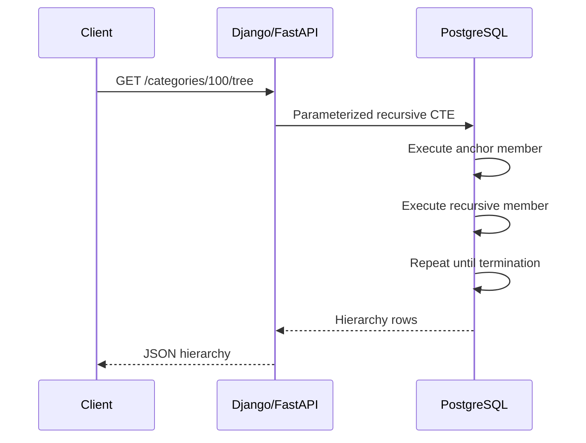

# 12- Recursive CTE Structure

## Overview

A recursive Common Table Expression (CTE) extends the normal CTE model with a self-referencing query. It is designed for problems where the number of traversal steps is not known in advance, such as organizational hierarchies, category trees, dependency graphs, and parent-child relationships.

The core structure consists of two query components:

- **Anchor member** — establishes the initial result set.
- **Recursive member** — references the CTE and generates the next level.

The database repeatedly evaluates the recursive member against rows produced by previous iterations until the recursive term produces no more rows or an explicit boundary stops traversal.

A recursive CTE therefore represents a traversal algorithm declaratively inside SQL:

```text
Starting rows
     ↓
Recursive relationship
     ↓
Next level
     ↓
Recursive relationship
     ↓
Next level
     ↓
No more rows
```

The exact execution implementation is database-specific, but the logical structure is broadly consistent across SQL systems that support recursive CTEs.

## Basic Syntax

The PostgreSQL form is:

```sql
WITH RECURSIVE cte_name AS (
    -- Anchor member
    SELECT ...

    UNION ALL

    -- Recursive member
    SELECT ...
    FROM ...
    JOIN cte_name
        ON ...
)
SELECT *
FROM cte_name;
```

The important structural rule is that the recursive member references the CTE defined by the `WITH RECURSIVE` clause.

A useful mental model is:

```text
WITH RECURSIVE
       │
       ├── Anchor query
       │      ↓
       │   Initial rows
       │
       ├── UNION ALL
       │      ↓
       │   Recursive query
       │      ↓
       │   More rows
       │      ↓
       │   Repeat
       │
       └── Final SELECT
```

## Anchor Member

The anchor member defines the initial state of the traversal.

Example:

```sql
SELECT
    id,
    name,
    manager_id,
    0 AS depth
FROM employees
WHERE id = 100;
```

This query might return:

| id | name | manager_id | depth |
|---:|---|---:|---:|
| 100 | Alice | NULL | 0 |

The value `0` establishes the starting depth.

The anchor can return:

- One row.
- Multiple rows.
- All hierarchy roots.
- A filtered subset.
- Rows generated from another query.

For example, all organizational roots:

```sql
SELECT
    id,
    name,
    manager_id,
    0 AS depth
FROM employees
WHERE manager_id IS NULL;
```

The choice of anchor determines the scope of the entire traversal.

## Recursive Member

The recursive member defines how the traversal moves from one level to the next.

```sql
SELECT
    e.id,
    e.name,
    e.manager_id,
    tree.depth + 1 AS depth
FROM employees AS e
JOIN employee_tree AS tree
    ON e.manager_id = tree.id;
```

The important relationship is:

```sql
e.manager_id = tree.id
```

It means:

> Find employees whose manager is one of the employees already discovered.

This produces the next hierarchy level.

The recursive member must return the same logical columns as the anchor.

```text
Anchor:
id, name, manager_id, depth

Recursive:
id, name, manager_id, depth
```

The corresponding data types must also be compatible.

## Complete Example

Consider:

```sql
CREATE TABLE employees (
    id BIGINT PRIMARY KEY,
    name TEXT NOT NULL,
    manager_id BIGINT REFERENCES employees(id)
);
```

A recursive CTE can retrieve an entire organization beneath a manager:

```sql
WITH RECURSIVE employee_tree AS (
    SELECT
        id,
        name,
        manager_id,
        0 AS depth
    FROM employees
    WHERE id = $1

    UNION ALL

    SELECT
        e.id,
        e.name,
        e.manager_id,
        tree.depth + 1
    FROM employees AS e
    JOIN employee_tree AS tree
        ON e.manager_id = tree.id
)
SELECT
    id,
    name,
    manager_id,
    depth
FROM employee_tree
ORDER BY depth, id;
```

If the hierarchy is:

```text
Alice
├── Bob
│   ├── David
│   └── Emma
└── Carol
    └── Frank
```

the traversal conceptually produces:

```text
Depth 0: Alice
Depth 1: Bob, Carol
Depth 2: David, Emma, Frank
Depth 3: no rows
```

## Column Alignment

The anchor and recursive member must produce compatible result structures.

Valid:

```sql
WITH RECURSIVE tree AS (
    SELECT
        id,
        name,
        0 AS depth
    FROM categories
    WHERE id = 1

    UNION ALL

    SELECT
        c.id,
        c.name,
        tree.depth + 1
    FROM categories AS c
    JOIN tree
        ON c.parent_id = tree.id
)
SELECT *
FROM tree;
```

Both sides return:

```text
id
name
depth
```

A mismatch causes an error:

```sql
WITH RECURSIVE tree AS (
    SELECT id, name
    FROM categories
    WHERE id = 1

    UNION ALL

    SELECT id, name, parent_id
    FROM categories
)
SELECT *
FROM tree;
```

The number of columns differs between the two query branches.

For production SQL, explicitly naming the recursive CTE columns can make the contract clearer:

```sql
WITH RECURSIVE tree (id, name, depth) AS (
    SELECT
        id,
        name,
        0
    FROM categories
    WHERE id = $1

    UNION ALL

    SELECT
        c.id,
        c.name,
        tree.depth + 1
    FROM categories AS c
    JOIN tree
        ON c.parent_id = tree.id
)
SELECT *
FROM tree;
```

## `UNION ALL` Is the Normal Structure

Recursive CTEs commonly use:

```sql
UNION ALL
```

because each iteration contributes another set of rows.

```sql
WITH RECURSIVE tree AS (
    SELECT ...

    UNION ALL

    SELECT ...
    FROM tree
)
SELECT ...
FROM tree;
```

`UNION` performs duplicate elimination and can have different semantics and performance characteristics.

For a strict tree where every node has one parent, `UNION ALL` is normally the natural choice.

For graph traversal, however, duplicate handling and cycle detection require explicit consideration.

Do not assume that replacing `UNION ALL` with `UNION` is equivalent to proper cycle detection.

## Logical Evaluation Model

The recursive CTE can be understood using a working-set model.

Suppose:

```text
A
├── B
│   └── D
└── C
```

The logical evaluation is:

```text
Anchor
  ↓
{A}
  ↓
Recursive iteration
  ↓
{B, C}
  ↓
Recursive iteration
  ↓
{D}
  ↓
Recursive iteration
  ↓
{}
  ↓
Stop
```

A more formal representation is:

```text
Working set = Anchor rows

while Working set is not empty:
    generate next rows using recursive member
    add next rows to recursive result
    Working set = next rows

return accumulated result
```

This is a logical model rather than a description of the exact physical execution plan.

## Traversal Direction

The recursive join determines whether the query moves upward or downward.

### Downward Traversal

To find descendants:

```sql
JOIN employee_tree AS tree
    ON e.manager_id = tree.id
```

The query starts with a manager and finds employees below that manager.

```text
Manager
  ↓
Direct reports
  ↓
Their reports
  ↓
Deeper descendants
```

### Upward Traversal

To find ancestors:

```sql
JOIN employee_tree AS tree
    ON e.id = tree.manager_id
```

The query starts with an employee and follows their manager chain.

```text
Employee
  ↓
Manager
  ↓
Manager's manager
  ↓
Organization root
```

The table does not need to change. Only the recursive relationship changes.

## Depth as Recursive State

Recursive CTEs can carry state between iterations.

The most common state variable is depth:

```sql
WITH RECURSIVE category_tree AS (
    SELECT
        id,
        name,
        parent_id,
        0 AS depth
    FROM categories
    WHERE id = $1

    UNION ALL

    SELECT
        c.id,
        c.name,
        c.parent_id,
        tree.depth + 1
    FROM categories AS c
    JOIN category_tree AS tree
        ON c.parent_id = tree.id
)
SELECT *
FROM category_tree;
```

The recursive term does not merely retrieve the next row. It also transforms state:

```text
depth = previous depth + 1
```

This pattern can be extended to other state:

- Path.
- Accumulated quantity.
- Root identifier.
- Traversal sequence.
- Authorization scope.
- Cost.
- Aggregated values.

## Depth Limits

A depth limit can be incorporated into the recursive member:

```sql
WITH RECURSIVE category_tree AS (
    SELECT
        id,
        name,
        parent_id,
        0 AS depth
    FROM categories
    WHERE id = $1

    UNION ALL

    SELECT
        c.id,
        c.name,
        c.parent_id,
        tree.depth + 1
    FROM categories AS c
    JOIN category_tree AS tree
        ON c.parent_id = tree.id
    WHERE tree.depth < 20
)
SELECT *
FROM category_tree;
```

This allows levels `0` through `20` to participate in traversal, with no additional level generated after that condition fails.

Depth limits are useful for:

- Protecting APIs.
- Bounding query work.
- Handling malformed data.
- Enforcing business rules.
- Preventing unexpectedly deep traversals.

A depth limit does **not** replace cycle detection. A cycle can still consume every permitted level.

## Carrying a Path

A recursive CTE can maintain the path taken to reach each row.

PostgreSQL example:

```sql
WITH RECURSIVE category_tree AS (
    SELECT
        id,
        name,
        parent_id,
        ARRAY[id] AS path
    FROM categories
    WHERE id = $1

    UNION ALL

    SELECT
        c.id,
        c.name,
        c.parent_id,
        tree.path || c.id
    FROM categories AS c
    JOIN category_tree AS tree
        ON c.parent_id = tree.id
)
SELECT
    id,
    name,
    parent_id,
    path
FROM category_tree;
```

For:

```text
1
└── 2
    └── 5
```

the paths are:

```text
{1}
{1,2}
{1,2,5}
```

Path state is useful for:

- Cycle detection.
- Breadcrumbs.
- Hierarchical ordering.
- Debugging.
- Reconstructing trees.

However, paths increase memory and row size as depth increases.

## Cycle Detection

Recursive CTEs need special treatment when relationships can form cycles.

Consider:

```text
A → B
B → C
C → A
```

Without protection, traversal can repeatedly produce:

```text
A
B
C
A
B
C
...
```

One PostgreSQL approach is to maintain visited nodes:

```sql
WITH RECURSIVE graph_walk AS (
    SELECT
        id,
        parent_id,
        ARRAY[id] AS visited
    FROM graph_nodes
    WHERE id = $1

    UNION ALL

    SELECT
        n.id,
        n.parent_id,
        walk.visited || n.id
    FROM graph_nodes AS n
    JOIN graph_walk AS walk
        ON n.id = walk.parent_id
    WHERE NOT n.id = ANY(walk.visited)
)
SELECT *
FROM graph_walk;
```

The recursive term refuses to follow an edge to a node already present in the current traversal path.

For databases supporting SQL-standard `CYCLE` syntax, that feature can provide a cleaner database-native mechanism.

## Multiple Anchor Rows

A recursive CTE does not require a single starting row.

For example:

```sql
WITH RECURSIVE organization AS (
    SELECT
        id,
        name,
        manager_id,
        0 AS depth
    FROM employees
    WHERE manager_id IS NULL

    UNION ALL

    SELECT
        e.id,
        e.name,
        e.manager_id,
        organization.depth + 1
    FROM employees AS e
    JOIN organization
        ON e.manager_id = organization.id
)
SELECT *
FROM organization;
```

The anchor creates every root.

The recursive member then expands all roots simultaneously.

This is useful for constructing a complete organizational tree, but it can produce substantially more work than starting from a single requested root.

## Multiple Recursive Relationships

Some domains have more than one relationship that can produce the next row.

For example, a dependency graph may contain multiple dependency types:

```text
Service A
├── Runtime dependency → B
└── Build dependency → C
```

The recursive member can normalize those relationships before traversal:

```sql
WITH RECURSIVE dependencies AS (
    SELECT
        dependency_id,
        1 AS depth
    FROM service_dependencies
    WHERE service_id = $1

    UNION ALL

    SELECT
        sd.dependency_id,
        dependencies.depth + 1
    FROM service_dependencies AS sd
    JOIN dependencies
        ON sd.service_id = dependencies.dependency_id
)
SELECT *
FROM dependencies;
```

For more complex graph models, the recursive state should explicitly represent the information required to determine valid next transitions.

## Recursive CTEs with Additional CTEs

A recursive CTE can participate in a larger CTE pipeline.

```sql
WITH RECURSIVE employee_tree AS (
    SELECT
        id,
        name,
        manager_id,
        0 AS depth
    FROM employees
    WHERE id = $1

    UNION ALL

    SELECT
        e.id,
        e.name,
        e.manager_id,
        tree.depth + 1
    FROM employees AS e
    JOIN employee_tree AS tree
        ON e.manager_id = tree.id
),
employee_stats AS (
    SELECT
        COUNT(*) AS employee_count,
        MAX(depth) AS max_depth
    FROM employee_tree
)
SELECT
    employee_count,
    max_depth
FROM employee_stats;
```

This separates responsibilities:

```text
Recursive CTE
    ↓
Hierarchy traversal
    ↓
Non-recursive CTE
    ↓
Aggregation
    ↓
Final result
```

This structure is useful when traversal and reporting logic should remain clearly separated.

## Recursive CTEs with Aggregation

Aggregation can be performed after traversal.

```sql
WITH RECURSIVE organization AS (
    SELECT
        id,
        manager_id,
        0 AS depth
    FROM employees
    WHERE id = $1

    UNION ALL

    SELECT
        e.id,
        e.manager_id,
        organization.depth + 1
    FROM employees AS e
    JOIN organization
        ON e.manager_id = organization.id
)
SELECT
    MAX(depth) AS hierarchy_depth,
    COUNT(*) AS employee_count
FROM organization;
```

This is generally easier to reason about than mixing aggregation into the recursive step unless the aggregate itself is part of the recursive state.

## Recursive CTEs with Ordering

Recursive result generation and final output ordering are separate concerns.

For example:

```sql
WITH RECURSIVE category_tree AS (
    SELECT
        id,
        name,
        parent_id,
        ARRAY[id] AS path
    FROM categories
    WHERE id = $1

    UNION ALL

    SELECT
        c.id,
        c.name,
        c.parent_id,
        tree.path || c.id
    FROM categories AS c
    JOIN category_tree AS tree
        ON c.parent_id = tree.id
)
SELECT
    id,
    name,
    parent_id
FROM category_tree
ORDER BY path;
```

Using a path for ordering can produce deterministic hierarchical output.

Do not rely on the physical order in which recursive rows happen to be produced.

## Recursive CTE Execution in a Backend API

A typical request might look like:



The important architectural property is that traversal happens in one database operation rather than requiring the application to issue one query per hierarchy level.

This reduces network round trips and keeps the traversal transactionally close to the relational data.

## Performance Implications of the Structure

The recursive member can execute many times conceptually, so its joins must be efficient.

For downward traversal:

```sql
JOIN employee_tree AS tree
    ON e.manager_id = tree.id
```

an index such as:

```sql
CREATE INDEX idx_employees_manager_id
ON employees (manager_id);
```

is usually important.

The primary key on `id` supports the opposite lookup when following parent references.

Performance depends heavily on:

- Number of starting rows.
- Tree depth.
- Branching factor.
- Number of duplicate paths.
- Cycle handling.
- Recursive join selectivity.
- Amount of state carried between iterations.
- Size of the final result.

A query that works well for 1,000 nodes may behave very differently for a hierarchy containing millions of rows.

## Recursive CTE Structure vs Fixed-Level Joins

A fixed-level hierarchy can sometimes be expressed using ordinary joins:

```sql
SELECT
    employee.id,
    manager.id AS manager_id,
    director.id AS director_id
FROM employees AS employee
LEFT JOIN employees AS manager
    ON employee.manager_id = manager.id
LEFT JOIN employees AS director
    ON manager.manager_id = director.id;
```

This is appropriate when the hierarchy depth is known and fixed.

Recursive CTEs are preferable when:

```text
depth is unknown
```

or:

```text
depth can change
```

| Requirement | Fixed self-joins | Recursive CTE |
|---|---|---|
| Known depth | Excellent | Works |
| Arbitrary depth | Poor | Excellent |
| Simple query | Often simpler | More complex |
| Graph traversal | Limited | Suitable with safeguards |
| Dynamic hierarchy | Poor | Good |
| Predictable fixed schema | Good | Often unnecessary |

Do not use recursion merely because the data happens to have a parent-child relationship. Use it when variable-depth traversal is actually required.

## Production Design Guidelines

A production recursive CTE should have clearly defined boundaries.

### Keep the Anchor Narrow

Prefer:

```sql
WHERE id = $1
```

over traversing every root when the API needs only one subtree.

### Index Traversal Columns

For adjacency-list models, commonly index:

```sql
parent_id
```

or:

```sql
manager_id
```

depending on the relationship.

### Carry Minimal State

Avoid recursively carrying large fields:

```text
large JSON
large TEXT
binary data
```

unless the recursive operation actually needs them.

Retrieve additional data after traversal when possible.

### Add Safety Boundaries

Use:

- Maximum depth.
- Maximum result size where applicable.
- Cycle detection.
- Tenant constraints.
- Authorization boundaries.

### Test Realistic Shapes

Test with:

- Shallow wide trees.
- Deep narrow trees.
- Large balanced trees.
- Multiple roots.
- Duplicate graph paths.
- Cyclic or malformed data.

Recursive-query performance is highly sensitive to data shape.

## Common Structural Mistakes

### Missing `RECURSIVE`

Incorrect:

```sql
WITH employee_tree AS (
    SELECT ...
    UNION ALL
    SELECT ...
    FROM employee_tree
)
SELECT *
FROM employee_tree;
```

Correct:

```sql
WITH RECURSIVE employee_tree AS (
    SELECT ...
    UNION ALL
    SELECT ...
    FROM employee_tree
)
SELECT *
FROM employee_tree;
```

### Incorrect Recursive Join

If the intended traversal is downward:

```sql
ON e.manager_id = tree.id
```

is fundamentally different from:

```sql
ON e.id = tree.manager_id
```

The first follows children; the second follows parents.

### Incompatible Columns

The anchor and recursive member must return compatible columns.

Incorrect:

```sql
SELECT id, name, 0
UNION ALL
SELECT id, name
```

Correct:

```sql
SELECT id, name, 0
UNION ALL
SELECT id, name, tree.depth + 1
```

### No Termination Boundary

A recursive relationship that continually generates rows can cause excessive resource consumption.

Always understand why the recursive member eventually stops producing rows.

### Assuming Foreign Keys Prevent Cycles

A foreign key guarantees that referenced rows exist. It does not guarantee that the graph is acyclic.

### Carrying Too Much State

Recursive state increases the size of intermediate results.

Keep the recursive projection intentionally small.

### Relying on Implicit Row Order

Recursive traversal order should not be assumed.

If deterministic output matters, construct an explicit ordering key such as a path.

## Interview Traps

### What Are the Two Main Components?

The **anchor member** produces the initial rows. The **recursive member** references the CTE and generates subsequent rows.

### Why Does the Anchor Not Reference the CTE?

The anchor establishes the initial state. Only the recursive member needs the previously generated rows.

### What Makes a CTE Recursive?

The recursive member contains a reference to the CTE being defined.

### What Determines Traversal Direction?

The join condition in the recursive member determines whether the query follows parents, children, or another graph relationship.

### Why Track Depth?

Depth provides recursive state that can be used for limiting traversal, ordering, debugging, authorization, and hierarchical presentation.

### Does `UNION` Automatically Solve Cycles?

No. Duplicate elimination and cycle detection are separate concepts.

### Can the Anchor Return Multiple Rows?

Yes. Every anchor row can independently seed recursive traversal.

### Why Can Recursive Queries Become Expensive?

Each discovered row can produce additional rows in subsequent iterations. Wide trees and graphs can therefore cause the result and intermediate work to grow rapidly.

## Key Takeaways

- **A recursive CTE has an anchor member that establishes initial rows and a recursive member that generates subsequent levels.**
- **The recursive join defines the traversal direction, while compatible column definitions provide the state carried between iterations.**
- **Depth, path, and other state can be carried through recursion to control, order, debug, or enrich traversal.**
- **Production recursive CTEs need explicit termination boundaries, appropriate indexes, minimal recursive state, and cycle protection where graphs are possible.**
- **Recursive CTEs are most valuable for variable-depth traversal; fixed-depth relationships are often simpler and more predictable with ordinary joins.**