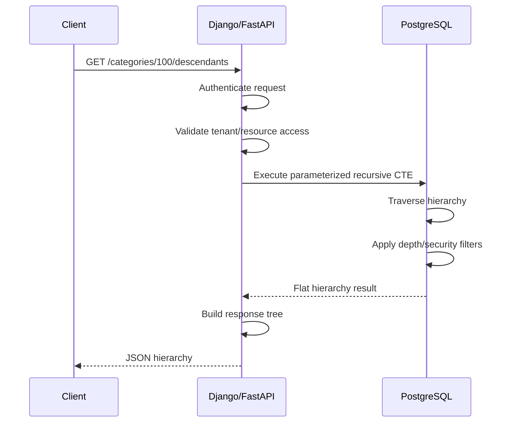

# 13- Recursive CTE Use Cases

## Overview

Recursive Common Table Expressions (CTEs) are most valuable when relational data represents a structure that must be traversed across an unknown or variable number of levels.

Typical backend use cases include:

- Organizational hierarchies.
- Product and category trees.
- Folder and file hierarchies.
- Bill of materials.
- Dependency graphs.
- Access-control inheritance.
- Comment or reply trees.
- Workflow relationships.
- Graph-like relationships stored in relational tables.
- Finding ancestors or descendants.

The common data model is an **adjacency list**, where each row points to another row in the same table:

```text
id
parent_id
```

For example:

```text
1
├── 2
│   ├── 4
│   └── 5
└── 3
```

A recursive CTE allows the database to traverse this structure without requiring the application to repeatedly issue queries.

## Why Recursive CTEs Are Useful

Without recursion, an application may implement hierarchical traversal like this:

```text
API
 │
 ├── Query level 0
 │
 ├── Query level 1
 │
 ├── Query level 2
 │
 ├── Query level 3
 │
 └── ...
```

This creates several problems:

- Multiple database round trips.
- More application-side traversal logic.
- More complicated transaction boundaries.
- Potential N+1 query behavior.
- More difficult authorization filtering.
- Additional network latency.

A recursive CTE moves the traversal into the database:

```text
API
 │
 │ one parameterized query
 ▼
Database
 │
 ├── anchor
 ├── recursive level
 ├── recursive level
 ├── recursive level
 └── termination
 │
 ▼
Result set
```

This is particularly valuable for APIs that need a complete subtree or ancestor chain.

## Choosing the Right Data Model

Recursive CTEs are most commonly used with adjacency-list schemas.

```sql
CREATE TABLE categories (
    id BIGINT PRIMARY KEY,
    name TEXT NOT NULL,
    parent_id BIGINT REFERENCES categories(id)
);

CREATE INDEX idx_categories_parent_id
ON categories (parent_id);
```

The structure is represented as:

```text
parent
  │
  ├── child
  │     ├── grandchild
  │     └── grandchild
  │
  └── child
```

Other hierarchy models have different trade-offs:

| Model | Recursive CTE usefulness | Typical strength |
|---|---|---|
| Adjacency list | Excellent | Simple writes and schema |
| Materialized path | Sometimes | Efficient subtree/path queries |
| Nested sets | Limited for traversal | Efficient read-heavy hierarchy queries |
| Closure table | Often unnecessary for traversal | Fast ancestor/descendant queries |
| Graph database | Usually unnecessary | Complex graph traversal |

Recursive CTEs are particularly attractive when the existing system already uses an adjacency-list model.

## Organizational Hierarchies

One of the most common production use cases is employee-manager traversal.

```sql
CREATE TABLE employees (
    id BIGINT PRIMARY KEY,
    name TEXT NOT NULL,
    manager_id BIGINT REFERENCES employees(id)
);

CREATE INDEX idx_employees_manager_id
ON employees (manager_id);
```

### Find All Direct and Indirect Reports

```sql
WITH RECURSIVE employee_tree AS (
    SELECT
        id,
        name,
        manager_id,
        0 AS depth
    FROM employees
    WHERE id = $1

    UNION ALL

    SELECT
        e.id,
        e.name,
        e.manager_id,
        tree.depth + 1
    FROM employees AS e
    JOIN employee_tree AS tree
        ON e.manager_id = tree.id
)
SELECT
    id,
    name,
    manager_id,
    depth
FROM employee_tree
ORDER BY depth, id;
```

This is useful for:

- Manager dashboards.
- Team reporting.
- Organization charts.
- Approval chains.
- Delegation systems.
- Hierarchical access control.

### Find the Management Chain

The direction can be reversed to find ancestors:

```sql
WITH RECURSIVE management_chain AS (
    SELECT
        id,
        name,
        manager_id,
        0 AS depth
    FROM employees
    WHERE id = $1

    UNION ALL

    SELECT
        manager.id,
        manager.name,
        manager.manager_id,
        chain.depth + 1
    FROM employees AS manager
    JOIN management_chain AS chain
        ON manager.id = chain.manager_id
)
SELECT
    id,
    name,
    manager_id,
    depth
FROM management_chain
ORDER BY depth;
```

This can power an API such as:

```text
GET /employees/123/management-chain
```

## Product Category Trees

E-commerce systems frequently store categories as parent-child relationships.

```text
Electronics
├── Computers
│   ├── Laptops
│   └── Desktops
└── Phones
    ├── Android
    └── iOS
```

Schema:

```sql
CREATE TABLE categories (
    id BIGINT PRIMARY KEY,
    name TEXT NOT NULL,
    parent_id BIGINT REFERENCES categories(id)
);
```

### Find a Complete Category Subtree

```sql
WITH RECURSIVE category_tree AS (
    SELECT
        id,
        name,
        parent_id,
        0 AS depth,
        ARRAY[id] AS path
    FROM categories
    WHERE id = $1

    UNION ALL

    SELECT
        c.id,
        c.name,
        c.parent_id,
        tree.depth + 1,
        tree.path || c.id
    FROM categories AS c
    JOIN category_tree AS tree
        ON c.parent_id = tree.id
)
SELECT
    id,
    name,
    parent_id,
    depth,
    path
FROM category_tree
ORDER BY path;
```

The path allows deterministic hierarchical ordering.

This is useful when an API needs to return a nested category structure.

## Finding All Ancestors

A common requirement is determining every parent of an object.

For example:

```text
Laptop
  ↓
Computers
  ↓
Electronics
  ↓
Catalog
```

A recursive CTE can retrieve the complete ancestor chain:

```sql
WITH RECURSIVE ancestors AS (
    SELECT
        id,
        name,
        parent_id,
        0 AS depth
    FROM categories
    WHERE id = $1

    UNION ALL

    SELECT
        parent.id,
        parent.name,
        parent.parent_id,
        ancestors.depth + 1
    FROM categories AS parent
    JOIN ancestors
        ON parent.id = ancestors.parent_id
)
SELECT
    id,
    name,
    parent_id,
    depth
FROM ancestors
ORDER BY depth;
```

This pattern is useful for:

- Breadcrumb generation.
- Inherited configuration.
- Hierarchical permissions.
- Taxonomy resolution.
- Parent-level reporting.

## Breadcrumb Generation

A recursive CTE can retrieve the ancestor path and then aggregate it.

PostgreSQL example:

```sql
WITH RECURSIVE category_path AS (
    SELECT
        id,
        name,
        parent_id,
        ARRAY[name] AS path,
        0 AS depth
    FROM categories
    WHERE id = $1

    UNION ALL

    SELECT
        parent.id,
        parent.name,
        parent.parent_id,
        ARRAY[parent.name] || path.path,
        path.depth + 1
    FROM categories AS parent
    JOIN category_path AS path
        ON parent.id = path.parent_id
)
SELECT
    array_to_string(path, ' / ') AS breadcrumb
FROM category_path
WHERE parent_id IS NULL
LIMIT 1;
```

For:

```text
Catalog
└── Electronics
    └── Computers
        └── Laptops
```

the result can be:

```text
Catalog / Electronics / Computers / Laptops
```

This avoids issuing a separate query for each ancestor.

## Folder and File Hierarchies

File systems and document-management systems commonly use:

```sql
CREATE TABLE folders (
    id BIGINT PRIMARY KEY,
    name TEXT NOT NULL,
    parent_id BIGINT REFERENCES folders(id)
);
```

A subtree query can retrieve all descendants:

```sql
WITH RECURSIVE folder_tree AS (
    SELECT
        id,
        name,
        parent_id,
        0 AS depth
    FROM folders
    WHERE id = $1

    UNION ALL

    SELECT
        f.id,
        f.name,
        f.parent_id,
        tree.depth + 1
    FROM folders AS f
    JOIN folder_tree AS tree
        ON f.parent_id = tree.id
)
SELECT
    id,
    name,
    parent_id,
    depth
FROM folder_tree
ORDER BY depth, id;
```

This is useful for:

- Recursive folder browsing.
- Bulk deletion planning.
- Permission inheritance.
- Storage reporting.
- Exporting directory structures.

For very large file systems, avoid returning the entire subtree through a single API response. Use bounded traversal and pagination at appropriate application boundaries.

## Comment and Reply Trees

Discussion systems can represent replies using:

```sql
CREATE TABLE comments (
    id BIGINT PRIMARY KEY,
    post_id BIGINT NOT NULL,
    parent_id BIGINT REFERENCES comments(id),
    author_id BIGINT NOT NULL,
    body TEXT NOT NULL,
    created_at TIMESTAMPTZ NOT NULL
);

CREATE INDEX idx_comments_parent_id
ON comments (parent_id);
```

A recursive CTE can retrieve a discussion subtree:

```sql
WITH RECURSIVE comment_tree AS (
    SELECT
        id,
        parent_id,
        author_id,
        body,
        created_at,
        0 AS depth,
        ARRAY[id] AS path
    FROM comments
    WHERE id = $1

    UNION ALL

    SELECT
        c.id,
        c.parent_id,
        c.author_id,
        c.body,
        c.created_at,
        tree.depth + 1,
        tree.path || c.id
    FROM comments AS c
    JOIN comment_tree AS tree
        ON c.parent_id = tree.id
)
SELECT
    id,
    parent_id,
    author_id,
    body,
    created_at,
    depth
FROM comment_tree
ORDER BY path;
```

The application can then transform the flat result into nested JSON.

## Bill of Materials

Manufacturing systems often model components recursively.

```text
Product A
├── Component B
│   ├── Component D
│   └── Component E
└── Component C
```

A recursive query can expand the component hierarchy:

```sql
WITH RECURSIVE components AS (
    SELECT
        component_id,
        quantity,
        1 AS depth
    FROM bill_of_materials
    WHERE product_id = $1

    UNION ALL

    SELECT
        bom.component_id,
        components.quantity * bom.quantity,
        components.depth + 1
    FROM bill_of_materials AS bom
    JOIN components
        ON bom.product_id = components.component_id
)
SELECT
    component_id,
    SUM(quantity) AS required_quantity
FROM components
GROUP BY component_id;
```

The important detail is that recursive state contains accumulated quantity.

If:

```text
A requires 2 × B
B requires 3 × D
```

then:

```text
A requires 6 × D
```

This is an example where recursion is not simply discovering nodes; it is carrying calculated state through each traversal step.

## Dependency Graphs

Software systems can represent dependencies in relational tables.

```sql
CREATE TABLE service_dependencies (
    service_id BIGINT NOT NULL,
    dependency_id BIGINT NOT NULL,
    PRIMARY KEY (service_id, dependency_id)
);

CREATE INDEX idx_service_dependencies_dependency
ON service_dependencies (dependency_id);
```

A recursive CTE can find transitive dependencies:

```sql
WITH RECURSIVE dependencies AS (
    SELECT
        dependency_id,
        1 AS depth,
        ARRAY[dependency_id] AS path
    FROM service_dependencies
    WHERE service_id = $1

    UNION ALL

    SELECT
        sd.dependency_id,
        dependencies.depth + 1,
        dependencies.path || sd.dependency_id
    FROM service_dependencies AS sd
    JOIN dependencies
        ON sd.service_id = dependencies.dependency_id
    WHERE NOT sd.dependency_id = ANY(dependencies.path)
)
SELECT
    dependency_id,
    MIN(depth) AS minimum_depth
FROM dependencies
GROUP BY dependency_id;
```

This is useful for:

- Service dependency analysis.
- Package dependency resolution.
- Build systems.
- Deployment impact analysis.
- Dependency visualization.

Graph traversal can grow much faster than tree traversal because a node may be reachable through multiple paths.

## Finding Dependency Impact

The inverse problem is often more operationally useful:

> Which services are affected if this service changes?

The recursive direction can be reversed:

```sql
WITH RECURSIVE dependents AS (
    SELECT
        service_id,
        1 AS depth
    FROM service_dependencies
    WHERE dependency_id = $1

    UNION ALL

    SELECT
        sd.service_id,
        dependents.depth + 1
    FROM service_dependencies AS sd
    JOIN dependents
        ON sd.dependency_id = dependents.service_id
)
SELECT
    service_id,
    MIN(depth) AS minimum_depth
FROM dependents
GROUP BY service_id;
```

This can support deployment tooling and change-impact analysis.

For critical infrastructure, cycle handling and result-size limits should be mandatory.

## Hierarchical Permissions

Hierarchical resources can inherit access from their ancestors.

For example:

```text
Organization
└── Department
    └── Team
        └── Project
```

A recursive query can retrieve the complete resource ancestry:

```sql
WITH RECURSIVE resource_ancestors AS (
    SELECT
        id,
        parent_id,
        0 AS depth
    FROM resources
    WHERE id = $1

    UNION ALL

    SELECT
        parent.id,
        parent.parent_id,
        ancestors.depth + 1
    FROM resources AS parent
    JOIN resource_ancestors AS ancestors
        ON parent.id = ancestors.parent_id
)
SELECT
    id,
    depth
FROM resource_ancestors;
```

The authorization layer can then evaluate permissions inherited from the resource chain.

A critical production rule is to include the tenant or security boundary in the traversal whenever the hierarchy is tenant-scoped.

For example:

```sql
WITH RECURSIVE resource_tree AS (
    SELECT
        id,
        parent_id,
        tenant_id
    FROM resources
    WHERE id = $1
      AND tenant_id = $2

    UNION ALL

    SELECT
        r.id,
        r.parent_id,
        r.tenant_id
    FROM resources AS r
    JOIN resource_tree AS tree
        ON r.parent_id = tree.id
       AND r.tenant_id = tree.tenant_id
)
SELECT *
FROM resource_tree;
```

This prevents a malformed cross-tenant relationship from accidentally expanding traversal outside the intended security boundary.

## Workflow and State Hierarchies

Recursive CTEs can traverse workflows where one state leads to another.

```text
Draft
 ↓
Review
 ↓
Approval
 ↓
Published
```

A table might represent transitions:

```sql
CREATE TABLE workflow_transitions (
    from_state TEXT NOT NULL,
    to_state TEXT NOT NULL,
    PRIMARY KEY (from_state, to_state)
);
```

Traversal:

```sql
WITH RECURSIVE states AS (
    SELECT
        from_state AS state,
        0 AS depth,
        ARRAY[from_state] AS path
    FROM workflow_transitions
    WHERE from_state = $1

    UNION ALL

    SELECT
        transition.to_state,
        states.depth + 1,
        states.path || transition.to_state
    FROM workflow_transitions AS transition
    JOIN states
        ON transition.from_state = states.state
    WHERE NOT transition.to_state = ANY(states.path)
)
SELECT DISTINCT
    state,
    depth
FROM states
ORDER BY depth;
```

This can be useful for determining reachable states, validating workflows, or finding possible transition paths.

For authorization-sensitive workflow transitions, traversal should not replace explicit business-rule validation.

## Graph Reachability

A general recursive CTE can answer reachability questions:

> Can node A eventually reach node B?

```sql
WITH RECURSIVE reachable AS (
    SELECT
        target_id,
        ARRAY[target_id] AS path
    FROM edges
    WHERE source_id = $1

    UNION ALL

    SELECT
        e.target_id,
        reachable.path || e.target_id
    FROM edges AS e
    JOIN reachable
        ON e.source_id = reachable.target_id
    WHERE NOT e.target_id = ANY(reachable.path)
)
SELECT EXISTS (
    SELECT 1
    FROM reachable
    WHERE target_id = $2
);
```

This is useful for relatively bounded graphs.

For extremely large or highly connected graphs, a recursive SQL query may not be the right architecture. Consider graph-specific storage, precomputed reachability, or domain-specific indexing when traversal becomes a core workload.

## Finding Shortest Paths

Recursive CTEs can carry path length:

```sql
WITH RECURSIVE paths AS (
    SELECT
        target_id,
        1 AS distance,
        ARRAY[source_id, target_id] AS path
    FROM edges
    WHERE source_id = $1

    UNION ALL

    SELECT
        e.target_id,
        paths.distance + 1,
        paths.path || e.target_id
    FROM edges AS e
    JOIN paths
        ON e.source_id = paths.target_id
    WHERE NOT e.target_id = ANY(paths.path)
      AND paths.distance < 20
)
SELECT
    target_id,
    distance,
    path
FROM paths
WHERE target_id = $2
ORDER BY distance
LIMIT 1;
```

This demonstrates an important distinction:

> A recursive CTE can implement graph algorithms, but SQL recursion is not automatically an efficient implementation of every graph algorithm.

For large weighted graphs or sophisticated shortest-path requirements, specialized graph algorithms or graph databases may be more appropriate.

## Recursive CTEs in Backend APIs

A typical REST API might expose:

```text
GET /categories/{category_id}/descendants
```

The request flow can be:



The application should generally avoid constructing the hierarchy by repeatedly querying the database.

A good separation of responsibility is:

```text
Database
    ↓
Traversal + filtering + relational computation
    ↓
Application
    ↓
Response shaping + serialization
```

## Django Considerations

Django's ORM can represent recursive relationships easily, but recursive traversal is not always expressible cleanly using standard ORM constructs.

For PostgreSQL-backed Django applications, raw SQL or a carefully chosen database-specific extension may be appropriate when recursive traversal is a significant query.

The SQL should remain parameterized:

```python
from django.db import connection

def get_descendants(category_id: int):
    sql = """
        WITH RECURSIVE category_tree AS (
            SELECT id, name, parent_id, 0 AS depth
            FROM categories
            WHERE id = %s

            UNION ALL

            SELECT c.id, c.name, c.parent_id, tree.depth + 1
            FROM categories AS c
            JOIN category_tree AS tree
                ON c.parent_id = tree.id
        )
        SELECT id, name, parent_id, depth
        FROM category_tree
        ORDER BY depth, id
    """

    with connection.cursor() as cursor:
        cursor.execute(sql, [category_id])
        return cursor.fetchall()
```

Avoid constructing SQL through string interpolation:

```python
# Unsafe
sql = f"SELECT ... WHERE id = {category_id}"
```

Parameterization protects the query boundary from SQL injection.

## FastAPI Considerations

FastAPI can use the same database-level recursive traversal.

The API layer should validate:

- Resource ownership.
- Tenant boundaries.
- Maximum requested depth.
- Authorization.
- Pagination or response-size constraints.

The recursive SQL should not receive untrusted SQL fragments.

For asynchronous PostgreSQL clients, use the driver's parameter binding rather than manually escaping values.

## Production Performance

Recursive CTE performance depends heavily on the shape of the hierarchy.

Important variables include:

| Variable | Performance effect |
|---|---|
| Tree depth | More recursive iterations |
| Branching factor | More rows per iteration |
| Graph connectivity | Potentially explosive growth |
| Duplicate paths | Larger intermediate results |
| Row width | Higher memory and I/O cost |
| Missing indexes | Expensive recursive joins |
| Cycle handling | Additional state and checks |
| Result size | Higher database/API serialization cost |

A narrow tree such as:

```text
A
└── B
    └── C
        └── D
```

is very different from:

```text
A
├── B
├── C
├── D
├── ...
└── 100,000 descendants
```

Always test recursive queries against realistic production-scale data.

## Indexing for Common Use Cases

For an adjacency-list hierarchy:

```sql
CREATE INDEX idx_categories_parent_id
ON categories (parent_id);
```

This is typically important for downward traversal:

```sql
ON child.parent_id = tree.id
```

The primary key index supports upward traversal:

```sql
ON parent.id = tree.parent_id
```

For multi-tenant systems, a composite index may be appropriate:

```sql
CREATE INDEX idx_categories_tenant_parent
ON categories (tenant_id, parent_id);
```

The exact index should follow the predicates and join conditions shown by the real execution plan.

Use:

```sql
EXPLAIN (ANALYZE, BUFFERS)
...
```

to investigate actual database behavior rather than assuming an index is being used effectively.

## Safety Boundaries

Production recursive traversal should consider four independent controls:

| Control | Purpose |
|---|---|
| Depth limit | Prevent unexpectedly deep traversal |
| Cycle detection | Prevent infinite graph walks |
| Tenant/security filter | Prevent unauthorized traversal |
| Result-size control | Prevent excessive memory and response size |

For example:

```sql
WITH RECURSIVE tree AS (
    SELECT
        id,
        parent_id,
        tenant_id,
        0 AS depth,
        ARRAY[id] AS path
    FROM resources
    WHERE id = $1
      AND tenant_id = $2

    UNION ALL

    SELECT
        child.id,
        child.parent_id,
        child.tenant_id,
        tree.depth + 1,
        tree.path || child.id
    FROM resources AS child
    JOIN tree
        ON child.parent_id = tree.id
       AND child.tenant_id = tree.tenant_id
    WHERE tree.depth < 50
      AND NOT child.id = ANY(tree.path)
)
SELECT *
FROM tree;
```

The exact limits should come from domain requirements and production measurements rather than arbitrary constants.

## When Recursive CTEs Are a Good Fit

Use recursive CTEs when:

- The data is already relational.
- The hierarchy depth is variable.
- Traversal is bounded.
- Results are reasonably sized.
- The database can efficiently execute the recursive joins.
- The operation benefits from transactional consistency.
- You need a single query to traverse the relationship.

Typical examples:

```text
Employee → manager hierarchy
Category → subcategory tree
Folder → child folders
Comment → replies
Product → components
Service → dependencies
Resource → inherited permissions
```

## When Recursive CTEs Are a Poor Fit

Consider alternatives when:

- Graph traversal is the dominant workload.
- Graphs are extremely large or highly connected.
- Queries require sophisticated graph algorithms.
- Traversals routinely return millions of nodes.
- Recursive computation is performed on every request at high frequency.
- The hierarchy is static enough to precompute useful relationships.
- The application needs advanced graph analytics.

Potential alternatives include:

- Materialized paths.
- Closure tables.
- Precomputed hierarchy tables.
- Redis for carefully selected cached traversal results.
- Search indexes for specialized retrieval.
- Graph databases for graph-native workloads.

The correct architecture depends on workload characteristics rather than the presence of a parent-child relationship alone.

## Common Mistakes

### Treating Every Hierarchy as a Recursive CTE Problem

A simple fixed-depth relationship may be easier to solve with ordinary joins.

### Ignoring Graph Cycles

Foreign keys ensure referential integrity, not acyclic structure.

### Traversing Without Authorization Constraints

Finding a resource first and checking authorization afterward can be dangerous when traversal itself crosses security boundaries.

Apply tenant and authorization constraints as part of the traversal where appropriate.

### Returning an Entire Large Tree

A recursive query can successfully produce hundreds of thousands of rows and still create a production incident when the API attempts to serialize and return them.

Bound the operation and design the API response intentionally.

### Assuming Indexes Guarantee Good Performance

Indexes are necessary in many hierarchy workloads, but they do not guarantee efficient recursive execution.

Inspect:

```sql
EXPLAIN (ANALYZE, BUFFERS)
```

against realistic data.

### Building Recursive Logic in the Application

Repeatedly querying children in Python can introduce N+1 behavior:

```text
query parent
query children
query grandchildren
query great-grandchildren
...
```

When the traversal naturally belongs to the database, prefer a single recursive query.

## Interview Traps

### Are Recursive CTEs Only for Trees?

No. They can traverse graphs as well, but graph traversal introduces additional concerns such as cycles, duplicate paths, and potentially explosive result growth.

### Can Recursive CTEs Find Both Ancestors and Descendants?

Yes. The recursive join determines the direction of traversal.

### Do Foreign Keys Prevent Infinite Recursion?

No. A foreign key prevents references to nonexistent rows but does not prevent cycles.

### Why Is `parent_id` Indexing Important?

Downward traversal commonly looks up children using `parent_id`. Without an appropriate index, each recursive step can require expensive scans.

### Should All Hierarchical Queries Use Recursive CTEs?

No. Fixed-depth joins, materialized paths, closure tables, or precomputed relationships can be better depending on the workload.

### Can Recursive CTEs Carry More Than IDs?

Yes. Recursive rows can carry state such as depth, path, accumulated quantity, root identifiers, or other values needed by subsequent iterations.

## Key Takeaways

- **Recursive CTEs are a strong fit for variable-depth traversal of relational hierarchies such as organizations, categories, folders, comments, and dependencies.**
- **The recursive join determines traversal direction, while recursive state can carry depth, paths, quantities, or other domain-specific information.**
- **Graph use cases require explicit cycle detection, duplicate-path handling, depth limits, and result-size controls.**
- **Production hierarchy queries need appropriate indexes, security or tenant boundaries, realistic performance testing, and controlled API response sizes.**
- **For highly connected or graph-intensive workloads, precomputed structures or graph-oriented technologies may be more appropriate than recursive SQL.**