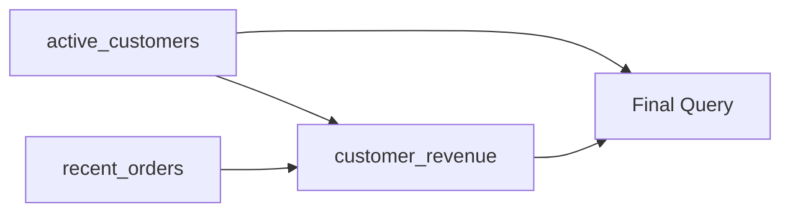

```
Markdown


```
# 14- CTE Naming and Readability Rules

## Overview

Common Table Expressions (CTEs) make complex SQL easier to decompose into named query stages. Their value is not only syntactic convenience: well-named CTEs communicate the data flow and intent of a query to the next engineer who has to review, debug, optimize, or modify it.

Poor naming can turn a readable multi-stage query into a sequence of opaque temporary-looking tables:

```sql
WITH a AS (...),
     b AS (...),
     c AS (...)
SELECT ...
FROM c;
```

Good naming makes the same query read like a data pipeline:

```sql
WITH active_customers AS (...),
     monthly_orders AS (...),
     customer_revenue AS (...)
SELECT ...
FROM customer_revenue;
```

CTE names should describe **what the relation represents**, not how it was produced.

This matters particularly in production SQL because complex queries frequently become shared infrastructure: Django/FastAPI application queries, reporting queries, analytics jobs, migration scripts, scheduled Celery workloads, and database views.

## Core Naming Principle

A CTE name should answer:

> "What does this result set represent?"

Prefer:

```sql
WITH active_customers AS (...)
```

over:

```sql
WITH customer_query AS (...)
```

Prefer:

```sql
WITH orders_last_30_days AS (...)
```

over:

```sql
WITH filtered_orders AS (...)
```

The first version communicates the business meaning. The second describes an implementation detail that may become incorrect when the filtering logic changes.

### Good Naming Characteristics

A useful CTE name is:

- Specific.
- Descriptive.
- Stable when implementation details change.
- Consistent with domain terminology.
- Easy to reference later in the query.
- Distinct from base-table names.
- Consistent with the project's SQL conventions.

## Name CTEs After Their Result

The strongest default rule is to name a CTE after the **logical dataset it produces**.

```sql
WITH active_subscriptions AS (
    SELECT
        user_id,
        plan_id,
        started_at
    FROM subscriptions
    WHERE status = 'active'
)
SELECT *
FROM active_subscriptions;
```

The name describes the resulting relation:

```text
subscriptions
      │
      ▼
active_subscriptions
      │
      ▼
final query
```

This remains readable even if the internal implementation changes from a simple filter to a join or more complex predicate.

## Avoid Generic Names

Names such as these provide little information:

```sql
WITH data AS (...),
     temp AS (...),
     result AS (...),
     query1 AS (...),
     query2 AS (...)
```

They force the reader to inspect every CTE body to understand its purpose.

Instead:

```sql
WITH active_users AS (...),
     recent_orders AS (...),
     order_totals AS (...)
```

The names themselves communicate the query's structure.

## Avoid Implementation-Based Names

Avoid names that describe mechanics rather than meaning:

```sql
WITH filtered_users AS (...),
     joined_orders AS (...),
     grouped_data AS (...)
```

These names are not always wrong, but they often become misleading as the query evolves.

For example:

```sql
WITH filtered_users AS (
    SELECT ...
    FROM users
    WHERE status = 'active'
)
```

Later, the CTE may also contain:

```sql
JOIN subscriptions ...
GROUP BY ...
```

The name `filtered_users` no longer accurately represents the relation.

Prefer:

```sql
WITH active_customers AS (...)
```

if that is what the relation represents.

## Use Domain Terminology

CTE names should use the same vocabulary used by the application and database schema.

If the business calls a person a `customer`, do not randomly call the CTE:

```sql
WITH users_with_orders AS (...)
```

when the actual domain concept is:

```sql
WITH customers_with_orders AS (...)
```

Consistency matters across:

- Database schema.
- API models.
- Django models.
- Python service code.
- Documentation.
- SQL queries.
- Monitoring and reporting.

A query should not force engineers to translate between different naming systems.

## Naming Singular vs Plural

CTEs normally represent relations containing multiple rows, so plural nouns are generally the clearest convention.

Prefer:

```sql
WITH active_users AS (...)
```

over:

```sql
WITH active_user AS (...)
```

unless the CTE intentionally represents a single-row relation.

For example:

```sql
WITH current_account AS (
    SELECT
        id,
        name
    FROM accounts
    WHERE id = $1
)
```

A singular name can be appropriate when the query guarantees one logical entity.

The important rule is consistency rather than blindly applying pluralization.

## Naming Filtered Datasets

When a CTE represents a subset defined by an important business condition, include that condition in the name.

```sql
WITH active_customers AS (
    SELECT *
    FROM customers
    WHERE status = 'active'
)
```

Other useful patterns include:

```text
verified_accounts
paid_orders
failed_payments
recent_orders
eligible_users
pending_invoices
expired_sessions
```

Avoid:

```text
filtered_customers
filtered_orders
filtered_users
```

unless the exact filtering criteria are irrelevant to the query's meaning.

## Naming Time-Based Datasets

Time boundaries are often important enough to include in the CTE name.

```sql
WITH orders_last_30_days AS (
    SELECT
        id,
        customer_id,
        total_amount
    FROM orders
    WHERE created_at >= CURRENT_TIMESTAMP - INTERVAL '30 days'
)
SELECT ...
FROM orders_last_30_days;
```

Useful naming patterns include:

```text
orders_today
orders_last_7_days
orders_last_30_days
monthly_orders
current_month_orders
previous_month_orders
```

Avoid ambiguous names such as:

```text
recent_orders
```

when "recent" has a specific operational meaning that is important to the query.

If the exact time window is likely to change frequently, a more semantic name may be preferable:

```sql
WITH report_period_orders AS (...)
```

## Naming Aggregated CTEs

When a CTE changes the grain of the data through aggregation, its name should make that logical transformation obvious.

For example:

```sql
WITH customer_order_totals AS (
    SELECT
        customer_id,
        COUNT(*) AS order_count,
        SUM(total_amount) AS total_revenue
    FROM orders
    GROUP BY customer_id
)
SELECT *
FROM customer_order_totals;
```

The name communicates:

- Entity: `customer`.
- Measure: `order`.
- Transformation: `totals`.

Other examples:

```text
daily_revenue
monthly_sales
customer_order_counts
product_sales_totals
account_transaction_summary
```

Avoid:

```text
grouped_orders
aggregated_data
summary
```

unless the context makes the meaning genuinely obvious.

## Naming CTEs by Grain

For senior-level SQL readability, explicitly thinking about **grain** is more important than naming alone.

Suppose:

```sql
WITH customer_orders AS (
    SELECT
        customer_id,
        order_id,
        total_amount
    FROM orders
)
```

The CTE has approximately:

```text
one row per order
```

Whereas:

```sql
WITH customer_order_totals AS (
    SELECT
        customer_id,
        SUM(total_amount) AS total_revenue
    FROM orders
    GROUP BY customer_id
)
```

has:

```text
one row per customer
```

Names should make this distinction clear.

| CTE | Expected grain |
|---|---|
| `customer_orders` | One row per order |
| `customer_order_totals` | One row per customer |
| `daily_order_totals` | One row per day |
| `product_category_totals` | One row per category |
| `customer_product_sales` | One row per customer/product combination |

This reduces accidental joins that multiply rows.

## Naming Window-Function CTEs

When a CTE exists primarily to calculate rankings, running totals, or other window-function results, name the resulting relation according to its business meaning.

Prefer:

```sql
WITH ranked_products AS (
    SELECT
        product_id,
        category_id,
        revenue,
        ROW_NUMBER() OVER (
            PARTITION BY category_id
            ORDER BY revenue DESC
        ) AS category_rank
    FROM product_sales
)
SELECT *
FROM ranked_products
WHERE category_rank <= 3;
```

over:

```sql
WITH window_data AS (...)
```

If the ranking itself is central to the result, a more explicit name can be useful:

```text
products_ranked_by_category_revenue
```

Avoid excessively long names when the shorter name is already unambiguous.

## Naming Recursive CTEs

Recursive CTEs benefit from names that describe the structure being traversed.

Prefer:

```sql
WITH RECURSIVE category_tree AS (...)
```

```sql
WITH RECURSIVE employee_hierarchy AS (...)
```

```sql
WITH RECURSIVE dependency_graph AS (...)
```

over:

```sql
WITH RECURSIVE recursive_data AS (...)
```

If traversal direction matters, encode it when useful:

```text
category_descendants
category_ancestors
employee_reports
management_chain
service_dependencies
service_dependents
```

The name should make the recursive result understandable without reading the recursion mechanics.

## Name CTEs According to Their Role

Different CTEs commonly serve different roles.

| Role | Example names |
|---|---|
| Filtered dataset | `active_customers` |
| Time-bounded dataset | `orders_last_30_days` |
| Joined business dataset | `customer_orders` |
| Aggregation | `customer_revenue` |
| Ranking | `ranked_products` |
| Deduplication | `latest_customer_events` |
| Recursive traversal | `category_tree` |
| Authorization scope | `authorized_projects` |
| Final preparation | `customer_metrics` |

The name should describe the **semantic output**, not merely the SQL operation.

## CTE Naming Across Multiple Stages

A complex query often contains several dependent CTEs:

```sql
WITH active_customers AS (
    SELECT
        id
    FROM customers
    WHERE status = 'active'
),
recent_orders AS (
    SELECT
        customer_id,
        id AS order_id,
        total_amount
    FROM orders
    WHERE created_at >= CURRENT_TIMESTAMP - INTERVAL '30 days'
),
customer_revenue AS (
    SELECT
        customer_id,
        SUM(total_amount) AS revenue
    FROM recent_orders
    GROUP BY customer_id
)
SELECT
    c.id,
    COALESCE(r.revenue, 0) AS revenue
FROM active_customers AS c
LEFT JOIN customer_revenue AS r
    ON r.customer_id = c.id;
```

The dependency chain is immediately visible:



A good naming scheme lets the reader understand this pipeline before inspecting every SQL expression.

## Order CTEs by Dependency

Define CTEs in the order that reflects their logical dependency.

Prefer:

```sql
WITH active_customers AS (...),
recent_orders AS (...),
customer_revenue AS (...)
SELECT ...;
```

over an organization that forces the reader to jump around.

A useful rule is:

> Define foundational datasets first, derived datasets second, and final presentation datasets last.

This makes the query read from source preparation toward business output.

## Keep One Logical Responsibility per CTE

A CTE should generally represent one meaningful stage.

Prefer:

```sql
WITH active_customers AS (...),
recent_orders AS (...),
customer_revenue AS (...)
SELECT ...;
```

rather than a CTE whose body performs every transformation in one large block.

This makes each stage:

- Easier to inspect.
- Easier to test.
- Easier to reason about.
- Easier to optimize.
- Easier to modify.

However, avoid splitting every trivial expression into its own CTE.

This is excessive:

```sql
WITH users_filtered AS (...),
users_selected AS (...),
users_named AS (...),
users_ordered AS (...)
SELECT ...
```

when the intermediate relations do not represent meaningful logical stages.

## Avoid CTE Explosion

More CTEs do not automatically mean better SQL.

A query with 20 tiny CTEs can be harder to understand than one query with four meaningful stages.

Use a CTE when it provides at least one of these benefits:

- Names an important intermediate relation.
- Separates a meaningful business transformation.
- Prevents repeated complex logic.
- Makes dependency structure clearer.
- Supports recursive processing.
- Makes performance analysis easier.

Avoid introducing a CTE merely because the query can technically be split.

## Alias Naming

CTE aliases should follow the same readability principles as CTE names.

Prefer:

```sql
FROM customer_revenue AS cr
JOIN active_customers AS ac
    ON ac.id = cr.customer_id
```

when the query is sufficiently complex to benefit from short aliases.

For smaller queries, explicit names can be clearer:

```sql
FROM customer_revenue
JOIN active_customers
    ON active_customers.id = customer_revenue.customer_id
```

Avoid aliases such as:

```sql
FROM customer_revenue AS x
JOIN active_customers AS y
```

unless there is a strong reason.

Short arbitrary aliases increase cognitive load.

## Make Column Names Explicit

CTEs should expose stable, meaningful column names.

Avoid:

```sql
WITH customer_metrics AS (
    SELECT
        customer_id,
        COUNT(*),
        SUM(total_amount)
    FROM orders
    GROUP BY customer_id
)
```

Prefer:

```sql
WITH customer_metrics AS (
    SELECT
        customer_id,
        COUNT(*) AS order_count,
        SUM(total_amount) AS total_revenue
    FROM orders
    GROUP BY customer_id
)
```

Explicit column names make downstream CTEs easier to understand:

```sql
SELECT
    customer_id,
    order_count,
    total_revenue
FROM customer_metrics;
```

They also reduce ambiguity when multiple datasets are joined.

## Avoid `SELECT *` in Important CTEs

Avoid:

```sql
WITH active_customers AS (
    SELECT *
    FROM customers
    WHERE status = 'active'
)
```

for production queries where the CTE is an intentional query boundary.

Prefer:

```sql
WITH active_customers AS (
    SELECT
        id,
        account_id,
        created_at
    FROM customers
    WHERE status = 'active'
)
```

Benefits include:

- Clear data contract between stages.
- Reduced accidental column propagation.
- Less row width.
- More predictable behavior after schema changes.
- Easier query review.

`SELECT *` can be acceptable for exploratory SQL, but production CTEs benefit from explicit projections.

## Avoid Ambiguous Business Names

Consider:

```sql
WITH eligible_users AS (...)
```

The name is useful only if "eligible" has a clear business definition in the query.

If eligibility means:

```text
active + verified + paid subscription
```

the query should make that logic explicit, while the name remains semantic:

```sql
WITH eligible_customers AS (
    SELECT ...
    FROM customers
    JOIN subscriptions ...
    WHERE customers.status = 'active'
      AND customers.email_verified = TRUE
      AND subscriptions.status = 'active'
)
```

The name communicates the business concept; the query defines its current implementation.

## Naming Deduplication CTEs

Deduplication queries are common when processing event streams, imports, or historical records.

Prefer:

```sql
WITH latest_customer_events AS (
    SELECT
        customer_id,
        event_type,
        created_at,
        ROW_NUMBER() OVER (
            PARTITION BY customer_id
            ORDER BY created_at DESC
        ) AS row_number
    FROM customer_events
)
SELECT ...
FROM latest_customer_events
WHERE row_number = 1;
```

The name describes the intended dataset.

Avoid:

```sql
WITH ranked_data AS (...)
```

unless ranking is itself the meaningful business result.

## Naming Authorization CTEs

Authorization-related CTEs deserve particularly clear names because they define a security boundary.

Prefer:

```sql
WITH authorized_projects AS (
    SELECT p.id
    FROM projects AS p
    JOIN project_members AS pm
        ON pm.project_id = p.id
    WHERE pm.user_id = $1
)
SELECT ...
FROM authorized_projects;
```

A name such as `user_projects` may be ambiguous:

```text
Does it mean projects owned by the user?
Projects visible to the user?
Projects the user belongs to?
Projects created by the user?
```

Use names such as:

```text
authorized_projects
accessible_projects
owned_projects
member_projects
```

when the distinction matters.

## Naming Multi-Tenant CTEs

Tenant boundaries should be visible in queries where they are security-critical.

For example:

```sql
WITH tenant_orders AS (
    SELECT
        id,
        customer_id,
        total_amount
    FROM orders
    WHERE tenant_id = $1
)
SELECT ...
FROM tenant_orders;
```

If the CTE represents the security-scoped dataset, `tenant_orders` communicates that boundary more clearly than:

```sql
WITH filtered_orders AS (...)
```

This is especially useful in shared-database multi-tenant applications.

## Readability Through Formatting

Naming and formatting work together.

Prefer:

```sql
WITH active_customers AS (
    SELECT
        id,
        account_id
    FROM customers
    WHERE status = 'active'
),
recent_orders AS (
    SELECT
        id,
        customer_id,
        total_amount
    FROM orders
    WHERE created_at >= CURRENT_TIMESTAMP - INTERVAL '30 days'
)
SELECT
    c.id,
    COUNT(o.id) AS order_count,
    COALESCE(SUM(o.total_amount), 0) AS revenue
FROM active_customers AS c
LEFT JOIN recent_orders AS o
    ON o.customer_id = c.id
GROUP BY c.id;
```

The visual structure communicates:

```text
CTE definition
    ↓
CTE definition
    ↓
Final query
```

Avoid compressing complex CTEs into dense one-line expressions.

## Naming Conventions to Standardize

A team should document its conventions rather than relying on individual preferences.

A practical convention is:

| Concept | Recommended pattern | Example |
|---|---|---|
| Entity subset | `<condition>_<entity>` | `active_customers` |
| Time window | `<entity>_<period>` | `orders_last_30_days` |
| Entity relationship | `<entity>_<related_entity>` | `customer_orders` |
| Aggregate | `<entity>_<metric>` | `customer_revenue` |
| Ranking | `ranked_<entity>` | `ranked_products` |
| Latest record | `latest_<entity>` | `latest_customer_events` |
| Ancestors | `<entity>_ancestors` | `category_ancestors` |
| Descendants | `<entity>_descendants` | `category_descendants` |
| Hierarchy | `<entity>_hierarchy` | `employee_hierarchy` |
| Authorization | `authorized_<entity>` | `authorized_projects` |
| Tenant scope | `tenant_<entity>` | `tenant_orders` |

The exact convention can differ between organizations. Consistency is more valuable than choosing a theoretically perfect naming scheme.

## PostgreSQL Considerations

PostgreSQL treats a CTE as a named query expression, but its execution behavior depends on the PostgreSQL version and query shape.

Do not use naming style as a substitute for understanding execution behavior.

For performance-sensitive CTEs, inspect the actual plan:

```sql
EXPLAIN (ANALYZE, BUFFERS)
WITH active_customers AS (
    SELECT
        id
    FROM customers
    WHERE status = 'active'
)
SELECT *
FROM active_customers;
```

Readable names help optimization because engineers can reason about individual stages when interpreting an execution plan.

PostgreSQL also supports explicit materialization control:

```sql
WITH active_customers AS MATERIALIZED (
    SELECT
        id
    FROM customers
    WHERE status = 'active'
)
SELECT ...
FROM active_customers;
```

or:

```sql
WITH active_customers AS NOT MATERIALIZED (
    SELECT
        id
    FROM customers
    WHERE status = 'active'
)
SELECT ...
FROM active_customers;
```

These are execution decisions, not naming conventions. Use them only when the query plan and workload justify the choice.

## ORM and Application-Level Readability

A CTE often sits below an application abstraction such as Django or FastAPI.

The SQL naming should still use domain language.

For example, an API endpoint might conceptually return:

```text
GET /customers/top
```

The underlying SQL could use:

```sql
WITH eligible_customers AS (...),
customer_revenue AS (...),
ranked_customers AS (...)
SELECT ...
FROM ranked_customers;
```

This is easier to maintain than:

```sql
WITH q1 AS (...),
q2 AS (...),
q3 AS (...)
SELECT ...
FROM q3;
```

Application developers, database engineers, and reviewers can all understand the intent without reverse-engineering arbitrary identifiers.

## Production Review Checklist

Before merging a complex CTE query, review the following:

### Naming

- Does every CTE name describe its result?
- Are domain terms consistent with the rest of the system?
- Are generic names such as `data`, `temp`, and `result` avoided?
- Are important business filters reflected in names?
- Are recursive CTEs named after the structure they traverse?

### Structure

- Are CTEs ordered by dependency?
- Does each CTE represent a meaningful logical stage?
- Are there unnecessary intermediate CTEs?
- Are column names explicit?
- Is `SELECT *` avoided where a stable projection matters?

### Data Semantics

- Is the grain of each CTE clear?
- Can joins multiply rows unexpectedly?
- Are aggregate CTEs named according to their grouping level?
- Are time boundaries explicit where they affect business meaning?

### Security

- Is tenant isolation preserved?
- Are authorization scopes represented clearly?
- Are user-controlled values parameterized?
- Does recursive traversal remain inside the intended security boundary?

### Performance

- Is the query plan understood?
- Are recursive or large CTEs bounded?
- Are appropriate indexes available?
- Is materialization behavior understood for the target database?
- Has the query been tested against realistic data volumes?

## Common Mistakes

| Mistake | Why it hurts | Better approach |
|---|---|---|
| `WITH data AS (...)` | Hides meaning | Name the logical dataset |
| `WITH query1 AS (...)` | Forces mental mapping | Use domain-oriented names |
| `WITH filtered_users AS (...)` | Describes implementation | Use `active_users`, `eligible_users`, etc. |
| Excessive CTE splitting | Increases cognitive overhead | Keep meaningful stages only |
| `SELECT *` everywhere | Creates unstable query boundaries | Project required columns |
| Ambiguous aliases | Makes joins harder to review | Use descriptive aliases |
| Ignoring data grain | Causes accidental row multiplication | Name and reason about grain |
| Inconsistent terminology | Increases translation cost | Reuse domain vocabulary |
| Ignoring tenant scope | Can create security bugs | Make security boundaries explicit |
| Naming recursion `recursive_data` | Hides traversal purpose | Name the hierarchy or graph |

## Interview Perspective

A senior engineer should be able to explain that CTE naming is not merely a style preference.

Good names provide a lightweight **semantic contract** between query stages.

For example:

```sql
WITH active_customers AS (...),
customer_revenue AS (...),
ranked_customers AS (...)
SELECT ...
```

communicates a pipeline:

```text
Active customers
      ↓
Revenue per customer
      ↓
Rank customers
      ↓
Final result
```

The reader can reason about:

- Data flow.
- Expected grain.
- Business meaning.
- Dependencies.
- Potential performance boundaries.

This becomes particularly important when debugging production SQL or reviewing a query whose output is consumed by a critical API.

## Key Takeaways

- **Name CTEs after the logical dataset they represent, using stable domain terminology rather than implementation details.**
- **Make CTE dependencies, data grain, aggregation level, authorization scope, and recursive traversal purpose obvious from the names and structure.**
- **Order CTEs by dependency and keep each one focused on a meaningful transformation without creating unnecessary CTEs.**
- **Use explicit column names and deliberate projections in production CTEs to create predictable boundaries between query stages.**
- **Good CTE naming is an engineering tool: it makes complex SQL easier to review, debug, optimize, secure, and safely modify.**
```
```

Connection interrupted. Waiting for the complete answer