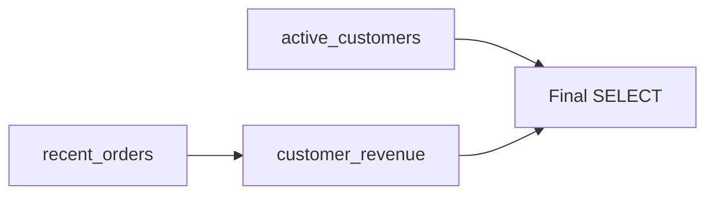

# 15- CTE Scope and Lifetime

## Overview

A Common Table Expression (CTE) is a named query result that exists only within the statement that defines it. Its **scope** determines where the CTE name can be referenced, while its **lifetime** determines how long that logical relation exists.

Understanding these boundaries is important when composing complex SQL because a CTE is not a temporary table, application variable, or persistent database object.

```sql
WITH active_customers AS (
    SELECT
        id,
        email
    FROM customers
    WHERE status = 'active'
)
SELECT
    id,
    email
FROM active_customers;
```

Here, `active_customers` is visible to the remainder of this SQL statement, but it does not become available to a subsequent statement.

```text
SQL statement
┌──────────────────────────────────────────────┐
│ WITH active_customers AS (...)               │
│                                              │
│ SELECT ... FROM active_customers             │
└──────────────────────────────────────────────┘
                     │
                     ▼
             CTE scope ends
                     │
                     ▼
          Next SQL statement
          cannot reference it
```

This distinction becomes especially important when comparing CTEs with temporary tables, views, and materialized views.

## CTE Scope

A CTE is scoped to the SQL statement in which its `WITH` clause appears.

```sql
WITH recent_orders AS (
    SELECT
        id,
        customer_id
    FROM orders
    WHERE created_at >= CURRENT_TIMESTAMP - INTERVAL '30 days'
)
SELECT
    customer_id,
    COUNT(*) AS order_count
FROM recent_orders
GROUP BY customer_id;
```

`recent_orders` can be referenced by the `SELECT` statement that follows the `WITH` clause.

It cannot be referenced by another independent statement:

```sql
WITH recent_orders AS (
    SELECT
        id,
        customer_id
    FROM orders
    WHERE created_at >= CURRENT_TIMESTAMP - INTERVAL '30 days'
)
SELECT *
FROM recent_orders;

SELECT *
FROM recent_orders; -- Error: relation does not exist
```

The second statement has its own scope and knows nothing about the first statement's CTE.

## CTE Lifetime

A CTE has statement-level lifetime.

Conceptually:

```text
Parse statement
      │
      ▼
Create CTE definitions
      │
      ▼
Execute query
      │
      ├── CTE referenced
      ├── CTE referenced
      └── CTE referenced
      │
      ▼
Statement completes
      │
      ▼
CTE is no longer addressable
```

This means a CTE does not persist:

- Across SQL statements.
- Across database connections.
- Across transactions as a reusable named relation.
- Across API requests.
- Across application processes.
- Across database restarts.

The underlying base tables remain persistent; the CTE name does not.

## CTEs Are Not Temporary Tables

A common misconception is that:

```sql
WITH recent_orders AS (...)
```

creates a temporary table called `recent_orders`.

It does not.

A temporary table is a database object with session or transaction lifetime depending on how it is created. A CTE is a query-scoped construct.

| Property | CTE | Temporary Table |
|---|---|---|
| Scope | SQL statement | Session/transaction |
| Persistent object | No | Yes, temporarily |
| Reusable by later statements | No | Yes |
| Explicit schema | Usually inferred | Explicitly defined/inferred |
| Can have indexes | No direct table indexes | Yes |
| Useful across multiple statements | No | Yes |
| Typical purpose | Query composition | Intermediate state across statements |

For example:

```sql
CREATE TEMP TABLE recent_orders AS
SELECT
    id,
    customer_id
FROM orders
WHERE created_at >= CURRENT_TIMESTAMP - INTERVAL '30 days';

SELECT *
FROM recent_orders;

SELECT COUNT(*)
FROM recent_orders;
```

The temporary table remains available for subsequent statements in its applicable session/transaction scope.

A CTE does not:

```sql
WITH recent_orders AS (
    SELECT ...
)
SELECT *
FROM recent_orders;

SELECT COUNT(*)
FROM recent_orders; -- Invalid
```

## Multiple References Within One Statement

A CTE can be referenced multiple times within the statement that defines it.

```sql
WITH recent_orders AS (
    SELECT
        id,
        customer_id,
        total_amount
    FROM orders
    WHERE created_at >= CURRENT_TIMESTAMP - INTERVAL '30 days'
)
SELECT
    customer_id,
    COUNT(*) AS order_count,
    SUM(total_amount) AS revenue
FROM recent_orders
GROUP BY customer_id;
```

More complex statements can reference the same CTE from multiple branches.

```sql
WITH customer_orders AS (
    SELECT
        customer_id,
        total_amount
    FROM orders
)
SELECT
    customer_id,
    SUM(total_amount) AS revenue
FROM customer_orders
GROUP BY customer_id

UNION ALL

SELECT
    customer_id,
    COUNT(*)::numeric AS revenue
FROM customer_orders
GROUP BY customer_id;
```

The important point is that both references are inside the same SQL statement.

## CTE Visibility Between CTEs

A later CTE can generally reference an earlier CTE in the same `WITH` clause.

```sql
WITH active_customers AS (
    SELECT
        id
    FROM customers
    WHERE status = 'active'
),
recent_orders AS (
    SELECT
        id,
        customer_id,
        total_amount
    FROM orders
    WHERE created_at >= CURRENT_TIMESTAMP - INTERVAL '30 days'
),
customer_revenue AS (
    SELECT
        customer_id,
        SUM(total_amount) AS revenue
    FROM recent_orders
    GROUP BY customer_id
)
SELECT
    ac.id,
    COALESCE(cr.revenue, 0) AS revenue
FROM active_customers AS ac
LEFT JOIN customer_revenue AS cr
    ON cr.customer_id = ac.id;
```

The logical dependency is:



This is why CTEs should normally be ordered according to their dependencies.

## Referencing a Later CTE

A CTE should not be treated like an unordered collection of declarations.

For example:

```sql
WITH customer_revenue AS (
    SELECT
        customer_id,
        SUM(total_amount) AS revenue
    FROM recent_orders
    GROUP BY customer_id
),
recent_orders AS (
    SELECT
        customer_id,
        total_amount
    FROM orders
)
SELECT *
FROM customer_revenue;
```

This dependency ordering is invalid in PostgreSQL because `customer_revenue` attempts to reference `recent_orders` before that CTE is defined.

Prefer:

```sql
WITH recent_orders AS (
    SELECT
        customer_id,
        total_amount
    FROM orders
),
customer_revenue AS (
    SELECT
        customer_id,
        SUM(total_amount) AS revenue
    FROM recent_orders
    GROUP BY customer_id
)
SELECT *
FROM customer_revenue;
```

The query now follows the dependency graph from foundational relation to derived relation.

## Forward References and Recursive CTEs

Recursive CTEs are the major case where normal dependency reasoning changes.

A recursive CTE can reference itself:

```sql
WITH RECURSIVE employee_hierarchy AS (
    SELECT
        id,
        manager_id,
        name,
        0 AS depth
    FROM employees
    WHERE manager_id IS NULL

    UNION ALL

    SELECT
        e.id,
        e.manager_id,
        e.name,
        eh.depth + 1
    FROM employees AS e
    JOIN employee_hierarchy AS eh
        ON e.manager_id = eh.id
)
SELECT *
FROM employee_hierarchy;
```

The recursive reference is intentional and controlled by the recursive CTE semantics.

A recursive CTE therefore has a dependency on itself, unlike an ordinary non-recursive CTE.

## CTE Scope and Nested Queries

A CTE can normally be referenced from nested query expressions that belong to the same statement.

```sql
WITH active_customers AS (
    SELECT
        id
    FROM customers
    WHERE status = 'active'
)
SELECT
    ac.id
FROM active_customers AS ac
WHERE EXISTS (
    SELECT 1
    FROM orders AS o
    WHERE o.customer_id = ac.id
);
```

The nested `EXISTS` query is part of the same statement, so it can participate in the query's overall scope.

This is useful when building authorization filters, existence checks, correlated subqueries, and complex reporting queries.

## CTE Scope vs Column Scope

CTE scope and column scope are different concepts.

Consider:

```sql
WITH customer_revenue AS (
    SELECT
        customer_id,
        SUM(total_amount) AS revenue
    FROM orders
    GROUP BY customer_id
)
SELECT
    customer_id,
    revenue
FROM customer_revenue;
```

The name `customer_revenue` has relation-level scope, while `customer_id` and `revenue` are columns exposed by that relation.

You cannot reference an internal column that the CTE does not expose:

```sql
WITH customer_revenue AS (
    SELECT
        customer_id
    FROM orders
)
SELECT
    revenue
FROM customer_revenue; -- Error
```

A CTE creates a logical relation boundary. Downstream query stages work with the columns projected by that relation.

## CTE Scope and Table Aliases

A CTE name is also distinct from an alias assigned when referencing it.

```sql
WITH active_customers AS (
    SELECT
        id,
        email
    FROM customers
    WHERE status = 'active'
)
SELECT
    ac.id,
    ac.email
FROM active_customers AS ac;
```

Here:

- `active_customers` is the CTE name.
- `ac` is the table alias.
- `id` and `email` are columns.

The alias only exists in the relevant query scope.

This distinction matters when several CTEs expose similarly named columns.

## CTEs and Transactions

A CTE does not acquire a transaction-level lifetime simply because it executes inside a transaction.

For example:

```sql
BEGIN;

WITH pending_orders AS (
    SELECT
        id
    FROM orders
    WHERE status = 'pending'
)
UPDATE orders
SET status = 'processing'
WHERE id IN (
    SELECT id
    FROM pending_orders
);

COMMIT;
```

`pending_orders` is available to the `UPDATE` statement, but it is not available to another statement inside the same transaction:

```sql
BEGIN;

WITH pending_orders AS (
    SELECT id
    FROM orders
    WHERE status = 'pending'
)
SELECT *
FROM pending_orders;

SELECT *
FROM pending_orders; -- Invalid

COMMIT;
```

A transaction controls atomicity and visibility of database changes. It does not extend the scope of a CTE.

## CTEs in Data-Modifying Statements

A CTE can participate in statements that modify data, depending on database capabilities.

PostgreSQL supports data-modifying statements inside `WITH`:

```sql
WITH expired_sessions AS (
    DELETE FROM sessions
    WHERE expires_at < CURRENT_TIMESTAMP
    RETURNING id
)
SELECT COUNT(*) AS deleted_sessions
FROM expired_sessions;
```

The CTE exists only for that statement.

A subsequent statement cannot reference `expired_sessions`.

This makes data-modifying CTEs useful when multiple operations need to be composed into one atomic SQL statement.

## CTE Scope and Application Requests

In a backend application, a CTE's scope is independent of the HTTP request lifecycle.

For example:

```text
HTTP request
     │
     ▼
FastAPI / Django view
     │
     ▼
Database connection
     │
     ▼
SQL statement
     │
     ├── CTE exists here
     │
     ▼
Statement completes
     │
     ▼
CTE scope ends
```

The CTE is not stored inside:

- FastAPI request state.
- Django ORM state.
- Redis.
- The database connection as a reusable relation.
- The application process.

If another request needs the same derived dataset, it must execute another statement or use a persistent database abstraction such as a view or materialized view.

## CTE Scope Across Connections

CTEs are local to statements, so connection pooling does not make them reusable.

Suppose an application uses:

```text
FastAPI
   │
   ├── Request A → DB connection 1
   ├── Request B → DB connection 2
   └── Request C → DB connection 3
```

A CTE defined in Request A's statement cannot be referenced by Request B or Request C.

This is an important distinction from temporary tables, whose lifetime can be associated with a database session.

## Choosing Between CTEs and Persistent Objects

The required lifetime should influence the database construct you choose.

| Requirement | Appropriate construct |
|---|---|
| Intermediate logic inside one query | CTE |
| Reuse within one statement | CTE |
| Reuse across multiple statements in a session | Temporary table |
| Reusable logical query definition | View |
| Persisted/precomputed query result | Materialized view |
| Application-level cached result | Redis/application cache |

For example, if an expensive derived dataset is required by many unrelated queries, repeatedly embedding the same CTE may not be the right architectural choice.

A view may be more appropriate:

```sql
CREATE VIEW active_customers AS
SELECT
    id,
    email
FROM customers
WHERE status = 'active';
```

Then:

```sql
SELECT *
FROM active_customers;
```

The view definition persists in the database, unlike a CTE.

## CTE Scope and Materialization

Scope should not be confused with materialization.

A CTE being statement-scoped does **not** necessarily mean that its complete result set is physically stored somewhere for the duration of the statement.

Modern PostgreSQL can inline eligible CTEs into the surrounding query, while other cases may involve materialization.

For example:

```sql
WITH active_customers AS (
    SELECT
        id
    FROM customers
    WHERE status = 'active'
)
SELECT *
FROM active_customers;
```

The logical model is:

```text
CTE relation
     │
     ▼
Outer query
```

The physical execution may differ based on the optimizer and query structure.

For performance-sensitive queries, inspect the actual execution plan:

```sql
EXPLAIN (ANALYZE, BUFFERS)
WITH active_customers AS (
    SELECT
        id
    FROM customers
    WHERE status = 'active'
)
SELECT *
FROM active_customers;
```

Do not infer physical storage behavior merely from the existence of a `WITH` clause.

## Scope and Optimization Boundaries

A senior engineer should distinguish between:

- **Logical scope** — where the CTE can be referenced.
- **Execution strategy** — how the database executes it.
- **Materialization** — whether intermediate results are physically materialized.
- **Transaction scope** — how long changes remain part of a transaction.
- **Connection scope** — how long session-level objects remain available.

These are separate concepts.

| Concept | CTE behavior |
|---|---|
| Logical scope | Statement |
| Logical lifetime | Statement |
| Transaction lifetime | Not extended |
| Connection lifetime | Not extended |
| Persistent database object | No |
| Physical materialization | Database-dependent |
| Reusable across statements | No |

Keeping these concepts separate prevents many SQL performance and architecture misunderstandings.

## Production Considerations

### Query Design

Use CTEs when they improve the structure of a single SQL statement.

Good candidates include:

- Multi-stage transformations.
- Complex aggregation pipelines.
- Recursive traversals.
- Ranking and deduplication.
- Data-modifying workflows.
- Authorization or tenant-scoping stages.

Do not introduce a CTE when the same result genuinely needs to be shared across independent statements.

### Performance

Do not assume that:

```sql
WITH expensive_dataset AS (...)
```

means:

```text
execute once
store result
reuse forever
```

The optimizer determines the physical execution strategy according to the database engine and query.

Use:

```sql
EXPLAIN (ANALYZE, BUFFERS)
```

for PostgreSQL production investigations.

### Scalability

CTEs do not provide cross-request caching.

If an expensive dataset is requested thousands of times per minute, repeatedly executing the same CTE may create unnecessary database load.

Depending on freshness requirements, consider:

- Appropriate indexes.
- A view.
- A materialized view.
- Redis caching.
- Precomputed tables.
- Background aggregation using Celery or another job system.

The correct choice depends on consistency, freshness, latency, and operational requirements.

### Reliability

A CTE is particularly useful when several related operations must execute as one SQL statement.

This can reduce application-level coordination and, where supported, allow a database operation to remain atomic.

However, statement-level atomicity should not be confused with transaction-level workflow design. Multi-step business workflows often still require explicit transactions and appropriate locking.

## Security Considerations

CTE scope does not automatically provide authorization or tenant isolation.

For example:

```sql
WITH tenant_orders AS (
    SELECT
        id,
        customer_id,
        total_amount
    FROM orders
    WHERE tenant_id = $1
)
SELECT *
FROM tenant_orders;
```

The CTE creates a useful logical security boundary, but the application still needs to ensure that `$1` represents the authenticated tenant and that no downstream operation bypasses the intended scope.

Use parameterized queries:

```python
cursor.execute(
    """
    WITH tenant_orders AS (
        SELECT id, customer_id, total_amount
        FROM orders
        WHERE tenant_id = %s
    )
    SELECT *
    FROM tenant_orders
    """,
    [tenant_id],
)
```

Never construct SQL by interpolating untrusted values into the query string.

## Common Mistakes

| Mistake | Why it happens | Correct approach |
|---|---|---|
| Treating a CTE like a temp table | Both provide named intermediate data | Remember CTEs are statement-scoped |
| Referencing a CTE in a later statement | Assuming transaction scope applies | Repeat the CTE or use a temporary table/view |
| Assuming CTEs are always materialized | Confusing logical and physical behavior | Inspect the execution plan |
| Expecting CTEs to cache results | Confusing query composition with caching | Use appropriate database/application caching |
| Assuming connection pooling preserves CTEs | Confusing CTEs with session objects | CTEs end with their statement |
| Ignoring CTE dependency order | Treating CTE declarations as unordered | Define dependencies before consumers |
| Assuming transactions extend CTE lifetime | Mixing transaction and statement scope | Keep transaction and query scope separate |
| Using a CTE for cross-request reuse | Choosing the wrong persistence mechanism | Use a view, materialized view, cache, or table |

## Interview Traps

### "Does a CTE create a temporary table?"

**No.** A CTE creates a named logical query expression scoped to a single SQL statement. The database may physically materialize it depending on the engine and query, but that is an execution detail.

### "Can I use a CTE in the next SQL statement?"

**No.** The CTE name is not visible outside the statement containing its `WITH` clause.

### "Does a CTE live for the duration of a transaction?"

**No.** Its logical scope remains the statement. A transaction can contain multiple statements, but each statement has its own CTE definitions.

### "Are CTE results always materialized?"

**No.** Logical CTE scope and physical execution strategy are separate concepts. In PostgreSQL, eligible CTEs may be inlined, while other cases can be materialized.

### "Should I use a CTE to cache an expensive query?"

**No.** A CTE is not an application or database cache. If the result needs reuse across statements or requests, choose a persistence or caching mechanism appropriate to the freshness requirements.

## Practical Decision Rule

When deciding whether a CTE is appropriate, ask:

```text
Does the intermediate result exist only
to compose this SQL statement?
             │
       ┌─────┴─────┐
      Yes           No
       │             │
       ▼             ▼
     CTE       Does it need reuse
               across statements?
                     │
                ┌────┴────┐
               Yes        No
                │          │
                ▼          ▼
       Temp table /    Reconsider
       persistent      query design
       object/cache
```

A useful engineering rule is:

> **Choose the database construct based on the lifetime of the data you need, not merely on how convenient its syntax looks.**

## Key Takeaways

- **A CTE has statement-level scope and lifetime; its name cannot be referenced by a subsequent SQL statement.**
- **CTE scope is independent of transaction, database connection, HTTP request, and connection-pool lifetime.**
- **A CTE is not a temporary table or cache; use temporary tables, views, materialized views, tables, or Redis when reuse must outlive the statement.**
- **Logical CTE scope does not determine physical execution; materialization and optimization behavior must be evaluated using the target database's execution plan.**
- **Use CTEs to structure one complex statement, while choosing persistent or cached mechanisms when the intermediate result must survive beyond that statement.**