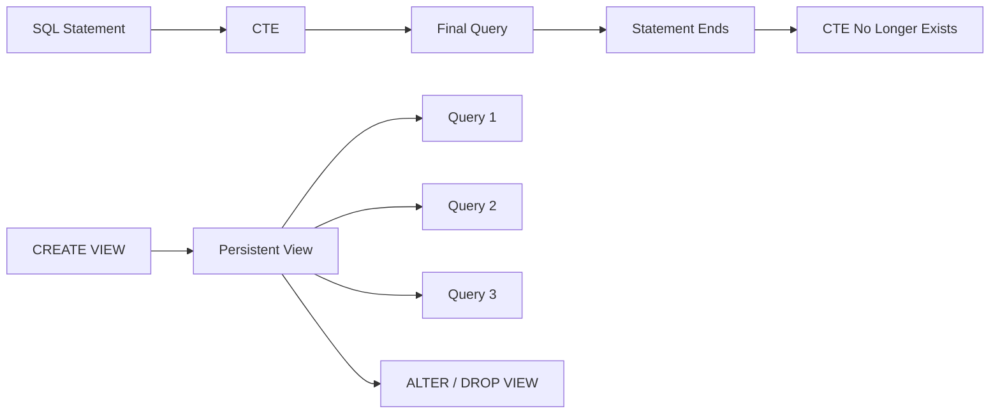
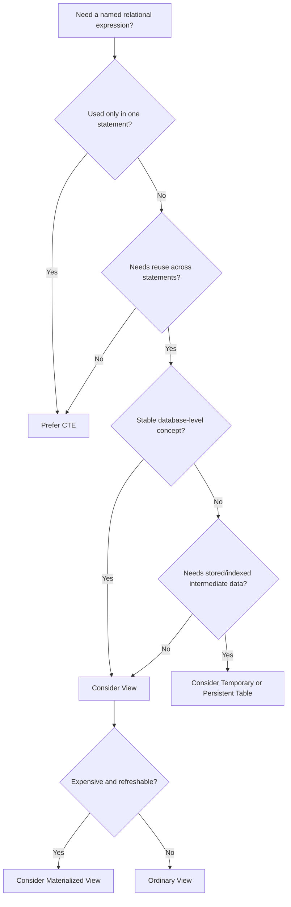

# 18- CTE vs View

## Overview

A **Common Table Expression (CTE)** and a **view** both let engineers give a reusable name to a SQL query, but their scope, lifecycle, and operational purpose are different.

A CTE is a query-scoped construct defined with `WITH`. It exists only for the duration of one SQL statement.

A view is a persistent database object containing a stored query definition. Once created, it can be referenced by multiple statements, application services, reports, and other database objects.

The practical distinction is:

```text
CTE
└── Reuse within one SQL statement

View
└── Reuse across SQL statements and database consumers
```

Neither should be selected purely because it makes SQL shorter. The correct choice depends on **scope, ownership, reuse, security, schema stability, optimizer behavior, and operational lifecycle**.

## CTE vs View at a Glance

| Concern | CTE | View |
|---|---|---|
| Definition | Inside a SQL statement | Persistent database object |
| Lifetime | One statement | Until altered/dropped |
| Reuse across statements | No | Yes |
| Reuse across applications | No | Yes |
| Database object | No | Yes |
| Centralized logic | No | Yes |
| Query-local readability | Excellent | Good |
| Recursive queries | Yes | Not inherently |
| Permissions | Based on underlying statement/context | Can provide an abstraction/security boundary |
| Schema dependency | Local to query | Can affect dependent consumers |
| Deployment lifecycle | Application/query code | Database migration/schema deployment |
| Indexes on result | No independent indexes | No, for ordinary views |
| Materialized data | Not inherently | Ordinary view: no; materialized view: yes |
| Best fit | Complex single statement | Shared relational interface |

## CTE

A CTE creates a named intermediate relation inside one statement:

```sql
WITH customer_revenue AS (
    SELECT
        customer_id,
        SUM(total_amount) AS revenue
    FROM orders
    WHERE status = 'completed'
    GROUP BY customer_id
)
SELECT
    c.id,
    c.email,
    cr.revenue
FROM customers AS c
JOIN customer_revenue AS cr
    ON cr.customer_id = c.id
WHERE cr.revenue >= 10000;
```

The name `customer_revenue` is available only to this statement.

### When to Use a CTE

Use a CTE when the intermediate query:

- Exists only for one operation.
- Makes a complex query easier to reason about.
- Is part of a multi-stage transformation.
- Needs recursive traversal.
- Is used by multiple parts of the same statement.
- Should remain close to the consuming query.

A CTE is generally a good default for **query-local composition**.

## View

A view stores a query definition as a persistent database object.

```sql
CREATE VIEW customer_revenue AS
SELECT
    customer_id,
    SUM(total_amount) AS revenue
FROM orders
WHERE status = 'completed'
GROUP BY customer_id;
```

Consumers can then query it:

```sql
SELECT
    c.id,
    c.email,
    cr.revenue
FROM customers AS c
JOIN customer_revenue AS cr
    ON cr.customer_id = c.id
WHERE cr.revenue >= 10000;
```

The view can be referenced by many independent SQL statements.

### When to Use a View

Use a view when a derived relation represents a stable, shared database-level concept.

Typical examples include:

- Reporting datasets.
- Read models.
- Stable database interfaces.
- Frequently reused joins.
- Security-oriented column or row exposure.
- Compatibility layers around complex schemas.
- Shared business-facing relational abstractions.

## Lifecycle Difference

The lifecycle is the fundamental distinction.



A CTE belongs to an individual statement.

A view belongs to the database schema.

This means choosing a view introduces a **database contract** that can have consumers beyond the service that originally created it.

## CTE as Query Composition

Consider a reporting endpoint that needs several transformations:

```sql
WITH recent_orders AS (
    SELECT
        customer_id,
        total_amount,
        created_at
    FROM orders
    WHERE created_at >= CURRENT_TIMESTAMP - INTERVAL '90 days'
),
customer_revenue AS (
    SELECT
        customer_id,
        SUM(total_amount) AS revenue
    FROM recent_orders
    GROUP BY customer_id
)
SELECT
    c.id,
    c.email,
    cr.revenue
FROM customers AS c
JOIN customer_revenue AS cr
    ON cr.customer_id = c.id
WHERE cr.revenue > 10000;
```

The intermediate relations exist to structure this particular operation.

Creating a persistent view would be unnecessary if no other query needs `customer_revenue`.

## View as a Shared Database Interface

Suppose several services need the same definition of an active customer:

```sql
CREATE VIEW active_customers AS
SELECT
    id,
    email,
    created_at
FROM customers
WHERE status = 'active';
```

Different consumers can now use:

```sql
SELECT *
FROM active_customers
WHERE created_at >= CURRENT_DATE - INTERVAL '30 days';
```

and:

```sql
SELECT COUNT(*)
FROM active_customers;
```

The view centralizes the definition.

This can prevent multiple services from independently implementing slightly different interpretations of "active customer."

## Advantages of CTEs

### Locality

The transformation is visible next to the query that consumes it.

This is valuable when the logic is specific to one endpoint or workflow.

### Lower Schema Coupling

Adding a CTE does not modify the database schema.

This can simplify application-level experimentation and query evolution.

### Complex Query Composition

Multiple CTEs can form a readable pipeline:

```sql
WITH filtered_orders AS (...),
customer_totals AS (...),
ranked_customers AS (...)
SELECT ...
```

### Recursive Processing

Recursive CTEs can traverse hierarchical data:

```sql
WITH RECURSIVE category_tree AS (
    SELECT
        id,
        parent_id,
        name
    FROM categories
    WHERE id = 100

    UNION ALL

    SELECT
        c.id,
        c.parent_id,
        c.name
    FROM categories AS c
    JOIN category_tree AS ct
        ON c.parent_id = ct.id
)
SELECT *
FROM category_tree;
```

This is a capability of CTEs that ordinary views do not inherently provide.

## Limitations of CTEs

### No Cross-Statement Reuse

A CTE cannot be referenced by a later statement:

```sql
WITH active_users AS (
    SELECT id
    FROM users
    WHERE status = 'active'
)
SELECT *
FROM active_users;
```

The following is invalid:

```sql
SELECT *
FROM active_users;
```

### No Independent Index

A CTE is not an independently addressable table on which application code can create an index.

Performance comes from the execution plan chosen for the complete statement.

### Query Duplication

If five independent queries require exactly the same complex relational definition, five CTE implementations can become difficult to maintain.

That can be a signal that the logic belongs in a view or another database abstraction.

## Advantages of Views

### Reuse

A view can be referenced by many queries:

```sql
SELECT *
FROM active_customers;

SELECT COUNT(*)
FROM active_customers;

SELECT *
FROM active_customers
WHERE region = 'IN';
```

### Centralized Definition

The logic exists in one database object.

Changing the definition can update all consumers that use the view.

### Abstraction

A view can hide implementation details:

```text
Application
     │
     ▼
active_customers
     │
     ├── customers
     ├── customer_status
     └── other internal relations
```

Consumers need to understand the view's contract rather than the underlying schema.

### Security Boundary

Views can expose only approved columns:

```sql
CREATE VIEW customer_directory AS
SELECT
    id,
    email,
    display_name
FROM customers;
```

Sensitive columns such as internal authentication data need not be exposed through this interface.

A view can therefore be part of a database security design, although the exact security behavior depends on the DBMS and privileges.

## Limitations of Views

### Schema-Level Coupling

A view becomes part of the database schema.

Changing its columns or semantics can break:

- APIs.
- Reports.
- BI tools.
- Other SQL queries.
- Stored procedures.
- ETL pipelines.

### Deployment Complexity

View changes should generally be managed through database migrations and reviewed like schema changes.

### Performance Is Not Automatically Better

An ordinary view usually does not mean "precomputed data."

The database typically expands or plans the view definition as part of the consuming query.

For example:

```sql
SELECT *
FROM customer_revenue
WHERE revenue > 10000;
```

does not automatically mean `customer_revenue` has been calculated and stored beforehand.

If precomputed data is required, consider a **materialized view** where supported.

### Hidden Complexity

A short application query can conceal a large amount of database logic:

```sql
SELECT *
FROM customer_dashboard;
```

The view may internally contain multiple joins, aggregations, filters, and nested views.

This can make query performance less obvious to application developers.

## Ordinary View vs Materialized View

A common source of confusion is treating a view as cached data.

| Feature | Ordinary View | Materialized View |
|---|---|---|
| Stores query definition | Yes | Yes |
| Stores result data | No | Yes |
| Automatically reflects base-table changes | Through query execution | No |
| Refresh required | No | Yes |
| Query performance | Depends on underlying query | Often faster for expensive reads |
| Storage required | Minimal definition storage | Result storage |
| Freshness | Current according to transaction/query semantics | Depends on refresh strategy |
| Indexes | No independent result index | Often supported |
| Best use | Logical abstraction | Expensive read-heavy derived data |

For PostgreSQL:

```sql
CREATE MATERIALIZED VIEW monthly_revenue AS
SELECT
    DATE_TRUNC('month', created_at) AS month,
    SUM(total_amount) AS revenue
FROM orders
GROUP BY DATE_TRUNC('month', created_at);
```

It can then be refreshed:

```sql
REFRESH MATERIALIZED VIEW monthly_revenue;
```

This is a fundamentally different operational model from an ordinary view.

## CTE vs View Performance

There is no general rule that one is faster.

The optimizer may transform both query forms substantially.

For example, these two designs can represent similar relational logic:

```sql
WITH active_customers AS (
    SELECT id
    FROM customers
    WHERE status = 'active'
)
SELECT *
FROM active_customers
WHERE id > 1000;
```

and:

```sql
CREATE VIEW active_customers AS
SELECT id
FROM customers
WHERE status = 'active';

SELECT *
FROM active_customers
WHERE id > 1000;
```

The optimizer may combine predicates and choose an equivalent execution strategy.

The correct engineering approach is to inspect the actual plan:

```sql
EXPLAIN (ANALYZE, BUFFERS)
SELECT
    ...
```

Do not choose a view or CTE based solely on assumptions about materialization.

## CTE Materialization

CTE behavior can be database-specific.

For PostgreSQL, CTEs can sometimes be folded into the surrounding query, while explicit materialization controls are available:

```sql
WITH customer_totals AS MATERIALIZED (
    SELECT
        customer_id,
        SUM(total_amount) AS revenue
    FROM orders
    GROUP BY customer_id
)
SELECT *
FROM customer_totals;
```

Or:

```sql
WITH customer_totals AS NOT MATERIALIZED (
    SELECT
        customer_id,
        SUM(total_amount) AS revenue
    FROM orders
    GROUP BY customer_id
)
SELECT *
FROM customer_totals;
```

The important engineering principle is:

> **Logical SQL structure does not necessarily determine physical execution.**

The optimizer decides how the relational expression is executed, subject to database-specific rules and explicit directives.

## View Performance and Indexes

An ordinary view itself generally does not have an independently maintained result index.

Instead, indexes on underlying tables may support the view query.

For example:

```sql
CREATE INDEX idx_orders_status_created_at
ON orders (status, created_at);
```

can potentially help a view that filters orders by status and time.

If the derived dataset itself needs indexes because it is expensive to compute repeatedly, a materialized view or persistent derived table may be more appropriate.

## Security Considerations

Views can be useful when different consumers should see different database representations.

For example:

```sql
CREATE VIEW public_customer_profile AS
SELECT
    id,
    display_name,
    country
FROM customers;
```

Instead of granting application users direct access to every column in `customers`, access can be granted to the view according to the database's privilege model.

However, a view should not be treated as an automatic security boundary.

Consider:

- Database privileges.
- Row-level security.
- View ownership.
- Definer/invoker semantics where supported.
- Functions used by the view.
- Indirect access to underlying tables.
- Whether consumers can query base tables directly.

Security design must be validated against the target DBMS.

## API Architecture Considerations

Views can provide a useful boundary between application code and complex database schemas.

For example:

```text
                    PostgreSQL
                         │
             ┌───────────┴───────────┐
             │                       │
       Base Tables               Views
             │                       │
     ┌───────┼────────┐              │
     │       │        │              ▼
 orders  customers payments   customer_dashboard
                                     │
                                     ▼
                               Backend Service
                                     │
                          ┌──────────┴──────────┐
                          ▼                     ▼
                       REST API             gRPC API
```

This can be valuable in reporting or read-heavy systems where the database owns complex relational composition.

However, avoid turning views into an unstructured "business logic dumping ground."

Business rules that belong in application services should not automatically be pushed into database views.

## Views in Django and FastAPI Applications

A backend application can query a view much like a table:

```sql
SELECT
    customer_id,
    revenue
FROM customer_revenue
WHERE customer_id = $1;
```

The application should still use parameterized queries rather than constructing SQL through string interpolation.

In Django, a view can sometimes be mapped to a model-like abstraction for read-only use, but migration and primary-key semantics require careful design.

In FastAPI or other service architectures, a repository/data-access layer can encapsulate queries against the view:

```text
API endpoint
    │
    ▼
Service layer
    │
    ▼
Repository
    │
    ▼
Database view
    │
    ▼
Base tables
```

The important distinction is ownership:

- The **application layer** owns API behavior.
- The **database view** owns a reusable relational representation.

## Database Migration Considerations

A view should normally be managed as part of database deployment.

For example:

```sql
CREATE OR REPLACE VIEW active_customers AS
SELECT
    id,
    email,
    created_at
FROM customers
WHERE status = 'active';
```

Production migrations should account for:

- Existing consumers.
- Column additions/removals.
- Dependency ordering.
- Permissions.
- Rollback behavior.
- Compatibility between old and new application versions.

A deployment strategy may need to maintain backward compatibility:

```text
Old application
      │
      ▼
Existing view contract
      │
      ▼
Migration
      │
      ▼
Expanded view contract
      │
      ▼
New application
```

Dropping or renaming a view column can be a breaking change even if no base table was modified.

## When to Prefer a CTE

Choose a CTE when:

- The logic is query-specific.
- The intermediate result has no independent meaning.
- The query needs multiple transformation stages.
- Recursive traversal is required.
- You want to keep logic close to the consuming query.
- Creating a persistent schema object would add unnecessary coupling.

Example:

```sql
WITH ranked_orders AS (
    SELECT
        customer_id,
        id AS order_id,
        total_amount,
        ROW_NUMBER() OVER (
            PARTITION BY customer_id
            ORDER BY created_at DESC
        ) AS rank
    FROM orders
)
SELECT
    customer_id,
    order_id,
    total_amount
FROM ranked_orders
WHERE rank <= 3;
```

The ranking is specific to this query and does not necessarily justify a permanent database object.

## When to Prefer a View

Choose a view when:

- Multiple consumers need the same relational definition.
- The derived relation represents a stable database concept.
- You want a database-level abstraction over complex joins.
- You need to expose only selected columns.
- Reporting consumers benefit from a stable read interface.
- The logic should be centrally governed by the database team.

Example:

```sql
CREATE VIEW order_summary AS
SELECT
    o.id AS order_id,
    o.customer_id,
    o.created_at,
    o.total_amount,
    p.status AS payment_status
FROM orders AS o
JOIN payments AS p
    ON p.order_id = o.id;
```

Multiple consumers can now query the same representation without duplicating the join.

## When Neither Is the Best Choice

A CTE or view is not automatically the right solution.

Consider a **materialized view** when:

- The derived query is expensive.
- Reads greatly outnumber writes.
- Slightly stale data is acceptable.
- Refresh can be scheduled or triggered.

Consider a **temporary table** when:

- Intermediate data is needed across multiple statements.
- It needs independent indexes.
- It is part of a multi-step batch operation.

Consider a **persistent table** when:

- The derived data must be explicitly stored.
- It has its own lifecycle.
- It must be updated independently from the source query.

Consider **Redis or another cache** when:

- The primary problem is low-latency repeated reads rather than relational composition.
- The data has an appropriate cache lifecycle.

## Common Mistakes

| Mistake | Why It Happens | Better Approach |
|---|---|---|
| Creating a view for one query | Confuses reuse with query composition | Use a CTE |
| Repeating the same complex CTE everywhere | Avoids database-level reuse | Evaluate a view |
| Assuming a view stores data | Confuses views with materialized views | Use a materialized view when appropriate |
| Assuming CTEs are always materialized | Confuses logical and physical query structure | Inspect execution plans |
| Treating a view as an API contract without versioning | Schema changes affect consumers | Manage view changes as compatibility-sensitive migrations |
| Putting all business logic into views | Database abstraction becomes hard to govern | Keep ownership boundaries clear |
| Nesting many views | Hides execution complexity | Inspect plans and simplify where necessary |
| Granting access to a view but also exposing base tables | Security boundary becomes ineffective | Review database privileges holistically |
| Assuming a view improves performance | Abstraction is mistaken for optimization | Benchmark and inspect `EXPLAIN` |
| Dropping view columns casually | Hidden consumers may depend on them | Use additive/compatible migrations |

## Production Pitfalls

### Overusing Views as an Abstraction Layer

Views can simplify complex schemas, but excessive layering can make SQL difficult to debug:

```text
API Query
   │
   ▼
View A
   │
   ▼
View B
   │
   ▼
View C
   │
   ▼
Multiple Base Tables
```

A developer investigating latency may need to understand the entire dependency chain.

Keep view hierarchies understandable and document important dependencies.

### Treating Views as Business Logic Containers

A view can express relational logic well:

- Joins.
- Filters.
- Aggregations.
- Derived columns.

But complex cross-system workflows, external API calls, retries, authorization policies, and orchestration generally belong elsewhere.

### Ignoring Dependency Management

Views can depend on:

- Tables.
- Columns.
- Functions.
- Other views.
- Types.

Schema migrations must account for these dependencies.

### Forgetting Observability

If an API relies heavily on views, monitor the actual underlying queries.

Useful PostgreSQL tooling includes:

```sql
EXPLAIN (ANALYZE, BUFFERS)
SELECT *
FROM customer_revenue
WHERE customer_id = 123;
```

and database-level query monitoring such as `pg_stat_statements` where enabled.

Monitor:

- Query latency.
- Rows examined/returned.
- Buffer usage.
- Temporary I/O.
- CPU consumption.
- Lock waits.
- Frequency of expensive view queries.

## Decision Framework

Use this sequence when deciding between a CTE and a view:



The decision should be driven by **lifecycle and ownership first**, then by performance evidence.

## Interview Traps

### "Is a view basically a permanent CTE?"

It is a useful analogy for understanding query abstraction, but it is not technically equivalent.

A CTE is scoped to one statement. A view is a persistent schema object with its own permissions, dependencies, lifecycle, and consumers.

### "Does a view store query results?"

An ordinary view generally stores the query definition, not its result rows.

A materialized view stores derived data and must be refreshed according to its database-specific semantics.

### "Are CTEs faster than views?"

Not inherently.

The optimizer can often transform both forms, so performance must be evaluated using the actual database engine and execution plan.

### "When should you create a view?"

When a relational representation is stable and valuable to multiple consumers or when a database-level abstraction/security boundary is useful.

Do not create a view merely to make one query shorter.

### "Can a view be indexed?"

An ordinary view generally cannot have independent indexes on its result.

If indexed derived data is required, consider a materialized view or another persisted representation, depending on the database.

## Practical Comparison

| Scenario | Preferred Approach | Reason |
|---|---|---|
| Complex query with several local stages | CTE | Query-local composition |
| Recursive hierarchy traversal | Recursive CTE | Native recursive query structure |
| Same complex relation used by many queries | View | Centralized definition |
| Reporting abstraction | View | Stable relational interface |
| Sensitive-column exposure | View + privileges | Controlled projection |
| Expensive read-heavy aggregation | Materialized view | Persisted derived data |
| Multi-statement intermediate workflow | Temporary table | Cross-statement lifecycle |
| Low-latency repeated application reads | Cache | Different optimization problem |
| Permanent derived dataset | Persistent table | Explicit data lifecycle |

## Production Recommendations

- Prefer **CTEs for local query composition**.
- Prefer **views for stable, reusable database-level relations**.
- Treat view schemas as contracts when multiple consumers depend on them.
- Manage view definitions through version-controlled migrations.
- Do not assume a view is cached or materialized.
- Use `EXPLAIN` and runtime metrics before making performance claims.
- Avoid deeply nested view hierarchies that obscure execution plans.
- Use views as part of a security model only after reviewing the complete privilege model.
- Consider materialized views when the real requirement is persisted, refreshable derived data.
- Keep application business logic and database relational abstractions under clear ownership boundaries.

## Key Takeaways

- **CTEs are statement-scoped; views are persistent database objects designed for reuse across statements and consumers.**
- **Use CTEs for query-local composition and views for stable, shared relational abstractions.**
- **An ordinary view does not mean precomputed or cached data; use materialized views when persisted derived results are actually required.**
- **Neither CTEs nor views are inherently faster; use execution plans and production workload measurements to evaluate performance.**
- **Treat widely consumed views as database contracts and manage their schema, permissions, dependencies, and migrations accordingly.**