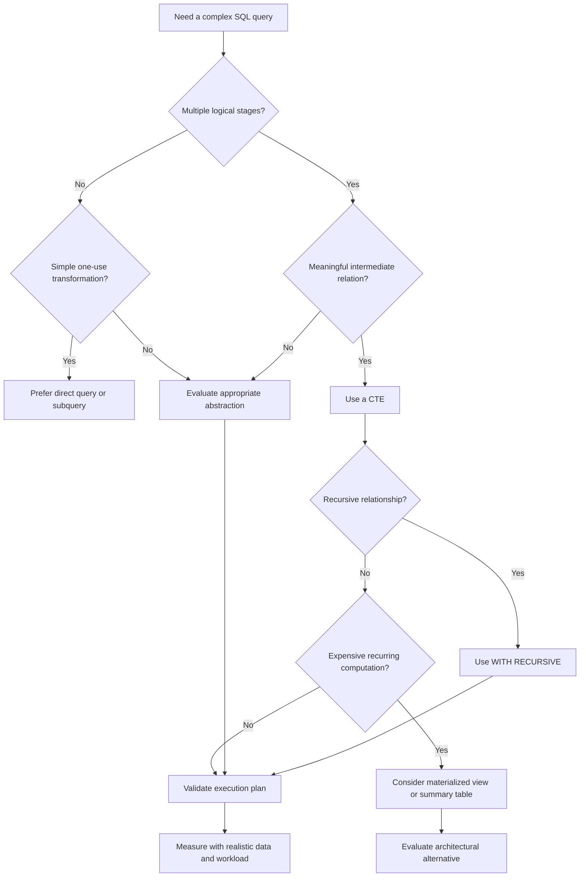

# 21- When to Choose a CTE

## Overview

A Common Table Expression (CTE) is a named query expression introduced with `WITH`. Its primary value is **query composition**: it allows a complex SQL statement to be divided into meaningful relational stages.

Choosing a CTE should be based on the problem being solved, not on a rule such as "CTEs are cleaner" or "CTEs are faster." A CTE is often the right choice when a query has multiple logical transformations, needs recursive processing, performs staged aggregation, or reuses a derived relation. It may be unnecessary when a simple subquery, derived table, or direct query expresses the same logic more clearly.

The decision should consider four dimensions:

```text
Query complexity
      │
      ├── Readability
      ├── Reuse
      ├── Correctness
      └── Performance
              │
              ▼
        Choose abstraction
              │
       ┌──────┼────────┐
       ▼      ▼        ▼
      CTE   Subquery  Other
```

A senior engineer should also distinguish **logical query structure** from **physical execution**. A CTE does not inherently imply materialization or a performance benefit. The database optimizer ultimately determines how the statement executes.

## What a CTE Provides

A CTE gives a query a temporary, statement-local name.

```sql
WITH recent_orders AS (
    SELECT
        id,
        customer_id,
        total_amount,
        created_at
    FROM orders
    WHERE status = 'completed'
      AND created_at >= CURRENT_TIMESTAMP - INTERVAL '30 days'
)
SELECT
    customer_id,
    COUNT(*) AS order_count,
    SUM(total_amount) AS revenue
FROM recent_orders
GROUP BY customer_id;
```

The CTE separates two logical responsibilities:

1. Identify relevant orders.
2. Aggregate those orders by customer.

This separation becomes increasingly valuable as query complexity grows.

## When a CTE Is a Good Choice

A CTE is usually appropriate when one or more of the following conditions apply:

| Situation | Why a CTE Helps |
|---|---|
| Multiple logical query stages | Makes transformations explicit |
| Complex filtering before aggregation | Separates filtering from aggregation |
| Multiple aggregations | Gives each stage a meaningful name |
| Window-function filtering | Allows filtering on computed window values |
| Recursive relationships | Required for recursive query patterns |
| Reusing a derived relation | Avoids duplicating complex SQL text |
| Complex data modification | Makes `INSERT`, `UPDATE`, or `DELETE` logic easier to structure |
| Reporting queries | Provides readable analytical stages |
| Query debugging | Individual stages can be inspected independently |

The strongest reason to introduce a CTE is usually **semantic clarity**: the intermediate result represents a meaningful concept in the query.

## Use a CTE for Meaningful Query Stages

Consider a customer analytics query:

```sql
WITH recent_orders AS (
    SELECT
        customer_id,
        total_amount
    FROM orders
    WHERE status = 'completed'
      AND created_at >= CURRENT_TIMESTAMP - INTERVAL '90 days'
),
customer_revenue AS (
    SELECT
        customer_id,
        SUM(total_amount) AS revenue
    FROM recent_orders
    GROUP BY customer_id
),
high_value_customers AS (
    SELECT
        customer_id,
        revenue
    FROM customer_revenue
    WHERE revenue >= 10000
)
SELECT
    c.id,
    c.email,
    hvc.revenue
FROM customers AS c
JOIN high_value_customers AS hvc
    ON hvc.customer_id = c.id;
```

Each CTE represents a domain-relevant stage:

```text
orders
  │
  ▼
recent_orders
  │
  ▼
customer_revenue
  │
  ▼
high_value_customers
  │
  ▼
customers
```

This is preferable to hiding all transformations inside one deeply nested query when the stages have independent semantic meaning.

## When a CTE Is Unnecessary

Do not introduce a CTE merely to wrap a trivial query.

Instead of:

```sql
WITH active_customers AS (
    SELECT *
    FROM customers
    WHERE status = 'active'
)
SELECT *
FROM active_customers;
```

prefer:

```sql
SELECT *
FROM customers
WHERE status = 'active';
```

The CTE adds another name without adding meaningful abstraction.

A useful test is:

> Does naming this intermediate relation make the query easier to understand, reason about, or safely modify?

If the answer is no, the CTE may be unnecessary.

## CTE vs Direct Query

For simple transformations, direct SQL is generally clearer.

### Direct Query

```sql
SELECT
    customer_id,
    SUM(total_amount) AS revenue
FROM orders
WHERE status = 'completed'
GROUP BY customer_id;
```

### CTE

```sql
WITH completed_orders AS (
    SELECT
        customer_id,
        total_amount
    FROM orders
    WHERE status = 'completed'
)
SELECT
    customer_id,
    SUM(total_amount) AS revenue
FROM completed_orders
GROUP BY customer_id;
```

The second version becomes valuable if `completed_orders` is part of a larger sequence of transformations. For a single simple operation, the first version is usually preferable.

## CTE vs Subquery

A subquery is often sufficient when the intermediate relation is used only once and the logic is short.

### Subquery

```sql
SELECT
    customer_id,
    revenue
FROM (
    SELECT
        customer_id,
        SUM(total_amount) AS revenue
    FROM orders
    GROUP BY customer_id
) AS customer_revenue
WHERE revenue >= 10000;
```

### CTE

```sql
WITH customer_revenue AS (
    SELECT
        customer_id,
        SUM(total_amount) AS revenue
    FROM orders
    GROUP BY customer_id
)
SELECT
    customer_id,
    revenue
FROM customer_revenue
WHERE revenue >= 10000;
```

The two forms may produce equivalent execution plans. The CTE is often preferable when the intermediate relation is conceptually important or the query will contain several stages.

Use a subquery when:

- The transformation is small.
- It is used only once.
- Naming the relation does not improve clarity.
- The surrounding query remains easy to understand.

Use a CTE when:

- The intermediate result deserves a meaningful name.
- There are several query stages.
- The query needs recursive processing.
- The same logical relation participates in multiple operations.

## CTEs for Window Functions

A CTE is particularly useful when filtering based on a window-function result.

For example, finding the three most recent orders for every customer:

```sql
WITH ranked_orders AS (
    SELECT
        id,
        customer_id,
        total_amount,
        created_at,
        ROW_NUMBER() OVER (
            PARTITION BY customer_id
            ORDER BY created_at DESC, id DESC
        ) AS row_number
    FROM orders
)
SELECT
    id,
    customer_id,
    total_amount,
    created_at
FROM ranked_orders
WHERE row_number <= 3;
```

The CTE provides a clean boundary between:

- Computing the window value.
- Filtering based on that value.

This pattern is common in reporting, ranking, deduplication, and "top N per group" queries.

## CTEs for Aggregation Pipelines

Use CTEs when an analytical query naturally consists of multiple aggregation stages.

```sql
WITH daily_revenue AS (
    SELECT
        DATE_TRUNC('day', created_at) AS day,
        SUM(total_amount) AS revenue
    FROM orders
    WHERE status = 'completed'
    GROUP BY DATE_TRUNC('day', created_at)
),
monthly_revenue AS (
    SELECT
        DATE_TRUNC('month', day) AS month,
        SUM(revenue) AS revenue
    FROM daily_revenue
    GROUP BY DATE_TRUNC('month', day)
)
SELECT
    month,
    revenue
FROM monthly_revenue
ORDER BY month;
```

The stages are easier to inspect and modify than one deeply nested expression.

However, if this computation is performed frequently over a very large dataset, a CTE may not be the right architectural solution. A summary table or materialized view may be more appropriate.

## CTEs for Data Modification

CTEs are useful when a write operation depends on a logically separate selection or transformation.

For example:

```sql
WITH inactive_customers AS (
    SELECT id
    FROM customers
    WHERE status = 'inactive'
      AND last_login_at < CURRENT_TIMESTAMP - INTERVAL '2 years'
)
UPDATE customers
SET
    status = 'archived',
    updated_at = CURRENT_TIMESTAMP
WHERE id IN (
    SELECT id
    FROM inactive_customers
);
```

This separates the identification of affected rows from the update operation.

The same principle applies to `INSERT`, `UPDATE`, and `DELETE` statements where supported by the database.

For production writes, also consider:

- Transaction boundaries.
- Lock duration.
- Number of affected rows.
- Foreign-key relationships.
- Trigger behavior.
- Replication impact.
- Rollback cost.
- Batch size.

## CTEs for Recursive Problems

Recursive CTEs are one of the strongest reasons to choose a CTE.

They are appropriate for hierarchical or graph-like relational data such as:

- Organization structures.
- Category trees.
- Folder hierarchies.
- Bill-of-materials structures.
- Dependency graphs.
- Parent-child relationships.

Example:

```sql
WITH RECURSIVE category_tree AS (
    SELECT
        id,
        parent_id,
        name,
        0 AS depth
    FROM categories
    WHERE id = $1

    UNION ALL

    SELECT
        c.id,
        c.parent_id,
        c.name,
        ct.depth + 1
    FROM categories AS c
    JOIN category_tree AS ct
        ON c.parent_id = ct.id
)
SELECT
    id,
    parent_id,
    name,
    depth
FROM category_tree
ORDER BY depth, id;
```

This is substantially more natural than attempting to implement an unknown-depth hierarchy using application-level loops and repeated database queries.

## CTEs for Deduplication

A CTE can make deduplication logic explicit.

For example, selecting the latest record for each customer:

```sql
WITH ranked_contacts AS (
    SELECT
        id,
        customer_id,
        email,
        updated_at,
        ROW_NUMBER() OVER (
            PARTITION BY customer_id
            ORDER BY updated_at DESC, id DESC
        ) AS row_number
    FROM customer_contacts
)
SELECT
    id,
    customer_id,
    email,
    updated_at
FROM ranked_contacts
WHERE row_number = 1;
```

This pattern is useful when source systems produce duplicate or repeated records and the application needs one canonical row per entity.

## CTEs for Multi-Step Business Logic

A CTE can provide a useful boundary when SQL directly represents business rules.

For example, determining customers eligible for a promotion:

```sql
WITH eligible_orders AS (
    SELECT
        customer_id,
        SUM(total_amount) AS spend
    FROM orders
    WHERE status = 'completed'
      AND created_at >= CURRENT_DATE - INTERVAL '12 months'
    GROUP BY customer_id
),
eligible_customers AS (
    SELECT
        customer_id
    FROM eligible_orders
    WHERE spend >= 5000
)
SELECT
    c.id,
    c.email
FROM customers AS c
JOIN eligible_customers AS ec
    ON ec.customer_id = c.id
WHERE c.status = 'active';
```

The CTE names make the business rule visible in the SQL.

This is especially useful in backend systems where SQL queries may be maintained for years by multiple engineers.

## When Not to Choose a CTE

A CTE is often the wrong choice when the requirement is really one of these:

| Requirement | Better Candidate |
|---|---|
| Simple one-use transformation | Direct query or subquery |
| Reusable database abstraction across statements | View |
| Persisted expensive computation | Materialized view |
| Large intermediate state needed across statements | Temporary table |
| Frequently queried precomputed aggregate | Summary table |
| Application-level repeated lookup | Redis or another cache |
| Complex analytical workload | Data warehouse / analytical system |
| Unbounded application workflow | Application/service logic |

The important distinction is **scope and lifetime**.

A CTE exists for one SQL statement. A view exists as a database object. A temporary table persists for a broader database session or transaction depending on configuration and database behavior.

## Performance Should Not Be the Primary Selection Rule

A common misconception is:

> "Use CTEs for readability, but never use them for performance."

That is too simplistic.

Modern optimizers can inline or transform many CTEs, while some CTEs may be materialized depending on the database and query. PostgreSQL also provides explicit `MATERIALIZED` and `NOT MATERIALIZED` controls in applicable cases.

Therefore:

```text
Readable SQL
     │
     ▼
Optimizer
     │
     ▼
Execution Plan
     │
     ▼
Actual Performance
```

The same logical query can have different performance characteristics depending on:

- Database engine.
- Database version.
- Statistics.
- Indexes.
- Data distribution.
- Query predicates.
- Join cardinality.
- CTE reuse.
- Materialization behavior.
- Available memory.
- Concurrent workload.

Choose the CTE because it expresses the query well, then validate performance with the execution plan.

## CTEs and Production Readability

Production SQL is maintained, reviewed, debugged, and modified by multiple engineers.

A good CTE should communicate **intent**, not merely syntax.

Prefer:

```sql
WITH recent_completed_orders AS (...),
customer_revenue AS (...),
high_value_customers AS (...)
SELECT ...
```

over:

```sql
WITH x AS (...),
y AS (...),
z AS (...)
SELECT ...
```

Meaningful names reduce the cognitive load required to understand the query.

A useful naming pattern is:

```text
<business_entity>_<transformation>
```

Examples:

- `recent_orders`
- `customer_revenue`
- `eligible_customers`
- `ranked_orders`
- `active_subscriptions`
- `monthly_revenue`

## CTE Complexity Threshold

There is no universal number of CTEs after which a query becomes "too complex."

Instead, look for warning signs:

- CTEs depend on many unrelated concepts.
- A CTE contains hundreds of lines.
- The final query is difficult to explain verbally.
- Business logic and infrastructure logic are mixed together.
- The same transformation is copied across many queries.
- Execution plans are difficult to diagnose.
- The query is becoming a miniature application.

At that point, consider whether the logic belongs in:

- A view.
- A materialized view.
- A summary table.
- A stored procedure/function.
- Application/service code.
- An analytical pipeline.

CTEs are powerful, but they should not become a dumping ground for every piece of business logic.

## Production Decision Framework

Use the following decision process when designing a query.



The framework intentionally separates **query composition** from **performance optimization**.

## Performance Validation

After choosing a CTE, validate the actual query plan.

For PostgreSQL:

```sql
EXPLAIN (ANALYZE, BUFFERS)
WITH recent_orders AS (
    SELECT
        customer_id,
        total_amount
    FROM orders
    WHERE status = 'completed'
      AND created_at >= CURRENT_TIMESTAMP - INTERVAL '90 days'
),
customer_revenue AS (
    SELECT
        customer_id,
        SUM(total_amount) AS revenue
    FROM recent_orders
    GROUP BY customer_id
)
SELECT
    customer_id,
    revenue
FROM customer_revenue
WHERE revenue >= 10000;
```

Look for:

- Actual versus estimated row counts.
- Large sequential scans.
- Expensive joins.
- Large sorts.
- Hash operations consuming excessive memory.
- Temporary disk usage.
- Unexpected repeated computation.
- Poor index utilization.
- High total execution time.

Do not replace a readable CTE with an unreadable query solely because the word "CTE" appears in the SQL.

## Application and API Considerations

For backend APIs, CTEs are particularly useful when one request requires several related database transformations but should still execute as one SQL statement.

For example:

```text
HTTP Request
     │
     ▼
FastAPI / Django
     │
     ▼
Service Layer
     │
     ▼
Repository
     │
     ▼
One CTE-based SQL statement
     │
     ▼
PostgreSQL
     │
     ▼
Response
```

A single well-designed query can sometimes replace multiple sequential database round trips.

That can reduce:

- Network latency.
- Database round trips.
- Application-side coordination.
- Inconsistent intermediate reads.

However, a single enormous SQL statement is not automatically better. If it becomes expensive enough to consume substantial database resources or exceeds the API latency budget, move the workload to an asynchronous job or precomputed data pipeline where appropriate.

## Security Considerations

CTEs do not change the fundamentals of SQL security.

User-controlled values should remain parameterized:

```sql
WITH customer_orders AS (
    SELECT
        id,
        customer_id,
        total_amount
    FROM orders
    WHERE customer_id = $1
)
SELECT *
FROM customer_orders;
```

Avoid constructing SQL using string interpolation:

```python
# Avoid
query = f"""
WITH customer_orders AS (
    SELECT *
    FROM orders
    WHERE customer_id = {customer_id}
)
SELECT *
FROM customer_orders
"""
```

CTEs also do not bypass authorization requirements. Security predicates must remain part of the query's data-access design.

## Common Mistakes

| Mistake | Problem | Better Approach |
|---|---|---|
| Using a CTE for every query | Adds unnecessary abstraction | Introduce CTEs when they improve structure |
| Assuming CTEs are always faster | Logical structure does not determine physical performance | Inspect the execution plan |
| Assuming CTEs are always slower | Modern optimizers can inline or transform them | Measure the actual query |
| Giving CTEs meaningless names | Makes complex SQL difficult to understand | Use semantic names |
| Creating deeply layered CTEs without boundaries | Turns SQL into difficult-to-maintain application logic | Reconsider the abstraction |
| Using CTEs instead of reusable database objects | Repeats the same logic across queries | Consider a view or materialized view |
| Materializing large intermediate results unnecessarily | Increases memory and I/O | Filter and aggregate early; validate plans |
| Ignoring query concurrency | A query can be acceptable alone but harmful under load | Test with realistic workload |
| Fetching hierarchy data with application loops | Causes repeated database round trips | Consider recursive CTEs |
| Moving complex business logic into SQL without reason | Makes application behavior harder to test and evolve | Keep the logic in the appropriate layer |

## Interview Traps

### "Are CTEs faster than subqueries?"

Not inherently.

A CTE and a subquery can produce the same execution plan. Performance depends on the database optimizer, query structure, data, indexes, and execution strategy.

### "Does a CTE always materialize its result?"

No.

Materialization behavior is database- and version-dependent. Some systems can inline CTEs, while others may materialize them in particular circumstances. PostgreSQL provides explicit controls for applicable CTEs.

### "Should you always use CTEs for readability?"

No.

Readability is contextual. A five-line subquery may be clearer than a CTE, while a multi-stage analytical query may be dramatically clearer with several well-named CTEs.

### "When is a CTE clearly justified?"

Strong examples include:

- Recursive queries.
- Multi-stage transformations.
- Window-function filtering.
- Complex aggregation pipelines.
- Complex data modifications.
- Meaningful intermediate relations.

## Practical Selection Rules

Use these rules as a production-oriented default:

| Question | Decision |
|---|---|
| Is the query simple? | Prefer direct SQL |
| Is there one short derived relation? | Consider a subquery |
| Are there multiple meaningful transformations? | Prefer CTEs |
| Does an intermediate result have domain meaning? | Prefer a named CTE |
| Is recursion required? | Use a recursive CTE |
| Is the same expensive computation needed across many statements? | Consider persistent database structures |
| Is performance the concern? | Inspect the execution plan |
| Is the query repeatedly expensive? | Consider precomputation |
| Is the SQL becoming application-sized? | Reconsider where the logic belongs |

## Key Takeaways

- **Choose a CTE when it creates a meaningful, readable query stage—not simply because the query is complex.**
- **Use CTEs particularly for multi-stage transformations, recursive queries, window-function filtering, aggregation pipelines, and complex data modifications.**
- **For simple one-use transformations, a direct query or subquery is often clearer and avoids unnecessary abstraction.**
- **CTE syntax does not determine performance; validate materialization, optimizer behavior, cardinality, and resource usage with the actual execution plan.**
- **When expensive logic must persist across statements or be reused frequently, consider views, materialized views, summary tables, or application-level architectures instead of forcing everything into a CTE.**