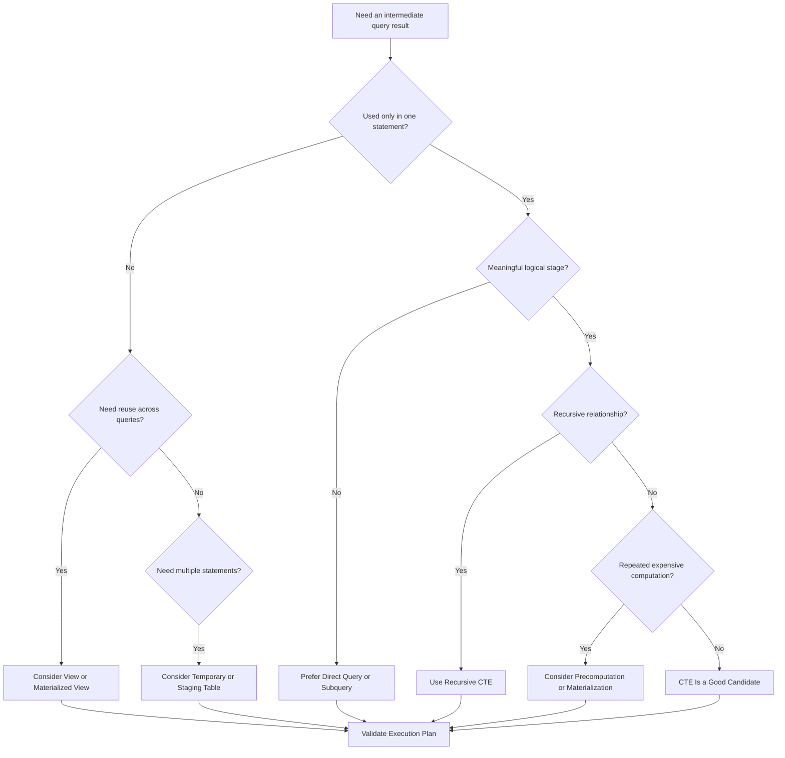

# 22- When Not to Use a CTE

## Overview

Common Table Expressions (CTEs) are valuable for structuring complex SQL, but they are not a universal replacement for subqueries, views, temporary tables, or application logic.

The most important rule is:

> **Use a CTE when its scope, structure, or semantics improve the query. Do not use one merely because the query can be written with `WITH`.**

A CTE is scoped to a single SQL statement. That makes it useful for composing intermediate relations, but it also makes it the wrong abstraction when data must persist beyond that statement, be reused across many queries, or be physically stored for repeated access.

A production decision should consider:

- Query readability.
- Intermediate-result reuse.
- Execution-plan behavior.
- Data volume.
- Lifetime of the intermediate data.
- Transaction boundaries.
- Frequency of execution.
- Whether the logic belongs in SQL or another architectural layer.

## When a CTE Is Usually Unnecessary

Avoid a CTE when it adds a name without adding meaningful structure.

### Trivial Transformation

Instead of:

```sql
WITH active_customers AS (
    SELECT id, email
    FROM customers
    WHERE status = 'active'
)
SELECT id, email
FROM active_customers;
```

prefer:

```sql
SELECT id, email
FROM customers
WHERE status = 'active';
```

The CTE introduces an additional query layer without making the logic easier to understand.

### Simple One-Use Derived Relation

A short subquery can be clearer when an intermediate result is used only once:

```sql
SELECT
    customer_id,
    revenue
FROM (
    SELECT
        customer_id,
        SUM(total_amount) AS revenue
    FROM orders
    GROUP BY customer_id
) AS customer_revenue
WHERE revenue >= 10000;
```

A CTE is not automatically more readable simply because it has a descriptive name.

## When a Subquery Is Better

A subquery is often the better choice when:

- The derived relation is used only once.
- The transformation is short.
- The logic is tightly coupled to its parent query.
- Giving the intermediate relation a separate name does not improve comprehension.

Compare:

```sql
SELECT
    customer_id,
    revenue
FROM (
    SELECT
        customer_id,
        SUM(total_amount) AS revenue
    FROM orders
    WHERE status = 'completed'
    GROUP BY customer_id
) AS revenue_by_customer
WHERE revenue >= 5000;
```

with:

```sql
WITH revenue_by_customer AS (
    SELECT
        customer_id,
        SUM(total_amount) AS revenue
    FROM orders
    WHERE status = 'completed'
    GROUP BY customer_id
)
SELECT
    customer_id,
    revenue
FROM revenue_by_customer
WHERE revenue >= 5000;
```

Both can be reasonable. The decision should be based on which structure makes the complete query easier to reason about.

## Do Not Use a CTE as a Performance Assumption

A common production mistake is treating CTE syntax as a performance optimization.

```sql
WITH filtered_orders AS (
    SELECT *
    FROM orders
    WHERE status = 'completed'
)
SELECT *
FROM filtered_orders;
```

The presence of a CTE does not guarantee:

- Faster execution.
- Reduced memory usage.
- Reduced I/O.
- Index usage.
- Materialization.
- A specific join strategy.

The optimizer determines the physical execution strategy according to the database engine and query.

For PostgreSQL, CTEs may be inlined in applicable situations, while materialization can also occur. PostgreSQL supports `MATERIALIZED` and `NOT MATERIALIZED` for explicit control in supported cases.

Therefore, do not rewrite a query merely because someone claims:

> "CTEs are faster."

Validate the actual execution plan:

```sql
EXPLAIN (ANALYZE, BUFFERS)
WITH recent_orders AS (
    SELECT
        customer_id,
        total_amount
    FROM orders
    WHERE created_at >= CURRENT_TIMESTAMP - INTERVAL '30 days'
)
SELECT
    customer_id,
    SUM(total_amount) AS revenue
FROM recent_orders
GROUP BY customer_id;
```

Performance decisions should be based on measured behavior rather than the SQL construct alone.

## Do Not Use CTEs for Persistent Reuse

A CTE exists only for its containing statement.

If the same derived relation is needed by many queries, repeating the CTE can create duplicated SQL logic:

```text
Query A ──► same CTE logic
Query B ──► same CTE logic
Query C ──► same CTE logic
```

This is a signal to consider a persistent database abstraction.

### View

Use a view when the derived relation should be reusable across statements.

```sql
CREATE VIEW active_customers AS
SELECT
    id,
    email,
    created_at
FROM customers
WHERE status = 'active';
```

Queries can then reference the view:

```sql
SELECT
    id,
    email
FROM active_customers
WHERE created_at >= CURRENT_DATE - INTERVAL '90 days';
```

A view provides a database-level reusable interface rather than a statement-local abstraction.

## Do Not Use a CTE for Expensive Repeated Computation

Suppose a large aggregation is required by many API requests:

```sql
WITH customer_revenue AS (
    SELECT
        customer_id,
        SUM(total_amount) AS revenue
    FROM orders
    GROUP BY customer_id
)
SELECT *
FROM customer_revenue
WHERE revenue >= 10000;
```

If this runs repeatedly over millions or billions of orders, the underlying aggregation may become a significant workload.

For frequently accessed analytical results, consider:

- Materialized views.
- Summary tables.
- Incrementally maintained aggregates.
- Data warehouses.
- Dedicated analytical pipelines.

The right solution depends on freshness requirements and workload characteristics.

```text
Raw transactional data
        │
        ▼
Expensive aggregation
        │
        ├── Infrequent → CTE may be sufficient
        │
        └── Frequent  → Consider precomputation
                              │
                    ┌─────────┼─────────┐
                    ▼         ▼         ▼
                Summary   Materialized  Warehouse
                 table       view
```

## Do Not Use a CTE When a Temporary Table Is Required

CTEs and temporary tables solve different problems.

A CTE is statement-scoped:

```text
SQL Statement
└── CTE
    └── Result exists for statement
```

A temporary table has a broader lifetime:

```text
Session / Transaction
└── Temporary Table
    ├── Statement A
    ├── Statement B
    └── Statement C
```

Use a temporary table when you need to:

- Reuse a large intermediate result across multiple statements.
- Create indexes on intermediate data.
- Inspect intermediate data interactively.
- Break a large transformation into separate statements.
- Control the lifetime of staged data explicitly.

Example:

```sql
CREATE TEMP TABLE customer_revenue AS
SELECT
    customer_id,
    SUM(total_amount) AS revenue
FROM orders
GROUP BY customer_id;

CREATE INDEX idx_customer_revenue_customer_id
    ON customer_revenue (customer_id);

SELECT
    customer_id,
    revenue
FROM customer_revenue
WHERE revenue >= 10000;
```

A temporary table introduces storage and lifecycle considerations, so it should not be used automatically either.

## Do Not Use a CTE When the Logic Belongs in Application Code

SQL is excellent at relational operations, but not every business rule belongs in a SQL statement.

Avoid turning a query into a miniature application when the logic requires:

- Complex external API calls.
- Domain workflows.
- Multiple independent side effects.
- Long-running processing.
- Retry orchestration.
- Message publication.
- Complex application-level validation.
- Business processes spanning multiple transactions.

For example:

```text
HTTP Request
    │
    ▼
Service Layer
    │
    ├── Validate domain rules
    ├── Read database
    ├── Call external service
    ├── Publish event
    └── Persist state
```

Trying to represent this entire workflow through increasingly complex CTEs creates the wrong abstraction boundary.

For Django or FastAPI applications, keep domain orchestration in the service/application layer and use SQL for the relational operations that belong in the database.

## Do Not Use CTEs to Hide Poor Data Modeling

A large CTE can sometimes compensate for a schema problem rather than solve it.

Warning signs include:

- Repeatedly reconstructing relationships through complex joins.
- Repeatedly parsing encoded data.
- Reconstructing aggregates that should be maintained.
- Repeating the same normalization logic.
- Requiring many CTEs just to retrieve basic domain information.

Before adding another query layer, ask:

> Is the query complicated because the business requirement is complicated, or because the data model is forcing unnecessary work?

A query abstraction should not conceal a structural database problem.

## Avoid Excessive CTE Layering

Multiple CTEs can be excellent:

```sql
WITH recent_orders AS (...),
customer_revenue AS (...),
ranked_customers AS (...)
SELECT ...
```

But excessive layering can become difficult to maintain:

```sql
WITH
a AS (...),
b AS (...),
c AS (...),
d AS (...),
e AS (...),
f AS (...),
g AS (...),
h AS (...)
SELECT ...
```

The number of CTEs is not itself the problem. The issue is whether each stage has a clear semantic purpose.

A useful review question is:

> Can another engineer understand why each intermediate relation exists without reconstructing the entire query?

If not, consider simplifying the query or moving part of the logic into a more appropriate abstraction.

## Avoid CTEs That Duplicate Logic

Do not copy essentially identical CTE definitions into multiple queries:

```text
Endpoint A ──► customer_status CTE
Endpoint B ──► customer_status CTE
Endpoint C ──► customer_status CTE
```

This creates maintenance risk.

A schema change, business-rule change, or security condition may require modifying several independent queries.

Consider:

- A view.
- A reusable query component in application code.
- A database function where appropriate.
- A shared repository abstraction.
- A schema redesign.

The correct choice depends on whether the logic is fundamentally a database concern or application concern.

## Avoid CTEs When Materialization Creates an Unwanted Barrier

Database-specific optimizer behavior matters.

In systems or query patterns where a CTE is materialized, the intermediate result may become an optimization boundary. That can prevent predicates from being pushed into the underlying query or cause a large intermediate result to be produced.

For example, conceptually:

```text
Base table
   │
   ▼
Large CTE result
   │
   ▼
Filter
```

may be less desirable than:

```text
Base table
   │
   ▼
Filter pushed closer to source
   │
   ▼
Smaller result
```

Whether this actually happens depends on the database engine, version, query, and optimizer.

Do not infer the behavior from SQL syntax. Inspect the plan.

## Do Not Use CTEs for Cross-Statement Workflows

A CTE cannot act as a durable staging area between independent statements.

If a workflow is:

```text
Statement A
    │
    ▼
Intermediate data
    │
    ▼
Statement B
    │
    ▼
Statement C
```

a CTE generally cannot represent the intermediate state across all three statements.

Depending on requirements, use:

- Temporary tables.
- Permanent staging tables.
- Application-managed state.
- Queue-backed processing.
- Transactional workflows.

This distinction becomes important in ETL, batch processing, migrations, and large data transformations.

## Avoid Using CTEs for Frequently Accessed API Data Without Measuring

A backend endpoint might execute:

```text
GET /customers/summary
        │
        ▼
Complex CTE query
        │
        ▼
Millions of rows scanned
        │
        ▼
Aggregate result
```

If this endpoint receives high traffic, database CPU can become the bottleneck.

Potential alternatives include:

- Redis for suitable cacheable results.
- Summary tables for transactional aggregates.
- Materialized views for periodically refreshed analytics.
- Read replicas for workloads suitable for replication.
- Dedicated analytical infrastructure.

Caching should not be used to hide an inefficient query indefinitely. First understand the database workload and query plan.

## Temporary Tables vs CTEs

| Requirement | CTE | Temporary Table |
|---|---:|---:|
| One SQL statement | Excellent | Usually unnecessary |
| Multiple statements | No | Excellent |
| Recursive query | Excellent | Possible but not natural |
| Reuse within statement | Excellent | Excellent |
| Add indexes to intermediate result | No | Yes |
| Inspect intermediate state | Limited | Excellent |
| Explicit persistent intermediate storage | No | Yes, within its lifetime |
| Simple query composition | Excellent | Overkill |
| Large staged transformation | Sometimes | Often better |

## View vs CTE

| Requirement | CTE | View |
|---|---:|---:|
| Statement-local logic | Excellent | No |
| Reuse across queries | No | Excellent |
| Named query stage | Excellent | Yes |
| Persistent database object | No | Yes |
| Versioned schema-level interface | No | Yes |
| Query-specific filtering | Excellent | Excellent |
| Recursive query | Excellent | Can expose recursive logic depending on database |
| Frequently reused definition | Poor fit | Better fit |

A view should not be chosen simply because it is reusable. Consider ownership, permissions, dependency management, schema evolution, and whether exposing the abstraction at the database level is appropriate.

## Materialized View vs CTE

A materialized view is appropriate when the result can tolerate some staleness in exchange for avoiding repeated expensive computation.

| Characteristic | CTE | Materialized View |
|---|---|---|
| Lifetime | One statement | Persistent |
| Computation | Usually during query execution | Precomputed |
| Freshness | Current source data according to query | Depends on refresh strategy |
| Reuse | One statement | Many statements |
| Storage | Query execution resources | Persistent storage |
| Refresh management | None | Required |
| Best fit | Query composition | Repeated expensive reads |

A materialized view introduces operational requirements such as refresh scheduling, refresh duration, storage growth, and stale-data handling.

## Performance and Scalability Considerations

When deciding against or in favor of a CTE, evaluate the entire workload rather than the query in isolation.

Important metrics include:

- Query execution time.
- CPU utilization.
- Logical and physical I/O.
- Rows scanned.
- Rows returned.
- Temporary file usage.
- Memory consumption.
- Lock duration.
- Query concurrency.
- Cache hit ratio.
- Replication impact.

For PostgreSQL, useful investigation commands include:

```sql
EXPLAIN (ANALYZE, BUFFERS)
SELECT ...;
```

For production workloads, database-level query monitoring such as `pg_stat_statements` can help identify queries whose cumulative cost matters more than their individual latency.

A query taking 100 ms once per hour is very different from a query taking 100 ms thousands of times per minute.

## Backend Engineering Example

Consider an API that returns customer revenue.

### CTE-Based Query

```sql
WITH customer_revenue AS (
    SELECT
        customer_id,
        SUM(total_amount) AS revenue
    FROM orders
    WHERE status = 'completed'
      AND created_at >= CURRENT_DATE - INTERVAL '12 months'
    GROUP BY customer_id
)
SELECT
    c.id,
    c.email,
    cr.revenue
FROM customers AS c
JOIN customer_revenue AS cr
    ON cr.customer_id = c.id
WHERE c.status = 'active'
ORDER BY cr.revenue DESC
LIMIT 100;
```

This may be an excellent choice for an administrative report or low-frequency endpoint.

But if the same query is executed thousands of times per minute, repeatedly aggregating a large `orders` table may be inappropriate.

A more scalable architecture might be:

```text
Orders
  │
  ▼
Aggregation process
  │
  ▼
Customer summary table
  │
  ├── API reads
  ├── Admin reads
  └── Reporting queries
```

The design decision is therefore not simply "CTE or no CTE." It is a workload and architecture decision.

## Security Considerations

Avoid using CTEs as a reason to bypass authorization logic.

For example, an application that allows access only to a user's organization must enforce that scope in the query:

```sql
WITH accessible_orders AS (
    SELECT
        id,
        customer_id,
        total_amount
    FROM orders
    WHERE organization_id = $1
)
SELECT
    customer_id,
    SUM(total_amount) AS revenue
FROM accessible_orders
GROUP BY customer_id;
```

The parameter should be bound by the database driver rather than interpolated into SQL.

The same security requirements apply regardless of whether the relation is expressed through:

- A CTE.
- A subquery.
- A view.
- A temporary table.
- A direct query.

## Common Mistakes and Pitfalls

| Mistake | Why It Happens | Better Approach |
|---|---|---|
| Using a CTE for every query | "CTEs are cleaner" becomes a blanket rule | Use them when they improve query structure |
| Assuming CTEs are faster | Confusing logical composition with execution strategy | Inspect `EXPLAIN` |
| Assuming CTEs are always slower | Applying outdated or database-specific assumptions universally | Measure the actual workload |
| Using CTEs for reusable business logic | Ignoring scope and ownership | Consider views or application abstractions |
| Repeating expensive CTEs across endpoints | Treating a statement-local computation as shared infrastructure | Precompute or cache where appropriate |
| Replacing temporary tables with huge CTEs | Ignoring multi-statement requirements | Use temporary or staging tables |
| Creating too many CTE layers | Optimizing for local readability instead of whole-query readability | Keep only meaningful stages |
| Using meaningless CTE names | Treating names as implementation details | Name intermediate relations by their semantics |
| Putting application workflows in SQL | Confusing relational operations with orchestration | Move orchestration to service code |
| Ignoring concurrency | Testing only one execution | Evaluate cumulative workload under realistic traffic |

## A Practical Decision Framework

Use this sequence during query design or review:



The key decision is to match the abstraction to the **lifetime and purpose of the intermediate data**.

## Production Review Checklist

Before introducing a CTE into production SQL, ask:

- Does the CTE represent a meaningful logical concept?
- Is a direct query or subquery simpler?
- Is the intermediate relation needed only by this statement?
- Does the query require recursion or staged transformations?
- Is the CTE reused within the statement?
- Could a view better represent reusable database logic?
- Could a temporary table better support multi-step processing?
- Is the computation expensive enough to justify precomputation?
- Have you checked the execution plan?
- Have you tested with production-scale data?
- Have you considered concurrent execution?
- Are authorization predicates preserved?
- Is the SQL still understandable to another engineer six months later?

## Interview Traps

### "When should you never use a CTE?"

There is no universal "never." CTEs are a query-composition tool, so the decision depends on the database engine, workload, query structure, and lifetime of the intermediate data.

### "Is a subquery always better for performance?"

No. A subquery and CTE can result in equivalent execution plans. Performance must be measured on the target database and workload.

### "Why not use a CTE instead of a temporary table?"

Because their lifetimes and capabilities differ. A CTE is statement-scoped, while a temporary table can survive across multiple statements and can generally be indexed and inspected independently.

### "Why not use a CTE instead of a view?"

A CTE is local to one statement. A view creates a reusable database object that can be referenced by many statements.

### "When should a CTE be replaced with a materialized view?"

When the same expensive computation is performed repeatedly and the workload can tolerate the materialized result's refresh/freshness model.

## Key Takeaways

- **Do not use a CTE when a direct query or short subquery expresses the same logic more clearly.**
- **CTEs are statement-scoped; use views, temporary tables, or materialized structures when the intermediate result must have a broader lifetime or reuse boundary.**
- **Never assume a CTE is faster or slower based solely on its syntax; validate the actual execution plan and workload.**
- **Avoid turning CTEs into a substitute for application workflows, persistent data modeling, or frequently reused expensive computations.**
- **Choose the abstraction based on semantics, lifetime, reuse, workload, and operational requirements—not on personal preference for `WITH` syntax.**