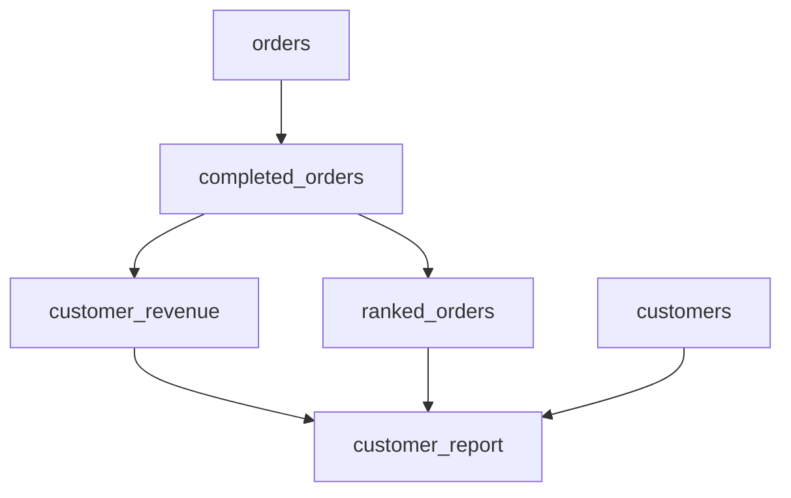
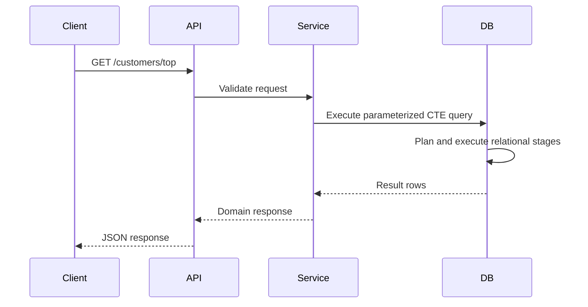
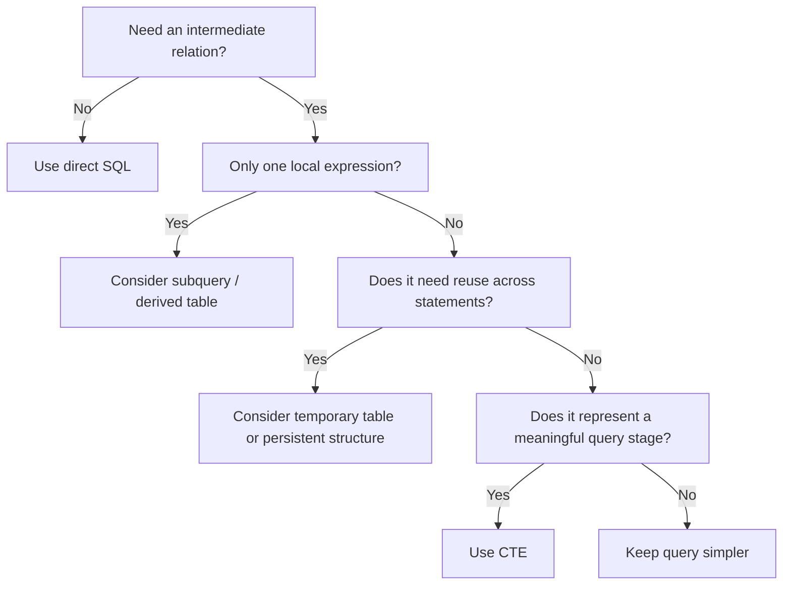

# README

## Overview

Common Table Expressions (CTEs) provide a named, statement-scoped relation that can be referenced by the main SQL statement and, when needed, by other CTEs in the same statement. They are primarily a **query composition mechanism**: they let complex relational transformations be expressed as a sequence of named stages.

This section focuses on using CTEs effectively in production SQL, especially in PostgreSQL-backed backend systems. The emphasis is not simply on CTE syntax, but on understanding when CTEs improve correctness and maintainability, when they introduce unnecessary complexity, and how they interact with query optimization, recursion, temporary tables, views, and derived tables.

A useful mental model is:

```text
Base tables
    │
    ▼
CTE: filter / normalize
    │
    ▼
CTE: aggregate / transform
    │
    ▼
CTE: rank / correlate
    │
    ▼
Final SELECT / INSERT / UPDATE / DELETE
```

CTEs are especially valuable when each stage represents a meaningful relational transformation.

## Navigation

- [01- CTE Introduction](./01-%20CTE%20Introduction.md) — Core concept, purpose, and when to use CTEs
- [02- CTE Syntax and Structure](./02-%20CTE%20Syntax%20and%20Structure.md) — WITH clause syntax and basic SQL structure
- [03- How CTEs Work](./03-%20How%20CTEs%20Work.md) — Logical query evaluation and optimizer behavior
- [04- Single CTE](./04-%20Single%20CTE.md) — Writing and using a single named relation
- [05- Multiple CTEs](./05-%20Multiple%20CTEs.md) — Composing multiple query stages
- [06- CTE Dependencies](./06-%20CTE%20Dependencies.md) — Relationships and execution order between CTEs
- [07- CTE with JOINs](./07-%20CTE%20with%20JOINs.md) — Join composition and cardinality within CTEs
- [08- CTE with Aggregations](./08-%20CTE%20with%20Aggregations.md) — Multi-stage aggregation patterns
- [09- CTE with Window Functions](./09-%20CTE%20with%20Window%20Functions.md) — Ranking and analytical queries using CTEs
- [10- CTE with INSERT UPDATE DELETE](./10-%20CTE%20with%20INSERT%20UPDATE%20DELETE.md) — Data modification statements using CTEs
- [11- Recursive CTEs](./11-%20Recursive%20CTEs.md) — Recursive query execution and termination
- [12- Recursive CTE Structure](./12-%20Recursive%20CTE%20Structure.md) — Anchor and recursive members
- [13- Recursive CTE Use Cases](./13-%20Recursive%20CTE%20Use%20Cases.md) — Hierarchies, trees, and graph traversal
- [14- CTE Naming and Readability Rules](./14-%20CTE%20Naming%20and%20Readability%20Rules.md) — Writing maintainable SQL with descriptive CTE names
- [15- CTE Scope and Lifetime](./15-%20CTE%20Scope%20and%20Lifetime.md) — Statement-level visibility and lifetime
- [16- CTE vs Subquery](./16-%20CTE%20vs%20Subquery.md) — Query composition choices
- [17- CTE vs Temporary Table](./17-%20CTE%20vs%20Temporary%20Table.md) — Intermediate-state storage choices
- [18- CTE vs View](./18-%20CTE%20vs%20View.md) — Query abstraction choices
- [19- CTE vs Derived Table](./19-%20CTE%20vs%20Derived%20Table.md) — Inline relational expressions
- [20- CTE Performance Considerations](./20-%20CTE%20Performance%20Considerations.md) — Materialization, execution plans, and optimization
- [21- When to Choose a CTE](./21-%20When%20to%20Choose%20a%20CTE.md) — Engineering decision-making criteria
- [22- When Not to Use a CTE](./22-%20When%20Not%20to%20Use%20a%20CTE.md) — Avoiding unnecessary CTEs
- [23- Practical CTE Patterns](./23-%20Practical%20CTE%20Patterns.md) — Reusable production query patterns
- [24- Common CTE Mistakes](./24-%20Common%20CTE%20Mistakes.md) — Failure modes and pitfalls

## Core Concepts

### Logical Query Composition

A CTE allows a complex query to be divided into named relational stages.

```sql
WITH completed_orders AS (
    SELECT
        customer_id,
        total_amount
    FROM orders
    WHERE status = 'completed'
),
customer_revenue AS (
    SELECT
        customer_id,
        SUM(total_amount) AS revenue
    FROM completed_orders
    GROUP BY customer_id
)
SELECT
    customer_id,
    revenue
FROM customer_revenue
WHERE revenue >= 10000;
```

The important benefit is not the keyword `WITH`. It is the explicit separation of transformations:

```text
orders
  │
  ├── filter completed orders
  │
  ▼
completed_orders
  │
  ├── aggregate by customer
  │
  ▼
customer_revenue
  │
  └── filter qualifying customers
```

Each stage should have a clear purpose and an understood row grain.

### Row Grain

Before joining or aggregating CTEs, identify what one row represents.

For example:

| Relation | Row Grain |
|---|---|
| `orders` | One row per order |
| `completed_orders` | One row per completed order |
| `customer_revenue` | One row per customer |
| `ranked_orders` | One row per order with ranking metadata |

Many production SQL bugs come from losing track of this grain.

A senior-level review should ask:

> "What does one row in this CTE represent?"

before asking whether the SQL is syntactically correct.

## CTE Composition

Multiple CTEs can form a dependency graph.



This structure is useful when each CTE performs a distinct transformation.

Avoid creating CTEs merely to split a simple expression into multiple names. Excessive fragmentation can make SQL harder to trace.

A useful guideline is:

> One CTE should normally represent one meaningful transformation or business-relevant relation.

## Recursive CTEs

Recursive CTEs extend normal CTE composition to iterative traversal.

Typical use cases include:

- Organization hierarchies.
- Category trees.
- Folder structures.
- Dependency graphs.
- Bill-of-materials structures.
- Graph traversal.

A recursive CTE contains:

1. An **anchor query** that establishes the starting rows.
2. A recursive query that references the CTE itself.
3. A termination condition, either explicit or implicit through the relationship.

Example:

```sql
WITH RECURSIVE employee_tree AS (
    SELECT
        id,
        manager_id,
        name,
        0 AS depth
    FROM employees
    WHERE id = $1

    UNION ALL

    SELECT
        e.id,
        e.manager_id,
        e.name,
        et.depth + 1
    FROM employees AS e
    JOIN employee_tree AS et
        ON e.manager_id = et.id
    WHERE et.depth < 50
)
SELECT
    id,
    manager_id,
    name,
    depth
FROM employee_tree
ORDER BY depth, id;
```

Recursive queries require additional operational consideration because depth and branching can cause result growth much faster than a normal query.

## CTEs and Materialization

A CTE should not automatically be interpreted as a temporary table.

In PostgreSQL, the optimizer can inline eligible CTEs rather than materializing them. PostgreSQL also supports explicit materialization controls:

```sql
WITH expensive_result AS MATERIALIZED (
    SELECT
        customer_id,
        SUM(total_amount) AS revenue
    FROM orders
    GROUP BY customer_id
)
SELECT ...
FROM expensive_result;
```

And:

```sql
WITH recent_orders AS NOT MATERIALIZED (
    SELECT
        customer_id,
        total_amount
    FROM orders
    WHERE created_at >= CURRENT_DATE - INTERVAL '30 days'
)
SELECT ...
FROM recent_orders;
```

The correct choice depends on the query plan and workload.

For PostgreSQL performance investigation:

```sql
EXPLAIN (ANALYZE, BUFFERS)
WITH ...
SELECT ...;
```

Do not assume that changing CTE syntax will improve performance without measuring the resulting plan.

## CTEs vs Other Query Structures

CTEs are one of several mechanisms for composing SQL.

| Technique | Lifetime | Reusable Across Statements | Typical Purpose |
|---|---|---:|---|
| CTE | One statement | No | Logical query composition |
| Subquery | One query expression | No | Local transformation |
| Derived table | One query expression | No | Inline relation |
| Temporary table | Session/transaction dependent | Yes | Materialized intermediate state |
| View | Persistent database object | Yes | Reusable logical abstraction |
| Materialized view | Persistent stored result | Yes | Precomputed query result |

The correct choice depends on whether the intermediate relation needs:

- Persistence.
- Reuse.
- Indexing.
- Independent statistics.
- Independent lifecycle management.
- Refresh semantics.
- Cross-statement access.

## CTEs With Aggregations

CTEs are particularly useful for preventing accidental aggregation across multiple one-to-many joins.

For example:

```sql
WITH order_totals AS (
    SELECT
        customer_id,
        SUM(total_amount) AS revenue
    FROM orders
    GROUP BY customer_id
),
ticket_totals AS (
    SELECT
        customer_id,
        COUNT(*) AS ticket_count
    FROM support_tickets
    GROUP BY customer_id
)
SELECT
    c.id,
    COALESCE(ot.revenue, 0) AS revenue,
    COALESCE(tt.ticket_count, 0) AS ticket_count
FROM customers AS c
LEFT JOIN order_totals AS ot
    ON ot.customer_id = c.id
LEFT JOIN ticket_totals AS tt
    ON tt.customer_id = c.id;
```

Each aggregate establishes a one-row-per-customer relation before the final joins.

This is often safer than joining both one-to-many relations and aggregating afterward.

## CTEs With Window Functions

A common pattern is to calculate ranking metadata in one stage and filter it in another.

```sql
WITH ranked_orders AS (
    SELECT
        id,
        customer_id,
        total_amount,
        created_at,
        ROW_NUMBER() OVER (
            PARTITION BY customer_id
            ORDER BY created_at DESC, id DESC
        ) AS row_number
    FROM orders
)
SELECT
    id,
    customer_id,
    total_amount,
    created_at
FROM ranked_orders
WHERE row_number = 1;
```

This is useful for patterns such as:

- Latest row per entity.
- Top N records per group.
- Deduplication.
- Ranking.
- Pagination-related transformations.

Always make ordering deterministic when correctness depends on which row is selected.

## CTEs With Data Modification

CTEs can participate in data-modifying statements.

For example:

```sql
WITH expired_sessions AS (
    SELECT id
    FROM sessions
    WHERE expires_at < CURRENT_TIMESTAMP
)
DELETE FROM sessions AS s
USING expired_sessions AS es
WHERE s.id = es.id;
```

This can make complex mutations easier to reason about, but large write operations require additional operational analysis.

Consider:

- Lock duration.
- Transaction size.
- WAL generation.
- Replication lag.
- Vacuum pressure.
- Concurrent application traffic.
- Failure and rollback behavior.

For high-volume cleanup jobs, batching may be safer than a single large mutation.

## Naming and Readability

CTE names should describe the relation rather than the implementation.

Prefer:

```sql
WITH eligible_orders AS (...),
customer_revenue AS (...),
latest_payment_attempt AS (...)
```

Avoid:

```sql
WITH temp1 AS (...),
data AS (...),
result2 AS (...)
```

A good CTE name helps communicate:

- Subject.
- Business meaning.
- Expected row grain.
- Transformation stage.

Column names should also remain explicit.

Prefer:

```sql
SELECT
    customer_id,
    SUM(total_amount) AS total_revenue
```

over ambiguous expressions such as:

```sql
SELECT
    id,
    SUM(amount)
```

when the resulting relation will be consumed by multiple later stages.

## Scope and Lifetime

A CTE exists only for the statement in which it is defined.

This is valid:

```sql
WITH customer_totals AS (
    SELECT
        customer_id,
        SUM(total_amount) AS revenue
    FROM orders
    GROUP BY customer_id
)
SELECT *
FROM customer_totals;
```

This is not:

```sql
WITH customer_totals AS (
    SELECT
        customer_id,
        SUM(total_amount) AS revenue
    FROM orders
    GROUP BY customer_id
)
SELECT *
FROM customer_totals;

SELECT *
FROM customer_totals;
```

If the result must be accessed by multiple independent statements, use an appropriate persistent or temporary database object.

## Choosing Between a CTE and a Subquery

Prefer a CTE when:

- A transformation deserves a name.
- Multiple stages need to be composed.
- The same logical result is referenced more than once within the statement.
- The query benefits from a clear top-down structure.
- Recursive behavior is required.

Prefer a subquery or derived table when:

- The transformation is local to one expression.
- Naming it separately adds little value.
- The query is already simple.
- Keeping the relation inline improves readability.

Neither construct should be selected based purely on a belief that one is inherently faster.

## Choosing Between a CTE and a Temporary Table

A temporary table becomes more attractive when the intermediate result:

- Must survive across multiple statements.
- Is reused repeatedly.
- Benefits from indexes.
- Is expensive to compute once but cheap to reuse.
- Requires explicit intermediate state.
- Needs independent statistics or database operations.

A CTE is generally preferable when the intermediate relation exists only to compose one statement.

## Choosing Between a CTE and a View

A view is appropriate when a logical relation has a stable, reusable database-level meaning.

For example:

```sql
CREATE VIEW active_customers AS
SELECT
    id,
    organization_id,
    email
FROM customers
WHERE status = 'active';
```

A CTE is better when the transformation is specific to one query.

The distinction is primarily lifecycle and ownership:

```text
CTE
└── query-specific abstraction

View
└── persistent database abstraction
```

Do not turn every complicated query into a view. Views create a database object with its own dependency and schema-management implications.

## When Not to Use a CTE

A CTE may be the wrong abstraction when:

- A simple query can express the intent directly.
- A subquery is clearer.
- A temporary table is required across multiple statements.
- A persistent view is the real domain abstraction.
- A materialized view is required for repeated expensive reads.
- Excessive CTE nesting obscures the query.
- The query is being fragmented solely to make it appear structured.
- Performance assumptions are being made without examining the execution plan.

The goal is not to maximize CTE usage.

The goal is to express relational intent clearly and execute it reliably.

## Practical Production Patterns

### Aggregate Independent Relations

Use separate CTEs to establish independent aggregation grains before joining.

```sql
WITH customer_orders AS (
    SELECT
        customer_id,
        COUNT(*) AS order_count,
        SUM(total_amount) AS order_revenue
    FROM orders
    WHERE status = 'completed'
    GROUP BY customer_id
),
customer_refunds AS (
    SELECT
        customer_id,
        SUM(amount) AS refund_amount
    FROM refunds
    WHERE status = 'approved'
    GROUP BY customer_id
)
SELECT
    c.id,
    COALESCE(co.order_count, 0) AS order_count,
    COALESCE(co.order_revenue, 0) AS order_revenue,
    COALESCE(cr.refund_amount, 0) AS refund_amount
FROM customers AS c
LEFT JOIN customer_orders AS co
    ON co.customer_id = c.id
LEFT JOIN customer_refunds AS cr
    ON cr.customer_id = c.id;
```

### Filter Before Expensive Transformations

When semantically safe, reduce the working set before expensive operations.

```sql
WITH recent_completed_orders AS (
    SELECT
        id,
        customer_id,
        total_amount,
        created_at
    FROM orders
    WHERE status = 'completed'
      AND created_at >= CURRENT_DATE - INTERVAL '30 days'
)
SELECT
    customer_id,
    SUM(total_amount) AS revenue
FROM recent_completed_orders
GROUP BY customer_id;
```

The optimizer may perform equivalent predicate pushdown itself, but expressing the intended relational stage can still improve maintainability.

### Latest Row Per Entity

```sql
WITH ranked_payments AS (
    SELECT
        id,
        customer_id,
        status,
        created_at,
        ROW_NUMBER() OVER (
            PARTITION BY customer_id
            ORDER BY created_at DESC, id DESC
        ) AS rn
    FROM payment_attempts
)
SELECT
    id,
    customer_id,
    status,
    created_at
FROM ranked_payments
WHERE rn = 1;
```

The deterministic secondary ordering prevents ambiguous results when timestamps are equal.

### Multi-Stage Reporting Query

A production reporting query can use CTEs to make business transformations explicit:

```sql
WITH eligible_orders AS (
    SELECT
        id,
        customer_id,
        total_amount
    FROM orders
    WHERE organization_id = $1
      AND status = 'completed'
      AND created_at >= $2
),
customer_revenue AS (
    SELECT
        customer_id,
        SUM(total_amount) AS revenue
    FROM eligible_orders
    GROUP BY customer_id
),
ranked_customers AS (
    SELECT
        customer_id,
        revenue,
        RANK() OVER (ORDER BY revenue DESC) AS revenue_rank
    FROM customer_revenue
)
SELECT
    customer_id,
    revenue,
    revenue_rank
FROM ranked_customers
WHERE revenue_rank <= 10
ORDER BY revenue_rank, customer_id;
```

This structure is easier to review because tenant filtering, aggregation, ranking, and final selection are explicit stages.

## Security Considerations

CTEs do not create security boundaries.

For multi-tenant applications, authorization and tenant predicates must still be enforced.

Prefer:

```sql
WITH accessible_orders AS (
    SELECT
        customer_id,
        total_amount
    FROM orders
    WHERE organization_id = $1
)
SELECT
    customer_id,
    SUM(total_amount) AS revenue
FROM accessible_orders
GROUP BY customer_id;
```

Use parameter binding from the application layer.

```python
cursor.execute(
    sql,
    [organization_id],
)
```

Do not construct SQL by interpolating user-controlled values.

For sensitive PostgreSQL applications, database-level controls such as Row-Level Security can provide an additional defense layer, but application authorization and database policies must be designed consistently.

## Performance and Scalability

CTEs should be evaluated as part of the complete execution plan.

For PostgreSQL:

```sql
EXPLAIN (ANALYZE, BUFFERS)
WITH customer_revenue AS (
    SELECT
        customer_id,
        SUM(total_amount) AS revenue
    FROM orders
    WHERE status = 'completed'
    GROUP BY customer_id
)
SELECT
    c.id,
    cr.revenue
FROM customers AS c
JOIN customer_revenue AS cr
    ON cr.customer_id = c.id;
```

Review:

- Estimated versus actual row counts.
- Sequential scans.
- Index scans.
- Join strategies.
- Sort operations.
- Hash operations.
- Temporary reads and writes.
- Memory spills.
- Execution time.
- Buffer usage.

For recursive queries, also evaluate:

- Maximum depth.
- Branching factor.
- Cycle behavior.
- Result cardinality.
- Indexes on traversal columns.

For high-throughput backend APIs, avoid putting an unbounded or expensive CTE query directly on a latency-sensitive request path without measuring it under realistic concurrency.

## Monitoring and Operations

CTE-specific monitoring is usually unnecessary. Monitor the resulting SQL workload instead.

Important signals include:

| Signal | Why It Matters |
|---|---|
| Query latency | Detects slow API/database operations |
| Rows returned | Identifies unexpectedly large results |
| Rows scanned | Indicates inefficient access patterns |
| CPU usage | Shows expensive computation |
| I/O and buffer activity | Indicates storage pressure |
| Temporary file usage | Can reveal large sorts/hashes/intermediates |
| Lock wait time | Important for data-modifying CTEs |
| Replication lag | Important for large write operations |
| Query frequency | Determines cumulative workload cost |

Use the database's query statistics and observability tooling to identify expensive statements rather than optimizing CTEs in isolation.

## Backend Application Integration

CTEs are often useful in data-access layers of Django, FastAPI, or other backend services when the query represents a complex relational operation that is difficult or inefficient to express through the ORM.

A typical request path might look like:



The CTE remains a database-side implementation detail. The API should expose business-level results rather than leaking SQL structure into the external contract.

For frequently executed queries:

- Keep SQL in a dedicated data-access boundary.
- Use parameterized queries.
- Add integration tests for edge cases.
- Capture query latency.
- Review execution plans after significant schema or data-volume changes.
- Avoid embedding large raw SQL strings throughout request handlers.

## Testing Strategy

Test CTE-based queries at three levels.

### Semantic Tests

Verify:

- Expected row count.
- Correct aggregation.
- Correct joins.
- Correct `NULL` behavior.
- Deterministic latest-row selection.
- Correct tenant isolation.
- Correct recursive traversal.

### Scale Tests

Use realistic:

- Dataset sizes.
- Cardinalities.
- Data skew.
- Hierarchy depth.
- Concurrent request volume.

### Database Plan Tests

For important performance-sensitive queries, inspect execution plans after changes to:

- Schema.
- Indexes.
- Query structure.
- Database version.
- Data volume.

Do not make execution-plan assertions unnecessarily brittle in application tests. Instead, use controlled performance testing and database observability where appropriate.

## Common Pitfalls

| Pitfall | Why It Happens | Better Practice |
|---|---|---|
| Treating CTEs as temporary tables | Confusing logical and physical concepts | Understand scope and materialization |
| Assuming CTEs improve performance | Equating structure with optimization | Measure with execution plans |
| Losing row grain | Focusing on syntax instead of cardinality | Document what one row represents |
| Aggregating after multiplying joins | Joining multiple one-to-many relations | Aggregate independently first |
| Excessive CTE fragmentation | Treating every expression as a stage | Create meaningful logical boundaries |
| `SELECT *` everywhere | Convenience | Project required columns |
| Unbounded recursion | Ignoring graph size and cycles | Add termination and operational bounds |
| Missing indexes for recursion | Ignoring traversal access paths | Index relationship columns |
| Filtering outer joins incorrectly | Misunderstanding `NULL` semantics | Place predicates intentionally |
| Using `MAX()` for complete latest rows | Confusing value aggregation with row selection | Use window functions or appropriate row-selection logic |
| Missing authorization predicates | Treating SQL composition as security | Enforce tenant/access constraints |
| Large transactional mutations | Ignoring operational impact | Batch and monitor where appropriate |
| Using a CTE for persistent state | Misunderstanding lifetime | Use temporary or persistent structures |
| Testing only small datasets | Development data is unrepresentative | Test realistic production scale |

## Interview-Level Distinctions

A strong understanding of CTEs requires more than knowing the `WITH` syntax.

| Question | Strong Answer |
|---|---|
| Are CTEs temporary tables? | No. A CTE is a statement-scoped query expression; physical execution and materialization depend on the database and optimizer. |
| Are CTEs always faster than subqueries? | No. Equivalent formulations can produce the same execution plan. Measure the actual query. |
| When is a CTE useful? | When a query contains meaningful relational stages, repeated intermediate logic, or recursive traversal. |
| When is a temporary table better? | When intermediate data must survive across statements, be indexed, or be reused independently. |
| Can a CTE be recursive? | Yes, using recursive CTE syntax supported by the database. |
| What is the biggest CTE performance mistake? | Optimizing based on assumptions instead of inspecting the execution plan and measuring realistic workloads. |
| What is the biggest correctness mistake? | Losing track of row grain and producing incorrect cardinality through joins or aggregation. |
| Does a CTE guarantee ordering? | No. A final `ORDER BY` is required when result ordering is part of the contract. |
| Does a CTE provide security isolation? | No. Authorization and tenant boundaries must still be enforced. |

## Engineering Decision Framework

When deciding whether to introduce a CTE, evaluate the query in this order:



The decision should be driven by:

- Query clarity.
- Relation grain.
- Reuse requirements.
- Scope and lifetime.
- Optimizer behavior.
- Execution cost.
- Operational characteristics.
- Maintainability.

A CTE is a good abstraction when it makes the relational logic easier to reason about without introducing unnecessary execution or maintenance complexity.


## Key Takeaways

- **CTEs are primarily a query-composition mechanism; their value comes from clear relational stages, not from an inherent performance advantage.**
- **Treat row grain, join cardinality, aggregation semantics, and authorization boundaries as first-class concerns when composing CTEs.**
- **Choose CTEs, subqueries, derived tables, temporary tables, views, and materialized views according to scope, reuse, lifecycle, and workload requirements.**
- **For production queries, validate actual execution behavior with realistic data, execution plans, monitoring, and concurrency rather than relying on assumptions about CTEs.**
- **Recursive CTEs and large data-modifying CTEs require additional safeguards around termination, indexes, transaction size, locks, and resource consumption.**