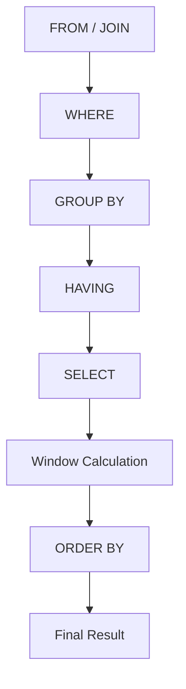

# 01- Window Functions Introduction

## Overview

Window functions perform calculations across a related set of rows while **preserving the individual rows of the query result**. Unlike `GROUP BY`, which collapses multiple rows into one row per group, a window function adds derived information to each row without changing the result's row grain.

This makes window functions fundamental for production SQL involving:

- Ranking and leaderboards.
- Running totals.
- Moving averages.
- Latest-row selection.
- Top-N-per-group queries.
- Comparing a row with previous or next rows.
- Percentiles and distribution analysis.
- Time-series analysis.
- Deduplication.
- Pagination and analytical reporting.

A window function is best understood as:

> **Compute a value using a defined window of related rows while retaining the current row.**

Example:

```sql
SELECT
    id,
    customer_id,
    total_amount,
    SUM(total_amount) OVER (
        PARTITION BY customer_id
    ) AS customer_total
FROM orders;
```

If a customer has five orders, all five rows remain in the result, but each row receives that customer's total.

## Why Window Functions Exist

Many analytical requirements are difficult or inefficient to express using only joins, subqueries, or `GROUP BY`.

Consider this requirement:

> Return every order together with the customer's total order value.

A normal aggregation produces one row per customer:

```sql
SELECT
    customer_id,
    SUM(total_amount) AS customer_total
FROM orders
GROUP BY customer_id;
```

That loses the individual order rows.

A window function preserves them:

```sql
SELECT
    id,
    customer_id,
    total_amount,
    SUM(total_amount) OVER (
        PARTITION BY customer_id
    ) AS customer_total
FROM orders;
```

The difference is fundamental:

| Technique | Rows preserved? | Typical purpose |
|---|---:|---|
| `GROUP BY` | No | Reduce rows into groups |
| Window function | Yes | Calculate across related rows |
| Scalar subquery | Yes | Calculate a related value |
| Join | Usually | Combine relations |

Window functions bridge the gap between **row-level data** and **group-level analysis**.

## Basic Syntax

The general structure is:

```sql
function_name(expression) OVER (
    [PARTITION BY partition_expression]
    [ORDER BY order_expression]
    [frame_clause]
)
```

For example:

```sql
SELECT
    id,
    customer_id,
    total_amount,
    SUM(total_amount) OVER (
        PARTITION BY customer_id
        ORDER BY created_at
    ) AS running_total
FROM orders;
```

The components have different responsibilities:

| Component | Purpose |
|---|---|
| Function | Defines the calculation |
| `OVER` | Converts the function into a window calculation |
| `PARTITION BY` | Defines independent groups |
| `ORDER BY` | Defines row sequence inside each partition |
| Frame | Defines the exact subset of rows used by the calculation |

Not every window function needs every component.

## Window Function vs Aggregate Function

The same function can behave very differently depending on whether it is used with `GROUP BY` or `OVER`.

### Aggregate

```sql
SELECT
    customer_id,
    SUM(total_amount) AS total_amount
FROM orders
GROUP BY customer_id;
```

Result:

```text
customer_id | total_amount
------------+-------------
101         | 2500
102         | 1800
```

### Window Aggregate

```sql
SELECT
    id,
    customer_id,
    total_amount,
    SUM(total_amount) OVER (
        PARTITION BY customer_id
    ) AS customer_total
FROM orders;
```

Result:

```text
id | customer_id | total_amount | customer_total
---+-------------+--------------+---------------
1  | 101         | 1000         | 2500
2  | 101         | 1500         | 2500
3  | 102         | 1800         | 1800
```

The aggregate collapses rows.

The window aggregate annotates rows.

## Window Partitions

`PARTITION BY` divides the result into independent logical groups.

```sql
SELECT
    id,
    customer_id,
    total_amount,
    SUM(total_amount) OVER (
        PARTITION BY customer_id
    ) AS customer_total
FROM orders;
```

Conceptually:

```text
All orders
│
├── customer 101
│   ├── order 1
│   ├── order 2
│   └── order 3
│
├── customer 102
│   ├── order 4
│   └── order 5
│
└── customer 103
    └── order 6
```

The window calculation is performed independently inside each partition.

Without `PARTITION BY`:

```sql
SUM(total_amount) OVER ()
```

the entire result set becomes one window.

## Window Ordering

`ORDER BY` defines the logical sequence within a window.

For example:

```sql
SELECT
    id,
    customer_id,
    created_at,
    total_amount,
    SUM(total_amount) OVER (
        PARTITION BY customer_id
        ORDER BY created_at
    ) AS running_total
FROM orders;
```

The database processes each customer's rows in the specified order for purposes of the window calculation.

This enables calculations such as:

- Running totals.
- Previous value.
- Next value.
- Ranking.
- Sequential comparisons.

Ordering inside a window is independent of the final result ordering.

For example:

```sql
SELECT
    id,
    created_at,
    ROW_NUMBER() OVER (
        ORDER BY created_at
    ) AS sequence_number
FROM orders
ORDER BY id;
```

The window numbering follows `created_at`, while the final result follows `id`.

Always distinguish:

```text
Window ORDER BY
    ↓
Controls calculation

Final ORDER BY
    ↓
Controls returned row order
```

## Window Frames

A window frame defines the subset of rows considered for a window calculation.

For example:

```sql
SUM(total_amount) OVER (
    ORDER BY created_at
    ROWS BETWEEN UNBOUNDED PRECEDING AND CURRENT ROW
)
```

This represents a running total from the beginning of the window through the current row.

Common frame concepts include:

| Frame | Meaning |
|---|---|
| `UNBOUNDED PRECEDING` | Start of partition |
| `CURRENT ROW` | Current row |
| `UNBOUNDED FOLLOWING` | End of partition |
| `N PRECEDING` | N rows before current row |
| `N FOLLOWING` | N rows after current row |

Example moving average:

```sql
AVG(total_amount) OVER (
    ORDER BY created_at
    ROWS BETWEEN 6 PRECEDING AND CURRENT ROW
) AS seven_row_average
```

A critical production consideration is that **`ROWS` and `RANGE` do not necessarily mean the same thing**, especially when the window ordering contains duplicate values.

For deterministic business logic, explicitly specify the frame when the default behavior could be ambiguous.

## Common Window Function Categories

Window functions can be grouped into several practical categories.

| Category | Functions / Examples | Typical Use |
|---|---|---|
| Ranking | `ROW_NUMBER`, `RANK`, `DENSE_RANK` | Leaderboards, top-N |
| Navigation | `LAG`, `LEAD` | Previous/next row comparisons |
| Value selection | `FIRST_VALUE`, `LAST_VALUE` | Boundary values |
| Distribution | `PERCENT_RANK`, `CUME_DIST`, `NTILE` | Percentiles and segmentation |
| Aggregate windows | `SUM`, `AVG`, `COUNT`, `MIN`, `MAX` | Running/group totals |
| Statistical | Database-specific functions | Analytics |

The most important functions for backend engineering are usually:

```text
ROW_NUMBER
RANK
DENSE_RANK
LAG
LEAD
SUM
COUNT
AVG
MIN
MAX
```

## Ranking Functions

### `ROW_NUMBER`

Assigns a unique sequential number to each row in a window.

```sql
SELECT
    id,
    customer_id,
    created_at,
    ROW_NUMBER() OVER (
        PARTITION BY customer_id
        ORDER BY created_at DESC, id DESC
    ) AS row_number
FROM orders;
```

This is commonly used for:

- Latest row per entity.
- Deduplication.
- Top N per group.

For example:

```sql
WITH ranked_orders AS (
    SELECT
        id,
        customer_id,
        created_at,
        total_amount,
        ROW_NUMBER() OVER (
            PARTITION BY customer_id
            ORDER BY created_at DESC, id DESC
        ) AS rn
    FROM orders
)
SELECT
    id,
    customer_id,
    created_at,
    total_amount
FROM ranked_orders
WHERE rn = 1;
```

The secondary `id DESC` ordering makes the selection deterministic when timestamps are equal.

### `RANK`

Rows with equal ordering values receive the same rank, and subsequent ranks contain gaps.

```sql
SELECT
    customer_id,
    revenue,
    RANK() OVER (
        ORDER BY revenue DESC
    ) AS revenue_rank
FROM customer_revenue;
```

Example:

```text
revenue | rank
--------+-----
10000   | 1
10000   | 1
8000    | 3
7000    | 4
```

### `DENSE_RANK`

Like `RANK`, but does not leave gaps.

```text
revenue | dense_rank
--------+-----------
10000   | 1
10000   | 1
8000    | 2
7000    | 3
```

Choose based on business semantics rather than preference.

## Navigation Functions

`LAG` accesses an earlier row in the window.

```sql
SELECT
    created_at,
    total_amount,
    LAG(total_amount) OVER (
        ORDER BY created_at
    ) AS previous_amount
FROM orders;
```

This is useful for:

- Comparing current and previous events.
- Detecting changes.
- Time-series analysis.
- Calculating deltas.

Example:

```sql
SELECT
    created_at,
    total_amount,
    total_amount
        - LAG(total_amount) OVER (
            ORDER BY created_at
        ) AS amount_change
FROM orders;
```

`LEAD` performs the opposite operation:

```sql
SELECT
    created_at,
    total_amount,
    LEAD(total_amount) OVER (
        ORDER BY created_at
    ) AS next_amount
FROM orders;
```

## Aggregate Window Functions

Regular aggregates can also be used as window functions.

### Running Total

```sql
SELECT
    id,
    created_at,
    total_amount,
    SUM(total_amount) OVER (
        ORDER BY created_at, id
        ROWS BETWEEN UNBOUNDED PRECEDING AND CURRENT ROW
    ) AS running_total
FROM orders;
```

### Partition Total

```sql
SELECT
    id,
    customer_id,
    total_amount,
    SUM(total_amount) OVER (
        PARTITION BY customer_id
    ) AS customer_total
FROM orders;
```

### Average Within a Group

```sql
SELECT
    id,
    customer_id,
    total_amount,
    AVG(total_amount) OVER (
        PARTITION BY customer_id
    ) AS customer_average
FROM orders;
```

This allows each row to be compared against its group's aggregate.

## Window Functions and Query Processing

Window functions conceptually operate after the query has established its relevant row set.

A simplified logical flow is:



The exact internal execution plan is optimizer-dependent, so this should be treated as a logical model rather than a physical execution guarantee.

One important consequence is that you generally cannot directly use a window function in `WHERE` at the same query level.

This does not work:

```sql
SELECT
    id,
    ROW_NUMBER() OVER (
        ORDER BY created_at DESC
    ) AS rn
FROM orders
WHERE rn = 1;
```

Instead, calculate the window value in an inner query or CTE:

```sql
WITH ranked_orders AS (
    SELECT
        id,
        created_at,
        ROW_NUMBER() OVER (
            ORDER BY created_at DESC
        ) AS rn
    FROM orders
)
SELECT
    id,
    created_at
FROM ranked_orders
WHERE rn = 1;
```

This is one of the most important patterns to understand before using window functions extensively.

## Window Functions and CTEs

CTEs pair naturally with window functions when the calculated window value becomes an input to a later relational operation.

```sql
WITH ranked_orders AS (
    SELECT
        id,
        customer_id,
        total_amount,
        created_at,
        ROW_NUMBER() OVER (
            PARTITION BY customer_id
            ORDER BY created_at DESC, id DESC
        ) AS rn
    FROM orders
)
SELECT
    id,
    customer_id,
    total_amount,
    created_at
FROM ranked_orders
WHERE rn = 1;
```

The CTE establishes a relation containing the ranking metadata. The outer query can then filter it.

This separation is especially useful for:

- Top-N-per-group queries.
- Deduplication.
- Latest-state queries.
- Multi-stage analytical transformations.

## Window Functions vs `GROUP BY`

The distinction should be explicit in production SQL.

| Requirement | `GROUP BY` | Window Function |
|---|---:|---:|
| Aggregate rows | Yes | Yes |
| Preserve individual rows | No | Yes |
| Running total | Awkward | Natural |
| Rank rows | No | Natural |
| Previous-row comparison | No | Natural |
| Group-level value on every row | Requires join/subquery | Natural |
| Top N per group | Requires additional logic | Natural |

A useful rule:

> If you need to reduce rows, start with aggregation. If you need to keep rows while analyzing their relationship to other rows, consider a window function.

## Practical Backend Example

Consider an API that returns each customer's latest five orders.

A window function provides a direct relational solution:

```sql
WITH ranked_orders AS (
    SELECT
        id,
        customer_id,
        total_amount,
        created_at,
        ROW_NUMBER() OVER (
            PARTITION BY customer_id
            ORDER BY created_at DESC, id DESC
        ) AS rn
    FROM orders
    WHERE organization_id = $1
)
SELECT
    id,
    customer_id,
    total_amount,
    created_at
FROM ranked_orders
WHERE rn <= 5
ORDER BY customer_id, created_at DESC, id DESC;
```

The application can then expose the result through Django, FastAPI, or another backend framework.

The database performs the ranking close to the data instead of:

1. Fetching all orders.
2. Loading them into Python.
3. Grouping them in application memory.
4. Sorting each customer's records.
5. Keeping only five rows.

For large datasets, pushing relational work into the database can significantly reduce network transfer and application memory usage, provided the SQL plan is efficient.

## Deterministic Ordering

Window functions that depend on ordering should use deterministic ordering whenever business correctness matters.

Avoid:

```sql
ROW_NUMBER() OVER (
    PARTITION BY customer_id
    ORDER BY created_at DESC
)
```

if multiple rows can have the same `created_at` and the application requires a deterministic winner.

Prefer:

```sql
ROW_NUMBER() OVER (
    PARTITION BY customer_id
    ORDER BY created_at DESC, id DESC
)
```

A stable unique tie-breaker prevents arbitrary selection between otherwise equivalent rows.

This matters for:

- Latest records.
- Deduplication.
- Pagination.
- Leaderboards.
- Event processing.
- Financial reporting.

## Performance Considerations

Window functions can require significant sorting or partitioning work.

Potential costs include:

- Sorting large datasets.
- Maintaining large partitions.
- Memory consumption.
- Temporary disk usage.
- CPU spent evaluating window expressions.

For example:

```sql
ROW_NUMBER() OVER (
    PARTITION BY customer_id
    ORDER BY created_at DESC, id DESC
)
```

may require the database to organize rows by:

```text
customer_id
    ↓
created_at DESC
    ↓
id DESC
```

Use:

```sql
EXPLAIN (ANALYZE, BUFFERS)
SELECT ...;
```

to inspect the actual plan.

Indexes can help the overall query, but an index does **not** guarantee that a window operation will avoid sorting. The optimizer decides how to execute the query based on the complete query, statistics, indexes, data distribution, and database implementation.

### Performance Checklist

Before shipping a window-heavy query:

- Filter unnecessary rows as early as semantics allow.
- Select only required columns.
- Check partition cardinality.
- Check sort operations.
- Check memory usage and temporary files.
- Review actual execution plans.
- Test with production-scale data.
- Test under realistic concurrency.
- Avoid unnecessarily wide rows flowing into window operations.

## Large Partitions

A window partition can become expensive when one partition contains a very large percentage of the table.

For example:

```sql
SUM(amount) OVER (
    PARTITION BY organization_id
)
```

may be inexpensive for small organizations but expensive if one organization contains hundreds of millions of rows.

Senior-level query review should therefore consider **data distribution**, not just average row counts.

Useful questions include:

- What is the largest partition?
- Is the partition distribution skewed?
- How much memory can the query consume?
- Can the operation be restricted to a time range?
- Should the result be precomputed?
- Would a materialized view or summary table be more appropriate?

## Window Functions in Reporting Systems

Window functions are particularly useful for reporting pipelines.

For example:

```text
OLTP tables
     │
     ▼
Filtered dataset
     │
     ▼
Window calculations
     │
     ├── ranking
     ├── running totals
     ├── previous values
     └── percentages
     │
     ▼
API / reporting query
```

For high-volume analytics, however, repeatedly executing large window calculations against OLTP tables may become expensive.

Depending on workload, consider:

- Summary tables.
- Materialized views.
- ETL/ELT pipelines.
- Dedicated analytical databases.
- Precomputed metrics.
- Asynchronous reporting jobs.

The correct architecture depends on freshness requirements and workload characteristics.

## Application-Layer Considerations

Window functions can often replace application-side loops.

Avoid unnecessarily doing this:

```python
orders = fetch_all_orders()

for customer_id, customer_orders in group_by_customer(orders):
    customer_orders.sort(key=lambda order: order.created_at)
    # Calculate ranking in Python
```

when the operation is fundamentally relational.

Instead, let the database perform the ranking:

```sql
ROW_NUMBER() OVER (
    PARTITION BY customer_id
    ORDER BY created_at DESC, id DESC
)
```

Benefits can include:

- Less network traffic.
- Less application memory.
- Less Python CPU.
- Better database-side optimization.
- Simpler application code.

However, do not blindly move every computation into SQL. Complex business logic that is difficult to maintain or test may still belong in the application layer.

## Security Considerations

Window functions do not provide authorization or tenant isolation.

A query such as:

```sql
ROW_NUMBER() OVER (
    PARTITION BY customer_id
    ORDER BY created_at DESC
)
```

can rank rows from every customer visible to the query.

For multi-tenant systems, establish the access boundary explicitly:

```sql
WITH ranked_orders AS (
    SELECT
        id,
        customer_id,
        total_amount,
        created_at,
        ROW_NUMBER() OVER (
            PARTITION BY customer_id
            ORDER BY created_at DESC, id DESC
        ) AS rn
    FROM orders
    WHERE organization_id = $1
)
SELECT
    id,
    customer_id,
    total_amount,
    created_at
FROM ranked_orders
WHERE rn <= 5;
```

Use parameterized SQL rather than interpolating user-controlled values.

For sensitive PostgreSQL systems, Row-Level Security can provide an additional database-level control, but it should complement rather than replace sound authorization design.

## Common Mistakes

| Mistake | Why It Happens | Better Practice |
|---|---|---|
| Confusing windows with `GROUP BY` | Both can aggregate | Remember that windows preserve rows |
| Filtering directly on a window alias | Window result is not available at that query level's `WHERE` | Use a CTE or derived table |
| Forgetting `PARTITION BY` | Assuming the function automatically groups | Explicitly define the analytical group |
| Using nondeterministic ordering | Ties are ignored | Add a stable unique tie-breaker |
| Confusing window and final `ORDER BY` | Assuming one controls the other | Define both when needed |
| Ignoring frame semantics | Relying on defaults | Explicitly specify frames for sensitive calculations |
| Creating huge partitions | Ignoring data distribution | Measure largest partitions |
| Selecting unnecessary columns | Wide intermediate rows increase cost | Project only required columns |
| Assuming indexes eliminate sorting | Treating indexes as guarantees | Verify with `EXPLAIN` |
| Moving everything into SQL | Assuming database computation is always superior | Keep complex domain logic maintainable |
| Testing only small data | Window operations scale differently | Test realistic production volumes |
| Ranking before filtering | Processing rows that will never be needed | Filter safely before the window calculation |

## Interview Traps

### "Do Window Functions Reduce the Number of Rows?"

No.

A window function normally returns one calculated value for each input row in the window.

`GROUP BY` reduces rows; window functions annotate rows.

### "Can You Use a Window Function in `WHERE`?"

Not directly at the same query level.

Use a CTE or derived table:

```sql
WITH ranked AS (
    SELECT
        *,
        ROW_NUMBER() OVER (
            ORDER BY created_at DESC
        ) AS rn
    FROM orders
)
SELECT *
FROM ranked
WHERE rn <= 10;
```

### "What Does `PARTITION BY` Do?"

It divides the input into independent logical windows.

It does **not** collapse rows like `GROUP BY`.

### "What Is the Difference Between `ROW_NUMBER`, `RANK`, and `DENSE_RANK`?"

| Function | Ties Share Rank? | Gaps After Ties? |
|---|---:|---:|
| `ROW_NUMBER` | No | No |
| `RANK` | Yes | Yes |
| `DENSE_RANK` | Yes | No |

### "Does Window `ORDER BY` Sort the Final Result?"

No.

It defines ordering for the window calculation. A separate outer `ORDER BY` controls the final result ordering.

## Production Checklist

Before deploying an important window-function query, verify:

- [ ] The required row grain is clear.
- [ ] `PARTITION BY` matches the business grouping.
- [ ] Window `ORDER BY` is deterministic where required.
- [ ] The frame semantics are understood.
- [ ] The final result has an explicit `ORDER BY` when ordering is part of the API contract.
- [ ] Tenant and authorization predicates are enforced.
- [ ] Unnecessary rows and columns are filtered before expensive operations where semantically safe.
- [ ] `EXPLAIN (ANALYZE, BUFFERS)` has been reviewed for important queries.
- [ ] Largest partition sizes have been considered.
- [ ] Production-scale data has been tested.
- [ ] Query latency and database resource usage are monitored.
- [ ] Precomputation or analytical infrastructure has been considered for very large reporting workloads.

## Key Takeaways

- **Window functions calculate across related rows without collapsing the result set, making them ideal for ranking, running totals, comparisons, and analytical queries.**
- **`PARTITION BY` defines independent analytical groups, while window `ORDER BY` defines calculation order; neither replaces the final query `ORDER BY`.**
- **Use CTEs or derived tables when a window result must be filtered or used by another relational operation.**
- **Deterministic ordering, explicit frame semantics, partition size, and actual execution plans are critical for production correctness and performance.**
- **Use database-side window processing for relational workloads, but consider summary tables or analytical systems when repeated large-scale window calculations become a workload bottleneck.**