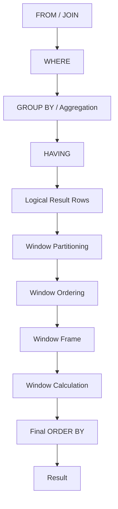
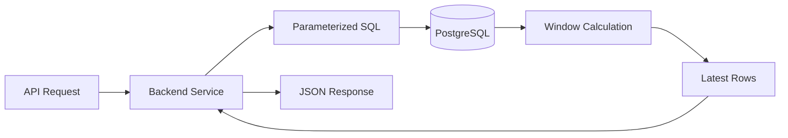

# 02- Window Function Mental Model

## Overview

A window function becomes much easier to reason about once its execution model is clear:

> **Start with the rows produced by the query, divide them into logical windows, order each window when required, define the frame when relevant, and calculate a value for each current row.**

The most important mental distinction is between **row reduction** and **row annotation**:

```text
GROUP BY
Rows ──► Groups ──► One result row per group

Window Function
Rows ──► Windows ──► One result row per input row
                       + calculated value
```

For backend engineering, this mental model is more important than memorizing individual functions. Once the model is understood, functions such as `ROW_NUMBER()`, `RANK()`, `LAG()`, `LEAD()`, `SUM()`, and `AVG()` become variations of the same mechanism.

## The Core Mental Model

Consider:

```sql
SELECT
    id,
    customer_id,
    amount,
    SUM(amount) OVER (
        PARTITION BY customer_id
    ) AS customer_total
FROM orders;
```

Think about the query in these stages:

```text
1. Produce the input rows
          │
          ▼
2. Partition rows by customer_id
          │
          ▼
3. For each row, identify its window
          │
          ▼
4. Calculate SUM(amount) across that window
          │
          ▼
5. Attach the calculated value to the current row
```

The original rows are not removed.

For:

```text
id | customer_id | amount
---+-------------+-------
1  | 10          | 100
2  | 10          | 250
3  | 20          | 500
```

the result is conceptually:

```text
id | customer_id | amount | customer_total
---+-------------+--------+---------------
1  | 10          | 100    | 350
2  | 10          | 250    | 350
3  | 20          | 500    | 500
```

The window function answers:

> "What value should this row receive based on a related set of rows?"

## Window Functions Do Not Create Groups in the Result

`PARTITION BY` can look similar to `GROUP BY`, but they have fundamentally different semantics.

### `GROUP BY`

```sql
SELECT
    customer_id,
    SUM(amount) AS customer_total
FROM orders
GROUP BY customer_id;
```

The result has one row per customer.

### Window Function

```sql
SELECT
    id,
    customer_id,
    amount,
    SUM(amount) OVER (
        PARTITION BY customer_id
    ) AS customer_total
FROM orders;
```

The result retains every order.

This distinction can be summarized as:

| Question | `GROUP BY` | Window Function |
|---|---|---|
| Creates logical groups? | Yes | Yes, through partitions |
| Collapses rows? | Yes | No |
| Keeps current row? | No | Yes |
| Calculates across related rows? | Yes | Yes |
| Supports row-to-row calculations? | No | Yes |
| Supports ranking? | No | Yes |

A useful rule is:

> **`GROUP BY` changes the grain of the result. A window function normally preserves the grain of the result.**

## The Three Layers of a Window

A production-quality mental model separates three independent concepts:

```text
                 Window Function
                       │
          ┌────────────┼────────────┐
          ▼            ▼            ▼
      Partition      Order         Frame
       "Who?"       "In what      "Which rows
                     sequence?"    exactly?"
```

Example:

```sql
SUM(amount) OVER (
    PARTITION BY customer_id
    ORDER BY created_at, id
    ROWS BETWEEN UNBOUNDED PRECEDING AND CURRENT ROW
)
```

Each component answers a different question.

### Partition

```sql
PARTITION BY customer_id
```

**Who belongs to the same independent calculation?**

### Order

```sql
ORDER BY created_at, id
```

**In what sequence should rows be considered?**

### Frame

```sql
ROWS BETWEEN UNBOUNDED PRECEDING AND CURRENT ROW
```

**Which portion of the ordered partition contributes to the current row's calculation?**

Do not mentally treat these as one feature. They solve different problems.

## Partition: "Who Is Related?"

A partition is an independent window of rows.

Given:

```text
customer_id | amount
------------+-------
101         | 100
101         | 200
101         | 300
102         | 500
102         | 700
```

this:

```sql
SUM(amount) OVER (
    PARTITION BY customer_id
)
```

creates two logical windows:

```text
Partition: customer 101
├── 100
├── 200
└── 300

Partition: customer 102
├── 500
└── 700
```

The calculation never crosses the partition boundary.

Therefore:

```text
customer 101 total = 600
customer 102 total = 1200
```

### No `PARTITION BY`

If the query is:

```sql
SUM(amount) OVER ()
```

there is one window containing the entire input:

```text
All rows
├── 100
├── 200
├── 300
├── 500
└── 700
```

Every row therefore receives the same total.

## Order: "In What Sequence?"

Ordering matters when the calculation depends on position.

For example:

```sql
LAG(amount) OVER (
    PARTITION BY customer_id
    ORDER BY created_at, id
)
```

The database needs to know:

```text
customer
   │
   ▼
order rows chronologically
   │
   ▼
current row gets previous row's amount
```

Without an ordering rule, concepts such as "previous", "next", or "first" have no meaningful sequence.

Ordering is also fundamental for ranking:

```sql
ROW_NUMBER() OVER (
    PARTITION BY department_id
    ORDER BY salary DESC, employee_id
)
```

The database can now assign positions based on salary.

## Frame: "Which Rows Participate?"

A frame is more precise than a partition.

Suppose a customer has:

```text
date | amount
-----+-------
D1   | 100
D2   | 200
D3   | 300
D4   | 400
```

A running total can use:

```sql
SUM(amount) OVER (
    PARTITION BY customer_id
    ORDER BY date
    ROWS BETWEEN UNBOUNDED PRECEDING AND CURRENT ROW
)
```

Conceptually:

```text
D1 → [D1]
D2 → [D1 D2]
D3 → [D1 D2 D3]
D4 → [D1 D2 D3 D4]
```

Result:

```text
date | amount | running_total
-----+--------+--------------
D1   | 100    | 100
D2   | 200    | 300
D3   | 300    | 600
D4   | 400    | 1000
```

The partition defines the complete customer window.

The frame defines which part of that partition contributes to the current calculation.

## Current Row Is the Anchor

A powerful way to reason about window functions is:

> **Every window calculation is evaluated relative to a current row.**

For example:

```sql
SUM(amount) OVER (
    ORDER BY created_at
    ROWS BETWEEN 2 PRECEDING AND CURRENT ROW
)
```

For each row, imagine a moving window:

```text
Row 1: [1]
Row 2: [1 2]
Row 3: [1 2 3]
Row 4:    [2 3 4]
Row 5:       [3 4 5]
```

The current row moves forward, and the frame moves with it.

This mental model is essential for understanding:

- Running totals.
- Moving averages.
- Rolling metrics.
- `LAG`.
- `LEAD`.
- Frame boundaries.

## Window Functions Preserve Row Identity

Consider:

```sql
SELECT
    id,
    amount,
    AVG(amount) OVER () AS overall_average
FROM orders;
```

Each result row still represents one order.

The calculated average is additional information:

```text
Order A ──► amount + overall average
Order B ──► amount + overall average
Order C ──► amount + overall average
```

This enables comparisons such as:

```sql
SELECT
    id,
    amount,
    AVG(amount) OVER () AS average_amount,
    amount - AVG(amount) OVER () AS difference_from_average
FROM orders;
```

The database can therefore answer:

> "How does this row compare with the population?"

without first collapsing the population.

## Window Functions as Row Context

A useful abstraction is:

```text
Current Row
     │
     ├── Its own columns
     │
     ├── Related rows
     │
     ├── Position within partition
     │
     └── Aggregate/statistical information
```

The window provides context around the current row.

For example:

```sql
SELECT
    id,
    customer_id,
    amount,
    SUM(amount) OVER (
        PARTITION BY customer_id
    ) AS customer_total,
    AVG(amount) OVER (
        PARTITION BY customer_id
    ) AS customer_average,
    ROW_NUMBER() OVER (
        PARTITION BY customer_id
        ORDER BY created_at DESC, id DESC
    ) AS customer_order_number
FROM orders;
```

One row can simultaneously know:

- Its own amount.
- The customer's total.
- The customer's average.
- Its position among that customer's orders.

This is the core power of window functions.

## A Practical Execution Model

The exact physical execution plan is optimizer-dependent, but a useful logical model is:



This is a **mental model**, not a promise about the database's physical execution order.

A PostgreSQL execution plan may use sorts, indexes, incremental sorting, hashing, materialization, or other mechanisms depending on the query and data.

The important semantic idea is that window functions operate on the query's established row set rather than directly on the raw base table.

## Window `ORDER BY` vs Final `ORDER BY`

These are separate.

Consider:

```sql
SELECT
    id,
    amount,
    ROW_NUMBER() OVER (
        ORDER BY amount DESC
    ) AS rank_position
FROM orders
ORDER BY created_at DESC;
```

There are two different ordering requirements:

```text
Window ORDER BY
amount DESC
    │
    ▼
Determines row_number

Final ORDER BY
created_at DESC
    │
    ▼
Determines returned row order
```

Therefore, the first row returned by the query does not necessarily have `rank_position = 1`.

If the API contract requires a specific output order, specify the final `ORDER BY` explicitly.

## Partitioning and Final Ordering Are Independent

Consider:

```sql
SELECT
    customer_id,
    amount,
    ROW_NUMBER() OVER (
        PARTITION BY customer_id
        ORDER BY amount DESC
    ) AS customer_rank
FROM orders
ORDER BY customer_id, customer_rank;
```

The window creates a ranking independently for every customer.

The final `ORDER BY` then organizes the complete result.

Conceptually:

```text
Customer 101
├── rank 1
├── rank 2
└── rank 3

Customer 102
├── rank 1
└── rank 2
```

The rank resets because the partition changes.

## Why `ROW_NUMBER()` Is Easy to Understand

`ROW_NUMBER()` is a useful first mental model because it demonstrates partitioning and ordering without frame complexity.

```sql
ROW_NUMBER() OVER (
    PARTITION BY customer_id
    ORDER BY created_at DESC, id DESC
)
```

Read it as:

> "For each customer, order their rows from newest to oldest and assign each row a unique position."

For:

```text
customer_id | created_at | id
------------+------------+---
101         | D3         | 7
101         | D2         | 5
101         | D2         | 4
102         | D4         | 9
```

the result is:

```text
customer_id | id | row_number
------------+----+-----------
101         | 7  | 1
101         | 5  | 2
101         | 4  | 3
102         | 9  | 1
```

The ranking restarts for each partition.

## `RANK()` and `DENSE_RANK()` in the Same Model

The partition and ordering model stays the same.

Only the ranking rule changes.

```sql
SELECT
    employee_id,
    department_id,
    salary,
    ROW_NUMBER() OVER (
        PARTITION BY department_id
        ORDER BY salary DESC
    ) AS row_number,
    RANK() OVER (
        PARTITION BY department_id
        ORDER BY salary DESC
    ) AS rank,
    DENSE_RANK() OVER (
        PARTITION BY department_id
        ORDER BY salary DESC
    ) AS dense_rank
FROM employees;
```

For salaries:

```text
100000
100000
90000
80000
```

the results are:

| Salary | `ROW_NUMBER()` | `RANK()` | `DENSE_RANK()` |
|---:|---:|---:|---:|
| 100000 | 1 | 1 | 1 |
| 100000 | 2 | 1 | 1 |
| 90000 | 3 | 3 | 2 |
| 80000 | 4 | 4 | 3 |

The window definition establishes the population and ordering. The function determines how the position is calculated.

## `LAG()` and `LEAD()` Mental Model

`LAG()` and `LEAD()` are best understood as row navigation.

```sql
LAG(amount) OVER (
    PARTITION BY customer_id
    ORDER BY created_at, id
)
```

means:

> "Within this customer's ordered rows, give me the value from an earlier row."

`LEAD()` means:

> "Give me the value from a later row."

For:

```text
D1 | 100
D2 | 200
D3 | 350
```

`LAG()` produces:

```text
D1 | 100 | NULL
D2 | 200 | 100
D3 | 350 | 200
```

while `LEAD()` produces:

```text
D1 | 100 | 200
D2 | 200 | 350
D3 | 350 | NULL
```

The first and last rows naturally have no preceding or following row.

## Window Aggregates as Contextual Aggregates

A normal aggregate answers:

> "What is the value for this group?"

A window aggregate answers:

> "What is the value for the relevant group or frame, and attach it to this row?"

For example:

```sql
SELECT
    id,
    department_id,
    salary,
    MAX(salary) OVER (
        PARTITION BY department_id
    ) AS department_max_salary
FROM employees;
```

Each employee receives the maximum salary for their department.

This enables:

```sql
SELECT
    id,
    department_id,
    salary,
    MAX(salary) OVER (
        PARTITION BY department_id
    ) - salary AS gap_to_department_max
FROM employees;
```

The calculation combines **row-level information** with **group-level context**.

## Filtering Window Results

A common mistake is to write:

```sql
SELECT
    id,
    customer_id,
    ROW_NUMBER() OVER (
        PARTITION BY customer_id
        ORDER BY created_at DESC
    ) AS rn
FROM orders
WHERE rn = 1;
```

The window result is not available to the `WHERE` clause at the same query level.

Instead:

```sql
WITH ranked_orders AS (
    SELECT
        id,
        customer_id,
        created_at,
        ROW_NUMBER() OVER (
            PARTITION BY customer_id
            ORDER BY created_at DESC, id DESC
        ) AS rn
    FROM orders
)
SELECT
    id,
    customer_id,
    created_at
FROM ranked_orders
WHERE rn = 1;
```

The CTE creates a new relational level where `rn` is now an ordinary column that can be filtered.

This is a major practical pattern:

```text
Base rows
   │
   ▼
Window calculation
   │
   ▼
New query level
   │
   ▼
Filter / join / aggregate
```

## Window Functions and Query Grain

Before writing a window query, identify the **grain** of the input rows.

For example:

```text
orders
→ one row per order
```

If the query joins another table and accidentally creates:

```text
one row per order-item
```

the window function operates on that new row set.

This can produce incorrect totals or rankings.

For example:

```sql
SELECT
    o.id,
    o.customer_id,
    SUM(o.amount) OVER (
        PARTITION BY o.customer_id
    ) AS customer_total
FROM orders AS o
JOIN order_items AS oi
    ON oi.order_id = o.id;
```

If an order has five items, that join can produce five rows for the same order. The window now sees five copies of the order.

A senior engineer therefore asks:

> **What does one input row represent at the point where the window function executes?**

This question often catches correctness bugs before performance tuning begins.

## Multiple Windows in One Query

A query can define multiple independent windows.

```sql
SELECT
    id,
    customer_id,
    amount,
    SUM(amount) OVER (
        PARTITION BY customer_id
    ) AS customer_total,
    AVG(amount) OVER (
        PARTITION BY customer_id
    ) AS customer_average,
    ROW_NUMBER() OVER (
        PARTITION BY customer_id
        ORDER BY created_at DESC, id DESC
    ) AS latest_rank
FROM orders;
```

Each function has its own window definition.

The database optimizer may share work between compatible window specifications, but you should reason about them semantically first and verify physical performance with `EXPLAIN`.

## Named Windows

When multiple calculations use the same window definition, SQL can define a named window.

```sql
SELECT
    id,
    customer_id,
    amount,
    SUM(amount) OVER customer_window AS customer_total,
    AVG(amount) OVER customer_window AS customer_average
FROM orders
WINDOW customer_window AS (
    PARTITION BY customer_id
);
```

This improves readability and reduces duplicated window definitions.

For more complex queries, named windows can make the analytical intent much easier to audit.

## A Senior-Level Mental Model

When reviewing a window query, walk through these questions in order:

### What is the input row?

Determine the row grain after:

- `FROM`
- `JOIN`
- `WHERE`
- `GROUP BY`, if present

### What is the partition?

Ask:

> Which rows should be treated as one independent analytical population?

Examples:

```sql
PARTITION BY customer_id
```

or:

```sql
PARTITION BY organization_id, customer_id
```

### What is the ordering?

Ask:

> Does the calculation depend on row position?

If yes, define the ordering explicitly.

For production correctness, include stable tie-breakers when required:

```sql
ORDER BY created_at DESC, id DESC
```

### What is the frame?

Ask:

> Does the calculation operate on the entire partition or only a subset around the current row?

This is especially important for:

- Running totals.
- Moving averages.
- Time-series calculations.
- `FIRST_VALUE()`.
- `LAST_VALUE()`.

### What is the output grain?

Confirm that the window operation has not changed the expected row representation.

### Where will the result be consumed?

Determine whether the window value will be:

- Returned directly.
- Filtered by an outer query.
- Joined with another relation.
- Aggregated again.
- Used by application code.

## Window Functions in Backend APIs

A common backend use case is returning the latest record for each entity.

Suppose a REST endpoint needs the latest status event for every order.

A naive application approach might:

1. Fetch all events.
2. Group events in Python.
3. Sort each group.
4. Select the newest event.

A database approach can use:

```sql
WITH ranked_events AS (
    SELECT
        id,
        order_id,
        status,
        created_at,
        ROW_NUMBER() OVER (
            PARTITION BY order_id
            ORDER BY created_at DESC, id DESC
        ) AS rn
    FROM order_status_events
)
SELECT
    id,
    order_id,
    status,
    created_at
FROM ranked_events
WHERE rn = 1;
```

The important architectural boundary is:



The database performs a relational operation close to the data, while the application remains responsible for authorization, domain behavior, response formatting, and orchestration.

## Performance Mental Model

Window functions are not inherently slow.

Their cost depends on:

- Number of input rows.
- Number and size of partitions.
- Ordering requirements.
- Frame requirements.
- Number of window specifications.
- Row width.
- Available memory.
- Indexes and physical data layout.
- Concurrent workload.
- Database optimizer behavior.

A useful conceptual model is:

```text
More rows
   +
More expensive ordering
   +
Large partitions
   +
Wide rows
   ↓
Higher window execution cost
```

Do not optimize based on the presence of `OVER()` alone.

Use actual execution plans:

```sql
EXPLAIN (ANALYZE, BUFFERS)
SELECT
    ...
FROM ...;
```

For PostgreSQL, inspect operations such as:

- `Sort`.
- `Incremental Sort`.
- `WindowAgg`.
- Temporary file usage.
- Actual row counts.
- Memory and I/O behavior.

## Deterministic Ordering

Window functions frequently appear in correctness-sensitive queries.

Avoid:

```sql
ROW_NUMBER() OVER (
    PARTITION BY customer_id
    ORDER BY created_at DESC
)
```

when multiple records can have the same timestamp and the application expects one deterministic winner.

Prefer:

```sql
ROW_NUMBER() OVER (
    PARTITION BY customer_id
    ORDER BY created_at DESC, id DESC
)
```

The unique `id` provides a stable tie-breaker.

This is particularly important for:

- Latest-record queries.
- Deduplication.
- Top-N queries.
- Event processing.
- Pagination.
- Data migrations.

## Common Mistakes

| Mistake | Consequence | Better Mental Model |
|---|---|---|
| Treating `PARTITION BY` like `GROUP BY` | Expecting rows to disappear | Partitions define analytical populations |
| Ignoring input grain | Duplicate rows corrupt calculations | Identify what one input row represents |
| Assuming window ordering controls final output | API returns unexpected ordering | Window and final `ORDER BY` are separate |
| Using unstable ordering | Results can change between executions | Add deterministic tie-breakers |
| Ignoring frame semantics | Running or rolling calculations are incorrect | Distinguish partition from frame |
| Filtering a window alias in `WHERE` | Query is invalid | Use another query level |
| Joining before a window without checking cardinality | Values can be multiplied | Validate join cardinality first |
| Assuming indexes guarantee no sort | Incorrect performance assumptions | Verify the actual plan |
| Creating very large partitions | High CPU, memory, or I/O usage | Analyze data distribution |
| Processing huge analytical workloads on OLTP tables | Production contention | Consider summaries or analytical infrastructure |

## Interview Traps

### Does `PARTITION BY` reduce rows?

No.

It defines independent windows while normally preserving the input rows.

### Is `PARTITION BY` required?

No.

Without it, the window can contain the entire applicable result set.

### Is `ORDER BY` required?

It depends on the function and desired semantics.

Ranking and navigation functions generally require meaningful ordering. Aggregate window functions can operate without ordering when the entire partition is the intended window.

### Does window `ORDER BY` determine result ordering?

No.

The final result ordering must be specified separately.

### Does a window function execute once for the entire query?

Conceptually, it evaluates a window value relative to each applicable row. Different partitions and frames determine which rows contribute to each calculation.

### What is the difference between partition and frame?

A **partition** defines the complete logical population.

A **frame** defines the subset of that population considered for the current row.

```text
Partition
┌───────────────────────────────────┐
│ Row 1  Row 2  Row 3  Row 4  Row 5 │
│          └── Frame ──┘            │
└───────────────────────────────────┘
                  ▲
             Current row
```

## Production Review Checklist

Before shipping a window-function query, verify:

- [ ] The input row grain is explicitly understood.
- [ ] Joins do not unexpectedly multiply rows.
- [ ] `PARTITION BY` matches the business boundary.
- [ ] Window `ORDER BY` matches the required semantics.
- [ ] Tie-breaking is deterministic where correctness requires it.
- [ ] Frame semantics are understood for ordered aggregates.
- [ ] Final output ordering is explicitly defined when required.
- [ ] Window results are filtered at the correct query level.
- [ ] Tenant and authorization predicates are applied correctly.
- [ ] Large partitions and skewed data have been considered.
- [ ] `EXPLAIN (ANALYZE, BUFFERS)` has been reviewed for critical queries.
- [ ] Production-scale data and realistic concurrency have been tested.

## Key Takeaways

- **Think of a window function as row-level output enriched with context from related rows; unlike `GROUP BY`, it normally preserves the input row grain.**
- **Separate the concepts of partition, order, and frame: partition defines the population, order defines sequence, and frame defines the rows participating for the current row.**
- **Always identify the query's input grain before applying a window function, especially after joins, because incorrect cardinality produces incorrect analytical results.**
- **Window `ORDER BY` controls calculation semantics, not final result order; use deterministic tie-breakers and a separate final `ORDER BY` when required.**
- **For production queries, reason about correctness first and validate performance with actual execution plans, partition sizes, row counts, and realistic workload data.**