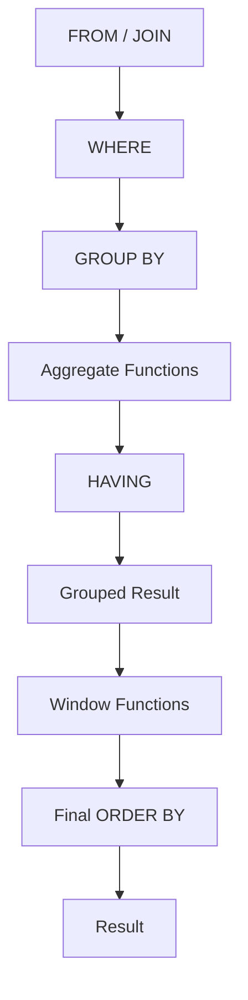

# 03- Aggregate vs Window Functions

## Overview

Aggregate functions and window functions can both calculate values such as `SUM()`, `AVG()`, `MIN()`, and `MAX()`, but they solve fundamentally different problems.

The key distinction is **result-set grain**:

- An aggregate used with `GROUP BY` combines multiple input rows into fewer result rows.
- A window function calculates across related rows while normally preserving the current row.
- The same aggregate function, such as `SUM()`, can therefore behave very differently depending on whether it is used as a grouped aggregate or as a window function.

```text
Aggregate
Input rows
    │
    ▼
GROUP BY
    │
    ▼
Groups
    │
    ▼
One result row per group


Window function
Input rows
    │
    ▼
Window / Partition
    │
    ▼
Calculation for each current row
    │
    ▼
Original rows + calculated value
```

This distinction is central to reporting, analytics, ranking, dashboards, financial calculations, and backend APIs.

## The Fundamental Difference

Consider an `orders` table:

```text
id | customer_id | amount
---+-------------+-------
1  | 101         | 100
2  | 101         | 250
3  | 102         | 400
4  | 102         | 150
```

### Aggregate Function

```sql
SELECT
    customer_id,
    SUM(amount) AS customer_total
FROM orders
GROUP BY customer_id;
```

Result:

```text
customer_id | customer_total
------------+---------------
101         | 350
102         | 550
```

The two orders for customer `101` become one result row.

### Window Function

```sql
SELECT
    id,
    customer_id,
    amount,
    SUM(amount) OVER (
        PARTITION BY customer_id
    ) AS customer_total
FROM orders;
```

Result:

```text
id | customer_id | amount | customer_total
---+-------------+--------+---------------
1  | 101         | 100    | 350
2  | 101         | 250    | 350
3  | 102         | 400    | 550
4  | 102         | 150    | 550
```

Every order remains visible.

The window function adds contextual information to each row.

## Result-Set Grain

The most useful question to ask before choosing between the two is:

> **What should one result row represent?**

| Requirement | Appropriate approach |
|---|---|
| One row per customer | `GROUP BY` |
| One row per department | `GROUP BY` |
| One row per order with customer total | Window function |
| One row per employee with department average | Window function |
| One row per transaction with running balance | Window function |
| One row per customer with total lifetime spend | Aggregate |
| Top 3 orders per customer while retaining order details | Window function |
| Monthly revenue report with one row per month | Aggregate |
| Compare each order with customer average | Window function |

A strong SQL design starts by identifying the desired output grain.

## Aggregates Reduce Rows

A grouped aggregate changes the shape of the result.

```sql
SELECT
    department_id,
    COUNT(*) AS employee_count,
    AVG(salary) AS average_salary
FROM employees
GROUP BY department_id;
```

The input might contain thousands of employees, while the output contains one row per department.

Conceptually:

```text
Employees
├── Employee A ─┐
├── Employee B  │
├── Employee C  ├── Department 10 ──► one result row
└── Employee D ─┘

├── Employee E ─┐
├── Employee F  ├── Department 20 ──► one result row
└── Employee G ─┘
```

This is appropriate when the group itself is the desired business entity.

## Window Functions Preserve Rows

A window aggregate does not normally change the result grain.

```sql
SELECT
    employee_id,
    department_id,
    salary,
    AVG(salary) OVER (
        PARTITION BY department_id
    ) AS department_average
FROM employees;
```

Each employee remains a result row.

The database effectively provides each employee with additional context:

```text
Employee
   │
   ├── Own salary
   │
   └── Department average
```

This makes window functions particularly useful when the application needs both:

1. Row-level information.
2. Group-level information.

## Same Aggregate, Different Semantics

The following functions can be used both as grouped aggregates and as window functions:

- `SUM()`
- `AVG()`
- `MIN()`
- `MAX()`
- `COUNT()`

The syntax changes from:

```sql
SUM(amount)
```

to:

```sql
SUM(amount) OVER (...)
```

but the important difference is the context in which the calculation is applied.

### Grouped Aggregate

```sql
SELECT
    customer_id,
    SUM(amount) AS total
FROM orders
GROUP BY customer_id;
```

Question:

> What is the total for each customer?

### Window Aggregate

```sql
SELECT
    id,
    customer_id,
    amount,
    SUM(amount) OVER (
        PARTITION BY customer_id
    ) AS total
FROM orders;
```

Question:

> What is the customer's total for this order's customer, while still returning the order?

That difference is more important than the function name itself.

## Aggregate vs Window Function Comparison

| Characteristic | Aggregate + `GROUP BY` | Window Function |
|---|---|---|
| Primary purpose | Summarize groups | Add analytical context |
| Result rows | Usually fewer | Usually same as input |
| Changes result grain | Yes | No |
| `PARTITION BY` | No | Yes |
| Window `ORDER BY` | No | Yes |
| Frame | No | Sometimes relevant |
| Ranking | No | Yes |
| `LAG()` / `LEAD()` | No | Yes |
| Running totals | Awkward | Natural |
| Row-to-row comparison | Awkward | Natural |
| Group-level context per row | Requires join/subquery | Natural |
| Typical use | Reports and summaries | Analytics and row-level enrichment |

## When `GROUP BY` Is the Better Choice

Use aggregation when the grouped result is the actual desired output.

For example, an API endpoint returning revenue by customer:

```sql
SELECT
    customer_id,
    SUM(amount) AS lifetime_revenue
FROM orders
WHERE status = 'completed'
GROUP BY customer_id;
```

There is no reason to preserve individual orders if the API contract is:

```json
[
  {
    "customer_id": 101,
    "lifetime_revenue": 350
  },
  {
    "customer_id": 102,
    "lifetime_revenue": 550
  }
]
```

Using a window function here would unnecessarily retain rows.

## When a Window Function Is the Better Choice

Use a window function when the result needs both the current row and information derived from related rows.

For example:

```sql
SELECT
    id,
    customer_id,
    amount,
    SUM(amount) OVER (
        PARTITION BY customer_id
    ) AS customer_total
FROM orders;
```

This supports an API response such as:

```json
{
  "order_id": 42,
  "amount": 250,
  "customer_total": 1450
}
```

The application gets both the order and its customer's aggregate context in one relational query.

## Grouped Aggregate Followed by a Join

Before window functions became widely available, a common way to combine row-level data with aggregates was to calculate the aggregate separately and join it back.

```sql
SELECT
    o.id,
    o.customer_id,
    o.amount,
    totals.customer_total
FROM orders AS o
JOIN (
    SELECT
        customer_id,
        SUM(amount) AS customer_total
    FROM orders
    GROUP BY customer_id
) AS totals
    ON totals.customer_id = o.customer_id;
```

A window function expresses the same intent more directly:

```sql
SELECT
    id,
    customer_id,
    amount,
    SUM(amount) OVER (
        PARTITION BY customer_id
    ) AS customer_total
FROM orders;
```

The window version often improves readability because the relationship between the current row and the aggregate is explicit.

However, do not assume the window form is always faster. The optimizer and execution plan determine actual performance.

## Window Functions Enable Row-Level Comparisons

A grouped aggregate loses the individual rows unless they are separately retained.

A window function allows direct comparisons.

For example:

```sql
SELECT
    id,
    customer_id,
    amount,
    AVG(amount) OVER (
        PARTITION BY customer_id
    ) AS customer_average,
    amount - AVG(amount) OVER (
        PARTITION BY customer_id
    ) AS difference_from_average
FROM orders;
```

Conceptually:

```text
Order amount
     │
     ├── Customer average
     │
     └── Difference from average
```

This pattern is useful for:

- Outlier detection.
- Customer behavior analysis.
- Performance dashboards.
- Financial analysis.
- Operational metrics.

## Ranking: A Window-Only Pattern

Grouped aggregates cannot naturally answer:

> "What position does this row occupy within its group?"

Window functions can:

```sql
SELECT
    employee_id,
    department_id,
    salary,
    ROW_NUMBER() OVER (
        PARTITION BY department_id
        ORDER BY salary DESC, employee_id
    ) AS salary_position
FROM employees;
```

Result:

```text
department | employee | salary | position
-----------+----------+--------+---------
10         | 7        | 150000 | 1
10         | 4        | 120000 | 2
10         | 9        | 100000 | 3
20         | 8        | 140000 | 1
20         | 2        | 110000 | 2
```

The rank resets at each partition boundary.

This is one reason window functions are essential for top-N-per-group queries.

## Running Totals

A grouped aggregate can calculate a total for a group, but a running total requires an ordered relationship between rows.

A window function expresses this directly:

```sql
SELECT
    account_id,
    transaction_id,
    created_at,
    amount,
    SUM(amount) OVER (
        PARTITION BY account_id
        ORDER BY created_at, transaction_id
        ROWS BETWEEN UNBOUNDED PRECEDING AND CURRENT ROW
    ) AS running_balance
FROM transactions;
```

Conceptually:

```text
Transaction 1 → [1]
Transaction 2 → [1, 2]
Transaction 3 → [1, 2, 3]
Transaction 4 → [1, 2, 3, 4]
```

The calculation is anchored to each current row.

## Row-to-Row Comparisons

Aggregates do not naturally express "previous row" or "next row."

Window functions do:

```sql
SELECT
    id,
    customer_id,
    created_at,
    amount,
    LAG(amount) OVER (
        PARTITION BY customer_id
        ORDER BY created_at, id
    ) AS previous_amount
FROM orders;
```

The result preserves each order while providing access to the previous order in the customer's sequence.

This enables calculations such as:

```sql
SELECT
    id,
    customer_id,
    amount,
    amount - LAG(amount) OVER (
        PARTITION BY customer_id
        ORDER BY created_at, id
    ) AS change_from_previous
FROM orders;
```

## Combining `GROUP BY` and Window Functions

The two techniques are not mutually exclusive.

They can be used together when the query has multiple analytical levels.

For example, calculate monthly revenue first:

```sql
SELECT
    DATE_TRUNC('month', created_at) AS month,
    SUM(amount) AS monthly_revenue,
    SUM(SUM(amount)) OVER (
        ORDER BY DATE_TRUNC('month', created_at)
    ) AS cumulative_revenue
FROM orders
WHERE status = 'completed'
GROUP BY DATE_TRUNC('month', created_at)
ORDER BY month;
```

The conceptual pipeline is:

```text
Individual orders
       │
       ▼
GROUP BY month
       │
       ▼
Monthly revenue rows
       │
       ▼
Window function
       │
       ▼
Cumulative revenue
```

The window function operates on the grouped result at the appropriate query level.

This is a critical senior-level concept:

> **A window function does not necessarily operate directly on base-table rows; it operates on the rows produced by the applicable query level.**

## Query Grain Is the Critical Design Variable

Consider:

```sql
SELECT
    department_id,
    COUNT(*) AS employee_count,
    AVG(COUNT(*)) OVER () AS average_department_size
FROM employees
GROUP BY department_id;
```

The `GROUP BY` first produces:

```text
department 10 → 20 employees
department 20 → 30 employees
department 30 → 40 employees
```

The window function then sees those three grouped rows:

```text
20
30
40
```

and calculates their average:

```text
30
```

The query therefore contains two analytical levels:

```text
Employees
    │
    ▼
GROUP BY department
    │
    ▼
One row per department
    │
    ▼
Window calculation
    │
    ▼
Average across departments
```

This pattern is extremely useful for advanced reporting.

## Logical Processing Mental Model

A practical semantic model is:



This is a logical model, not a physical execution plan.

The database optimizer is free to transform the physical execution as long as the semantics are preserved.

The important implication is that a window function can operate over the rows produced by grouping.

## Filtering Aggregate Results vs Window Results

Grouped aggregates can be filtered using `HAVING`:

```sql
SELECT
    customer_id,
    SUM(amount) AS customer_total
FROM orders
GROUP BY customer_id
HAVING SUM(amount) > 1000;
```

Window-function results generally require another query level if they need filtering.

```sql
WITH ranked_orders AS (
    SELECT
        id,
        customer_id,
        amount,
        ROW_NUMBER() OVER (
            PARTITION BY customer_id
            ORDER BY amount DESC, id
        ) AS rn
    FROM orders
)
SELECT
    id,
    customer_id,
    amount
FROM ranked_orders
WHERE rn <= 3;
```

The difference follows from query semantics:

```text
GROUP BY aggregate
       │
       └── HAVING can filter grouped results

Window function
       │
       └── calculate first
              │
              ▼
          outer query
              │
              └── filter
```

## Production Backend Example

Suppose a Django or FastAPI service exposes an endpoint showing customer orders and their percentage of total customer spending.

A window query can calculate the required values without fetching all orders into Python:

```sql
SELECT
    id,
    customer_id,
    amount,
    SUM(amount) OVER (
        PARTITION BY customer_id
    ) AS customer_total,
    ROUND(
        100.0 * amount
        / NULLIF(
            SUM(amount) OVER (PARTITION BY customer_id),
            0
        ),
        2
    ) AS percentage_of_customer_total
FROM orders
WHERE status = 'completed';
```

The application receives already-computed relational information instead of:

```text
PostgreSQL
   │
   ▼
All orders
   │
   ▼
Python process
   │
   ├── Group
   ├── Sum
   ├── Calculate percentages
   └── Build response
```

For large datasets, pushing set-based calculations into the database can reduce application memory usage and network transfer.

The query still needs to be validated with realistic data and `EXPLAIN (ANALYZE, BUFFERS)`.

## Performance Considerations

Neither approach is universally faster.

A grouped aggregate can reduce rows early:

```text
Millions of rows
      │
      ▼
GROUP BY
      │
      ▼
Thousands of groups
```

This can be highly efficient when only group-level results are required.

A window function normally retains the input rows:

```text
Millions of rows
      │
      ▼
Window calculation
      │
      ▼
Millions of rows
```

The database may need significant work for partitioning and ordering.

Performance depends on:

- Input cardinality.
- Partition size.
- Sort requirements.
- Indexes.
- Join cardinality.
- Row width.
- Number of window expressions.
- Memory available to the database.
- Data distribution.
- Query concurrency.

For critical PostgreSQL queries:

```sql
EXPLAIN (ANALYZE, BUFFERS)
SELECT
    ...
FROM ...;
```

Do not replace a window function with a grouped aggregate merely because the latter looks simpler. First establish the required result grain, then measure the chosen query.

## Indexing and Ordering

Window functions that require ordering may trigger expensive sorts.

For example:

```sql
ROW_NUMBER() OVER (
    PARTITION BY customer_id
    ORDER BY created_at DESC, id DESC
)
```

may benefit from an index aligned with the access pattern, depending on the rest of the query and PostgreSQL's chosen plan.

A candidate index might be:

```sql
CREATE INDEX idx_orders_customer_created
ON orders (customer_id, created_at DESC, id DESC);
```

However, indexes are not automatic guarantees of faster window execution.

Consider:

- Whether the query filters by other columns.
- Whether the planner can exploit the index ordering.
- Selectivity.
- Table size.
- Visibility and heap access.
- Whether sorting remains cheaper.
- Write overhead caused by the index.

Always validate with the actual execution plan.

## Memory and Large Partitions

Window calculations can become expensive when partitions are large.

For example:

```sql
SUM(amount) OVER (
    PARTITION BY organization_id
)
```

may create very large logical partitions in a multi-tenant SaaS database.

Potential consequences include:

- Higher memory consumption.
- Expensive sorting.
- Temporary disk I/O.
- Increased query latency.
- Contention with OLTP workloads.

Production mitigation may include:

- Filtering unnecessary rows early.
- Selecting only required columns.
- Avoiding accidental join multiplication.
- Using appropriate indexes.
- Pre-aggregating when exact row-level context is unnecessary.
- Moving heavy analytics to a separate workload when appropriate.
- Monitoring temporary-file and sort behavior.

## Common Mistakes

### Using a Window Function When Only a Summary Is Required

Avoid:

```sql
SELECT
    customer_id,
    SUM(amount) OVER (
        PARTITION BY customer_id
    )
FROM orders;
```

if the API only needs one row per customer.

Use:

```sql
SELECT
    customer_id,
    SUM(amount) AS customer_total
FROM orders
GROUP BY customer_id;
```

Preserving unnecessary rows increases data processing and transfer.

### Using `GROUP BY` When Row-Level Data Is Required

Avoid:

```sql
SELECT
    customer_id,
    AVG(amount)
FROM orders
GROUP BY customer_id;
```

if the application also needs every order.

The individual order rows have been collapsed.

Use a window aggregate when the row-level data must remain available.

### Assuming Window Functions Always Replace `GROUP BY`

They solve different problems.

A window function is not simply a "better `GROUP BY`."

The correct choice depends on the desired result grain.

### Ignoring Join Multiplication

Suppose:

```sql
orders
JOIN order_items
```

creates multiple rows per order.

A window aggregate over `orders.amount` can then count the same order multiple times.

Validate the row grain before applying either aggregation strategy.

### Confusing Window `ORDER BY` with Final `ORDER BY`

This:

```sql
ROW_NUMBER() OVER (
    ORDER BY amount DESC
)
```

does not guarantee the final result is returned in descending amount order.

Use:

```sql
ORDER BY amount DESC;
```

separately when required.

### Assuming Identical SQL Always Has Identical Performance

A grouped aggregate and a window aggregate can produce similar values while having very different execution strategies.

Use execution plans rather than intuition.

## Decision Framework

Use this sequence when deciding between aggregate and window functions:

```text
What should one output row represent?
             │
             ├── A group?
             │      │
             │      └── GROUP BY / aggregate
             │
             └── An original row?
                    │
                    ├── Need group context?
                    │       └── Window function
                    │
                    ├── Need ranking?
                    │       └── Window function
                    │
                    ├── Need previous/next row?
                    │       └── Window function
                    │
                    └── Need running/rolling calculation?
                            └── Window function
```

Then validate:

1. Input row grain.
2. Required partition.
3. Required ordering.
4. Required frame.
5. Join cardinality.
6. Expected output size.
7. Execution plan.

## Production Review Checklist

Before shipping a query involving aggregates or windows:

- [ ] Define the expected output grain.
- [ ] Verify whether rows should be collapsed or preserved.
- [ ] Check joins for accidental row multiplication.
- [ ] Use `GROUP BY` when group-level rows are the intended result.
- [ ] Use window functions when row-level context is required.
- [ ] Define deterministic window ordering when row position matters.
- [ ] Validate frame semantics for running or rolling calculations.
- [ ] Filter window results at the appropriate query level.
- [ ] Check partition cardinality and data skew.
- [ ] Review `EXPLAIN (ANALYZE, BUFFERS)` for critical queries.
- [ ] Test with production-scale data rather than small development fixtures.
- [ ] Avoid moving large analytical datasets into Python merely because SQL is more complex.

## Key Takeaways

- **`GROUP BY` aggregates reduce the result to the requested group grain, while window functions normally preserve rows and add analytical context.**
- **The deciding question is the desired output grain: if one row per group is required, aggregate; if original rows must remain visible, consider a window function.**
- **The same functions such as `SUM()`, `AVG()`, and `COUNT()` have different semantics when used as grouped aggregates versus window functions.**
- **`GROUP BY` and window functions can be combined: grouping can establish an intermediate grain, after which a window function can perform another analytical calculation.**
- **For production workloads, validate row cardinality, partition size, ordering, and actual execution plans rather than assuming one approach is inherently faster.**